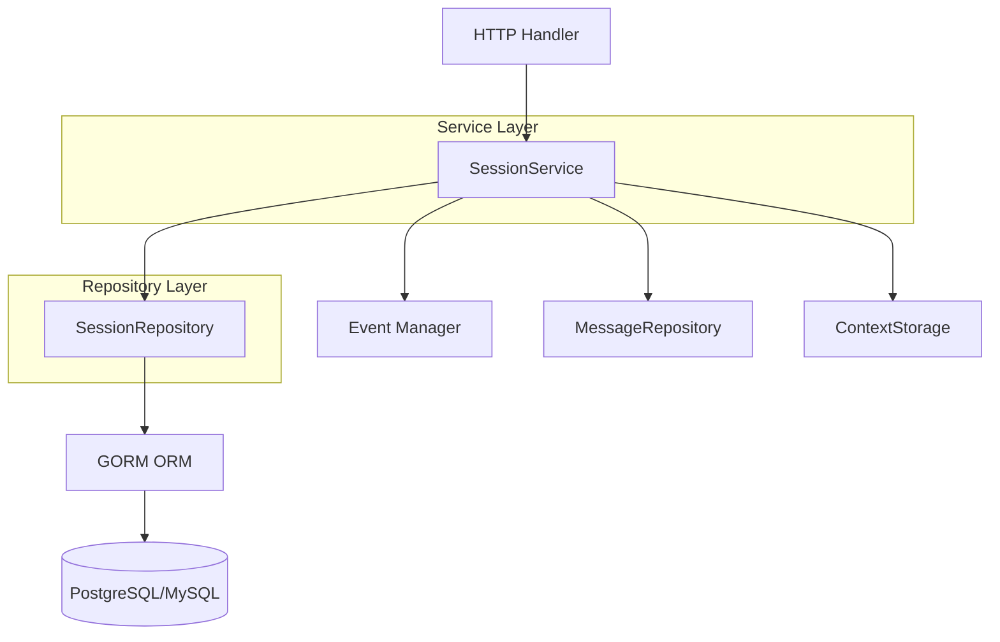

# Session Conversation Record Persistence

## 概述

想象你正在运营一个多租户的对话系统 —— 每个租户（企业/组织）都有成百上千的用户在与 AI 助手进行对话。每次对话都是一个"会话"（Session），需要被持久化存储以便后续查询、续聊和分析。`session_conversation_record_persistence` 模块就是这个系统的"会话账本"。

这个模块的核心职责是**安全地存储和检索会话记录，同时确保租户之间的数据严格隔离**。它采用经典的 Repository 模式，将数据库操作封装在统一的接口背后，让上层服务无需关心底层存储细节。

为什么不能简单地用一个全局数据库表存储所有会话？关键在于**多租户隔离**——租户 A 绝对不能看到租户 B 的会话数据。这个模块在每一个查询中都显式携带 `tenantID` 参数，从数据访问层就杜绝了跨租户泄露的可能性。

## 架构与数据流



### 组件角色说明

**SessionRepository** 是数据访问的核心，它直接操作数据库，负责：
- 会话的 CRUD 操作
- 租户级别的数据隔离（每个查询都带 `tenant_id` 条件）
- 软删除支持（通过 `DeletedAt` 字段）

**SessionService** 是业务逻辑层，它调用 Repository 并处理：
- 会话生命周期管理（创建、更新、删除）
- 标题自动生成（异步任务）
- 知识问答和 Agent 对话的核心流程
- 上下文管理（与 `ContextStorage` 协作）

数据流向典型场景（创建会话）：
1. HTTP Handler 接收创建请求，解析出 `Session` 对象
2. 调用 `SessionService.CreateSession()`
3. Service 调用 `SessionRepository.Create()`
4. Repository 设置时间戳，通过 GORM 写入数据库
5. 返回带有生成 ID 的完整 Session 对象

## 核心组件详解

### SessionRepository

**设计意图**：Repository 模式的核心实现，将数据库操作抽象为面向领域的接口。上层服务看到的是"创建会话"、"获取会话"这样的业务语言，而不是 SQL 语句。

**内部机制**：
```go
type sessionRepository struct {
    db *gorm.DB
}
```

Repository 持有一个 GORM 数据库连接实例。所有操作都通过 `WithContext(ctx)` 传递上下文，确保：
- 请求取消时数据库查询能及时终止
- 如果存在事务上下文，操作会自动加入事务

**关键方法分析**：

#### Create
```go
func (r *sessionRepository) Create(ctx context.Context, session *types.Session) (*types.Session, error)
```

这个方法做了两件容易被忽视的事：
1. **自动设置时间戳**：`CreatedAt` 和 `UpdatedAt` 由 Repository 统一设置，而不是依赖数据库默认值。这样做的好处是 Go 代码能完全控制时间逻辑，避免数据库时区配置导致的不一致。
2. **返回带 ID 的对象**：GORM 的 `Create` 会回填主键 ID，方法直接返回修改后的 session 指针，调用方无需二次查询。

**设计权衡**：为什么时间戳不在 Service 层设置？因为时间戳是**持久化细节**，不是业务逻辑。如果未来切换到其他 ORM 或数据库，这个逻辑应该随 Repository 一起迁移，而不是散落在多个 Service 中。

#### Get
```go
func (r *sessionRepository) Get(ctx context.Context, tenantID uint64, id string) (*types.Session, error)
```

注意查询条件：`Where("tenant_id = ?", tenantID).First(&session, "id = ?", id)`

这里使用了**双重条件**——既匹配 ID 又匹配 TenantID。这是防御性编程的关键：即使调用方传入了错误的 tenantID（比如用户 A 试图访问用户 B 的会话），数据库层面也会拒绝返回数据。

**潜在陷阱**：如果 Session 不存在，GORM 返回 `gorm.ErrRecordNotFound` 错误。调用方需要显式检查这个错误来判断是"不存在"还是"数据库错误"。

#### GetPagedByTenantID
```go
func (r *sessionRepository) GetPagedByTenantID(
    ctx context.Context, tenantID uint64, page *types.Pagination,
) ([]*types.Session, int64, error)
```

这个方法采用了**两阶段查询**模式：
1. 先 `COUNT(*)` 获取总数
2. 再 `SELECT ... LIMIT OFFSET` 获取分页数据

**为什么不用单查询？** 因为前端需要显示总页数，而 PostgreSQL/MySQL 的标准分页不支持在返回数据的同时返回总数。这种设计的代价是两次数据库往返，但在数据量不大时（会话列表通常几百条）是可以接受的。

**性能考量**：当数据量达到百万级时，`OFFSET` 会导致性能下降（数据库需要扫描并跳过前面的行）。如果未来遇到这个问题，可以考虑"游标分页"（基于 `created_at` 或 ID 的范围查询）。

#### BatchDelete
```go
func (r *sessionRepository) BatchDelete(ctx context.Context, tenantID uint64, ids []string) error
```

这里有一个**静默成功**的设计：当 `ids` 为空时，直接返回 `nil` 而不执行数据库操作。这样做避免了无意义的数据库往返，但也意味着调用方无法区分"没有要删除的"和"删除成功"。在大多数场景下这不是问题，但如果业务逻辑需要区分这两种情况，调用方需要在调用前自行检查。

**软删除机制**：注意 `Delete` 操作实际上设置的是 `DeletedAt` 字段（通过 GORM 的软删除特性），而不是物理删除。这意味着：
- 已删除的会话可以通过恢复 `DeletedAt` 来找回
- 所有查询会自动过滤掉 `DeletedAt != nil` 的记录
- 如果需要物理删除，必须使用 `Unscoped()` 方法

### Session 数据模型

```go
type Session struct {
    ID          string    `gorm:"type:varchar(36);primaryKey"`
    Title       string
    Description string
    TenantID    uint64    `gorm:"index"`
    CreatedAt   time.Time
    UpdatedAt   time.Time
    DeletedAt   gorm.DeletedAt `gorm:"index"`
    Messages    []Message `gorm:"foreignKey:SessionID"`
}
```

**关键字段设计**：

- **ID 使用 UUID**：`varchar(36)` 存储 UUID 字符串，而不是自增整数。这样做的好处是 ID 不可预测（安全性），且在分布式系统中生成 ID 无需协调。代价是索引效率略低于整数。

- **TenantID 索引**：`gorm:"index"` 确保按租户查询时性能良好。没有这个索引，`GetByTenantID` 和 `GetPagedByTenantID` 会退化为全表扫描。

- **Messages 关联不存储**：注意 `Messages` 字段有 `json:"-"` 标签，意味着它不会被 JSON 序列化。这是为了避免在返回 Session 时意外泄露大量消息数据。消息应该通过独立的 `MessageRepository` 按需加载。

- **被注释掉的配置字段**：代码中有大量被注释掉的配置字段（`KnowledgeBaseID`、`MaxRounds` 等）。这反映了设计演进：早期可能计划将会话配置存储在 Session 表中，但后来改为从租户或知识库继承。这些注释是理解系统演进的线索。

## 依赖关系分析

### 被谁调用（上游）

**SessionService** (`internal.application.service.session.sessionService`) 是主要调用方：

```go
type sessionService struct {
    sessionRepo interfaces.SessionRepository
    // ... 其他依赖
}
```

Service 层依赖 Repository 接口而非具体实现，这使得：
- 可以方便地用 Mock Repository 进行单元测试
- 未来可以切换存储后端（如从 MySQL 迁移到 PostgreSQL）而不影响 Service 逻辑

**HTTP Handlers** 通过 Service 间接调用 Repository：
- `internal.handler.session.handler.Handler` 处理会话生命周期 API
- `internal.handler.session.agent_stream_handler.AgentStreamHandler` 处理流式对话

### 调用谁（下游）

**GORM ORM**：Repository 直接依赖 GORM 进行数据库操作。这是一个**紧耦合**点——如果未来想换用其他 ORM 或原生 SQL，需要重写整个 Repository 实现。

**types.Session**：Repository 操作的数据模型。如果 Session 结构变化（如新增字段），Repository 通常不需要修改（GORM 会自动映射），但接口签名可能需要调整。

**types.Pagination**：分页参数结构。Repository 依赖这个类型来计算 `OFFSET` 和 `LIMIT`。

### 数据契约

**输入契约**：
- `Create`：调用方必须设置 `ID`、`TenantID`、`Title` 等必填字段
- `Get`/`Delete`：`tenantID` 必须与 Session 实际所属租户一致，否则返回 `ErrRecordNotFound`
- `Update`：调用方必须设置 `TenantID`（用于 WHERE 条件）和 `UpdatedAt`（由 Repository 自动设置）

**输出契约**：
- `Create`：返回的 Session 包含数据库生成的时间戳
- `GetPagedByTenantID`：返回的切片可能为空（无数据），但 `total` 始终准确
- 所有错误：调用方应检查 `gorm.ErrRecordNotFound` 区分"不存在"和"其他错误"

## 设计决策与权衡

### 1. Repository 模式 vs 直接 GORM 调用

**选择**：使用 Repository 模式封装 GORM

**理由**：
- **可测试性**：Service 层可以注入 Mock Repository，无需真实数据库
- **抽象边界**：Service 不需要知道 GORM 的存在，未来换 ORM 时影响范围局限在 Repository
- **统一逻辑**：时间戳设置、租户隔离等横切关注点集中在 Repository

**代价**：
- 增加了一层间接调用
- 简单 CRUD 场景显得冗余

**适用场景**：当业务逻辑复杂、需要频繁单元测试时，这个权衡是值得的。

### 2. 显式租户隔离 vs 数据库行级安全

**选择**：在每个查询中显式添加 `WHERE tenant_id = ?`

**理由**：
- **代码可见性**：隔离逻辑清晰可见，新贡献者一眼就能理解
- **调试友好**：出问题时可以直接看 SQL 日志确认是否有租户条件
- **不依赖数据库特性**：可以在任何支持标准 SQL 的数据库上运行

**代价**：
- **容易遗漏**：如果开发者忘记加 `tenantID` 参数，就会造成数据泄露
- **重复代码**：每个方法都要写一遍 `Where("tenant_id = ?", tenantID)`

**替代方案**：PostgreSQL 的 Row Level Security (RLS) 可以在数据库层面强制隔离，但会增加运维复杂度且降低可移植性。

**缓解措施**：通过接口设计强制要求 `tenantID` 参数——`Get` 方法签名是 `Get(ctx, tenantID, id)` 而不是 `Get(ctx, id)`，从编译期就防止遗漏。

### 3. 软删除 vs 物理删除

**选择**：使用 GORM 软删除（`DeletedAt` 字段）

**理由**：
- **数据恢复**：误删后可以恢复
- **审计需求**：可以追溯"某个会话曾经存在过"
- **关联完整性**：删除会话时不需要级联删除消息（消息可以保留用于分析）

**代价**：
- **存储增长**：已删除数据占用空间
- **查询性能**：所有查询都要额外过滤 `DeletedAt IS NULL`
- **唯一约束问题**：如果 ID 有唯一约束，软删除后无法创建同 ID 的记录

**运维考虑**：需要定期清理长期软删除的数据（通过 `Unscoped().Delete`）。

### 4. 同步阻塞 vs 异步非阻塞

**选择**：所有 Repository 方法都是同步阻塞的

**理由**：
- **简单性**：调用方不需要处理异步回调或 channel
- **事务友好**：同步操作更容易纳入事务管理
- **错误处理直观**：直接返回 error，不需要复杂的错误传播机制

**代价**：
- **请求延迟**：数据库慢查询会直接拖慢 HTTP 响应
- **并发限制**：高并发时需要更多数据库连接

**适用场景**：对于会话管理这种低频操作（相比消息写入），同步设计是合理的。如果是高频写入场景（如消息记录），可能需要考虑异步批处理。

## 使用指南

### 基本用法

```go
// 1. 创建 Repository（通常在应用启动时）
repo := repository.NewSessionRepository(db)

// 2. 创建会话
session := &types.Session{
    ID:       uuid.New().String(),
    Title:    "新对话",
    TenantID: 123,
}
created, err := repo.Create(ctx, session)
if err != nil {
    // 处理错误
}
// created.ID 现在包含完整的会话 ID

// 3. 获取会话
session, err := repo.Get(ctx, 123, "session-id")
if errors.Is(err, gorm.ErrRecordNotFound) {
    // 会话不存在
}

// 4. 分页查询
pagination := &types.Pagination{Page: 1, PageSize: 20}
sessions, total, err := repo.GetPagedByTenantID(ctx, 123, pagination)

// 5. 更新会话
session.Title = "更新后的标题"
err = repo.Update(ctx, session)
// UpdatedAt 会自动设置

// 6. 删除会话
err = repo.Delete(ctx, 123, "session-id")
// 这是软删除，DeletedAt 会被设置

// 7. 批量删除
err = repo.BatchDelete(ctx, 123, []string{"id1", "id2", "id3"})
```

### 与 Service 层协作

大多数情况下，你应该通过 `SessionService` 而不是直接调用 Repository：

```go
// 推荐：通过 Service 调用
session, err := sessionService.CreateSession(ctx, &types.Session{...})

// 不推荐：直接调用 Repository（除非你在实现 Service）
session, err := sessionRepo.Create(ctx, &types.Session{...})
```

直接调用 Repository 会绕过 Service 层的业务逻辑（如标题生成、事件发布等）。

### 事务处理

Repository 方法支持事务上下文。如果需要在事务中操作：

```go
err := db.Transaction(func(tx *gorm.DB) error {
    // 创建带事务上下文的 Repository
    txRepo := repository.NewSessionRepository(tx)
    
    // 在事务中创建会话
    session, err := txRepo.Create(ctx, &types.Session{...})
    if err != nil {
        return err
    }
    
    // 在事务中创建消息
    err = messageRepo.Create(ctx, &types.Message{SessionID: session.ID, ...})
    return err
})
```

## 边界情况与注意事项

### 1. 租户隔离失效风险

**风险**：如果开发者在调用 `Get` 时传入了错误的 `tenantID`，虽然不会泄露数据（查询会返回空），但可能导致逻辑错误。

**缓解**：
- 在 Service 层从认证上下文中提取 `tenantID`，而不是信任用户输入
- 代码审查时重点关注 `tenantID` 的来源

### 2. 分页性能陷阱

**问题**：当租户有数万条会话时，深度分页（如 `page=1000`）会导致 `OFFSET` 扫描大量数据。

**症状**：第 1 页查询很快，第 100 页查询很慢。

**解决方案**：
- 限制最大页码（如最多 100 页）
- 改用游标分页（基于 `created_at` 范围查询）
- 对于导出场景，使用流式查询而非分页

### 3. 软删除数据积累

**问题**：长期运行的系统会积累大量软删除数据，影响查询性能。

**解决方案**：
- 定期清理超过 N 天的软删除数据：
  ```go
  db.Unscoped().Where("deleted_at < ?", time.Now().AddDate(0, 0, -90)).Delete(&types.Session{})
  ```
- 对于审计需求，将删除操作记录到独立的审计日志表

### 4. 时间戳时区问题

**问题**：`time.Now()` 使用服务器本地时区，如果服务器时区配置不一致，可能导致时间戳混乱。

**建议**：
- 统一使用 UTC：`time.Now().UTC()`
- 或在应用启动时设置 `time.Local = time.UTC`

### 5. 关联加载陷阱

**问题**：`Session` 模型有 `Messages []Message` 关联字段，但默认查询不会加载它。如果意外访问 `session.Messages`，会得到空切片而不是数据库中的消息。

**正确做法**：
```go
// 需要加载消息时显式预加载
var session types.Session
db.Preload("Messages").First(&session, id)

// 或者通过 MessageRepository 按需查询
messages, _ := messageRepo.GetBySessionID(ctx, sessionID)
```

## 扩展点

### 自定义查询

如果需要添加新的查询方法（如按标题搜索会话），在 Repository 中添加：

```go
func (r *sessionRepository) SearchByTitle(ctx context.Context, tenantID uint64, keyword string) ([]*types.Session, error) {
    var sessions []*types.Session
    err := r.db.WithContext(ctx).
        Where("tenant_id = ? AND title LIKE ?", tenantID, "%"+keyword+"%").
        Find(&sessions).Error
    return sessions, err
}
```

同时在 `interfaces.SessionRepository` 接口中添加对应方法签名。

### 更换存储后端

如果需要从 MySQL 迁移到 PostgreSQL：
1. 修改 GORM 初始化代码（Dialect）
2. 运行数据库迁移
3. Repository 代码**无需修改**（GORM 抽象了 SQL 差异）

如果需要换用非关系型数据库：
1. 创建新的 Repository 实现（如 `sessionMongoRepository`）
2. 实现 `interfaces.SessionRepository` 接口
3. 在依赖注入时切换实现

### 添加缓存层

如果会话读取频繁，可以在 Service 层添加缓存：

```go
type cachedSessionService struct {
    base    interfaces.SessionService
    cache   *redis.Cache
}

func (s *cachedSessionService) GetSession(ctx context.Context, id string) (*types.Session, error) {
    // 先查缓存
    if session, err := s.cache.Get(ctx, id); err == nil {
        return session, nil
    }
    // 缓存未命中，查数据库并回填缓存
    session, err := s.base.GetSession(ctx, id)
    if err == nil {
        s.cache.Set(ctx, id, session, 5*time.Minute)
    }
    return session, err
}
```

## 相关模块

- [Message History and Trace Persistence](message_history_and_trace_persistence.md) — 会话中的消息记录存储
- [Session Conversation Lifecycle Service](session_conversation_lifecycle_service.md) — 会话业务逻辑层
- [Context Storage Contracts and Implementations](context_storage_contracts_and_implementations.md) — 会话上下文（LLM 历史）存储
- [Tenant Management Repository](tenant_management_repository.md) — 租户数据隔离的顶层边界
