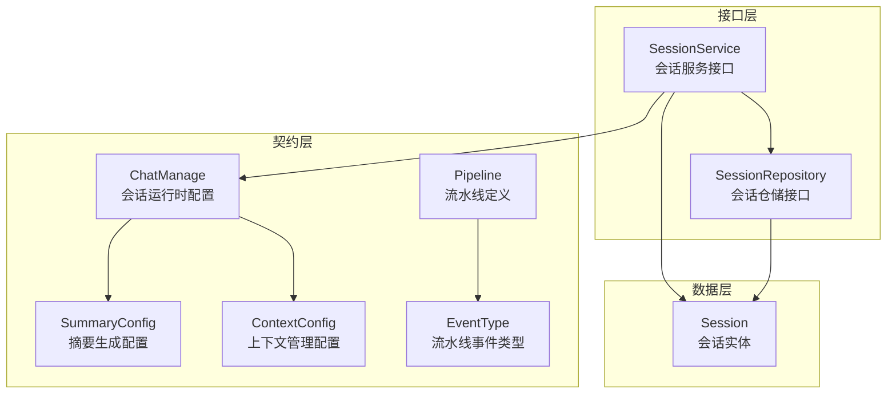

# Session Lifecycle and Conversation Controls Contracts

## 概述

`session_lifecycle_and_conversation_controls_contracts` 模块是整个系统中会话管理的核心契约层，它定义了会话生命周期管理、对话状态控制以及检索增强生成（RAG）流程的核心数据结构和接口。这个模块就像是系统的"会话指挥中心"——它不仅定义了会话应该如何存储和检索，还规定了从用户提问到系统回答的整个处理流程中数据应该如何流转。

### 解决的核心问题

在构建企业级对话系统时，我们面临几个关键挑战：

1. **会话状态的一致性管理**：如何在分布式环境中确保多个请求共享同一个会话状态？
2. **RAG流程的可配置性**：如何让不同的会话可以有不同的检索策略、模型选择和参数配置？
3. **流程的可观测性**：如何在复杂的RAG流水线中追踪每个阶段的执行状态？
4. **契约的明确性**：如何让服务层和存储层之间的接口契约清晰明确，避免耦合？

这个模块通过定义统一的数据结构和接口契约，为这些问题提供了标准化的解决方案。

## 核心架构

### 架构详解

这个模块采用了清晰的分层架构设计：

1. **契约层**：定义了会话运行时的数据结构，包括 `ChatManage`（会话运行时配置）、`SummaryConfig`（摘要配置）、`ContextConfig`（上下文配置）以及流水线事件和流程定义。
2. **接口层**：通过 `SessionService` 和 `SessionRepository` 接口，明确了会话管理的业务逻辑和数据持久化之间的契约。
3. **数据层**：定义了 `Session` 实体，作为会话数据的持久化模型。

这种设计的关键优势在于**关注点分离**：契约层关注数据结构和流程定义，接口层关注业务逻辑和数据访问的契约，数据层关注持久化模型。各层之间通过明确的接口交互，使得系统具有很好的可扩展性和可测试性。

## 核心组件解析

### ChatManage：会话运行时的"指挥中心"

`ChatManage` 是整个模块中最核心的数据结构，它承载了一个会话请求从开始到结束的所有配置和状态信息。你可以把它想象成一次RAG请求的"飞行记录仪"——它不仅记录了用户的原始请求，还记录了处理过程中的每个阶段的配置、中间结果和最终输出。

#### 设计亮点

1. **清晰的字段分组**：
   - 会话标识：`SessionID`、`UserID`
   - 查询处理：`Query`、`RewriteQuery`、`EnableRewrite`
   - 检索配置：`KnowledgeBaseIDs`、`VectorThreshold`、`EmbeddingTopK`
   - 模型配置：`ChatModelID`、`RerankModelID`、`SummaryConfig`
   - 流水线状态：`SearchResult`、`RerankResult`、`ChatResponse`

2. **内部字段与外部字段分离**：
   使用 `json:"-"` 标签将内部处理状态（如 `SearchResult`、`EventBus`）与API输入输出字段分离，既保证了数据的完整性，又避免了内部状态泄露到外部。

3. **深拷贝支持**：
   `Clone()` 方法提供了完整的深拷贝功能，这在需要保存请求快照或进行并行处理时非常重要。

### 流水线事件系统：可观测的RAG流程

`EventType` 和 `Pipeline` 构成了RAG流程的事件系统。这是一个非常巧妙的设计——它不是硬编码处理流程，而是通过事件类型和流程定义来描述不同的对话模式。

#### 设计意图

这种设计的核心思想是**将流程定义与流程执行分离**。通过定义不同的事件序列（如 "rag"、"rag_stream"、"chat_history_stream"），系统可以：

1. **灵活支持多种对话模式**：从简单的聊天到复杂的RAG流式输出，都可以通过配置不同的事件序列来实现。
2. **提供清晰的可观测性**：每个事件类型代表流水线中的一个阶段，可以通过事件总线向外发出状态更新，便于前端展示处理进度。
3. **便于测试和调试**：可以单独测试每个事件阶段的处理逻辑，也可以通过事件序列来重现问题。

### SessionService 与 SessionRepository：职责明确的接口契约

这两个接口体现了**依赖倒置原则**——高层模块（业务逻辑）不依赖低层模块（数据访问），两者都依赖抽象。

#### SessionService：业务逻辑的契约

`SessionService` 定义了会话管理的所有业务操作，包括：
- 基本的CRUD操作
- 标题生成（同步和异步）
- 知识问答（多种变体）
- 上下文清理

值得注意的是 `KnowledgeQA` 和 `AgentQA` 方法的设计——它们接收大量可选参数，这使得会话服务可以灵活适应不同的使用场景，同时保持接口的稳定性。

#### SessionRepository：数据访问的契约

`SessionRepository` 定义了会话数据持久化的契约，它的设计有几个关键点：

1. **租户隔离**：所有读取操作都需要 `tenantID` 参数，确保数据安全。
2. **分页支持**：`GetPagedByTenantID` 方法支持高效的分页查询。
3. **批量操作**：`BatchDelete` 方法支持批量删除，提高性能。

### SummaryConfig 与 ContextConfig：精细的配置模型

这两个配置结构体展示了系统对LLM交互细节的精细控制：

- **SummaryConfig**：不仅包含标准的LLM参数（temperature、top_p等），还包含提示词模板、上下文模板等RAG特定的配置。
- **ContextConfig**：提供了两种上下文压缩策略——滑动窗口（简单但可能丢失重要信息）和智能压缩（使用LLM总结旧消息，更智能但成本更高）。

## 设计决策与权衡

### 1. 契约集中 vs 分散

**决策**：将所有会话相关的契约集中在一个模块中。

**权衡**：
- ✅ **优点**：契约集中管理，便于理解和维护；减少模块间的循环依赖。
- ❌ **缺点**：模块可能变得较大；如果不同层的契约变更频率不同，可能会导致不必要的版本更新。

**为什么这样选择**：在会话管理这个领域，数据结构、服务接口和持久化模型之间的耦合度很高。将它们集中在一起可以更清晰地看到整体设计，也更容易保持一致性。

### 2. ChatManage 的大而全 vs 小而精

**决策**：`ChatManage` 包含了从请求到响应的所有配置和状态。

**权衡**：
- ✅ **优点**：数据流转清晰，一个对象贯穿整个流水线；便于调试和日志记录。
- ❌ **缺点**：结构体可能变得过于庞大；不同阶段的代码可能依赖不相关的字段。

**为什么这样选择**：RAG流水线是一个顺序处理过程，每个阶段都需要前一阶段的输出作为输入。使用一个统一的对象可以避免频繁的数据转换，也便于在需要时回溯整个处理过程。

### 3. 事件驱动的流水线 vs 直接函数调用

**决策**：使用事件类型和流程定义来描述RAG流水线。

**权衡**：
- ✅ **优点**：灵活性高，可以轻松定义新的流程；可观测性好，每个阶段都可以发出事件。
- ❌ **缺点**：增加了一层间接性；调试可能稍微复杂一些。

**为什么这样选择**：考虑到系统需要支持多种对话模式（简单聊天、RAG、流式RAG、带历史的聊天等），使用事件驱动的方式可以更好地管理这种复杂性。

## 与其他模块的关系

这个模块是整个会话管理系统的核心，它与其他模块的关系如下：

1. **被依赖方**：
   - [application_services_and_orchestration-conversation_context_and_memory_services](../application_services_and_orchestration-conversation_context_and_memory_services.md)：实现 `SessionService` 接口
   - [data_access_repositories-content_and_knowledge_management_repositories](../data_access_repositories-content_and_knowledge_management_repositories.md)：实现 `SessionRepository` 接口
   - [http_handlers_and_routing-session_message_and_streaming_http_handlers](../http_handlers_and_routing-session_message_and_streaming_http_handlers.md)：使用 `SessionService` 处理HTTP请求

2. **依赖方**：
   - 依赖 [core_domain_types_and_interfaces-agent_conversation_and_runtime_contracts](../core_domain_types_and_interfaces-agent_conversation_and_runtime_contracts.md) 中的其他契约定义

## 新 contributor 指南

### 常见陷阱

1. **ChatManage 的深拷贝**：
   当你需要保存 `ChatManage` 的快照时，务必使用 `Clone()` 方法，而不是简单的赋值。特别是切片和指针字段，浅拷贝会导致意外的共享状态。

2. **内部字段与外部字段**：
   注意 `json:"-"` 标签的字段——这些是内部处理状态，不应该从API输入中读取，也不应该直接暴露给API输出。

3. **租户隔离**：
   在实现 `SessionRepository` 时，务必确保所有读取操作都检查 `tenantID`，避免数据泄露。

### 扩展点

1. **新的流水线模式**：
   可以在 `Pipline` 映射中添加新的事件序列，来支持新的对话模式。

2. **自定义事件类型**：
   可以添加新的 `EventType` 来扩展流水线的可观测性。

3. **配置扩展**：
   可以在 `SummaryConfig` 或 `ContextConfig` 中添加新的字段，来支持更精细的LLM控制。

## 子模块

这个模块包含以下子模块，每个子模块都有更详细的文档：

- [session_persistence_and_service_interfaces](session_lifecycle_and_conversation_controls_contracts-session_persistence_and_service_interfaces.md)：会话持久化和服务接口的详细说明
- [session_summary_and_context_configuration_models](session_lifecycle_and_conversation_controls_contracts-session_summary_and_context_configuration_models.md)：会话摘要和上下文配置模型的详细说明
- [chat_management_contract](session_lifecycle_and_conversation_controls_contracts-chat_management_contract.md)：聊天管理契约的详细说明
