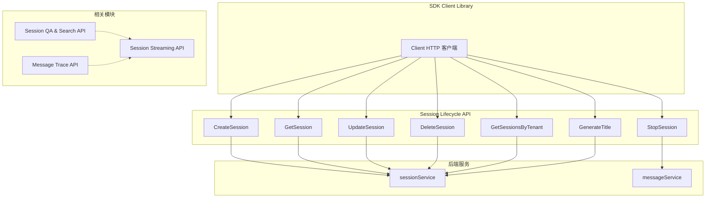

# Session Lifecycle API 模块深度解析

## 概述：为什么需要这个模块

想象你正在运营一个智能问答系统，用户每天都会发起数十次对话。每次对话都需要被记录、追踪、并在后续可能被重新访问。如果每次用户提问都创建一个全新的上下文，系统不仅会丢失历史记忆，还会浪费大量计算资源重新理解已经讨论过的内容。

`session_lifecycle_api` 模块正是为了解决这个问题而存在。它提供了一套完整的**会话生命周期管理机制**，将每次用户与系统的交互封装成一个有始有终的"对话容器"。这个模块的核心洞察是：**会话不是简单的数据库记录，而是对话状态的载体**——它需要支持创建、查询、更新、删除，还需要能够动态生成标题、控制流式输出的启停。

与 naive 方案（简单地在数据库里存对话记录）相比，这个模块的设计关键在于：
1. **会话与知识库解耦**——会话是独立的对话容器，配置在查询时从自定义 Agent 获取，而非绑定到特定知识库
2. **流式输出的精细控制**——支持 SSE 流式响应的启动、继续和停止，而非简单的请求 - 响应模式
3. **标题自动生成**——通过 LLM 根据对话内容动态生成会话标题，提升用户体验

---

## 架构全景



### 组件角色与数据流

这个模块在整体架构中扮演**SDK 层会话管理网关**的角色。它向上为应用层提供简洁的会话操作接口，向下通过 HTTP 协议与后端 `sessionService` 和 `messageService` 通信。

**核心数据流路径**：

1. **会话创建流**：`Client.CreateSession()` → HTTP POST `/api/v1/sessions` → `sessionService` → 返回 `SessionResponse`
2. **会话查询流**：`Client.GetSession()` / `GetSessionsByTenant()` → HTTP GET → `sessionRepository` → 返回会话列表
3. **标题生成流**：`Client.GenerateTitle()` → HTTP POST `/api/v1/sessions/{id}/generate_title` → LLM 服务 → 返回生成的标题
4. **会话停止流**：`Client.StopSession()` → HTTP POST `/api/v1/sessions/{id}/stop` → `messageService` → 停止流式生成

模块的**架构边界**非常清晰：它只负责会话元数据的管理和流式输出的控制，实际的对话内容（Messages）由 [`message_trace_and_tool_events_api`](message_trace_and_tool_events_api.md) 处理，问答和搜索由 [`session_qa_and_search_api`](session_qa_and_search_api.md) 处理，流式响应由 [`session_streaming_and_llm_calls_api`](session_streaming_and_llm_calls_api.md) 处理。

---

## 核心组件深度解析

### Session：会话数据模型

```go
type Session struct {
    ID          string `json:"id"`
    TenantID    uint64 `json:"tenant_id"`
    Title       string `json:"title"`
    Description string `json:"description"`
    CreatedAt   string `json:"created_at"`
    UpdatedAt   string `json:"updated_at"`
}
```

**设计意图**：`Session` 结构体是会话的**核心领域模型**，它的设计体现了几个关键决策：

1. **多租户隔离**：`TenantID` 字段表明系统支持多租户架构，每个会话都属于特定租户。这意味着查询会话时必须隐含租户上下文，防止跨租户数据泄露。

2. **标题与描述分离**：`Title` 和 `Description` 分开存储，标题用于列表展示（可能由 LLM 自动生成），描述用于用户手动备注。这种分离允许系统自动管理标题而不影响用户的手动输入。

3. **时间戳用字符串而非 `time.Time`**：这是一个务实的选择。Go 的 `time.Time` 在 JSON 序列化时使用 RFC3339 格式，但不同数据库（MySQL、PostgreSQL、MongoDB）返回的时间格式可能不同。使用字符串避免了反序列化时的格式兼容问题，将时间解析的责任交给调用方。

**使用注意**：`Session` 是只读数据传输对象（DTO），不应在客户端修改其字段。如需更新，应调用 `UpdateSession` 并传入新的 `CreateSessionRequest`。

---

### CreateSessionRequest：会话创建请求

```go
type CreateSessionRequest struct {
    Title       string `json:"title"`       // Session title (optional)
    Description string `json:"description"` // Session description (optional)
}
```

**设计洞察**：这个结构体的简洁性反映了一个重要的架构决策——**会话与配置解耦**。注释明确指出："Sessions are now knowledge-base-independent and serve as conversation containers. All configuration comes from custom agent at query time."

这意味着：
- 创建会话时**不需要**指定知识库、Agent、模型等配置
- 所有运行时配置在查询时（通过 `KnowledgeQARequest`）传递
- 会话只是一个纯粹的对话容器，降低了会话创建的复杂度

**为什么这样设计**：早期的设计可能将会话与特定知识库绑定，但这会导致用户每次切换知识库都需要创建新会话。解耦后，用户可以在同一会话中与不同知识库交互，会话真正成为"对话历史"的载体，而非"配置集合"。

**陷阱提示**：`Title` 和 `Description` 都是可选的。如果传入空标题，系统可能会在首次对话后通过 `GenerateTitle` 自动生成。不要在创建时强制要求标题，这会破坏用户体验。

---

### CreateSession / GetSession / UpdateSession / DeleteSession：CRUD 操作

这四个方法遵循标准的 RESTful 模式：

```go
func (c *Client) CreateSession(ctx context.Context, request *CreateSessionRequest) (*Session, error)
func (c *Client) GetSession(ctx context.Context, sessionID string) (*Session, error)
func (c *Client) UpdateSession(ctx context.Context, sessionID string, request *CreateSessionRequest) (*Session, error)
func (c *Client) DeleteSession(ctx context.Context, sessionID string) error
```

**内部机制**：所有方法都通过 `c.doRequest()` 发送 HTTP 请求，然后使用 `parseResponse()` 解析响应。这种统一的处理模式有几个好处：

1. **错误处理一致**：HTTP 状态码错误、JSON 解析错误、业务逻辑错误都被统一封装
2. **上下文传递**：`ctx` 参数允许调用方设置超时、取消信号，这对长时间运行的操作（如流式输出）至关重要
3. **类型安全**：返回具体的 `*Session` 而非 `map[string]interface{}`，调用方可以直接访问字段

**数据流追踪**（以 `CreateSession` 为例）：
```
Client.CreateSession()
  ↓ doRequest(ctx, POST, /api/v1/sessions, request, nil)
  ↓ HTTP Client → Backend Handler (session.handler.Handler)
  ↓ sessionService.Create()
  ↓ sessionRepository.Create()
  ↓ Database Insert
  ↓ SessionResponse{Success: true, Data: Session{...}}
  ↓ parseResponse()
  ↓ return &response.Data
```

**依赖契约**：
- 依赖 `Client` 的 `doRequest` 方法处理 HTTP 细节
- 依赖后端返回的响应格式为 `{success: bool, data: T}` 或 `{success: bool, message: string}`
- 如果后端改变响应格式，`parseResponse` 需要相应调整

---

### GetSessionsByTenant：分页查询

```go
func (c *Client) GetSessionsByTenant(ctx context.Context, page int, pageSize int) ([]Session, int, error)
```

**设计权衡**：这个方法返回三个值——会话列表、总数、错误。返回总数是为了支持前端分页控件（显示"共 X 条记录"）。但这种设计有一个隐含问题：**总数查询可能需要额外的 COUNT 查询**，在大数据量下可能成为性能瓶颈。

**替代方案对比**：
- **游标分页**（Cursor-based）：返回 `next_cursor`，无需总数，性能更好，但无法显示总页数
- **偏移分页**（Offset-based，当前方案）：直观，但深分页（`OFFSET 10000`）性能差

当前选择偏移分页是因为会话数据量通常可控（单租户数百到数千条），且用户体验（显示总页数）优先。

**使用模式**：
```go
page := 1
pageSize := 20
for {
    sessions, total, err := client.GetSessionsByTenant(ctx, page, pageSize)
    if err != nil {
        // 处理错误
    }
    // 处理 sessions
    if page*pageSize >= total {
        break
    }
    page++
}
```

---

### GenerateTitle：LLM 驱动的标题生成

```go
func (c *Client) GenerateTitle(ctx context.Context, sessionID string, request *GenerateTitleRequest) (string, error)

type GenerateTitleRequest struct {
    Messages []Message `json:"messages"`
}
```

**核心洞察**：这个方法揭示了一个有趣的设计模式——**标题生成是异步的、基于上下文的**。它不是创建会话时立即生成，而是在有足够对话内容后，通过分析 `Messages` 来生成。

**为什么需要传入 Messages**：标题生成服务本身不存储消息历史（那是 `messageService` 的职责），它只是一个无状态的 LLM 调用封装。调用方需要自己从 `messageService` 获取历史消息，然后传给 `GenerateTitle`。

**设计张力**：
- **优点**：解耦标题生成与消息存储，服务可以独立扩展
- **缺点**：调用方需要额外获取消息，增加了调用复杂度

**典型使用场景**：
```go
// 1. 用户完成前几轮对话后
messages, _ := client.GetMessages(ctx, sessionID, 0, 10)

// 2. 触发标题生成
title, _ := client.GenerateTitle(ctx, sessionID, &GenerateTitleRequest{
    Messages: messages,
})

// 3. 更新会话标题
client.UpdateSession(ctx, sessionID, &CreateSessionRequest{
    Title: title,
})
```

**性能考虑**：标题生成涉及 LLM 调用，延迟可能在 1-5 秒。不应在创建会话时同步调用，而应在后台异步执行。

---

### StopSession：流式输出的中断控制

```go
func (c *Client) StopSession(ctx context.Context, sessionID string, messageID string) error

type StopSessionRequest struct {
    MessageID string `json:"message_id"`
}
```

**问题空间**：在流式输出场景中，用户可能中途点击"停止生成"按钮。如果服务端继续生成，不仅浪费计算资源，还会导致前端状态混乱。

**解决方案**：`StopSession` 发送一个停止信号到后端，后端会：
1. 标记该 `messageID` 对应的生成为"已停止"
2. 中断 LLM 流式输出
3. 保存已生成的部分内容

**关键设计点**：
- **需要 `messageID` 而非仅 `sessionID`**：一个会话可能有多个并发的消息生成（虽然不常见），指定 `messageID` 确保只停止目标生成
- **验证非空**：方法开头显式检查 `sessionID` 和 `messageID` 非空，避免无效请求传到后端

**依赖关系**：这个方法实际调用的是 `messageService` 而非 `sessionService`，因为停止的是"消息生成"而非"会话"。这反映了模块边界的微妙之处——虽然方法在 session 包中，但操作的是消息资源。

---

### KnowledgeQAStream：SSE 流式问答

```go
func (c *Client) KnowledgeQAStream(
    ctx context.Context,
    sessionID string,
    request *KnowledgeQARequest,
    callback func(*StreamResponse) error,
) error
```

**核心机制**：这个方法实现了 Server-Sent Events (SSE) 协议的客户解析。SSE 是一种单向实时通信协议，服务端可以持续推送事件到客户端。

**SSE 数据格式解析**：
```
event: message
data: {"id": "xxx", "response_type": "thinking", "content": "正在思考..."}

event: message
data: {"id": "xxx", "response_type": "answer", "content": "根据知识库..."}
```

方法使用 `bufio.Scanner` 逐行读取响应，通过识别空行（事件结束）、`event:` 前缀（事件类型）、`data:` 前缀（事件数据）来解析流。

**设计权衡**：
- **使用回调而非通道**：回调模式更简单，调用方不需要管理 goroutine 和 channel。但缺点是回调中的错误处理较复杂，且无法使用 `range` 语法。
- **同步阻塞**：方法会阻塞直到流结束或出错。如果需要并发处理，调用方需自行启动 goroutine。

**数据流**：
```
KnowledgeQAStream()
  ↓ POST /api/v1/knowledge-chat/{sessionID}
  ↓ 建立 SSE 连接
  ↓ 循环读取响应行
  ↓ 解析 data: 后的 JSON 为 StreamResponse
  ↓ 调用 callback(&streamResponse)
  ↓ 直到 done=true 或连接关闭
```

**StreamResponse 结构**：
```go
type StreamResponse struct {
    ID                  string                 `json:"id"`
    ResponseType        ResponseType           `json:"response_type"`  // 关键：区分响应类型
    Content             string                 `json:"content"`
    Done                bool                   `json:"done"`
    KnowledgeReferences []*SearchResult        `json:"knowledge_references,omitempty"`
    ToolCalls           []LLMToolCall          `json:"tool_calls,omitempty"`
    Data                map[string]interface{} `json:"data,omitempty"`
}
```

**ResponseType 枚举**定义了 9 种事件类型：
- `answer`：最终答案片段
- `references`：引用来源
- `thinking`：思考过程（Chain of Thought）
- `tool_call` / `tool_result`：工具调用及结果
- `error`：错误信息
- `reflection`：反思内容
- `session_title`：生成的会话标题
- `agent_query`：Agent 查询事件
- `complete`：完成信号

这种细粒度的事件分类允许前端针对不同事件类型渲染不同的 UI 组件（如思考过程用灰色斜体，引用用卡片展示）。

---

### ContinueStream：断点续传流式输出

```go
func (c *Client) ContinueStream(
    ctx context.Context,
    sessionID string,
    messageID string,
    callback func(*StreamResponse) error,
) error
```

**使用场景**：当用户刷新页面或网络中断后，可以通过这个方法继续接收未完成的流式输出。

**实现细节**：与 `KnowledgeQAStream` 类似，但使用 GET 请求并通过查询参数传递 `messageID`。服务端会根据 `messageID` 找到之前的生成状态，从断点处继续推送。

**限制**：只能继续"活跃"的流（即服务端仍在生成的）。如果生成已完成或已停止，这个方法不会返回任何数据。

---

### SearchKnowledge：纯检索（无 LLM 总结）

```go
func (c *Client) SearchKnowledge(ctx context.Context, request *SearchKnowledgeRequest) ([]*SearchResult, error)
```

**与 KnowledgeQAStream 的区别**：
- `SearchKnowledge`：只检索，返回原始知识片段，**不调用 LLM**
- `KnowledgeQAStream`：检索 + LLM 总结，返回自然语言答案

**使用场景**：
- 需要快速预览相关知识（延迟低）
- 需要自己处理检索结果（如自定义排序、过滤）
- 只需要引用来源，不需要答案生成

**请求参数**：
```go
type SearchKnowledgeRequest struct {
    Query            string   `json:"query"`
    KnowledgeBaseID  string   `json:"knowledge_base_id,omitempty"`  // 向后兼容
    KnowledgeBaseIDs []string `json:"knowledge_base_ids,omitempty"` // 多知识库支持
    KnowledgeIDs     []string `json:"knowledge_ids,omitempty"`      // 指定文件
}
```

注意 `KnowledgeBaseID`（单数）和 `KnowledgeBaseIDs`（复数）同时存在，这是**向后兼容**的设计。新代码应使用复数形式。

---

## 依赖关系分析

### 上游依赖（谁调用这个模块）

1. **前端应用**：通过 SDK 调用会话管理接口，展示会话列表、创建新会话、生成标题
2. **Agent 运行时**：在对话开始时创建会话，在对话过程中更新状态
3. **后台任务**：异步生成标题、清理过期会话

### 下游依赖（这个模块调用谁）

| 调用目标 | 方法 | 原因 |
|---------|------|------|
| `Client.doRequest` | 所有方法 | HTTP 请求封装 |
| `parseResponse` | 所有方法 | 响应解析 |
| `sessionService` | CRUD 方法 | 会话业务逻辑 |
| `messageService` | StopSession | 停止消息生成 |
| LLM 服务 | GenerateTitle | 标题生成 |

### 数据契约

**请求格式**：
- CRUD：`{title?: string, description?: string}`
- GenerateTitle：`{messages: Message[]}`
- StopSession：`{message_id: string}`
- KnowledgeQA：`{query: string, knowledge_base_ids: string[], agent_enabled: bool, ...}`

**响应格式**：
- 成功：`{success: true, data: T}`
- 失败：`{success: false, message: string}` 或 HTTP 错误码

**隐式契约**：
- 所有操作隐含租户上下文（从认证 token 中提取 `tenant_id`）
- 会话 ID 必须是有效的 UUID 格式
- 分页参数 `page` 从 1 开始（而非 0）

---

## 设计决策与权衡

### 1. 会话与配置解耦

**决策**：会话不存储知识库、Agent、模型等配置，配置在查询时传递。

**权衡**：
- ✅ 灵活性：同一会话可与不同知识库交互
- ✅ 简化：创建会话只需标题和描述
- ❌ 冗余：每次查询都要传递配置
- ❌ 一致性风险：用户可能在同一会话中使用不同配置，导致答案风格不一致

**为什么这样选**：灵活性优先。用户场景多样，强制绑定配置会限制使用方式。一致性风险通过 UI 引导（在会话内保持配置不变）来缓解。

### 2. 回调式流处理 vs 通道式

**决策**：使用 `callback func(*StreamResponse) error` 而非 `chan StreamResponse`。

**权衡**：
- ✅ 简单：调用方不需要管理 channel 和 goroutine
- ✅ 背压：回调返回错误可立即停止流
- ❌ 组合性差：无法使用 Go 的 channel 操作（如 `select`、`range`）
- ❌ 测试困难：回调中的逻辑难以单元测试

**为什么这样选**：目标用户是应用开发者，而非库开发者。简单性优先于组合性。

### 3. 字符串时间戳 vs time.Time

**决策**：`CreatedAt` 和 `UpdatedAt` 使用 `string` 而非 `time.Time`。

**权衡**：
- ✅ 兼容性：避免不同数据库时间格式差异
- ✅ 序列化简单：无需自定义 JSON marshal/unmarshal
- ❌ 类型安全：无法在编译期检查时间格式
- ❌ 操作不便：需要手动解析才能比较、格式化

**为什么这样选**：这是一个务实的妥协。后端数据库可能迁移（MySQL → PostgreSQL），字符串格式避免了迁移时的序列化问题。调用方可以自行封装解析逻辑。

### 4. 偏移分页 vs 游标分页

**决策**：使用 `page` + `pageSize` 的偏移分页。

**权衡**：
- ✅ 直观：用户理解"第 2 页"比理解"从游标 X 开始"更容易
- ✅ 跳转方便：可以直接跳到第 N 页
- ❌ 深分页性能差：`OFFSET 10000` 需要扫描前 10000 条
- ❌ 数据一致性问题：分页过程中新数据插入可能导致重复或遗漏

**为什么这样选**：会话数据量可控（单租户通常 < 10000 条），深分页不是常见问题。用户体验优先。

---

## 使用示例与最佳实践

### 创建会话并发起对话

```go
ctx := context.Background()

// 1. 创建会话（可选标题）
session, err := client.CreateSession(ctx, &CreateSessionRequest{
    Title:       "产品使用咨询",
    Description: "关于产品功能的问答",
})
if err != nil {
    log.Fatal(err)
}

// 2. 发起流式问答
qaRequest := &KnowledgeQARequest{
    Query:            "如何重置密码？",
    KnowledgeBaseIDs: []string{"kb_123"},
    AgentEnabled:     true,
    AgentID:          "agent_456",
}

var fullAnswer strings.Builder
err = client.KnowledgeQAStream(ctx, session.ID, qaRequest, func(resp *StreamResponse) error {
    if resp.ResponseType == ResponseTypeAnswer {
        fullAnswer.WriteString(resp.Content)
        fmt.Print(resp.Content) // 实时显示
    }
    if resp.Done {
        fmt.Println("\n生成完成")
    }
    return nil
})
```

### 异步生成标题

```go
// 在后台 goroutine 中生成标题
go func() {
    ctx, cancel := context.WithTimeout(context.Background(), 10*time.Second)
    defer cancel()
    
    // 获取前 10 条消息
    messages, _ := client.GetMessages(ctx, session.ID, 0, 10)
    
    // 生成标题
    title, err := client.GenerateTitle(ctx, session.ID, &GenerateTitleRequest{
        Messages: messages,
    })
    if err != nil {
        return
    }
    
    // 更新会话
    client.UpdateSession(ctx, session.ID, &CreateSessionRequest{
        Title: title,
    })
}()
```

### 处理用户停止生成

```go
// 前端点击"停止"按钮时
stopBtn.onclick = async () => {
    await client.StopSession(ctx, sessionID, currentMessageID);
    updateUIState('stopped');
};
```

### 分页加载会话列表

```go
func ListAllSessions(client *Client, tenantID uint64) ([]Session, error) {
    var allSessions []Session
    page := 1
    pageSize := 50
    
    for {
        sessions, total, err := client.GetSessionsByTenant(ctx, page, pageSize)
        if err != nil {
            return nil, err
        }
        
        allSessions = append(allSessions, sessions...)
        
        if page*pageSize >= total {
            break
        }
        page++
    }
    
    return allSessions, nil
}
```

---

## 边界情况与陷阱

### 1. 空会话 ID 或消息 ID

`StopSession` 显式检查 ID 非空，但其他方法（如 `GetSession`）没有。如果传入空 ID，后端可能返回 404 或 500 错误。**最佳实践**：在调用前自行验证 ID 格式。

```go
if sessionID == "" {
    return errors.New("sessionID cannot be empty")
}
```

### 2. 流式输出的错误处理

`KnowledgeQAStream` 的回调中返回错误会立即终止流。但如果回调中发生 panic，整个程序会崩溃。**必须**在回调中 recover：

```go
err = client.KnowledgeQAStream(ctx, sessionID, req, func(resp *StreamResponse) error {
    defer func() {
        if r := recover(); r != nil {
            log.Printf("Callback panic: %v", r)
        }
    }()
    
    // 处理逻辑
    return nil
})
```

### 3. 上下文超时

流式输出可能持续数十秒。如果 `ctx` 设置了过短的超时，流会被中途切断。**建议**：为流式操作设置至少 60 秒的超时。

```go
ctx, cancel := context.WithTimeout(context.Background(), 120*time.Second)
defer cancel()
```

### 4. 分页边界条件

`GetSessionsByTenant` 的 `page` 从 1 开始。传入 0 可能返回空列表或错误。始终从 1 开始分页。

### 5. 标题生成的消息数量

`GenerateTitle` 需要足够的上下文。如果只传入 1-2 条消息，生成的标题可能不准确。**建议**：至少传入 5 条消息，或等待用户完成一轮完整问答后再生成。

### 6. SSE 连接中断

网络波动可能导致 SSE 连接中断。`KnowledgeQAStream` 不会自动重连。**需要**在应用层实现重试逻辑：

```go
for attempt := 0; attempt < 3; attempt++ {
    err := client.KnowledgeQAStream(ctx, sessionID, req, callback)
    if err == nil {
        break
    }
    if attempt < 2 {
        time.Sleep(time.Second * time.Duration(attempt+1))
    }
}
```

### 7. 并发更新会话

多个客户端同时调用 `UpdateSession` 可能导致覆盖问题。系统没有乐观锁机制。**建议**：在关键场景（如多人协作）中，应用层实现版本控制。

---

## 运维考虑

### 监控指标

- **会话创建速率**：监控 `CreateSession` 调用频率，异常峰值可能表示攻击
- **流式输出平均时长**：超过 60 秒的流可能需要优化
- **标题生成失败率**：高失败率可能表示 LLM 服务问题
- **分页深度**：监控 `page` 参数分布，深分页频繁可能需要优化索引

### 数据清理

会话数据会持续增长。建议实现定期清理策略：
- 删除超过 N 天未更新的会话
- 归档重要会话到冷存储
- 清理无标题、无消息的"僵尸会话"

### 性能优化

- **会话列表缓存**：租户的会话列表变化不频繁，可缓存 5-10 分钟
- **标题生成异步化**：不要阻塞用户操作，后台异步生成
- **流式输出压缩**：启用 HTTP 压缩减少带宽

---

## 相关模块参考

- [`session_qa_and_search_api`](session_qa_and_search_api.md)：知识问答和搜索请求/响应模型
- [`session_streaming_and_llm_calls_api`](session_streaming_and_llm_calls_api.md)：流式响应和 LLM 工具调用
- [`message_trace_and_tool_events_api`](message_trace_and_tool_events_api.md)：消息历史和工具事件追踪
- [`agent_conversation_api`](agent_conversation_api.md)：Agent 对话层封装

---

## 总结

`session_lifecycle_api` 模块的核心价值在于**将对话状态管理抽象为可操作的生命周期**。它的设计哲学是：

1. **简单优先**：会话创建只需标题和描述，配置在查询时传递
2. **流式友好**：原生支持 SSE 流式输出的启动、继续、停止
3. **智能增强**：通过 LLM 自动生成标题，提升用户体验
4. **边界清晰**：只管理会话元数据，内容存储和问答逻辑由其他模块负责

理解这个模块的关键是认识到：**会话不是数据库记录，而是对话的时空容器**——它记录了对话何时开始、如何命名、何时结束，而对话的内容和意义由其他模块共同构建。
