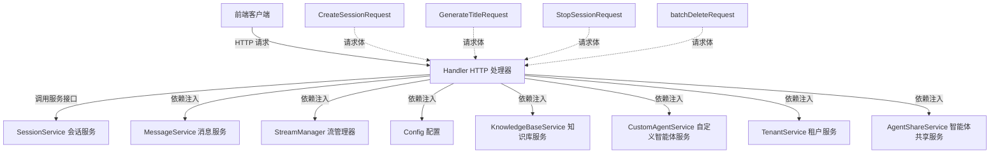

# 会话生命周期管理 HTTP 模块

## 模块概述

想象一下，您正在使用一个多智能体对话系统，每次与 AI 助手的对话都需要一个"容器"来保存上下文、消息历史和对话状态。这个模块就是负责管理这些会话"容器"的 HTTP 接口层——它提供了创建、读取、更新和删除会话的 RESTful API，是前端应用与后端会话管理服务之间的桥梁。

### 为什么这个模块存在？

在构建多智能体对话平台时，我们面临一个核心问题：如何让用户能够组织和管理他们与不同 AI 助手的多次对话？早期的设计将会话与特定知识库强绑定，但随着系统演进，我们发现这种耦合限制了灵活性。用户希望在同一个会话中可以切换不同的知识库、使用不同的智能体配置，而不必每次都创建新会话。

因此，我们重构了会话设计：**会话现在只是一个独立的对话容器**，不再绑定到特定的知识库或配置。所有的智能体配置、知识库选择等都在每次查询时动态指定，由自定义智能体提供。这种解耦让用户体验更加流畅，也让系统架构更加灵活。

## 架构设计

### 核心组件关系图



### 设计理念与数据流

这个模块采用典型的分层架构模式，`Handler` 结构体作为 HTTP 层与业务逻辑层之间的适配器：

1. **请求处理流程**：
   - 接收 HTTP 请求并进行参数验证
   - 从请求上下文提取租户 ID 进行授权验证
   - 将 HTTP 请求转换为内部服务调用
   - 处理服务层返回的结果或错误
   - 构造适当的 HTTP 响应

2. **关键设计决策**：
   - **依赖注入**：`Handler` 通过构造函数接收所有依赖，而不是在内部创建，这使得单元测试更加容易
   - **会话解耦**：如代码注释所述，"会话现在与知识库无关"，所有配置在查询时由自定义智能体提供
   - **租户隔离**：所有操作都基于租户 ID 进行，确保数据安全隔离

## 核心组件详解

### Handler 结构体

`Handler` 是整个模块的核心，它聚合了所有会话相关的 HTTP 处理方法。设计上，它是一个无状态的结构体，所有状态都通过依赖注入的服务来管理。

**主要职责**：
- HTTP 请求的参数绑定与验证
- 租户身份验证与授权
- 调用下层业务服务
- 错误处理与响应格式化

**依赖关系**：
- 依赖 `SessionService` 进行实际的会话 CRUD 操作
- 依赖多个其他服务以支持未来扩展（虽然当前版本中部分依赖未直接使用）

### 请求类型定义

模块定义了多个请求结构体来规范 HTTP 请求体格式：

- `CreateSessionRequest`：创建会话时只需要标题和描述，体现了会话的极简设计
- `GenerateTitleRequest`：支持根据消息历史自动生成会话标题
- `StopSessionRequest`：用于中止正在进行的会话
- `batchDeleteRequest`：支持批量删除会话的操作

## 关键设计决策与权衡

### 1. 会话与知识库解耦

**决策**：将会话从知识库绑定中解放出来，使其成为纯粹的对话容器。

**权衡分析**：
- ✅ **优点**：
  - 用户可以在同一会话中切换不同知识库
  - 简化了会话创建流程，无需预先选择知识库
  - 更灵活的智能体配置管理
  
- ⚠️ **考虑**：
  - 每次查询都需要传递完整的配置信息，增加了请求体量
  - 前端需要管理更多的状态信息
  - 历史消息的上下文解释可能会因为配置变化而变得复杂

**为什么这样选择**：我们认为灵活性的收益超过了成本，用户体验的提升是首要考虑因素。

### 2. 依赖注入设计

**决策**：通过构造函数显式注入所有依赖，而不是使用服务定位器或全局变量。

**权衡分析**：
- ✅ **优点**：
  - 提高了代码的可测试性，可以轻松 mock 依赖
  - 依赖关系清晰可见，降低了理解成本
  - 符合依赖倒置原则

- ⚠️ **考虑**：
  - 构造函数参数列表较长，看起来有些复杂
  - 部分依赖在当前实现中未被直接使用

**为什么这样选择**：可测试性和清晰的依赖关系对于长期维护至关重要，额外的参数列表复杂度是可以接受的。

### 3. 批量操作支持

**决策**：提供批量删除会话的接口，而不是仅支持单个删除。

**权衡分析**：
- ✅ **优点**：
  - 提升用户体验，允许一次性管理多个会话
  - 减少网络往返次数，提高效率

- ⚠️ **考虑**：
  - 批量操作的错误处理更复杂（部分成功、部分失败的情况）
  - 可能需要考虑事务性，虽然当前实现中没有

**为什么这样选择**：这是一个常见的用户需求，提供这个功能可以显著提升用户体验。

## 与其他模块的交互

### 依赖关系

本模块主要依赖以下核心模块：

1. **[core_domain_types_and_interfaces](core_domain_types_and_interfaces.md)**：提供了 `SessionService`、`MessageService` 等接口定义，以及 `types.Session` 等核心数据模型
2. **[application_services_and_orchestration](application_services_and_orchestration.md)**：实现了 `SessionService` 等业务服务
3. **[platform_infrastructure_and_runtime](platform_infrastructure_and_runtime.md)**：提供了配置、日志等基础设施支持

### 数据流向

典型的会话创建流程：
1. 前端发送 `CreateSessionRequest` 到 `/sessions` 端点
2. `Handler.CreateSession` 验证请求并提取租户 ID
3. 构造 `types.Session` 对象并调用 `sessionService.CreateSession`
4. 服务层处理后返回结果，`Handler` 构造 HTTP 响应返回

## 使用指南与注意事项

### 常见用例

1. **创建会话**：
   ```
   POST /sessions
   {
     "title": "产品咨询对话",
     "description": "关于新产品功能的讨论"
   }
   ```

2. **获取会话列表**：
   ```
   GET /sessions?page=1&page_size=20
   ```

3. **批量删除会话**：
   ```
   DELETE /sessions/batch
   {
     "ids": ["session1", "session2", "session3"]
   }
   ```

### 注意事项与陷阱

1. **租户隔离**：所有操作都依赖于请求上下文中的租户 ID，确保在调用这些接口前已经通过认证中间件设置了租户 ID。

2. **ID 验证**：会话 ID 在使用前会经过 `secutils.SanitizeForLog` 清理，防止日志注入攻击，但在传递给服务层前确保 ID 的有效性仍然重要。

3. **错误处理**：模块遵循统一的错误处理模式，使用 `errors.AppError` 类型封装错误信息，前端可以根据错误码进行相应处理。

4. **扩展点**：`Handler` 结构体中注入了多个服务，虽然当前版本中部分未使用，但为未来的功能扩展预留了空间。

## 子模块详解

本模块包含以下子模块，每个子模块都有详细的技术文档：

- [session_lifecycle_http_handler](http_handlers_and_routing-session_message_and_streaming_http_handlers-session_lifecycle_management_http-session_lifecycle_http_handler.md)：HTTP 处理器的具体实现
- [session_lifecycle_request_contracts](http_handlers_and_routing-session_message_and_streaming_http_handlers-session_lifecycle_management_http-session_lifecycle_request_contracts.md)：请求和响应的数据契约定义
- [session_batch_deletion_request_contract](http_handlers_and_routing-session_message_and_streaming_http_handlers-session_lifecycle_management_http-session_batch_deletion_request_contract.md)：批量删除操作的特殊契约
