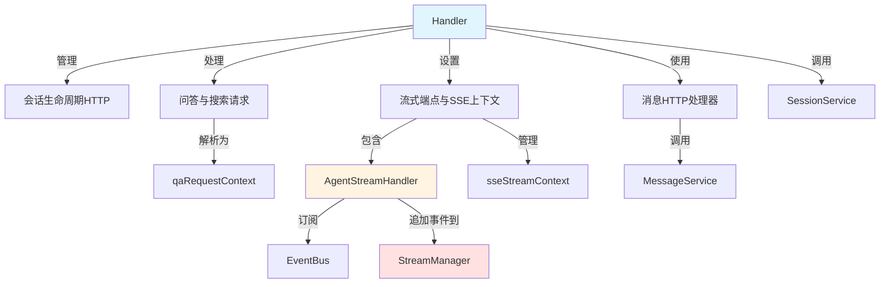

# 会话消息与流式HTTP处理器模块

## 概述

在现代AI助手系统中，用户期望与AI进行流畅、实时的对话体验。`session_message_and_streaming_http_handlers` 模块正是为了满足这一需求而设计的，它负责处理所有与会话、消息和流式响应相关的HTTP请求，是前端与后端AI引擎之间的关键桥梁。

想象一下，当你向AI助手提问时，你希望看到思考过程、工具调用和最终答案以流式方式逐步呈现，而不是漫长等待后一次性显示结果。这个模块就像一个精密的"传输管道"，将AI引擎的内部事件转换为前端可理解的SSE（Server-Sent Events）流，同时管理会话生命周期和消息历史。

## 架构概览

让我们先通过一个Mermaid图来了解这个模块的核心组件和它们之间的关系：



这个模块的核心是 `Handler` 结构体，它协调整个会话和消息处理流程。当用户发起一个请求时：

1. **会话生命周期管理**：`Handler` 提供创建、获取、更新和删除会话的端点，这些端点通过 `SessionService` 与数据层交互。

2. **问答请求处理**：对于知识问答（KnowledgeQA）和智能代理问答（AgentQA），`Handler` 首先解析请求并创建 `qaRequestContext`，然后设置SSE流式响应环境。

3. **流式事件处理**：`AgentStreamHandler` 订阅专门的 `EventBus`，将AI引擎产生的各种事件（思考、工具调用、结果等）转换为SSE事件，并通过 `StreamManager` 发送给前端。

4. **消息管理**：`MessageHandler` 负责处理消息历史的加载和删除操作。

## 核心设计决策

### 1. 每个请求使用独立的EventBus

**决策**：为每个流式请求创建专门的 `EventBus` 实例，而不是使用全局事件总线。

**原因**：
- 避免了会话ID过滤的复杂性，每个 `EventBus` 只处理单个请求的事件
- 提高了隔离性，一个请求的事件处理不会影响其他请求
- 简化了 `AgentStreamHandler` 的实现，不需要在事件处理中检查会话ID

**权衡**：
- 增加了内存使用，因为每个请求都有自己的事件总线
- 但考虑到请求的生命周期通常较短，这个权衡是值得的

### 2. 会话与知识库解耦

**决策**：会话不再绑定到特定的知识库，所有配置（知识库、模型设置等）都在查询时通过自定义代理提供。

**原因**：
- 提高了灵活性，用户可以在同一个会话中使用不同的知识库和配置
- 简化了会话模型，只存储基本信息（租户ID、标题、描述）
- 使会话更像是一个"对话容器"，而不是特定于某个知识库的实体

**权衡**：
- 每次请求都需要提供完整的配置，增加了请求的复杂性
- 但这种设计使系统更加灵活，能够支持更复杂的使用场景

### 3. 事件流式传输而非累积

**决策**：`AgentStreamHandler` 将事件块直接追加到流中，而不是在后端累积完整内容。

**原因**：
- 降低了内存使用，特别是对于长响应
- 实现了真正的流式体验，前端可以立即显示部分结果
- 前端可以按事件ID自己累积内容，后端只负责传输

**权衡**：
- 前端需要实现事件累积逻辑
- 但这种责任分离使系统更加模块化

## 子模块概览

### 会话生命周期管理HTTP
这个子模块负责处理会话的创建、读取、更新和删除（CRUD）操作。它提供了RESTful API端点，允许前端管理用户的对话会话。

- **核心组件**：`Handler` 中的会话相关方法
- **主要功能**：创建会话、获取会话详情、列表会话、更新会话、删除会话、批量删除会话

详细信息请参阅[会话生命周期管理HTTP文档](http_handlers_and_routing-session_message_and_streaming_http_handlers-session_lifecycle_management_http.md)。

### 问答与搜索请求契约
这个子模块定义了问答和搜索请求的数据结构和验证逻辑，确保前端发送的请求格式正确。

- **核心组件**：`CreateKnowledgeQARequest`、`SearchKnowledgeRequest`、`qaRequestContext`
- **主要功能**：请求解析、参数验证、上下文构建

详细信息请参阅[问答与搜索请求契约文档](http_handlers_and_routing-session_message_and_streaming_http_handlers-session_qa_and_search_request_contracts.md)。

### 流式端点与SSE上下文
这个子模块是整个模块的核心，负责设置和管理SSE流式响应，将AI引擎的内部事件转换为前端可理解的格式。

- **核心组件**：`AgentStreamHandler`、`sseStreamContext`
- **主要功能**：事件订阅、事件转换、流式传输、生命周期管理

详细信息请参阅[流式端点与SSE上下文文档](http_handlers_and_routing-session_message_and_streaming_http_handlers-streaming_endpoints_and_sse_context.md)。

### 消息HTTP处理器
这个子模块专注于消息历史的管理，提供了加载和删除消息的端点。

- **核心组件**：`MessageHandler`
- **主要功能**：加载消息历史、删除消息

详细信息请参阅[消息HTTP处理器文档](http_handlers_and_routing-session_message_and_streaming_http_handlers-message_http_handler.md)。

## 与其他模块的交互

这个模块在整个系统中处于"边缘"位置，是前端与后端服务之间的桥梁。它主要与以下模块交互：

1. **[application_services_and_orchestration](application_services_and_orchestration.md)**：通过 `SessionService` 接口调用会话和问答相关的业务逻辑。
2. **[data_access_repositories](data_access_repositories.md)**：间接通过服务层访问数据存储。
3. **[platform_infrastructure_and_runtime](platform_infrastructure_and_runtime.md)**：使用 `EventBus` 和 `StreamManager` 进行事件处理和流式传输。
4. **[core_domain_types_and_interfaces](core_domain_types_and_interfaces.md)**：依赖核心域类型和接口定义。

## 使用指南

### 基本用法

1. **创建会话**：
   ```http
   POST /sessions
   Content-Type: application/json
   
   {
     "title": "我的AI对话",
     "description": "关于产品使用的问题"
   }
   ```

2. **发起知识问答**：
   ```http
   POST /sessions/{session_id}/knowledge-qa
   Content-Type: application/json
   
   {
     "query": "如何使用这个产品？",
     "knowledge_base_ids": ["kb1", "kb2"],
     "web_search_enabled": false
   }
   ```

3. **加载消息历史**：
   ```http
   GET /messages/{session_id}/load?limit=20
   ```

### 扩展点

1. **自定义事件处理**：可以继承 `AgentStreamHandler` 并重写特定事件的处理方法。
2. **请求验证扩展**：可以在 `parseQARequest` 方法中添加自定义的请求验证逻辑。
3. **流式响应格式定制**：可以修改 `AgentStreamHandler` 中的事件转换逻辑，以支持不同的前端格式。

## 注意事项与陷阱

1. **SSE连接超时**：SSE连接可能会因网络问题或代理超时而中断，前端需要实现重连逻辑。
2. **事件顺序保证**：由于使用了专门的 `EventBus`，事件顺序是有保证的，但前端仍应处理可能的乱序情况。
3. **有效租户ID处理**：当使用共享代理时，需要正确处理 `effectiveTenantID`，确保模型、知识库和MCP解析使用正确的租户上下文。
4. **内存管理**：虽然事件不累积，但长时间运行的请求仍可能占用较多内存，需要注意监控和限制。
5. **错误处理**：流式响应中的错误需要特殊处理，确保前端能够正确显示和恢复。

通过这个模块，系统能够提供流畅、实时的AI对话体验，同时保持良好的模块化和可扩展性。
