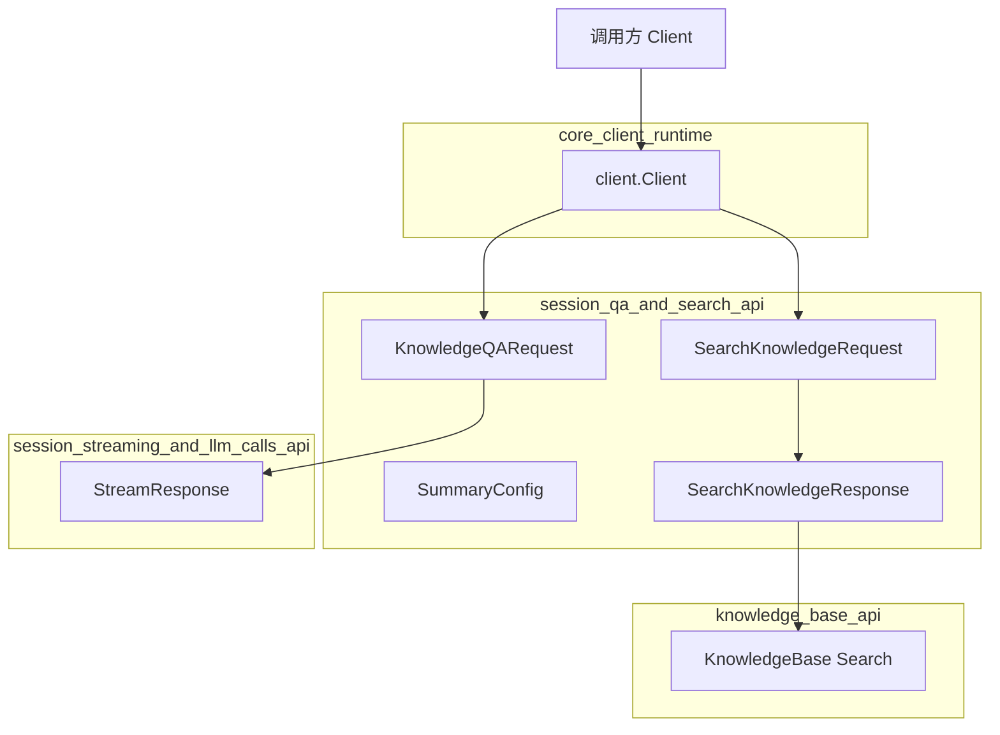

# session_qa_and_search_api 模块技术深度解析

## 模块概述：为什么需要这个模块？

想象你正在构建一个企业级知识库问答系统。用户提出一个问题，系统需要完成两件事：**找到相关知识**和**生成有依据的回答**。这听起来简单，但背后有一系列复杂的设计决策：

- 用户可能想从多个知识库中搜索，也可能只想针对特定文档提问
- 回答可能需要实时流式输出，而不是等待完整的响应
- 有时用户只想做纯粹的检索（看看有哪些相关内容），而不需要 LLM 生成答案
- 系统需要支持"代理模式"（让 LLM 自主决定调用哪些工具）和"直接搜索模式"

`session_qa_and_search_api` 模块正是为了解决这些问题而存在的。它是**会话层与知识检索层之间的桥梁**，负责将用户的自然语言查询转化为结构化的检索请求，并将检索结果（无论是流式还是批量）返回给调用方。

这个模块的核心设计洞察是：**问答和搜索是两种不同但相关的操作**。问答需要 LLM 参与生成答案，而搜索只是纯粹的检索。将两者分离可以让调用方根据场景灵活选择，同时也让系统能够针对两种操作进行独立优化。

---

## 架构与数据流



### 组件角色说明

| 组件 | 角色 | 职责 |
|------|------|------|
| `KnowledgeQARequest` | 请求契约 | 封装一次知识问答的所有参数：查询文本、知识库选择、代理配置、搜索开关等 |
| `SearchKnowledgeRequest` | 请求契约 | 封装一次纯知识搜索的参数，不包含 LLM 生成相关配置 |
| `SearchKnowledgeResponse` | 响应契约 | 返回搜索结果列表，包含文档片段、分数等元数据 |
| `SummaryConfig` | 配置契约 | 定义 LLM 生成摘要/答案时的行为参数（temperature、top_p、prompt 模板等） |

### 数据流追踪

**场景一：流式知识问答**

```
用户输入 → Client.KnowledgeQAStream() → POST /api/v1/knowledge-chat/{sessionID}
         → SSE 流式响应 → StreamResponse 事件流 → 回调函数处理
         → 事件类型包括：thinking → tool_call → tool_result → answer → references → complete
```

**场景二：纯知识搜索**

```
用户输入 → Client.SearchKnowledge() → POST /api/v1/knowledge-search
         → 同步响应 → SearchKnowledgeResponse → []*SearchResult
```

关键区别在于：问答是**流式的、有状态的**（绑定到 session），而搜索是**同步的、无状态的**（一次性返回所有结果）。

---

## 核心组件深度解析

### KnowledgeQARequest：问答请求的完整契约

```go
type KnowledgeQARequest struct {
    Query            string   `json:"query"`              // 查询文本
    KnowledgeBaseIDs []string `json:"knowledge_base_ids"` // 选中的知识库 ID 列表
    KnowledgeIDs     []string `json:"knowledge_ids"`      // 选中的具体知识（文件）ID 列表
    AgentEnabled     bool     `json:"agent_enabled"`      // 是否启用代理模式
    AgentID          string   `json:"agent_id"`           // 自定义代理 ID
    WebSearchEnabled bool     `json:"web_search_enabled"` // 是否启用网络搜索
    SummaryModelID   string   `json:"summary_model_id"`   // 摘要模型 ID（可选覆盖）
    DisableTitle     bool     `json:"disable_title"`      // 是否禁用自动标题生成
}
```

**设计意图**：这个结构体的设计反映了一个关键决策——**配置应该在请求时注入，而不是在会话创建时固定**。注释中明确说明："Sessions are now knowledge-base-independent and serve as conversation containers. All configuration comes from custom agent at query time."

这意味着会话只是一个对话容器，真正的行为配置（用哪个知识库、是否启用代理、用什么模型）都在每次查询时动态决定。这种设计带来了极大的灵活性：

- 同一个会话可以切换不同的知识库进行对话
- 可以在对话过程中动态开启/关闭代理模式
- 可以针对不同问题使用不同的模型配置

**潜在陷阱**：由于配置是动态的，调用方需要确保每次请求都传递一致的参数，否则可能导致对话上下文断裂。例如，如果第一次查询用了知识库 A，第二次用了知识库 B，LLM 可能会困惑于上下文中的引用来源。

### SearchKnowledgeRequest：纯搜索的轻量契约

```go
type SearchKnowledgeRequest struct {
    Query            string   `json:"query"`
    KnowledgeBaseID  string   `json:"knowledge_base_id,omitempty"`  // 向后兼容
    KnowledgeBaseIDs []string `json:"knowledge_base_ids,omitempty"` // 多知识库支持
    KnowledgeIDs     []string `json:"knowledge_ids,omitempty"`
}
```

**为什么需要这个独立的结构？** 你可能会问，为什么不直接用 `KnowledgeQARequest` 并忽略 LLM 相关字段？答案在于**关注点分离**：

1. **性能**：纯搜索不需要 LLM 参与，响应更快，成本更低
2. **可预测性**：搜索结果是确定性的（相同的查询返回相同的结果），而 LLM 生成是非确定性的
3. **用例差异**：有些场景只需要检索（如"帮我找一下相关文档"），不需要生成答案

注意 `KnowledgeBaseID`（单数）字段的存在是为了**向后兼容**。这是一个典型的技术债务处理模式：保留旧字段以避免破坏现有调用方，同时引入新字段（`KnowledgeBaseIDs`）支持新功能。

### StreamResponse：流式响应的事件模型

虽然 `StreamResponse` 在代码中定义，但它实际上是 [`session_streaming_and_llm_calls_api`](session_streaming_and_llm_calls_api.md) 模块的核心组件。这里的关键是理解它的事件驱动模型：

```go
type StreamResponse struct {
    ID                  string                 `json:"id"`
    ResponseType        ResponseType           `json:"response_type"`  // 事件类型
    Content             string                 `json:"content"`        // 当前内容片段
    Done                bool                   `json:"done"`           // 是否完成
    KnowledgeReferences []*SearchResult        `json:"knowledge_references,omitempty"`
    ToolCalls           []LLMToolCall          `json:"tool_calls,omitempty"`
    Data                map[string]interface{} `json:"data,omitempty"`
}
```

`ResponseType` 是一个枚举，定义了可能的事件类型：

```go
const (
    ResponseTypeAnswer       ResponseType = "answer"
    ResponseTypeReferences   ResponseType = "references"
    ResponseTypeThinking     ResponseType = "thinking"
    ResponseTypeToolCall     ResponseType = "tool_call"
    ResponseTypeToolResult   ResponseType = "tool_result"
    ResponseTypeError        ResponseType = "error"
    ResponseTypeReflection   ResponseType = "reflection"
    ResponseTypeSessionTitle ResponseType = "session_title"
    ResponseTypeAgentQuery   ResponseType = "agent_query"
    ResponseTypeComplete     ResponseType = "complete"
)
```

**设计模式分析**：这是一种**服务器发送事件（SSE）**模式，将复杂的处理过程分解为多个可观察的阶段。调用方可以：

- 在 `thinking` 阶段显示"正在思考..."的 UI 状态
- 在 `tool_call` 阶段显示代理正在调用的工具
- 在 `answer` 阶段流式显示答案文本
- 在 `references` 阶段显示引用来源

这种设计的代价是客户端需要维护一个状态机来正确处理事件顺序，但收益是用户体验的显著提升（渐进式响应、透明度、可中断性）。

### SummaryConfig：LLM 生成的行为配置

```go
type SummaryConfig struct {
    MaxTokens           int     `json:"max_tokens"`
    TopP                float64 `json:"top_p"`
    TopK                int     `json:"top_k"`
    FrequencyPenalty    float64 `json:"frequency_penalty"`
    PresencePenalty     float64 `json:"presence_penalty"`
    RepeatPenalty       float64 `json:"repeat_penalty"`
    Prompt              string  `json:"prompt"`
    ContextTemplate     string  `json:"context_template"`
    NoMatchPrefix       string  `json:"no_match_prefix"`
    Temperature         float64 `json:"temperature"`
    Seed                int     `json:"seed"`
    MaxCompletionTokens int     `json:"max_completion_tokens"`
    Thinking            *bool   `json:"thinking"`
}
```

**为什么需要这么多参数？** 这个结构体实际上是 LLM 推理参数的**领域特定封装**。它不是简单地将所有参数透传给 LLM，而是针对"知识摘要/问答"这个特定场景进行了定制：

- `ContextTemplate`：定义如何将检索到的知识片段插入到 prompt 中
- `NoMatchPrefix`：当没有匹配的知识时，LLM 应该使用的前缀（如"根据现有资料，我无法回答..."）
- `Thinking`：是否启用思维链（Chain of Thought）模式

**关键设计决策**：注意 `Thinking` 是指针类型（`*bool`），这允许三种状态：`true`、`false`、`nil`（使用默认值）。这是一个常见的 Go 模式，用于区分"显式设置为 false"和"未设置"。

---

## 依赖关系分析

### 上游依赖（谁调用这个模块）

这个模块是 SDK 客户端库的一部分，主要被以下调用方使用：

1. **前端应用**：通过 HTTP  handlers（[`http_handlers_and_routing`](http_handlers_and_routing.md) 中的 `KnowledgeBaseHandler`）间接调用
2. **后端服务**：[`application_services_and_orchestration`](application_services_and_orchestration.md) 中的 `knowledgeService` 和 `sessionService` 使用这些请求/响应结构
3. **代理引擎**：[`agent_runtime_and_tools`](agent_runtime_and_tools.md) 中的 `AgentEngine` 在需要检索知识时调用搜索 API

### 下游依赖（这个模块调用谁）

| 被调用组件 | 模块来源 | 调用原因 |
|-----------|---------|---------|
| `client.Client` | [`core_client_runtime`](core_client_runtime.md) | 执行 HTTP 请求的基础设施 |
| `StreamResponse` | [`session_streaming_and_llm_calls_api`](session_streaming_and_llm_calls_api.md) | 流式响应的事件模型 |
| `SearchResult` | [`knowledge_base_api`](knowledge_base_api.md) | 搜索结果的领域模型 |
| `Message` | [`agent_session_and_message_api`](agent_session_and_message_api.md) | 会话消息的数据结构 |

### 数据契约

**请求契约**：
- `KnowledgeQARequest` → POST `/api/v1/knowledge-chat/{sessionID}`
- `SearchKnowledgeRequest` → POST `/api/v1/knowledge-search`

**响应契约**：
- `StreamResponse`（SSE 流）← GET `/api/v1/knowledge-chat/{sessionID}`
- `SearchKnowledgeResponse` ← POST `/api/v1/knowledge-search`

**隐式契约**：
- Session ID 必须是有效的（由 [`session_lifecycle_api`](session_lifecycle_api.md) 管理）
- Knowledge Base IDs 必须存在且调用方有访问权限
- SSE 连接必须保持活跃，否则流式响应会中断

---

## 设计决策与权衡

### 1. 流式 vs 同步：为什么两种模式并存？

**选择**：同时支持流式（`KnowledgeQAStream`）和同步（`SearchKnowledge`）两种模式。

**权衡分析**：

| 维度 | 流式模式 | 同步模式 |
|------|---------|---------|
| 用户体验 | 渐进式响应，可中断 | 等待完整响应 |
| 实现复杂度 | 高（SSE 解析、状态管理） | 低（标准 HTTP 响应） |
| 适用场景 | 代理问答、长文本生成 | 纯检索、快速查询 |
| 网络开销 | 长连接，保持心跳 | 短连接，请求 - 响应 |

**为什么这样设计？** 因为问答和搜索本质上是不同的操作。问答需要 LLM 逐步生成文本，流式可以让用户尽早看到内容；搜索是数据库查询，结果集是确定的，一次性返回更高效。

### 2. 会话与配置分离：为什么配置不在会话创建时固定？

**选择**：会话只存储元数据（标题、描述、时间戳），所有行为配置（知识库、代理、模型）都在查询时传递。

**权衡分析**：

- **优点**：
  - 灵活性：同一会话可以切换不同的知识库
  - 可测试性：可以独立测试会话管理和问答逻辑
  - 可扩展性：添加新配置字段不需要修改会话表结构

- **缺点**：
  - 每次请求都需要传递完整配置，增加了请求大小
  - 调用方需要维护配置状态，容易出错
  - 无法在会话级别做配置验证

**设计洞察**：这个选择反映了**无状态会话**的设计哲学。会话只是一个对话历史的容器，真正的"智能"（配置、行为）在每次查询时动态注入。这与传统的"会话配置"模式（如聊天机器人中的"人格设定"）不同，更适合企业知识库场景（用户可能需要在不同知识库之间切换）。

### 3. SSE 解析：为什么手动解析而不是用库？

**观察**：代码中使用了 `bufio.Scanner` 手动解析 SSE 格式：

```go
scanner := bufio.NewScanner(resp.Body)
for scanner.Scan() {
    line := scanner.Text()
    if strings.HasPrefix(line, "event:") {
        eventType = line[6:]
    }
    if strings.HasPrefix(line, "data:") {
        dataBuffer = line[5:]
    }
}
```

**权衡分析**：

- **为什么不用库？** 可能是为了减少依赖、提高性能、或者需要自定义错误处理
- **风险**：手动解析容易出错（如多行 data 字段、注释行、重试逻辑）
- **当前实现的局限**：不支持多行 data 字段（SSE 规范允许 data 跨多行）

**建议**：如果项目规模扩大，考虑使用成熟的 SSE 客户端库（如 `r3labs/sse`）以提高健壮性。

### 4. 向后兼容：为什么保留单数 KnowledgeBaseID 字段？

**选择**：`SearchKnowledgeRequest` 同时包含 `KnowledgeBaseID`（单数）和 `KnowledgeBaseIDs`（复数）。

**设计模式**：这是**扩展性兼容**的经典模式。新代码应该使用复数形式，但保留单数形式以支持旧调用方。

**风险**：如果两个字段同时设置，优先级不明确。理想情况下应该有验证逻辑或清晰的文档说明。

---

## 使用指南与示例

### 场景一：流式知识问答

```go
client := client.NewClient(baseURL, apiKey)

request := &client.KnowledgeQARequest{
    Query:            "公司的休假政策是什么？",
    KnowledgeBaseIDs: []string{"kb_123", "kb_456"},
    AgentEnabled:     true,
    AgentID:          "agent_hr_001",
    WebSearchEnabled: false,
    SummaryModelID:   "model_gpt4",
    DisableTitle:     false,
}

var fullAnswer strings.Builder
err := client.KnowledgeQAStream(ctx, sessionID, request, func(resp *client.StreamResponse) error {
    switch resp.ResponseType {
    case client.ResponseTypeThinking:
        fmt.Printf("思考中：%s\n", resp.Content)
    case client.ResponseTypeToolCall:
        fmt.Printf("调用工具：%s\n", resp.ToolCalls[0].Function.Name)
    case client.ResponseTypeAnswer:
        fullAnswer.WriteString(resp.Content)
        fmt.Printf("答案片段：%s\n", resp.Content)
    case client.ResponseTypeReferences:
        fmt.Printf("引用来源：%d 条\n", len(resp.KnowledgeReferences))
    case client.ResponseTypeComplete:
        fmt.Println("回答完成")
    case client.ResponseTypeError:
        return fmt.Errorf("错误：%s", resp.Content)
    }
    return nil
})
```

### 场景二：纯知识搜索

```go
request := &client.SearchKnowledgeRequest{
    Query:            "休假政策",
    KnowledgeBaseIDs: []string{"kb_123"},
    KnowledgeIDs:     []string{"doc_001", "doc_002"},
}

results, err := client.SearchKnowledge(ctx, request)
if err != nil {
    return err
}

for _, result := range results {
    fmt.Printf("文档：%s, 分数：%.2f, 内容：%s\n", 
        result.KnowledgeTitle, result.Score, result.Content)
}
```

### 场景三：停止生成

```go
// 用户点击"停止生成"按钮
err := client.StopSession(ctx, sessionID, messageID)
if err != nil {
    log.Printf("停止失败：%v", err)
}
```

---

## 边界情况与注意事项

### 1. SSE 连接中断处理

**问题**：如果网络波动导致 SSE 连接中断，`KnowledgeQAStream` 会返回错误，但不会自动重试。

**建议**：调用方应该实现重试逻辑，并在 UI 上显示"重新连接中..."的状态。

```go
maxRetries := 3
for i := 0; i < maxRetries; i++ {
    err := client.KnowledgeQAStream(ctx, sessionID, request, callback)
    if err == nil {
        break
    }
    if i == maxRetries-1 {
        return err
    }
    time.Sleep(time.Second * time.Duration(i+1))
}
```

### 2. 空查询处理

**问题**：代码中没有对空查询进行验证，可能导致无意义的搜索或 LLM 调用。

**建议**：在调用前添加验证：

```go
if strings.TrimSpace(request.Query) == "" {
    return errors.New("查询不能为空")
}
```

### 3. 知识库 ID 验证

**问题**：如果传递了不存在或无权限的知识库 ID，错误可能在深层服务中才被发现。

**建议**：在调用问答 API 前，先调用 [`knowledge_base_api`](knowledge_base_api.md) 验证知识库存在性和权限。

### 4. 流式响应的顺序保证

**问题**：SSE 事件的顺序不是严格保证的（网络延迟可能导致乱序）。

**观察**：当前代码假设事件按预期顺序到达（thinking → tool_call → answer → references → complete）。

**建议**：调用方的状态机应该能够处理乱序事件，或者在 UI 上显示"内容加载中..."直到收到 `complete` 事件。

### 5. 内存泄漏风险

**观察**：`KnowledgeQAStream` 中使用 `defer resp.Body.Close()`，这是正确的。但如果回调函数抛出 panic，Body 可能不会正确关闭。

**建议**：确保回调函数有适当的错误处理，不要抛出 panic。

---

## 相关模块参考

- [`session_lifecycle_api`](session_lifecycle_api.md)：会话的创建、获取、更新、删除
- [`session_streaming_and_llm_calls_api`](session_streaming_and_llm_calls_api.md)：流式响应和 LLM 工具调用模型
- [`agent_conversation_api`](agent_conversation_api.md)：代理对话的高级抽象
- [`knowledge_base_api`](knowledge_base_api.md)：知识库的配置和管理
- [`http_handlers_and_routing`](http_handlers_and_routing.md)：HTTP 端点的实现
- [`application_services_and_orchestration`](application_services_and_orchestration.md)：业务服务层的编排逻辑

---

## 总结

`session_qa_and_search_api` 模块是知识库问答系统的**请求 - 响应契约层**。它的设计反映了几个关键决策：

1. **问答与搜索分离**：两种操作有不同的性能和用户体验需求
2. **配置动态注入**：会话只是容器，行为配置在查询时决定
3. **流式优先**：问答使用 SSE 流式响应，提升用户体验
4. **向后兼容**：保留旧字段以支持现有调用方

理解这个模块的关键是认识到它不是"业务逻辑"层，而是**接口契约**层。真正的智能（检索算法、LLM 生成、代理决策）在下层服务中实现，这个模块只负责定义"如何请求"和"如何响应"。

对于新贡献者，最重要的建议是：**不要在这个模块中添加业务逻辑**。如果需要新的配置选项，添加到请求结构体中；如果需要新的响应类型，添加到 `ResponseType` 枚举中。业务逻辑应该在下层的服务模块中实现。
