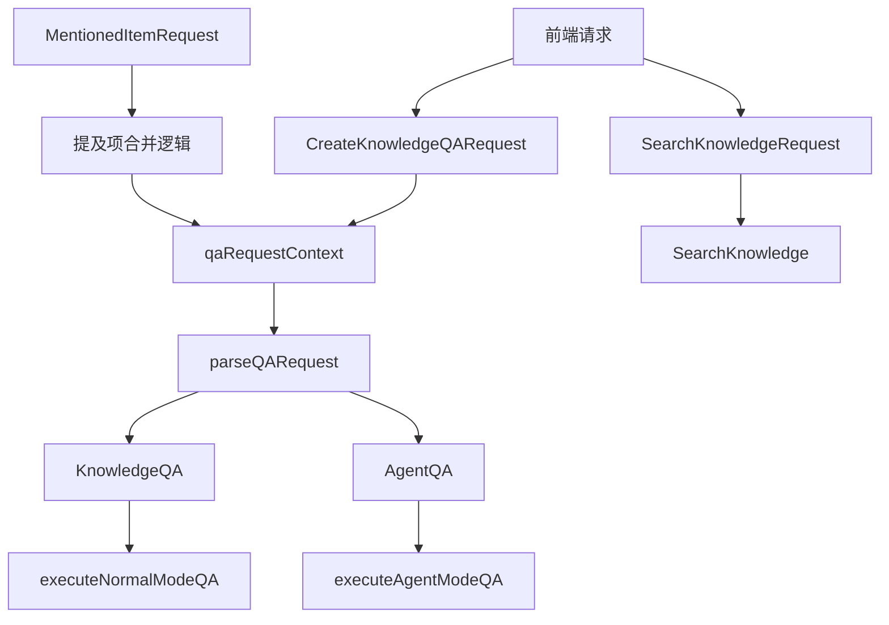

# Session QA and Search Request Contracts

## 模块概览

这个模块是整个系统与前端交互的"门户契约层"，负责定义和处理会话问答与知识搜索的请求格式、上下文管理和参数验证。它就像一个智能接待员——不仅要听懂用户的问题，还要确保所有必要的信息都齐全，并把请求正确地路由到后端的处理流程中。

**核心价值主张**：在保持向后兼容性的同时，为多样化的问答场景（普通问答、Agent智能问答、纯知识搜索）提供统一的请求契约和上下文管理机制。

## 架构总览



这个模块的架构可以分为三个层次：
1. **契约层**：`CreateKnowledgeQARequest`、`SearchKnowledgeRequest`、`MentionedItemRequest` 定义了请求的数据结构
2. **上下文层**：`qaRequestContext` 管理请求处理过程中的所有状态和依赖
3. **处理层**：`parseQARequest`、`KnowledgeQA`、`AgentQA`、`SearchKnowledge` 实现具体的请求处理逻辑

### 关键设计决策

#### 1. 统一请求结构，分离处理逻辑
**决策**：使用同一个 `CreateKnowledgeQARequest` 结构来支持普通问答和 Agent 问答，但通过不同的端点和处理逻辑来区分。

**权衡分析**：
- ✅ 优点：前端只需构建一种请求格式，降低了客户端复杂度
- ✅ 优点：便于在两种模式之间共享验证逻辑和上下文构建
- ❌ 缺点：请求结构中包含了某些只在特定模式下使用的字段（如 `AgentEnabled`）
- ❌ 缺点：需要额外的路由逻辑来决定使用哪种处理模式

**替代方案考虑**：
- 曾考虑为两种模式创建完全独立的请求结构，但这会导致代码重复和维护成本增加
- 最终选择了"统一结构+条件处理"的方案，因为它在简洁性和灵活性之间取得了最佳平衡

#### 2. @提及项自动合并机制
**决策**：在 `parseQARequest` 中实现了将 `MentionedItems` 自动合并到 `KnowledgeBaseIDs` 和 `KnowledgeIDs` 的逻辑。

**设计动机**：
解决了一个实际的用户体验问题——用户经常在输入中 @提及某个知识库或文件，但忘记在侧边栏中选择它。如果不合并，检索就不会包含这些 @提及的资源，导致回答质量下降。

**实现细节**：
```go
// 使用 map 去重，确保同一个知识库或文件不会被重复添加
kbIDSet := make(map[string]bool)
knowledgeIDSet := make(map[string]bool)
// 先处理显式指定的 ID
// 再处理 @提及的 ID
```

#### 3. 共享 Agent 的有效租户解析
**决策**：当使用共享 Agent 时，解析出 `effectiveTenantID` 并在后续的模型、知识库和 MCP 调用中使用该租户上下文。

**背景**：
共享 Agent 是一个跨租户的概念——Agent 属于租户 A，但租户 B 的用户可以通过共享关系使用它。在这种情况下，模型调用、知识库检索等操作应该使用 Agent 所属租户（租户 A）的资源，而不是当前用户的租户（租户 B）。

**实现**：
```go
if h.agentShareService != nil && userIDVal != nil && currentTenantID != 0 {
    agent, err := h.agentShareService.GetSharedAgentForUser(ctx, userID, currentTenantID, request.AgentID)
    if err == nil && agent != nil {
        effectiveTenantID = agent.TenantID  // 关键：使用 Agent 所属的租户
        customAgent = agent
    }
}
```

## 子模块说明

### QA Request Payload Contracts
定义了知识问答请求的核心数据结构，包括查询内容、知识库选择、Agent 配置等。这些结构经过精心设计，既支持丰富的功能组合，又保持了良好的向后兼容性。

[查看详细文档](session_qa_and_search_request_contracts-qa_request_payload_contracts.md)

### Knowledge Search Request Payload Contracts
专注于纯知识搜索场景的请求契约，支持单知识库和多知识库搜索，以及直接指定知识 ID 进行搜索。包含了向后兼容的设计（同时支持 `KnowledgeBaseID` 和 `KnowledgeBaseIDs`）。

[查看详细文档](session_qa_and_search_request_contracts-knowledge_search_request_payload_contracts.md)

### QA Request Runtime Context
负责请求上下文的构建和管理，是整个请求处理流程的"状态中心"。它不仅存储了请求的原始数据，还包含了解析后的 Agent 信息、有效租户 ID、合并后的知识库列表等运行时状态。

[查看详细文档](session_qa_and_search_request_contracts-qa_request_runtime_context.md)

## 与其他模块的关系

### 依赖关系
- **核心依赖**：
  - [`internal/types`](core_domain_types_and_interfaces.md)：提供了 `Session`、`CustomAgent`、`Message` 等核心领域模型
  - [`internal/errors`](core_domain_types_and_interfaces.md)：定义了统一的错误处理契约
  - [`internal/event`](platform_infrastructure_and_runtime-event_bus_and_agent_runtime_event_contracts.md)：提供了事件总线，用于异步通信
  - [`internal/logger`](platform_infrastructure_and_runtime-platform_utilities_lifecycle_observability_and_security.md)：日志记录

- **服务依赖**：
  - `sessionService`：会话管理服务
  - `customAgentService`：自定义 Agent 服务
  - `agentShareService`：Agent 共享服务
  - `messageService`：消息管理服务
  - `tenantService`：租户管理服务

### 被依赖关系
这个模块是 HTTP 层的一部分，主要被外部的 HTTP 路由器调用，不被内部的业务逻辑模块直接依赖。

## 数据流详解

### 知识问答请求的完整生命周期

1. **请求接收**：
   - HTTP 请求到达 `KnowledgeQA` 或 `AgentQA` 端点
   - Gin 框架将请求路由到对应的处理函数

2. **请求解析与验证**（`parseQARequest`）：
   - 从 URL 中提取 `session_id`
   - 解析 JSON 请求体到 `CreateKnowledgeQARequest`
   - 验证必填字段（如 `Query`）
   - 获取会话信息
   - 解析 Agent（如果提供了 `AgentID`）
   - **关键步骤**：合并 `@提及项` 到知识库和知识 ID 列表
   - 构建 `qaRequestContext`

3. **上下文准备**（`setupSSEStream`）：
   - 设置 SSE 响应头
   - 创建事件总线
   - 构建可取消的异步上下文
   - 如果使用共享 Agent，设置有效租户上下文
   - 设置事件处理器

4. **执行处理**：
   - 普通模式：调用 `executeNormalModeQA` → `sessionService.KnowledgeQA`
   - Agent 模式：调用 `executeAgentModeQA` → `sessionService.AgentQA`
   - 处理在 goroutine 中异步执行

5. **事件处理与响应**：
   - `handleAgentEventsForSSE` 阻塞等待事件
   - 通过 SSE 流将事件推送到前端
   - 完成后标记消息为已完成

## 新贡献者指南

### 常见陷阱与注意事项

1. **租户上下文切换**：
   - 当使用共享 Agent 时，`asyncCtx` 中的租户是 `effectiveTenantID`（Agent 所属租户）
   - 但更新消息时，必须使用会话所属的租户（`reqCtx.session.TenantID`）
   - 代码中已经有这样的处理：
     ```go
     updateCtx := context.WithValue(streamCtx.asyncCtx, types.TenantIDContextKey, reqCtx.session.TenantID)
     h.completeAssistantMessage(updateCtx, streamCtx.assistantMessage)
     ```

2. **@提及项合并的幂等性**：
   - 合并逻辑使用了 map 去重，所以即使同一个 ID 既在 `KnowledgeBaseIDs` 中又在 `MentionedItems` 中，也不会导致重复
   - 不要移除这个去重逻辑，否则可能导致检索时的重复计算

3. **向后兼容性**：
   - `SearchKnowledgeRequest` 同时支持 `KnowledgeBaseID`（单数）和 `KnowledgeBaseIDs`（复数）
   - 修改时要保持这种兼容性，不要随意移除旧字段

4. **错误处理**：
   - 所有对外的错误都应该使用 `errors.NewBadRequestError`、`errors.NewNotFoundError` 等工厂函数创建
   - 不要直接返回原始错误给前端

### 扩展点

1. **添加新的请求参数**：
   - 在 `CreateKnowledgeQARequest` 中添加字段
   - 在 `parseQARequest` 中处理该字段
   - 将其添加到 `qaRequestContext` 中
   - 传递给下层的服务调用

2. **自定义验证逻辑**：
   - 在 `parseQARequest` 中添加额外的验证步骤
   - 使用 `errors.NewBadRequestError` 返回验证失败

3. **请求预处理**：
   - 可以在 `parseQARequest` 中添加查询预处理逻辑（如敏感词过滤、query 改写等）
   - 但注意保持这个函数的聚焦——复杂的预处理应该下放给服务层
