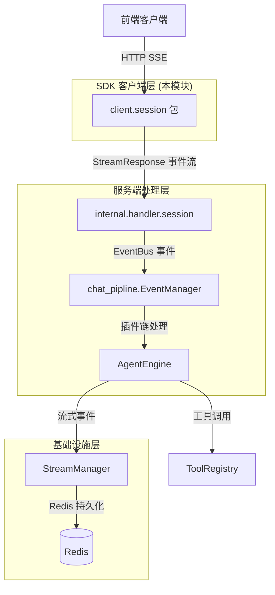

# session_streaming_and_llm_calls_api 模块深度解析

## 一、模块存在的意义：为什么需要这个模块？

想象你正在和一个 AI 助手对话。当你提出问题后，你并不想等待几十秒后一次性看到完整答案 —— 你希望看到它"思考"的过程：先是"让我想想..."，然后可能调用某个工具查询知识库，接着对结果进行分析，最后给出答案。这种**实时、渐进式的响应体验**就是流式传输（streaming）要解决的问题。

但流式传输不仅仅是"把答案切成小块发送"那么简单。在 WeKnora 的 Agent 系统中，一次完整的问答可能包含多个阶段：

```
用户提问 → Agent 思考 → 调用工具 → 等待工具返回 → 反思结果 → 再次调用工具 → 生成最终答案
```

每个阶段都需要实时通知前端，让 UI 能够展示不同的状态（思考中、工具执行中、结果展示等）。如果采用传统的请求 - 响应模式，前端只能在所有步骤完成后才能看到结果，用户体验会非常糟糕。

**这个模块的核心价值**在于：它定义了一套完整的**流式响应协议**和**工具调用契约**，让客户端能够：
1. 通过 SSE（Server-Sent Events）实时接收 Agent 的执行过程
2. 解析不同类型的流式事件（思考、工具调用、工具结果、最终答案等）
3. 理解 LLM 发出的工具调用请求（function call）

**为什么不能简单地用 WebSocket？** SSE 是单向的（服务器→客户端），正好符合流式响应的场景，且基于 HTTP，防火墙友好，重连机制简单。WebSocket 虽然功能更强，但在这里是过度设计。

---

## 二、心智模型：流式响应就像"直播弹幕"

把这个模块想象成一个**直播弹幕系统**：

- **直播间** = 一次会话（Session）
- **主播** = Agent Engine（后端）
- **观众** = 前端客户端
- **弹幕** = StreamResponse 事件流

主播在直播过程中会发出各种类型的弹幕：
- "普通弹幕"（`answer`）：主播在说话
- "系统提示"（`thinking`）：主播在思考
- "连麦请求"（`tool_call`）：主播要呼叫外部嘉宾（工具）
- "嘉宾发言"（`tool_result`）：外部嘉宾的回复
- "参考资料"（`references`）：主播展示的资料卡片
- "直播结束"（`complete`）：本次直播完成

客户端的工作就是：
1. 建立连接到直播间（调用 `KnowledgeQAStream`）
2. 监听弹幕事件（callback 回调）
3. 根据弹幕类型更新 UI（不同类型的 StreamResponse 对应不同的 UI 组件）

### 核心抽象

```
┌─────────────────────────────────────────────────────────────┐
│                     StreamResponse                          │
│  ┌─────────────┐  ┌──────────────┐  ┌─────────────────┐   │
│  │ ResponseType│  │   Content    │  │    ToolCalls    │   │
│  │ (事件类型)   │  │  (内容片段)   │  │  (工具调用列表)  │   │
│  └─────────────┘  └──────────────┘  └─────────────────┘   │
│  ┌─────────────┐  ┌──────────────┐  ┌─────────────────┐   │
│  │    Done     │  │     Data     │  │ KnowledgeRefs   │   │
│  │ (是否完成)   │  │  (扩展元数据) │  │  (知识引用)     │   │
│  └─────────────┘  └──────────────┘  └─────────────────┘   │
└─────────────────────────────────────────────────────────────┘
```

`ResponseType` 是整个流式协议的**状态机**，它决定了前端应该如何渲染当前事件。

---

## 三、架构与数据流

### 3.1 模块在系统中的位置



### 3.2 关键数据流：一次完整的流式问答

让我们追踪一次 `KnowledgeQAStream` 调用的完整生命周期：

```
┌──────────┐                              ┌──────────┐
│  客户端   │                              │  服务端   │
└────┬─────┘                              └────┬─────┘
     │                                         │
     │ POST /api/v1/knowledge-chat/{sessionID} │
     │ KnowledgeQARequest                      │
     │                                         │
     ├────────────────────────────────────────>│
     │                                         │
     │                              ┌──────────────────────┐
     │                              │ 1. EventManager 分发  │
     │                              │    事件到插件链        │
     │                              └──────────────────────┘
     │                                         │
     │                              ┌──────────────────────┐
     │                              │ 2. AgentEngine 执行   │
     │                              │    - 思考 (thinking)  │
     │                              │    - 工具调用         │
     │                              │    - 生成答案         │
     │                              └──────────────────────┘
     │                                         │
     │         SSE Stream (StreamResponse 事件流)
     │<────────────────────────────────────────┤
     │                                         │
     │  event: message                         │
     │  data: {"response_type":"thinking",     │
     │         "content":"让我分析一下...",    │
     │         "done":false}                   │
     │                                         │
     │  event: message                         │
     │  data: {"response_type":"tool_call",    │
     │         "tool_calls":[{...}],           │
     │         "done":false}                   │
     │                                         │
     │  event: message                         │
     │  data: {"response_type":"tool_result",  │
     │         "data":{...},                   │
     │         "done":false}                   │
     │                                         │
     │  event: message                         │
     │  data: {"response_type":"answer",       │
     │         "content":"根据查询结果...",    │
     │         "done":false}                   │
     │                                         │
     │  event: message                         │
     │  data: {"response_type":"complete",     │
     │         "done":true}                    │
     │                                         │
     │                                         │
```

### 3.3 组件依赖关系

| 组件 | 依赖 | 被依赖 |
|------|------|--------|
| `StreamResponse` | 无 | `KnowledgeQAStream`, `ContinueStream`, [message_trace_and_tool_events_api](message_trace_and_tool_events_api.md) |
| `LLMToolCall` | `FunctionCall` | `StreamResponse`, [agent_conversation_api](agent_conversation_api.md) |
| `FunctionCall` | 无 | `LLMToolCall` |
| `KnowledgeQARequest` | 无 | `KnowledgeQAStream` |
| `SearchKnowledgeRequest` | 无 | `SearchKnowledge` |

---

## 四、核心组件深度解析

### 4.1 StreamResponse：流式响应的"通用货币"

```go
type StreamResponse struct {
    ID                  string                 `json:"id"`
    ResponseType        ResponseType           `json:"response_type"`
    Content             string                 `json:"content"`
    Done                bool                   `json:"done"`
    KnowledgeReferences []*SearchResult        `json:"knowledge_references,omitempty"`
    SessionID           string                 `json:"session_id,omitempty"`
    AssistantMessageID  string                 `json:"assistant_message_id,omitempty"`
    ToolCalls           []LLMToolCall          `json:"tool_calls,omitempty"`
    Data                map[string]interface{} `json:"data,omitempty"`
}
```

**设计意图**：这是一个**联合类型（Union Type）**的 Go 语言实现。所有类型的流式事件都使用同一个结构体，通过 `ResponseType` 字段区分事件类型。

**为什么这样设计？**
- **优点**：前端只需要维护一个事件处理器，通过 switch-case 根据 `ResponseType` 分发即可
- **缺点**：某些字段在某些事件类型中是冗余的（如 `tool_result` 事件不需要 `Content`）
- **权衡**：选择了**接口统一性**而非**类型精确性**，简化了协议解析逻辑

**ResponseType 枚举详解**：

| 类型 | 触发时机 | 前端行为 |
|------|----------|----------|
| `thinking` | Agent 开始思考 | 显示"思考中"动画 |
| `tool_call` | LLM 决定调用工具 | 展示工具调用卡片（名称、参数） |
| `tool_result` | 工具执行完成 | 展示工具返回结果 |
| `answer` | 生成答案片段 | 追加到答案区域（流式打字机效果） |
| `references` | 检索到相关知识 | 展示引用来源卡片 |
| `reflection` | Agent 反思工具结果 | 显示反思内容（可选） |
| `agent_query` | Agent 发起子查询 | 创建嵌套查询上下文 |
| `session_title` | 生成会话标题 | 更新会话标题 |
| `complete` | 本次问答完成 | 结束流式，启用输入框 |
| `error` | 发生错误 | 显示错误提示 |

**关键字段说明**：

- `Done`：**流式分片标记**。当 `Done=true` 时，表示当前事件类型的内容已完整。注意：一个完整的问答可能包含多个 `Done=true` 的事件（如一个 `thinking` 完成 + 一个 `answer` 完成 + 一个 `complete`）。
- `Data`：**扩展元数据容器**。这是一个 `map[string]interface{}`，用于传递特定事件类型的额外信息。例如 `tool_result` 事件中可能包含 `{ "display_type": "table", "columns": [...] }` 用于前端渲染表格。
- `KnowledgeReferences`：**引用溯源**。仅在 `references` 或 `answer` 事件中携带，用于展示答案的知识来源。

### 4.2 LLMToolCall & FunctionCall：工具调用的"信封与信"

```go
type LLMToolCall struct {
    ID       string       `json:"id"`
    Type     string       `json:"type"` // "function"
    Function FunctionCall `json:"function"`
}

type FunctionCall struct {
    Name      string `json:"name"`
    Arguments string `json:"arguments"` // JSON string
}
```

**设计细节**：

1. **为什么 `Arguments` 是 JSON 字符串而不是对象？**
   
   这是为了与 OpenAI 的 Function Calling API 保持兼容。LLM 返回的工具调用参数是字符串形式，需要客户端自行解析：
   
   ```go
   var args map[string]interface{}
   json.Unmarshal([]byte(toolCall.Function.Arguments), &args)
   ```
   
   **权衡**：牺牲了类型安全性，换取了与主流 LLM API 的兼容性。

2. **`Type` 字段的存在意义**
   
   目前只有 `"function"` 一种类型，但预留了扩展空间（未来可能支持 `"code_interpreter"`、`"retrieval"` 等）。

3. **与 `client.message.ToolCall` 的关系**
   
   | 字段 | `LLMToolCall` | `client.message.ToolCall` |
   |------|---------------|---------------------------|
   | 用途 | 流式传输中的**原始调用** | 消息历史中的**完整记录** |
   | 参数 | `Arguments` (JSON 字符串) | `Args` (已解析的 map) |
   | 结果 | 无 | `Result *ToolResult` |
   | 反思 | 无 | `Reflection string` |
   | 耗时 | 无 | `Duration int64` |
   
   **理解**：`LLMToolCall` 是"进行中"的状态，`ToolCall` 是"已完成"的状态。

### 4.3 KnowledgeQAStream：SSE 流的"接收器"

```go
func (c *Client) KnowledgeQAStream(
    ctx context.Context,
    sessionID string,
    request *KnowledgeQARequest,
    callback func(*StreamResponse) error,
) error
```

**实现机制**：

1. **建立连接**：发送 POST 请求到 `/api/v1/knowledge-chat/{sessionID}`
2. **读取 SSE**：使用 `bufio.Scanner` 逐行读取响应体
3. **解析事件**：识别 `event:` 和 `data:` 前缀，缓冲直到空行（事件结束）
4. **回调处理**：将解析后的 `StreamResponse` 传递给 callback

**关键代码片段分析**：

```go
// 使用 bufio 逐行读取 SSE 数据
scanner := bufio.NewScanner(resp.Body)
var dataBuffer string
var eventType string

for scanner.Scan() {
    line := scanner.Text()
    
    // 空行表示事件结束
    if line == "" {
        if dataBuffer != "" {
            var streamResponse StreamResponse
            json.Unmarshal([]byte(dataBuffer), &streamResponse)
            callback(&streamResponse)  // 关键：回调通知
            dataBuffer = ""
        }
        continue
    }
    
    // 解析 event: 和 data: 行
    if strings.HasPrefix(line, "event:") {
        eventType = line[6:]
    }
    if strings.HasPrefix(line, "data:") {
        dataBuffer = line[5:]
    }
}
```

**设计选择**：

- **为什么用 callback 而不是 channel？**
  
  callback 模式更简单，不需要管理 channel 的生命周期和关闭。但缺点是 callback 中的错误会直接中断流式接收。
  
- **为什么没有重连逻辑？**
  
  这是 SDK 的**客户端责任分离**设计。重连策略因应用场景而异（有的需要指数退避，有的需要立即重连），SDK 提供基础能力，重连逻辑由上层应用实现。

### 4.4 KnowledgeQARequest：问答请求的"配置单"

```go
type KnowledgeQARequest struct {
    Query            string   `json:"query"`
    KnowledgeBaseIDs []string `json:"knowledge_base_ids"`
    KnowledgeIDs     []string `json:"knowledge_ids"`
    AgentEnabled     bool     `json:"agent_enabled"`
    AgentID          string   `json:"agent_id"`
    WebSearchEnabled bool     `json:"web_search_enabled"`
    SummaryModelID   string   `json:"summary_model_id"`
    DisableTitle     bool     `json:"disable_title"`
}
```

**字段含义**：

| 字段 | 作用 | 默认行为 |
|------|------|----------|
| `Query` | 用户问题 | 必填 |
| `KnowledgeBaseIDs` | 指定搜索的知识库 | 空则搜索全部 |
| `KnowledgeIDs` | 指定具体文档 | 空则在知识库内搜索 |
| `AgentEnabled` | 是否启用 Agent 模式 | `false` 则直接检索 + 总结 |
| `AgentID` | 自定义 Agent ID | 空则使用默认 Agent |
| `WebSearchEnabled` | 是否启用联网搜索 | 与知识库搜索并行 |
| `SummaryModelID` | 指定总结模型 | 空则使用会话默认模型 |
| `DisableTitle` | 是否禁用自动生成标题 | `false` 则异步生成标题 |

**设计权衡**：

- **扁平化设计**：所有配置都在同一层级，没有嵌套结构。优点是简单直观，缺点是如果未来需要扩展复杂配置（如每个知识库的不同权重），需要重构。

---

## 五、设计决策与权衡

### 5.1 SSE vs WebSocket：为什么选择 SSE？

| 维度 | SSE | WebSocket |
|------|-----|-----------|
| 协议复杂度 | 基于 HTTP，简单 | 独立协议，需要握手 |
| 双向通信 | ❌ 单向 | ✅ 双向 |
| 重连机制 | 内置 | 需自行实现 |
| 防火墙穿透 | ✅ 好 | ⚠️ 可能被拦截 |
| 二进制数据 | ❌ 不支持 | ✅ 支持 |

**决策**：本模块只需要**服务器→客户端**的单向流式传输，SSE 完全满足需求且更简单。如果需要客户端主动发送控制命令（如暂停、快进），可以通过额外的 HTTP 端点实现（如 `StopSession`）。

### 5.2 统一响应体 vs 专用响应体

**方案 A（当前选择）**：所有事件类型共用 `StreamResponse` 结构体，通过 `ResponseType` 区分。

**方案 B**：为每种事件类型定义专用结构体（`ThinkingResponse`, `ToolCallResponse`, `AnswerResponse` 等）。

**选择 A 的理由**：
1. 前端解析逻辑统一，只需一个 `json.Unmarshal`
2. 后端事件总线（EventBus）可以统一处理所有事件
3. 新增事件类型无需修改协议结构

**代价**：
1. 某些字段在特定事件类型中无意义（如 `tool_result` 事件的 `Content` 字段）
2. 类型安全性降低，需要运行时检查 `ResponseType`

### 5.3 同步回调 vs 异步 Channel

**当前设计**：`callback func(*StreamResponse) error`

**替代方案**：`func() <-chan StreamResponse`

**选择回调的理由**：
1. Go 的 callback 模式更符合 HTTP 客户端库的惯例
2. 错误处理更直接（callback 返回 error 即可中断）
3. 不需要管理 channel 的关闭和 goroutine 泄漏

**潜在问题**：
- 如果 callback 处理耗时过长，会阻塞 SSE 流的读取
- 无法实现"背压"（backpressure）机制

**建议**：在 callback 中只做轻量级处理（如发送到 channel 或队列），耗时操作异步执行。

### 5.4 工具调用参数的 JSON 字符串设计

```go
Arguments string `json:"arguments"` // JSON string
```

**为什么不是 `map[string]interface{}`？**

这是为了与 OpenAI API 保持兼容。OpenAI 的 Function Calling 返回的参数就是 JSON 字符串格式：

```json
{
  "name": "search_knowledge",
  "arguments": "{\"query\": \"AI 发展趋势\", \"limit\": 5}"
}
```

**影响**：
- 客户端需要额外解析：`json.Unmarshal([]byte(args), &params)`
- 无法在编译期检查参数结构
- 但获得了与主流 LLM 平台的互操作性

---

## 六、使用指南与示例

### 6.1 基础用法：流式问答

```go
client := client.NewClient(baseURL, apiKey)

request := &client.KnowledgeQARequest{
    Query:            "什么是机器学习？",
    KnowledgeBaseIDs: []string{"kb-123"},
    AgentEnabled:     true,
}

var fullAnswer strings.Builder

err := client.KnowledgeQAStream(ctx, "session-456", request, func(resp *client.StreamResponse) error {
    switch resp.ResponseType {
    case client.ResponseTypeThinking:
        fmt.Printf("🤔 思考中：%s\n", resp.Content)
        
    case client.ResponseTypeToolCall:
        for _, tc := range resp.ToolCalls {
            fmt.Printf("🔧 调用工具：%s\n", tc.Function.Name)
        }
        
    case client.ResponseTypeToolResult:
        fmt.Printf("✅ 工具返回：%v\n", resp.Data)
        
    case client.ResponseTypeAnswer:
        fullAnswer.WriteString(resp.Content)
        fmt.Printf("📝 答案：%s", resp.Content)
        
    case client.ResponseTypeReferences:
        fmt.Printf("📚 引用来源：%d 条\n", len(resp.KnowledgeReferences))
        
    case client.ResponseTypeComplete:
        fmt.Println("\n✨ 完成")
        
    case client.ResponseTypeError:
        return fmt.Errorf("错误：%s", resp.Content)
    }
    return nil
})
```

### 6.2 断点续传：ContinueStream

当网络中断或页面刷新后，可以使用 `ContinueStream` 恢复之前的流式响应：

```go
// 从上次中断的 messageID 继续
err := client.ContinueStream(ctx, "session-456", "msg-789", func(resp *client.StreamResponse) error {
    // 处理恢复的事件流
    return nil
})
```

**原理**：服务端使用 `StreamManager` 将流式事件持久化到 Redis，`ContinueStream` 从指定 offset 读取未消费的事件。

### 6.3 停止生成

```go
// 停止当前会话中指定消息的生成
err := client.StopSession(ctx, "session-456", "msg-789")
```

**注意**：`StopSession` 需要同时提供 `sessionID` 和 `messageID`，因为一个会话中可能有多个并行的问答消息。

### 6.4 纯知识搜索（无 LLM 总结）

```go
request := &client.SearchKnowledgeRequest{
    Query:            "机器学习",
    KnowledgeBaseIDs: []string{"kb-123"},
}

results, err := client.SearchKnowledge(ctx, request)
for _, r := range results {
    fmt.Printf("文档：%s, 相似度：%.4f\n", r.Title, r.Score)
}
```

---

## 七、边界情况与注意事项

### 7.1 流式事件的顺序保证

**保证**：同一消息（messageID）内的事件按发送顺序到达。

**不保证**：不同消息之间的事件顺序。例如，如果同时发起两个问答，它们的流式事件可能交错。

**建议**：前端应基于 `AssistantMessageID` 将事件分组到对应的消息气泡中。

### 7.2 Done 字段的语义陷阱

```go
// 错误理解：Done=true 表示整个问答完成
if resp.Done {
    // ❌ 错误：可能只是当前事件类型完成
}

// 正确理解：需要检查 ResponseType
if resp.Done && resp.ResponseType == client.ResponseTypeComplete {
    // ✅ 正确：整个问答完成
}
```

**示例场景**：
```
event: thinking, done=true   ← 思考阶段完成
event: answer, done=false    ← 答案开始
event: answer, done=false    ← 答案继续
event: answer, done=true     ← 答案完成
event: complete, done=true   ← 整个问答完成
```

### 7.3 工具调用参数的解析

```go
// 常见错误：直接使用 Arguments 字符串
args := toolCall.Function.Arguments  // ❌ 这是 JSON 字符串

// 正确做法：解析为对象
var params map[string]interface{}
err := json.Unmarshal([]byte(toolCall.Function.Arguments), &params)
if err != nil {
    // 处理解析错误
}
```

### 7.4 错误处理策略

**SSE 流的错误处理特点**：
1. 网络错误：`scanner.Err()` 会返回读取错误
2. HTTP 错误：在读取流之前检查 `resp.StatusCode`
3. 业务错误：通过 `ResponseType=error` 的 StreamResponse 传递

**推荐模式**：
```go
err := client.KnowledgeQAStream(ctx, sessionID, request, func(resp *StreamResponse) error {
    if resp.ResponseType == ResponseTypeError {
        return fmt.Errorf("服务端错误：%s", resp.Content)
    }
    // 正常处理...
    return nil
})

if err != nil {
    // 区分网络错误和业务错误
    if strings.Contains(err.Error(), "服务端错误") {
        // 业务错误：展示给用户
    } else {
        // 网络错误：考虑重试
    }
}
```

### 7.5 并发与资源管理

**注意**：`KnowledgeQAStream` 是阻塞调用，在 callback 返回前不会返回。

**错误示例**：
```go
// ❌ 在 HTTP handler 中直接调用，可能导致请求超时
func handler(w http.ResponseWriter, r *http.Request) {
    client.KnowledgeQAStream(ctx, sessionID, request, callback)
}
```

**正确做法**：
```go
// ✅ 使用 goroutine + channel 解耦
func handler(w http.ResponseWriter, r *http.Request) {
    eventChan := make(chan *StreamResponse, 100)
    
    go func() {
        client.KnowledgeQAStream(ctx, sessionID, request, func(resp *StreamResponse) error {
            eventChan <- resp
            return nil
        })
        close(eventChan)
    }()
    
    // 使用 SSE 库发送事件到前端
    for event := range eventChan {
        // 发送...
    }
}
```

### 7.6 已知限制

| 限制 | 影响 | 缓解方案 |
|------|------|----------|
| 无内置重连 | 网络中断需手动重连 | 上层实现重连逻辑 |
| 无背压控制 | callback 慢会阻塞流 | callback 内快速转发到队列 |
| 无事件过滤 | 接收所有事件类型 | 前端根据 ResponseType 过滤 |
| 无增量更新 | 工具结果一次性返回 | 长耗时工具自行实现流式 |

---

## 八、相关模块参考

- **[session_lifecycle_api](session_lifecycle_api.md)**：会话的创建、获取、删除等生命周期管理
- **[session_qa_and_search_api](session_qa_and_search_api.md)**：知识问答和搜索的请求参数定义
- **[message_trace_and_tool_events_api](message_trace_and_tool_events_api.md)**：消息历史和工具执行记录的查询
- **[agent_conversation_api](agent_conversation_api.md)**：Agent 对话的高级封装
- **chat_pipline 插件系统**：服务端的事件处理和插件链机制（内部模块）
- **StreamManager**：流式事件的 Redis 持久化（内部模块）

---

## 九、扩展点与二次开发

### 9.1 添加新的事件类型

如果需要新增一种流式事件类型（如 `code_execution`）：

1. 在 `ResponseType` 枚举中添加新值：
   ```go
   const (
       // ... 现有类型
       ResponseTypeCodeExecution ResponseType = "code_execution"
   )
   ```

2. 在 `StreamResponse.Data` 中携带特定字段：
   ```go
   &StreamResponse{
       ResponseType: ResponseTypeCodeExecution,
       Data: map[string]interface{}{
           "code": "print('hello')",
           "language": "python",
           "output": "hello",
       },
   }
   ```

3. 前端根据新类型添加渲染逻辑。

### 9.2 自定义重连逻辑

```go
func streamWithRetry(client *Client, sessionID string, request *KnowledgeQARequest) error {
    maxRetries := 3
    for i := 0; i < maxRetries; i++ {
        err := client.KnowledgeQAStream(ctx, sessionID, request, callback)
        if err == nil {
            return nil
        }
        
        // 指数退避
        time.Sleep(time.Duration(i+1) * time.Second)
    }
    return fmt.Errorf("max retries exceeded")
}
```

### 9.3 事件持久化与回放

如果需要本地缓存流式事件：

```go
var events []*StreamResponse

err := client.KnowledgeQAStream(ctx, sessionID, request, func(resp *StreamResponse) error {
    events = append(events, resp)  // 本地缓存
    render(resp)                    // 实时渲染
    return nil
})

// 后续可以回放
for _, e := range events {
    render(e)
}
```

---

## 十、总结

`session_streaming_and_llm_calls_api` 模块是 WeKnora Agent 系统与前端通信的**实时桥梁**。它通过 SSE 协议实现了低延迟的流式响应，通过统一的 `StreamResponse` 结构体简化了事件处理，通过与 OpenAI 兼容的工具调用格式保证了互操作性。

**核心设计哲学**：
1. **简单优先**：SSE 优于 WebSocket，callback 优于 channel
2. **统一接口**：所有事件类型共用一个响应结构
3. **责任分离**：SDK 提供基础能力，重连、背压等由上层实现

**理解这个模块的关键**：把它看作一个**事件流管道**，后端不断产生事件，前端消费事件并更新 UI。事件类型决定了 UI 的渲染方式，事件顺序反映了 Agent 的执行过程。
