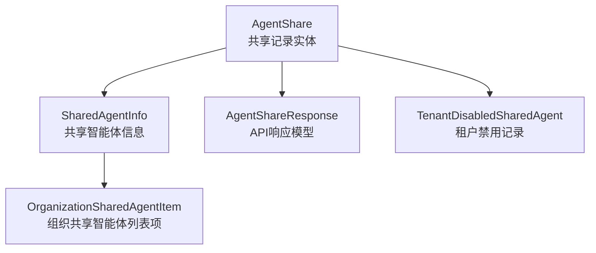

# shared_agent_response_and_listing_models 模块深度解析

## 1. 模块概述

这个模块是组织资源共享系统的核心组件，专门负责智能体（Agent）共享的响应契约和列表模型。它解决了跨租户智能体共享中的复杂问题：如何在组织内安全地共享智能体，同时清晰地标识资源来源、权限边界和用户偏好。

想象一下一个企业协作空间，不同团队（租户）需要共享智能体，但又需要保持一定的独立性和控制权。这个模块就像是这个协作空间的"资源目录管理员"，它记录了谁共享了什么、给了谁、权限如何，以及用户如何个性化地管理这些共享资源。

## 2. 核心架构与数据模型

### 2.1 核心组件关系图



### 2.2 组件职责说明

- **AgentShare**: 数据库级别的共享记录实体，存储智能体共享的原始数据
- **SharedAgentInfo**: 业务层的共享智能体信息模型，包含丰富的元数据和上下文信息
- **OrganizationSharedAgentItem**: 组织级列表展示模型，增加了"是否为我所有"的标识
- **AgentShareResponse**: API响应模型，专门用于向客户端返回共享记录
- **TenantDisabledSharedAgent**: 租户级别的智能体禁用记录，实现用户个性化控制

## 3. 核心组件深度解析

### 3.1 SharedAgentInfo 结构体

**设计意图**：这是一个聚合模型，将智能体本身的信息与共享上下文信息结合在一起。它不仅仅是数据的简单组合，更是业务逻辑的载体。

**关键特性**：
- 包含完整的 `CustomAgent` 引用，确保调用者能获取智能体的所有必要信息
- 丰富的共享元数据：共享ID、组织ID、组织名称、权限级别、源租户ID、共享时间
- 共享者信息：`SharedByUserID` 和 `SharedByUsername`，提供完整的审计追踪
- `DisabledByMe` 字段：实现用户级别的个性化控制，允许用户隐藏不感兴趣的共享智能体

**设计权衡**：这个模型包含了关联数据（如 `OrgName`、`SharedByUsername`），这意味着在构建时需要进行额外的查询来解析这些信息。但这种冗余是值得的，因为：
1. 减少了客户端的后续请求
2. 简化了列表渲染逻辑
3. 提供了更好的用户体验

### 3.2 OrganizationSharedAgentItem 结构体

**设计意图**：在组织级别的智能体列表中，需要清晰地区分哪些是"我的"智能体，哪些是"别人共享给我的"智能体。这个模型通过添加 `IsMine` 字段解决了这个问题。

**为什么需要这个模型？**：在同一个组织中，用户可能既是共享者也是消费者。当查看组织内的所有智能体时，用户希望快速识别自己的资源。`IsMine` 字段提供了这种语义上的清晰性。

**使用场景**：
- 组织资源管理页面
- 智能体选择下拉列表
- 资源统计和配额管理

### 3.3 AgentShareResponse 结构体

**设计意图**：这是API层的响应模型，专门为共享记录的列表展示而设计。它包含了客户端需要的所有信息，同时隐藏了不必要的实现细节。

**关键设计亮点**：

1. **权限计算**：`MyPermission` 字段表示当前用户的实际有效权限，它是共享权限和用户在组织中角色的交集（`min(Permission, MyRoleInOrg)`）。这确保了权限的最小特权原则。

2. **智能体范围摘要**：`ScopeKB`、`ScopeKBCount`、`ScopeWebSearch`、`ScopeMCP`、`ScopeMCPCount` 等字段提供了智能体能力的快速概览，允许客户端在不请求详细配置的情况下展示智能体的功能范围。

3. **展示优化**：`AgentAvatar` 字段专门用于列表展示，支持emoji或图标名称，提升了用户界面的体验。

### 3.4 TenantDisabledSharedAgent 结构体

**设计意图**：实现租户级别的智能体可见性控制。这是一个很巧妙的设计，它允许用户"隐藏"某个共享的智能体，而不是删除它。

**为什么需要这个？**：
- 用户可能不希望在自己的智能体列表中看到某些共享的智能体
- 删除共享关系会影响其他用户，而"禁用"只是个人偏好
- 这种设计保留了共享关系，用户可以随时重新启用

**实现细节**：
- 使用复合主键（`TenantID`、`AgentID`、`SourceTenantID`）确保唯一性
- 只记录禁用状态，不需要额外的状态字段
- 简单高效的查询模式

## 4. 数据流向与使用场景

### 4.1 共享智能体列表获取流程

```
1. 客户端请求 GET /organizations/:id/shared-agents
2. 服务端查询该组织的所有 AgentShare 记录
3. 对于每个共享记录：
   a. 加载关联的 CustomAgent 信息
   b. 加载组织信息和共享者信息
   c. 检查当前租户是否禁用了该智能体
   d. 构建 SharedAgentInfo 对象
   e. 判断是否为当前用户所有，设置 IsMine 标志
4. 组装成 OrganizationSharedAgentItem 列表
5. 返回给客户端
```

### 4.2 共享记录详情展示流程

```
1. 客户端请求特定共享记录详情
2. 服务端查询 AgentShare 记录
3. 加载所有关联数据（智能体、组织、用户等）
4. 计算当前用户的有效权限（MyPermission）
5. 如果是智能体，还需要加载其配置范围摘要
6. 构建 AgentShareResponse 对象
7. 返回给客户端
```

## 5. 设计决策与权衡

### 5.1 权限模型的选择

**决策**：采用双重权限模型（共享权限 + 组织角色），有效权限为两者的交集。

**理由**：
- 共享者可以控制智能体的共享权限级别
- 组织管理员可以通过角色限制成员的访问能力
- 确保用户不会获得超出其组织角色的权限

**权衡**：
- 优点：灵活性高，保护了资源所有者和组织的双重利益
- 缺点：权限计算逻辑复杂，容易出错

### 5.2 数据冗余的设计

**决策**：在响应模型中包含关联数据的副本（如组织名称、共享者用户名）。

**理由**：
- 减少客户端的请求次数
- 提高列表渲染性能
- 简化前端开发

**权衡**：
- 优点：更好的用户体验，更简单的客户端代码
- 缺点：服务端需要做更多的数据组装工作，可能产生N+1查询问题

### 5.3 "禁用"而非"删除"的设计

**决策**：使用 `TenantDisabledSharedAgent` 来记录用户的隐藏偏好，而不是删除共享关系。

**理由**：
- 保留共享关系，不影响其他用户
- 用户可以随时重新启用
- 提供更灵活的用户体验

**权衡**：
- 优点：灵活性高，用户体验好
- 缺点：需要额外的存储空间和查询逻辑

## 6. 实际使用示例

### 6.1 构建 SharedAgentInfo

```go
// 假设我们有以下数据
agentShare := &AgentShare{
    ID:             "share-123",
    AgentID:        "agent-456",
    OrganizationID: "org-789",
    SharedByUserID: "user-abc",
    SourceTenantID: 123,
    Permission:     OrgRoleViewer,
    CreatedAt:      time.Now(),
}

agent := &CustomAgent{
    ID:   "agent-456",
    Name: "智能客服助手",
    // 其他字段...
}

organization := &Organization{
    ID:   "org-789",
    Name: "产品研发团队",
}

user := &User{
    ID:       "user-abc",
    Username: "张三",
}

// 检查是否被当前用户禁用
disabled := checkIfDisabled(currentTenantID, agent.ID, agentShare.SourceTenantID)

// 构建 SharedAgentInfo
sharedAgentInfo := &SharedAgentInfo{
    Agent:            agent,
    ShareID:          agentShare.ID,
    OrganizationID:   agentShare.OrganizationID,
    OrgName:          organization.Name,
    Permission:       agentShare.Permission,
    SourceTenantID:   agentShare.SourceTenantID,
    SharedAt:         agentShare.CreatedAt,
    SharedByUserID:   agentShare.SharedByUserID,
    SharedByUsername: user.Username,
    DisabledByMe:     disabled,
}
```

### 6.2 构建 AgentShareResponse

```go
// 继续上面的示例，构建 AgentShareResponse
agentShareResponse := &AgentShareResponse{
    ID:               agentShare.ID,
    AgentID:          agentShare.AgentID,
    AgentName:        agent.Name,
    OrganizationID:   agentShare.OrganizationID,
    OrganizationName: organization.Name,
    SharedByUserID:   agentShare.SharedByUserID,
    SharedByUsername: user.Username,
    SourceTenantID:   agentShare.SourceTenantID,
    Permission:       string(agentShare.Permission),
    MyRoleInOrg:      string(currentUserRole),
    MyPermission:     string(calculateEffectivePermission(agentShare.Permission, currentUserRole)),
    CreatedAt:        agentShare.CreatedAt,
    ScopeKB:          "selected",
    ScopeKBCount:     3,
    ScopeWebSearch:   true,
    ScopeMCP:         "none",
    ScopeMCPCount:    0,
    AgentAvatar:      "🤖",
}
```

## 7. 注意事项与最佳实践

### 7.1 权限计算的一致性

在计算 `MyPermission` 时，确保在整个代码库中使用一致的逻辑。建议将权限计算逻辑提取为一个单独的函数，避免重复实现导致的不一致。

### 7.2 N+1 查询问题

在构建包含关联数据的响应模型时，要注意避免N+1查询问题。使用预加载（preload）或批量查询来优化性能。

### 7.3 租户隔离

在处理跨租户共享时，始终确保正确的租户隔离。特别是在查询 `TenantDisabledSharedAgent` 时，要确保使用正确的 `TenantID`。

### 7.4 智能体配置的摘要

在构建 `AgentShareResponse` 时，智能体范围摘要（Scope* 字段）的计算可能比较复杂。确保这些计算逻辑有良好的测试覆盖，避免在智能体配置变化时出现错误。

### 7.5 数据一致性

当智能体的配置发生变化时，考虑是否需要更新相关的共享记录或缓存。特别是对于智能体范围摘要等衍生数据。

## 8. 相关模块参考

- [agent_sharing_contracts](core_domain_types_and_interfaces-identity_tenant_organization_and_configuration_contracts-organization_resource_sharing_and_access_control_contracts-agent_sharing_contracts.md)：智能体共享的核心契约定义
- [tenant_shared_agent_disable_state_model](core_domain_types_and_interfaces-identity_tenant_organization_and_configuration_contracts-organization_resource_sharing_and_access_control_contracts-tenant_level_shared_agent_access_control_contracts-tenant_shared_agent_disable_state_model.md)：租户级共享智能体禁用状态模型
- [custom_agent_domain_models](core_domain_types_and_interfaces-identity_tenant_organization_and_configuration_contracts-custom_agent_and_skill_capability_contracts-custom_agent_domain_models.md)：自定义智能体的领域模型
