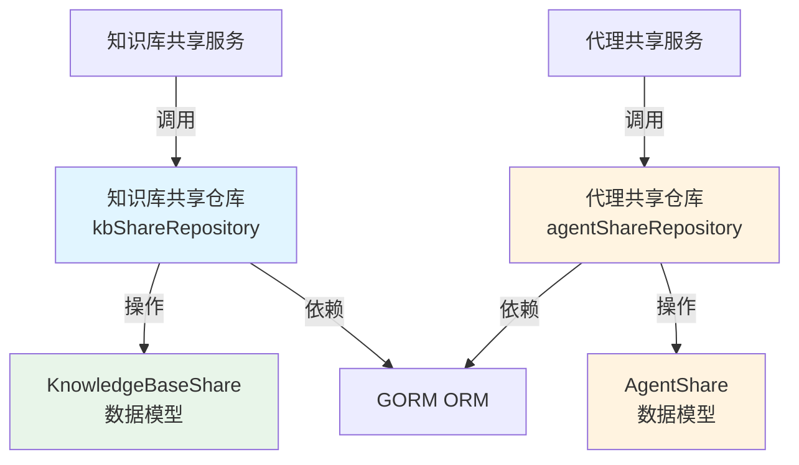

# shared_resource_access_repositories 模块技术文档

## 1. 模块概述

想象一下，你管理着一家企业，有多个团队（组织）在使用公司的知识库和智能助手。你希望团队之间能够安全、可控地共享这些资源，同时又要避免资源被意外删除或越权访问。`shared_resource_access_repositories` 模块就是为了解决这个问题而设计的——它是整个系统中负责记录和管理知识库与代理共享关系的"共享登记簿"。

这个模块不直接处理业务逻辑，而是专注于数据持久化层：它提供了一套标准的 CRUD 操作，用于记录"哪个知识库/代理被共享给了哪个组织"，并确保这些共享关系的一致性和完整性。它是连接组织管理、资源访问控制和实际资源使用的关键桥梁。

## 2. 架构设计

### 2.1 核心组件关系图



### 2.2 架构解析

这个模块采用了经典的**仓库模式（Repository Pattern）**设计，将数据访问逻辑封装在独立的仓库类中：

1. **kbShareRepository**：专门负责知识库共享关系的持久化
   - 它不只是简单的 CRUD，还包含了共享关系的唯一性校验和级联清理逻辑
   - 通过软删除机制保证历史记录的可追溯性

2. **agentShareRepository**：专门负责代理共享关系的持久化
   - 额外引入了 `source_tenant_id` 概念，支持跨租户的代理共享
   - 提供了基于用户组织成员关系的权限查询能力

两个仓库都依赖 GORM 作为 ORM 层，但通过接口抽象（`KBShareRepository` 和 `AgentShareRepository`）保持了与上层服务的解耦。

## 3. 核心设计理念

### 3.1 数据完整性优先

**设计选择**：在创建共享记录前进行存在性检查，使用软删除而非硬删除。

**为什么这样设计**：
- 共享关系是一种"契约"，重复创建会导致逻辑混乱
- 软删除允许审计历史共享记录，同时让删除操作可以回滚
- 避免了因硬删除导致的引用完整性问题

**权衡**：
- ✅ 数据一致性得到保障
- ❌ 数据库会逐渐累积软删除记录（需要后台清理任务）

### 3.2 查询的"可见性过滤"

**设计选择**：列表查询自动过滤掉已删除的资源（知识库、代理、组织）。

**为什么这样设计**：
- 上层服务不应该看到已删除的资源，这是一个领域级别的不变量
- 将这个逻辑放在仓库层，避免了在每个服务中重复编写过滤代码
- 减少了因忘记过滤而导致的 bug 风险

**权衡**：
- ✅ 简化了上层逻辑，降低了误用风险
- ❌ 如果上层确实需要查询已删除的记录（如审计场景），需要额外的方法

### 3.3 批量操作与预加载优化

**设计选择**：提供批量查询方法，并使用 `Preload` 预加载关联数据。

**为什么这样设计**：
- 批量查询可以显著减少数据库 round-trip，提升性能
- 预加载关联数据（如 Organization、KnowledgeBase）避免了 N+1 查询问题
- 特别是在 `ListSharedKBsForUser` 和 `ListSharedAgentsForUser` 这类跨多表查询中，优化效果明显

**权衡**：
- ✅ 性能显著提升
- ❌ 预加载可能会加载一些不需要的数据（但在这个场景下是值得的）

## 4. 关键组件详解

### 4.1 kbShareRepository - 知识库共享仓库

这是管理知识库与组织间共享关系的核心仓库。它不仅记录共享关系，还维护了共享的边界条件：

**核心职责**：
- 创建共享时检查唯一性（同一知识库不能重复共享给同一组织）
- 提供按知识库、组织、用户等多维度的查询能力
- 支持级联删除（删除知识库/组织时自动清理相关共享记录）
- 自动过滤已删除的知识库和组织

**关键方法**：
- `ListSharedKBsForUser`：通过多表 JOIN 一次性查询用户可访问的所有共享知识库
- `CountSharesByKnowledgeBaseIDs`：批量统计多个知识库的共享组织数量
- `ListByOrganization`：查询组织获得的所有共享，同时过滤已删除的知识库

### 4.2 agentShareRepository - 代理共享仓库

代理共享仓库比知识库共享仓库更复杂，因为它引入了**租户**维度：

**核心职责**：
- 管理跨租户的代理共享（通过 `source_tenant_id` 区分代理来源）
- 提供基于用户组织成员关系的访问控制查询
- 支持排除特定租户的代理（避免访问自己租户的代理）

**关键方法**：
- `GetShareByAgentIDForUser`：一次性查询用户可访问的特定代理共享（排除自己租户的）
- `ListSharedAgentsForUser`：查询用户通过组织可访问的所有共享代理
- `DeleteByAgentIDAndSourceTenant`：清理特定租户特定代理的所有共享

## 5. 数据流转

### 5.1 创建共享关系的流程

```
上层服务 (KBShareService)
    ↓
调用 kbShareRepository.Create(share)
    ↓
[1] 检查是否已存在相同的 (knowledge_base_id, organization_id)
    ↓ 不存在
[2] 写入数据库 (软删除感知)
    ↓
返回成功 / 已存在错误
```

### 5.2 查询用户可访问的共享知识库

```
上层服务调用 ListSharedKBsForUser(userID)
    ↓
[1] JOIN organization_members 表获取用户所属组织
    ↓
[2] JOIN organizations 表过滤已删除的组织
    ↓
[3] JOIN knowledge_bases 表过滤已删除的知识库
    ↓
[4] Preload KnowledgeBase 和 Organization 关联数据
    ↓
返回完整的共享记录列表
```

这个流程的关键在于：**所有过滤和关联加载都在一次数据库查询中完成**，既保证了性能，又确保了数据一致性。

## 6. 与其他模块的关系

### 6.1 依赖模块

- **[organization_membership_and_governance_repository](organization_membership_and_governance_repository.md)**：
  - 共享关系依赖组织成员关系来进行权限判断
  - `ListSharedKBsForUser` 和 `ListSharedAgentsForUser` 直接 JOIN `organization_members` 表

- **[knowledge_and_corpus_storage_repositories](knowledge_and_corpus_storage_repositories.md)**：
  - 知识库共享依赖知识库的存在
  - 查询时会 JOIN `knowledge_bases` 表并过滤已删除的知识库

- **[custom_agent_configuration_repository](custom_agent_configuration_repository.md)**：
  - 代理共享依赖自定义代理的存在
  - 查询时会 JOIN `custom_agents` 表并过滤已删除的代理

### 6.2 被依赖模块

- **[resource_sharing_and_access_services](resource_sharing_and_access_services.md)**：
  - 这两个仓库是共享服务的核心数据访问层
  - 服务层通过接口依赖仓库，保持了可测试性

## 7. 使用指南与注意事项

### 7.1 何时使用这个模块

- ✅ 需要创建、查询或删除知识库/代理与组织的共享关系时
- ✅ 需要查询用户可访问的共享资源时
- ✅ 需要统计资源的共享数量时

### 7.2 常见陷阱与注意事项

1. **软删除的语义**：
   - `Delete` 方法是软删除，不会真正从数据库移除记录
   - 如果需要彻底删除，需要直接操作数据库（但不推荐）

2. **关联数据的预加载**：
   - 列表查询已经预加载了关联数据（如 Organization、KnowledgeBase）
   - 不要再次手动查询这些关联数据，避免 N+1 问题

3. **唯一性检查的局限性**：
   - Create 方法的存在性检查不是数据库级别的约束（虽然有软删除的复杂性）
   - 在高并发场景下，理论上存在竞态条件的可能

4. **跨租户的代理共享**：
   - 代理共享始终包含 `source_tenant_id`，查询时需要注意区分
   - `GetShareByAgentIDForUser` 方法提供了排除自己租户的能力

## 8. 子模块概览

这个模块包含两个独立的子模块，分别处理不同类型的资源共享：

- **[knowledge_base_share_access_repository](knowledge_base_share_access_repository.md)**：专注于知识库共享的详细实现
- **[agent_share_access_repository](agent_share_access_repository.md)**：专注于代理共享的详细实现

每个子模块都有自己的专属文档，深入探讨其特定的实现细节和使用场景。
