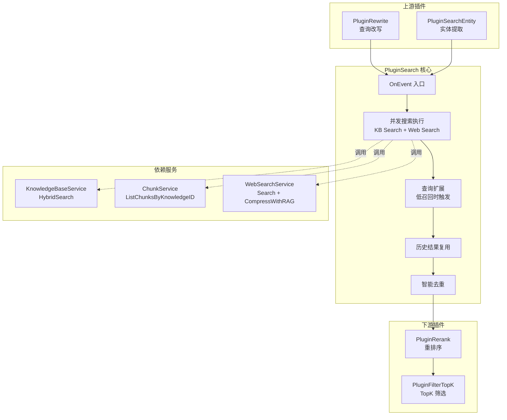

# Single Query Retrieval Execution Plugin (`PluginSearch`) 深度解析

## 一、模块存在的意义：为什么需要这个插件？

想象一个用户向 AI 助手提问的场景："我们公司的报销流程是什么？"。这个问题背后隐藏着一个关键挑战：**AI 本身并不知道公司的内部文档**，它需要从某个地方"查找"答案。这就是 `PluginSearch` 存在的根本原因。

在 RAG（Retrieval-Augmented Generation）架构中，检索环节是连接用户问题与知识库的桥梁。但检索不是简单的"拿问题去搜"——它需要处理多种复杂情况：

1. **多知识源并发**：用户可能同时选中了多个知识库，甚至开启了联网搜索，这些搜索必须并行执行以降低延迟
2. **召回率保障**：如果第一次搜索返回的结果太少，系统需要自动尝试查询扩展，而不是直接告诉用户"没找到"
3. **结果去重**：同一份内容可能以不同形式出现在多个地方，需要智能去重
4. **历史复用**：之前对话中引用过的知识，在当前上下文中可能仍然相关

`PluginSearch` 的设计洞察在于：**检索不应该是一个同步的、单点的操作，而应该是一个并发的、有fallback 机制的、带质量保障的流水线**。它不是简单地调用搜索 API，而是 orchestrator（编排者），协调多个数据源、多种检索策略，最终交付一份高质量的结果集给下游的 Rerank 和 LLM 生成环节。

如果采用 naive 方案——同步串行搜索每个知识库、不做查询扩展、不去重——会导致三个问题：(1) 响应时间线性增长，(2) 低召回场景下用户体验差，(3) 重复内容浪费 LLM 上下文窗口。`PluginSearch` 通过并发执行、查询扩展、智能去重三个核心机制解决这些问题。

---

## 二、架构与数据流

### 2.1 架构定位



### 2.2 数据流详解

`PluginSearch` 在 chat pipeline 中的位置非常关键——它位于查询理解之后、结果精炼之前。让我们追踪一次典型请求的数据流：

**输入数据**（来自 `types.ChatManage`）：
- `RewriteQuery`: 经过 `PluginRewrite` 改写后的查询（例如将"怎么报销"改写为"公司财务报销流程说明"）
- `SearchTargets`: 预计算好的搜索目标列表，每个目标包含 `KnowledgeBaseID` 和 `KnowledgeIDs`（具体文件）
- `EmbeddingTopK`: 期望返回的向量检索结果数量
- `VectorThreshold` / `KeywordThreshold`: 混合搜索的分数阈值
- `WebSearchEnabled`: 是否启用联网搜索

**输出数据**（写入 `types.ChatManage`）：
- `SearchResult`: `[]*types.SearchResult` 数组，每个结果包含 `ID`, `Content`, `Score`, `MatchType` 等字段

**关键转换点**：
1. `searchByTargets` 将 `SearchTarget` 转换为对 `KnowledgeBaseService.HybridSearch` 的并发调用
2. `searchWebIfEnabled` 将 Web 搜索结果通过 `searchutil.ConvertWebSearchResults` 转换为统一的 `SearchResult` 格式
3. `removeDuplicateResults` 基于 chunk ID 和内容签名进行去重

---

## 三、核心组件深度解析

### 3.1 `PluginSearch` 结构体

```go
type PluginSearch struct {
    knowledgeBaseService  interfaces.KnowledgeBaseService
    knowledgeService      interfaces.KnowledgeService
    chunkService          interfaces.ChunkService
    config                *config.Config
    webSearchService      interfaces.WebSearchService
    tenantService         interfaces.TenantService
    sessionService        interfaces.SessionService
    webSearchStateService interfaces.WebSearchStateService
}
```

**设计意图**：这个结构体是一个典型的**依赖注入容器**。它不持有任何状态（stateless），所有运行时数据都通过 `ChatManage` 传递。这种设计有两个好处：

1. **可测试性**：每个依赖都是接口，可以轻松 mock
2. **线程安全**：无状态意味着同一个 `PluginSearch` 实例可以安全地服务并发请求

**依赖职责划分**：
- `KnowledgeBaseService`: 核心检索引擎，执行混合搜索（向量 + 关键词）
- `ChunkService`: 直接加载小块知识的快捷路径（避免搜索开销）
- `KnowledgeService`: 获取知识元数据（标题、文件名等）
- `WebSearchService`: 联网搜索 + RAG 压缩（将网页内容转为临时知识库）
- `WebSearchStateService`: 维护会话级临时知识库状态（Redis 持久化）

### 3.2 `OnEvent` 方法：主执行流程

这是插件的入口点，遵循 pipeline 的标准签名：

```go
func (p *PluginSearch) OnEvent(ctx context.Context,
    eventType types.EventType, chatManage *types.ChatManage, next func() *PluginError,
) *PluginError
```

**参数含义**：
- `eventType`: 触发事件类型（固定为 `CHUNK_SEARCH`）
- `chatManage`: 共享状态容器，携带输入也接收输出
- `next`: 继续执行下一个插件的函数，返回错误则中断 pipeline

**执行流程**（按代码顺序）：

1. **前置检查**：确认有搜索目标或启用了 Web 搜索，否则记录错误并返回（不中断 pipeline，允许后续插件处理）

2. **并发搜索**：启动两个 goroutine 分别执行 KB 搜索和 Web 搜索，使用 `sync.WaitGroup` 等待完成，`sync.Mutex` 保护结果合并

3. **低召回处理**：如果结果数少于 `EmbeddingTopK/2` 且启用了查询扩展，调用 `expandQueries` 生成变体查询，再次并发搜索

4. **历史复用**：调用 `getSearchResultFromHistory` 从对话历史中提取之前引用过的知识

5. **去重**：调用 `removeDuplicateResults` 去除重复结果

6. **返回决策**：有结果则调用 `next()` 继续 pipeline，无结果则返回 `ErrSearchNothing`

**关键设计选择**：注意第 1 步中，即使没有搜索目标，插件也**不返回错误**，只是记录日志。这是因为 pipeline 设计为"尽力而为"——某些场景下（如纯聊天模式）本就不需要检索，下游插件需要能够处理空结果。

### 3.3 `searchByTargets`：知识库并发搜索

这个方法体现了**并行化思维**。对于每个 `SearchTarget`，它启动一个独立的 goroutine：

```go
for _, target := range chatManage.SearchTargets {
    wg.Add(1)
    go func(t *types.SearchTarget) {
        defer wg.Done()
        // ... 执行搜索
    }(target)
}
```

**为什么并发？** 假设有 5 个知识库，每个搜索耗时 200ms。串行需要 1 秒，并发只需要 200ms（忽略调度开销）。在 RAG 场景中，检索延迟直接影响用户体验，并发是必要的优化。

**直接加载优化**：对于 `SearchTargetTypeKnowledge` 类型（用户明确选择了某些文件），方法会先尝试 `tryDirectChunkLoading`：

```go
if t.Type == types.SearchTargetTypeKnowledge {
    directResults, skippedIDs := p.tryDirectChunkLoading(ctx, tenantID, t.KnowledgeIDs)
    // 如果所有文件都成功加载，跳过搜索
    if len(skippedIDs) == 0 && len(t.KnowledgeIDs) > 0 {
        return
    }
    // 否则只搜索跳过的文件
    searchKnowledgeIDs = skippedIDs
}
```

**设计权衡**：直接加载 vs 搜索。直接加载的优势是**精确**（100% 召回选中的文件）且**快速**（无需向量计算），但限制是**规模敏感**（代码限制最多 50 个 chunk，约 25k 字符）。对于小文件，直接加载是更优路径；对于大文件，回退到混合搜索。

### 3.4 `expandQueries`：本地查询扩展

当召回结果不足时，这个方法是**最后一道防线**。它不依赖 LLM（避免额外延迟和成本），而是使用纯文本处理技术生成查询变体：

```go
func (p *PluginSearch) expandQueries(ctx context.Context, chatManage *types.ChatManage) []string
```

**扩展策略**（按代码顺序）：

1. **停用词移除**：从"如何申请公司差旅报销"提取关键词"申请 公司 差旅 报销"
2. **短语提取**：从带引号的文本中提取"差旅报销"
3. **分段处理**：按逗号、句号等分隔符拆分，取最长段
4. **疑问词移除**：去掉"什么/如何/怎么"等疑问词

**并发控制**：扩展搜索使用信号量限制并发度（最多 16 个并发任务），避免资源耗尽：

```go
capSem := 16
if jobs < capSem {
    capSem = jobs
}
sem := make(chan struct{}, capSem)
```

**设计权衡**：为什么不用 LLM 做查询扩展？LLM 生成的变体质量更高，但有两个问题：(1) 增加 200-500ms 延迟，(2) 增加 token 成本。`expandQueries` 选择**轻量级启发式**，在质量和效率之间取得平衡。这是一个典型的"80/20 法则"应用——简单规则解决 80% 的场景，剩余 20% 接受较低召回率。

### 3.5 `removeDuplicateResults`：智能去重

去重逻辑比表面看起来复杂。它使用**两层去重策略**：

```go
func removeDuplicateResults(results []*types.SearchResult) []*types.SearchResult {
    seen := make(map[string]bool)           // 第一层：ID 去重
    contentSig := make(map[string]string)   // 第二层：内容签名去重
    // ...
}
```

**第一层（ID 去重）**：基于 `chunk.ID` 和 `ParentChunkID`。这处理了同一 chunk 被多次检索到的情况（例如在多个知识库中都有引用）。

**第二层（内容签名去重）**：基于 `buildContentSignature` 生成的内容指纹。这处理了**内容相同但 ID 不同**的情况（例如同一文档的不同版本）。

**设计洞察**：为什么需要两层？因为 RAG 系统中存在两种重复：
- **物理重复**：同一个 chunk 被多次检索（ID 相同）
- **语义重复**：不同 chunk 包含相同或高度相似的内容（ID 不同，内容相同）

只处理第一种会导致冗余；只处理第二种会漏掉 ID 重复的情况。两层去重确保结果集的纯净度。

### 3.6 `searchWebIfEnabled`：联网搜索与 RAG 压缩

这是 `PluginSearch` 中最复杂的子流程，涉及与外部服务的交互和状态管理：

```go
func (p *PluginSearch) searchWebIfEnabled(ctx context.Context, chatManage *types.ChatManage) []*types.SearchResult
```

**执行步骤**：

1. **配置检查**：确认租户启用了 Web 搜索且有有效的 provider
2. **执行搜索**：调用 `WebSearchService.Search` 获取原始网页结果
3. **RAG 压缩**：调用 `CompressWithRAG` 将网页内容压缩为适合 LLM 消费的格式
4. **状态持久化**：使用 `WebSearchStateService` 将临时知识库状态存入 Redis
5. **格式转换**：通过 `searchutil.ConvertWebSearchResults` 转为统一的 `SearchResult` 格式

**关键设计**：RAG 压缩 + 状态持久化。为什么需要这两步？

- **RAG 压缩**：网页内容通常很长（数千字符），直接放入 LLM 上下文会浪费 token。压缩提取关键信息，减少 token 消耗。
- **状态持久化**：临时知识库需要在会话内持久化，因为后续对话可能引用这些内容。Redis 存储确保跨请求一致性。

**依赖关系**：这个方法耦合了 `WebSearchService` 和 `WebSearchStateService`，意味着 `PluginSearch` 的行为依赖于这两个服务的实现。如果 Web 搜索服务变更接口，这里需要同步修改。

---

## 四、依赖分析

### 4.1 被谁调用（上游）

`PluginSearch` 通过 `EventManager` 注册，在 `CHUNK_SEARCH` 事件触发时执行。调用链如下：

```
HTTP Handler (session.qa) 
  → ChatPipeline 执行器 
    → EventManager.Trigger(CHUNK_SEARCH)
      → PluginSearch.OnEvent()
```

**上游期望**：
- `ChatManage` 中的 `SearchTargets` 已预计算（由 `PluginSearchEntity` 或 `PluginRewrite` 准备）
- `RewriteQuery` 已填充（由 `PluginRewrite` 生成）
- 调用 `next()` 继续 pipeline 或返回 `ErrSearchNothing` 表示无结果

**隐式契约**：`PluginSearch` 不修改输入参数（如 `RewriteQuery`），只追加输出（`SearchResult`）。这是 pipeline 模式的关键——每个插件只负责自己的职责，不污染共享状态的其他字段。

### 4.2 调用谁（下游服务）

| 服务 | 方法 | 用途 | 失败处理 |
|------|------|------|----------|
| `KnowledgeBaseService` | `HybridSearch` | 执行混合检索 | 记录日志，跳过该目标 |
| `ChunkService` | `ListChunksByKnowledgeID` | 直接加载小文件 | 记录日志，回退到搜索 |
| `KnowledgeService` | `GetKnowledgeBatchWithSharedAccess` | 获取元数据 | 继续处理（元数据可选） |
| `WebSearchService` | `Search`, `CompressWithRAG` | 联网搜索 | 返回空结果，不中断 |
| `WebSearchStateService` | `Get/SaveWebSearchTempKBState` | 状态管理 | 记录日志，继续处理 |

**容错设计**：所有外部调用都采用**失败不中断**策略。单个知识库搜索失败不影响其他知识库；Web 搜索失败不影响 KB 搜索。这是**弹性设计**的体现——系统应该在部分组件故障时仍能提供降级服务。

### 4.3 数据契约

**输入契约**（`types.ChatManage` 字段）：
```go
type ChatManage struct {
    SearchTargets      []*SearchTarget  // 必须：搜索目标列表
    KnowledgeBaseIDs   []string         // 可选：直接指定 KB ID
    KnowledgeIDs       []string         // 可选：直接指定知识 ID
    RewriteQuery       string           // 必须：改写后的查询
    EmbeddingTopK      int              // 必须：期望结果数
    VectorThreshold    float64          // 必须：向量分数阈值
    KeywordThreshold   float64          // 必须：关键词分数阈值
    WebSearchEnabled   bool             // 可选：是否启用 Web 搜索
    EnableQueryExpansion bool           // 可选：是否启用查询扩展
    // ...
}
```

**输出契约**（`types.ChatManage` 字段）：
```go
type ChatManage struct {
    SearchResult []*SearchResult  // 输出：检索结果列表
    // ...
}

type SearchResult struct {
    ID            string
    Content       string
    Score         float64
    MatchType     MatchType  // DirectLoad, Vector, Keyword, History, Web
    KnowledgeID   string
    ChunkIndex    int
    // ... 元数据字段
}
```

**关键约束**：
- `SearchResult` 中的 `Score` 已经过归一化（来自 `HybridSearch`），下游可以直接比较
- `MatchType` 标识结果来源，下游可以据此做差异化处理（例如 Web 结果需要特殊标注）

---

## 五、设计决策与权衡

### 5.1 并发 vs 串行

**选择**：并发执行多个搜索任务。

**权衡**：
- **收益**：延迟从 O(n) 降为 O(1)（n 为搜索目标数）
- **成本**：资源消耗增加（更多 goroutine，更多并发数据库连接）
- **风险**：并发 bug（竞态条件）——通过 `sync.Mutex` 保护共享状态缓解

**为什么合理**：在 RAG 场景中，延迟是用户体验的第一指标。用户等待 500ms 和等待 2s 的感受差异巨大。并发带来的资源成本是可接受的（服务器资源相对便宜，用户时间相对宝贵）。

### 5.2 查询扩展：本地启发式 vs LLM 生成

**选择**：本地文本处理（停用词移除、短语提取等）。

**权衡**：
- **收益**：零延迟、零成本、可预测
- **成本**：扩展质量有限，无法理解语义
- **风险**：某些复杂查询无法有效扩展

**为什么合理**：查询扩展是**fallback 机制**，不是主路径。主路径（第一次搜索）应该覆盖 80% 的场景。扩展只需要在剩余 20% 中提供"有帮助"的结果，不需要完美。本地启发式在这个定位下是合适的。

### 5.3 去重：ID + 内容签名双层

**选择**：同时基于 ID 和内容签名去重。

**权衡**：
- **收益**：更干净的结果集，减少 LLM 上下文浪费
- **成本**：额外的计算（内容签名生成）和内存（两个 map）
- **风险**：内容签名可能误判（相似但不相同的内容被去重）

**为什么合理**：LLM 上下文窗口是稀缺资源。重复内容不仅浪费 token，还可能影响生成质量（模型看到相同内容多次会产生困惑）。内容签名的计算成本（字符串哈希）相对 token 成本可以忽略。

### 5.4 直接加载 vs 搜索

**选择**：小文件直接加载，大文件回退搜索。

**权衡**：
- **收益**：小文件 100% 召回且快速
- **成本**：额外的代码复杂度（两条路径）
- **风险**：阈值设置不当（50 chunks）可能导致部分文件被错误跳过

**为什么合理**：用户明确选择文件时，期望是"这个文件的内容必须被考虑"。直接加载保证这一点。阈值 50 是经验值——测试表明超过这个数量的文件直接加载会导致内存和延迟问题。

---

## 六、使用与配置

### 6.1 插件注册

`PluginSearch` 在 pipeline 初始化时注册：

```go
eventManager.Register(NewPluginSearch(
    eventManager,
    knowledgeBaseService,
    knowledgeService,
    chunkService,
    config,
    webSearchService,
    tenantService,
    sessionService,
    webSearchStateService,
))
```

**注册时机**：应用启动时，作为 singleton 存在。

### 6.2 触发条件

插件在以下事件触发时执行：

```go
func (p *PluginSearch) ActivationEvents() []types.EventType {
    return []types.EventType{types.CHUNK_SEARCH}
}
```

**事件来源**：由 `PluginRewrite` 或 `PluginSearchEntity` 在查询准备完成后触发。

### 6.3 配置参数

通过 `ChatManage` 传递的配置项：

| 参数 | 类型 | 默认值 | 说明 |
|------|------|--------|------|
| `EmbeddingTopK` | int | 10 | 期望返回的结果数量 |
| `VectorThreshold` | float64 | 0.7 | 向量相似度阈值 |
| `KeywordThreshold` | float64 | 0.5 | 关键词匹配阈值 |
| `EnableQueryExpansion` | bool | false | 是否启用查询扩展 |
| `WebSearchEnabled` | bool | false | 是否启用 Web 搜索 |

**配置来源**：这些参数通常来自租户配置（`types.Tenant.ConversationConfig`）或会话级覆盖。

---

## 七、边界情况与陷阱

### 7.1 空搜索目标

**场景**：`SearchTargets` 为空且 `WebSearchEnabled` 为 false。

**行为**：记录错误日志但不中断 pipeline，`SearchResult` 为空。

**陷阱**：下游插件（如 `PluginRerank`）需要能够处理空结果。如果下游假设结果非空，会 panic。

**建议**：在开发下游插件时，始终检查 `len(chatManage.SearchResult) == 0`。

### 7.2 并发竞态条件

**场景**：多个 goroutine 同时写入 `allResults`。

**防护**：使用 `sync.Mutex` 保护：

```go
mu.Lock()
allResults = append(allResults, kbResults...)
mu.Unlock()
```

**陷阱**：如果忘记加锁，会导致 data race，在并发请求下出现随机数据丢失或 corruption。

**建议**：使用 `go run -race` 检测竞态条件。

### 7.3 查询扩展的并发控制

**场景**：大量扩展查询 × 大量搜索目标 = 大量并发任务。

**防护**：信号量限制：

```go
sem := make(chan struct{}, capSem)  // capSem = min(16, jobs)
```

**陷阱**：如果不限制并发，可能导致数据库连接池耗尽，影响其他请求。

**建议**：根据数据库连接池大小调整 `capSem`。

### 7.4 Web 搜索状态持久化失败

**场景**：Redis 不可用，`SaveWebSearchTempKBState` 失败。

**行为**：记录日志但继续处理，当前请求不受影响。

**陷阱**：后续请求无法复用临时知识库，导致重复搜索。

**建议**：监控 Redis 错误率，设置告警。

### 7.5 内容签名碰撞

**场景**：两个不同内容生成相同签名（哈希碰撞）。

**概率**：极低（使用强哈希算法）。

**影响**：一个结果被错误去重。

**建议**：如果观察到异常去重率，检查 `buildContentSignature` 实现。

---

## 八、扩展点

### 8.1 添加新的搜索源

如果要添加新的搜索源（如数据库全文搜索），需要：

1. 在 `OnEvent` 中添加新的并发 goroutine
2. 将结果转换为 `*types.SearchResult` 格式
3. 设置合适的 `MatchType`

```go
go func() {
    defer wg.Done()
    dbResults := p.searchDatabase(ctx, chatManage)
    if len(dbResults) > 0 {
        mu.Lock()
        allResults = append(allResults, dbResults...)
        mu.Unlock()
    }
}()
```

### 8.2 自定义查询扩展策略

如果要使用 LLM 做查询扩展，可以：

1. 添加新的扩展方法 `expandQueriesWithLLM`
2. 在 `EnableQueryExpansion` 为 true 时调用
3. 注意控制延迟（设置超时）

### 8.3 自定义去重逻辑

如果要修改去重规则，可以：

1. 修改 `removeDuplicateResults` 函数
2. 或添加新的去重阶段（如基于语义相似度的去重）

---

## 九、相关模块

- [PluginRewrite](chat_pipeline_plugins_and_flow.md)：查询改写，为 `PluginSearch` 准备 `RewriteQuery`
- [PluginSearchEntity](chat_pipeline_plugins_and_flow.md)：实体提取，为 `PluginSearch` 准备 `SearchTargets`
- [PluginRerank](chat_pipeline_plugins_and_flow.md)：重排序，消费 `PluginSearch` 的输出
- [PluginFilterTopK](chat_pipeline_plugins_and_flow.md)：TopK 筛选，在 Rerank 之后进一步精简结果
- [KnowledgeBaseService](knowledge_ingestion_extraction_and_graph_services.md)：核心检索引擎，被 `PluginSearch` 调用
- [WebSearchService](retrieval_and_web_search_services.md)：联网搜索服务，被 `PluginSearch` 调用

---

## 十、总结

`PluginSearch` 是 RAG pipeline 中的**检索编排者**。它的核心价值不在于实现搜索算法（这是 `KnowledgeBaseService` 的职责），而在于：

1. **并发协调**：同时从多个数据源获取结果，最小化延迟
2. **质量保障**：通过查询扩展和去重提升结果质量
3. **弹性设计**：单点失败不影响整体，提供降级服务
4. **状态管理**：维护 Web 搜索的临时知识库状态

理解这个模块的关键是认识到：**检索不是单次调用，而是一个有 fallback、有优化、有质量控制的流程**。`PluginSearch` 的设计反映了这一理念——它不是最简单的实现，而是在延迟、质量、成本之间取得平衡的工程化方案。
