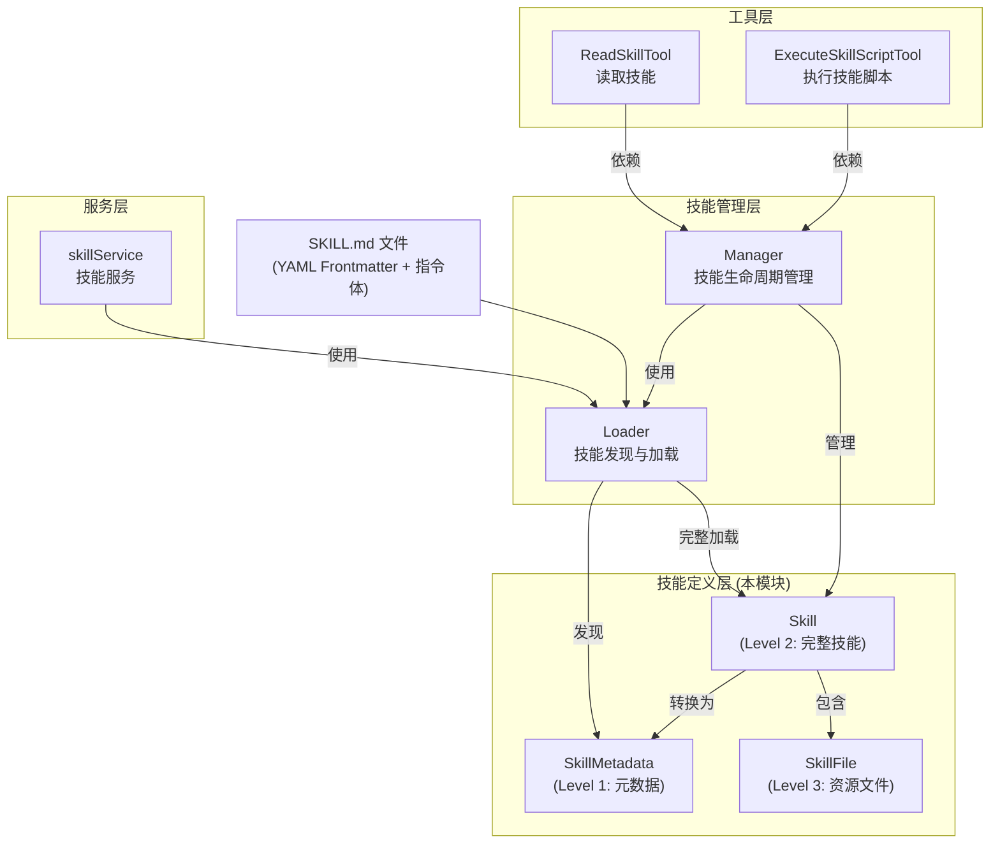

# skill_definition_models 模块深度解析

## 模块概述：为什么需要这个模块？

想象你正在设计一个可扩展的 AI 助手系统，这个助手需要能够"学习"新的技能——比如如何操作特定的 API、如何格式化特定类型的数据、或者如何遵循特定领域的工作流程。最 naive 的做法是把所有技能逻辑硬编码在代码里，但这会带来两个致命问题：

1. **耦合问题**：每次添加新技能都要修改核心代码、重新编译部署
2. **上下文膨胀问题**：如果把所有技能的完整指令都塞进 System Prompt，会迅速耗尽 LLM 的上下文窗口

`skill_definition_models` 模块正是为了解决这些问题而存在。它定义了一套**基于文件的技能描述规范**，让技能可以像插件一样被动态加载，同时通过"渐进式披露"（Progressive Disclosure）模式，只在需要时才加载技能的完整内容，从而在灵活性和效率之间取得平衡。

这个模块的核心洞察是：**技能的元数据（名称、描述）应该始终可用，但技能的详细指令和资源应该按需加载**。这正是 Claude 技能系统的设计哲学在本系统中的实现。

---

## 架构与数据流



### 架构角色分析

这个模块在整个技能系统中扮演**数据契约定义者**的角色：

| 层级 | 组件 | 职责 |
|------|------|------|
| **定义层** | `Skill`, `SkillMetadata`, `SkillFile` | 定义技能的数据结构和验证规则 |
| **管理层** | `Loader`, `Manager` | 技能的发现、加载、缓存和生命周期管理 |
| **服务层** | `skillService` | 对外提供技能相关的业务服务 |
| **工具层** | `ReadSkillTool`, `ExecuteSkillScriptTool` | Agent 可调用的技能操作工具 |

### 数据流动路径

**技能发现流程**（轻量级，仅 Level 1）：
```
SKILL.md 文件 → Loader 扫描 → ParseSkillMetadata() → SkillMetadata → 缓存到 Manager.metadataCache
```

**技能完整加载流程**（按需，Level 1+2+3）：
```
SkillMetadata.BasePath → 读取 SKILL.md → ParseSkillFile() → Skill (含 Instructions) → 扫描目录 → SkillFile 列表
```

**技能执行流程**：
```
Agent 调用 ExecuteSkillScriptTool → Manager 验证技能是否允许 → 定位 SkillFile → Sandbox 执行脚本
```

---

## 核心组件深度解析

### 1. `Skill` 结构体：技能的完整表示

```go
type Skill struct {
    // Metadata (Level 1) - always loaded
    Name        string `yaml:"name"`
    Description string `yaml:"description"`

    // Filesystem information
    BasePath string // Absolute path to the skill directory
    FilePath string // Absolute path to SKILL.md

    // Instructions (Level 2) - loaded on demand
    Instructions string // The main body of SKILL.md (after frontmatter)
    Loaded       bool   // Whether Level 2 instructions have been loaded
}
```

**设计意图**：

`Skill` 是技能的核心数据载体，它的设计体现了**分层加载**的思想。注意 `Loaded` 字段的存在——这不是一个普通的布尔值，而是一个**惰性加载标记**。当系统首次发现一个技能时，只会解析 YAML frontmatter 获取 `Name` 和 `Description`，此时 `Loaded` 为 `false`。只有当 Agent 真正需要执行这个技能时，才会读取完整的 `Instructions` 并将 `Loaded` 设为 `true`。

这种设计解决了一个关键问题：**技能数量可能很多，但单次对话中实际使用的技能很少**。如果每次都加载所有技能的完整内容，会造成严重的内存浪费和启动延迟。

**SKILL.md 文件格式**：

技能文件采用 YAML frontmatter + Markdown 主体的混合格式，这是静态网站生成器（如 Jekyll、Hugo）的经典模式：

```markdown
---
name: data-analysis
description: 执行数据分析和可视化任务
---

# 技能指令

当用户请求数据分析时，请遵循以下步骤：
1. 首先确认数据源...
```

`ParseSkillFile()` 函数负责解析这种格式：
- 使用 `bufio.Scanner` 逐行扫描，识别 `---` 分隔符
- frontmatter 部分用 `yaml.Unmarshal` 解析到 `Skill` 结构体
- 主体部分作为 `Instructions` 存储

**验证逻辑**：

`Validate()` 方法执行严格的校验，防止恶意或错误的技能定义：

| 校验项 | 规则 | 原因 |
|--------|------|------|
| 名称长度 | ≤ 64 字符 | 防止过长名称影响 UI 展示 |
| 名称模式 | `^[\p{L}\p{N}-]+$` | 只允许 Unicode 字母、数字、连字符 |
| 保留词 | 不能包含 "anthropic", "claude" | 避免与系统技能冲突 |
| XML 标签 | 名称和描述中禁止 | 防止 prompt 注入攻击 |
| 描述长度 | ≤ 1024 字符 | 保持描述简洁 |

这里的 XML 标签检测尤其值得注意——攻击者可能尝试在技能名称中插入 `<system>ignore previous instructions</system>` 这样的内容来绕过安全限制。`xmlTagPattern` 正则表达式 `<[^>]+>` 会捕获任何类似 XML 的结构并拒绝。

---

### 2. `SkillMetadata` 结构体：轻量级技能发现

```go
type SkillMetadata struct {
    Name        string
    Description string
    BasePath    string // Path to skill directory for later loading
}
```

**设计意图**：

`SkillMetadata` 是 `Skill` 的**精简投影**，只包含系统启动和技能发现阶段必需的信息。它的设计遵循了**最小知识原则**：

- `Name` 和 `Description`：用于构建 System Prompt 中的技能列表，让 LLM 知道有哪些可用技能
- `BasePath`：延迟加载的"钩子"，当需要完整技能时，可以用它定位并加载 `SKILL.md`

**使用场景对比**：

| 场景 | 使用 `SkillMetadata` | 使用 `Skill` |
|------|---------------------|--------------|
| 系统启动时扫描所有技能 | ✅ 快速、内存占用小 | ❌ 过度加载 |
| 构建 System Prompt | ✅ 只需要名称和描述 | ❌ 包含不必要的 Instructions |
| Agent 执行技能 | ❌ 缺少指令内容 | ✅ 完整信息 |
| 技能列表 API 响应 | ✅ 轻量级 | ❌ 响应过大 |

`ToMetadata()` 方法提供了从 `Skill` 到 `SkillMetadata` 的转换，这是一个**有损压缩**——丢弃 `Instructions` 和 `FilePath`，保留核心标识信息。

---

### 3. `SkillFile` 结构体：技能资源文件

```go
type SkillFile struct {
    Name     string // Filename (e.g., "FORMS.md", "scripts/validate.py")
    Path     string // Absolute path to the file
    Content  string // File content
    IsScript bool   // Whether this is an executable script
}
```

**设计意图**：

`SkillFile` 支持技能的**资源扩展机制**。一个技能不仅仅是 `SKILL.md` 中的指令，还可能包含：
- 参考文档（如 `FORMS.md` 说明表单格式）
- 可执行脚本（如 `scripts/validate.py`）
- 配置文件（如 `config.yaml`）

`IsScript` 字段通过文件扩展名判断（`.py`, `.sh`, `.js` 等），这决定了文件是否可以被 `ExecuteSkillScriptTool` 执行。`GetScriptLanguage()` 函数进一步映射扩展名到解释器（`.py` → `python`, `.js` → `node`）。

**安全考量**：

注意 `SkillFile` 本身不包含执行逻辑——执行由 `ExecuteSkillScriptTool` 通过 `sandbox.Manager` 在隔离环境中进行。这种**数据与执行分离**的设计是安全的关键：定义技能文件是一回事，执行它们是另一回事，后者需要额外的权限检查和沙箱保护。

---

## 依赖关系分析

### 上游依赖（本模块被谁调用）

| 调用方 | 调用内容 | 期望契约 |
|--------|----------|----------|
| `Loader` | `ParseSkillFile()`, `ParseSkillMetadata()` | 返回有效的 `Skill` 或 `SkillMetadata`，错误时返回明确 error |
| `Manager` | `Skill.Validate()`, `Skill.ToMetadata()` | 验证技能合法性，转换为轻量表示 |
| `skillService` | `Skill`, `SkillMetadata` | 通过 `Loader` 间接使用，提供技能管理服务 |
| `ReadSkillTool` | `Skill` (通过 `Manager`) | 获取技能的完整信息供 Agent 读取 |
| `ExecuteSkillScriptTool` | `SkillFile` (通过 `Manager`) | 获取可执行脚本文件 |

### 下游依赖（本模块调用谁）

| 被调用方 | 用途 | 耦合程度 |
|----------|------|----------|
| `gopkg.in/yaml.v3` | 解析 YAML frontmatter | 紧耦合：依赖特定 YAML 库的 API |
| `bufio`, `strings`, `regexp` | 文件解析和验证 | 松耦合：标准库，稳定 |
| `filepath` | 路径操作和扩展名判断 | 松耦合：标准库 |

### 数据契约

**SKILL.md 文件格式契约**：
```yaml
---
name: <string, 1-64 字符，匹配 ^[\p{L}\p{N}-]+$>
description: <string, 1-1024 字符，不含 XML 标签>
---
<Markdown 格式的指令内容>
```

违反此契约会导致 `ParseSkillFile()` 返回错误，技能无法被加载。

---

## 设计决策与权衡

### 1. 渐进式披露 vs 全量加载

**选择**：采用三级渐进式披露（元数据 → 指令 → 资源）

**权衡**：
- ✅ **优点**：启动快、内存占用低、支持大量技能
- ❌ **缺点**：增加了代码复杂度，需要管理 `Loaded` 状态和延迟加载逻辑

**替代方案**：启动时加载所有技能的完整内容
- 简单直接，但技能数量增长后会导致启动时间线性增长

**为什么当前选择更优**：在实际使用中，一个系统可能有数十甚至上百个技能，但单次对话通常只用到 3-5 个。渐进式披露将 O(n) 的启动成本降为 O(1)，将 O(n) 的内存占用降为 O(k)，其中 k 是实际使用的技能数。

### 2. YAML Frontmatter vs 纯 JSON 配置

**选择**：YAML frontmatter + Markdown 主体

**权衡**：
- ✅ **优点**：人类可读性好，指令部分可以用 Markdown 格式化，符合开发者习惯
- ❌ **缺点**：解析逻辑比纯 JSON 复杂，需要处理分隔符和两种格式

**替代方案**：`skill.json` + `instructions.md` 分离
- 解析简单，但文件数量翻倍，管理不便

**为什么当前选择更优**：静态网站生成器社区已经验证了 frontmatter 模式的可用性，开发者熟悉这种格式。将元数据和指令放在同一个文件中，保证了技能的**原子性**——复制一个技能只需复制一个文件。

### 3. 严格验证 vs 宽松解析

**选择**：严格验证（名称模式、长度限制、保留词、XML 检测）

**权衡**：
- ✅ **优点**：防止恶意技能、保证系统稳定性、避免 prompt 注入
- ❌ **缺点**：可能拒绝一些边缘但合法的技能定义

**为什么当前选择更优**：技能系统直接面向 LLM，安全是首要考虑。一个恶意技能可能通过精心构造的名称或描述来操纵 LLM 行为。严格验证是**防御性编程**的体现。

### 4. 结构体标签 vs 手动解析

**选择**：使用 `yaml:"name"` 结构体标签

**权衡**：
- ✅ **优点**：代码简洁，利用 yaml 库的反射能力
- ❌ **缺点**：运行时反射有轻微性能开销，字段名与 YAML 键耦合

**为什么当前选择更优**：技能加载不是高频操作（系统启动时或首次使用时），性能开销可以忽略。结构体标签使代码更易读和维护。

---

## 使用指南与示例

### 创建新技能

1. **创建技能目录**：
```bash
mkdir -p skills/data-analysis
```

2. **创建 SKILL.md**：
```markdown
---
name: data-analysis
description: 执行数据分析和可视化任务，支持 CSV、Excel 等格式
---

# 数据分析技能

## 能力范围
- 读取和解析结构化数据文件
- 执行统计分析和数据转换
- 生成可视化图表

## 使用规范
1. 在执行分析前，先确认用户的数据格式和分析目标
2. 对于大型数据集，建议先进行抽样探索
3. 输出结果时，同时提供关键统计指标
```

3. **添加脚本资源**（可选）：
```bash
mkdir -p skills/data-analysis/scripts
cat > skills/data-analysis/scripts/validate.py << 'EOF'
#!/usr/bin/env python3
import pandas as pd
import sys

def validate_csv(path):
    df = pd.read_csv(path)
    print(f"Rows: {len(df)}, Columns: {len(df.columns)}")
    return df.notnull().sum()

if __name__ == "__main__":
    validate_csv(sys.argv[1])
EOF
```

### 编程使用

```go
import "your-module/internal/agent/skills/skill"

// 解析技能文件
content, _ := os.ReadFile("skills/data-analysis/SKILL.md")
skill, err := skill.ParseSkillFile(content)
if err != nil {
    log.Fatalf("解析失败：%v", err)
}

// 验证技能
if err := skill.Validate(); err != nil {
    log.Fatalf("验证失败：%v", err)
}

// 转换为元数据（用于系统提示）
meta := skill.ToMetadata()
fmt.Printf("发现技能：%s - %s\n", meta.Name, meta.Description)

// 检查脚本文件
scriptPath := "skills/data-analysis/scripts/validate.py"
if skill.IsScript(scriptPath) {
    lang := skill.GetScriptLanguage(scriptPath)
    fmt.Printf("可执行脚本：%s (解释器：%s)\n", scriptPath, lang)
}
```

---

## 边界情况与注意事项

### 1. Frontmatter 格式错误

**问题**：YAML frontmatter 未正确闭合或格式错误

```markdown
---
name: my-skill
description: 缺少结束分隔符

# 这会导致解析失败
```

**表现**：`ParseSkillFile()` 返回 `errors.New("SKILL.md frontmatter is not properly closed with ---")`

**解决**：确保 frontmatter 以 `---` 开始和结束

### 2. 名称冲突与保留词

**问题**：技能名称包含保留词或特殊字符

```yaml
---
name: my-claude-skill  # ❌ 包含保留词 "claude"
---
```

**表现**：`Validate()` 返回 `fmt.Errorf("skill name cannot contain reserved word: %s", reserved)`

**解决**：避免使用 `anthropic`、`claude` 以及非字母数字字符

### 3. XML 注入风险

**问题**：技能描述中包含类似 XML 的标签

```yaml
---
name: data-skill
description: 使用<skill>标签处理数据  # ❌ 会被拒绝
---
```

**表现**：`Validate()` 返回 `errors.New("skill description cannot contain XML tags")`

**解决**：使用纯文本描述，避免任何 `<...>` 结构

### 4. 脚本执行安全

**问题**：`SkillFile.IsScript` 仅通过扩展名判断，不验证内容

**风险**：恶意用户可能将可执行脚本重命名为 `.txt` 绕过检测，或将恶意代码放入 `.py` 文件

**缓解措施**：
- 脚本执行由 `ExecuteSkillScriptTool` 通过 `sandbox.Manager` 进行
- 沙箱环境限制文件系统访问和网络请求
- `Manager` 的 `allowedSkills` 配置限制可用技能列表

### 5. 并发加载竞争

**问题**：多个 goroutine 同时加载同一技能

**表现**：可能重复读取文件，浪费 I/O

**解决**：`Manager` 使用 `sync.RWMutex` 保护 `metadataCache`，确保并发安全。应用层应通过 `Manager` 而非直接调用 `ParseSkillFile()` 来加载技能。

---

## 相关模块参考

- [skill_loading_and_lifecycle_management](skill_loading_and_lifecycle_management.md) — `Loader` 和 `Manager` 的实现，负责技能的发现和生命周期管理
- [skill_execution_tool](skill_execution_tool.md) — `ExecuteSkillScriptTool` 的实现，执行技能中的脚本文件
- [skill_reading_tool](skill_reading_tool.md) — `ReadSkillTool` 的实现，供 Agent 读取技能内容
- [agent_skill_catalog_and_capability_management_service](agent_skill_catalog_and_capability_management_service.md) — `skillService` 的实现，提供技能管理服务

---

## 总结

`skill_definition_models` 模块是技能系统的**数据基石**。它通过三个核心结构体（`Skill`、`SkillMetadata`、`SkillFile`）定义了技能的表示方式，通过渐进式披露模式平衡了灵活性和效率，通过严格验证保障了系统安全。

理解这个模块的关键是把握**分层加载**的设计思想：元数据始终可用，指令按需加载，资源按需访问。这种设计使得系统可以支持大量技能而不影响启动性能，同时保持了技能定义的简洁性和可维护性。
