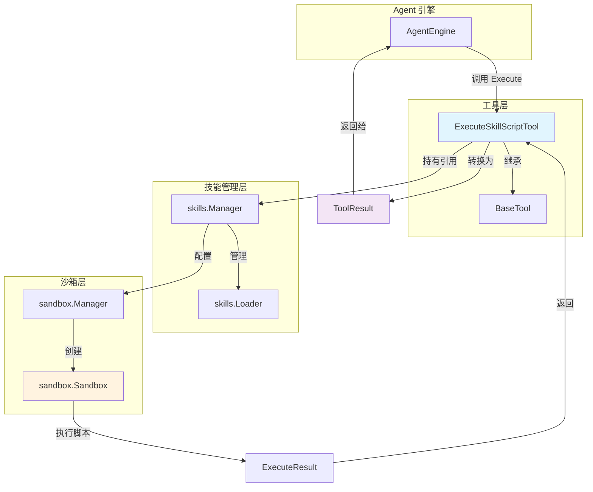
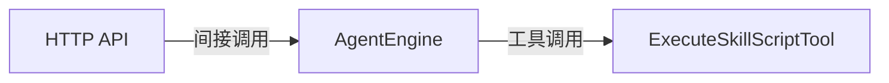
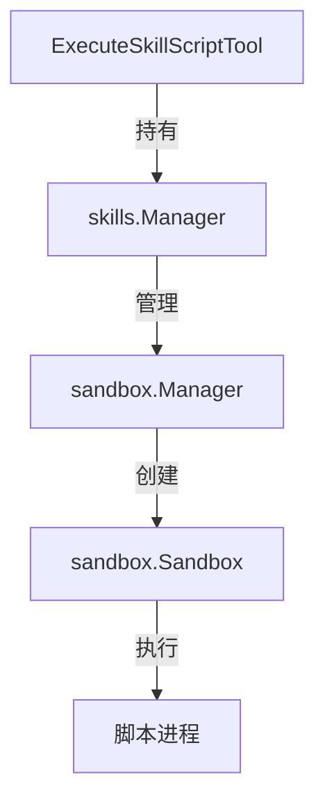

# skill_execution_tool 模块深度解析

## 概述：为什么需要这个模块

想象一下，你正在构建一个 AI 助手系统，这个助手可以加载各种"技能"（skill）来扩展自己的能力边界。每个技能可能包含一些实用脚本——比如数据清洗脚本、格式转换工具、或者特定领域的计算逻辑。当 AI 助手在处理用户请求时，它可能需要调用这些脚本来完成确定性的任务。

**核心问题**：如何让 AI 安全地执行这些脚本？

一个天真的方案是直接调用 `exec.Command()` 运行脚本。但这会带来严重的安全隐患：
- 脚本可能访问敏感文件系统路径
- 脚本可能发起不受控的网络请求
- 脚本可能无限运行消耗资源
- 脚本可能执行恶意代码

`skill_execution_tool` 模块的设计洞察在于：**将脚本执行封装为一个受控的"工具"（Tool），通过沙箱隔离 + 权限约束 + 结构化输出来实现安全执行**。它不是简单的命令执行器，而是 AI 代理与技能脚本之间的安全网关。

这个模块在架构中扮演**执行代理**的角色——它接收来自 AI 引擎的执行请求，验证参数，委托给沙箱执行，然后将原始的执行结果转换为 AI 可理解的结构化格式。

---

## 架构与数据流



### 数据流追踪：从请求到结果

当 AI 引擎决定执行一个技能脚本时，数据经历以下流转：

1. **请求入口**：`AgentEngine` 调用 `ExecuteSkillScriptTool.Execute()`，传入 JSON 编码的参数
2. **参数解析**：工具将原始 JSON 解包为 `ExecuteSkillScriptInput` 结构体
3. **权限验证**：检查技能管理器是否启用、技能名称和脚本路径是否有效
4. **沙箱执行**：通过 `skills.Manager.ExecuteScript()` 委托给沙箱层执行
5. **结果转换**：将 `ExecuteResult` 转换为 `ToolResult`，包含人类可读输出和结构化数据
6. **返回引擎**：AI 引擎根据 `ToolResult.Success` 判断是否继续后续推理

这个流程的关键在于**分层隔离**：工具层只负责协议转换和参数验证，实际执行完全委托给沙箱层。这种设计使得安全策略的变更（如调整沙箱配置）不会影响到工具层的接口。

---

## 核心组件深度解析

### ExecuteSkillScriptInput：执行请求的契约

```go
type ExecuteSkillScriptInput struct {
    SkillName  string   `json:"skill_name"`
    ScriptPath string   `json:"script_path"`
    Args       []string `json:"args,omitempty"`
    Input      string   `json:"input,omitempty"`
}
```

这个结构体定义了 AI 与工具之间的**通信协议**。每个字段都有明确的设计意图：

| 字段 | 设计目的 | 使用场景 |
|------|----------|----------|
| `SkillName` | 定位技能目录 | 从已加载的技能列表中查找对应的技能 |
| `ScriptPath` | 定位脚本文件 | 相对于技能目录的路径，如 `scripts/analyze.py` |
| `Args` | 命令行参数 | 传递文件路径、配置选项等离散参数 |
| `Input` | 标准输入数据 | 传递内存中的数据（如 JSON 字符串），避免临时文件 |

**关键设计决策**：为什么同时提供 `Args` 和 `Input`？

这是因为脚本接收数据有两种常见模式：
- **命令行参数模式**：`python script.py --file data.csv --threshold 0.8`
- **管道输入模式**：`echo '{"data": ...}' | python script.py`

如果只支持 `Args`，AI 需要先将内存中的数据写入临时文件，这增加了复杂性和安全风险。`Input` 字段允许直接通过 stdin 传递数据，更符合 Unix 哲学中的管道思想。

**约束条件**：
- `SkillName` 和 `ScriptPath` 是必填字段，空值会在执行前被拦截
- `Args` 中的 `--file` 标志必须指向技能目录内的真实文件（由沙箱层验证）
- `Input` 的长度没有硬性限制，但过大的输入可能导致沙箱超时

### ExecuteSkillScriptTool：执行工具的实现

```go
type ExecuteSkillScriptTool struct {
    BaseTool
    skillManager *skills.Manager
}
```

这个结构体是模块的核心，它通过**组合**而非继承来扩展 `BaseTool` 的基础能力。

#### 生命周期管理

```go
func NewExecuteSkillScriptTool(skillManager *skills.Manager) *ExecuteSkillScriptTool
```

构造函数注入 `skillManager` 依赖，这是典型的**依赖注入模式**。这样做的好处：
1. **可测试性**：测试时可以传入 mock 的 manager
2. **解耦**：工具不关心 manager 如何创建，只关心如何使用
3. **生命周期一致**：工具和 manager 共享相同的生命周期

#### 执行流程：Execute 方法

`Execute` 方法是工具的核心逻辑，遵循**防御性编程**原则：

```go
func (t *ExecuteSkillScriptTool) Execute(ctx context.Context, args json.RawMessage) (*types.ToolResult, error)
```

**步骤分解**：

1. **参数解析与验证**
   ```go
   var input ExecuteSkillScriptInput
   json.Unmarshal(args, &input)
   // 检查必填字段
   ```
   这里使用 `json.RawMessage` 而非直接解码，是为了保留原始 JSON 用于日志记录或调试。解析失败时返回 `ToolResult{Success: false}` 而非抛出 error，这是因为**工具执行失败不等于系统错误**——AI 引擎需要知道失败原因以便调整策略。

2. **能力检查**
   ```go
   if t.skillManager == nil || !t.skillManager.IsEnabled()
   ```
   这是一个**快速失败**的检查。如果技能系统未启用，直接返回错误，避免后续无意义的操作。

3. **委托执行**
   ```go
   result, err := t.skillManager.ExecuteScript(ctx, input.SkillName, input.ScriptPath, input.Args, input.Input)
   ```
   工具层不直接操作沙箱，而是通过 `skillManager` 间接调用。这层间接性提供了：
   - **技能目录解析**：将技能名映射到实际文件系统路径
   - **权限过滤**：检查脚本是否在允许列表中
   - **缓存管理**：可能缓存已验证的脚本元数据

4. **结果格式化**
   ```go
   var builder strings.Builder
   builder.WriteString(fmt.Sprintf("=== Script Execution: %s/%s ===\n\n", ...))
   ```
   输出格式经过精心设计，分为三个部分：
   - **元数据区**：脚本路径、参数、退出码、执行时长
   - **标准输出区**：脚本的正常输出，用代码块包裹
   - **错误区**：stderr 和错误信息，便于调试

   这种结构化输出有两个受众：
   - **AI 引擎**：通过 `Data` 字段中的结构化数据做程序化判断
   - **最终用户**：通过 `Output` 字段的人类可读文本理解执行结果

5. **成功判定**
   ```go
   success := result.IsSuccess()
   ```
   成功与否由退出码决定（0 为成功），而非是否有 stderr 输出。这是因为很多脚本会在 stderr 输出警告信息但仍能正常完成工作。

#### 资源清理：Cleanup 方法

```go
func (t *ExecuteSkillScriptTool) Cleanup(ctx context.Context) error {
    return nil
}
```

当前实现是空操作，因为工具本身不持有需要清理的资源（沙箱资源由 `skillManager` 管理）。但这遵循了 `ToolExecutor` 接口的契约，为未来扩展预留了空间。

---

## 依赖关系分析

### 上游依赖：谁调用这个模块



- **直接调用者**：`AgentEngine`（[agent_core_orchestration](agent_runtime_and_tools.md) 模块）
- **间接触发者**：HTTP API 层通过会话 QA 接口触发 Agent 引擎

**调用契约**：
- 调用方必须提供有效的 `context.Context` 用于超时控制和日志追踪
- 调用方需要处理 `ToolResult.Error` 字段，决定是重试还是向用户报告错误
- 调用方不应假设执行是瞬时的——脚本可能运行数秒甚至超时

### 下游依赖：这个模块调用谁



- **直接依赖**：`skills.Manager`（[agent_skills_lifecycle](agent_runtime_and_tools.md) 模块）
- **间接依赖**：`sandbox.Sandbox` 接口（[sandbox_execution](platform_infrastructure_and_runtime.md) 模块）

**数据契约**：

| 方向 | 数据类型 | 关键字段 |
|------|----------|----------|
| 工具 → Manager | 参数元组 | `(skillName, scriptPath, args, input)` |
| Manager → 工具 | `ExecuteResult` | `Stdout`, `Stderr`, `ExitCode`, `Duration`, `Killed` |
| 工具 → Agent | `ToolResult` | `Success`, `Output`, `Data`, `Error` |

**关键假设**：
1. `skillManager` 已经初始化并加载了技能元数据
2. 沙箱环境已配置好（Docker 或本地进程隔离）
3. 技能目录对执行用户有读取权限

如果这些假设不成立，错误会在 `skillManager.ExecuteScript()` 层被捕获并返回，工具层负责将其转换为友好的错误消息。

---

## 设计决策与权衡

### 1. 同步执行 vs 异步执行

**选择**：同步执行（`Execute` 方法阻塞直到脚本完成）

**原因**：
- AI 引擎的推理循环是同步的——它需要工具结果才能继续下一步推理
- 脚本执行通常较短（秒级），异步的收益有限
- 同步模型简化了错误处理和超时控制

**代价**：
- 长时间运行的脚本会阻塞 AI 推理线程
- 无法在脚本执行期间处理其他请求

**缓解措施**：
- 沙箱层有超时配置（通常 30-60 秒）
- `ExecuteResult.Killed` 字段标识是否因超时被终止

### 2. 结构化输出 vs 纯文本输出

**选择**：同时提供 `Output`（人类可读）和 `Data`（机器可读）

**原因**：
- AI 引擎需要结构化数据来做程序化判断（如根据退出码决定是否重试）
- 最终用户（通过前端界面）需要可读的输出来理解执行结果
- 日志系统可以同时记录两种格式用于不同场景

**代价**：
- 输出数据有冗余，增加内存占用
- 需要维护两种格式的一致性

### 3. 沙箱隔离 vs 直接执行

**选择**：强制沙箱隔离

**原因**：
- 技能脚本可能来自第三方，不可完全信任
- 沙箱可以限制文件系统访问、网络访问、CPU/内存使用
- 符合最小权限原则

**代价**：
- 增加了执行开销（沙箱启动、资源隔离）
- 调试更复杂（需要进入沙箱环境）

### 4. 错误处理策略：返回 ToolResult vs 抛出 error

**选择**：返回 `ToolResult{Success: false, Error: ...}` 而非抛出 Go error

**原因**：
- 工具执行失败是**预期内的业务场景**，不是系统异常
- AI 引擎需要根据失败原因调整策略（如换用其他工具、向用户询问更多信息）
- 统一的返回类型简化了调用方的错误处理逻辑

**代价**：
- 调用方必须显式检查 `Success` 字段，容易遗漏
- 无法利用 Go 的 error 堆栈追踪

---

## 使用指南与示例

### 基本使用模式

```go
// 1. 创建工具实例（通常在 Agent 初始化时）
skillManager := skills.NewManager(config)
tool := tools.NewExecuteSkillScriptTool(skillManager)

// 2. 准备执行参数
input := tools.ExecuteSkillScriptInput{
    SkillName:  "data-analysis",
    ScriptPath: "scripts/clean_data.py",
    Args:       []string{"--threshold", "0.8"},
    Input:      `{"rows": [...], "columns": [...]}`,
}

// 3. 编码为 JSON
argsJSON, _ := json.Marshal(input)

// 4. 执行工具
ctx := context.Background()
result, err := tool.Execute(ctx, argsJSON)

// 5. 处理结果
if result.Success {
    fmt.Println("执行成功:", result.Output)
    // 访问结构化数据
    exitCode := result.Data["exit_code"].(int)
} else {
    fmt.Println("执行失败:", result.Error)
}
```

### 配置选项

工具本身没有独立配置，行为由 `skills.Manager` 的配置决定：

| 配置项 | 影响 | 默认值 |
|--------|------|--------|
| `skillDirs` | 技能搜索目录 | 空（需显式设置） |
| `allowedSkills` | 允许执行的技能列表 | 空（允许所有） |
| `enabled` | 是否启用技能系统 | `false` |
| 沙箱超时 | 脚本最大执行时间 | 由沙箱配置决定 |

### 常见模式

**模式 1：执行无参数脚本**
```json
{
    "skill_name": "utilities",
    "script_path": "scripts/generate_report.py"
}
```

**模式 2：传递文件参数**
```json
{
    "skill_name": "data-analysis",
    "script_path": "scripts/process.py",
    "args": ["--input", "data/input.csv", "--output", "data/output.json"]
}
```
注意：文件路径必须相对于技能目录，且文件必须存在。

**模式 3：管道输入数据**
```json
{
    "skill_name": "text-processing",
    "script_path": "scripts/analyze.py",
    "input": "{\"text\": \"Hello, world!\", \"language\": \"en\"}"
}
```
适用于处理内存中的数据，避免临时文件。

---

## 边界情况与陷阱

### 1. 脚本超时

**现象**：`ExecuteResult.Killed == true`，`ExitCode` 可能为非零

**处理**：
```go
if result.Killed {
    // 脚本被终止，可能是超时
    logger.Warn("Script was killed, consider optimizing or increasing timeout")
}
```

**根本原因**：沙箱配置的执行超时时间短于脚本实际运行时间。

**解决方案**：
- 优化脚本性能
- 调整沙箱超时配置（如果业务允许）
- 将长任务拆分为多个短任务

### 2. 技能未加载

**现象**：返回 `Error: "Skills are not enabled"`

**原因**：`skillManager.IsEnabled()` 返回 `false`，通常是因为：
- 技能系统未初始化
- 配置中 `enabled: false`
- 技能目录不存在或为空

**调试**：检查应用启动日志中技能加载的相关消息。

### 3. 脚本路径遍历攻击

**现象**：尝试执行 `../../etc/passwd` 等路径

**防护**：沙箱层会验证脚本路径是否在技能目录内，工具层不直接处理这个检查。

**最佳实践**：AI 提示词中应明确说明脚本路径必须是技能目录内的相对路径。

### 4. 大输入数据

**现象**：`Input` 字段过大导致内存压力或超时

**限制**：虽然没有硬性限制，但建议：
- 单次输入不超过 10MB
- 超大数据考虑分批次处理
- 优先使用文件参数而非 stdin 传递大数据

### 5. 并发执行

**现象**：多个工具实例同时执行脚本

**安全性**：`skills.Manager` 内部使用读写锁保护缓存，沙箱层处理进程隔离。

**注意事项**：
- 避免多个脚本同时写入同一文件
- 注意沙箱资源（如 Docker 容器）的数量限制

---

## 扩展点

### 添加新的输出格式

如果需要改变输出格式，修改 `Execute` 方法中的结果构建逻辑：

```go
// 当前实现
builder.WriteString(fmt.Sprintf("=== Script Execution: %s/%s ===\n\n", ...))

// 可以扩展为
if config.OutputFormat == "json" {
    // 返回纯 JSON
} else {
    // 返回人类可读格式
}
```

### 自定义沙箱策略

通过实现 `sandbox.Sandbox` 接口，可以替换默认的沙箱实现：

```go
type CustomSandbox struct {
    // 自定义实现
}

func (s *CustomSandbox) Execute(ctx context.Context, config *ExecuteConfig) (*ExecuteResult, error) {
    // 自定义执行逻辑
}
```

然后在创建 `skills.Manager` 时注入自定义沙箱。

### 添加执行前钩子

当前实现没有执行前钩子，但可以在 `Execute` 方法中添加：

```go
// 在验证后、执行前
if err := t.preExecuteHook(ctx, input); err != nil {
    return &types.ToolResult{Success: false, Error: err.Error()}, nil
}
```

---

## 相关模块参考

- [agent_skills_lifecycle](agent_runtime_and_tools.md) — 技能加载和生命周期管理，`ExecuteSkillScriptTool` 依赖的 `skills.Manager` 在此模块
- [sandbox_execution](platform_infrastructure_and_runtime.md) — 沙箱执行环境，实际的脚本隔离执行在此实现
- [agent_core_orchestration](agent_runtime_and_tools.md) — Agent 引擎，调用工具的执行者
- [tool_definition_and_registry](agent_runtime_and_tools.md) — 工具注册和发现机制

---

## 总结

`skill_execution_tool` 模块是 AI 代理系统中连接"意图"与"行动"的关键桥梁。它将 AI 的脚本执行请求转换为安全的沙箱操作，同时将原始的执行结果转换为 AI 可理解的结构化格式。

**核心设计原则**：
1. **安全优先**：通过沙箱隔离限制脚本权限
2. **分层解耦**：工具层只负责协议转换，执行逻辑委托给下层
3. **双重输出**：同时服务 AI 引擎（结构化数据）和人类用户（可读文本）
4. **防御性编程**：所有外部输入都经过验证，所有错误都被捕获并转换为友好消息

理解这个模块的关键在于认识到它不是简单的"执行器"，而是**安全边界**——它定义了 AI 可以做什么、不能做什么，以及如何在受控环境中完成复杂任务。
