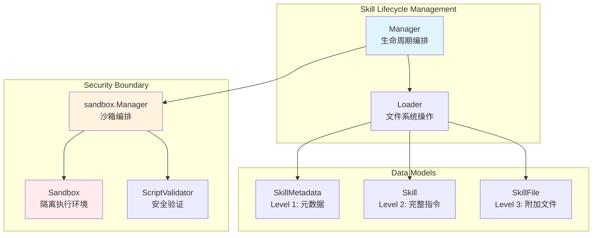

# Skill Lifecycle Management

## 概述

想象你正在管理一个"技能图书馆"——AI 助手可以通过学习这些技能来扩展自己的能力边界。`skill_lifecycle_management` 模块就是这个图书馆的管理员：它负责发现书架上有哪些技能（发现）、读取技能的说明文档（加载）、以及在受控环境中执行技能附带的脚本（执行）。

这个模块存在的核心原因是**安全与性能的平衡**。如果每次 AI 需要知道某个技能时都去读取完整的技能文件，系统会变得缓慢；但如果一次性加载所有技能的全部内容，又会浪费内存，更关键的是——如果技能包含可执行脚本，我们需要确保它们只在沙箱中运行，而不是随意访问系统资源。因此，模块采用了**渐进式披露（Progressive Disclosure）**模式：启动时只加载轻量级的元数据，当 AI 真正需要某个技能时，才按需加载完整内容，执行脚本时则强制通过沙箱。

## 架构与数据流



### 组件角色与数据流

**Manager** 是整个模块的编排中枢。它不直接操作文件系统，也不直接执行脚本——它协调 `Loader` 和 `sandbox.Manager` 来完成这些工作。这种设计遵循**单一职责原则**：Manager 关注生命周期管理（初始化、缓存、访问控制），Loader 关注文件系统操作，Sandbox 关注安全执行。

**数据流动的典型路径**：

1. **启动发现阶段**：`Manager.Initialize()` → `Loader.DiscoverSkills()` → 扫描目录中的 `SKILL.md` → 解析 YAML frontmatter → 返回 `[]*SkillMetadata` → 缓存到 `Manager.metadataCache`

2. **按需加载阶段**：`Manager.LoadSkill(skillName)` → 检查白名单 → `Loader.LoadSkillInstructions()` → 读取完整 `SKILL.md` → 返回 `*Skill`（包含 Instructions）

3. **脚本执行阶段**：`Manager.ExecuteScript()` → 验证技能权限 → `Loader.GetSkillBasePath()` → `Loader.LoadSkillFile()` 验证脚本存在 → `sandbox.Manager.Execute()` → 安全验证 → 沙箱执行 → 返回 `ExecuteResult`

这种分层设计的关键在于**边界清晰**：Manager 知道"应该做什么"，Loader 知道"如何从文件系统获取"，Sandbox 知道"如何安全执行"。如果未来需要更换存储后端（比如从文件系统改为数据库），只需修改 Loader，Manager 和调用方无需感知。

## 核心组件深度解析

### Manager：生命周期编排器

`Manager` 是技能系统的入口点，它的设计哲学是**防御性编程**与**懒加载**的结合。

```go
type Manager struct {
    loader     *Loader
    sandboxMgr sandbox.Manager

    // Configuration
    skillDirs     []string
    allowedSkills []string // Empty means all skills are allowed
    enabled       bool

    // Cache
    metadataCache []*SkillMetadata
    mu            sync.RWMutex
}
```

**关键设计决策**：

1. **读写锁保护缓存**：使用 `sync.RWMutex` 而非普通 `Mutex`，因为元数据读取（`GetAllMetadata`）远多于写入（`Initialize`、`Reload`）。在高并发场景下，多个 goroutine 可以同时读取缓存，只有初始化或重载时才需要独占锁。

2. **白名单机制**：`allowedSkills` 字段实现了访问控制。当列表为空时，所有发现的技能都可用；当指定了技能名列表，只有白名单内的技能可被加载或执行。这是**最小权限原则**的体现——生产环境中可以只开放必要的技能。

3. **启用开关**：`enabled` 字段允许在配置层面完全禁用技能系统。当为 `false` 时，所有方法直接返回错误，避免不必要的文件系统操作。这为功能灰度发布提供了便利。

**核心方法行为**：

| 方法 | 触发时机 | 副作用 | 返回内容 |
|------|----------|--------|----------|
| `Initialize(ctx)` | 应用启动 | 填充 `metadataCache` | `error` |
| `GetAllMetadata()` | 构建系统提示词 | 无（返回副本） | `[]*SkillMetadata` |
| `LoadSkill(ctx, name)` | AI 请求技能详情 | 可能触发文件读取 | `*Skill` |
| `ExecuteScript(...)` | AI 调用技能脚本 | 启动沙箱进程 | `*ExecuteResult` |
| `Reload(ctx)` | 热更新技能 | 清空并重建缓存 | `error` |

**注意**：`GetAllMetadata()` 返回的是缓存的**副本**而非引用。这是为了防止调用方意外修改缓存内容，属于**防御性拷贝**模式。

### Loader：文件系统抽象层

`Loader` 封装了所有与文件系统交互的逻辑，它的核心价值在于**将文件系统细节与业务逻辑隔离**。

```go
type Loader struct {
    skillDirs        []string
    discoveredSkills map[string]*Skill
}
```

**发现机制**：`DiscoverSkills()` 遍历所有配置的目录，查找包含 `SKILL.md` 文件的子目录。对于每个找到的技能文件，它只解析 YAML frontmatter（元数据部分），而不读取完整的指令内容。这种**轻量级发现**确保启动速度不受技能数量影响。

**缓存策略**：`discoveredSkills` 是一个以技能名为键的映射。当首次发现技能时，完整的 `*Skill` 对象会被缓存（但 `Loaded` 标志为 `false`，表示指令未加载）。后续调用 `LoadSkillInstructions()` 时，如果缓存中存在且已加载，直接返回；否则从文件系统读取并更新缓存。这是典型的**懒加载缓存**模式。

**安全边界**：`LoadSkillFile()` 方法实现了严格的路径验证：

```go
// Security: prevent path traversal
if strings.HasPrefix(cleanPath, "..") || filepath.IsAbs(cleanPath) {
    return nil, fmt.Errorf("invalid file path: %s", relativePath)
}

// Verify the file is within the skill directory
if !strings.HasPrefix(absFilePath, absSkillPath) {
    return nil, fmt.Errorf("file path outside skill directory: %s", relativePath)
}
```

这段代码防止了**路径遍历攻击**（Path Traversal）。即使攻击者控制了 `relativePath` 参数（如传入 `../../etc/passwd`），也无法读取技能目录之外的文件。这是安全敏感模块的必备防护。

### Skill 数据模型：渐进式披露的载体

`Skill` 结构体体现了 Progressive Disclosure 模式的核心思想：

```go
type Skill struct {
    // Level 1: 始终加载
    Name        string
    Description string

    // 文件系统信息
    BasePath string
    FilePath string

    // Level 2: 按需加载
    Instructions string
    Loaded       bool
}
```

**三层披露模型**：

- **Level 1（元数据）**：`Name` 和 `Description` 在发现阶段就被提取，用于系统提示词注入。AI 通过这些信息知道"有哪些技能可用"。
- **Level 2（指令）**：`Instructions` 是 `SKILL.md` 文件中 YAML frontmatter 之后的 Markdown 正文，包含技能的使用说明。只有当 AI 明确请求某个技能时才加载。
- **Level 3（资源）**：技能目录中的其他文件（如 `FORMS.md`、`scripts/validate.py`）通过 `LoadSkillFile()` 按需读取。

这种设计的**性能优势**在于：假设系统有 100 个技能，每个技能的指令平均 5KB，如果全量加载需要 500KB 内存；而使用渐进式披露，启动时只加载元数据（约 100B/技能），仅需 10KB，内存占用减少 98%。

### 与 Sandbox 的集成：安全执行边界

`Manager.ExecuteScript()` 是技能系统与沙箱的交汇点。它的工作流程是：

1. 验证技能是否在白名单中
2. 通过 `Loader.GetSkillBasePath()` 获取技能的绝对路径
3. 通过 `Loader.LoadSkillFile()` 验证脚本文件存在且标记为可执行
4. 构造 `sandbox.ExecuteConfig`，设置 `WorkDir` 为技能目录
5. 调用 `sandbox.Manager.Execute()` 执行

**关键安全机制**：

- **脚本验证**：`sandbox.Manager` 在執行前会调用 `ScriptValidator` 检查脚本内容，防止命令注入、危险系统调用等。
- **工作目录隔离**：脚本的工作目录被限制在技能目录内，无法访问其他路径。
- **资源限制**：通过 `ExecuteConfig` 可以设置超时、内存限制、CPU 限制等（Docker 沙箱支持）。

**依赖契约**：`Manager` 假设 `sandbox.Manager` 已经正确初始化。如果 `sandboxMgr == nil`，`ExecuteScript()` 会返回错误。这意味着在应用启动时，必须先创建沙箱管理器，再创建技能管理器。

## 依赖关系分析

### 上游依赖（被谁调用）

1. **`internal.agent.tools.skill_execute.ExecuteSkillScriptTool`**：当 AI 决定执行某个技能的脚本时，该工具调用 `Manager.ExecuteScript()`。这是技能执行的主要入口。

2. **`internal.agent.tools.skill_read.ReadSkillTool`**：当 AI 需要读取技能的完整指令或附加文件时，调用 `Manager.LoadSkill()` 或 `Manager.ReadSkillFile()`。

3. **`internal.agent.engine.AgentEngine`**：在构建系统提示词时，调用 `Manager.GetAllMetadata()` 获取所有技能的元数据，注入到 AI 的上下文中。

4. **`internal.handler.skill_handler.SkillHandler`**：HTTP 接口层，提供技能管理 API（如列出技能、获取技能详情），内部调用 `Manager` 的方法。

### 下游依赖（调用谁）

1. **`internal.agent.skills.loader.Loader`**：所有文件系统操作都委托给 Loader。Manager 不直接使用 `os` 包，这便于单元测试（可以注入 mock Loader）。

2. **`internal.sandbox.manager.Manager`**：脚本执行委托给沙箱管理器。Manager 不关心沙箱是 Docker 还是本地进程，只关心 `Execute()` 接口的契约。

3. **`internal.agent.skills.skill.*`**：使用 `Skill`、`SkillMetadata`、`SkillFile` 等数据模型。这些是纯数据结构，无外部依赖。

### 数据契约

**Manager ↔ Loader**：
- 输入：技能名、文件相对路径
- 输出：`*Skill`、`*SkillFile`、`[]string`（文件列表）
- 错误：技能不存在、文件读取失败、路径遍历攻击

**Manager ↔ Sandbox**：
- 输入：`*sandbox.ExecuteConfig`（包含脚本路径、参数、工作目录）
- 输出：`*sandbox.ExecuteResult`（包含 stdout、stderr、退出码）
- 错误：沙箱未配置、安全验证失败、执行超时

## 设计决策与权衡

### 1. 为什么使用 Progressive Disclosure 而非全量加载？

**选择**：渐进式披露（Level 1/2/3 分层加载）

**替代方案**：启动时加载所有技能的完整内容

**权衡分析**：
- **内存效率**：渐进式披露显著降低内存占用，尤其是技能数量多时
- **启动速度**：只解析 frontmatter 比读取完整文件快得多
- **灵活性**：可以动态添加/删除技能文件，通过 `Reload()` 刷新缓存

**代价**：首次加载某个技能时有额外的 I/O 开销。但在实际场景中，AI 不会一次性使用所有技能，这个代价是可接受的。

### 2. 为什么 Manager 不直接操作文件系统？

**选择**：通过 Loader 间接访问文件系统

**替代方案**：Manager 直接使用 `os.ReadDir`、`os.ReadFile` 等

**权衡分析**：
- **可测试性**：Loader 可以被 mock，Manager 的单元测试无需真实文件系统
- **可替换性**：未来如果需要从数据库或远程存储加载技能，只需实现新的 Loader 接口
- **职责分离**：Manager 关注业务逻辑（权限、缓存），Loader 关注技术细节（路径、编码）

**代价**：增加了一层间接调用，代码量略增。但这是**依赖倒置原则**的标准实践，长期维护收益大于短期成本。

### 3. 为什么使用 RWMutex 而非 Mutex？

**选择**：`sync.RWMutex` 保护 `metadataCache`

**替代方案**：普通 `sync.Mutex`

**权衡分析**：
- **读多写少场景**：`GetAllMetadata()` 被频繁调用（每次 AI 对话都可能），而 `Initialize()` 和 `Reload()` 只在启动或热更新时调用
- **并发性能**：RWMutex 允许多个读者同时访问，Mutex 会串行化所有访问

**代价**：RWMutex 在写操作频繁时性能不如 Mutex（因为需要维护读者计数）。但在此场景中，写操作极少，这个代价可忽略。

### 4. 为什么允许技能白名单为空（允许所有技能）？

**选择**：`allowedSkills` 为空时表示允许所有发现的技能

**替代方案**：必须显式指定允许的技能列表

**权衡分析**：
- **开发便利性**：开发环境中可以自动发现所有技能，无需手动配置
- **生产安全性**：生产环境可以指定白名单，遵循最小权限原则
- **向后兼容**：现有配置无需修改即可工作

**风险**：如果生产环境忘记配置白名单，可能意外暴露不需要的技能。**缓解措施**：在部署文档中明确建议生产环境配置白名单。

## 使用指南

### 初始化技能管理器

```go
// 创建沙箱管理器（必须先于技能管理器）
sandboxMgr, err := sandbox.NewManager(&sandbox.Config{
    Type:            sandbox.SandboxTypeDocker,
    FallbackEnabled: true,
    DockerImage:     "python:3.11-slim",
})
if err != nil {
    return err
}

// 创建技能管理器
skillMgr := skills.NewManager(&skills.ManagerConfig{
    SkillDirs:     []string{"./skills", "/opt/custom-skills"},
    AllowedSkills: []string{"data-analysis", "web-search"}, // 空表示允许所有
    Enabled:       true,
}, sandboxMgr)

// 初始化（发现技能并缓存元数据）
if err := skillMgr.Initialize(context.Background()); err != nil {
    return err
}
```

### 获取技能元数据（用于系统提示词）

```go
metadata := skillMgr.GetAllMetadata()
for _, m := range metadata {
    fmt.Printf("Skill: %s - %s\n", m.Name, m.Description)
}
```

### 加载技能完整指令

```go
skill, err := skillMgr.LoadSkill(ctx, "data-analysis")
if err != nil {
    return err
}
fmt.Println(skill.Instructions) // Level 2 内容
```

### 执行技能脚本

```go
result, err := skillMgr.ExecuteScript(ctx, "data-analysis", "scripts/validate.py", 
    []string{"--input", "data.csv"}, // 命令行参数
    "") // stdin 输入
if err != nil {
    return err
}
fmt.Printf("Output: %s\n", result.Stdout)
fmt.Printf("Exit Code: %d\n", result.ExitCode)
```

### 热更新技能

```go
// 当技能文件发生变化时，刷新缓存
if err := skillMgr.Reload(context.Background()); err != nil {
    log.Printf("Failed to reload skills: %v", err)
}
```

### 应用关闭时清理资源

```go
if err := skillMgr.Cleanup(context.Background()); err != nil {
    log.Printf("Failed to cleanup skill manager: %v", err)
}
```

## 边界情况与注意事项

### 1. 技能目录不存在

`Loader.DiscoverSkills()` 会静默跳过不存在的目录，不会返回错误。这意味着如果配置了多个目录，部分目录缺失不会导致整个系统失败。但这也可能掩盖配置错误——**建议在启动日志中记录实际发现的技能数量**，以便运维人员验证。

### 2. SKILL.md 格式错误

如果 `SKILL.md` 的 YAML frontmatter 格式错误或缺少 `name`/`description` 字段，`ParseSkillFile()` 会返回错误，该技能会被跳过。错误会被记录但不会中断发现过程。**建议**：在开发环境中提供详细的错误信息，帮助技能开发者调试。

### 3. 路径遍历攻击防护

`LoadSkillFile()` 实现了多层防护：
- 拒绝以 `..` 开头的相对路径
- 拒绝绝对路径
- 验证解析后的绝对路径仍在技能目录内

但调用方仍需注意：**不要将用户输入直接传递给 `filePath` 参数**。应该先进行业务层面的验证（如只允许预定义的文件名）。

### 4. 沙箱未配置的后果

如果 `sandboxMgr == nil`，`ExecuteScript()` 会返回 `"sandbox is not configured"` 错误。这通常发生在：
- 应用配置禁用了沙箱
- 沙箱初始化失败（如 Docker 不可用且未启用 fallback）

**建议**：在应用启动时检查 `skillMgr.IsEnabled()` 和沙箱状态，提前预警。

### 5. 并发安全

`Manager` 的所有公开方法都是并发安全的：
- 读操作（`GetAllMetadata`、`LoadSkill`、`ReadSkillFile`）使用读锁
- 写操作（`Initialize`、`Reload`）使用写锁
- `ExecuteScript` 不修改状态，无需锁

但 `Loader.discoveredSkills` 的缓存更新不是原子的——如果 `Reload()` 和 `LoadSkill()` 同时调用，可能短暂返回旧数据。**在技能热更新场景下，建议暂停新的技能请求直到重载完成**。

### 6. 技能命名冲突

如果多个目录中存在同名的技能，后扫描的目录会覆盖先扫描的目录（在 `discoveredSkills` 映射中）。**建议**：确保技能名在全局范围内唯一，或在文档中明确扫描顺序的优先级。

## 扩展点

### 自定义技能存储后端

如果需要从数据库或远程存储加载技能，可以实现与 `Loader` 相同的方法签名：

```go
type SkillLoader interface {
    DiscoverSkills() ([]*SkillMetadata, error)
    LoadSkillInstructions(skillName string) (*Skill, error)
    LoadSkillFile(skillName, relativePath string) (*SkillFile, error)
    ListSkillFiles(skillName string) ([]string, error)
    GetSkillBasePath(skillName string) (string, error)
    Reload() ([]*SkillMetadata, error)
}
```

然后修改 `Manager` 以接受接口而非具体类型。当前实现是紧耦合的，这是**未来重构的候选点**。

### 自定义沙箱策略

`ExecuteScript()` 中的沙箱调用是硬编码的。如果需要更细粒度的控制（如根据技能名选择不同的沙箱配置），可以在 `Manager` 中添加沙箱选择逻辑，或扩展 `ExecuteConfig` 支持每技能配置。

## 相关模块

- [Agent Skills Loader](agent_skills_loader.md)：`Loader` 的详细实现
- [Sandbox Execution](sandbox_execution.md)：沙箱执行机制与安全验证
- [Skill Execution Tool](skill_execution_tool.md)：AI 调用技能脚本的工具实现
- [Skill Reading Tool](skill_reading_tool.md)：AI 读取技能内容的工具实现
