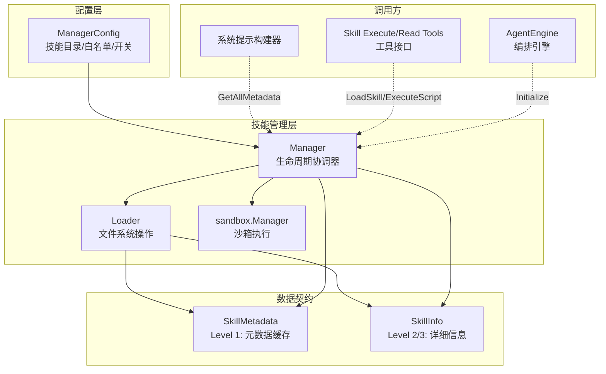

# Skill Management Contracts

## 概述：为什么需要这个模块

想象你正在构建一个可扩展的 Agent 系统，用户希望能够自定义 Agent 的行为和能力 —— 比如添加一个"分析销售数据"的技能，或者"生成周报"的技能。这些技能需要满足几个相互冲突的需求：

1. **灵活性**：技能应该是可动态加载的，不需要重新编译或重启系统
2. **安全性**：用户提供的技能代码不能随意访问系统资源，必须在沙箱中执行
3. **性能**：技能的元数据需要快速访问（用于构建系统提示），但完整内容只在需要时加载
4. **可控性**：管理员需要能够限制哪些技能可以被使用

`skill_management_contracts` 模块正是为了解决这些张力而存在的。它定义了两个核心数据结构 —— `ManagerConfig` 和 `SkillInfo` —— 它们是技能管理系统的"配置契约"和"信息契约"。这两个结构看似简单，但背后承载了整个技能生命周期管理的架构决策。

**核心洞察**：这个模块采用了一种**分层访问模型**。技能信息被分为三个层级：
- **Level 1**：元数据（名称、描述）—— 用于系统提示注入，所有技能可见
- **Level 2**：完整指令 —— 只有被明确请求时才加载
- **Level 3**：文件内容和脚本执行 —— 需要沙箱隔离

这种设计避免了在启动时加载所有技能内容的开销，同时通过沙箱保证了执行安全。

---

## 架构与数据流



### 组件角色说明

| 组件 | 职责 | 类比 |
|------|------|------|
| `ManagerConfig` | 持有技能系统的配置参数 | 像是"安全策略配置文件" |
| `Manager` | 协调技能发现、加载、执行的生命周期 | 像是"技能仓库管理员" |
| `Loader` | 处理文件系统操作，发现技能目录结构 | 像是"图书管理员，负责找书" |
| `sandbox.Manager` | 在隔离环境中执行技能脚本 | 像是"实验室，危险操作在这里进行" |
| `SkillInfo` | 技能的完整信息视图 | 像是"书籍的完整目录和内容摘要" |

### 数据流追踪

**场景 1：系统启动时的技能发现**
```
AgentEngine.Initialize() 
  → Manager.Initialize(ctx)
    → Loader.DiscoverSkills()  // 扫描文件系统
    → Manager.filterAllowedSkills()  // 应用白名单过滤
    → 缓存到 metadataCache
```

**场景 2：构建系统提示（Level 1 访问）**
```
PromptBuilder.BuildSystemPrompt()
  → Manager.GetAllMetadata()  // 返回缓存的元数据副本
  → 将技能描述注入到 Agent 系统提示中
```

**场景 3：用户请求执行技能脚本（Level 3 访问）**
```
ExecuteSkillScriptTool.Execute()
  → Manager.ExecuteScript(ctx, skillName, scriptPath, args, stdin)
    → 检查 enabled 和 allowedSkills
    → Loader.GetSkillBasePath()  // 定位技能目录
    → Loader.LoadSkillFile()  // 验证文件存在且是脚本
    → sandbox.Manager.Execute()  // 在沙箱中执行
```

---

## 核心组件深度解析

### ManagerConfig：配置契约

```go
type ManagerConfig struct {
    SkillDirs     []string // 技能搜索目录
    AllowedSkills []string // 技能名称白名单（空 = 允许所有）
    Enabled       bool     // 技能系统总开关
}
```

**设计意图**：这个结构体现了**防御性配置**的设计思想。三个字段分别对应三个安全层级：

1. **`Enabled`**：总开关。为什么需要一个总开关？因为在某些部署场景下（如多租户环境），管理员可能希望完全禁用技能功能，而不是逐个配置。这是一种"kill switch"模式。

2. **`SkillDirs`**：技能目录列表。支持多目录的设计考虑到了技能来源的多样性 —— 可能有系统内置技能目录、租户自定义技能目录、插件技能目录等。

3. **`AllowedSkills`**：白名单机制。这是一个关键的安全控制点。空列表表示"允许所有"，这是一种**默认开放**的设计，适合开发环境；生产环境可以显式列出允许的技能名称。

**使用示例**：
```go
// 开发环境：启用所有技能
devConfig := &ManagerConfig{
    SkillDirs: []string{"./skills", "./custom-skills"},
    Enabled:   true,
}

// 生产环境：只允许特定技能
prodConfig := &ManagerConfig{
    SkillDirs:     []string{"/opt/app/skills"},
    AllowedSkills: []string{"data-analysis", "report-generator"},
    Enabled:       true,
}

// 禁用技能功能
disabledConfig := &ManagerConfig{
    Enabled: false,
}
```

### SkillInfo：信息契约

```go
type SkillInfo struct {
    Name         string   `json:"name"`
    Description  string   `json:"description"`
    BasePath     string   `json:"base_path"`
    Instructions string   `json:"instructions"`
    Files        []string `json:"files"`
}
```

**设计意图**：这个结构是技能的"完整视图"，用于 API 响应和详细展示。注意它与 `SkillMetadata` 的区别：

| 字段 | SkillMetadata | SkillInfo | 用途差异 |
|------|---------------|-----------|----------|
| Name | ✓ | ✓ | 两者都有 |
| Description | ✓ | ✓ | 两者都有 |
| BasePath | ✗ | ✓ | 仅 Info 需要，用于定位 |
| Instructions | ✗ | ✓ | 仅 Info 需要，Level 2 访问 |
| Files | ✗ | ✓ | 仅 Info 需要，文件列表 |

**为什么分开设计？** 这是典型的**懒加载模式**。`SkillMetadata` 轻量，适合缓存和批量访问；`SkillInfo` 重量级，只在用户明确请求某个技能详情时才构建。这种分离避免了不必要的 I/O 开销。

**JSON 标签的意义**：所有字段都有 `json` 标签，说明这个结构会直接序列化后返回给前端。这是一个**API 边界对象**，设计时考虑了外部消费的需求。

---

## 依赖关系分析

### 上游依赖（谁调用这个模块）

| 调用方 | 调用方式 | 期望行为 |
|--------|----------|----------|
| `AgentEngine` | `Initialize()`, `GetAllMetadata()` | 启动时初始化技能，构建系统提示 |
| `ExecuteSkillScriptTool` | `ExecuteScript()` | 执行技能脚本，需要沙箱隔离 |
| `ReadSkillTool` | `LoadSkill()`, `ReadSkillFile()` | 读取技能内容，用于展示 |
| `SkillHandler` (HTTP) | `GetSkillInfo()` | API 端点返回技能详情 |

### 下游依赖（这个模块调用谁）

| 被调用方 | 调用目的 | 耦合程度 |
|----------|----------|----------|
| `Loader` | 文件系统操作（发现、加载、列出文件） | 紧耦合，直接持有指针 |
| `sandbox.Manager` | 脚本执行 | 紧耦合，通过接口调用 |
| `sync.RWMutex` | 并发访问控制 | 标准库，无外部依赖 |

### 数据契约

**输入契约**：
- `ManagerConfig`：调用方必须提供有效的配置，`nil` 会被转换为默认配置（`Enabled: false`）
- `ctx`：所有公开方法都接受 `context.Context`，支持取消和超时

**输出契约**：
- `GetAllMetadata()` 返回元数据**副本**，防止外部修改内部缓存
- 错误处理统一使用 `fmt.Errorf` 包装，带有清晰的错误上下文

---

## 设计决策与权衡

### 1. 为什么使用白名单而不是黑名单？

**选择**：`AllowedSkills` 是白名单（只允许列出的技能），而不是黑名单（禁止列出的技能）。

**权衡分析**：
- **白名单优势**：默认安全。新增技能不会自动可用，需要显式配置。适合生产环境。
- **白名单劣势**：配置繁琐，每次添加新技能都需要更新配置。
- **黑名单优势**：配置简单，新技能默认可用。
- **黑名单劣势**：默认不安全，恶意技能可能被意外启用。

**为什么选择白名单**：技能系统涉及代码执行，安全优先级高于便利性。空列表表示"允许所有"的设计是一种折中 —— 开发环境可以保持便利，生产环境可以启用白名单。

### 2. 为什么元数据缓存使用副本返回？

```go
// Return a copy to prevent external modification
result := make([]*SkillMetadata, len(m.metadataCache))
copy(result, m.metadataCache)
return result
```

**设计意图**：这是**防御性编程**的体现。如果直接返回内部切片，调用方可能意外（或恶意）修改缓存内容，导致后续调用返回被污染的数据。

**代价**：每次调用都需要分配新切片并复制。对于技能数量较少的场景（通常<100 个），这个开销可以忽略不计。

### 3. 为什么 `Manager` 直接持有 `*Loader` 而不是接口？

**观察**：`Manager` 的结构中 `loader *Loader` 是具体类型，不是接口。

**权衡分析**：
- **使用具体类型**：简化设计，减少抽象层。`Loader` 的职责明确（文件系统操作），不太可能有多实现。
- **使用接口**：增加灵活性，便于测试时注入 mock。

**为什么选择具体类型**：这是一个**务实的简化**。`Loader` 的功能相对固定，且 `Manager` 本身已经通过 `sandbox.Manager` 接口与沙箱解耦。过度抽象会增加代码复杂度而不带来实际收益。

**测试影响**：测试时需要使用真实的 `Loader`，但可以通过创建临时目录来隔离测试环境。

### 4. 为什么所有方法都检查 `m.enabled`？

**模式**：每个公开方法开头都有：
```go
if !m.enabled {
    return nil, fmt.Errorf("skills are not enabled")
}
```

**设计意图**：这是**快速失败**模式。与其在每个调用路径上检查配置，不如在入口处统一拦截。这样做的好处：
1. 错误信息一致
2. 避免在禁用状态下执行任何操作（包括 I/O）
3. 代码意图清晰

**潜在问题**：如果 `enabled` 在运行时从 `true` 变为 `false`，正在执行的操作不会中断（因为没有检查 `ctx` 中的取消信号）。这是一个已知的限制。

---

## 使用指南与示例

### 初始化技能管理器

```go
// 创建沙箱管理器（前置依赖）
sandboxMgr := sandbox.NewDefaultManager(&sandbox.Config{
    Enabled: true,
    Type:    "docker", // 或 "local"
})

// 创建技能管理器配置
config := &skills.ManagerConfig{
    SkillDirs:     []string{"/app/skills", "/app/custom-skills"},
    AllowedSkills: []string{"data-analysis", "report-generator"},
    Enabled:       true,
}

// 创建管理器
skillMgr := skills.NewManager(config, sandboxMgr)

// 启动时初始化
ctx := context.Background()
if err := skillMgr.Initialize(ctx); err != nil {
    log.Fatalf("Failed to initialize skills: %v", err)
}
```

### 获取技能元数据（用于系统提示）

```go
// 获取所有技能元数据
metadata := skillMgr.GetAllMetadata()

// 构建系统提示
var prompt strings.Builder
prompt.WriteString("你可以使用以下技能：\n")
for _, meta := range metadata {
    prompt.Printf("- %s: %s\n", meta.Name, meta.Description)
}
```

### 执行技能脚本

```go
// 执行技能中的脚本
result, err := skillMgr.ExecuteScript(
    ctx,
    "data-analysis",     // 技能名称
    "scripts/analyze.py", // 脚本路径
    []string{"--format", "json"}, // 参数
    "{\"data\": [...]}",  // 标准输入
)

if err != nil {
    log.Printf("Script execution failed: %v", err)
    return
}

log.Printf("Output: %s", result.Stdout)
log.Printf("Exit code: %d", result.ExitCode)
```

### 获取技能详情（API 场景）

```go
// HTTP Handler 中
func (h *SkillHandler) GetSkill(w http.ResponseWriter, r *http.Request) {
    skillName := chi.URLParam(r, "name")
    
    info, err := h.skillMgr.GetSkillInfo(r.Context(), skillName)
    if err != nil {
        http.Error(w, err.Error(), http.StatusNotFound)
        return
    }
    
    json.NewEncoder(w).Encode(info)
}
```

---

## 边界情况与注意事项

### 1. 并发安全

`Manager` 使用 `sync.RWMutex` 保护 `metadataCache`：
- **读操作**（`GetAllMetadata`）：使用 `RLock`，允许多个并发读取
- **写操作**（`Initialize`, `Reload`）：使用 `Lock`，独占访问

**注意事项**：`loader` 和 `sandboxMgr` 没有内部锁保护。如果多个 goroutine 同时调用 `ExecuteScript`，沙箱管理器需要自己处理并发。

### 2. 技能名称验证

当前实现**没有验证技能名称的格式**。这意味着：
- 路径遍历攻击（如 `../../../etc/passwd`）依赖 `Loader` 内部处理
- 空字符串、特殊字符等边界情况没有显式检查

**建议**：在调用 `LoadSkill`、`ExecuteScript` 等方法前，调用方应验证技能名称符合预期格式（如 `^[a-z0-9-]+$`）。

### 3. 沙箱依赖

`ExecuteScript` 方法强依赖 `sandbox.Manager`：
```go
if m.sandboxMgr == nil {
    return nil, fmt.Errorf("sandbox is not configured")
}
```

**陷阱**：如果创建 `Manager` 时传入 `nil` 沙箱管理器，`ExecuteScript` 会在运行时才报错。更好的做法是在 `NewManager` 中验证：

```go
// 当前实现允许 nil，但文档应明确说明
func NewManager(config *ManagerConfig, sandboxMgr sandbox.Manager) *Manager {
    // 如果计划执行脚本，sandboxMgr 不应为 nil
}
```

### 4. 错误处理模式

所有错误都使用 `fmt.Errorf` 包装，带有上下文信息：
```go
return nil, fmt.Errorf("failed to discover skills: %w", err)
```

**注意事项**：调用方可以使用 `errors.Is` 和 `errors.As` 检查底层错误，但当前实现没有定义特定的错误类型。如果需要区分"技能不存在"和"权限不足"等错误，需要解析错误消息或添加自定义错误类型。

### 5. 资源清理

`Cleanup` 方法只清理沙箱管理器：
```go
func (m *Manager) Cleanup(ctx context.Context) error {
    if m.sandboxMgr != nil {
        return m.sandboxMgr.Cleanup(ctx)
    }
    return nil
}
```

**注意事项**：`Loader` 没有清理逻辑（因为它只处理文件读取，不持有资源）。如果未来 `Loader` 添加了文件监听或缓存，需要在这里添加相应的清理代码。

### 6. 热重载限制

`Reload` 方法可以刷新技能缓存，但：
- 不会终止正在执行的脚本
- 不会通知已加载技能的调用方
- 可能导致新旧技能元数据不一致（如果调用方缓存了 `GetAllMetadata` 的结果）

**建议**：热重载应在低峰期执行，或配合事件通知机制（如通过 `EventBus` 发布技能更新事件）。

---

## 扩展点

### 添加新的技能来源

当前 `Loader` 只支持文件系统。如果需要从数据库、Git 仓库或远程 API 加载技能，可以：

1. 创建新的 `Loader` 实现（如 `RemoteLoader`）
2. 修改 `Manager` 支持多个 `Loader`（当前只支持一个）
3. 或添加 `Loader` 接口，让 `Manager` 依赖接口而非具体类型

### 添加技能版本管理

当前设计没有版本概念。如果需要支持多版本技能：

1. 在 `SkillMetadata` 和 `SkillInfo` 中添加 `Version` 字段
2. 修改 `AllowedSkills` 支持版本约束（如 `data-analysis@>=1.0.0`）
3. 在 `Loader` 中实现版本解析逻辑

### 添加技能依赖管理

如果技能之间有依赖关系（如技能 A 依赖技能 B 的脚本）：

1. 在 `SkillMetadata` 中添加 `Dependencies []string` 字段
2. 在 `Initialize` 中构建依赖图并检测循环依赖
3. 在 `ExecuteScript` 中确保依赖技能已加载

---

## 相关模块参考

- [Skill Loading and Lifecycle Management](skill_loading_and_lifecycle_management.md) — `Loader` 的实现细节
- [Agent Skills Lifecycle and Skill Tools](agent_skills_lifecycle_and_skill_tools.md) — 技能工具（ExecuteSkillScriptTool, ReadSkillTool）的使用
- [Sandbox Execution and Script Safety](sandbox_execution_and_script_safety.md) — 沙箱执行机制
- [Agent Core Orchestration](agent_core_orchestration_and_tooling_foundation.md) — AgentEngine 如何集成技能管理

---

## 总结

`skill_management_contracts` 模块虽然只有两个核心数据结构，但它是整个技能系统的"控制平面"。`ManagerConfig` 定义了安全边界，`SkillInfo` 定义了信息边界。理解这个模块的关键在于把握三个设计原则：

1. **分层访问**：元数据 → 指令 → 执行，逐级深入，按需加载
2. **防御性配置**：白名单、总开关、沙箱隔离，多层防护
3. **并发安全**：读写锁保护缓存，副本返回防止外部修改

对于新贡献者，建议从阅读 `Manager.Initialize` 和 `Manager.ExecuteScript` 两个方法入手，它们分别代表了技能管理的两个核心场景：启动时发现和运行时执行。
