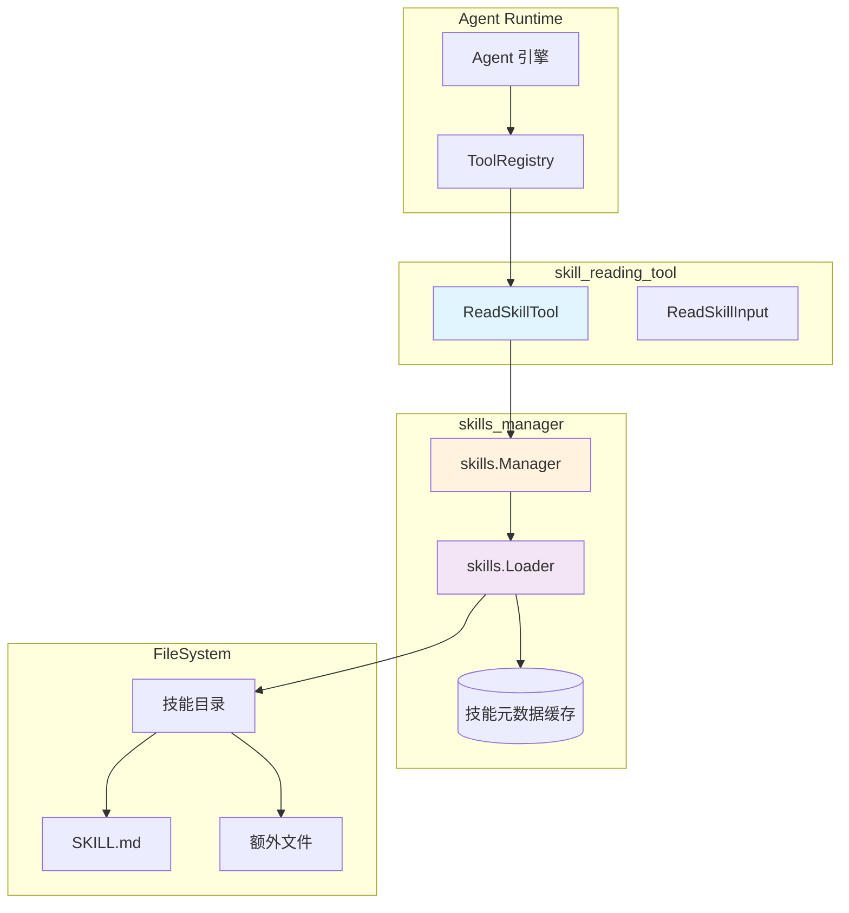

# skill_reading_tool 模块技术深度解析

## 模块概述：为什么需要"按需阅读技能"？

想象一个场景：你的 Agent 系统支持数十种专业技能（比如"数据分析"、"代码审查"、"文档生成"），每个技能都有一套详细的操作指南和最佳实践。如果每次对话开始时就把所有技能的完整说明都塞进 System Prompt，上下文窗口会瞬间爆炸 —— 这不仅浪费 token，还会稀释关键信息，让 LLM 难以聚焦。

`skill_reading_tool` 模块的核心设计洞察是：**技能信息应该按需加载，而非全量注入**。它实现了一个"图书馆借阅"模式：Agent 在系统提示中只看到技能的"目录卡片"（名称和简短描述），当用户请求匹配某个技能时，Agent 主动调用 `read_skill` 工具去"借阅"该技能的完整操作指南。这种延迟加载策略既保持了上下文的精简，又确保了 Agent 在需要时能获取足够的领域知识。

从架构角色来看，这个模块是 **Agent 工具链中的知识检索网关** —— 它不生产技能内容，而是安全地桥接 Agent 运行时与技能文件系统，在提供灵活性的同时通过多重校验防止路径遍历等安全风险。

---

## 架构与数据流



**数据流 walkthrough**：

1. **触发阶段**：Agent 引擎根据对话上下文决定调用 `read_skill` 工具，将参数序列化为 JSON 传入
2. **解析与校验**：`ReadSkillTool.Execute` 反序列化参数，校验 `skill_name` 非空，检查 `skills.Manager` 是否启用
3. **分支执行**：
   - 若指定 `file_path`：调用 `Manager.ReadSkillFile` → `Loader.LoadSkillFile`，执行路径安全校验后读取文件
   - 若未指定：调用 `Manager.LoadSkill` → `Loader.LoadSkillInstructions`，加载 `SKILL.md` 主体内容
4. **结果组装**：构建人类可读的 Markdown 输出（`Output` 字段）和结构化数据（`Data` 字段），返回 `ToolResult`
5. **缓存利用**：`Loader` 内部维护 `discoveredSkills` 缓存，已加载的技能元数据可直接复用，避免重复 I/O

---

## 核心组件深度解析

### ReadSkillTool：工具执行器

**设计意图**：作为 `BaseTool` 的具体实现，`ReadSkillTool` 的职责是将 Agent 的高层意图（"我想了解某个技能"）转换为底层的文件系统操作，同时确保操作的安全性和可观测性。

**内部机制**：

```go
type ReadSkillTool struct {
    BaseTool     // 继承工具元数据（名称、描述、JSON Schema）
    skillManager *skills.Manager  // 依赖注入的技能管理器
}
```

关键设计点：

1. **依赖注入而非全局单例**：`skillManager` 通过构造函数 `NewReadSkillTool` 注入，这使得单元测试中可以轻松替换为 mock 实现，也避免了循环依赖。

2. **双模式执行逻辑**：
   - **模式 A（读取主指令）**：当 `file_path` 为空时，加载 `SKILL.md` 的 frontmatter 之后的主体内容，同时列出技能目录下的其他可用文件。这相当于给 Agent 一份"技能使用说明书 + 附录目录"。
   - **模式 B（读取特定文件）**：当 `file_path` 有值时，直接读取指定文件内容。这支持技能作者将大型参考文档、示例代码等拆分为独立文件，按需加载。

3. **结构化与半结构化输出并存**：
   - `Output` 字段：Markdown 格式的人类可读文本，适合直接展示给用户或作为 LLM 上下文
   - `Data` 字段：`map[string]interface{}` 结构化数据，包含 `skill_name`、`instructions`、`files` 等字段，便于后续程序化处理或日志审计

**参数与返回值**：

| 参数 | 类型 | 必填 | 说明 |
|------|------|------|------|
| `skill_name` | string | 是 | 技能名称，对应技能目录名 |
| `file_path` | string | 否 | 技能目录内的相对路径，如 `examples/query.sql` |

返回 `*types.ToolResult`，成功时 `Success=true`，`Output` 包含格式化内容，`Data` 包含结构化字段；失败时 `Success=false`，`Error` 包含错误信息。

**副作用**：
- 首次加载某技能时，`Loader` 会将其元数据写入 `discoveredSkills` 缓存
- 通过 `logger.Infof/Errorf` 记录执行日志，便于追踪工具调用链

---

### ReadSkillInput：参数契约

**设计意图**：定义工具调用的输入 Schema，通过 JSON Schema 注解让 LLM 理解参数语义。

```go
type ReadSkillInput struct {
    SkillName string `json:"skill_name" jsonschema:"Name of the skill to read"`
    FilePath  string `json:"file_path,omitempty" jsonschema:"Optional relative path to a specific file within the skill directory"`
}
```

**关键细节**：
- `jsonschema` 标签不是装饰性的 —— `utils.GenerateSchema[ReadSkillInput]()` 会解析这些标签生成 JSON Schema，注入到 Agent 的系统提示中，指导 LLM 正确构造工具调用参数。
- `omitempty` 确保 `file_path` 为空时不出现在 JSON 中，减少 token 消耗。

---

### 依赖组件：skills.Manager 与 skills.Loader

虽然这两个组件不属于本模块，但理解它们的职责对掌握数据流至关重要。

**skills.Manager** 是技能生命周期管理的门面（Facade）：
- 封装了技能启用状态检查（`IsEnabled`）
- 实现访问控制（`allowedSkills` 白名单）
- 代理加载请求到 `Loader`

**skills.Loader** 是实际的文件系统操作者：
- 维护 `discoveredSkills` 缓存，避免重复扫描目录
- 实现路径安全校验（防止 `../` 遍历出技能目录）
- 解析 `SKILL.md` 的 YAML frontmatter，分离元数据与指令正文

**缓存策略的权衡**：`Loader` 采用"懒加载 + 一次性缓存"策略 —— 首次请求某技能时扫描文件系统并缓存元数据，后续请求直接复用。这平衡了启动速度（不需要预加载所有技能）和运行时性能（避免重复 I/O）。但如果技能目录在运行时发生变化，缓存不会自动更新，这是设计上的已知限制。

---

## 依赖关系分析

### 本模块调用的组件（Callees）

| 被调用方 | 调用原因 | 数据契约 |
|---------|---------|---------|
| `skills.Manager.LoadSkill` | 加载技能主指令 | 输入：`skill_name`；输出：`*Skill` 或 error |
| `skills.Manager.ReadSkillFile` | 读取技能目录内特定文件 | 输入：`skill_name`, `file_path`；输出：文件内容 string 或 error |
| `skills.Manager.ListSkillFiles` | 获取技能目录文件列表 | 输入：`skill_name`；输出：`[]string` 文件名列表 |
| `logger.Infof/Errorf` | 可观测性日志 | 结构化日志，包含工具名和操作结果 |
| `utils.GenerateSchema` | 生成 JSON Schema | 泛型函数，从 `ReadSkillInput` 生成 Schema JSON |

### 调用本模块的组件（Callers）

| 调用方 | 调用场景 | 期望行为 |
|-------|---------|---------|
| `internal.agent.engine.AgentEngine` | Agent 决策调用工具 | 期望 `Execute` 在 100ms 内返回，不阻塞主循环 |
| `internal.agent.tools.registry.ToolRegistry` | 工具注册与分发 | 期望工具实现 `ToolExecutor` 接口，`Cleanup` 可安全多次调用 |
| `internal.application.service.agent_service.agentService` | 高层业务编排 | 期望 `ToolResult` 的 `Success` 字段准确反映执行状态 |

**耦合分析**：
- `ReadSkillTool` 对 `skills.Manager` 是**接口级耦合**，只依赖其公开方法，不关心内部实现。这使得未来可以将 `Manager` 替换为远程 RPC 客户端而不影响本模块。
- 对 `BaseTool` 是**继承耦合**，但 `BaseTool` 本身是无状态的轻量结构体，风险较低。
- **潜在脆弱点**：如果 `skills.Manager` 的 `LoadSkill` 方法签名变更（如增加上下文参数），本模块需要同步修改。建议通过接口抽象进一步解耦。

---

## 设计决策与权衡

### 1. 同步执行 vs 异步流式

**选择**：`Execute` 方法是同步阻塞的，一次性返回完整结果。

**权衡**：
- **优点**：实现简单，与现有 `ToolExecutor` 接口一致；对于小文件（SKILL.md 通常 < 10KB），同步读取的延迟可忽略。
- **缺点**：如果技能目录包含大文件（如 > 1MB 的示例数据），会阻塞 Agent 主循环。
- **扩展点**：未来可引入 `ExecuteStream` 方法，返回 `chan ToolResult`，支持大文件分块传输。

### 2. 路径安全校验的位置

**选择**：路径校验逻辑下沉到 `Loader.LoadSkillFile`，而非在 `ReadSkillTool` 中实现。

**原因**：
- **单一职责**：`ReadSkillTool` 负责工具协议转换，`Loader` 负责文件系统安全。
- **复用性**：`skills.Manager` 的其他方法（如 `ReadSkillFile`）也依赖 `Loader` 的校验，避免重复实现。
- **风险**：如果未来新增其他调用 `Loader` 的路径，需要确保校验逻辑同步更新。

### 3. 输出格式：Markdown + 结构化数据双轨

**选择**：同时填充 `ToolResult.Output`（Markdown）和 `ToolResult.Data`（map）。

**设计洞察**：
- **LLM 消费场景**：`Output` 的 Markdown 格式适合直接拼接到对话历史，LLM 能理解标题、列表等语义。
- **程序消费场景**：`Data` 字段允许后续服务（如日志分析、审计系统）无需解析 Markdown 即可提取关键字段。
- **代价**：内存占用翻倍（同一内容存储两份），但对于技能读取这种低频操作，可接受。

### 4. 错误处理：返回 Success=false 而非抛出 error

**选择**：即使技能不存在或文件读取失败，`Execute` 也返回 `nil` error，而是设置 `ToolResult.Success=false`。

**原因**：
- **Agent 语义**：对 Agent 而言，"技能不存在"是业务逻辑错误，不是系统异常。Agent 应能捕获此状态并生成友好提示（如"未找到该技能，请检查名称"）。
- **调用链稳定性**：如果 `Execute` 抛出 error，可能导致 Agent 引擎进入异常处理分支，中断对话流程。
- **风险**：调用方必须显式检查 `Success` 字段，否则可能误判执行结果。文档中需强调此契约。

---

## 使用示例与配置

### 基本用法：读取技能主指令

```go
// 初始化技能管理器
skillManager := skills.NewManager(
    skills.WithSkillDirs([]string{"/path/to/skills"}),
    skills.WithEnabled(true),
)

// 创建工具实例
readSkillTool := tools.NewReadSkillTool(skillManager)

// 构造输入参数
input := tools.ReadSkillInput{
    SkillName: "data_analysis",
}
inputJSON, _ := json.Marshal(input)

// 执行工具
ctx := context.Background()
result, err := readSkillTool.Execute(ctx, inputJSON)

if result.Success {
    fmt.Println(result.Output)  // Markdown 格式的技能说明
    fmt.Println(result.Data["instructions"])  // 纯文本指令
} else {
    fmt.Println("错误:", result.Error)
}
```

### 高级用法：读取技能目录内的特定文件

```go
input := tools.ReadSkillInput{
    SkillName: "data_analysis",
    FilePath:  "examples/complex_query.sql",
}
```

### 配置选项（通过 skills.Manager）

| 配置项 | 类型 | 默认值 | 说明 |
|-------|------|--------|------|
| `skillDirs` | `[]string` | 空 | 技能目录列表，支持多目录搜索 |
| `allowedSkills` | `[]string` | 空（允许全部） | 技能白名单，空表示无限制 |
| `enabled` | `bool` | `false` | 是否启用技能系统，关闭时所有技能工具返回错误 |

---

## 边界情况与注意事项

### 1. 路径遍历攻击防护

`Loader.LoadSkillFile` 实现了三重校验：
1. `filepath.Clean` 规范化路径（如 `a/../b` → `b`）
2. 检查是否以 `..` 开头或为绝对路径
3. 验证解析后的绝对路径是否在技能目录前缀内

**但需注意**：如果技能目录本身包含符号链接，攻击者可能通过精心构造的路径逃逸。生产环境应确保技能目录位于受信任的文件系统区域。

### 2. 缓存一致性问题

`Loader.discoveredSkills` 缓存不会自动失效。如果技能目录在运行时被修改（如通过管理界面更新技能），需要手动调用 `Manager` 的缓存刷新方法（如果提供）或重启服务。

**建议**：在技能管理界面保存后，主动调用 `Manager.ReloadCache()`（需自行实现）或记录警告日志提醒运维人员。

### 3. 大文件读取的内存风险

`ReadSkillFile` 使用 `os.ReadFile` 一次性加载整个文件到内存。如果技能目录包含大文件（如 > 100MB 的数据集），可能导致 OOM。

**缓解措施**：
- 在 `Loader` 层增加文件大小限制（如 10MB）
- 对大文件改用流式读取，分块返回

### 4. 并发安全

`ReadSkillTool` 本身是无状态的，可安全并发调用。但 `skills.Manager` 内部的 `metadataCache` 使用 `sync.RWMutex` 保护，高并发场景下可能成为瓶颈。

**监控建议**：在 `Manager` 层添加锁等待时间指标，如超过阈值可考虑改用 `sync.Map` 或分片锁。

### 5. 错误信息的敏感性

`ToolResult.Error` 会直接返回给 Agent，可能包含文件系统路径等内部信息。生产环境应考虑脱敏处理：

```go
// 建议修改
return &types.ToolResult{
    Success: false,
    Error:   fmt.Sprintf("无法读取技能文件：%s", sanitizeError(err)),
}
```

---

## 相关模块参考

- [agent_skills_lifecycle_and_skill_tools](agent_skills_lifecycle_and_skill_tools.md)：技能加载、缓存、生命周期管理的完整实现
- [agent_core_orchestration_and_tooling_foundation](agent_core_orchestration_and_tooling_foundation.md)：工具注册表与执行器接口定义
- [agent_runtime_and_tools](agent_runtime_and_tools.md)：Agent 工具链整体架构

---

## 总结：模块的设计哲学

`skill_reading_tool` 体现了三个核心设计原则：

1. **按需加载优于全量注入**：通过延迟加载技能内容，平衡了上下文长度与信息完整性。
2. **安全默认值**：路径校验、白名单控制、启用开关等机制，确保默认配置下系统是安全的。
3. **双轨输出**：同时服务 LLM（Markdown）和程序（结构化数据），扩展了工具的适用场景。

对于新贡献者，最需要警惕的是：**不要假设技能文件系统是可信的**。任何从文件系统读取的内容都应经过校验和脱敏，这是本模块代码中反复出现的安全主题。
