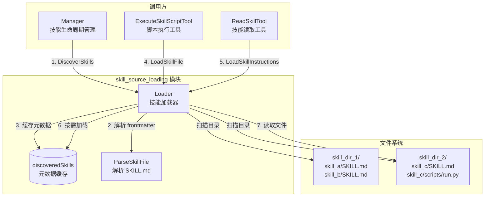

# skill_source_loading 模块技术深度解析

## 概述：为什么需要这个模块

想象你正在运营一个大型图书馆。馆内有成千上万本书（**Skills**），但读者（**Agent**）每次只需要查阅其中几本。如果在每天开馆时就把所有书都从书架上搬下来摊开在桌子上，不仅启动缓慢，而且浪费大量内存和 I/O 资源。

`skill_source_loading` 模块解决的就是这个问题：**如何高效地从文件系统加载和管理 Agent 的 "技能" 定义**。

这里的 "技能" 是指 Agent 可以执行的能力包，每个技能是一个目录，包含：
- `SKILL.md`：核心定义文件，含 YAML frontmatter（元数据）和 Markdown 正文（执行指令）
- 可选的辅助文件：脚本（`.py`、`.sh` 等）、表单模板、配置文件等

该模块的核心设计洞察是 **渐进式披露（Progressive Disclosure）**：
1. **Level 1**：启动时只读取元数据（名称、描述），构建"卡片目录"
2. **Level 2**：当 Agent 真正需要执行某个技能时，才加载完整指令
3. **Level 3**：当技能需要执行脚本时，才按需加载具体文件

这种设计避免了"全量加载"的浪费，同时通过缓存机制保证重复访问的性能。

---

## 架构与数据流



### 组件角色说明

| 组件 | 职责 | 类比 |
|------|------|------|
| `Loader` | 技能发现与加载的核心协调器 | 图书管理员，管理卡片目录并按需取书 |
| `discoveredSkills` | 内存缓存，存储已发现的技能 | 卡片目录柜 |
| `ParseSkillFile` | 解析 SKILL.md 的 frontmatter 和正文 | 书籍编目员 |
| `Manager` | 调用 Loader，管理技能的生命周期和权限 | 图书馆馆长，决定哪些书可以借阅 |
| `ExecuteSkillScriptTool` / `ReadSkillTool` | Agent 工具，通过 Manager 间接使用 Loader | 读者 |

### 数据流追踪

**场景 1：系统启动时的技能发现**
```
Manager 初始化
    → Loader.DiscoverSkills()
        → 遍历所有配置的 skillDirs
            → 对每个子目录，检查是否存在 SKILL.md
                → 调用 ParseSkillFile() 解析 frontmatter
                    → 提取 Name, Description
                    → 创建 Skill 对象（Loaded=false）
                → 缓存到 discoveredSkills[skill.Name]
                → 返回 SkillMetadata
        → 聚合所有目录的元数据
    → Manager 存储 metadataCache
```

**场景 2：Agent 需要执行技能脚本**
```
ExecuteSkillScriptTool.Execute()
    → Manager.GetSkillBasePath(skillName)
        → Loader.GetSkillBasePath()
            → 检查 discoveredSkills 缓存
            → 若未加载，调用 LoadSkillInstructions()
                → 遍历 skillDirs 查找技能目录
                → 读取完整 SKILL.md
                → 调用 ParseSkillFile() 解析正文
                → 设置 Loaded=true
            → 返回绝对路径（用于沙箱执行）
    → Manager.LoadSkillFile(skillName, "scripts/run.py")
        → Loader.LoadSkillFile()
            → 路径安全检查（防止目录穿越）
            → 读取文件内容
            → 返回 SkillFile{Path, Content, IsScript=true}
    → 沙箱执行脚本
```

---

## 核心组件深度解析

### Loader：技能加载的核心协调器

**设计意图**：`Loader` 是模块的"门面"，封装了所有文件系统操作和解析逻辑。它采用 **惰性加载（Lazy Loading）** 模式，只有在真正需要时才读取完整内容。

**关键方法**：

#### `DiscoverSkills() []*SkillMetadata`
这是系统启动时的"轻量级扫描"。它只读取每个 `SKILL.md` 的 YAML frontmatter 部分，提取 `name` 和 `description` 字段。

```go
// 内部实现逻辑
for _, dir := range l.skillDirs {
    entries, _ := os.ReadDir(dir)
    for _, entry := range entries {
        if entry.IsDir() {
            skillFile := filepath.Join(dir, entry.Name(), "SKILL.md")
            content, _ := os.ReadFile(skillFile)
            skill, _ := ParseSkillFile(content)  // 解析 frontmatter
            l.discoveredSkills[skill.Name] = skill  // 缓存完整对象
            metadata = append(metadata, skill.ToMetadata())
        }
    }
}
```

**为什么这样设计**：
- **性能考量**：frontmatter 通常只有几行，而正文可能包含大量指令。启动时只读 frontmatter 可将初始化时间从秒级降到毫秒级。
- **内存效率**：元数据对象比完整技能对象小一个数量级，适合长期驻留内存。
- **容错性**：单个技能解析失败不会阻塞整个系统（`continue` 跳过错误）。

#### `LoadSkillInstructions(skillName string) *Skill`
这是 Level 2 加载的入口。它首先检查缓存，若技能已存在但 `Loaded=false`，则读取完整正文。

**关键设计点**：
- **缓存优先**：避免重复 I/O
- **多目录搜索**：技能可能分布在多个目录中（如系统技能 vs 用户自定义技能）
- **双重查找策略**：先尝试 `dir/skillName/SKILL.md` 快速匹配，失败后再全目录扫描（支持技能名与目录名不一致的情况）

#### `LoadSkillFile(skillName, relativePath string) *SkillFile`
这是 Level 3 加载，用于获取技能的辅助文件（如脚本）。

**安全机制**（关键！）：
```go
cleanPath := filepath.Clean(relativePath)

// 防止路径穿越攻击
if strings.HasPrefix(cleanPath, "..") || filepath.IsAbs(cleanPath) {
    return nil, fmt.Errorf("invalid file path: %s", relativePath)
}

// 验证解析后的路径仍在技能目录内
absSkillPath, _ := filepath.Abs(skill.BasePath)
absFilePath, _ := filepath.Abs(fullPath)
if !strings.HasPrefix(absFilePath, absSkillPath) {
    return nil, fmt.Errorf("file path outside skill directory: %s", relativePath)
}
```

**为什么需要双重检查**：
- `filepath.Clean()` 会规范化路径（如 `a/../b` → `b`），但攻击者可能构造 `../../etc/passwd` 这样的路径
- 即使通过 `Clean()`，仍需验证最终路径是否在技能目录前缀内（防止符号链接等边界情况）
- 这是典型的 **纵深防御（Defense in Depth）** 策略

#### `Reload() []*SkillMetadata`
清空缓存并重新发现所有技能。用于热重载场景（如用户新增技能后无需重启服务）。

**注意**：此操作会丢弃所有已加载的 Level 2/3 数据，下次访问时需重新加载。

---

### Skill / SkillMetadata / SkillFile：数据模型

#### `Skill` 结构
```go
type Skill struct {
    Name        string  // 来自 YAML frontmatter
    Description string  // 来自 YAML frontmatter
    BasePath    string  // 技能目录的绝对路径
    FilePath    string  // SKILL.md 的绝对路径
    Instructions string // Markdown 正文（Level 2 加载后填充）
    Loaded      bool    // 标记是否已加载正文
}
```

**设计意图**：
- `Loaded` 字段是惰性加载的关键标记，区分"已发现"和"已加载"状态
- `BasePath` 和 `FilePath` 始终存储绝对路径，避免后续使用时反复转换
- `Instructions` 延迟加载，节省内存

#### `SkillMetadata` 结构
```go
type SkillMetadata struct {
    Name        string
    Description string
    BasePath    string  // 用于后续按需加载
}
```

这是 `Skill.ToMetadata()` 的返回值，仅包含 Level 1 信息。`Manager` 使用它向 Agent 展示可用技能列表。

#### `SkillFile` 结构
```go
type SkillFile struct {
    Name     string  // 相对路径（如 "scripts/validate.py"）
    Path     string  // 绝对路径（用于沙箱执行）
    Content  string  // 文件内容
    IsScript bool    // 根据扩展名判断是否可执行
}
```

**`IsScript` 判断逻辑**：
```go
func IsScript(path string) bool {
    ext := strings.ToLower(filepath.Ext(path))
    scriptExtensions := map[string]bool{
        ".py": true, ".sh": true, ".bash": true,
        ".js": true, ".ts": true, ".rb": true,
        ".pl": true, ".php": true,
    }
    return scriptExtensions[ext]
}
```

**为什么需要这个标记**：
- 沙箱执行器需要区分"可执行脚本"和"普通文本文件"
- 避免用户误将配置文件当作脚本执行
- 扩展名白名单机制防止意外执行未知类型文件

---

### ParseSkillFile：SKILL.md 解析器

**输入格式**：
```markdown
---
name: data_analysis
description: 执行数据分析和可视化
---

# 技能指令

当用户请求数据分析时：
1. 首先确认数据源...
2. 调用 scripts/analyze.py...
```

**解析逻辑**：
1. 验证以 `---` 开头
2. 扫描找到第二个 `---`，其间为 YAML frontmatter
3. 使用 `yaml.Unmarshal()` 解析 frontmatter 到 `Skill` 结构
4. 剩余内容为 `Instructions`
5. 调用 `skill.Validate()` 验证必填字段

**设计权衡**：
- **选择 YAML frontmatter 而非 JSON**：Markdown 文件更易读，frontmatter 是静态站点生成器（如 Hugo、Jekyll）的成熟模式，开发者熟悉
- **严格验证**：缺少 `name` 或 frontmatter 格式错误会导致解析失败，防止"静默失败"导致的运行时错误

---

## 依赖关系分析

### 调用方（上游依赖）

| 组件 | 调用方式 | 期望行为 |
|------|----------|----------|
| [`Manager`](skill_lifecycle_management.md) | `DiscoverSkills()`, `LoadSkillInstructions()`, `LoadSkillFile()` | 期望 Loader 处理所有文件系统细节，返回立即可用的数据 |
| `ExecuteSkillScriptTool` | 通过 `Manager.LoadSkillFile()` | 期望获得脚本的绝对路径和内容，用于沙箱执行 |
| `ReadSkillTool` | 通过 `Manager.LoadSkillInstructions()` | 期望获得技能的完整指令，用于展示给用户 |

**关键契约**：
- `Loader` 返回的路径必须是绝对路径（沙箱执行要求）
- 路径安全检查必须在 `Loader` 层完成，调用方不应重复验证
- 缓存一致性：`Reload()` 后，所有旧缓存失效

### 被调用方（下游依赖）

| 组件 | 被调用方式 | 依赖假设 |
|------|----------|----------|
| `os` 标准库 | `ReadFile()`, `ReadDir()`, `Stat()` | 假设文件系统可用，权限正确 |
| `filepath` 标准库 | `Join()`, `Clean()`, `Abs()`, `Rel()` | 假设路径操作符合 OS 规范 |
| `yaml` 库 | `Unmarshal()` | 假设 frontmatter 是合法 YAML |
| [`Skill.Validate()`](skill_definition_models.md) | 解析后验证 | 假设技能元数据符合业务规则 |

**耦合点**：
- `Loader` 紧耦合于文件系统布局（`SKILL.md` 命名、目录结构）
- 若未来支持从数据库或远程加载技能，需引入抽象层（如 `SkillSource` 接口）

---

## 设计决策与权衡

### 1. 渐进式加载 vs 全量加载

**选择**：渐进式加载（Level 1/2/3）

**理由**：
- 技能数量可能达到数十个，每个技能的指令可能数千行
- Agent 会话通常只使用少数几个技能
- 启动时间敏感（尤其是容器化部署场景）

**代价**：
- 代码复杂度增加（需要管理 `Loaded` 状态）
- 首次访问某技能时有额外延迟（但可接受）

### 2. 多目录支持 vs 单一技能源

**选择**：支持多个 `skillDirs`

**理由**：
- 系统技能（内置）和用户技能（自定义）需要隔离
- 便于插件化扩展（第三方技能包可挂载到独立目录）
- 支持 A/B 测试（不同目录加载不同技能版本）

**代价**：
- 同名技能的处理策略不明确（当前实现：后扫描的覆盖先扫描的）
- 需要文档说明目录优先级

### 3. 文件系统存储 vs 数据库存储

**选择**：文件系统

**理由**：
- 技能定义本质是"代码"，适合版本控制（Git）
- 便于开发者本地调试（直接编辑 `.md` 文件）
- 无需额外的数据库 schema 和迁移

**代价**：
- 不支持动态技能（需重启或调用 `Reload()`）
- 分布式部署时需确保所有节点文件一致（通常通过共享存储或镜像解决）

### 4. 路径安全：纵深防御

**选择**：双重检查（`Clean()` + 前缀验证）

**理由**：
- 技能可能执行任意脚本，若允许目录穿越，攻击者可读取 `/etc/passwd` 等敏感文件
- 单一检查可能被绕过（如符号链接、Unicode 混淆）

**代价**：
- 代码稍显冗长
- 在 Windows 和 Linux 上的路径行为差异需测试（当前假设类 Unix 环境）

### 5. 错误处理：静默跳过 vs 严格失败

**选择**：混合策略
- `DiscoverSkills()`：单个技能解析失败 → 记录日志并跳过（保证系统可用）
- `LoadSkillInstructions()`：指定技能不存在 → 返回错误（调用方需明确处理）

**理由**：
- 启动时应容忍部分技能损坏（可能是开发中技能）
- 运行时请求特定技能失败应明确报错（避免 Agent 使用错误技能）

---

## 使用指南与示例

### 基本使用模式

```go
// 1. 创建 Loader，配置技能搜索目录
loader := skills.NewLoader([]string{
    "/app/system-skills",   // 系统内置技能
    "/app/user-skills",     // 用户自定义技能
})

// 2. 启动时发现所有技能（Level 1）
metadata, err := loader.DiscoverSkills()
if err != nil {
    log.Printf("部分技能发现失败：%v", err)
}
for _, m := range metadata {
    fmt.Printf("可用技能：%s - %s\n", m.Name, m.Description)
}

// 3. 按需加载技能指令（Level 2）
skill, err := loader.LoadSkillInstructions("data_analysis")
if err != nil {
    return fmt.Errorf("技能不存在：%w", err)
}
fmt.Println(skill.Instructions)  // 完整指令

// 4. 加载技能脚本（Level 3）
scriptFile, err := loader.LoadSkillFile("data_analysis", "scripts/analyze.py")
if err != nil {
    return fmt.Errorf("脚本加载失败：%w", err)
}
if scriptFile.IsScript {
    // 发送到沙箱执行
    executeInSandbox(scriptFile.Path, scriptFile.Content)
}

// 5. 热重载（可选）
newMetadata, err := loader.Reload()
```

### 技能目录结构示例

```
/app/user-skills/
├── data_analysis/
│   ├── SKILL.md              # 必需：技能定义
│   ├── scripts/
│   │   ├── analyze.py        # 可选：Python 脚本
│   │   └── visualize.sh      # 可选：Shell 脚本
│   └── forms/
│       └── report_template.md # 可选：表单模板
└── web_search/
    ├── SKILL.md
    └── config.json           # 可选：配置文件
```

### SKILL.md 格式规范

```markdown
---
name: unique_skill_name      # 必需：唯一标识符
description: 一句话描述       # 必需：用于展示
---

# 技能指令正文

这里是 Markdown 格式的指令，Agent 会阅读并遵循这些指令。

## 使用示例

当用户请求 X 时：
1. 调用 scripts/process.py
2. 读取 forms/output.md
3. 返回结果
```

---

## 边界情况与注意事项

### 1. 路径穿越攻击防护

**风险场景**：
```go
// 恶意技能尝试读取系统文件
loader.LoadSkillFile("malicious", "../../etc/passwd")
loader.LoadSkillFile("malicious", "scripts/../../../etc/passwd")
```

**防护措施**：
- `filepath.Clean()` 规范化路径
- 检查是否以 `..` 开头
- 检查是否为绝对路径
- 验证最终路径是否在技能目录前缀内

**测试建议**：
```go
// 应返回错误
loader.LoadSkillFile("skill", "../other_skill/script.py")
loader.LoadSkillFile("skill", "/etc/passwd")
loader.LoadSkillFile("skill", "scripts/../../etc/passwd")

// 应成功
loader.LoadSkillFile("skill", "scripts/run.py")
loader.LoadSkillFile("skill", "forms/../scripts/run.py")  // Clean 后合法
```

### 2. 缓存一致性问题

**问题**：`Reload()` 后，`Manager` 的 `metadataCache` 可能未同步更新。

**当前实现**：`Manager.Reload()` 会调用 `loader.Reload()` 并更新自己的缓存。

**注意事项**：
- 调用 `Reload()` 后，之前获取的 `SkillMetadata` 可能失效
- 长时间运行的服务应定期调用 `Reload()` 或提供管理 API 触发重载

### 3. 并发访问安全

**当前实现**：`Loader` 本身**不是线程安全**的。

**原因**：`discoveredSkills` map 无锁保护，并发读写会 panic。

**解决方案**：
- `Manager` 层通过 `sync.RWMutex` 保护对 `Loader` 的调用
- 若直接在多 goroutine 中使用 `Loader`，需自行加锁

```go
// Manager 的实现示例
func (m *Manager) LoadSkillInstructions(name string) (*Skill, error) {
    m.mu.RLock()
    defer m.mu.RUnlock()
    return m.loader.LoadSkillInstructions(name)
}
```

### 4. 文件系统权限问题

**风险**：技能目录权限不足导致加载失败。

**表现**：`DiscoverSkills()` 静默跳过，`LoadSkillInstructions()` 返回错误。

**建议**：
- 启动时检查所有配置的 `skillDirs` 是否可读
- 记录详细日志（当前实现只返回错误，未记录具体路径）

### 5. 技能命名冲突

**当前行为**：若多个目录存在同名技能，后扫描的目录会覆盖先扫描的。

**风险**：用户可能意外覆盖系统技能。

**建议**：
- 文档明确目录优先级（如：用户目录优先于系统目录）
- 或改为返回错误，要求技能名全局唯一

### 6. SKILL.md 格式错误

**解析失败场景**：
- 缺少 YAML frontmatter
- frontmatter 未正确闭合（缺少结束 `---`）
- YAML 语法错误
- 缺少必填字段（`name`、`description`）

**当前行为**：`ParseSkillFile()` 返回错误，`DiscoverSkills()` 跳过该技能。

**建议**：
- 提供技能验证工具（CLI 命令）
- 在 CI/CD 中验证技能文件格式

---

## 相关模块参考

- [skill_lifecycle_management.md](skill_lifecycle_management.md)：`Manager` 如何使用 `Loader` 管理技能生命周期
- [skill_definition_models.md](skill_definition_models.md)：`Skill`、`SkillMetadata`、`SkillFile` 的完整定义
- [skill_execution_tool.md](skill_execution_tool.md)：`ExecuteSkillScriptTool` 如何执行技能脚本
- [skill_reading_tool.md](skill_reading_tool.md)：`ReadSkillTool` 如何读取技能指令
- [sandbox_execution_and_script_safety.md](sandbox_execution_and_script_safety.md)：沙箱如何安全执行技能脚本

---

## 总结

`skill_source_loading` 模块是 Agent 技能系统的"地基"，它通过**渐进式加载**和**纵深防御**两个核心设计原则，在性能、安全性和可维护性之间取得了平衡。

**核心洞察**：
1. 技能加载应遵循"按需加载"原则，避免启动时的资源浪费
2. 文件系统操作必须严格验证路径，防止安全漏洞
3. 错误处理应区分"发现阶段"（容忍失败）和"使用阶段"（严格失败）

**扩展方向**：
- 支持从远程源（如 Git 仓库、对象存储）加载技能
- 增加技能版本管理（同一技能的多个版本共存）
- 提供技能依赖声明和自动加载机制
