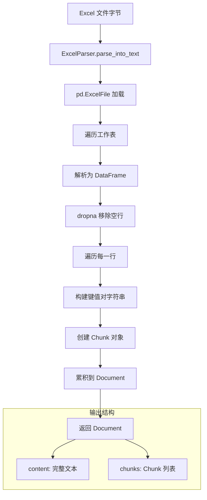

# Spreadsheet Workbook Parsing 模块深度解析

## 模块概述

想象你有一个装满表格的 Excel 文件 —— 可能是销售数据、用户信息、或者产品清单。这个模块的任务就是把这些结构化的表格数据"翻译"成下游检索系统能够理解的文本格式。`spreadsheet_workbook_parsing` 模块的核心职责是解析 Excel 工作簿（`.xlsx` 和 `.xls` 格式），将每个工作表中的每一行数据转换为带有位置追踪的文本块（Chunk），最终组装成一个完整的 `Document` 对象。

为什么需要专门的 Excel 解析器？ naive 的做法可能是直接把整个文件转成 CSV 然后按固定长度切分，但这样会破坏表格的语义结构 —— 一行数据可能被切成两半，列名和值的对应关系会丢失。本模块的设计洞察是：**表格的最小语义单元是"行"，而不是"字符"或"字节"**。因此，解析器以行为粒度创建 Chunk，每行内部保持"列名：值"的键值对格式，这样下游的向量检索系统才能在检索时保持数据的完整性。

## 架构与数据流



数据流动的过程可以类比为一个**装配流水线**：原始字节进入流水线后，首先被"拆解"成工作表（Sheet），每个工作表被"压平"成 DataFrame，然后每一行被"封装"成一个独立的 Chunk，最后所有 Chunk 被"打包"进 Document。这个设计的关键在于**位置追踪** —— 每个 Chunk 都记录自己在完整文本中的 `start` 和 `end` 偏移量，这样当检索系统返回某个 Chunk 时，可以精确定位它在原文中的位置。

从依赖关系来看，`ExcelParser` 位于 `docreader` 解析器框架的**格式特定解析器**层，它继承自 [`BaseParser`](docreader/parser/base_parser.py) 抽象基类，与 [`CSVParser`](docreader/parser/csv_parser.py) 并列处理结构化表格数据。它调用的外部依赖只有 `pandas`，返回的是框架标准的 `Document` 和 `Chunk` 模型，这使得它可以无缝插入到整个文档处理流水线中。

## 核心组件深度解析

### ExcelParser 类

**设计意图**：`ExcelParser` 存在的意义是提供一个**语义感知**的 Excel 解析方案。与通用文本解析器不同，它理解 Excel 的二维表格结构，并能够将这种结构映射到一维的文本表示，同时保留足够的元数据供下游使用。

**内部机制**：解析过程分为三个层次：

1. **工作簿层**：使用 `pandas.ExcelFile` 加载整个工作簿，获取所有工作表的名称列表。这一步是惰性的 —— pandas 不会立即加载所有数据，而是建立文件索引。

2. **工作表层**：遍历每个工作表，调用 `excel_file.parse()` 将其转换为 DataFrame。这里有一个关键操作：`df.dropna(how="all")` 会移除所有值都是 NaN 的行。这个设计决策是为了过滤掉 Excel 中常见的"视觉空行"（用户为了格式美观插入的空白行），避免产生无意义的 Chunk。

3. **行层**：对 DataFrame 的每一行，遍历所有列，跳过 NaN 值，将非空值格式化为 `"列名：值"` 的字符串，然后用逗号连接。这个格式选择很有讲究 —— 逗号作为分隔符既保持了可读性，又便于后续用正则表达式还原结构。

**参数与返回值**：
- 输入：`content: bytes` —— Excel 文件的原始字节
- 输出：`Document` 对象，包含：
  - `content`：所有工作表所有行的完整文本拼接
  - `chunks`：Chunk 列表，每个 Chunk 对应一行数据

**副作用**：该方法本身是纯函数式的，不修改外部状态。但它依赖 pandas 的内部缓存机制，对于超大文件可能会有内存压力。

**关键代码片段分析**：

```python
for _, row in df.iterrows():
    page_content = []
    for k, v in row.items():
        if pd.notna(v):  # 跳过 NaN/null 值
            page_content.append(f"{k}: {v}")
    
    if not page_content:
        continue
    
    content_row = ",".join(page_content) + "\n"
    end += len(content_row)
    text.append(content_row)
    
    chunks.append(
        Chunk(content=content_row, seq=len(chunks), start=start, end=end)
    )
    start = end
```

这段代码体现了几个设计细节：
- `pd.notna(v)` 检查确保不会把空值写入文本（否则会出现 `"Age: nan"` 这种无意义输出）
- `seq=len(chunks)` 保证 Chunk 的序号是全局连续的，跨工作表也保持递增
- `start` 和 `end` 的累加计算确保位置追踪的准确性，这对于后续的**高亮显示**和**引用定位**功能至关重要

### 与 BaseParser 的继承关系

`ExcelParser` 继承自 `BaseParser`，但**只重写了 `parse_into_text` 方法**。父类提供的 `parse` 方法包含了一个重要的回退逻辑：如果 `parse_into_text` 返回的 Document 没有 chunks，会调用 `TextSplitter` 按固定长度重新切分。对于 Excel 解析器来说，这个回退几乎不会触发，因为每行都会生成一个 Chunk。

父类还提供了多模态处理能力（OCR、图片描述），但 `ExcelParser` 在 `parse` 方法中会跳过这些处理 —— Excel 文件类型不在 `allowed_types` 列表中。这是一个合理的设计：Excel 中的图片通常是嵌入式对象，而不是 Markdown 格式的外链图片，需要专门的提取逻辑。

## 依赖分析

### 上游依赖（谁调用它）

`ExcelParser` 通常由文档 ingestion 流程中的**解析器工厂**或**路由逻辑**调用。虽然当前代码中没有显示工厂类，但从 `docreader` 的整体架构来看，调用模式应该是：

```
文件上传 → 检测文件类型 → 选择对应 Parser → 调用 parse() → 得到 Document → 存入知识库
```

调用者期望的契约是：任何 Parser 都接受 `bytes` 输入，返回 `Document` 输出。`ExcelParser` 完全遵守这个契约，这使得它可以被透明地替换或扩展。

### 下游依赖（它调用谁）

| 依赖 | 用途 | 耦合程度 |
|------|------|----------|
| `pandas.ExcelFile` | 加载 Excel 工作簿 | 强耦合 —— 核心解析逻辑依赖 |
| `pandas.DataFrame` | 表示工作表数据 | 强耦合 —— 行遍历依赖 |
| `docreader.models.document.Document` | 返回结果容器 | 中耦合 —— 遵循框架标准 |
| `docreader.models.document.Chunk` | 创建文本块 | 中耦合 —— 遵循框架标准 |
| `docreader.parser.base_parser.BaseParser` | 继承基类 | 中耦合 —— 需要遵守抽象方法签名 |

**数据契约**：
- 输入契约：`content` 必须是有效的 Excel 文件字节（`.xlsx` 或 `.xls` 格式）。如果传入损坏的文件或非 Excel 格式，pandas 会抛出异常，但 `ExcelParser` 本身没有做格式验证或错误包装。
- 输出契约：返回的 `Document` 必须满足 `Document.is_valid()` 检查（即 `content != ""`）。如果 Excel 文件全是空行，`content` 会是空字符串，这可能导致下游逻辑认为解析失败。

###  hottest 路径

对于典型的 Excel 文件，最频繁执行的代码路径是：
```
df.iterrows() → row.items() → pd.notna() → Chunk 创建
```

这意味着性能瓶颈通常在 `iterrows()` 遍历上。对于万行级别的大表，这个循环会成为热点。pandas 官方推荐使用 `itertuples()` 或向量化操作来优化，但当前实现选择了可读性优先。

## 设计决策与权衡

### 行级 Chunk vs 表级 Chunk

**选择**：每行创建一个 Chunk，而不是整个工作表一个 Chunk。

**权衡**：
- **优点**：检索粒度更细，用户可以精确找到某一行数据；向量嵌入更准确，因为每行语义更聚焦；支持分页和增量处理。
- **缺点**：Chunk 数量可能爆炸（一个 1000 行的表会产生 1000 个 Chunk）；跨行的上下文关系丢失（比如某行引用了上一行的值）。

**为什么这样选**：在知识检索场景中，用户更可能问"张三的年龄是多少"，而不是"整个表格的内容是什么"。行级 Chunk 让检索系统能够直接返回包含答案的那一行，而不是返回整个表格让用户自己找。

### 键值对格式 vs CSV 格式

**选择**：使用 `"列名：值 1，列名：值 2"` 格式，而不是原始 CSV 格式。

**权衡**：
- **优点**：列名和值的对应关系显式化，即使列顺序变化也不会混淆；对 LLM 更友好，因为格式接近自然语言。
- **缺点**：文本长度增加（重复列名）；如果列名本身包含逗号或冒号，会产生歧义。

**为什么这样选**：下游的向量模型和 LLM 对结构化文本的理解能力有限。`"Name: John, Age: 30"` 比 `"John,30"` 更容易被正确嵌入和检索。

### 静默跳过空行 vs 保留空行占位

**选择**：使用 `dropna(how="all")` 移除全空行，行内部分空值则直接跳过该列。

**权衡**：
- **优点**：减少无意义的 Chunk，降低存储和检索成本；避免检索结果中出现空白内容。
- **缺点**：丢失了原始表格的行号信息；如果用户依赖行号定位，会产生偏差。

**为什么这样选**：在知识检索场景中，行号通常没有语义意义。用户关心的是数据内容，而不是"第几行"。如果确实需要行号，可以在 `metadata` 中添加。

### 同步解析 vs 异步解析

**选择**：使用同步的 `parse_into_text` 方法，而不是异步。

**权衡**：
- **优点**：实现简单，与 pandas 的同步 API 匹配；对于中小文件，同步开销可以接受。
- **缺点**：大文件会阻塞调用线程；无法利用异步并发处理多个文件。

**为什么这样选**：pandas 本身是同步库，强行包装成异步不会带来性能提升。对于大文件，更好的方案是在调用层使用线程池或进程池。

## 使用指南与示例

### 基本用法

```python
from docreader.parser.excel_parser import ExcelParser

# 创建解析器实例
parser = ExcelParser()

# 读取并解析 Excel 文件
with open("sales_data.xlsx", "rb") as f:
    content = f.read()
    document = parser.parse_into_text(content)

# 访问完整文本
print(document.content)

# 遍历所有 Chunk
for chunk in document.chunks:
    print(f"Chunk {chunk.seq}: {chunk.content}")
    print(f"  位置：[{chunk.start}:{chunk.end}]")
```

### 与 BaseParser.parse() 方法配合

```python
# 使用父类的 parse() 方法，可以触发额外的后处理逻辑
document = parser.parse(content)

# 如果启用了多模态，会处理 Chunk 中的图片（但 Excel 通常没有）
# 如果 Chunk 数量为 0，会自动调用 TextSplitter 重新切分
```

### 配置 Chunk 元数据

当前实现没有使用 `Chunk.metadata` 字段，但扩展时可以添加：

```python
# 扩展示例（伪代码）
chunks.append(
    Chunk(
        content=content_row,
        seq=len(chunks),
        start=start,
        end=end,
        metadata={
            "sheet_name": excel_sheet_name,
            "row_index": _,
            "source_file": parser.file_name,
        }
    )
)
```

这样在检索结果中可以显示数据来源的工作表名称和行号。

## 边界情况与陷阱

### 1. 空文件或全空工作表

**行为**：如果 Excel 文件没有任何数据行，`document.content` 会是空字符串，`document.chunks` 会是空列表。

**影响**：`Document.is_valid()` 返回 `False`，调用 `BaseParser.parse()` 时会触发 `TextSplitter` 回退，但切分空字符串也没有意义。

**建议**：在调用解析器之前，先检查文件大小或解析后检查 `document.is_valid()`。

### 2. 超大文件内存压力

**行为**：`pd.ExcelFile` 会在工作簿加载时建立索引，但 `parse()` 会一次性加载整个工作表到内存。对于百万行级别的表，可能导致 OOM。

**建议**：
- 使用 `chunksize` 参数分块读取（需要修改当前实现）
- 在调用层限制上传文件的大小
- 对于已知的大表，预处理为 CSV 格式

### 3. 特殊字符处理

**行为**：列名或值中包含逗号、冒号、换行符时，当前实现不会转义。

**示例问题**：
```
列名："Name, Age"
值："John, Jr."
输出："Name, Age: John, Jr."  # 难以解析回原始结构
```

**建议**：如果下游需要还原结构，应该使用更安全的序列化格式（如 JSON）或添加转义逻辑。

### 4. 数据类型丢失

**行为**：所有值都被转换为字符串。日期、数字、布尔值的原始类型信息丢失。

**示例**：
```
Excel 中：2024-01-01 (日期类型)
输出："Date: 2024-01-01" (字符串)
```

**影响**：如果下游需要按日期范围过滤，无法直接从 Chunk 中提取。

**建议**：在 `metadata` 中保留原始类型信息，或提供类型感知的格式化选项。

### 5. 多工作表的顺序依赖

**行为**：工作表按 `excel_file.sheet_names` 的顺序处理，这个顺序是 Excel 文件中定义的。

**陷阱**：如果用户期望按字母顺序或特定顺序处理，当前实现不保证。

**建议**：如果需要控制顺序，可以在遍历前对 `sheet_names` 排序。

### 6. NaN 值的边界情况

**行为**：`pd.notna(v)` 会过滤掉 pandas 的 NaN，但某些"空值"可能不是 NaN（如空字符串 `""`）。

**示例**：
```
Excel 中：单元格显示为空，但实际是公式返回 ""
行为：会被保留为 "Column: " 而不是跳过
```

**建议**：如果需要更严格的空值过滤，可以添加 `and str(v).strip() != ""` 检查。

## 扩展点

### 添加工作表级 Chunk

如果需要保留工作表边界的上下文，可以在工作表切换时插入一个特殊的 Chunk：

```python
if excel_sheet_name != previous_sheet:
    chunks.append(
        Chunk(
            content=f"=== Sheet: {excel_sheet_name} ===\n",
            seq=len(chunks),
            start=start,
            end=end,
            metadata={"type": "sheet_header"}
        )
    )
```

### 添加列类型推断

可以在解析时推断每列的数据类型，并在 metadata 中记录：

```python
for k, v in row.items():
    if pd.notna(v):
        dtype = type(v).__name__
        page_content.append(f"{k}: {v}")
        # 在 metadata 中记录类型
```

### 支持公式解析

当前实现只解析计算后的值，不保留公式。如果需要公式信息，可以使用 `openpyxl` 库直接读取 `.xlsx` 的 XML 结构。

## 相关模块参考

- [`BaseParser`](docreader/parser/base_parser.md)：解析器基类，定义了 `parse_into_text` 抽象方法和通用的多模态处理逻辑
- [`CSVParser`](docreader/parser/csv_parser.md)：类似的表格解析器，处理 CSV 格式，可以对比两者的设计差异
- [`Document` 和 `Chunk` 模型](docreader/models/document.md)：解析器的输出契约，理解这些模型有助于正确使用解析结果
- [`TextSplitter`](docreader/splitter/)：当解析器无法产生有效 Chunk 时的回退切分策略

## 总结

`spreadsheet_workbook_parsing` 模块是一个**语义感知**的表格解析器，它的设计哲学是"保持数据的结构完整性，同时适配一维文本检索系统"。核心设计决策——行级 Chunk、键值对格式、空行过滤——都是在这个目标下的权衡结果。对于新贡献者，理解这些权衡比记住 API 签名更重要，因为当你需要修改或扩展这个模块时，这些设计意图会指导你做出与系统整体架构一致的选择。
