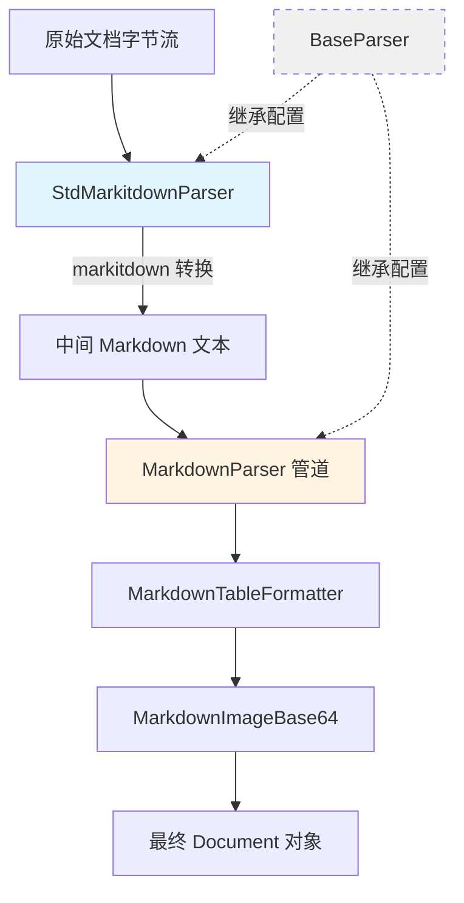

# Standard MarkItDown Parser Implementation

## 概述：为什么需要这个模块

想象你有一个"万能文档转换器"的需求：用户上传的文件格式五花八门 —— Word 文档、PPT 演示文稿、PDF、Excel 表格，甚至网页快照。每种格式都有自己的解析库和 API，如果为每种格式单独写解析器，代码会迅速膨胀成一座难以维护的"巴别塔"。

`standard_markitdown_parser_implementation` 模块的核心洞察是：**与其为每种格式重复造轮子，不如借助一个成熟的通用转换库作为"前端"，再在其输出之上做针对性的后处理**。这个模块正是这一思路的产物 —— 它封装了 `markitdown` 库，将其转换为各种文档格式的能力统一成一个符合系统规范的解析器接口，然后通过管道模式（Pipeline Pattern）串联后续的 Markdown 后处理器，形成一条完整的解析流水线。

简单来说，这个模块回答了一个问题：**如何让系统用一套统一的接口处理几十种文档格式，同时保留对输出质量进行精细化控制的能力？**

---

## 架构与数据流



### 组件角色说明

| 组件 | 职责 | 设计意图 |
|------|------|----------|
| `StdMarkitdownParser` | 调用 `markitdown` 库将任意格式文档转换为 Markdown 文本 | 作为"格式归一化器"，将异构输入收敛为统一的 Markdown 中间表示 |
| `MarkitdownParser` | 管道解析器，串联 `StdMarkitdownParser` 和 `MarkdownParser` | 体现"分阶段处理"思想：先粗转换，再精加工 |
| `MarkdownParser` | 对 Markdown 文本进行表格标准化、图片提取等后处理 | 弥补通用库在特定场景下的不足，提升输出质量 |

### 数据流动路径

1. **输入阶段**：原始字节流（如 `.docx` 文件内容）进入 `MarkitdownParser.parse_into_text()`
2. **第一级转换**：`StdMarkitdownParser` 调用 `markitdown.convert()`，输出原始 Markdown 文本
3. **管道传递**：文本被编码回字节流，传递给管道中的下一个解析器
4. **第二级处理**：`MarkdownParser` 内部的 `MarkdownTableFormatter` 和 `MarkdownImageBase64` 依次处理
5. **输出一阶段**：返回 `Document` 对象，包含处理后的文本和图片映射
6. **后续处理**：`BaseParser.parse()` 方法会对 `Document` 进行分块（chunking）和多模态图片处理

---

## 核心组件深度解析

### StdMarkitdownParser：通用格式转换的"适配器"

#### 设计意图

`StdMarkitdownParser` 的本质是一个**适配器模式**的实现。`markitdown` 库本身是一个功能强大的文档转换工具，但它有自己的 API 风格和返回格式。这个类的作用是：
1. 将 `markitdown` 的接口"翻译"成系统统一的 `BaseParser` 接口
2. 继承 `BaseParser` 提供的分块、图片处理、OCR 等通用能力
3. 保持极简实现，让异常由上层 `PipelineParser` 统一捕获和处理

#### 关键实现细节

```python
def __init__(self, *args, **kwargs):
    super().__init__(*args, **kwargs)
    self.markitdown = MarkItDown()
```

这里的 `super()` 调用至关重要 —— 它确保 `file_type`、`chunk_size`、`enable_multimodal` 等配置从 `BaseParser` 正确继承。这意味着 `StdMarkitdownParser` 虽然自身不实现分块逻辑，但它可以无缝接入整个解析器生态。

```python
def parse_into_text(self, content: bytes) -> Document:
    ext = self.file_type
    if ext and not ext.startswith('.'):
        ext = '.' + ext
    
    result = self.markitdown.convert(
        io.BytesIO(content),
        file_extension=ext,
        keep_data_uris=True
    )
    return Document(content=result.text_content)
```

**值得注意的设计选择**：
- **移除 try-catch**：代码注释明确说明"让异常由上层 PipelineParser 统一捕获"。这是一种**故障边界上移**的策略 —— 底层解析器不尝试"修复"错误，而是让管道协调者决定是重试、降级还是报错。
- **`keep_data_uris=True`**：保留内嵌的 base64 图片数据，为后续的 `MarkdownImageBase64` 处理器提供输入。
- **文件类型提示**：通过 `file_extension` 参数帮助 `markitdown` 选择正确的解析后端，这在文件格式与扩展名不匹配时尤为重要。

#### 参数与返回值

| 参数 | 来源 | 用途 |
|------|------|------|
| `content: bytes` | 调用方传入 | 原始文档字节流 |
| `self.file_type` | `BaseParser.__init__` | 文件扩展名，用于提示 `markitdown` 选择解析器 |

| 返回值 | 类型 | 说明 |
|--------|------|------|
| `Document` | `docreader.models.document.Document` | 包含 `content`（文本）和 `images`（图片映射）的文档对象 |

---

### MarkitdownParser：管道模式的"编排者"

#### 设计意图

`MarkitdownParser` 不是一个独立的解析器，而是一个**管道编排器**。它继承自 `PipelineParser`，通过声明 `_parser_cls = (StdMarkitdownParser, MarkdownParser)` 来定义处理流水线。

这种设计体现了**关注点分离**原则：
- `StdMarkitdownParser` 负责"粗转换" —— 把任意格式变成 Markdown
- `MarkdownParser` 负责"精加工" —— 标准化表格、提取图片、修复格式问题

#### 管道工作机制

`PipelineParser.parse_into_text()` 的核心逻辑如下：

```python
def parse_into_text(self, content: bytes) -> Document:
    images: Dict[str, str] = {}
    document = Document()
    for p in self._parsers:
        document = p.parse_into_text(content)
        content = endecode.encode_bytes(document.content)  # 文本 → 字节流
        images.update(document.images)  # 累积图片
    document.images.update(images)
    return document
```

**关键洞察**：
1. **字节流作为管道介质**：每个解析器的输出被编码回字节流，再传给下一个解析器。这保证了管道中所有解析器使用统一的接口，即使它们内部处理的是文本。
2. **图片累积合并**：每个解析器可能提取不同的图片，管道负责将所有图片映射合并到最终文档中。
3. **顺序敏感性**：解析器的执行顺序由 `_parser_cls` 元组定义，先执行的解析器输出是后执行解析器的输入。

#### 扩展点

`PipelineParser` 提供了工厂方法 `create()`，允许动态创建自定义管道：

```python
CustomParser = PipelineParser.create(PreprocessParser, MarkdownParser, PostParser)
parser = CustomParser()
```

这意味着你可以在不修改现有代码的情况下，通过组合不同的解析器类来创建新的处理流水线。

---

## 依赖关系分析

### 上游依赖（被谁调用）

`MarkitdownParser` 通常被以下组件调用：

1. **解析器路由逻辑**：根据文件扩展名选择对应的解析器实例
2. **知识入库服务**：[`knowledge_ingestion_orchestration`](../application_services_and_orchestration.md#knowledge_ingestion_orchestration) 模块在导入文档时调用解析器
3. **文档提取服务**：[`document_extraction_and_table_summarization`](../application_services_and_orchestration.md#document_extraction_and_table_summarization) 使用解析器提取文本内容

### 下游依赖（调用谁）

| 被调用组件 | 用途 | 耦合强度 |
|-----------|------|----------|
| `markitdown.MarkItDown` | 核心转换引擎 | 强耦合 —— 替换需重写 `StdMarkitdownParser` |
| `BaseParser` | 继承配置和通用方法 | 强耦合 —— 依赖其初始化和分块逻辑 |
| `MarkdownParser` | 后处理管道 | 中耦合 —— 可替换为其他 Markdown 处理器 |
| `Document` | 返回类型 | 弱耦合 —— 仅依赖其构造函数 |

### 数据契约

**输入契约**：
- `content: bytes` —— 任意格式的原始文档字节流
- `file_type: str` —— 文件扩展名（如 `.docx`），从 `BaseParser` 继承

**输出契约**：
- `Document.content: str` —— 解析后的 Markdown 文本
- `Document.images: Dict[str, str]` —— 图片 URL 到图片数据的映射
- `Document.chunks: List[Chunk]` —— 如果调用了 `parse()` 而非 `parse_into_text()`，则包含分块结果

---

## 设计决策与权衡

### 1. 为什么使用管道模式而非单一解析器？

**选择**：采用 `PipelineParser` 串联多个解析器

**权衡分析**：
- **优点**：
  - 每个解析器职责单一，易于测试和维护
  - 可以灵活调整处理顺序或替换某个阶段的实现
  - 图片等中间结果可以在管道中累积，避免重复提取
- **缺点**：
  - 文本需要在解析器之间反复编码/解码，有性能开销
  - 管道越长，调试越困难（需要追踪每一阶段的输出）

**适用场景**：当解析过程可以清晰地分为多个独立阶段，且每个阶段可能需要独立演进时，管道模式是合适的选择。

### 2. 为什么 `StdMarkitdownParser` 不捕获异常？

**选择**：移除 try-catch，让 `PipelineParser` 统一处理

**权衡分析**：
- **优点**：
  - 避免底层解析器"吞掉"重要错误信息
  - 管道协调者可以根据错误类型决定重试、降级或报错
  - 符合"快速失败"原则，便于问题定位
- **缺点**：
  - 如果管道中没有统一的异常处理，错误会直接抛给调用方

**设计意图**：这是一种**故障边界上移**的策略，将错误处理的责任交给更了解上下文的组件。

### 3. 为什么文本在管道中以字节流形式传递？

**选择**：`content = endecode.encode_bytes(document.content)`

**权衡分析**：
- **优点**：
  - 统一接口 —— 所有解析器都接收 `bytes`，返回 `Document`
  - 兼容二进制解析器（如某些需要直接操作文件头的解析器）
- **缺点**：
  - 文本解析器之间传递字节流需要额外的编码/解码开销
  - 可能引入编码问题（如 UTF-8 与非 UTF-8 混用）

**替代方案**：可以设计一个纯文本管道，但会失去对二进制解析器的支持。

### 4. 为什么 `keep_data_uris=True`？

**选择**：保留 `markitdown` 输出中的 base64 内嵌图片

**权衡分析**：
- **优点**：
  - 避免图片信息在转换过程中丢失
  - 为后续的 `MarkdownImageBase64` 处理器提供输入
- **缺点**：
  - 输出文本可能包含大量 base64 字符串，增加内存占用

**设计意图**：这是一种"先保留，后处理"的策略 —— 先完整保留所有信息，再由专门的处理器决定如何处置（如上传到对象存储、替换为 URL 等）。

---

## 使用指南与示例

### 基本用法

```python
from docreader.parser.markitdown_parser import MarkitdownParser

# 创建解析器实例
parser = MarkitdownParser(
    file_name="document.docx",
    file_type=".docx",
    chunk_size=1000,
    chunk_overlap=200,
    enable_multimodal=True
)

# 读取文件内容
with open("document.docx", "rb") as f:
    content = f.read()

# 解析为 Document 对象（包含分块）
document = parser.parse(content)

# 访问解析结果
print(f"文本长度：{len(document.content)}")
print(f"分块数量：{len(document.chunks)}")
print(f"图片数量：{len(document.images)}")
```

### 仅提取文本（不分块）

```python
# 如果只需要文本内容，调用 parse_into_text()
document = parser.parse_into_text(content)
# document.chunks 将为空列表
```

### 自定义管道

```python
from docreader.parser.chain_parser import PipelineParser
from docreader.parser.markitdown_parser import StdMarkitdownParser, MarkdownTableFormatter

# 创建只包含表格格式化的简化管道
CustomParser = PipelineParser.create(StdMarkitdownParser, MarkdownTableFormatter)
parser = CustomParser(file_type=".pptx")
```

### 配置多模态处理

```python
from docreader.models.read_config import ChunkingConfig, VLMConfig

# 配置 VLM 用于图片描述生成
vlm_config = VLMConfig(model="qwen-vl-max", api_key="...")
chunking_config = ChunkingConfig(
    chunk_size=500,
    vlm_config=vlm_config
)

parser = MarkitdownParser(
    file_type=".pdf",
    enable_multimodal=True,
    chunking_config=chunking_config,
    max_concurrent_tasks=10  # 并发处理图片
)
```

---

## 边界情况与注意事项

### 1. 文件格式与扩展名不匹配

`markitdown` 依赖 `file_extension` 参数选择解析后端。如果用户上传的文件扩展名与实际格式不符（如将 `.pdf` 重命名为 `.docx`），可能导致解析失败或输出乱码。

**建议**：在调用解析器前，使用文件头检测（magic number）验证文件格式。

### 2. 大文件的内存占用

`markitdown.convert()` 会将整个文档加载到内存中。对于数百 MB 的 PDF 或 PPT 文件，可能导致内存溢出。

**建议**：
- 设置文件大小上限，在解析前进行检查
- 对于超大文件，考虑使用流式解析或分页处理

### 3. 图片处理的并发控制

`BaseParser` 中的 `max_concurrent_tasks` 参数控制图片 OCR 和 caption 生成的并发度。设置过高可能导致：
- 外部 API（如 VLM 服务）速率限制
- 本地资源（CPU/内存）耗尽

**建议**：根据部署环境的资源和外部服务的 QPS 限制调整此参数。

### 4. 异常处理策略

`StdMarkitdownParser` 不捕获异常，这意味着：
- `markitdown` 的内部错误会直接抛出
- 管道中某个解析器失败会导致整个管道中断

**建议**：在调用解析器的上层代码中实现重试和降级逻辑，例如：
```python
try:
    document = parser.parse(content)
except MarkItDownException:
    # 降级到纯文本解析器
    document = TextParser().parse(content)
```

### 5. 编码问题

管道中 `content = endecode.encode_bytes(document.content)` 使用默认编码（通常是 UTF-8）。如果 `markitdown` 输出包含非 UTF-8 字符，可能导致编码错误。

**建议**：检查 `endecode.encode_bytes()` 的实现，确保它正确处理各种编码边界情况。

---

## 相关模块参考

- [parser_framework_and_orchestration](parser_framework_and_orchestration.md) —— 解析器框架和管道编排的通用抽象
- [format_specific_parsers](format_specific_parsers.md) —— 其他格式专用解析器（PDF、Word、Excel 等）
- [document_models_and_chunking_support](document_models_and_chunking_support.md) —— `Document` 和 `Chunk` 数据模型
- [knowledge_ingestion_orchestration](knowledge_ingestion_orchestration.md) —— 知识入库服务，解析器的主要调用方
