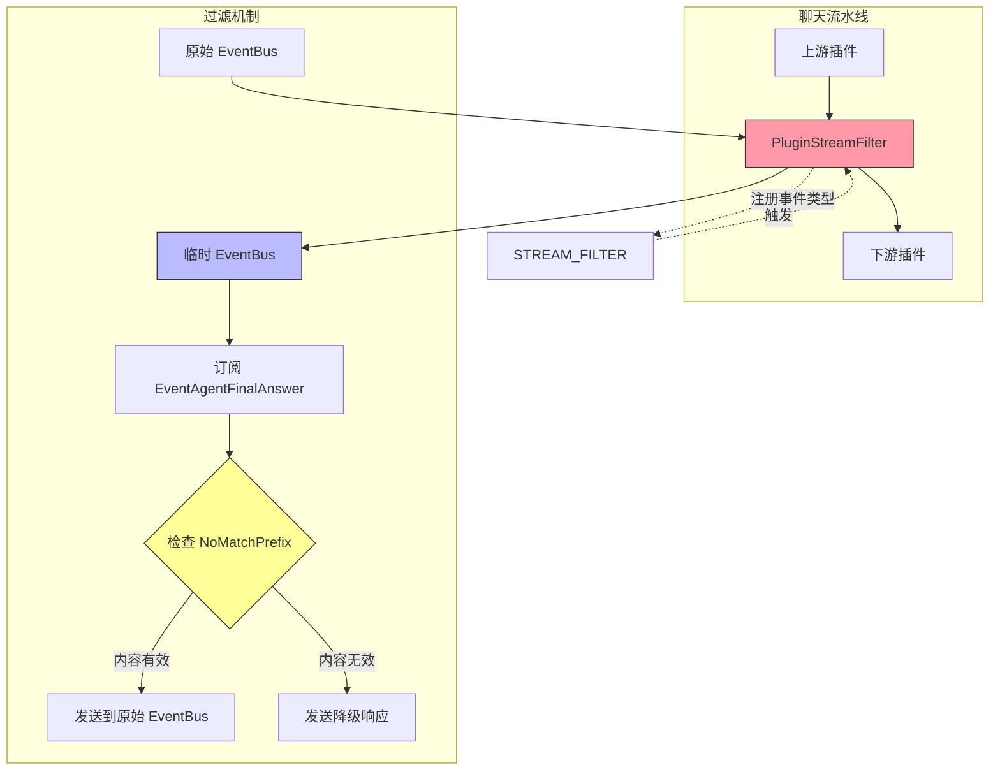

# Stream Output Filtering 模块深度解析

## 概述：为什么需要流式输出过滤？

想象你正在观看一场直播，但主播偶尔会说一些"测试测试"或者"让我想想"这样的开场白 —— 这些内容对观众来说毫无价值，甚至会造成困扰。在 LLM 驱动的对话系统中，我们面临类似的问题：模型生成的流式响应可能包含某些需要过滤的前缀内容（比如特定的错误提示、调试信息或不符合业务规范的输出）。

`stream_output_filtering` 模块正是解决这个问题的"内容过滤器"。它位于聊天流水线的响应组装阶段，在 LLM 生成流式响应后、将内容推送给客户端之前，对输出进行实时拦截和过滤。核心设计洞察是：**流式过滤不能简单地丢弃数据，而是需要智能地判断哪些内容应该透传，哪些需要被替换为降级响应**。

该模块通过一个精巧的"临时事件总线拦截"模式实现这一目标 —— 它不直接修改原始数据流，而是创建一个中间层来观察和决策，这种设计既保持了流水线的解耦，又提供了灵活的过滤能力。

---

## 架构与数据流



### 架构角色解析

`PluginStreamFilter` 在聊天流水线中扮演**守门人**的角色。它不是内容的生产者或消费者，而是一个**转换器** —— 接收上游的流式事件，根据配置规则决定是原样透传、过滤后转发，还是替换为降级响应。

数据流的关键路径如下：

1. **事件触发**：流水线执行到流式过滤阶段时，触发 `STREAM_FILTER` 事件类型
2. **配置检查**：插件检查 `ChatManage.SummaryConfig.NoMatchPrefix` 是否配置
3. **分支决策**：
   - 无过滤配置 → 直接调用 `next()` 透传
   - 有过滤配置 → 进入拦截模式
4. **拦截模式**：
   - 创建临时 EventBus 替换原始 EventBus
   - 订阅 `EventAgentFinalAnswer` 事件
   - 调用 `next()` 触发下游插件执行（事件发送到临时总线）
   - 在事件回调中检查内容是否匹配前缀
   - 有效内容 → 转发到原始 EventBus
   - 无效内容 → 发送降级响应 (`FallbackResponse`)
5. **恢复现场**：将原始 EventBus 恢复到 `ChatManage`

这种设计的精妙之处在于**拦截而不侵入** —— 插件不需要知道下游插件如何生成事件，只需要控制事件总线的路由即可。

---

## 核心组件深度解析

### PluginStreamFilter

**设计目的**：实现可插拔的流式输出过滤能力，作为聊天流水线的一个标准插件存在。

#### 内部机制

`PluginStreamFilter` 采用**无状态设计**，所有过滤逻辑都依赖于运行时传入的 `ChatManage` 上下文。这种设计使得插件可以在多个会话间复用，不会因状态污染导致并发问题。

核心方法 `OnEvent` 的执行流程：

```go
func (p *PluginStreamFilter) OnEvent(ctx context.Context,
    eventType types.EventType, chatManage *types.ChatManage, next func() *PluginError,
) *PluginError
```

这个方法遵循流水线的标准插件接口：
- `ctx`：请求上下文，用于日志追踪和超时控制
- `eventType`：触发事件类型（此处固定为 `STREAM_FILTER`）
- `chatManage`：会话管理上下文，包含 EventBus、SummaryConfig 等关键状态
- `next`：调用下一个插件的函数，是流水线链式执行的关键

**关键设计决策**：为什么 `next` 是一个函数而不是直接执行？

这是**惰性执行**模式的体现。插件可以在调用 `next()` 前后分别执行预处理和后处理逻辑。在流式过滤场景中，插件需要在调用 `next()` 之前设置临时 EventBus，在调用之后检查是否需要发送降级响应。

#### 过滤逻辑详解

`filterEventsWithPrefix` 方法是模块的核心，其实现了一个**事件拦截器模式**：

```go
func (p *PluginStreamFilter) filterEventsWithPrefix(
    ctx context.Context,
    chatManage *types.ChatManage,
    originalEventBus types.EventBusInterface,
    next func() *PluginError,
) *PluginError
```

**工作原理**：

1. **创建临时总线**：`tempEventBus := event.NewEventBus()`
   
   这一步是设计的精髓。通过替换 `chatManage.EventBus`，所有下游插件发出的事件都会发送到临时总线，而不是直接发送给客户端。这相当于在数据流中插入了一个"观察点"。

2. **订阅答案事件**：
   
   ```go
   tempEventBus.On(event.EventAgentFinalAnswer, func(ctx context.Context, evt event.Event) error {
       data, ok := evt.Data.(event.AgentFinalAnswerData)
       // ... 过滤逻辑
   })
   ```
   
   这里只订阅 `EventAgentFinalAnswer` 事件类型，因为这是 LLM 生成最终答案的事件。其他事件（如思考过程、工具调用）不需要过滤，会自然被忽略。

3. **前缀匹配判断**：
   
   ```go
   if !strings.HasPrefix(chatManage.SummaryConfig.NoMatchPrefix, responseBuilder.String()) {
       // 内容有效，转发
   }
   ```
   
   注意这里的逻辑是**反向匹配**：如果累积的内容**不以** `NoMatchPrefix` 开头，则认为是有效内容。这意味着 `NoMatchPrefix` 实际上是一个"无效前缀"标记 —— 如果输出以这个前缀开头，说明触发了某种错误条件。

4. **降级响应机制**：
   
   ```go
   if !matchFound && responseBuilder.Len() > 0 {
       originalEventBus.Emit(ctx, types.Event{
           Data: event.AgentFinalAnswerData{
               Content: chatManage.FallbackResponse,
               Done:    true,
           },
       })
   }
   ```
   
   当所有内容都被过滤掉时，系统不会返回空响应，而是发送一个预配置的降级响应。这是**防御性编程**的体现 —— 确保客户端始终收到有意义的响应。

#### 参数与返回值

| 参数 | 类型 | 说明 |
|------|------|------|
| `ctx` | `context.Context` | 请求上下文，携带追踪信息和超时控制 |
| `eventType` | `types.EventType` | 事件类型，此处固定为 `STREAM_FILTER` |
| `chatManage` | `*types.ChatManage` | 会话管理上下文，包含过滤配置和事件总线 |
| `next` | `func() *PluginError` | 调用下一个插件的函数 |

**返回值**：`*PluginError` —— 插件执行错误，遵循流水线的统一错误处理协议。

#### 副作用

- 修改 `chatManage.EventBus`（临时替换，执行后恢复）
- 向 `originalEventBus` 发送过滤后的事件
- 可能发送降级响应事件

---

## 依赖关系分析

### 上游依赖（谁调用它）

`PluginStreamFilter` 被聊天流水线的**事件管理系统**调用。具体来说：

- **调用者**：[`EventManager`](chat_pipeline_plugins_and_flow.md)（位于 `chat_pipeline_plugins_and_flow` 模块）
- **调用时机**：流水线执行到流式过滤阶段时
- **期望行为**：插件应快速完成过滤决策，不阻塞整体流水线

### 下游依赖（它调用谁）

| 依赖组件 | 所属模块 | 用途 |
|----------|----------|------|
| `types.EventBusInterface` | [core_domain_types_and_interfaces](core_domain_types_and_interfaces.md) | 事件发送接口，用于转发过滤后的事件 |
| `event.EventBus` / `event.NewEventBus()` | [platform_infrastructure_and_runtime](platform_infrastructure_and_runtime.md) | 临时事件总线实现 |
| `event.EventAgentFinalAnswer` | [platform_infrastructure_and_runtime](platform_infrastructure_and_runtime.md) | 答案事件类型常量 |
| `types.ChatManage` | [core_domain_types_and_interfaces](core_domain_types_and_interfaces.md) | 会话上下文，携带过滤配置 |
| `types.STREAM_FILTER` | [core_domain_types_and_interfaces](core_domain_types_and_interfaces.md) | 插件激活事件类型 |

### 数据契约

**输入契约**：
- `ChatManage.SummaryConfig.NoMatchPrefix`：过滤前缀配置（空字符串表示不过滤）
- `ChatManage.EventBus`：原始事件总线（必须存在）
- `ChatManage.FallbackResponse`：降级响应内容
- `ChatManage.SessionID`：会话标识（用于日志追踪）

**输出契约**：
- 有效内容：向原始 EventBus 发送 `EventAgentFinalAnswer` 事件，`Data.Content` 为过滤后的内容
- 无效内容：向原始 EventBus 发送 `EventAgentFinalAnswer` 事件，`Data.Content` 为 `FallbackResponse`，`Data.Done` 为 `true`

**隐式契约**：
- 插件必须在调用 `next()` 后恢复 `chatManage.EventBus`，否则会影响后续插件
- 事件回调中不应返回错误（当前实现忽略类型断言失败的情况）

---

## 设计决策与权衡

### 1. 临时 EventBus vs 直接拦截

**选择**：使用临时 EventBus 进行拦截

**替代方案**：直接订阅原始 EventBus，在回调中决定是否转发

**权衡分析**：

| 方案 | 优点 | 缺点 |
|------|------|------|
| 临时 EventBus | 下游插件无感知，代码侵入性低 | 需要创建额外对象，增加内存开销 |
| 直接拦截 | 实现简单，无额外对象 | 需要在回调中做转发决策，逻辑分散 |

**为什么选择临时 EventBus**：这种设计遵循了**关注点分离**原则。过滤插件只需要关心"哪些事件应该通过"，而不需要关心"下游插件如何生成事件"。如果未来需要添加更多过滤规则，只需修改拦截逻辑，不需要改动下游插件。

### 2. 前缀匹配 vs 正则/语义匹配

**选择**：简单的字符串前缀匹配 (`strings.HasPrefix`)

**替代方案**：正则表达式匹配、语义相似度判断

**权衡分析**：

当前选择体现了**YAGNI（You Ain't Gonna Need It）**原则。前缀匹配足以处理常见的错误提示场景（如"抱歉，我无法回答"、"发生错误"等），且性能最优。如果未来需要更复杂的过滤规则，可以通过扩展 `SummaryConfig` 添加新的过滤策略字段。

**潜在风险**：如果错误提示的格式发生变化，或者需要过滤中间内容而非前缀，当前实现将无法满足需求。

### 3. 同步过滤 vs 异步流式过滤

**选择**：同步过滤（等待所有内容累积后再决策）

**替代方案**：真正的流式过滤（逐字符/逐块判断）

**权衡分析**：

当前实现实际上是**伪流式**的 —— 它订阅事件后累积所有内容，在事件回调结束时才做决策。这意味着客户端会感受到额外的延迟，因为需要等待完整响应。

**为什么这样设计**：前缀过滤的本质决定了需要看到完整的前缀才能做决策。如果 `NoMatchPrefix` 是"抱歉"，而响应是"抱歉，我无法..."，逐块过滤会导致前半部分已经发送给客户端，后半部分被过滤，造成响应不完整。

**改进空间**：如果性能成为瓶颈，可以考虑：
- 设置前缀检查的最大长度阈值
- 使用流式字符串匹配算法（如 KMP）提前判断

### 4. 降级响应 vs 空响应

**选择**：发送预配置的降级响应

**替代方案**：不发送任何事件，让客户端超时

**权衡分析**：

选择降级响应是**用户体验优先**的体现。空响应会导致客户端不确定是网络问题还是内容被过滤，而降级响应明确告知用户"已处理但无有效内容"。

**配置建议**：`FallbackResponse` 应该友好且信息丰富，例如："抱歉，我暂时无法提供相关信息，请稍后再试。"

---

## 使用指南与示例

### 启用流式过滤

流式过滤通过 `SummaryConfig.NoMatchPrefix` 配置启用：

```go
// 在会话初始化时配置
chatManage := &types.ChatManage{
    SessionID: "session-123",
    EventBus:  eventBus,
    SummaryConfig: types.SummaryConfig{
        NoMatchPrefix: "抱歉，我无法",  // 以此开头的响应将被过滤
    },
    FallbackResponse: "我暂时无法回答这个问题，您可以尝试换个问法。",
}
```

### 插件注册

插件在流水线初始化时自动注册：

```go
eventManager := NewEventManager()
streamFilter := NewPluginStreamFilter(eventManager)
// 插件已注册，无需额外操作
```

### 典型使用场景

**场景 1：过滤错误提示**

```go
// 配置：过滤所有以"错误"开头的响应
NoMatchPrefix = "错误"
FallbackResponse = "处理您的请求时遇到了一些问题，请稍后重试。"
```

**场景 2：过滤调试信息**

```go
// 配置：过滤开发环境的调试前缀
NoMatchPrefix = "[DEBUG]"
FallbackResponse = ""  // 空降级响应，相当于静默过滤
```

**场景 3：禁用过滤**

```go
// 配置：空字符串表示不过滤
NoMatchPrefix = ""
// 插件将直接调用 next()，不执行任何过滤逻辑
```

---

## 边界情况与注意事项

### 1. EventBus 缺失

**问题**：如果 `chatManage.EventBus` 为 `nil`，插件会返回错误。

**处理**：
```go
if chatManage.EventBus == nil {
    return ErrModelCall.WithError(errors.New("EventBus is required for stream filtering"))
}
```

**注意事项**：确保在调用插件之前正确初始化 EventBus。这通常由流水线的初始化阶段保证。

### 2. 事件数据类型不匹配

**问题**：订阅回调中进行类型断言 `evt.Data.(event.AgentFinalAnswerData)`，如果类型不匹配会静默忽略。

**风险**：如果事件数据结构发生变化，过滤逻辑会失效但不会报错。

**建议**：在生产环境中添加日志记录类型断言失败的情况：
```go
data, ok := evt.Data.(event.AgentFinalAnswerData)
if !ok {
    pipelineError(ctx, "StreamFilter", "type_assertion_failed", ...)
    return nil
}
```

### 3. 并发安全问题

**问题**：多个请求同时执行时，`chatManage.EventBus` 的临时替换是否安全？

**分析**：每个请求有独立的 `chatManage` 实例，因此不存在并发修改问题。但需确保 `ChatManage` 不在请求间复用。

### 4. 长响应性能

**问题**：`strings.Builder` 累积长响应时可能消耗较多内存。

**建议**：对于超长响应，考虑：
- 设置最大累积长度限制
- 使用流式前缀检查（检查到一定长度后即可判断）

### 5. 前缀配置陷阱

**陷阱 1**：前缀过长导致误判
```go
// 不推荐：前缀过长，可能因响应截断导致误过滤
NoMatchPrefix = "抱歉，由于各种原因，我无法回答您的问题"
```

**陷阱 2**：前缀过短导致过度过滤
```go
// 不推荐：前缀过短，可能过滤掉正常内容
NoMatchPrefix = "我"  // 正常响应"我认为..."也会被过滤
```

**建议**：前缀应该是明确的错误标识，长度在 2-10 个字符之间。

---

## 扩展点

### 添加新的过滤策略

当前实现只支持前缀过滤。如需支持其他策略，可以：

1. 在 `SummaryConfig` 中添加新的过滤配置字段
2. 在 `OnEvent` 中根据配置选择过滤策略
3. 提取过滤策略为独立接口，便于扩展

```go
type FilterStrategy interface {
    ShouldPass(content string) bool
}

// 示例：正则过滤策略
type RegexFilterStrategy struct {
    pattern *regexp.Regexp
}

func (s *RegexFilterStrategy) ShouldPass(content string) bool {
    return !s.pattern.MatchString(content)
}
```

### 支持多前缀过滤

当前只支持单个前缀。如需支持多个前缀：

```go
// 修改配置
type SummaryConfig struct {
    NoMatchPrefixes []string  // 改为切片
}

// 修改判断逻辑
func matchesAnyPrefix(content string, prefixes []string) bool {
    for _, prefix := range prefixes {
        if strings.HasPrefix(content, prefix) {
            return true
        }
    }
    return false
}
```

---

## 相关模块参考

- [chat_pipeline_plugins_and_flow](chat_pipeline_plugins_and_flow.md) — 插件流水线的整体架构和事件管理
- [core_domain_types_and_interfaces](core_domain_types_and_interfaces.md) — `ChatManage`、`SummaryConfig`、`EventBusInterface` 等类型定义
- [platform_infrastructure_and_runtime](platform_infrastructure_and_runtime.md) — `EventBus` 实现和事件数据类型

---

## 总结

`stream_output_filtering` 模块是一个小而精的过滤器，体现了以下设计原则：

1. **拦截而不侵入** — 通过临时 EventBus 实现非侵入式拦截
2. **防御性编程** — 始终确保有响应（降级响应机制）
3. **配置驱动** — 通过 `NoMatchPrefix` 灵活控制过滤行为
4. **关注点分离** — 过滤逻辑与内容生成逻辑完全解耦

理解这个模块的关键是把握它的**架构角色**：它不是内容的生产者，而是内容的守门人。它的存在确保了流式输出的质量和一致性，是聊天流水线中不可或缺的质量保障环节。
