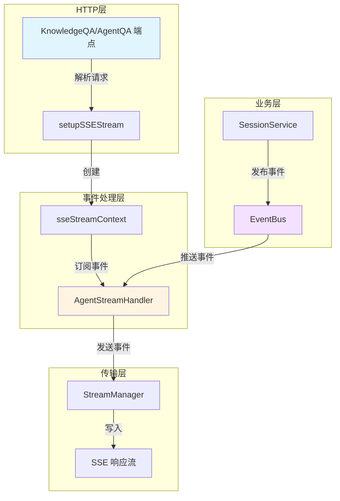

# Streaming Endpoints and SSE Context 模块

## 1. 模块概述

想象一下，你正在观看一场足球比赛的直播，解说员实时地向你传递比赛的每个精彩瞬间：球员的思考、传球的轨迹、进球的庆祝。这正是 `streaming_endpoints_and_sse_context` 模块在系统中扮演的角色——它是连接后端智能代理与前端用户体验的实时"解说员"。

这个模块解决了一个核心问题：**如何将智能代理的复杂推理过程、工具调用和最终结果以低延迟、用户友好的方式实时推送给前端**。在传统的请求-响应模式中，用户需要等待整个处理过程完成才能看到结果，这对于复杂的 Agent 交互来说体验极差。而通过 Server-Sent Events (SSE) 技术，这个模块能够让用户"看到" AI 的思考过程。

### 核心价值
- **实时性**：用户无需等待完整响应，即可看到 AI 的思考过程
- **可观测性**：完整暴露 Agent 的推理链条、工具调用和引用来源
- **容错性**：每个请求使用独立的 EventBus，避免会话间干扰
- **状态管理**：精确跟踪事件持续时间、知识引用和最终答案

## 2. 架构设计

### 2.1 核心组件关系图



### 2.2 架构详解

这个模块的架构采用了**事件驱动的分层设计**，从上到下可以分为四个层次：

1. **HTTP 端点层**：由 `KnowledgeQA` 和 `AgentQA` 等处理器组成，负责接收请求、解析参数、初始化上下文
2. **SSE 上下文层**：由 `sseStreamContext` 管理，负责设置 SSE 响应头、创建独立的 EventBus、管理异步生命周期
3. **事件处理层**：由 `AgentStreamHandler` 实现，负责订阅和转换各种 Agent 事件为 SSE 格式
4. **流传输层**：通过 `StreamManager` 接口将事件写入 HTTP 响应流

### 2.3 关键设计决策

#### 2.3.1 每个请求使用独立的 EventBus

**选择**：为每个 SSE 流式请求创建一个专用的 `EventBus` 实例，而不是使用全局 EventBus 加上 SessionID 过滤。

**为什么这么做**：
- **隔离性**：不同请求的事件完全隔离，不会相互干扰
- **性能**：无需在每个事件处理时进行 SessionID 匹配，减少了开销
- **简洁性**：代码逻辑更清晰，订阅者只需关注自己关心的事件

**权衡**：
- 增加了内存占用（每个请求一个 EventBus），但对于请求生命周期来说是可接受的
- 需要确保 EventBus 的正确清理，避免资源泄漏

#### 2.3.2 事件块直接转发，不累积

**选择**：`AgentStreamHandler` 接收到事件块后立即转发给前端，由前端负责按事件 ID 累积完整内容。

**为什么这么做**：
- **低延迟**：用户可以立即看到部分内容，而不是等待完整响应
- **内存效率**：后端无需在内存中保存完整的事件历史
- **容错性**：如果连接中断，前端可以根据已接收的部分进行恢复

**权衡**：
- 前端需要实现更复杂的事件累积逻辑
- 需要确保事件 ID 的一致性和顺序性

#### 2.3.3 双轨上下文管理

**选择**：区分 `reqCtx.ctx`（原始请求上下文）和 `streamCtx.asyncCtx`（异步处理上下文），并在使用共享 Agent 时注入 `effectiveTenantID`。

**为什么这么做**：
- **生命周期解耦**：即使 HTTP 请求上下文已完成，异步处理仍可继续（如标题生成）
- **多租户隔离**：共享 Agent 时使用源租户的上下文进行模型/知识库/MCP 解析
- **正确性保证**：消息更新时使用会话所属的租户 ID，而非有效租户 ID

**权衡**：
- 增加了上下文管理的复杂度
- 需要仔细考虑在何处使用哪个上下文

## 3. 核心组件详解

本模块包含两个主要子模块，每个子模块负责特定的功能领域：

- [Agent Streaming Endpoint Handler](http_handlers_and_routing-session_message_and_streaming_http_handlers-streaming_endpoints_and_sse_context-agent_streaming_endpoint_handler.md)：负责 Agent 事件的处理和转换
- [SSE Stream Runtime Context](http_handlers_and_routing-session_message_and_streaming_http_handlers-streaming_endpoints_and_sse_context-sse_stream_runtime_context.md)：负责 SSE 流的上下文管理和生命周期

### 3.1 AgentStreamHandler

`AgentStreamHandler` 是整个模块的核心，它像一个"翻译官"，将内部的 Agent 事件转换为前端可以理解的 SSE 事件格式。

#### 主要职责：
1. **事件订阅**：订阅专用 EventBus 上的所有 Agent 相关事件
2. **状态跟踪**：记录知识引用、最终答案、事件开始时间等状态
3. **事件转换**：将内部事件数据转换为标准的 SSE 流事件
4. **元数据增强**：添加事件持续时间、完成时间等元数据

#### 关键实现细节：

**事件持续时间追踪**：
```go
// 记录事件开始时间
if _, exists := h.eventStartTimes[evt.ID]; !exists {
    h.eventStartTimes[evt.ID] = time.Now()
}

// 计算持续时间（当事件完成时）
if data.Done {
    startTime := h.eventStartTimes[evt.ID]
    duration := time.Since(startTime)
    metadata = map[string]interface{}{
        "event_id":     evt.ID,
        "duration_ms":  duration.Milliseconds(),
        "completed_at": time.Now().Unix(),
    }
    delete(h.eventStartTimes, evt.ID)
}
```

这种设计让前端可以显示每个思考步骤或工具调用花费的时间，提供了更好的可观测性。

**知识引用累积**：
与思考和答案事件不同，知识引用事件需要在后端累积，因为：
1. 最终的 `assistantMessage` 需要保存完整的引用列表
2. 前端可能需要完整的引用列表来进行展示和跳转
3. 引用事件可能分多次到达，需要合并

### 3.2 sseStreamContext

`sseStreamContext` 是 SSE 流式响应的"指挥中心"，它负责协调异步处理、事件总线和响应流之间的交互。

#### 主要职责：
1. **SSE 协议设置**：设置正确的 HTTP 响应头
2. **异步上下文管理**：创建可取消的异步上下文
3. **EventBus 生命周期**：管理专用 EventBus 的创建和清理
4. **停止事件处理**：设置中断请求的处理机制

#### 关键实现细节：

**有效租户上下文注入**：
```go
// 当使用共享 Agent 时，使用源租户的上下文进行模型/KB/MCP 解析
baseCtx := reqCtx.ctx
if reqCtx.effectiveTenantID != 0 && h.tenantService != nil {
    if tenant, err := h.tenantService.GetTenantByID(reqCtx.ctx, reqCtx.effectiveTenantID); err == nil && tenant != nil {
        baseCtx = context.WithValue(
            context.WithValue(reqCtx.ctx, types.TenantIDContextKey, reqCtx.effectiveTenantID),
            types.TenantInfoContextKey, tenant)
    }
}
```

这个设计解决了共享 Agent 场景下的多租户资源访问问题，确保使用正确的租户权限来访问模型、知识库和 MCP 服务。

## 4. 数据流分析

让我们通过一个完整的 AgentQA 请求来追踪数据的流动：

### 4.1 正常流程

1. **请求接收**：
   - 用户发送 `POST /sessions/{session_id}/agent-qa` 请求
   - `AgentQA` 处理器调用 `parseQARequest` 解析请求
   - 创建 `qaRequestContext`，包含会话、查询、Agent 配置等信息

2. **SSE  setup**：
   - `setupSSEStream` 设置 SSE 响应头
   - 创建专用的 `EventBus` 和可取消的 `asyncCtx`
   - 初始化 `AgentStreamHandler` 并订阅事件
   - 如果需要，启动异步标题生成

3. **异步执行**：
   - 在 goroutine 中调用 `sessionService.AgentQA`
   - Agent 开始处理，发布各种事件到 EventBus

4. **事件流转**：
   ```
   Agent 处理 → EventBus 发布 → AgentStreamHandler 订阅 → 转换为 StreamEvent → StreamManager.AppendEvent → SSE 响应流
   ```

5. **完成处理**：
   - Agent 发布 `EventAgentComplete` 事件
   - `handleComplete` 更新 `assistantMessage` 状态
   - 发送完成事件到前端
   - SSE 处理器检测到完成事件，关闭响应流

### 4.2 关键事件类型

| 事件类型 | 触发时机 | 前端展示 |
|---------|---------|---------|
| `EventAgentThought` | Agent 思考过程中 | 实时显示思考内容 |
| `EventAgentToolCall` | Agent 调用工具前 | 显示工具名称和参数 |
| `EventAgentToolResult` | 工具执行完成后 | 显示工具结果或错误 |
| `EventAgentReferences` | 检索到知识引用时 | 更新引用列表 |
| `EventAgentFinalAnswer` | 生成最终答案时 | 实时显示答案内容 |
| `EventAgentComplete` | 整个流程完成 | 显示总步数和耗时 |

## 5. 设计权衡与思考

### 5.1 实时性 vs 可靠性

**选择**：优先保证实时性，事件立即发送，不等待确认。

**理由**：
- 对于聊天场景，实时性比可靠性更重要
- 即使丢失个别事件，用户体验仍可接受
- 完整的对话历史会保存在数据库中，可通过刷新获取

**替代方案**：
可以实现事件确认和重传机制，但会增加复杂度和延迟，对于当前场景来说得不偿失。

### 5.2 专用 EventBus vs 全局 EventBus

如前所述，选择了专用 EventBus，这是一个**隔离性优于资源效率**的决策。

**如果选择全局 EventBus**：
- 优点：资源占用更少，EventBus 管理更简单
- 缺点：需要 SessionID 过滤，逻辑复杂，存在事件泄漏风险

### 5.3 前端累积 vs 后端累积

对于思考和答案事件，选择前端累积；对于知识引用，选择后端累积。这种**混合策略**是根据数据特性做出的最优选择：

- **思考/答案**：数据量大、顺序性强、前端需要实时展示 → 前端累积
- **知识引用**：数据量小、需要最终一致性、数据库需要保存 → 后端累积

## 6. 扩展点与常见问题

### 6.1 扩展点

1. **自定义事件处理**：
   可以通过在 `AgentStreamHandler.Subscribe()` 中添加新的事件订阅来支持自定义事件类型。

2. **StreamManager 替换**：
   `AgentStreamHandler` 依赖 `interfaces.StreamManager` 接口，可以轻松替换为不同的实现（如内存队列、Redis 流等）。

3. **事件过滤和转换**：
   可以在 `handle*` 方法中添加过滤逻辑，或者修改事件的内容和元数据。

### 6.2 常见陷阱

1. **上下文混淆**：
   - **问题**：在应该使用 `reqCtx.ctx` 的地方使用了 `streamCtx.asyncCtx`，反之亦然
   - **解决**：记住一个原则——与 HTTP 请求生命周期绑定的用 `reqCtx.ctx`，异步处理用 `streamCtx.asyncCtx`

2. **忘记解锁互斥锁**：
   - **问题**：`AgentStreamHandler` 使用 `mu` 互斥锁保护共享状态，如果在错误路径上忘记解锁会导致死锁
   - **解决**：使用 `defer h.mu.Unlock()` 或确保所有路径都正确解锁

3. **事件 bus 泄漏**：
   - **问题**：如果请求处理过程中发生 panic，可能导致 EventBus 或 goroutine 泄漏
   - **解决**：使用 `defer func() { if r := recover(); ... }()` 模式确保清理

4. **共享 Agent 租户问题**：
   - **问题**：在更新消息或访问会话资源时使用了 `effectiveTenantID` 而不是会话所属的租户 ID
   - **解决**：更新消息时明确将会话租户 ID 注入上下文

## 7. 与其他模块的关系

### 7.1 依赖模块

- **[session_message_and_streaming_http_handlers](session_message_and_streaming_http_handlers.md)**：父模块，提供 HTTP 处理器框架
- **[platform_infrastructure_and_runtime-event_bus_and_agent_runtime_event_contracts](platform_infrastructure_and_runtime-event_bus_and_agent_runtime_event_contracts.md)**：提供 EventBus 实现和事件定义
- **[core_domain_types_and_interfaces](core_domain_types_and_interfaces.md)**：提供核心类型定义和接口
- **[application_services_and_orchestration-chat_pipeline_plugins_and_flow](application_services_and_orchestration-chat_pipeline_plugins_and_flow.md)**：提供实际的 QA 处理逻辑

### 7.2 被依赖模块

这个模块主要被 HTTP 路由层调用，本身不被其他核心业务模块依赖，是一个典型的**边缘层模块**。

## 8. 总结

`streaming_endpoints_and_sse_context` 模块是连接后端智能代理与前端用户体验的桥梁。它通过精心设计的事件驱动架构、专用 EventBus 隔离、混合累积策略等技术，实现了低延迟、高可观测性的实时交互体验。

这个模块的设计体现了几个重要的软件工程原则：
- **关注点分离**：HTTP 处理、事件转换、流传输各司其职
- **接口抽象**：通过 `StreamManager` 接口实现了传输层的灵活替换
- **容错设计**：专用 EventBus、双轨上下文、panic 恢复等机制确保了系统的稳定性

对于新加入团队的开发者来说，理解这个模块的关键是：**把它想象成一个实时解说员，而不是一个简单的转发器**——它不仅传递数据，还增强数据、管理状态、协调生命周期。
