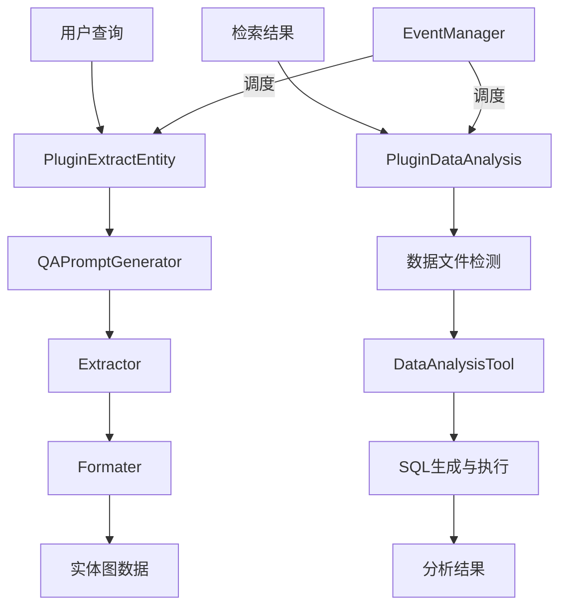

# structured_extraction_and_analysis_plugins 模块深度解析

## 1. 模块概述

在知识检索系统中，用户的查询往往包含丰富的语义信息，而传统的关键词搜索难以捕捉这些深层含义。`structured_extraction_and_analysis_plugins` 模块的核心使命是**让系统能够"理解"用户查询中的实体关系，并对结构化数据进行深度分析**。

想象一下，当用户问"公司2023年的销售额趋势如何？"时，这个模块会：
1. 从查询中提取"公司"、"2023年"、"销售额"等关键实体
2. 识别这些实体之间的关系（"2023年"修饰"销售额"，"销售额"属于"公司"）
3. 如果有相关的表格数据，会自动生成SQL查询并执行分析

这个模块不是孤立的组件，而是作为聊天流水线中的一个插件，与其他模块协同工作，共同提升系统的智能问答能力。

## 2. 架构设计

### 2.1 整体架构图

### 2.2 核心组件详解

本模块包含两个主要插件：

#### 2.2.1 实体提取插件（PluginExtractEntity）

这是模块的核心组件，负责从用户查询中提取实体和关系。它的工作流程如下：

1. **条件检查**：首先检查Neo4j是否启用，以及知识库是否配置了实体提取功能
2. **上下文收集**：收集相关知识库和文档信息
3. **实体提取**：使用LLM从查询中提取实体和关系
4. **结果存储**：将提取的实体存储到ChatManage中供后续使用

**设计亮点**：
- 采用事件驱动架构，只在REWRITE_QUERY事件时激活
- 支持共享知识库的文档解析
- 灵活的配置机制，可针对不同知识库启用/禁用

#### 2.2.2 数据分析插件（PluginDataAnalysis）

这个插件专注于处理结构化数据文件（CSV、Excel等），提供自动数据分析能力：

1. **数据文件检测**：在检索结果中识别数据文件
2. **Schema推断**：加载数据并推断表结构
3. **智能SQL生成**：使用LLM根据用户问题生成SQL查询
4. **结果执行与集成**：执行SQL并将分析结果集成到检索结果中

**设计亮点**：
- 巧妙地过滤掉表列和表摘要chunk，避免重复信息
- 使用DuckDB作为内存数据库，提供高效的数据分析能力
- 采用工具化设计，通过DataAnalysisTool封装数据操作

## 3. 核心设计决策

### 3.1 事件驱动的插件架构

**决策**：采用事件驱动的插件机制，而非直接函数调用。

**原因**：
- **解耦**：插件之间互不依赖，通过事件管理器通信
- **灵活性**：可以动态启用/禁用插件，不影响整体流程
- **可扩展性**：新增插件只需实现相应接口并注册到事件管理器

**权衡**：
- ✅ 优点：模块化程度高，易于测试和维护
- ⚠️ 缺点：调试复杂度增加，需要跟踪事件流

### 3.2 LLM驱动的实体提取

**决策**：使用大语言模型进行实体提取，而非传统的NLP工具。

**原因**：
- **语义理解**：LLM能更好地理解上下文和语义关系
- **灵活性**：可以通过调整提示词来适应不同的提取需求
- **少样本学习**：通过示例就能让模型理解提取规则

**权衡**：
- ✅ 优点：提取质量高，适应性强
- ⚠️ 缺点：成本较高，有延迟，结果可能不稳定

### 3.3 结构化数据的"即席分析"

**决策**：对检测到的数据文件进行动态加载和分析，而非预处理。

**原因**：
- **实时性**：用户的问题是多样的，预处理无法覆盖所有可能的分析需求
- **灵活性**：可以根据用户的具体问题生成定制化的SQL查询
- **资源效率**：只在需要时加载和分析数据，避免不必要的计算

**权衡**：
- ✅ 优点：响应实时需求，资源利用率高
- ⚠️ 缺点：大文件可能导致性能问题，当前实现只处理第一个文件

## 4. 数据流程分析

### 4.1 实体提取流程

当用户提交查询后，实体提取流程如下：

1. **事件触发**：EventManager触发REWRITE_QUERY事件
2. **环境检查**：PluginExtractEntity检查Neo4j是否启用
3. **知识库收集**：收集用户指定的知识库，并检查哪些启用了实体提取
4. **提示词生成**：QAPromptGenerator根据模板生成系统提示和用户提示
5. **LLM调用**：Extractor调用LLM进行实体提取
6. **结果解析**：Formater解析LLM的输出，构建实体图
7. **结果存储**：将提取的实体存储到ChatManage.Entity中

这个流程的关键在于**条件执行**：只有当Neo4j启用且至少有一个知识库配置了实体提取时，才会执行实际的提取操作。

### 4.2 数据分析流程

当检索结果中包含数据文件时，数据分析流程启动：

1. **文件检测**：PluginDataAnalysis扫描MergeResult，识别CSV/Excel文件
2. **过滤优化**：移除表列和表摘要chunk，避免冗余信息
3. **数据加载**：DataAnalysisTool将数据加载到DuckDB中
4. **Schema推断**：推断表结构并生成描述
5. **SQL生成**：使用LLM根据用户问题生成SQL查询
6. **查询执行**：执行SQL并获取结果
7. **结果集成**：将分析结果作为新的SearchResult添加到MergeResult中

这个流程的巧妙之处在于**无缝集成**：分析结果被伪装成普通的检索结果，使得后续的响应生成模块可以统一处理。

## 5. 子模块概览

本模块可进一步细分为以下子模块，每个子模块都有详细的技术文档：

### 5.1 实体提取插件编排
负责实体提取插件的整体流程控制和事件响应。

详细文档：[entity_extraction_plugin_orchestration](application_services_and_orchestration-chat_pipeline_plugins_and_flow-structured_extraction_and_analysis_plugins-entity_extraction_plugin_orchestration.md)

核心组件：[PluginExtractEntity](internal.application.service.chat_pipline.extract_entity.PluginExtractEntity)

### 5.2 实体提取流水线原语
提供实体提取的基础组件，包括提示词生成、提取器和格式化器。

详细文档：[entity_extraction_pipeline_primitives](application_services_and_orchestration-chat_pipeline_plugins_and_flow-structured_extraction_and_analysis_plugins-entity_extraction_pipeline_primitives.md)

核心组件：
- [QAPromptGenerator](internal.application.service.chat_pipline.extract_entity.QAPromptGenerator)
- [Extractor](internal.application.service.chat_pipline.extract_entity.Extractor)
- [Formater](internal.application.service.chat_pipline.extract_entity.Formater)

### 5.3 结构化数据分析插件
专注于结构化数据文件的自动检测和分析。

详细文档：[structured_data_analysis_plugin](application_services_and_orchestration-chat_pipeline_plugins_and_flow-structured_extraction_and_analysis_plugins-structured_data_analysis_plugin.md)

核心组件：[PluginDataAnalysis](internal.application.service.chat_pipline.data_analysis.PluginDataAnalysis)

## 6. 与其他模块的依赖关系

### 6.1 输入依赖
- **chat_pipeline_plugins_and_flow**：提供事件管理器和插件接口
- **model_providers_and_ai_backends**：提供LLM服务用于实体提取和SQL生成
- **data_access_repositories**：提供知识库和知识的访问接口
- **agent_runtime_and_tools**：提供DataAnalysisTool用于数据分析

### 6.2 输出影响
- **retrieval_execution**：接收提取的实体，用于知识图谱检索
- **response_assembly_and_generation**：使用分析结果生成最终回答

## 7. 使用指南与注意事项

### 7.1 配置要点

1. **启用Neo4j**：必须设置环境变量`NEO4J_ENABLE=true`才能使用实体提取功能
2. **知识库配置**：需要在知识库的ExtractConfig中设置Enabled=true
3. **提示词模板**：可以通过配置调整实体提取的提示词模板

### 7.2 常见陷阱

1. **实体提取不稳定**：LLM的输出可能不稳定，Formater做了很多容错处理，但仍可能出现解析失败
2. **数据分析只处理第一个文件**：当前实现只处理检测到的第一个数据文件
3. **SQL生成可能有误**：LLM生成的SQL可能有语法错误或逻辑问题，需要做好错误处理
4. **性能考虑**：大文件的加载和分析可能耗时较长，影响用户体验

### 7.3 扩展建议

1. **增强实体提取**：可以添加后处理步骤，验证和修正提取的实体
2. **支持多文件分析**：扩展数据分析插件，支持处理多个数据文件
3. **添加缓存机制**：对频繁查询的数据分析结果进行缓存
4. **可视化支持**：将分析结果以图表形式展示，提升用户体验

## 8. 总结

`structured_extraction_and_analysis_plugins` 模块是系统从"关键词匹配"向"语义理解"演进的关键一步。它通过实体提取让系统能够理解查询中的语义关系，通过数据分析让系统能够对结构化数据进行深度洞察。

这个模块的设计体现了几个重要的设计理念：
- **事件驱动**：通过事件机制实现松耦合的插件架构
- **LLM优先**：充分利用大语言模型的能力，而非传统规则
- **无缝集成**：将复杂功能封装成简单的插件，与现有流程无缝融合

对于新加入团队的开发者来说，理解这个模块的关键在于把握"让系统更智能"这个核心目标，以及事件驱动和LLM应用这两个关键技术手段。
