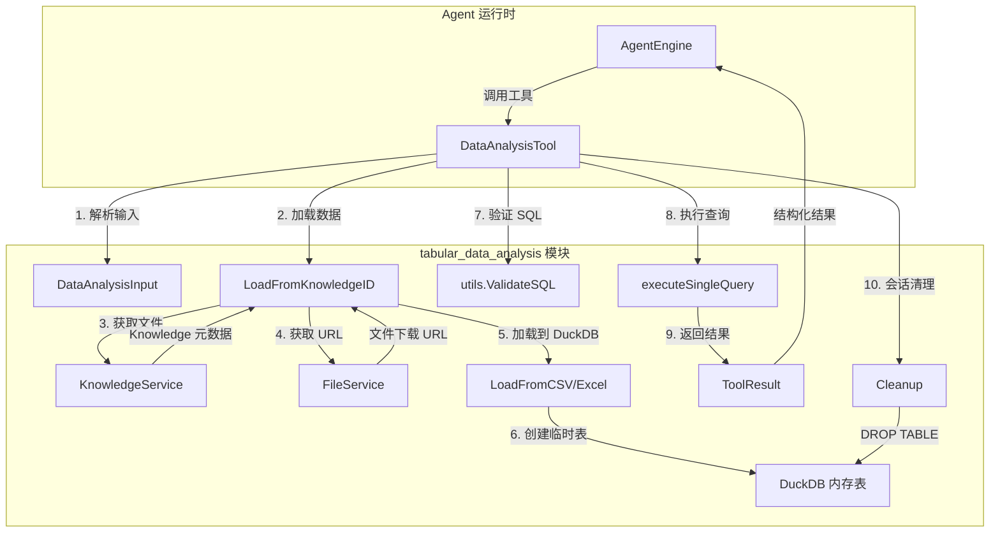

# tabular_data_analysis_and_structural_models 模块深度解析

## 模块概述：为什么需要这个模块？

想象一下，你有一个智能助手，用户上传了一份包含销售数据的 Excel 文件，然后问："上个季度哪个产品的销售额最高？"。助手不能直接"看懂"Excel，但它能理解 SQL。这个模块的核心使命就是**在 tabular 数据和自然语言之间架起一座安全的桥梁**——它将 CSV/Excel 文件加载到 DuckDB 内存数据库中，让 Agent 可以通过 SQL 查询进行数据分析，同时确保整个过程是安全、隔离且可清理的。

这个模块存在的根本原因是：**直接让 LLM 处理原始文件内容既不高效也不安全**。文件可能很大，LLM 的上下文窗口有限；更重要的是，直接暴露文件内容可能导致数据泄露。通过 DuckDB 这个"沙箱"，我们实现了三个关键目标：

1. **结构化查询能力**：将自然语言问题转化为 SQL，利用数据库的聚合、过滤能力进行精确分析
2. **会话级隔离**：每个会话创建独立的临时表，会话结束后自动清理，避免数据残留
3. **多层安全防护**：只读查询限制、SQL 注入防护、危险函数拦截，确保 Agent 无法破坏数据或访问未授权内容

## 架构设计：数据如何流动？



### 架构角色解析

这个模块在系统中扮演**安全数据网关**的角色。它位于 Agent 工具层（`agent_runtime_and_tools`）和数据访问层之间，向上为 Agent 提供统一的 SQL 查询接口，向下管理 DuckDB 临时表的生命周期。

**关键数据流**：

1. **加载阶段**：Agent 调用工具 → 解析 `DataAnalysisInput` → 通过 `KnowledgeService.GetKnowledgeByIDOnly` 获取文件元数据 → 通过 `FileService.GetFileURL` 获取文件访问路径 → 调用 `LoadFromCSV` 或 `LoadFromExcel` 将数据加载到 DuckDB 临时表

2. **查询阶段**：接收 SQL → 多层安全验证（只读检查、表名白名单、注入检测）→ 执行查询 → 格式化结果为 JSONL → 返回 `ToolResult`

3. **清理阶段**：会话结束时调用 `Cleanup` → 遍历 `createdTables` 列表 → 执行 `DROP TABLE` → 释放内存

## 核心组件深度解析

### DataAnalysisTool：工具的执行引擎

**设计意图**：这个结构体是整个模块的"大脑"，它不仅仅是一个简单的工具包装器，而是承担了**会话级资源管理器**的职责。注意它持有一个 `createdTables []string` 字段——这是理解其设计的关键。

**为什么需要跟踪创建的表？** 因为 DuckDB 的临时表不会自动清理。如果 Agent 在长对话中多次加载不同的文件，内存会持续增长。通过记录每个会话创建的表名，模块可以在会话结束时精确清理资源，避免内存泄漏。这种设计体现了**资源所有权明确**的原则：谁创建，谁清理。

```go
type DataAnalysisTool struct {
    BaseTool         // 继承工具元数据（名称、描述、Schema）
    knowledgeService interfaces.KnowledgeService  // 获取 Knowledge 元数据
    fileService      interfaces.FileService       // 获取文件访问 URL
    db               *sql.DB                      // DuckDB 连接
    sessionID        string                       // 会话标识，用于日志追踪
    createdTables    []string                     // 会话级表生命周期追踪
}
```

**关键方法解析**：

- `Execute(ctx, args)`：工具的主入口。它的工作流程像一个**安全检查站**：先解析输入，再加载数据（如果需要），然后验证 SQL 的只读性和安全性，最后执行查询。任何一步失败都会立即返回错误，不会继续执行。

- `recordCreatedTable(tableName)`：这个看似简单的方法体现了**幂等性设计**。它检查表名是否已存在，只有新表才会被记录。这意味着即使 Agent 多次加载同一个文件，也不会重复记录清理任务。

- `Cleanup(ctx)`：会话结束时的清理钩子。它遍历 `createdTables` 执行 `DROP TABLE`，即使某个表删除失败也会继续处理其他表（fail-fast 但不是 fail-stop）。这种设计确保了**部分失败不影响整体清理**。

- `LoadFromKnowledgeID(knowledgeID)`：这是数据加载的入口。它使用 `GetKnowledgeByIDOnly` 而不是 `GetKnowledgeByID`——注意这个细节：`Only` 版本不进行租户过滤，这意味着**支持跨租户共享的知识库访问**。这是一个重要的设计决策，允许共享 Agent 访问被授权的知识库。

### DataAnalysisInput：查询契约

```go
type DataAnalysisInput struct {
    KnowledgeID string `json:"knowledge_id" jsonschema:"id of the knowledge to query"`
    Sql         string `json:"sql" jsonschema:"SQL to be executed on knowledge"`
}
```

**设计意图**：这个结构体定义了 Agent 与工具之间的**最小契约**。它只包含两个字段，体现了**单一职责原则**：告诉工具"分析哪个文件"和"用什么 SQL 分析"。注意 `KnowledgeID` 而不是文件路径——工具负责解析 ID 到实际文件的映射，Agent 不需要知道文件存储细节。

**隐式约束**：
- `Sql` 字段必须是只读查询（SELECT、SHOW、DESCRIBE 等）
- `KnowledgeID` 必须是有效的、Agent 有权限访问的知识库条目
- SQL 中的表名引用会被自动替换为实际的 DuckDB 表名（通过 `strings.ReplaceAll`）

### TableSchema 与 ColumnInfo：元数据抽象

```go
type TableSchema struct {
    TableName string                 `json:"table_name"`
    Columns   []ColumnInfo           `json:"columns"`
    RowCount  int64                  `json:"row_count"`
    Metadata  map[string]interface{} `json:"metadata,omitempty"`
}

type ColumnInfo struct {
    Name     string `json:"name"`
    Type     string `json:"type"`
    Nullable string `json:"nullable"`
}
```

**设计意图**：这两个结构体是**数据库无关的元数据抽象**。它们不绑定 DuckDB 的具体实现，而是提供通用的表结构描述。这种设计有两个好处：

1. **可测试性**：可以在不连接真实数据库的情况下构造测试数据
2. **可扩展性**：如果未来切换到其他 SQL 引擎（如 SQLite），元数据结构不需要改变

`Description()` 方法将这些元数据格式化为人类可读的文本，这是给 LLM 的"提示词素材"——LLM 需要知道表有哪些列、每列的类型是什么，才能生成正确的 SQL。

## 依赖关系分析

### 上游依赖（谁调用它）

这个模块被 [`agent_runtime_and_tools`](agent_runtime_and_tools.md) 中的 `AgentEngine` 调用。具体来说，当 Agent 决定进行数据分析时，它会：

1. 从工具注册表获取 `DataAnalysisTool` 实例
2. 构造 `DataAnalysisInput`（通常由 LLM 生成）
3. 调用 `Execute` 方法
4. 解析 `ToolResult` 中的 `Data` 字段获取结构化结果

**调用契约**：调用者必须确保在会话结束时调用 `Cleanup`，否则会导致内存泄漏。这个责任通常在 `AgentEngine` 的会话管理逻辑中实现。

### 下游依赖（它调用谁）

| 依赖组件 | 用途 | 耦合程度 |
|---------|------|---------|
| `KnowledgeService` | 获取 Knowledge 元数据（文件路径、类型） | 中等：依赖接口，不依赖实现 |
| `FileService` | 获取文件下载 URL | 中等：依赖接口，不依赖实现 |
| `*sql.DB` (DuckDB) | 执行 SQL 查询 | 高：直接依赖 DuckDB 的 SQL 方言 |
| `utils.ValidateSQL` | SQL 安全验证 | 高：依赖验证逻辑的正确性 |

**关键耦合点**：模块对 DuckDB 的 SQL 方言有隐式依赖。例如，`LoadFromCSV` 使用 `read_csv_auto` 函数，`LoadFromExcel` 使用 `st_read` 函数（来自 spatial 扩展）。如果更换数据库引擎，这些函数需要适配。

### 数据契约

**输入契约**（`DataAnalysisInput`）：
- `knowledge_id`: 必须是有效的 UUID 格式
- `sql`: 必须是合法的 SQL 语句，且只包含只读操作

**输出契约**（`ToolResult`）：
```go
&types.ToolResult{
    Success: true/false,
    Output:  "人类可读的查询结果摘要",
    Data: map[string]interface{}{
        "rows":         []map[string]string,  // 原始行数据
        "row_count":    int,                  // 行数
        "query":        string,               // 实际执行的 SQL
        "display_type": "data_analysis",      // 前端渲染类型
        "session_id":   string,               // 会话标识
    },
}
```

## 设计决策与权衡

### 1. 为什么选择 DuckDB 而不是其他方案？

**权衡**：DuckDB vs. SQLite vs. 直接在内存中解析

- **DuckDB 的优势**：专为分析查询优化，支持 CSV/Excel 原生导入，列式存储适合聚合查询
- **SQLite 的劣势**：需要先将 CSV 转换为 INSERT 语句，导入慢，行式存储不适合分析
- **内存解析的劣势**：需要自己实现过滤、聚合逻辑，复杂度高

**决策**：选择 DuckDB 是因为它在**分析查询性能**和**使用便利性**之间取得了最佳平衡。代价是引入了额外的运行时依赖。

### 2. 为什么只允许只读查询？

**权衡**：安全性 vs. 灵活性

允许写操作（INSERT/UPDATE/DELETE）会带来严重的安全风险：
- Agent 可能意外修改数据，导致后续查询结果不一致
- 恶意 Agent 可能通过写操作进行数据注入攻击
- 临时表的生命周期管理会变得复杂（需要跟踪哪些行是 Agent 插入的）

**决策**：严格限制为只读查询。如果未来需要写操作，应该通过专门的工具（如 `DataModificationTool`）实现，并配备更严格的审计日志。

### 3. 为什么使用会话级表而不是全局表？

**权衡**：资源隔离 vs. 内存效率

- **会话级表**：每个会话独立，清理简单，不会互相干扰
- **全局表**：可以复用，节省内存，但需要复杂的引用计数和锁机制

**决策**：选择会话级表。在典型的 Agent 对话场景中，会话数量有限（通常 < 100），内存开销可控。而引用计数和锁机制的复杂度远超收益。

### 4. 为什么 `createdTables` 使用切片而不是 map？

**权衡**：查找性能 vs. 实现简单性

- **map**：O(1) 查找，但需要处理哈希冲突，代码稍复杂
- **切片**：O(n) 查找，但 n 通常很小（一个会话创建的表很少超过 10 个）

**决策**：选择切片。在常见场景下，性能差异可以忽略，而切片的实现更简单、更可预测。这是一个**过早优化是万恶之源**的典型案例。

## 使用指南与示例

### 基本使用模式

```go
// 1. 创建工具实例（通常在 Agent 初始化时）
tool := NewDataAnalysisTool(
    knowledgeService,  // 实现 interfaces.KnowledgeService
    fileService,       // 实现 interfaces.FileService
    duckDB,            // *sql.DB 连接到 DuckDB
    sessionID,         // 当前会话 ID
)

// 2. 执行查询
input := DataAnalysisInput{
    KnowledgeID: "kb-123-file-456",
    Sql:         "SELECT product, SUM(sales) FROM k_kb_123_file_456 GROUP BY product",
}
args, _ := json.Marshal(input)
result, err := tool.Execute(ctx, args)

// 3. 处理结果
if result.Success {
    rows := result.Data["rows"].([]map[string]string)
    for _, row := range rows {
        fmt.Printf("产品：%s, 销售额：%s\n", row["product"], row["sum"])
    }
}

// 4. 会话结束时清理
defer tool.Cleanup(ctx)
```

### 配置注意事项

1. **DuckDB 连接配置**：确保 DuckDB 启用了必要的扩展（如 spatial 扩展用于 Excel 读取）
2. **超时设置**：在 `ctx` 中设置合理的超时，避免长时间查询阻塞
3. **结果限制**：建议在 SQL 中添加 `LIMIT` 子句，避免返回过多数据

## 边界情况与陷阱

### 1. 跨租户访问的权限边界

`LoadFromKnowledgeID` 使用 `GetKnowledgeByIDOnly`，这意味着它**不进行租户过滤**。权限检查应该在调用工具之前完成（由 `AgentEngine` 负责）。如果权限检查有漏洞，可能导致跨租户数据泄露。

**缓解措施**：确保 `AgentEngine` 在调用工具前验证 Agent 对知识库的访问权限。

### 2. SQL 注入的防御深度

模块使用多层防御：
1. 只读查询检查（前缀匹配）
2. `utils.ValidateSQL` 的综合验证（表名白名单、单语句限制、危险函数拦截）

但**前缀匹配有局限性**：`SELECT ... UNION SELECT ...` 会被放行，因为以 SELECT 开头。依赖 `ValidateSQL` 的单语句检查来拦截。

**陷阱**：如果 `ValidateSQL` 的实现有漏洞，整个安全模型会崩溃。这是一个**信任边界**问题。

### 3. 内存泄漏风险

如果 `Cleanup` 没有被调用（例如，会话异常终止），临时表会一直占用内存。DuckDB 的临时表在连接关闭时会自动清理，但如果使用连接池，连接可能不会立即关闭。

**缓解措施**：在 `AgentEngine` 的 defer 中确保调用 `Cleanup`，即使发生 panic 也能执行。

### 4. Excel 读取的扩展依赖

`LoadFromExcel` 依赖 DuckDB 的 spatial 扩展（`st_read` 函数）。如果扩展未安装，会返回错误。

**陷阱**：错误消息提到"Consider converting to CSV first"，但这需要额外的转换逻辑。在生产环境中，应该预先检查扩展是否可用，或在启动时自动安装。

### 5. 表名替换的边界情况

代码使用 `strings.ReplaceAll(input.Sql, input.KnowledgeID, schema.TableName)` 替换表名。如果 `KnowledgeID` 是 SQL 关键字或包含特殊字符，可能导致意外的替换。

**示例**：如果 `KnowledgeID = "select"`，SQL 中的 `SELECT` 会被错误替换。

**缓解措施**：使用更精确的替换逻辑（如正则表达式匹配表名引用），或在 Schema 中提供明确的表名映射。

## 相关模块参考

- [agent_runtime_and_tools](agent_runtime_and_tools.md)：工具注册和执行框架
- [knowledge_and_chunk_api](knowledge_and_chunk_api.md)：Knowledge 元数据管理
- [data_access_repositories](data_access_repositories.md)：底层数据持久化
- [application_services_and_orchestration](application_services_and_orchestration.md)：KnowledgeService 实现
