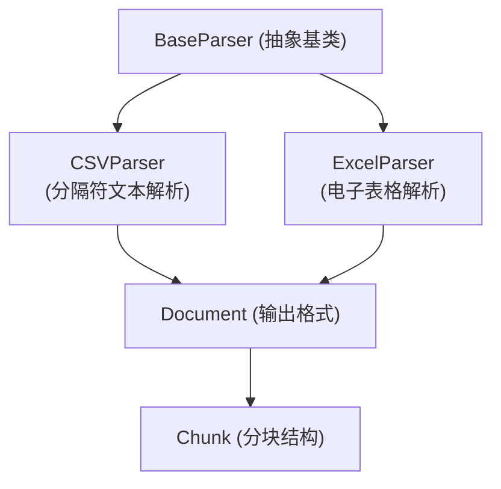

# tabular_spreadsheet_and_delimited_parsers 模块深度解析

## 1. 模块概览

`tabular_spreadsheet_and_delimited_parsers` 模块是 `docreader_pipeline` 解析引擎中的一个专门组件，负责处理结构化表格数据的解析工作。它将电子表格（Excel）和分隔符文本（CSV）等表格格式转换为统一的 `Document` 对象结构，为后续的知识提取和检索提供基础。

**核心问题**：表格数据本质上是二维的，但大多数文本处理系统需要线性的、分块的文本表示。本模块的主要工作就是优雅地完成这种二维到一维的转换，同时保留关键的语义信息。

## 2. 架构设计

### 2.1 系统定位

这个模块位于文档解析流水线的最前端，属于 `format_specific_parsers` 家族中的一员。它与其他解析器（如 PDF、Word、Markdown 解析器）共享相同的 `BaseParser` 接口，形成一个统一的解析器生态系统。



### 2.2 核心数据流

解析过程遵循一个清晰的转换管道：

1. **原始字节输入** → 2. **DataFrame 加载** → 3. **行级别格式化** → 4. **Chunk 生成** → 5. **Document 输出**

对于 Excel 文件，这个流程会在每个工作表上重复执行，最终所有工作表的结果会合并到单一的 Document 对象中。

## 3. 核心组件解析

### 3.1 CSVParser - 逗号分隔值解析器

`CSVParser` 专注于处理简单的文本表格格式。它的设计哲学是**简单而健壮**：

```python
class CSVParser(BaseParser):
    def parse_into_text(self, content: bytes) -> Document:
        # 使用 pandas 解析 CSV
        df = pd.read_csv(BytesIO(content), on_bad_lines="skip")
        
        # 逐行处理，生成 "列: 值" 格式
        for i, (idx, row) in enumerate(df.iterrows()):
            content_row = ",".join(f"{col.strip()}: {str(row[col]).strip()}" 
                                   for col in df.columns) + "\n"
            # 创建 Chunk 对象
```

**设计亮点**：
- **容错处理**：使用 `on_bad_lines="skip"` 自动跳过格式错误的行，提高健壮性
- **统一格式化**：每一行被转换为明确的 `column: value` 键值对格式
- **粒度控制**：每行作为独立 Chunk，支持细粒度检索

### 3.2 ExcelParser - 电子表格解析器

`ExcelParser` 处理更复杂的 Excel 文件格式，支持多工作表场景：

```python
class ExcelParser(BaseParser):
    def parse_into_text(self, content: bytes) -> Document:
        excel_file = pd.ExcelFile(BytesIO(content))
        
        # 遍历所有工作表
        for excel_sheet_name in excel_file.sheet_names:
            df = excel_file.parse(sheet_name=excel_sheet_name)
            df.dropna(how="all", inplace=True)  # 删除空行
            
            # 逐行处理，过滤 NaN 值
            for _, row in df.iterrows():
                page_content = [f"{k}: {v}" for k, v in row.items() if pd.notna(v)]
                # ...
```

**设计亮点**：
- **多工作表支持**：透明处理 Excel 中的多个工作表，合并输出
- **空值过滤**：自动删除全空行，跳过单个单元格的 NaN 值
- **跨表连续性**：保持所有工作表的 Chunk 顺序连续，不丢失上下文

## 4. 关键设计决策

### 4.1 为什么选择键值对格式？

**选择**：将表格行转换为 `column: value, column: value` 格式，而非简单的逗号分隔值。

**权衡分析**：
- ✅ **语义保留**：列名与值绑定，保留了"这个值属于哪个字段"的关键信息
- ✅ **检索友好**：后续的语义搜索可以理解"年龄: 30"比单纯的"30"更有意义
- ❌ **存储开销**：列名在每行重复，增加了文本体积（约 2-5 倍）
- ❌ **格式冗长**：人类可读性有所下降

**设计理由**：在 AI/检索场景下，语义理解的优先级高于存储效率和人类可读性。

### 4.2 为什么每行作为一个 Chunk？

**选择**：将表格的每一行作为独立的 `Chunk` 对象，而非合并成更大的块。

**权衡分析**：
- ✅ **细粒度检索**：用户查询可以精确匹配到某一行记录
- ✅ **上下文独立性**：每行是自包含的，不需要周围行的上下文
- ❌ **块数量爆炸**：大表格会产生数千个 Chunk，增加索引负担
- ❌ **失去表格结构**：行之间的相邻关系在 Chunk 级别丢失

**设计理由**：知识检索系统的核心能力是精确匹配，细粒度 Chunk 更有利于这一点。

### 4.3 为什么使用 pandas 而非原生解析？

**选择**：依赖 pandas 库进行 CSV 和 Excel 的底层解析。

**权衡分析**：
- ✅ **成熟稳定**：pandas 处理了无数边缘情况（编码、分隔符、空值等）
- ✅ **开发效率**：避免了重新实现复杂的表格解析逻辑
- ❌ **依赖较重**：增加了 pandas 这个较大的依赖项
- ❌ **性能开销**：对于简单 CSV，pandas 可能比原生解析稍慢

**设计理由**：工程上的稳定性和可维护性优先于微优化。

## 5. 子模块概览

本模块包含两个主要子模块：

- **delimited_text_table_parsing**：处理 CSV 等分隔符文本格式
- **spreadsheet_workbook_parsing**：处理 Excel 等电子表格工作簿格式

这两个子模块的文档将进一步深入各自的实现细节。

## 6. 与其他模块的关系

### 6.1 上游依赖
- **parser_base_abstractions**：提供 `BaseParser` 抽象基类和通用解析功能
- **document_models_and_chunking_support**：提供 `Document` 和 `Chunk` 数据模型

### 6.2 下游影响
- **parser_pipeline_orchestration**：调用此模块进行特定格式的解析
- **knowledge_ingestion_extraction_and_graph_services**：使用解析后的 Document 进行知识提取

## 7. 使用指南与注意事项

### 7.1 典型用法

```python
# CSV 解析
parser = CSVParser()
with open("data.csv", "rb") as f:
    document = parser.parse_into_text(f.read())

# Excel 解析
parser = ExcelParser()
with open("data.xlsx", "rb") as f:
    document = parser.parse_into_text(f.read())
```

### 7.2 常见陷阱与边界情况

1. **CSV 格式不一致**：不同来源的 CSV 可能有不同的分隔符、编码和换行符
   - 注意：当前实现仅使用 pandas 默认配置，可能需要扩展以支持更多变体

2. **Excel 空行处理**：模块会自动删除全空行，但部分空的行仍会被保留
   - 设计意图：保留有部分数据的行比完全丢弃更安全

3. **列名清理**：模块对列名执行 `strip()` 操作，去除首尾空白
   - 注意：这可能改变原始列名的精确表示

4. **大文件性能**：对于非常大的表格（>100万行），内存使用可能成为问题
   - 建议：考虑流式处理或分批处理的扩展方案

### 7.3 扩展点

未来可能的扩展方向：
- 支持更多分隔符格式（TSV、PSV 等）
- 可配置的 Chunk 粒度（多行合并）
- 保留 Excel 中的单元格格式信息
- 支持表格元数据（标题、注释等）的提取

---

本模块是文档解析系统中处理结构化数据的核心组件，它通过精心设计的转换策略，将表格数据无缝融入统一的知识处理流水线。
