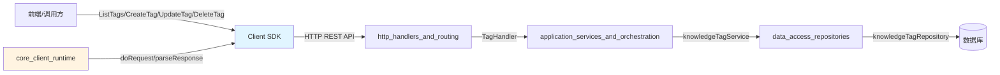

# Tag API 模块技术深度解析

## 概述：为什么需要这个模块

想象一下，你正在管理一个包含数万份文档的企业知识库。用户需要快速找到"产品规范"相关的文档，但文档分散在不同的知识库中，有些是技术规格，有些是用户手册。如果没有一种轻量级的分类机制，用户只能通过全文搜索或浏览目录来查找——这两种方式在大规模场景下都显得笨重。

`tag_api` 模块正是为解决这个问题而生。它提供了一套**标签管理系统**，允许用户为知识库中的内容（Knowledge 和 Chunk）打上可自定义的分类标记。与传统的文件夹层级不同，标签是扁平的、可多重关联的，这使得同一份内容可以同时属于"产品规范"、"v2.0"和"待审核"等多个维度。

这个模块的核心设计洞察是：**标签不应该只是元数据，它应该是可查询、可统计、可操作的一等公民**。因此，`TagWithStats` 结构体不仅包含标签的基本信息，还携带了 `knowledge_count` 和 `chunk_count` 这两个统计字段——这使得前端可以在不发起额外请求的情况下展示标签的使用热度，也为后续的标签清理（删除未使用标签）提供了数据基础。

## 架构定位与数据流



`tag_api` 模块在整个系统中的架构角色是 **SDK 层的数据契约与请求编排器**。它位于调用方与后端服务之间，承担以下职责：

1. **数据契约定义**：定义标签的序列化结构（`Tag`、`TagWithStats`）和请求/响应格式（`CreateTagPayload`、`TagsResponse`）
2. **请求编排**：将高层操作（如"删除标签但保留内容"）转换为 HTTP 请求的参数组合
3. **响应解析**：统一处理后端返回的包装结构，提取有效数据

### 依赖关系分析

| 依赖方向 | 模块 | 依赖内容 | 耦合强度 |
|---------|------|---------|---------|
| **被依赖** | 调用方业务代码 | `Client` 实例及所有公开方法 | 强耦合（接口变更会传播） |
| **依赖** | `core_client_runtime` | `Client.doRequest()`、`parseResponse()` | 强耦合（运行时实现细节） |
| **对应后端** | `http_handlers_and_routing` | `TagHandler` 及路由 `/api/v1/knowledge-bases/{id}/tags` | 契约耦合（API 路径和字段名必须一致） |
| **对应服务** | `application_services_and_orchestration` | `knowledgeTagService` | 间接耦合（通过 HTTP 契约） |
| **对应存储** | `data_access_repositories` | `knowledgeTagRepository` | 无直接耦合（通过服务层隔离） |

数据流的关键路径如下：

1. **查询标签列表**：调用方 → `ListTags()` → 构建 URL 参数 → `doRequest(GET)` → `TagsResponse` 解析 → 返回 `TagsPage`
2. **创建标签**：调用方 → `CreateTag()` → 序列化 `CreateTagPayload` → `doRequest(POST)` → `TagResponse` 解析 → 返回 `Tag`
3. **删除标签**：调用方 → `DeleteTag()` → 构建查询参数 + 可选请求体 → `doRequest(DELETE)` → `tagSimpleResponse` 解析

## 核心组件深度解析

### Tag：标签的基础数据模型

```go
type Tag struct {
    ID              string    `json:"id"`
    SeqID           int64     `json:"seq_id"`
    TenantID        uint64    `json:"tenant_id"`
    KnowledgeBaseID string    `json:"knowledge_base_id"`
    Name            string    `json:"name"`
    Color           string    `json:"color"`
    SortOrder       int       `json:"sort_order"`
    CreatedAt       time.Time `json:"created_at"`
    UpdatedAt       time.Time `json:"updated_at"`
}
```

`Tag` 结构体是标签的**完整状态快照**。设计上有几个值得注意的点：

**双 ID 系统（`ID` + `SeqID`）**：这是本模块最核心的设计决策之一。`ID` 是 UUID 格式的字符串，适合对外暴露和跨系统引用；`SeqID` 是自增整数，适合内部索引和用户可见的短标识。这种设计源于实际业务需求：
- UUID 保证全局唯一性和安全性（不可猜测）
- 自增 ID 便于用户在 UI 中引用（如"标签 #42"）和调试时的可读性
- 后端 API 同时支持两种 ID 格式（见 `UpdateTag` 和 `DeleteTag` 方法）

**租户隔离（`TenantID`）**：多租户 SaaS 架构的基础字段，确保标签数据在逻辑上隔离。注意这个字段是只读的——创建标签时由后端从认证上下文中提取，调用方无法指定。

**知识库绑定（`KnowledgeBaseID`）**：标签不是全局的，而是隶属于特定知识库。这意味着同一租户下的不同知识库可以有同名标签，互不干扰。这种设计避免了标签命名空间的污染，但也意味着跨知识库的标签统一管理需要额外的工作。

**视觉属性（`Color` + `SortOrder`）**：标签不仅是分类工具，也是 UI 组件。`Color` 用于前端渲染时的视觉区分，`SortOrder` 控制标签在列表中的显示顺序。这两个字段都是可选的（创建时不强制），体现了"渐进式增强"的设计思想——用户可以先创建标签，后续再完善视觉配置。

### TagWithStats：带统计信息的增强视图

```go
type TagWithStats struct {
    Tag
    KnowledgeCount int64 `json:"knowledge_count"`
    ChunkCount     int64 `json:"chunk_count"`
}
```

`TagWithStats` 通过**结构体嵌入**（embedding）继承了 `Tag` 的所有字段，并添加了两个统计指标。这种设计模式在 Go 中很常见，但在这里有特殊的语义：

- `KnowledgeCount`：标记为该标签的 Knowledge 记录数量
- `ChunkCount`：标记为该标签的 Chunk 记录数量

**为什么统计信息要放在 SDK 层而不是单独查询？**

这是一个典型的**空间换时间**和**减少往返次数**的权衡。想象一个标签管理页面需要展示 50 个标签及其使用次数：
- 方案 A：先获取标签列表，再对每个标签发起统计查询 → 51 次 HTTP 请求
- 方案 B：在列表接口中直接返回统计信息 → 1 次 HTTP 请求

显然方案 B 更优。但这也带来了数据一致性的问题：统计信息是实时计算还是缓存的？从性能角度推测，后端很可能使用缓存（如 Redis）存储计数，在标签关联关系变化时异步更新。这意味着 `KnowledgeCount` 和 `ChunkCount` 可能存在秒级的延迟——调用方需要理解这一隐含契约。

### CreateTagPayload vs UpdateTagPayload：创建与更新的语义差异

```go
type CreateTagPayload struct {
    Name      string `json:"name"`
    Color     string `json:"color,omitempty"`
    SortOrder int    `json:"sort_order,omitempty"`
}

type UpdateTagPayload struct {
    Name      *string `json:"name,omitempty"`
    Color     *string `json:"color,omitempty"`
    SortOrder *int    `json:"sort_order,omitempty"`
}
```

这两个结构体的差异体现了 **PATCH 语义** 与 **POST 语义** 的本质区别：

| 特性 | CreateTagPayload | UpdateTagPayload |
|-----|-----------------|-----------------|
| `Name` 字段 | 必填（非指针） | 可选（指针） |
| 可选字段 | 使用 `omitempty` | 使用指针 + `omitempty` |
| 零值处理 | `SortOrder=0` 会被序列化 | `SortOrder=nil` 不会被序列化 |

**为什么 UpdateTagPayload 使用指针？**

这是 Go 中实现**部分更新**的标准模式。考虑以下场景：用户只想修改标签颜色，不改变名称和排序。

```go
// 错误方式：使用非指针字段
payload := UpdateTagPayload{
    Color: "#ff0000",
    // Name 会被设为空字符串，SortOrder 会被设为 0
}
// 序列化后：{"name": "", "color": "#ff0000", "sort_order": 0}
// 后端会认为用户想清空名称和排序！

// 正确方式：使用指针字段
color := "#ff0000"
payload := UpdateTagPayload{
    Color: &color,
    // Name 和 SortOrder 为 nil，不会被序列化
}
// 序列化后：{"color": "#ff0000"}
// 后端只更新颜色字段
```

这种设计虽然增加了调用方的使用复杂度（需要创建临时变量取地址），但避免了**意外覆盖**的陷阱。作为模块使用者，你应该始终使用指针字段来表达"不修改此字段"的意图。

### TagsPage 与 TagsResponse：分页与响应的分层包装

```go
type TagsPage struct {
    Total    int64          `json:"total"`
    Page     int            `json:"page"`
    PageSize int            `json:"page_size"`
    Tags     []TagWithStats `json:"data"`
}

type TagsResponse struct {
    Success bool      `json:"success"`
    Data    *TagsPage `json:"data"`
    Message string    `json:"message,omitempty"`
    Code    string    `json:"code,omitempty"`
}
```

这里存在两层包装：
1. `TagsResponse`：**协议层包装**，包含成功标志、错误信息和状态码
2. `TagsPage`：**业务层包装**，包含分页元数据和实际数据

这种分层设计的好处是：
- 协议层可以统一处理（如 `parseResponse` 函数）
- 业务层可以独立演化（如增加排序信息）

但调用方需要注意：`ListTags` 方法返回的是 `*TagsPage` 而不是 `*TagsResponse`——SDK 已经帮你解包了一层。如果 `response.Data` 为 `nil`，方法会返回一个空的 `&TagsPage{}` 而不是 `nil`，这避免了调用方的空指针检查，但也可能掩盖后端的异常情况。

### tagSimpleResponse：删除操作的轻量响应

```go
type tagSimpleResponse struct {
    Success bool   `json:"success"`
    Message string `json:"message,omitempty"`
    Code    string `json:"code,omitempty"`
}
```

注意这个结构体是**小写开头**的（未导出），仅用于 `DeleteTag` 和 `DeleteTagBySeqID` 的内部解析。删除操作不需要返回数据，只需要确认成功或失败，因此使用简化响应。这种设计体现了**最小化接口表面**的原则——调用方不需要关心删除响应的结构，只需要检查 `error` 返回值。

## 方法详解与使用模式

### ListTags：分页查询与关键词过滤

```go
func (c *Client) ListTags(ctx context.Context,
    knowledgeBaseID string, page, pageSize int, keyword string,
) (*TagsPage, error)
```

**参数设计分析**：
- `knowledgeBaseID`：路径参数，标签的归属上下文
- `page` / `pageSize`：分页控制，**从 1 开始计数**（`page > 0` 才添加到查询参数）
- `keyword`：模糊搜索，匹配标签名称

**关键行为**：
1. 当 `page <= 0` 或 `pageSize <= 0` 时，这些参数不会被发送到后端——后端会使用默认值
2. 当 `keyword` 为空字符串时，不进行过滤
3. 当后端返回 `Data == nil` 时，方法返回空 `TagsPage` 而不是错误

**使用示例**：
```go
// 获取第一页，每页 20 个标签
tags, err := client.ListTags(ctx, "kb-123", 1, 20, "")

// 搜索包含"产品"的标签
tags, err := client.ListTags(ctx, "kb-123", 1, 20, "产品")

// 获取所有标签（依赖后端默认页大小）
tags, err := client.ListTags(ctx, "kb-123", 0, 0, "")
```

**潜在陷阱**：
- 分页页码从 1 开始，不是 0——这与某些编程语言的习惯不同
- 空结果不会返回错误，而是返回空的 `TagsPage`——调用方需要检查 `len(tags.Tags)` 而不是 `tags == nil`

### CreateTag：创建标签的必填与可选字段

```go
func (c *Client) CreateTag(ctx context.Context,
    knowledgeBaseID string, payload *CreateTagPayload,
) (*Tag, error)
```

**必填字段**：只有 `Name` 是必填的。`Color` 和 `SortOrder` 可以省略，后端会使用默认值（通常是随机颜色或按创建时间排序）。

**使用示例**：
```go
// 最小化创建
tag, err := client.CreateTag(ctx, "kb-123", &client.CreateTagPayload{
    Name: "产品规范",
})

// 完整配置
tag, err := client.CreateTag(ctx, "kb-123", &client.CreateTagPayload{
    Name:      "产品规范",
    Color:     "#3498db",
    SortOrder: 1,
})
```

**注意事项**：
- 标签名称在同一知识库内应该是唯一的——如果重复，后端会返回错误
- `Color` 应该是有效的十六进制颜色码（如 `#ff0000`），但 SDK 不做验证，由后端校验

### UpdateTag 与 UpdateTagBySeqID：双 ID 支持

```go
func (c *Client) UpdateTag(ctx context.Context,
    knowledgeBaseID, tagID string, payload *UpdateTagPayload,
) (*Tag, error)

func (c *Client) UpdateTagBySeqID(ctx context.Context,
    knowledgeBaseID string, tagSeqID int64, payload *UpdateTagPayload,
) (*Tag, error)
```

`UpdateTagBySeqID` 是 `UpdateTag` 的**便利包装器**，将 `int64` 的 `tagSeqID` 转换为字符串后调用 `UpdateTag`。这种设计模式在整个 SDK 中反复出现（如 `DeleteTagBySeqID`），目的是：
1. 提供类型安全的 API（`int64` vs `string`）
2. 减少调用方的转换代码
3. 明确表达意图（使用 `SeqID` 而不是 `UUID`）

**使用示例**：
```go
// 使用 UUID 更新
name := "新产品规范"
tag, err := client.UpdateTag(ctx, "kb-123", "tag-uuid-456", &client.UpdateTagPayload{
    Name: &name,
})

// 使用 SeqID 更新
tag, err := client.UpdateTagBySeqID(ctx, "kb-123", 42, &client.UpdateTagPayload{
    Color: ptr("#ff0000"),
})
```

### DeleteTag：复杂的删除语义

```go
func (c *Client) DeleteTag(ctx context.Context,
    knowledgeBaseID, tagID string, force bool, contentOnly bool, excludeIDs []int64,
) error
```

这是整个模块中**参数最复杂**的方法，反映了标签删除操作的多种语义：

| 参数 | 含义 | 默认行为 |
|-----|------|---------|
| `force` | 即使标签被引用也强制删除 | `false`（有引用时拒绝删除） |
| `contentOnly` | 只删除标签与内容的关联，保留标签本身 | `false`（删除标签本身） |
| `excludeIDs` | 排除某些 Chunk 的 seq_id，不删除它们的关联 | 空（删除所有关联） |

**场景分析**：

1. **安全删除**（默认）：`force=false, contentOnly=false`
   - 如果标签有关联的 Knowledge 或 Chunk，后端返回错误
   - 保护用户意外删除正在使用的标签

2. **强制删除**：`force=true, contentOnly=false`
   - 删除标签本身，同时删除所有关联关系
   - 适用于标签废弃场景

3. **解绑内容**：`force=false, contentOnly=true`
   - 保留标签，只删除标签与内容的关联
   - 适用于"清空标签内容但保留标签定义"的场景

4. **部分解绑**：`contentOnly=true, excludeIDs=[1,2,3]`
   - 删除标签与大部分内容的关联，但保留指定 Chunk 的关联
   - 适用于批量管理场景

**使用示例**：
```go
// 安全删除（有引用时会失败）
err := client.DeleteTag(ctx, "kb-123", "tag-456", false, false, nil)

// 强制删除标签及其所有关联
err := client.DeleteTag(ctx, "kb-123", "tag-456", true, false, nil)

// 只解绑内容，保留标签定义
err := client.DeleteTag(ctx, "kb-123", "tag-456", false, true, nil)

// 解绑内容但排除某些 Chunk
err := client.DeleteTag(ctx, "kb-123", "tag-456", false, true, []int64{100, 200})
```

**注意事项**：
- `excludeIDs` 是 Chunk 的 `seq_id`，不是 UUID——这与 `tagID` 参数的双 ID 支持不一致，容易混淆
- `excludeIDs` 通过请求体（JSON）发送，而其他参数通过查询字符串发送——这是混合参数传递模式

## 设计决策与权衡分析

### 决策 1：双 ID 系统（UUID + SeqID）

**选择**：同时支持 UUID 和自增 ID 作为标签标识符。

**权衡**：
- ✅ **优点**：
  - UUID 适合对外 API 和跨系统引用（不可猜测、全局唯一）
  - SeqID 适合用户界面和调试（短小、可读、可排序）
  - 向后兼容：如果未来需要迁移 ID 格式，可以同时支持两种格式
- ❌ **缺点**：
  - API 复杂度增加：每个操作都需要支持两种 ID 格式
  - 调用方困惑：什么时候用 UUID？什么时候用 SeqID？
  - 代码重复：`UpdateTagBySeqID` 等方法只是简单的包装器

**为什么这样设计**：
这反映了系统的演进历史。早期可能只使用 SeqID，后来为了安全性和分布式兼容性引入了 UUID。为了保持向后兼容，两种 ID 都被保留。作为调用方，建议遵循以下原则：
- 程序间通信使用 UUID（`ID` 字段）
- 用户界面展示使用 SeqID（`SeqID` 字段）
- 存储引用使用 UUID（避免 ID 重组问题）

### 决策 2：指针字段用于部分更新

**选择**：`UpdateTagPayload` 使用指针字段实现 PATCH 语义。

**权衡**：
- ✅ **优点**：
  - 明确表达"不修改此字段"的意图
  - 避免零值覆盖问题
  - 符合 Go 社区的最佳实践
- ❌ **缺点**：
  - 调用方代码冗长（需要创建临时变量取地址）
  - 容易忘记检查指针是否为 nil
  - JSON 序列化性能略低

**替代方案**：
- 使用 `map[string]interface{}`：更灵活但失去类型安全
- 使用单独的字段表示"是否修改"：增加结构体复杂度
- 使用不同的方法对应不同的更新场景：增加 API 表面

当前设计是**类型安全与可用性之间的平衡点**。作为调用方，可以使用辅助函数简化代码：
```go
func ptr[T any](v T) *T { return &v }

// 使用
client.UpdateTag(ctx, "kb-123", "tag-456", &client.UpdateTagPayload{
    Color: ptr("#ff0000"),
})
```

### 决策 3：空结果返回空结构体而非 nil

**选择**：`ListTags` 在后端返回 `Data == nil` 时返回 `&TagsPage{}` 而不是 `nil`。

**权衡**：
- ✅ **优点**：
  - 调用方不需要检查 `tags == nil`
  - 可以直接访问 `tags.Tags`（得到空切片而不是 panic）
  - 符合 Go 的"零值可用"哲学
- ❌ **缺点**：
  - 可能掩盖后端的异常情况（如数据库连接失败但返回 nil Data）
  - 调用方无法区分"空结果"和"异常结果"

**建议**：
调用方应该始终检查 `error` 返回值，而不是依赖返回值的 nil 状态：
```go
// 正确
tags, err := client.ListTags(ctx, "kb-123", 1, 20, "")
if err != nil {
    // 处理错误
}
// 此时 tags 一定可用（可能是空的）

// 错误
tags, _ := client.ListTags(ctx, "kb-123", 1, 20, "")
if tags == nil {  // 永远不会成立！
    // ...
}
```

### 决策 4：混合参数传递（查询字符串 + 请求体）

**选择**：`DeleteTag` 方法将 `force` 和 `contentOnly` 放在查询字符串，将 `excludeIDs` 放在请求体。

**权衡**：
- ✅ **优点**：
  - 布尔标志放在查询字符串符合 REST 惯例
  - 数组放在请求体避免 URL 长度限制和编码问题
- ❌ **缺点**：
  - 参数位置不一致，增加记忆负担
  - 某些 HTTP 客户端/代理可能不保留请求体对于 DELETE 请求

**为什么这样设计**：
这是实用主义的胜利。理论上，DELETE 请求不应该有请求体（RFC 7231 建议但不禁止），但实际中很多 API 都这样做。`excludeIDs` 是可选的、复杂的数组参数，放在查询字符串会导致 URL 难以阅读：
```
DELETE /api/v1/knowledge-bases/kb-123/tags/tag-456?exclude_ids=1,2,3,4,5...
```

而放在请求体中更清晰：
```json
DELETE /api/v1/knowledge-bases/kb-123/tags/tag-456
{"exclude_ids": [1, 2, 3, 4, 5]}
```

## 边界情况与常见陷阱

### 陷阱 1：分页页码的起始值

`ListTags` 的分页页码从 **1** 开始，不是 0。这与 Go 的切片索引习惯不同，容易出错：

```go
// 错误：从 0 开始
tags, err := client.ListTags(ctx, "kb-123", 0, 20, "")  // 后端使用默认页码

// 正确：从 1 开始
tags, err := client.ListTags(ctx, "kb-123", 1, 20, "")
```

### 陷阱 2：UpdateTagPayload 的指针陷阱

忘记使用指针会导致意外覆盖：

```go
// 错误：Name 会被序列化为空字符串
payload := client.UpdateTagPayload{
    Color: "#ff0000",  // 类型错误！应该是 *string
}

// 错误：即使类型正确，零值也会被序列化
name := ""
payload := client.UpdateTagPayload{
    Name: &name,  // 这会清空标签名称！
}

// 正确：只设置要修改的字段
color := "#ff0000"
payload := client.UpdateTagPayload{
    Color: &color,
}
```

### 陷阱 3：DeleteTag 的 excludeIDs 参数类型

`excludeIDs` 是 `[]int64`（Chunk 的 seq_id），不是 `[]string`（UUID）：

```go
// 错误：尝试传入 UUID
err := client.DeleteTag(ctx, "kb-123", "tag-456", false, true, []int64{"chunk-uuid-1"})

// 正确：传入 seq_id
err := client.DeleteTag(ctx, "kb-123", "tag-456", false, true, []int64{100, 200})
```

### 陷阱 4：空响应的处理

`ListTags` 返回空 `TagsPage` 而不是错误，需要检查数据长度：

```go
// 错误：检查 nil
tags, err := client.ListTags(ctx, "kb-123", 1, 20, "")
if tags == nil {  // 永远不会成立
    // ...
}

// 正确：检查错误和数据长度
tags, err := client.ListTags(ctx, "kb-123", 1, 20, "")
if err != nil {
    // 处理错误
}
if len(tags.Tags) == 0 {
    // 处理空结果
}
```

### 边界情况：标签名称重复

同一知识库内标签名称应该唯一。如果尝试创建重复名称的标签，后端会返回错误。调用方应该处理这种情况：

```go
tag, err := client.CreateTag(ctx, "kb-123", &client.CreateTagPayload{
    Name: "产品规范",
})
if err != nil {
    // 检查是否是重复错误
    if strings.Contains(err.Error(), "duplicate") {
        // 处理重复
    }
}
```

### 边界情况：统计信息的延迟

`TagWithStats` 中的 `KnowledgeCount` 和 `ChunkCount` 可能是缓存的，存在延迟。如果调用方需要实时数据，应该：
1. 理解统计信息可能不是实时的
2. 或者通过其他 API 直接查询关联关系

## 扩展点与定制

### 扩展点 1：自定义标签元数据

当前 `Tag` 结构体是固定的，不支持自定义字段。如果需要扩展（如添加标签描述、图标等），需要：
1. 修改后端数据库 schema
2. 修改 `Tag` 结构体
3. 修改所有相关 API

这是一个**刚性边界**——模块没有设计扩展机制。如果业务需要自定义标签元数据，建议：
- 使用标签名称编码（如 `产品规范:v2:审核中`）
- 或在外部系统维护标签的扩展信息

### 扩展点 2：批量操作

当前 API 只支持单个标签的创建、更新和删除。如果需要批量操作：
- 批量创建：循环调用 `CreateTag`（注意速率限制）
- 批量删除：循环调用 `DeleteTag`（注意事务性——部分失败如何处理）

这是一个**已知限制**——模块没有提供批量操作接口。如果批量操作是高频需求，建议向后端团队提出增强请求。

### 扩展点 3：标签层次结构

当前标签是扁平的，不支持父子关系。如果需要层次结构（如 `产品/规范/v2.0`）：
- 使用命名约定（如 `/` 分隔）
- 或在外部系统维护层次关系

这也是一个**刚性边界**——模块设计假设标签是扁平的。

## 与其他模块的协作

### 与 [knowledge_and_chunk_api](knowledge_and_chunk_api.md) 的协作

标签的核心用途是标记 Knowledge 和 Chunk。虽然 `tag_api` 模块不直接提供"为内容打标签"的接口（这可能在 `knowledge_and_chunk_api` 中），但 `TagWithStats` 的统计信息依赖于这种关联关系。

**数据流**：
```
knowledge_and_chunk_api 创建/更新 Knowledge/Chunk
    ↓
（后端内部）更新标签关联关系
    ↓
（后端内部）更新标签统计计数
    ↓
tag_api.ListTags 返回最新的 TagWithStats
```

### 与 [knowledge_base_api](knowledge_base_api.md) 的协作

标签隶属于知识库（`KnowledgeBaseID` 字段）。创建标签前，需要确保知识库存在：

```go
// 1. 先获取或创建知识库
kb, err := knowledgeBaseClient.GetKnowledgeBase(ctx, "kb-123")

// 2. 再创建标签
tag, err := tagClient.CreateTag(ctx, "kb-123", &client.CreateTagPayload{
    Name: "产品规范",
})
```

### 与 [http_handlers_and_routing](http_handlers_and_routing.md) 的对应关系

`tag_api` 的每个方法都对应后端的一个 HTTP Handler：

| SDK 方法 | HTTP 方法 | 路径 | Handler |
|---------|---------|------|---------|
| `ListTags` | GET | `/api/v1/knowledge-bases/{id}/tags` | `TagHandler.ListTags` |
| `CreateTag` | POST | `/api/v1/knowledge-bases/{id}/tags` | `TagHandler.CreateTag` |
| `UpdateTag` | PUT | `/api/v1/knowledge-bases/{id}/tags/{tagId}` | `TagHandler.UpdateTag` |
| `DeleteTag` | DELETE | `/api/v1/knowledge-bases/{id}/tags/{tagId}` | `TagHandler.DeleteTag` |

了解这种对应关系有助于调试——当 SDK 返回错误时，可以查看后端的 Handler 日志来定位问题。

## 最佳实践总结

1. **使用 UUID 进行程序间引用**：`ID` 字段比 `SeqID` 更适合存储和传递
2. **UpdateTagPayload 始终使用指针**：避免意外覆盖未修改的字段
3. **检查 error 而不是返回值 nil**：`ListTags` 返回空结构体而不是 nil
4. **理解删除语义**：根据场景选择合适的 `force` 和 `contentOnly` 组合
5. **注意分页起始值**：页码从 1 开始，不是 0
6. **处理标签名称重复**：创建标签时捕获并处理重复错误
7. **理解统计信息的延迟**：`KnowledgeCount` 和 `ChunkCount` 可能不是实时的

## 参考链接

- [knowledge_and_chunk_api.md](knowledge_and_chunk_api.md) — Knowledge 和 Chunk 的管理 API
- [knowledge_base_api.md](knowledge_base_api.md) — 知识库配置和管理
- [http_handlers_and_routing.md](http_handlers_and_routing.md) — HTTP Handler 层实现
- [application_services_and_orchestration.md](application_services_and_orchestration.md) — 标签服务层实现
- [data_access_repositories.md](data_access_repositories.md) — 标签数据持久化
