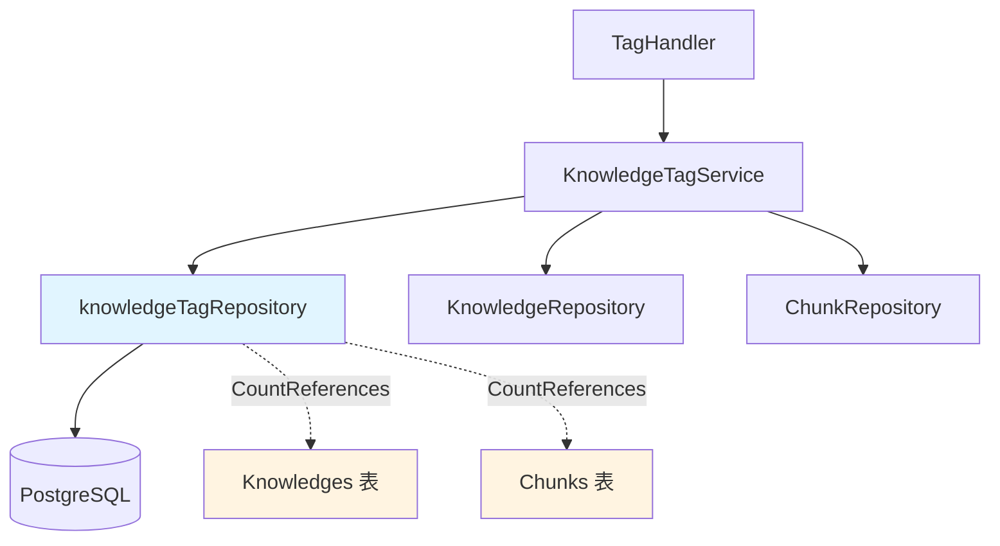

# Tagging and Reference Count Repositories 模块深度解析

## 概述：为什么需要这个模块？

想象一下你正在管理一个大型知识库系统，里面有成千上万的文档和文档片段（chunks）。用户希望用标签来组织这些内容——就像给文件贴彩色便签一样直观。但这里有个棘手的问题：**当你想删除一个标签时，系统怎么知道有多少内容正在使用它？**

如果直接删除，可能会造成数据不一致——内容还在引用一个不存在的标签。如果每次都要遍历所有内容来统计引用数，性能会迅速恶化。这就是 `tagging_and_reference_count_repositories` 模块要解决的核心问题。

这个模块本质上是一个**带引用计数的标签持久化层**。它不仅要存储标签本身，还要高效地追踪每个标签被多少知识库条目（Knowledge）和片段（Chunk）所引用。这种设计让上层服务能够在删除标签前做出明智决策：是阻止删除、级联删除内容，还是仅解除关联。

## 架构设计



### 组件角色说明

**`knowledgeTagRepository`** 是模块的核心，它扮演着**数据访问守门人**的角色。这个结构体封装了所有与标签相关的数据库操作，但它的设计远不止简单的 CRUD：

1. **多租户隔离**：每个查询都强制带上 `tenant_id` 条件，确保租户间数据完全隔离
2. **双重 ID 系统**：同时支持 UUID（`id`）和自增整数（`seq_id`），前者用于内部一致性，后者用于外部 API 暴露
3. **引用计数优化**：通过 `BatchCountReferences` 方法，用单次聚合查询替代 N+1 次独立查询

**`tagCountResult`** 是一个内部辅助结构，专门用于接收 SQL `GROUP BY` 查询的结果。它的存在揭示了一个重要的设计决策：**批量操作优先**。当用户列出标签时，系统需要同时显示每个标签的引用数，如果用循环逐个查询，性能会随标签数量线性下降。

### 数据流向

典型的标签列表查询流程如下：

```
HTTP 请求 → TagHandler.ListTags → KnowledgeTagService.ListTags
    → knowledgeTagRepository.ListByKB (获取标签)
    → knowledgeTagRepository.BatchCountReferences (批量统计引用)
    → 合并结果返回 KnowledgeTagWithStats
```

这个流程的关键在于**两次数据库访问**：第一次获取标签元数据，第二次批量统计引用数。虽然看起来可以合并，但分离设计有其合理性——标签元数据和引用计数来自不同的表，且引用统计是昂贵的聚合操作，分离后可以更好地控制查询优化。

## 核心组件深度解析

### `knowledgeTagRepository`

这是模块的主要实现类，采用**仓库模式（Repository Pattern）**将数据访问逻辑与业务逻辑分离。

#### 设计意图

这个结构体的存在是为了解决一个常见的架构问题：**业务服务不应该直接操作数据库**。通过定义 `interfaces.KnowledgeTagRepository` 接口，上层服务只依赖抽象，不依赖具体实现。这带来了两个好处：

1. **可测试性**：可以用内存实现替换数据库实现进行单元测试
2. **可替换性**：如果未来需要更换 ORM 或数据库，只需修改这个文件

#### 关键方法分析

**`GetByIDs` 和 `GetBySeqIDs`**：
```go
func (r *knowledgeTagRepository) GetByIDs(ctx context.Context, tenantID uint64, ids []string) ([]*types.KnowledgeTag, error)
```

这两个方法体现了**批量友好**的设计哲学。注意参数中的 `ids []string`——它允许调用方一次性获取多个标签，而不是循环调用 `GetByID`。这种设计源于实际使用场景：当渲染标签列表时，前端可能需要同时获取几十个标签的详情。

空切片保护（`if len(ids) == 0`）是一个容易被忽视但重要的细节。如果没有这个检查，SQL 会生成 `IN ()` 语法错误。

**`ListByKB`**：
```go
func (r *knowledgeTagRepository) ListByKB(
    ctx context.Context,
    tenantID uint64,
    kbID string,
    page *types.Pagination,
    keyword string,
) ([]*types.KnowledgeTag, int64, error)
```

这个方法返回两个值：标签列表和总数。这种设计支持**分页 UI 的常见需求**——前端需要知道总共有多少条数据才能渲染正确的页码。实现上使用了两次查询：一次 `COUNT` 获取总数，一次 `SELECT` 获取数据。这是分页查询的标准做法，虽然增加了数据库往返次数，但避免了全表扫描。

关键词搜索使用 `LIKE '%keyword%'` 是双刃剑：它支持模糊匹配，但无法利用索引。对于小规模数据没问题，但如果标签数量达到百万级，需要考虑全文索引。

**`CountReferences` vs `BatchCountReferences`**：

这是模块的**核心创新点**。让我们对比一下两种实现：

```go
// 单次查询一个标签
func CountReferences(ctx, tenantID, kbID, tagID) (knowledgeCount, chunkCount, error)

// 批量查询多个标签
func BatchCountReferences(ctx, tenantID, kbID, tagIDs) (map[string]TagReferenceCounts, error)
```

`BatchCountReferences` 的实现展示了 SQL 聚合的威力：

```go
SELECT tag_id, COUNT(*) as count 
FROM knowledges 
WHERE tenant_id = ? AND knowledge_base_id = ? AND tag_id IN (?)
GROUP BY tag_id
```

这个查询的关键在于 `GROUP BY tag_id`——它一次性返回所有标签的计数，而不是为每个标签执行一次 `COUNT`。当处理 100 个标签时，这将数据库查询次数从 200 次（100 个知识计数 + 100 个片段计数）减少到 2 次。

**`DeleteUnusedTags`**：

这个方法展示了复杂的 SQL 子查询技巧：

```go
DELETE FROM knowledge_tags
WHERE id NOT IN (SELECT DISTINCT tag_id FROM knowledges WHERE ...)
AND   id NOT IN (SELECT DISTINCT tag_id FROM chunks WHERE ...)
```

这是一个**孤儿清理**操作。它删除那些没有被任何知识或片段引用的标签。注意子查询中的 `deleted_at IS NULL` 条件——这确保软删除的记录不被视为有效引用。

这个方法的调用场景通常是知识库删除或批量导入后的清理操作。返回值 `int64` 告诉调用方删除了多少标签，便于日志记录和监控。

### `tagCountResult`

这个内部结构看起来简单，但承载了重要的职责：

```go
type tagCountResult struct {
    TagID string `gorm:"column:tag_id"`
    Count int64  `gorm:"column:count"`
}
```

它专门用于接收 `BatchCountReferences` 的 SQL 查询结果。使用独立结构而不是直接映射到 `TagReferenceCounts` 的原因是：**SQL 返回的格式与业务模型不完全匹配**。SQL 返回的是扁平的 `(tag_id, count)` 对，而业务模型需要的是 `{KnowledgeCount, ChunkCount}` 结构。

这种中间结构的使用是一种**适配器模式**的变体——它在数据库层和业务层之间建立了一个转换缓冲区。

## 依赖关系分析

### 上游调用者

| 调用方 | 依赖关系 | 期望 |
|--------|----------|------|
| [`KnowledgeTagService`](application_services_and_orchestration.md) | 直接依赖 | 需要原子性的 CRUD 操作和高效的批量统计 |
| [`TagHandler`](http_handlers_and_routing.md) | 间接依赖（通过 Service） | 需要分页列表、创建、更新、删除标签的 HTTP 端点 |

`KnowledgeTagService` 是仓库的主要消费者。它组合了多个仓库（`KnowledgeTagRepository`、`KnowledgeRepository`、`ChunkRepository`）来完成复杂的业务操作。例如，删除标签时，服务需要先检查引用数，然后决定是否级联删除内容。

### 下游被调用者

| 被调用方 | 依赖关系 | 契约 |
|----------|----------|------|
| `gorm.DB` | 直接依赖 | 提供 SQL 查询构建和执行能力 |
| [`types.KnowledgeTag`](core_domain_types_and_interfaces.md) | 直接依赖 | 标签数据模型，必须与数据库表结构匹配 |
| [`types.Knowledge`](core_domain_types_and_interfaces.md) | 间接依赖（通过查询） | 知识表，用于统计引用数 |
| [`types.Chunk`](core_domain_types_and_interfaces.md) | 间接依赖（通过查询） | 片段表，用于统计引用数 |

仓库与 GORM 的耦合是**有意为之**的。GORM 提供了类型安全的查询构建、自动参数绑定、连接池管理等基础设施。如果未来需要更换 ORM，这个模块是主要的修改点。

### 数据契约

仓库方法遵循严格的**多租户契约**：几乎所有方法都要求 `tenantID` 参数，并在 SQL 中强制添加 `WHERE tenant_id = ?` 条件。这是一个安全边界——如果某个方法忘记添加这个条件，会导致租户间数据泄露。

另一个重要契约是**软删除感知**。`DeleteUnusedTags` 方法在子查询中检查 `deleted_at IS NULL`，这意味着它知道系统中存在软删除机制。如果未来改为硬删除，这个方法需要相应修改。

## 设计决策与权衡

### 1. 双重 ID 系统：UUID + 自增整数

**决策**：`KnowledgeTag` 同时拥有 `ID`（UUID）和 `SeqID`（自增整数）。

**原因**：
- `ID` 用于内部关联，避免暴露数据库自增序列
- `SeqID` 用于外部 API，更短、更易读、更适合 URL

**权衡**：增加了存储开销和查询复杂度（需要维护两个索引），但提升了 API 的可用性和安全性。

### 2. 引用计数延迟计算

**决策**：不在 `KnowledgeTag` 表中存储引用计数，而是每次查询时动态计算。

**原因**：
- 避免数据不一致——如果计数缓存与实际情况不同步，会导致严重问题
- 引用统计是读操作，而标签关联是写操作，读多写少场景下动态计算更可靠

**权衡**：每次列表查询需要额外的聚合查询，但保证了数据一致性。如果性能成为瓶颈，可以考虑物化视图或缓存层。

### 3. 批量操作优先

**决策**：提供 `GetByIDs`、`GetBySeqIDs`、`BatchCountReferences` 等批量方法。

**原因**：实际使用中，标签操作很少是单次的。列表页面需要同时获取多个标签的详情和统计信息。

**权衡**：增加了代码复杂度（需要处理空切片、结果映射等边界情况），但显著减少了数据库往返次数。

### 4. 分页查询的两次查询策略

**决策**：`ListByKB` 分别执行 `COUNT` 和 `SELECT` 查询。

**原因**：前端需要总记录数来渲染分页控件。虽然可以使用窗口函数在一次查询中获取总数，但那会降低查询优化器的灵活性。

**权衡**：增加了数据库负载，但获得了更好的查询可预测性和优化空间。

## 使用指南

### 基本用法

```go
// 创建仓库实例
repo := repository.NewKnowledgeTagRepository(db)

// 创建标签
tag := &types.KnowledgeTag{
    ID:            uuid.New().String(),
    TenantID:      123,
    KnowledgeBaseID: "kb-456",
    Name:          "重要文档",
    Color:         "#FF5733",
    SortOrder:     1,
}
err := repo.Create(ctx, tag)

// 批量获取标签
tags, err := repo.GetByIDs(ctx, 123, []string{"tag-1", "tag-2", "tag-3"})

// 统计引用数
knowledgeCount, chunkCount, err := repo.CountReferences(ctx, 123, "kb-456", "tag-1")

// 批量统计（推荐用于列表场景）
counts, err := repo.BatchCountReferences(ctx, 123, "kb-456", []string{"tag-1", "tag-2"})
// counts["tag-1"].KnowledgeCount
// counts["tag-1"].ChunkCount

// 清理未使用的标签
deletedCount, err := repo.DeleteUnusedTags(ctx, 123, "kb-456")
```

### 分页列表查询

```go
page := &types.Pagination{Page: 1, PageSize: 20}
tags, total, err := repo.ListByKB(ctx, 123, "kb-456", page, "搜索关键词")

// 构建带统计信息的响应
tagIDs := make([]string, len(tags))
for i, t := range tags {
    tagIDs[i] = t.ID
}
counts, _ := repo.BatchCountReferences(ctx, 123, "kb-456", tagIDs)

var result []types.KnowledgeTagWithStats
for _, tag := range tags {
    stats := types.KnowledgeTagWithStats{
        KnowledgeTag: *tag,
        KnowledgeCount: counts[tag.ID].KnowledgeCount,
        ChunkCount:     counts[tag.ID].ChunkCount,
    }
    result = append(result, stats)
}
```

### 配置选项

本模块没有独立的配置项，但以下系统配置会影响其行为：

| 配置项 | 影响 |
|--------|------|
| 数据库连接池大小 | 影响并发查询性能 |
| GORM 日志级别 | 影响 SQL 调试能力 |
| 事务隔离级别 | 影响引用计数的一致性 |

## 边界情况与注意事项

### 1. 空切片处理

所有接受切片参数的方法（`GetByIDs`、`GetBySeqIDs`、`BatchCountReferences`）都会检查空切片并提前返回。调用方不需要预先检查，但应该理解返回值的语义：

- `GetByIDs([])` 返回 `[]*KnowledgeTag{}`（空切片，非 nil）
- `BatchCountReferences([])` 返回 `map[string]TagReferenceCounts{}`（空 map）

### 2. 租户隔离的强制性

**永远不要**在查询中省略 `tenantID` 参数。虽然 Go 编译器不会阻止你传递错误的租户 ID，但这会导致严重的数据泄露。建议在 Service 层统一提取租户 ID，而不是在每个 Repository 调用时传递。

### 3. 引用计数的最终一致性

`CountReferences` 和 `BatchCountReferences` 返回的是**查询时刻的快照**。如果在统计后、删除前有新内容引用了标签，可能会导致误删。解决方案是在事务中执行统计和删除，或者使用乐观锁。

### 4. 软删除的隐式契约

`DeleteUnusedTags` 方法假设 `Knowledges` 和 `Chunks` 表使用 `deleted_at` 字段进行软删除。如果未来改为硬删除，这个方法会产生错误结果。建议在方法注释中明确记录这个假设。

### 5. 模糊搜索的性能陷阱

`ListByKB` 的关键词搜索使用 `LIKE '%keyword%'`，这会导致全表扫描。当标签数量超过 10 万时，建议：
- 限制关键词搜索的使用场景（如仅管理员可用）
- 添加前缀索引 `LIKE 'keyword%'`
- 或引入全文索引（如 PostgreSQL 的 `tsvector`）

### 6. 事务边界

仓库方法本身不开启事务，它们假设调用方会管理事务边界。这意味着：

```go
// 错误示例：两个独立的事务
repo.Create(ctx, tag1)
repo.Create(ctx, tag2)  // 如果这里失败，tag1 已经提交

// 正确示例：显式事务
tx := db.Begin()
repo.Create(ctx, tag1)  // 使用 tx 而不是 db
repo.Create(ctx, tag2)
tx.Commit()
```

## 扩展点

### 添加新的统计维度

如果需要统计其他引用类型（如 FAQ 条目），可以遵循 `BatchCountReferences` 的模式：

```go
func (r *knowledgeTagRepository) BatchCountFAQReferences(
    ctx context.Context,
    tenantID uint64,
    kbID string,
    tagIDs []string,
) (map[string]int64, error) {
    var counts []tagCountResult
    err := r.db.WithContext(ctx).
        Model(&types.FAQEntry{}).
        Select("tag_id, COUNT(*) as count").
        Where("tenant_id = ? AND knowledge_base_id = ? AND tag_id IN (?)", tenantID, kbID, tagIDs).
        Group("tag_id").
        Find(&counts).Error
    // ... 结果映射
}
```

### 添加缓存层

如果引用统计成为性能瓶颈，可以在 Service 层添加缓存：

```go
func (s *knowledgeTagService) ListTags(ctx, kbID, page, keyword) {
    // 先尝试从缓存获取统计信息
    counts, hit := s.cache.GetTagCounts(kbID)
    if !hit {
        counts, _ = s.repo.BatchCountReferences(ctx, tenantID, kbID, tagIDs)
        s.cache.SetTagCounts(kbID, counts, 5*time.Minute)
    }
    // ...
}
```

注意缓存失效策略——当标签关联发生变化时，需要使缓存失效。

## 相关模块

- [`KnowledgeTagService`](application_services_and_orchestration.md) — 使用本仓库的业务服务层
- [`TagHandler`](http_handlers_and_routing.md) — 暴露标签管理 HTTP 端点
- [`KnowledgeRepository`](data_access_repositories.md) — 知识库记录持久化，与标签有外键关联
- [`ChunkRepository`](data_access_repositories.md) — 片段记录持久化，与标签有外键关联

## 总结

`tagging_and_reference_count_repositories` 模块是一个设计精良的数据访问层，它在简单 CRUD 之上增加了引用计数这一关键能力。其核心设计哲学是**批量优先、一致性优先、多租户隔离优先**。

对于新加入的开发者，理解这个模块的关键在于认识到：**标签不是孤立的数据，它是内容组织的元数据，必须与内容保持一致性**。所有的引用计数、孤儿清理、批量查询设计，都是围绕这个核心洞察展开的。
