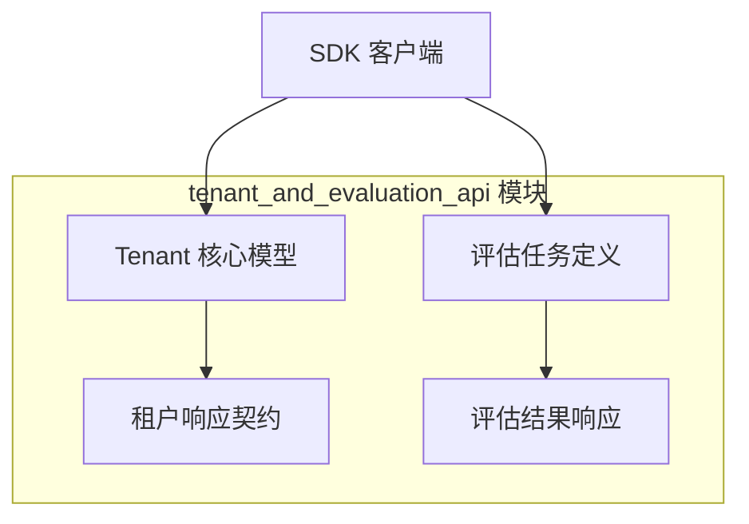

# tenant_and_evaluation_api 模块技术文档

## 概述

`tenant_and_evaluation_api` 模块是 SDK 客户端库的核心组件之一，它为开发者提供了两套关键功能的 API 接口：**多租户管理**和**模型评估能力**。

想象一下，你正在构建一个支持多团队协作的 AI 平台。不同的团队需要隔离的工作空间（租户），同时你又需要一种方法来系统地测试和比较不同 AI 模型的性能。这正是本模块解决的问题：它既是"工作空间管理员"，又是"模型性能评测师"。

本模块通过简洁的 API 接口，让开发者能够：
- 创建、查询、更新和删除租户，配置每个租户的检索引擎和存储配额
- 启动模型评估任务，跟踪任务进度，并获取详细的性能指标

## 架构概览

该模块采用了清晰的数据模型与 API 契约分离的设计。每个功能域（租户管理和评估）都有自己的核心数据模型和对应的响应结构，这种分离使得 API 演进时能够保持向后兼容性。

从数据流向来看：
1. 对于租户管理操作，请求从客户端发出，携带 `Tenant` 模型数据，经过 API 处理后返回 `TenantResponse` 或 `TenantListResponse`
2. 对于评估操作，`EvaluationRequest` 启动任务，返回 `EvaluationTask`，随后可以通过任务 ID 查询 `EvaluationResult`

## 核心设计决策

### 1. 租户模型的完整性与灵活性权衡
`Tenant` 结构体包含了从基本信息（名称、描述）到配置（检索引擎）再到资源管理（存储配额）的完整字段集。

**选择理由**：虽然这使得结构体较大，但它确保了租户概念的内聚性——所有与租户相关的信息都在一个地方。特别是 `RetrieverEngines` 作为嵌套 JSON 字段的设计，既保持了数据库层面的简单性，又提供了配置的灵活性。

**权衡**：这种设计意味着更新租户的任何部分都需要操作整个对象，可能会增加一些网络开销，但换来的是 API 的简洁性和一致性。

### 2. 评估任务的异步设计
评估功能采用了"启动任务-轮询结果"的模式，而不是同步返回结果。

**选择理由**：模型评估通常是耗时操作，可能涉及大量数据处理和模型推理。异步设计避免了长时间阻塞请求，提高了系统的响应性和可伸缩性。

**权衡**：客户端需要实现轮询逻辑来获取结果，增加了客户端的复杂度。但这是分布式系统中处理长时间运行任务的标准模式，也是最可靠的选择。

### 3. API 响应结构的标准化
所有 API 响应都遵循统一的结构：`{success: bool, data: ...}`。

**选择理由**：这种标准化使得客户端可以用统一的方式处理所有响应，简化了错误处理和响应解析逻辑。无论请求成功还是失败，客户端都能以一致的方式解读响应。

## 子模块概览

### tenant_core_models_and_retrieval_config
该子模块定义了租户数据模型和检索引擎配置。它包含 `Tenant`、`RetrieverEngines` 和 `RetrieverEngineParams` 等核心结构，是整个租户管理功能的基础。

[详细文档](sdk_client_library-tenant_and_evaluation_api-tenant_core_models_and_retrieval_config.md)

### tenant_response_contracts
该子模块定义了租户 API 的响应契约，包括 `TenantResponse` 和 `TenantListResponse`。这些结构确保了 API 响应的一致性和可预测性。

[详细文档](sdk_client_library-tenant_and_evaluation_api-tenant_response_contracts.md)

### evaluation_task_definition_and_request
该子模块定义了评估任务的核心数据结构和请求格式，包括 `EvaluationTask` 和 `EvaluationRequest`。它是评估功能的起点，定义了如何启动和描述一个评估任务。

[详细文档](sdk_client_library-tenant_and_evaluation_api-evaluation_task_definition_and_request.md)

### evaluation_result_and_task_responses
该子模块定义了评估结果和任务响应的结构，包括 `EvaluationResult`、`EvaluationTaskResponse` 和 `EvaluationResultResponse`。它提供了获取和解读评估结果的标准方式。

[详细文档](sdk_client_library-tenant_and_evaluation_api-evaluation_result_and_task_responses.md)

## 跨模块依赖

`tenant_and_evaluation_api` 模块在整个 SDK 架构中处于相对独立的位置，主要依赖于 `core_client_runtime` 模块提供的基础 HTTP 客户端功能。

它与其他模块的关系：
- 被 `agent_session_and_message_api` 间接使用，因为会话操作通常需要租户上下文
- 与 `model_api` 模块协同工作，因为评估功能需要引用模型 ID
- 为 `knowledge_base_api` 提供租户隔离支持

## 使用指南与注意事项

### 租户管理的最佳实践
1. **存储配额管理**：默认存储配额为 10GB，创建租户时应根据实际需求调整
2. **检索引擎配置**：`RetrieverEngines` 是 JSON 类型字段，更新时需确保格式正确
3. **API Key 安全**：`Tenant` 结构体包含 `APIKey` 字段，日志记录或序列化时需注意脱敏

### 评估任务的注意事项
1. **异步特性**：启动评估任务后，需要通过轮询 `GetEvaluationResult` 来获取最终结果
2. **错误处理**：检查 `EvaluationTask` 和 `EvaluationResult` 中的 `ErrorMsg` 字段以了解失败原因
3. **进度跟踪**：使用 `Progress` 字段（0-100）来向用户展示任务进度

### 常见陷阱
- 不要假设所有租户操作都会立即生效，特别是涉及资源配额变更时
- 评估任务的 `Metrics` 字段是灵活的 `map[string]float64` 类型，具体键值取决于评估配置
- 更新租户时，建议先获取当前租户对象，修改后再提交更新，以避免意外覆盖字段
