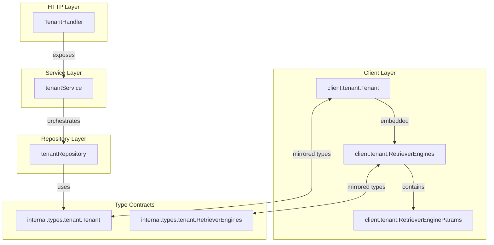

# tenant_core_models_and_retrieval_config 模块深度解析

## 概述：多租户系统的核心身份与检索配置

想象你正在运营一个 SaaS 知识库平台，多个公司（租户）使用同一套基础设施，但每个公司需要：
- **隔离的数据和资源配额**
- **独立的检索策略配置**（有的用向量检索，有的用关键词检索，有的混合使用）
- **独立的认证凭据**

`tenant_core_models_and_retrieval_config` 模块正是为了解决这个问题而存在。它定义了系统中**租户（Tenant）**的核心数据模型，以及每个租户如何配置其**检索引擎（Retriever Engines）**。

这个模块的关键设计洞察在于：**检索配置不是全局的，而是租户级别的**。不同租户可能有完全不同的检索需求——一个法律事务所可能需要高精度的向量检索，而一个电商客服系统可能更依赖关键词匹配。将 `RetrieverEngines` 嵌入 `Tenant` 模型中，使得每个租户可以独立配置其检索策略，而无需修改全局配置或部署多套系统。

从架构角色来看，这个模块是**数据契约层**——它不实现业务逻辑，而是定义了整个多租户系统的身份边界和检索能力的"形状"。上层的服务层（如 [`tenantService`](internal/application/service/tenant/tenantService.go)）和持久层（如 [`tenantRepository`](internal/application/repository/tenant/tenantRepository.go)）都依赖这些模型来传递数据。

---

## 架构与数据流



### 组件角色说明

| 组件 | 职责 | 设计意图 |
|------|------|----------|
| `Tenant` | 租户主模型，包含身份、配额、检索配置 | 作为多租户系统的**身份边界**，所有资源（知识库、会话、模型）都归属于某个租户 |
| `RetrieverEngines` | 检索引擎集合的包装器 | 提供一层抽象，使得未来可以扩展元数据（如默认引擎、优先级）而不改变 `Tenant` 结构 |
| `RetrieverEngineParams` | 单个检索引擎的配置参数 | 最小配置单元，采用**类型 + 实现**的双层设计，支持同一检索类型的不同实现 |

### 数据流动路径

**写入路径（创建/更新租户）**：
```
HTTP Handler → Service → Repository → Database
     ↓           ↓          ↓            ↓
  Tenant     Tenant    Tenant      Tenant (with
  (client)   (types)  (repository)  JSON-encoded
                              RetrieverEngines)
```

**读取路径（获取租户配置）**：
```
Database → Repository → Service → Handler → Client
   ↓          ↓          ↓         ↓         ↓
JSON     Tenant      Tenant    Tenant   Tenant
parse    (types)    (service) (handler) (client)
```

关键点：`RetrieverEngines` 字段在数据库中以 **JSON 类型**存储（见 GORM tag `gorm:"type:json"`），这意味着：
- ✅ 灵活：可以动态添加新的检索引擎类型而无需迁移数据库 schema
- ⚠️ 代价：失去数据库层面的类型约束和索引能力，验证逻辑必须上移到应用层

---

## 组件深度解析

### `Tenant` 结构体

**设计目的**：作为多租户系统的核心身份模型，`Tenant` 不仅仅是一个"客户记录"，它是**资源隔离、配额管理、检索配置的容器**。

```go
type Tenant struct {
    ID             uint64         `yaml:"id" json:"id" gorm:"primaryKey"`
    Name           string         `yaml:"name" json:"name"`
    Description    string         `yaml:"description" json:"description"`
    APIKey         string         `yaml:"api_key" json:"api_key"`
    Status         string         `yaml:"status" json:"status" gorm:"default:'active'"`
    RetrieverEngines RetrieverEngines `yaml:"retriever_engines" json:"retriever_engines" gorm:"type:json"`
    Business       string         `yaml:"business" json:"business"`
    StorageQuota   int64          `yaml:"storage_quota" json:"storage_quota" gorm:"default:10737418240"`
    StorageUsed    int64          `yaml:"storage_used" json:"storage_used" gorm:"default:0"`
    CreatedAt      time.Time      `yaml:"created_at" json:"created_at"`
    UpdatedAt      time.Time      `yaml:"updated_at" json:"updated_at"`
}
```

#### 字段设计意图

| 字段 | 类型 | 设计考量 |
|------|------|----------|
| `ID` | `uint64` | 使用无符号整数而非 UUID，权衡：更小的索引体积、更好的数据库性能，但牺牲了一定的安全性（ID 可猜测） |
| `APIKey` | `string` | **安全敏感字段**。注意这里直接存储在模型中，实际使用时应确保：(1) 数据库加密 (2) 日志脱敏 (3) 仅创建时返回一次 |
| `Status` | `string` | 使用字符串枚举（如 `"active"`, `"inactive"`）而非布尔值，为未来扩展预留空间（如 `"suspended"`, `"pending_deletion"`） |
| `RetrieverEngines` | `RetrieverEngines` | **核心设计点**：嵌入而非外键关联。这意味着检索配置是租户的"值对象"，而非独立实体 |
| `StorageQuota` | `int64` | 字节为单位，默认 10GB（`10737418240`）。使用 `int64` 而非 `float` 避免精度问题 |
| `StorageUsed` | `int64` | 需要与 `StorageQuota` 保持一致的单位。注意：这是一个**派生字段**，应在资源变更时同步更新，而非实时计算 |

#### 关键设计决策

**为什么 `RetrieverEngines` 是嵌入结构而非外键关联？**

这是一个典型的**聚合根（Aggregate Root）**设计模式。`Tenant` 是聚合根，`RetrieverEngines` 是其内部值对象。选择嵌入的原因：

1. **生命周期一致**：检索引擎配置没有独立于租户的生命周期——租户删除时，配置也随之删除
2. **读取模式优化**：获取租户信息时，几乎总是需要同时获取其检索配置。嵌入避免了 JOIN 查询
3. **事务边界清晰**：更新租户配置时，不需要跨表事务

代价是：
- 无法独立查询"使用向量检索的所有租户"（需要 JSON 提取，性能较差）
- 配置变更时需要序列化整个 `Tenant` 对象

**`StorageQuota` 和 `StorageUsed` 的陷阱**

这两个字段看起来简单，但存在**一致性风险**：

```go
// ❌ 错误模式：在多个地方更新 StorageUsed
tenant.StorageUsed += chunkSize
tenantRepo.Update(tenant)

// ✅ 正确模式：通过领域服务或仓库方法原子更新
tenantRepo.IncrementStorageUsed(tenantID, chunkSize)
```

如果系统在多个地方（知识上传、文件删除、租户迁移）都直接修改 `StorageUsed`，很容易出现**竞态条件**导致配额计算错误。建议在实际实现中，通过 [`tenantRepository`](internal/application/repository/tenant/tenantRepository.go) 提供原子操作方法。

---

### `RetrieverEngines` 结构体

```go
type RetrieverEngines struct {
    Engines []RetrieverEngineParams `json:"engines"`
}
```

**设计目的**：作为 `RetrieverEngineParams` 的集合包装器。

你可能会问：**为什么不直接用 `[]RetrieverEngineParams`？**

这是一个**预留扩展点**的设计。今天 `RetrieverEngines` 只包含 `Engines` 数组，但未来可能需要：

```go
type RetrieverEngines struct {
    Engines       []RetrieverEngineParams `json:"engines"`
    DefaultEngine string                  `json:"default_engine"`  // 默认使用的引擎类型
    FallbackOrder []string                `json:"fallback_order"`  // 降级顺序
}
```

如果直接用切片，未来添加这些字段就需要修改 `Tenant` 结构体，导致数据库迁移和 API 变更。通过包装器，可以在不改变 `Tenant` 的前提下扩展功能。

这种模式类似于**防腐层（Anti-Corruption Layer）**——外部代码通过 `RetrieverEngines` 访问引擎列表，内部实现可以灵活变化。

---

### `RetrieverEngineParams` 结构体

```go
type RetrieverEngineParams struct {
    RetrieverType       string `json:"retriever_type"`        // 检索类型（如 keywords, vector）
    RetrieverEngineType string `json:"retriever_engine_type"` // 引擎实现类型（如 elasticsearch, milvus）
}
```

**设计目的**：定义单个检索引擎的配置参数。

#### 双层类型设计的意图

这里采用了**抽象类型 + 具体实现**的双层设计：

| 字段 | 示例值 | 含义 |
|------|--------|------|
| `RetrieverType` | `"vector"`, `"keywords"`, `"hybrid"` | **检索策略**——用什么算法检索 |
| `RetrieverEngineType` | `"elasticsearch"`, `"milvus"`, `"postgres"` | **技术实现**——用哪个后端存储 |

这种分离的好处：

1. **策略与实现解耦**：租户配置 `"vector"` 检索，但底层可以从 `milvus` 迁移到 `qdrant` 而不改变配置语义
2. **混合检索支持**：可以配置多个引擎，如同时启用 `keywords/elasticsearch` 和 `vector/milvus`，由上层服务决定如何融合结果

#### 使用示例

```json
{
  "retriever_type": "vector",
  "retriever_engine_type": "milvus"
}
```

```json
{
  "retriever_type": "keywords",
  "retriever_engine_type": "elasticsearch"
}
```

```json
{
  "retriever_type": "hybrid",
  "retriever_engine_type": "composite"
}
```

**注意**：当前设计**没有参数字段**（如向量维度、相似度阈值）。如果未来需要，有两种扩展方案：

1. **添加 `Config map[string]interface{}` 字段**（灵活但失去类型安全）
2. **使用继承/组合模式**，为不同引擎类型定义具体参数结构（类型安全但复杂）

当前选择是**YAGNI（You Aren't Gonna Need It）**——等真正需要时再扩展。

---

## 依赖关系分析

### 上游依赖（谁调用这个模块）

| 调用方 | 调用方式 | 期望契约 |
|--------|----------|----------|
| [`TenantHandler`](internal/handler/tenant/TenantHandler.go) | HTTP 请求解析/响应序列化 | `Tenant` 的 JSON tag 必须与 API 文档一致 |
| [`tenantService`](internal/application/service/tenant/tenantService.go) | 业务逻辑处理 | `RetrieverEngines` 必须可序列化/反序列化 |
| [`tenantRepository`](internal/application/repository/tenant/tenantRepository.go) | 数据库持久化 | GORM tag 必须与数据库 schema 匹配 |
| [`internal.types.tenant.Tenant`](internal/types/tenant/tenant.go) | 类型转换 | 字段名和类型必须兼容 |

### 下游依赖（这个模块调用谁）

这个模块本身是**数据模型层**，不主动调用其他组件。但它依赖：
- Go 标准库的 `encoding/json`（JSON 序列化）
- GORM 的 tag 解析（数据库映射）
- `gopkg.in/yaml.v3`（YAML 序列化，用于配置文件）

### 类型转换链路

系统中存在两套 `Tenant` 类型：
1. `client.tenant.Tenant`（SDK 客户端模型）
2. `internal.types.tenant.Tenant`（内部领域模型）

这两者必须保持**字段兼容**，否则在 Handler ↔ Service ↔ Repository 的转换链中会丢失数据。建议：
- 使用代码生成工具确保一致性
- 或在测试中添加"字段对齐"断言

---

## 设计权衡与决策

### 1. JSON 存储 vs 关联表

**选择**：`RetrieverEngines` 使用 JSON 类型存储

**权衡分析**：

| 维度 | JSON 存储 | 关联表 |
|------|-----------|--------|
| 灵活性 | ✅ 高——可动态添加字段 | ❌ 低——需要 schema 迁移 |
| 查询能力 | ❌ 弱——JSON 提取性能差 | ✅ 强——可索引、可 JOIN |
| 数据完整性 | ❌ 弱——无外键约束 | ✅ 强——数据库级验证 |
| 读取性能 | ✅ 高——单次查询 | ❌ 低——需要 JOIN |

**为什么选择 JSON**：检索配置是**低频写入、高频读取**的数据，且配置结构简单、变化频率低。JSON 存储的灵活性优势大于其查询劣势。

**风险**：如果未来需要"查询所有使用 milvus 的租户"，需要添加**生成列（Generated Column）**或**倒排索引**来优化。

### 2. API Key 直接存储

**选择**：`APIKey` 作为普通字段存储

**安全考量**：
- ⚠️ **不应在日志中打印完整 `Tenant` 对象**（需实现 `String()` 方法脱敏）
- ⚠️ **创建响应中返回后，不应再返回**（更新响应中应省略或掩码）
- ✅ 建议在数据库层面使用**加密列**或**应用层加密**

**改进建议**：
```go
type Tenant struct {
    // ...
    APIKeyHash string `json:"-"`  // 存储哈希值用于验证
    // APIKey 仅在创建时返回，不持久化
}
```

### 3. 配额字段的派生性质

**问题**：`StorageUsed` 是派生字段，但当前设计允许直接修改

**风险**：
```go
// 并发场景下可能丢失更新
// Goroutine 1: used = 100, add 50 → 150
// Goroutine 2: used = 100, add 30 → 130 (覆盖了 Goroutine 1 的更新)
```

**建议方案**：
1. 在 [`tenantRepository`](internal/application/repository/tenant/tenantRepository.go) 提供原子操作：
   ```go
   func (r *tenantRepository) AdjustStorageUsed(ctx context.Context, tenantID uint64, delta int64) error
   ```
2. 使用数据库的 `UPDATE ... SET storage_used = storage_used + ?` 语法

---

## 使用示例

### 创建租户并配置检索引擎

```go
tenant := &client.Tenant{
    Name:        "Acme Corp",
    Description: "Acme Corporation Knowledge Base",
    Business:    "Manufacturing",
    RetrieverEngines: client.RetrieverEngines{
        Engines: []client.RetrieverEngineParams{
            {
                RetrieverType:       "vector",
                RetrieverEngineType: "milvus",
            },
            {
                RetrieverType:       "keywords",
                RetrieverEngineType: "elasticsearch",
            },
        },
    },
    StorageQuota: 50 * 1024 * 1024 * 1024, // 50GB
}

created, err := client.CreateTenant(ctx, tenant)
if err != nil {
    // 处理错误
}

// 保存 API Key（仅在此处返回）
log.Printf("Tenant created with API Key: %s", created.APIKey)
```

### 更新检索配置

```go
tenant, err := client.GetTenant(ctx, tenantID)
if err != nil {
    // 处理错误
}

// 添加混合检索引擎
tenant.RetrieverEngines.Engines = append(tenant.RetrieverEngines.Engines, 
    client.RetrieverEngineParams{
        RetrieverType:       "hybrid",
        RetrieverEngineType: "composite",
    },
)

updated, err := client.UpdateTenant(ctx, tenant)
```

### 配额检查（服务层示例）

```go
func (s *tenantService) CheckStorageQuota(ctx context.Context, tenantID uint64, requiredBytes int64) error {
    tenant, err := s.repo.GetByID(ctx, tenantID)
    if err != nil {
        return err
    }
    
    available := tenant.StorageQuota - tenant.StorageUsed
    if requiredBytes > available {
        return fmt.Errorf("storage quota exceeded: need %d, available %d", requiredBytes, available)
    }
    return nil
}
```

---

## 边界情况与陷阱

### 1. 空检索引擎配置

**问题**：`RetrieverEngines.Engines` 为空切片 vs `nil`

```go
// 这两种情况在 JSON 序列化时行为不同
tenant1 := Tenant{RetrieverEngines: RetrieverEngines{Engines: []RetrieverEngineParams{}}}
tenant2 := Tenant{RetrieverEngines: RetrieverEngines{Engines: nil}}

// tenant1 → {"engines": []}
// tenant2 → {"engines": null} 或 {"engines": []}（取决于 omitempty）
```

**建议**：在 Service 层统一初始化：
```go
if tenant.RetrieverEngines.Engines == nil {
    tenant.RetrieverEngines.Engines = []RetrieverEngineParams{}
}
```

### 2. 检索引擎类型验证

**问题**：当前模型没有验证 `RetrieverType` 和 `RetrieverEngineType` 的有效性

```go
// ❌ 无效配置也能保存
tenant.RetrieverEngines.Engines = []RetrieverEngineParams{
    {RetrieverType: "magic", RetrieverEngineType: "unicorn"},
}
```

**建议**：在 Service 层添加验证：
```go
var validRetrieverTypes = map[string]bool{
    "vector": true, "keywords": true, "hybrid": true,
}

func validateRetrieverEngines(engines RetrieverEngines) error {
    for _, engine := range engines.Engines {
        if !validRetrieverTypes[engine.RetrieverType] {
            return fmt.Errorf("invalid retriever type: %s", engine.RetrieverType)
        }
    }
    return nil
}
```

### 3. 并发更新配额

如前所述，`StorageUsed` 的并发更新需要原子操作。参考 [`tenantRepository`](internal/application/repository/tenant/tenantRepository.go) 的实现，确保使用数据库级原子更新。

### 4. API Key 泄露风险

**不要**：
```go
log.Printf("Tenant: %+v", tenant)  // 会打印 API Key
```

**应该**：
```go
// 实现自定义 String() 方法
func (t *Tenant) String() string {
    return fmt.Sprintf("Tenant{ID: %d, Name: %s, APIKey: ***}", t.ID, t.Name)
}
```

---

## 扩展点

### 添加新的检索引擎参数

如果需要为特定引擎添加参数（如向量维度）：

```go
type RetrieverEngineParams struct {
    RetrieverType       string                 `json:"retriever_type"`
    RetrieverEngineType string                 `json:"retriever_engine_type"`
    Config              map[string]interface{} `json:"config,omitempty"`  // 新增
}
```

### 添加租户级检索策略

如果需要配置默认引擎或降级顺序：

```go
type RetrieverEngines struct {
    Engines       []RetrieverEngineParams `json:"engines"`
    DefaultIndex  int                      `json:"default_index"`  // 默认引擎索引
    FallbackOrder []int                    `json:"fallback_order"` // 降级顺序
}
```

### 添加租户特性开关

如果需要控制租户可用的功能：

```go
type Tenant struct {
    // ...
    Features map[string]bool `json:"features" gorm:"type:json"`  // 新增
}
```

---

## 相关模块参考

- **类型契约层**：[`internal/types/tenant`](internal/types/tenant/tenant.go) 定义了内部使用的 `Tenant` 类型，与 SDK 客户端模型保持兼容
- **持久化层**：[`tenantRepository`](internal/application/repository/tenant/tenantRepository.go) 实现租户的 CRUD 操作
- **业务逻辑层**：[`tenantService`](internal/application/service/tenant/tenantService.go) 封装租户相关的业务规则
- **HTTP 接口层**：[`TenantHandler`](internal/handler/tenant/TenantHandler.go) 暴露 REST API
- **检索引擎服务**：[`RetrieveEngineRegistry`](internal/application/service/retriever/registry/RetrieveEngineRegistry.go) 根据配置实例化具体的检索引擎

---

## 总结

`tenant_core_models_and_retrieval_config` 模块虽然代码量不大，但承载了多租户系统的**身份边界**和**检索配置**两个核心概念。理解这个模块的关键在于：

1. **`Tenant` 是聚合根**——它封装了租户的所有配置，包括检索引擎
2. **JSON 存储是权衡之选**——牺牲查询能力换取灵活性
3. **双层类型设计支持解耦**——`RetrieverType` 和 `RetrieverEngineType` 的分离为技术迁移预留空间
4. **安全敏感字段需特殊处理**——`APIKey` 的存储和返回需要谨慎设计

对于新加入的开发者，建议先阅读 [`tenantService`](internal/application/service/tenant/tenantService.go) 了解业务逻辑如何使用这些模型，再深入 [`tenantRepository`](internal/application/repository/tenant/tenantRepository.go) 理解持久化细节。
