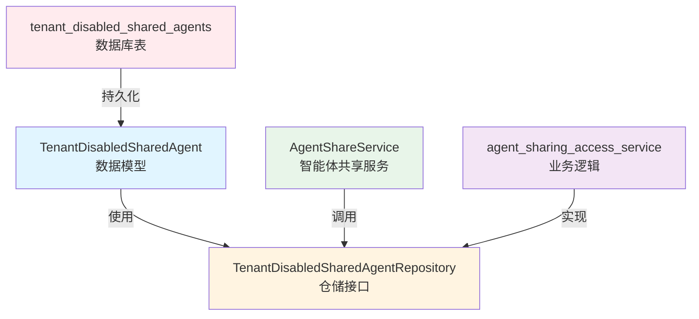

# 租户级共享智能体访问控制契约

## 概述

在一个多租户、支持组织间资源共享的系统中，当智能体被共享到组织后，每个租户可能希望对这些共享智能体有不同的可见性偏好。`tenant_level_shared_agent_access_control_contracts` 模块解决的核心问题是：**如何让租户能够自主控制哪些共享智能体出现在自己的对话下拉列表中，而不影响其他租户的体验**。

想象一下，你加入了一个有 50 个共享智能体的组织，但你日常只需要使用其中 5 个。这个模块就像是一个"智能体收藏夹管理器"——它不会删除或撤销共享权限，只是让你可以把不常用的智能体"藏起来"，让界面保持简洁。

## 核心概念与心智模型

### 关键抽象

本模块引入了两个核心抽象，每个都有专门的详细文档：

1. **`TenantDisabledSharedAgent`**：一个记录，表示"某个租户已经禁用了某个共享智能体"。这是一个事实记录，不是权限控制——禁用的智能体仍然可以通过其他方式访问，只是不会主动显示在下拉列表中。
   详细信息请参阅：[租户共享智能体禁用状态模型](core_domain_types_and_interfaces-identity_tenant_organization_and_configuration_contracts-organization_resource_sharing_and_access_control_contracts-tenant_level_shared_agent_access_control_contracts-tenant_shared_agent_disable_state_model.md)

2. **`TenantDisabledSharedAgentRepository`**：一个仓储接口，定义了如何持久化和查询这些禁用记录。
   详细信息请参阅：[租户共享智能体禁用仓储契约](core_domain_types_and_interfaces-identity_tenant_organization_and_configuration_contracts-organization_resource_sharing_and_access_control_contracts-tenant_level_shared_agent_access_control_contracts-tenant_shared_agent_disable_repository_contract.md)

### 心智模型

可以把这个模块想象成**智能体显示管理器**：
- 共享智能体就像是组织共享的"应用商店"里的应用
- 每个租户可以选择"不显示"某些应用（通过 `TenantDisabledSharedAgent` 记录）
- 这种选择是租户级别的，影响该租户下的所有用户
- 被"不显示"的应用仍然可以被搜索和使用，只是不会出现在默认的推荐列表中

## 架构与组件关系

### 组件架构图



### 数据模型设计

关于 `TenantDisabledSharedAgent` 结构体的详细设计和实现，请参阅：[租户共享智能体禁用状态模型](core_domain_types_and_interfaces-identity_tenant_organization_and_configuration_contracts-organization_resource_sharing_and_access_control_contracts-tenant_level_shared_agent_access_control_contracts-tenant_shared_agent_disable_state_model.md)

简要概述：
- 使用三元组 `(TenantID, AgentID, SourceTenantID)` 作为复合主键，确保每条记录的唯一性
- `SourceTenantID` 的存在使得系统可以区分不同租户创建的同名智能体
- 没有 `DeletedAt` 字段——禁用记录是硬删除的，因为这是一个简单的偏好设置，不需要历史记录

### 仓储接口设计

关于 `TenantDisabledSharedAgentRepository` 接口的详细契约和设计考虑，请参阅：[租户共享智能体禁用仓储契约](core_domain_types_and_interfaces-identity_tenant_organization_and_configuration_contracts-organization_resource_sharing_and_access_control_contracts-tenant_level_shared_agent_access_control_contracts-tenant_shared_agent_disable_repository_contract.md)

简要概述：
- `ListByTenantID`：查询某个租户禁用的所有智能体
- `ListDisabledOwnAgentIDs`：查询某个租户禁用的自己创建的智能体 ID 列表
- `Add`：添加一条禁用记录
- `Remove`：移除一条禁用记录（即重新启用智能体）

## 数据流程

### 典型使用场景：禁用一个共享智能体

1. **用户操作**：在界面上点击"隐藏此智能体"
2. **API 层**：`organization_shared_agent_access_handlers` 接收请求
3. **服务层**：`AgentShareService.SetSharedAgentDisabledByMe()` 被调用
4. **仓储层**：`TenantDisabledSharedAgentRepository.Add()` 持久化禁用记录
5. **数据库**：向 `tenant_disabled_shared_agents` 表插入一条记录

### 查询时的过滤流程

当用户打开对话下拉列表时：
1. 系统查询所有该用户可访问的共享智能体（通过 `AgentShareService.ListSharedAgents()`）
2. 同时查询该租户禁用的智能体列表（通过 `TenantDisabledSharedAgentRepository.ListByTenantID()`）
3. 在内存中进行差集运算，过滤掉被禁用的智能体
4. 将过滤后的列表返回给前端

## 设计决策与权衡

### 1. 租户级别的禁用 vs 用户级别的禁用

**决策**：选择租户级别的禁用。

**权衡分析**：
- ✅ 优点：对于企业租户来说，管理员可能希望统一控制所有员工看到的智能体列表，保持一致性
- ❌ 缺点：缺乏灵活性，同一租户内的不同用户不能有不同的偏好
- **为什么这样选**：从业务场景来看，组织共享的智能体通常是由管理员 curated 的，租户级别的控制更符合企业使用习惯

### 2. 硬删除 vs 软删除

**决策**：禁用记录使用硬删除。

**权衡分析**：
- ✅ 优点：简单高效，不需要维护历史记录，查询性能好
- ❌ 缺点：无法追溯"何时取消禁用"这类操作历史
- **为什么这样选**：这是一个偏好设置，不是关键业务数据，不需要审计历史。简单性优先。

### 3. 数据库过滤 vs 应用层过滤

**决策**：在应用层进行过滤。

**权衡分析**：
- ✅ 优点：仓储接口更简单，不需要复杂的 JOIN 查询，易于测试
- ❌ 缺点：需要查询更多数据到内存，在极端情况下可能有性能问题
- **为什么这样选**：一个租户禁用的智能体数量通常很少（几十条以内），应用层过滤的性能影响可以忽略不计，而带来的简单性收益更大

### 4. 复合主键设计

**决策**：使用 `(TenantID, AgentID, SourceTenantID)` 作为复合主键。

**权衡分析**：
- ✅ 优点：天然保证唯一性，不需要额外的唯一索引，查询效率高
- ❌ 缺点：必须同时知道三个 ID 才能操作一条记录，略微增加了调用方的复杂度
- **为什么这样选**：在多租户系统中，`AgentID` 只在其源租户内唯一，必须加上 `SourceTenantID` 才能全局唯一标识一个智能体。

## 与其他模块的关系

### 依赖关系

- **被依赖**：
  - [`agent_sharing_access_service`](application_services_and_orchestration-agent_identity_tenant_and_configuration_services-resource_sharing_and_access_services.md)：实现业务逻辑，调用仓储接口
  - [`organization_shared_agent_access_handlers`](http_handlers_and_routing-agent_tenant_organization_and_model_management_handlers-organization_shared_agent_access_handlers.md)：处理 HTTP 请求

- **依赖**：
  - 没有直接的代码依赖，是一个相对独立的契约模块

### 数据契约交互

这个模块与 [`agent_sharing_contracts`](core_domain_types_and_interfaces-identity_tenant_organization_and_configuration_contracts-organization_resource_sharing_and_access_control_contracts-agent_sharing_contracts.md) 模块紧密协作：
- `SharedAgentInfo` 结构体中有一个 `DisabledByMe` 字段，就是通过查询本模块的数据来填充的
- 当列出共享智能体时，系统会结合 `AgentShare` 和 `TenantDisabledSharedAgent` 数据来决定最终的显示列表

## 使用指南与注意事项

### 正确使用方式

1. **禁用智能体**：
   ```go
   // 假设 tenantID 是当前租户，agentID 是要禁用的智能体，sourceTenantID 是智能体的源租户
   err := repo.Add(ctx, tenantID, agentID, sourceTenantID)
   ```

2. **启用智能体**（即取消禁用）：
   ```go
   err := repo.Remove(ctx, tenantID, agentID, sourceTenantID)
   ```

3. **查询禁用列表**：
   ```go
   disabledAgents, err := repo.ListByTenantID(ctx, tenantID)
   ```

### 常见陷阱与注意事项

1. **不要忘记 `SourceTenantID`**：
   - 错误：只传 `TenantID` 和 `AgentID`
   - 正确：必须同时提供三个 ID，否则无法唯一标识一条记录

2. **禁用 ≠ 无权访问**：
   - 这是一个常见的误解。禁用只是让智能体不出现在下拉列表中，用户仍然可以通过其他方式（如直接输入 ID）访问它
   - 如果需要真正的权限控制，应该使用 `AgentShare` 相关的权限机制

3. **批量操作的性能考虑**：
   - `ListByTenantID` 会返回该租户禁用的所有智能体，如果数量很大，可能需要分页
   - 不过根据设计意图，这个数量通常很小，不需要分页

4. **事务一致性**：
   - 当删除一个 `AgentShare` 记录时，应该考虑级联删除对应的 `TenantDisabledSharedAgent` 记录（如果存在）
   - 否则数据库中会有孤立记录

## 扩展点与未来可能的演进

1. **用户级别的禁用**：未来可能需要增加 `UserID` 字段，支持更细粒度的控制
2. **禁用原因**：可以增加 `Reason` 字段，记录为什么禁用某个智能体
3. **批量操作**：可以增加 `AddBatch` 和 `RemoveBatch` 方法，提高批量操作的效率
4. **过期时间**：可以增加 `ExpiresAt` 字段，支持临时禁用智能体

## 总结

`tenant_level_shared_agent_access_control_contracts` 模块是一个小而美的设计，它解决了一个非常具体的用户体验问题：如何让租户在不影响共享权限的前提下，自定义自己的智能体显示列表。

这个模块的设计体现了几个重要的原则：
- **简单性**：只有两个核心组件，接口清晰明了
- **明确的边界**：只负责"显示控制"，不涉及"权限控制"
- **务实的权衡**：在性能、灵活性和简单性之间做出了符合业务场景的选择

对于新加入团队的开发者来说，理解这个模块的关键是记住：**它是一个显示偏好管理器，不是一个权限控制器**。
