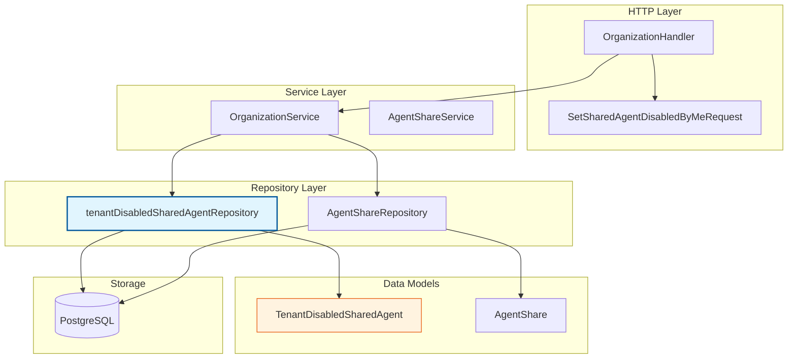

# tenant_level_shared_agent_access_control_repository 模块深度解析

## 概述：为什么需要这个模块？

想象一个多租户 SaaS 系统：租户 A 创建了一个强大的 Agent，并决定将其共享给整个平台的其他租户使用。这听起来很美好，但现实更复杂——租户 B 可能因为合规要求、安全策略或业务竞争等原因，**不希望自己的用户访问来自租户 A 的某个特定 Agent**。

这就是 `tenant_level_shared_agent_access_control_repository` 模块存在的根本原因。它实现了一个**租户级别的共享 Agent 禁用机制**，让每个租户能够精细控制哪些共享 Agent 可以在自己的边界内被访问。

这个模块的核心设计洞察是：**共享是双向的决策**。源租户决定"我想分享什么"，目标租户决定"我允许什么进入我的边界"。前者由 [`AgentShareRepository`](../data_access_repositories/agent_share_access_repository.md) 管理，后者正是本模块的职责。

如果没有这个模块，系统只能实现"要么全收，要么全拒"的粗粒度控制，这在企业级场景中是不可接受的。

---

## 架构与数据流



### 架构角色定位

本模块在系统中扮演**访问控制策略持久化层**的角色：

1. **上游调用者**：主要是 [`OrganizationService`](../application_services_and_orchestration/agent_identity_tenant_and_configuration_services.md)，它协调组织层面的资源共享逻辑
2. **下游依赖**：GORM 数据库连接，直接操作 `tenant_disabled_shared_agent` 表
3. **横向协作**：与 [`AgentShareRepository`](../data_access_repositories/agent_share_access_repository.md) 配合工作——一个管"谁分享了什么"，一个管"谁拒绝了什么"

### 数据流动路径

以"租户禁用某个共享 Agent"为例，完整的数据流如下：

```
用户请求 → OrganizationHandler.SetSharedAgentDisabledByMe() 
         → OrganizationService.DisableSharedAgentForTenant()
         → tenantDisabledSharedAgentRepository.Add(tenantID, agentID, sourceTenantID)
         → GORM INSERT INTO tenant_disabled_shared_agent ...
```

当系统需要过滤共享 Agent 列表时：

```
用户查询共享 Agent → AgentShareService.ListSharedAgents()
                   → AgentShareRepository.ListByOrganization()
                   → tenantDisabledSharedAgentRepository.ListByTenantID()
                   → 过滤掉禁用的 Agent
                   → 返回可用列表
```

---

## 核心组件深度解析

### `tenantDisabledSharedAgentRepository` 结构体

```go
type tenantDisabledSharedAgentRepository struct {
    db *gorm.DB
}
```

这是本模块唯一的实现类型，采用经典的**Repository 模式**。它的设计极其简洁——只有一个 `*gorm.DB` 依赖，这反映了它的单一职责：持久化租户级别的 Agent 禁用策略。

#### 设计选择：为什么是结构体而不是接口？

在代码中，`tenantDisabledSharedAgentRepository` 是具体实现，而接口定义在 [`internal/types/interfaces/organization`](../core_domain_types_and_interfaces/identity_tenant_organization_and_configuration_contracts.md) 包中。这种分离允许：
- 在服务层依赖接口，便于测试时注入 mock
- 在将来需要时替换实现（比如从 GORM 切换到原生 SQL）而不影响调用方

---

### 方法详解

#### `ListByTenantID(ctx context.Context, tenantID uint64) ([]*types.TenantDisabledSharedAgent, error)`

**目的**：获取某个租户禁用的所有共享 Agent 记录。

**内部机制**：
```go
err := r.db.WithContext(ctx).Where("tenant_id = ?", tenantID).Find(&list).Error
```

这是一个简单的单条件查询，但它返回的是完整的 `TenantDisabledSharedAgent` 记录，包含 `SourceTenantID` 字段。这个字段至关重要——它区分了"禁用来自租户 A 的 Agent X"和"禁用来自租户 B 的 Agent X"（即使 AgentID 相同，在不同租户下也是不同的实例）。

**使用场景**：当系统需要为某个租户构建"可用共享 Agent 列表"时，先获取所有共享 Agent，再用此方法的结果做差集过滤。

**返回值特点**：返回切片而非 map，调用方需要根据 `AgentID` 和 `SourceTenantID` 的组合自行构建快速查找结构。这是有意为之——Repository 层保持简单，复杂的数据转换交给 Service 层。

---

#### `ListDisabledOwnAgentIDs(ctx context.Context, tenantID uint64) ([]string, error)`

**目的**：获取租户禁用的**自己创建的**Agent ID 列表。

**内部机制**：
```go
err := r.db.WithContext(ctx).Model(&types.TenantDisabledSharedAgent{}).
    Where("tenant_id = ? AND source_tenant_id = ?", tenantID, tenantID).
    Pluck("agent_id", &ids).Error
```

**为什么需要这个特殊方法？**

这是一个微妙但重要的设计。考虑以下场景：
- 租户 A 创建了 Agent X
- 租户 A 将 Agent X 共享到组织 O
- 但租户 A 的某个管理员后来决定"在我们的租户边界内，不允许使用 Agent X"

这时 `tenant_id = source_tenant_id`，表示禁用记录针对的是"自己创建但已共享出去的 Agent"。这个查询帮助系统快速识别这类"自我禁用"的情况，通常用于：
- 在 Agent 管理界面显示"已禁用"状态
- 阻止已禁用自己的 Agent 被重新启用共享

**设计权衡**：这个方法的存在暗示了数据模型的一个潜在问题——为什么 `TenantDisabledSharedAgent` 不直接有一个布尔字段标记是否是"自我禁用"？答案是**保持数据模型的正交性**。`SourceTenantID` 已经足够表达这层语义，添加冗余字段会增加数据一致性的维护成本。

---

#### `Add(ctx context.Context, tenantID uint64, agentID string, sourceTenantID uint64) error`

**目的**：添加一条禁用记录。

**内部机制**：
```go
rec := &types.TenantDisabledSharedAgent{
    TenantID:       tenantID,
    AgentID:        agentID,
    SourceTenantID: sourceTenantID,
}
return r.db.WithContext(ctx).Where(rec).FirstOrCreate(rec).Error
```

**关键设计点：`FirstOrCreate` 而非 `Create`**

这是一个典型的**幂等性设计**。考虑以下并发场景：
1. 管理员 A 点击"禁用 Agent X"
2. 几乎同时，管理员 B 也点击了"禁用 Agent X"
3. 两个请求几乎同时到达服务器

如果使用 `Create`，第二个请求会因主键冲突而失败。使用 `FirstOrCreate`，两个请求都能成功完成，最终状态一致。

**潜在问题**：`FirstOrCreate` 依赖于 `Where` 条件中的所有字段来匹配现有记录。这里使用了完整的三字段组合，确保只有在完全相同的禁用记录已存在时才会复用。

---

#### `Remove(ctx context.Context, tenantID uint64, agentID string, sourceTenantID uint64) error`

**目的**：移除禁用记录，恢复对该共享 Agent 的访问。

**内部机制**：
```go
return r.db.WithContext(ctx).
    Where("tenant_id = ? AND agent_id = ? AND source_tenant_id = ?", tenantID, agentID, sourceTenantID).
    Delete(&types.TenantDisabledSharedAgent{}).Error
```

**注意**：这里显式指定了三个条件字段，而不是依赖结构体实例。这是 GORM 的最佳实践——避免因为结构体中其他字段的零值导致意外匹配。

---

## 数据模型：`TenantDisabledSharedAgent`

```go
type TenantDisabledSharedAgent struct {
    TenantID       uint64    `json:"tenant_id" gorm:"primaryKey"`
    AgentID        string    `json:"agent_id" gorm:"type:varchar(36);primaryKey"`
    SourceTenantID uint64    `json:"source_tenant_id" gorm:"primaryKey"`
    CreatedAt      time.Time `json:"created_at"`
}
```

### 复合主键的设计意图

这个表使用**三字段复合主键** `(tenant_id, agent_id, source_tenant_id)`，这是理解整个模块的关键。

**为什么需要 `SourceTenantID` 作为主键的一部分？**

考虑以下场景：
- 租户 A 创建了 Agent "data-processor"（ID: `agent-123`）
- 租户 B 也创建了 Agent "data-processor"（ID: `agent-123`，可能是相同的 UUID 生成算法）
- 租户 C 想禁用来自租户 A 的 "data-processor"，但允许租户 B 的版本

如果没有 `SourceTenantID`，系统无法区分这两个同 ID 的 Agent。复合主键确保了**租户 + 源租户 + Agent** 的三元组唯一性。

### 时间戳的缺失

注意模型中只有 `CreatedAt`，没有 `UpdatedAt` 或 `DeletedAt`。这是有意的设计：
- 禁用记录是**二元状态**（存在=禁用，不存在=启用），不需要更新
- 软删除 (`DeletedAt`) 会增加查询复杂度，而 `Remove` 方法的物理删除语义更清晰

---

## 依赖关系分析

### 上游依赖（谁调用本模块）

| 调用方 | 调用目的 | 依赖强度 |
|--------|----------|----------|
| [`OrganizationService`](../application_services_and_orchestration/agent_identity_tenant_and_configuration_services.md) | 协调租户级别的 Agent 访问控制策略 | 强依赖 |
| [`OrganizationHandler`](../http_handlers_and_routing/agent_tenant_organization_and_model_management_handlers.md) | 通过 Service 间接调用，处理 HTTP 请求 | 间接依赖 |

### 下游依赖（本模块调用谁）

| 被调用方 | 调用目的 | 替代可能性 |
|----------|----------|------------|
| GORM `*gorm.DB` | 执行 SQL 查询 | 可替换为其他 ORM 或原生 SQL |
| [`types.TenantDisabledSharedAgent`](../core_domain_types_and_interfaces/identity_tenant_organization_and_configuration_contracts.md) | 数据模型定义 | 固定契约，不应变更 |

### 横向协作模块

| 协作模块 | 协作方式 |
|----------|----------|
| [`AgentShareRepository`](../data_access_repositories/agent_share_access_repository.md) | 共享 Agent 列表需要同时查询两个 Repository，然后做差集 |
| [`CustomAgentRepository`](../data_access_repositories/custom_agent_configuration_repository.md) | 验证 AgentID 是否存在 |
| [`TenantRepository`](../data_access_repositories/tenant_management_repository.md) | 验证 TenantID 和 SourceTenantID 的有效性 |

---

## 设计决策与权衡

### 1. 显式 `SourceTenantID` vs 隐式推导

**选择**：在禁用记录中显式存储 `SourceTenantID`

**替代方案**：只存 `TenantID` 和 `AgentID`，查询时通过 `AgentShare` 表推导 `SourceTenantID`

**权衡分析**：
- **当前方案的优势**：查询简单高效，禁用决策完全独立于共享状态。即使 Agent 的共享关系发生变化，历史禁用记录仍然有效。
- **当前方案的劣势**：数据冗余。如果 Agent 的 `SourceTenantID` 发生变化（虽然不太可能），需要同步更新所有禁用记录。
- **为什么选择当前方案**：禁用是一个**独立的访问控制决策**，不应依赖于共享关系的动态变化。这符合"策略与状态分离"的原则。

### 2. 物理删除 vs 软删除

**选择**：`Remove` 方法执行物理删除

**替代方案**：使用 `DeletedAt` 字段进行软删除

**权衡分析**：
- **物理删除的优势**：查询无需过滤 `DeletedAt IS NULL`，索引更高效；数据量可控（禁用记录通常不多）
- **物理删除的劣势**：无法审计"谁在什么时候取消了禁用"
- **为什么选择物理删除**：本模块的核心用例是"当前哪些 Agent 被禁用"，而非"禁用历史"。如果需要审计，应在应用层记录操作日志，而非在数据模型中体现。

### 3. 三字段主键 vs 代理主键

**选择**：使用业务字段作为复合主键

**替代方案**：添加自增 ID 或 UUID 作为主键

**权衡分析**：
- **复合主键的优势**：天然防止重复插入；查询时直接利用主键索引
- **复合主键的劣势**：外键引用复杂；主键变更困难
- **为什么选择复合主键**：这个表本质上是**关联表**（连接 Tenant、Agent、SourceTenant 三者），复合主键最能表达其语义。且这个表不太可能被其他表外键引用。

---

## 使用指南与示例

### 基本使用模式

```go
// 1. 初始化 Repository（通常在应用启动时）
repo := repository.NewTenantDisabledSharedAgentRepository(db)

// 2. 禁用某个共享 Agent
err := repo.Add(ctx, tenantID, agentID, sourceTenantID)
if err != nil {
    // 处理错误
}

// 3. 获取租户的所有禁用记录
disabledList, err := repo.ListByTenantID(ctx, tenantID)
if err != nil {
    // 处理错误
}

// 4. 构建禁用 Agent 的快速查找集合
disabledSet := make(map[string]bool)
for _, rec := range disabledList {
    key := fmt.Sprintf("%s:%d", rec.AgentID, rec.SourceTenantID)
    disabledSet[key] = true
}

// 5. 过滤共享 Agent 列表
var availableAgents []*types.AgentShare
for _, share := range allShares {
    key := fmt.Sprintf("%s:%d", share.AgentID, share.SourceTenantID)
    if !disabledSet[key] {
        availableAgents = append(availableAgents, share)
    }
}

// 6. 恢复访问
err = repo.Remove(ctx, tenantID, agentID, sourceTenantID)
```

### 与 AgentShare 的协同查询

典型的业务场景是"获取租户可访问的所有共享 Agent"，这需要联合查询两个 Repository：

```go
// 伪代码示例
func GetAvailableSharedAgents(ctx context.Context, tenantID uint64) ([]*AgentShare, error) {
    // 1. 获取所有共享到该租户组织的 Agent
    allShares, err := agentShareRepo.ListByOrganization(ctx, orgID)
    
    // 2. 获取该租户的禁用列表
    disabled, err := disabledAgentRepo.ListByTenantID(ctx, tenantID)
    
    // 3. 构建禁用集合
    disabledSet := make(map[string]bool)
    for _, d := range disabled {
        disabledSet[d.AgentID+":"+strconv.Itoa(d.SourceTenantID)] = true
    }
    
    // 4. 过滤
    var available []*AgentShare
    for _, share := range allShares {
        key := share.AgentID + ":" + strconv.Itoa(share.SourceTenantID)
        if !disabledSet[key] {
            available = append(available, share)
        }
    }
    
    return available, nil
}
```

---

## 边界情况与注意事项

### 1. 并发添加同一禁用记录

虽然 `FirstOrCreate` 提供了幂等性，但在高并发场景下仍可能产生数据库锁竞争。如果预期会有大量并发禁用操作，考虑：
- 在应用层先检查是否存在
- 使用数据库的 `INSERT ... ON CONFLICT DO NOTHING` 语法（如果底层是 PostgreSQL）

### 2. 租户删除后的数据清理

当前实现**没有**自动清理机制。如果租户 A 被删除，所有 `tenant_id = A` 或 `source_tenant_id = A` 的记录会残留。这可能导致：
- 数据泄漏（虽然租户已删除，但禁用记录仍存）
- 查询性能下降

**建议**：在 [`TenantRepository`](../data_access_repositories/tenant_management_repository.md) 的删除操作中，添加级联删除逻辑，或通过定时任务清理孤儿记录。

### 3. Agent 删除后的数据清理

类似地，如果 Agent 被删除，相关的禁用记录不会自动清理。由于 `AgentID` 是字符串而非外键，数据库无法强制执行级联删除。

**建议**：在 [`CustomAgentRepository`](../data_access_repositories/custom_agent_configuration_repository.md) 的删除操作中，同步清理相关禁用记录。

### 4. 跨租户 Agent ID 冲突

虽然 UUID 理论上不会冲突，但如果系统支持 Agent ID 自定义（而非系统生成），可能出现不同租户创建相同 ID 的 Agent。复合主键设计已经考虑了这一点，但调用方必须确保传入正确的 `SourceTenantID`。

### 5. 查询性能优化

`ListByTenantID` 是高频查询，建议在数据库层面创建索引：

```sql
CREATE INDEX idx_tenant_disabled_agent_tenant_id 
ON tenant_disabled_shared_agent(tenant_id);
```

`ListDisabledOwnAgentIDs` 需要复合索引：

```sql
CREATE INDEX idx_tenant_disabled_agent_own 
ON tenant_disabled_shared_agent(tenant_id, source_tenant_id, agent_id);
```

---

## 扩展点与限制

### 可扩展的设计

1. **Repository 接口抽象**：服务层依赖 `interfaces.TenantDisabledSharedAgentRepository`，可以替换实现
2. **上下文传递**：所有方法接受 `context.Context`，支持超时控制和链路追踪

### 固有限制

1. **不支持禁用原因记录**：无法记录"为什么禁用这个 Agent"，如需此功能需扩展数据模型
2. **不支持临时禁用**：没有过期时间字段，禁用是永久性的（直到显式移除）
3. **不支持批量操作**：每次只能添加/移除一个禁用记录，批量操作需循环调用

---

## 相关模块参考

- [Agent Share Access Repository](agent_share_access_repository.md) — 管理 Agent 共享关系的持久化
- [Organization Service](agent_identity_tenant_and_configuration_services.md) — 组织层面的业务逻辑编排
- [Custom Agent Repository](custom_agent_configuration_repository.md) — Agent 配置的持久化
- [Tenant Repository](tenant_management_repository.md) — 租户管理的持久化

---

## 总结

`tenant_level_shared_agent_access_control_repository` 是一个设计简洁但语义丰富的模块。它通过一个三字段复合主键的数据模型，实现了多租户环境下精细的共享 Agent 访问控制。

核心设计哲学是**策略与状态分离**：禁用决策独立于共享状态存在，确保访问控制的稳定性和可预测性。这种设计牺牲了一定的数据简洁性，但换来了更高的系统鲁棒性。

对于新加入的开发者，理解这个模块的关键是把握三点：
1. **为什么需要 `SourceTenantID`** — 区分同 ID 但不同源的 Agent
2. **为什么用 `FirstOrCreate`** — 保证并发场景下的幂等性
3. **为什么物理删除** — 简化查询，聚焦当前状态而非历史

掌握这些设计意图后，你就能在这个模块的基础上进行扩展或优化，而不会破坏其核心设计原则。
