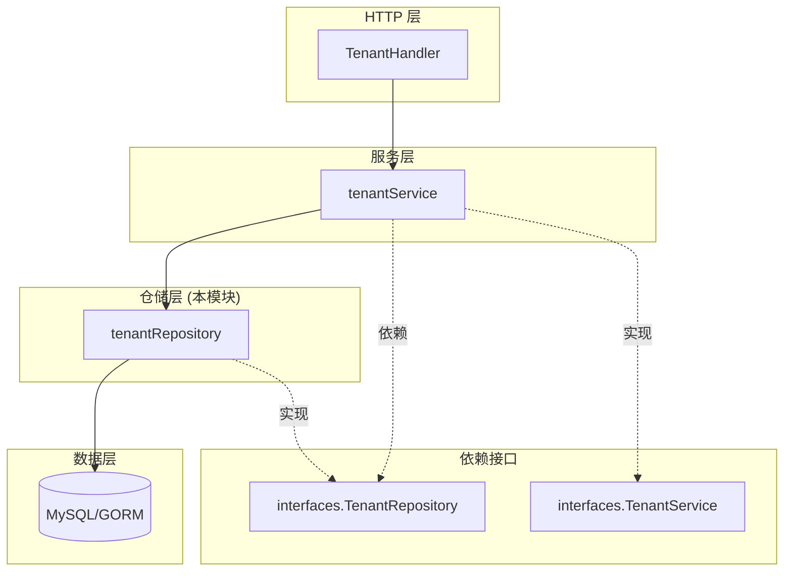

# tenant_management_repository 模块深度解析

## 概述：为什么需要这个模块

想象一下你正在运营一个多租户的 SaaS 知识库平台。每个租户（企业客户）都有自己独立的知识库、检索引擎配置、存储配额和使用量统计。`tenant_management_repository` 模块就是这个多租户架构的**数据持久化基石**。

这个模块解决的核心问题是：**如何在保证数据一致性和并发安全的前提下，高效地管理租户的生命周期和资源配置**。

为什么不能简单地用 CRUD 操作？因为租户管理有几个特殊挑战：

1. **存储配额的并发更新**：多个文档同时上传时，需要原子性地更新 `StorageUsed` 字段，否则会出现竞态条件导致统计错误
2. **软删除与关联约束**：删除租户前需要检查是否有关联的知识库，避免产生孤儿数据
3. **灵活搜索**：管理员需要按 ID 精确查找，也需要按名称/描述模糊搜索，还需要分页支持
4. **配置嵌套复杂**：租户包含检索引擎、Agent 配置、上下文配置等多个 JSON 字段，需要 ORM 正确序列化

这个模块采用**Repository 模式**，将数据访问逻辑封装在统一接口背后，使得上层服务无需关心底层是 MySQL、PostgreSQL 还是其他存储引擎。

---

## 架构定位与数据流

### 模块在系统中的位置



### 数据流追踪：以存储配额调整为例

当一个用户上传文档时，存储使用量的更新流程如下：

```
HTTP 请求 → TenantHandler → tenantService → tenantRepository.AdjustStorageUsed → GORM 事务 → MySQL
```

1. **Handler 层**：接收文件上传请求，解析租户身份（从 API Key）
2. **Service 层**：调用 `repo.AdjustStorageUsed(ctx, tenantID, delta)`
3. **Repository 层**：
   - 开启数据库事务
   - 使用 `SELECT ... FOR UPDATE` 悲观锁锁定租户记录
   - 读取当前 `StorageUsed`，加上增量 `delta`
   - 业务校验（不允许负值）
   - 保存并提交流程
4. **数据库层**：GORM 生成 SQL 并执行，确保原子性

这个设计的关键在于：**Repository 层封装了并发控制逻辑**，上层服务无需关心锁机制，只需声明"我要调整存储量"。

---

## 核心组件深度解析

### `tenantRepository` 结构体

```go
type tenantRepository struct {
    db *gorm.DB
}
```

这是典型的 Repository 模式实现。它只有一个依赖：`*gorm.DB`。这种极简设计有几个好处：

- **单一职责**：只负责数据持久化，不包含业务逻辑
- **易于测试**：可以用内存数据库或 mock 替换 `db`
- **依赖注入友好**：通过 `NewTenantRepository(db)` 构造函数注入

### 核心方法详解

#### 1. `AdjustStorageUsed` —— 并发安全的配额调整

```go
func (r *tenantRepository) AdjustStorageUsed(ctx context.Context, tenantID uint64, delta int64) error
```

**设计意图**：这是整个模块最复杂的方法，因为它需要处理并发写入。

**内部机制**：

```go
return r.db.WithContext(ctx).Transaction(func(tx *gorm.DB) error {
    var tenant types.Tenant
    // 使用悲观锁确保并发安全
    if err := tx.Clauses(clause.Locking{Strength: "UPDATE"}).First(&tenant, tenantID).Error; err != nil {
        return err
    }

    tenant.StorageUsed += delta
    // 保存更新并验证业务规则
    if tenant.StorageUsed < 0 {
        logger.Error(ctx, "tenant storage used is negative %s: %d", tenant.ID, tenant.StorageUsed)
        tenant.StorageUsed = 0
    }

    return tx.Save(&tenant).Error
})
```

这里的关键设计决策：

| 设计选择 | 为什么这样选 | 替代方案及权衡 |
|---------|------------|--------------|
| **悲观锁** (`SELECT FOR UPDATE`) | 存储配额是高频更新字段，乐观锁会导致大量重试 | 乐观锁（version 字段）适合低冲突场景，但这里多个文档可能同时上传 |
| **事务包裹** | 确保读取 - 计算 - 写入的原子性 | 不用事务会导致竞态条件 |
| **负值保护** | 防止 bug 导致存储量为负，记录日志并修正为 0 | 直接报错会让上层流程失败，这里选择"修复并继续" |

**调用场景**：
- 上传文档时：`delta = +文件大小`
- 删除文档时：`delta = -文件大小`
- 导入 FAQ 时：`delta = +生成的 chunk 总大小`

**注意事项**：
- 调用方必须传入正确的 `delta` 符号，Repository 层不判断是增加还是减少
- 如果租户不存在，`First()` 会返回错误，调用方需要处理

#### 2. `SearchTenants` —— 灵活的搜索与分页

```go
func (r *tenantRepository) SearchTenants(ctx context.Context, keyword string, tenantID uint64, page, pageSize int) ([]*types.Tenant, int64, error)
```

**设计意图**：为管理后台提供灵活的租户查询能力。

**查询逻辑**：

```go
if tenantID > 0 && keyword != "" {
    // 同时提供 ID 和关键词：OR 匹配（ID 精确 或 名称/描述模糊）
    query = query.Where("id = ? OR name LIKE ? OR description LIKE ?", tenantID, "%"+keyword+"%", "%"+keyword+"%")
} else if tenantID > 0 {
    // 仅提供 ID：精确匹配
    query = query.Where("id = ?", tenantID)
} else if keyword != "" {
    // 仅提供关键词：模糊匹配名称和描述
    query = query.Where("name LIKE ? OR description LIKE ?", "%"+keyword+"%", "%"+keyword+"%")
}
```

这个设计有一个**值得注意的权衡**：当同时提供 `tenantID` 和 `keyword` 时，使用 `OR` 而非 `AND`。这意味着：
- 如果 ID 匹配，即使关键词不匹配也会返回
- 这适合"我知道 ID 但想顺便搜一下相关租户"的场景
- 但如果需要"ID 匹配且关键词也匹配"，这个接口无法满足

**分页实现**：
```go
offset := (page - 1) * pageSize
query = query.Offset(offset).Limit(pageSize)
```

注意 `page` 从 1 开始计数，这是符合人类直觉的设计（第 1 页而非第 0 页）。

#### 3. `GetTenantByID` —— 错误语义化

```go
func (r *tenantRepository) GetTenantByID(ctx context.Context, id uint64) (*types.Tenant, error) {
    var tenant types.Tenant
    if err := r.db.WithContext(ctx).Where("id = ?", id).First(&tenant).Error; err != nil {
        if errors.Is(err, gorm.ErrRecordNotFound) {
            return nil, ErrTenantNotFound  // 返回自定义错误
        }
        return nil, err
    }
    return &tenant, nil
}
```

**设计意图**：将 GORM 的技术错误转换为业务语义错误。

上层服务可以通过 `errors.Is(err, ErrTenantNotFound)` 判断是"租户不存在"还是"数据库故障"，从而决定返回 404 还是 500。

#### 4. `CreateTenant` / `UpdateTenant` / `DeleteTenant` —— 标准 CRUD

这些方法直接委托给 GORM，没有额外逻辑。原因在于：
- 业务校验（如名称唯一性、配置合法性）应该在 Service 层
- Repository 层只负责"忠实持久化"

但有一个例外：`DeleteTenant` 没有检查关联的知识库。这个检查在 [`tenantService`](tenant_service.md) 中实现，因为：
- 需要查询 [`knowledgeBaseRepository`](knowledge_base_repository.md) 确认是否有依赖
- 这属于业务规则，而非数据访问逻辑

---

## 依赖关系分析

### 本模块依赖什么

| 依赖 | 类型 | 用途 |
|-----|------|-----|
| `internal/types.Tenant` | 数据模型 | 租户实体定义，包含所有字段和 JSON 标签 |
| `internal/types/interfaces.TenantRepository` | 接口 | 定义 Repository 契约，实现依赖倒置 |
| `gorm.io/gorm` | 外部库 | ORM 框架，处理 SQL 生成和对象映射 |
| `internal/logger` | 内部模块 | 记录异常日志（如存储量为负） |

### 什么依赖本模块

| 调用方 | 层级 | 调用内容 |
|-------|------|---------|
| [`tenantService`](tenant_service.md) | 服务层 | 所有 Repository 方法 |
| [`organizationService`](organization_service.md) | 服务层 | 间接通过 tenantService 访问租户信息 |
| [`knowledgeBaseService`](knowledge_base_service.md) | 服务层 | 查询租户的存储配额和检索引擎配置 |

### 数据契约：`Tenant` 模型

`Tenant` 是跨模块共享的核心数据结构，关键字段：

```go
type Tenant struct {
    ID               uint64           // 主键
    Name             string           // 租户名称
    APIKey           string           // API 认证密钥
    Status           string           // 状态（active/inactive）
    RetrieverEngines RetrieverEngines // JSON 字段：检索引擎配置
    StorageQuota     int64            // 存储配额（字节），默认 10GB
    StorageUsed      int64            // 已用存储（字节）
    AgentConfig      *AgentConfig     // 已弃用：Agent 配置
    ContextConfig    *ContextConfig   // 全局上下文配置
    WebSearchConfig  *WebSearchConfig // 全局 Web 搜索配置
    CreatedAt        time.Time        // 创建时间
    UpdatedAt        time.Time        // 更新时间
    DeletedAt        gorm.DeletedAt   // 软删除标记
}
```

**重要约定**：
- `StorageQuota` 和 `StorageUsed` 单位都是**字节**，调用方需要自行转换（如 GB → Bytes）
- `DeletedAt` 使用 GORM 软删除，`DeleteTenant` 实际上是标记删除而非物理删除
- JSON 字段（`RetrieverEngines`、`ContextConfig` 等）由 GORM 自动序列化，但需要注意 schema 变更的兼容性

---

## 设计决策与权衡

### 1. Repository 模式 vs Active Record

**选择**：Repository 模式（数据访问逻辑与模型分离）

**为什么**：
- `Tenant` 模型被多个服务共享（tenantService、knowledgeBaseService、organizationService）
- 如果使用 Active Record（模型直接包含 `Save()`、`Delete()` 方法），会导致循环依赖
- Repository 模式允许在接口层定义依赖方向，符合依赖倒置原则

**代价**：
- 需要额外编写接口和实现类
- 简单 CRUD 操作显得冗长

### 2. 悲观锁 vs 乐观锁

**选择**：悲观锁（`SELECT ... FOR UPDATE`）

**为什么**：
- 存储配额更新是**写多写多**场景（多个文档同时上传）
- 乐观锁在冲突频繁时会导致大量重试，性能反而更差
- 租户级别的锁粒度较粗，死锁风险低

**代价**：
- 高并发下可能成为瓶颈
- 长事务会阻塞其他请求

**改进方向**：如果未来遇到性能问题，可以考虑：
- 将 `StorageUsed` 拆分为独立表，减少锁竞争
- 使用 Redis 原子操作（`INCRBY`）异步同步到数据库

### 3. 错误处理策略

**选择**：Repository 层返回技术错误，Service 层转换为 HTTP 状态码

**为什么**：
- Repository 层不知道 HTTP 上下文，不应该决定返回 404 还是 500
- 自定义错误（如 `ErrTenantNotFound`）提供语义化判断能力

**示例**：
```go
// Repository 层
return nil, ErrTenantNotFound

// Service 层
if errors.Is(err, ErrTenantNotFound) {
    return nil, HTTPError{Code: 404, Message: "租户不存在"}
}
return nil, HTTPError{Code: 500, Message: "数据库错误"}
```

### 4. 软删除 vs 硬删除

**选择**：软删除（GORM `DeletedAt` 字段）

**为什么**：
- 租户可能误删除，需要恢复能力
- 关联数据（会话、消息、知识库）需要级联处理，硬删除会导致外键约束问题

**注意事项**：
- 所有查询都需要包含 `WHERE deleted_at IS NULL`（GORM 自动处理）
- 定期清理软删除数据需要额外的后台任务

---

## 使用指南与示例

### 基本使用模式

```go
// 1. 初始化 Repository（通常在 main.go 或依赖注入容器）
repo := repository.NewTenantRepository(db)

// 2. 在 Service 中使用
type tenantService struct {
    repo interfaces.TenantRepository
}

// 3. 创建租户
tenant := &types.Tenant{
    Name:         "Acme Corp",
    StorageQuota: 10 * 1024 * 1024 * 1024, // 10GB
}
err := s.repo.CreateTenant(ctx, tenant)

// 4. 调整存储使用量
err = s.repo.AdjustStorageUsed(ctx, tenantID, fileSize)

// 5. 搜索租户
tenants, total, err := s.repo.SearchTenants(ctx, "Acme", 0, 1, 20)
```

### 配置租户检索引擎

```go
tenant.RetrieverEngines = types.RetrieverEngines{
    Vector: &types.RetrieverEngineParams{
        Engine: "elasticsearch",
        // ... 其他配置
    },
    Keyword: &types.RetrieverEngineParams{
        Engine: "postgres",
    },
}
err = repo.UpdateTenant(ctx, tenant)
```

注意：`RetrieverEngines` 是 JSON 字段，GORM 会自动序列化。确保 [`RetrieverEngines`](retriever_engine.md) 结构体有正确的 `json` 标签。

### 处理并发存储更新

```go
// 正确做法：使用 Repository 提供的原子方法
err := repo.AdjustStorageUsed(ctx, tenantID, delta)

// 错误做法：自己读取 - 计算 - 写入（有竞态条件）
tenant, _ := repo.GetTenantByID(ctx, tenantID)
tenant.StorageUsed += delta
repo.UpdateTenant(ctx, tenant)  // ⚠️ 并发不安全
```

---

## 边界情况与陷阱

### 1. 存储量变为负数

**场景**：删除一个不存在的文件或重复删除

**当前行为**：记录错误日志，将 `StorageUsed` 修正为 0

**建议**：调用方应该在删除前验证文件确实存在，避免依赖 Repository 层的修正逻辑。

### 2. 软删除租户的关联数据

**问题**：软删除租户后，关联的知识库、会话、消息仍然可见（如果查询不加租户过滤）

**解决方案**：
- 所有查询都应该包含 `tenant_id = ?` 过滤
- 删除租户前，在 Service 层检查并处理关联数据（参考 [`tenantService.DeleteTenant`](tenant_service.md)）

### 3. JSON 字段的 Schema 变更

**问题**：`RetrieverEngines`、`ContextConfig` 等 JSON 字段没有数据库级别的 schema 约束

**风险**：
- 旧代码可能无法解析新字段
- 新代码可能忽略旧字段

**建议**：
- JSON 结构变更时，提供数据迁移脚本
- 使用指针类型（如 `*ContextConfig`）表示可选字段，避免反序列化失败

### 4. 分页边界条件

**问题**：`page=0` 或 `pageSize=0` 时的行为

**当前行为**：
- `page=0`：`offset = -pageSize`，GORM 会忽略负数 offset
- `pageSize=0`：返回 0 条记录

**建议**：调用方应该验证参数，或在 Service 层设置默认值：
```go
if page <= 0 {
    page = 1
}
if pageSize <= 0 || pageSize > 100 {
    pageSize = 20
}
```

### 5. API Key 的唯一性

**问题**：`APIKey` 字段没有数据库唯一索引

**风险**：可能创建重复的 API Key，导致认证冲突

**建议**：
- 在 Service 层创建租户时检查 API Key 唯一性
- 或在数据库层面添加唯一索引（需要处理现有重复数据）

---

## 扩展点

### 添加新的租户字段

1. 在 [`types.Tenant`](tenant_types.md) 中添加字段和 GORM 标签
2. 运行数据库迁移（添加列或修改 JSON schema）
3. 在 Repository 层无需修改（GORM 自动处理）
4. 在 Service 层添加业务校验（如需要）

### 支持多数据库

当前实现依赖 GORM，理论上支持 MySQL、PostgreSQL、SQLite。但需要注意：
- `AdjustStorageUsed` 的悲观锁语法在不同数据库中略有差异（GORM 已抽象）
- JSON 字段在 MySQL 中是 `JSON` 类型，在 PostgreSQL 中是 `JSONB`

### 添加缓存层

如果租户信息读取频繁，可以在 Service 层添加 Redis 缓存：

```go
func (s *tenantService) GetTenantByID(ctx context.Context, id uint64) (*types.Tenant, error) {
    // 1. 尝试从缓存获取
    cached, err := s.cache.Get(ctx, tenantKey(id))
    if err == nil {
        return cached, nil
    }
    
    // 2. 缓存未命中，从数据库获取
    tenant, err := s.repo.GetTenantByID(ctx, id)
    if err != nil {
        return nil, err
    }
    
    // 3. 写入缓存
    s.cache.Set(ctx, tenantKey(id), tenant, 5*time.Minute)
    return tenant, nil
}
```

注意：`AdjustStorageUsed` 等写操作需要使缓存失效。

---

## 相关模块

- [`tenantService`](tenant_service.md) — 封装 Repository，提供业务逻辑和权限校验
- [`tenant_types`](tenant_types.md) — `Tenant` 数据模型定义
- [`knowledge_base_repository`](knowledge_base_repository.md) — 知识库仓储，删除租户前需要检查关联
- [`organization_service`](organization_service.md) — 组织管理，与租户有多对多关系

---

## 总结

`tenant_management_repository` 是一个设计简洁但考虑周全的数据访问层模块。它的核心价值在于：

1. **封装并发复杂性**：`AdjustStorageUsed` 的悲观锁实现让上层无需关心竞态条件
2. **统一数据访问接口**：Repository 模式使得测试和替换存储引擎变得容易
3. **错误语义化**：自定义错误类型让调用方能精确判断失败原因

对于新贡献者，最重要的注意事项是：
- **不要绕过 Repository 直接操作数据库**（会破坏事务和锁机制）
- **存储配额调整必须使用 `AdjustStorageUsed`**（不要自己实现读取 - 更新逻辑）
- **JSON 字段的变更需要向后兼容**（考虑灰度发布和数据迁移）
