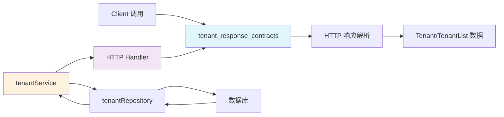

# tenant_response_contracts 模块深度解析

## 概述：为什么需要这个模块

想象你正在运营一个多租户的 SaaS 平台，每个客户（租户）都有自己独立的知识库、检索引擎配置和存储配额。当后端服务完成一个租户相关的操作（比如创建、查询、更新）后，它需要以一种**可预测、结构化**的方式告诉客户端发生了什么。这就是 `tenant_response_contracts` 模块存在的根本原因。

这个模块的核心职责是定义**租户操作的响应契约**——它规定了 API 返回数据的形状，确保客户端能够可靠地解析和处理后端响应。乍看之下，这似乎只是几个简单的结构体定义，但背后隐藏着一个关键的设计洞察：**响应格式的统一性是构建可靠 SDK 客户端的基石**。

如果没有这种统一的响应契约，每个 API 端点都可能返回不同格式的响应，客户端代码将陷入无尽的 `if-else` 判断中。通过将响应格式标准化为 `{ success: bool, data: ... }` 的模式，这个模块为整个租户管理 API 提供了一致的错误处理和数据处理语义。

## 架构定位与数据流



这个模块在系统中的位置非常清晰：

1. **服务端视角**：`tenantService`（参见 [tenant_lifecycle_and_listing_management](tenant_lifecycle_and_listing_management.md)）处理业务逻辑后，通过 HTTP Handler 将数据序列化为 JSON 响应，响应格式遵循本模块定义的契约。

2. **客户端视角**：SDK 客户端（`client.Client`）发起 HTTP 请求后，使用本模块定义的 `TenantResponse` 和 `TenantListResponse` 结构体来解析响应体，确保类型安全。

3. **数据流向**：`Tenant` 实体从数据库经由 Repository → Service → Handler 层层传递，最终被包装进 `TenantResponse` 或 `TenantListResponse` 中返回给调用方。

## 核心组件深度解析

### TenantResponse：单资源操作的标准响应包装器

```go
type TenantResponse struct {
    Success bool   `json:"success"`
    Data    Tenant `json:"data"`
}
```

**设计意图**：这个结构体看起来简单，但它实现了一个重要的模式——**统一响应包装**。所有单租户操作（创建、获取、更新）都返回这种格式，这意味着：

- **成功/失败语义明确**：`Success` 字段让客户端无需依赖 HTTP 状态码就能判断业务逻辑是否成功（HTTP 状态码可能只反映网络层面的成功）
- **数据结构一致**：无论操作类型如何，`Data` 字段始终包含 `Tenant` 对象，客户端可以用相同的方式解包响应
- **扩展性预留**：未来如果需要添加 `Message`、`ErrorCode` 等字段，只需修改这一个结构体，所有调用点自动继承

**使用场景**：
- `CreateTenant` 返回新创建的租户信息
- `GetTenant` 返回查询到的租户详情
- `UpdateTenant` 返回更新后的租户状态

**值得注意的细节**：`Success` 字段使用 `bool` 而非字符串或枚举，这是 Go 社区的常见实践——布尔值在条件判断中更直接，减少了 `"success" == "true"` 这类字符串比较的开销和出错可能。

### TenantListResponse：列表响应的分页友好设计

```go
type TenantListResponse struct {
    Success bool `json:"success"`
    Data    struct {
        Items []Tenant `json:"items"`
    } `json:"data"`
}
```

**为什么嵌套一层 `Data`？** 你可能会问，为什么不直接让 `TenantListResponse` 包含 `Items []Tenant`？这种嵌套设计实际上是为**未来分页支持**预留空间。当系统需要支持分页时，可以轻松扩展为：

```go
Data struct {
    Items      []Tenant `json:"items"`
    Total      int      `json:"total"`
    Page       int      `json:"page"`
    PageSize   int      `json:"page_size"`
}
```

而无需修改 `TenantListResponse` 的外层结构，保持 API 契约的向后兼容性。

**当前限制**：目前 `ListTenants` 方法返回的是 `[]Tenant` 而非完整响应对象，这意味着调用方无法直接获取 `Success` 状态。这是一个设计上的权衡——简化了常见用例，但牺牲了一致的响应处理模式。

### Tenant：租户领域的核心数据模型

```go
type Tenant struct {
    ID             uint64         `json:"id"`
    Name           string         `json:"name"`
    Description    string         `json:"description"`
    APIKey         string         `json:"api_key"`
    Status         string         `json:"status"`
    RetrieverEngines RetrieverEngines `json:"retriever_engines"`
    Business       string         `json:"business"`
    StorageQuota   int64          `json:"storage_quota"`
    StorageUsed    int64          `json:"storage_used"`
    CreatedAt      time.Time      `json:"created_at"`
    UpdatedAt      time.Time      `json:"updated_at"`
}
```

这个结构体承载了租户的完整状态，有几个设计点值得深入理解：

**APIKey 的存储与传输**：`APIKey` 字段直接暴露在 JSON 响应中，这意味着：
- 创建租户后，客户端必须安全地存储返回的 API Key（后端通常不会再次返回）
- 查询租户时，API Key 可能会被返回，需要确保传输通道加密（HTTPS）
- 这是一个安全敏感字段，未来可能需要考虑脱敏策略（如只在创建时返回，查询时返回 `***`）

**RetrieverEngines 的嵌套结构**：检索引擎配置没有直接平铺在 `Tenant` 中，而是通过 `RetrieverEngines` 包装：

```go
type RetrieverEngines struct {
    Engines []RetrieverEngineParams `json:"engines"`
}
```

这种设计的好处是：
- **语义清晰**：`Engines` 字段明确表示这是一个集合
- **扩展灵活**：未来可以在 `RetrieverEngines` 中添加元数据（如默认引擎、引擎优先级等）而不破坏现有结构

**存储配额的单位约定**：`StorageQuota` 和 `StorageUsed` 使用 `int64` 并以**字节**为单位，默认配额为 10GB（`10737418240` 字节）。这个选择避免了浮点数精度问题，但调用方在展示给用户时需要进行单位转换（GB/MB）。

### RetrieverEngineParams：检索引擎的配置抽象

```go
type RetrieverEngineParams struct {
    RetrieverType       string `json:"retriever_type"`
    RetrieverEngineType string `json:"retriever_engine_type"`
}
```

这两个字段的区分反映了一个重要的架构分层：

- **`RetrieverType`**：检索的**逻辑类型**，如 `keywords`（关键词检索）、`vector`（向量检索）、`hybrid`（混合检索）。这决定了检索的算法策略。
- **`RetrieverEngineType`**：检索的**实现引擎**，如 `elasticsearch`、`milvus`、`postgres`。这决定了底层使用哪个具体的存储和检索系统。

这种分离允许系统在保持检索逻辑不变的情况下，切换底层实现。例如，可以从 `elasticsearch` 迁移到 `opensearch`，而 `RetrieverType` 仍为 `keywords`。

## 依赖关系与调用链

### 被谁调用

1. **SDK 客户端方法**：`CreateTenant`、`GetTenant`、`UpdateTenant`、`DeleteTenant`、`ListTenants` 都直接使用这些响应结构体来解析 HTTP 响应。

2. **前端应用**：通过 SDK 间接使用这些契约，将 `Tenant` 数据渲染到管理界面。

3. **服务端 Handler**：虽然本模块是客户端 SDK 的一部分，但服务端的 [TenantHandler](tenant_agent_configuration_handlers.md) 返回的 JSON 格式必须与这些结构体兼容，否则会导致解析失败。

### 调用谁

本模块本身是被动的数据契约，不主动调用其他组件。但它依赖的 `Tenant` 结构体与服务端的领域模型（参见 [tenant_core_models_and_retrieval_config](tenant_core_models_and_retrieval_config.md)）必须保持字段兼容。

### 数据流转示例

以创建租户为例：

```
Client.CreateTenant()
    ↓ 发送 POST /api/v1/tenants
TenantHandler (服务端)
    ↓ 调用 tenantService.Create()
tenantService
    ↓ 调用 tenantRepository.Create()
tenantRepository
    ↓ 插入数据库
数据库返回新租户记录
    ↑
tenantService 包装业务逻辑
    ↑
TenantHandler 序列化为 TenantResponse JSON
    ↑
Client 解析为 TenantResponse 结构体
    ↑
返回 *Tenant 给调用方
```

## 设计权衡与决策

### 统一响应格式 vs 简洁性

**选择**：采用 `{ success, data }` 包装模式

**权衡**：
- **优点**：一致的响应处理逻辑，易于添加全局错误处理中间件
- **缺点**：增加了一层嵌套，简单场景下略显冗余

**为什么这样选**：在多租户管理系统中，错误处理是高频需求。统一格式让客户端可以用统一的中间件处理认证失败、配额超限、并发冲突等各种错误场景，长期来看降低了维护成本。

### 值类型 vs 指针类型

**观察**：`TenantResponse` 中的 `Data` 字段是值类型 `Tenant` 而非 `*Tenant`

**原因**：
- 响应解析时，数据总是存在的（如果成功），不需要 `nil` 语义
- 值类型避免了额外的堆分配，对性能敏感的路径更友好
- 调用方如果需要指针，可以自行取地址 `&response.Data`

### 时间字段的序列化

`CreatedAt` 和 `UpdatedAt` 使用 `time.Time` 类型，Go 的 `encoding/json` 会将其序列化为 RFC3339 格式字符串。这是一个隐式契约——服务端必须返回兼容的时间格式，否则解析会失败。

**潜在风险**：如果服务端使用非标准时间格式（如 Unix 时间戳），客户端解析会静默失败或产生错误时间。这是一个需要团队内部对齐的隐式约定。

## 使用指南与最佳实践

### 基本使用模式

```go
// 创建租户
client := client.NewClient(...)
newTenant, err := client.CreateTenant(ctx, &client.Tenant{
    Name:        "acme-corp",
    Description: "ACME Corporation",
    Business:    "Manufacturing",
})
if err != nil {
    // 处理错误
}
// 重要：安全存储 API Key
apiKey := newTenant.APIKey

// 查询租户
tenant, err := client.GetTenant(ctx, newTenant.ID)
if err != nil {
    // 处理错误
}

// 更新配置
tenant.RetrieverEngines = client.RetrieverEngines{
    Engines: []client.RetrieverEngineParams{
        {RetrieverType: "vector", RetrieverEngineType: "milvus"},
    },
}
updated, err := client.UpdateTenant(ctx, tenant)

// 列出所有租户
tenants, err := client.ListTenants(ctx)
```

### 错误处理建议

由于 `TenantResponse` 包含 `Success` 字段，建议在解析响应后检查：

```go
var response TenantResponse
if err := parseResponse(resp, &response); err != nil {
    return nil, err
}
if !response.Success {
    return nil, fmt.Errorf("tenant operation failed")
}
return &response.Data, nil
```

### 配置检索引擎

```go
// 配置混合检索（关键词 + 向量）
tenant.RetrieverEngines = client.RetrieverEngines{
    Engines: []client.RetrieverEngineParams{
        {RetrieverType: "keywords", RetrieverEngineType: "elasticsearch"},
        {RetrieverType: "vector", RetrieverEngineType: "milvus"},
    },
}
```

## 边界情况与注意事项

### API Key 的安全处理

**风险**：`APIKey` 在响应中明文传输

**建议**：
1. 确保所有 API 调用使用 HTTPS
2. 创建租户后，立即将 API Key 存储到安全的密钥管理系统
3. 避免在日志中打印完整的租户对象（可能包含 API Key）

### 存储配额的单位陷阱

`StorageQuota` 和 `StorageUsed` 以字节为单位，但用户界面通常显示 GB/MB：

```go
// 错误：直接显示原始值
fmt.Printf("Used: %d\n", tenant.StorageUsed)  // 输出：5368709120

// 正确：转换为用户友好的单位
usedGB := float64(tenant.StorageUsed) / 1024 / 1024 / 1024
fmt.Printf("Used: %.2f GB\n", usedGB)  // 输出：5.00 GB
```

### 列表响应的分页缺失

当前 `ListTenants` 返回所有租户，没有分页支持。当租户数量增长到数百上千时：
- 响应体积会显著增大
- 内存占用增加
- 网络传输时间变长

**应对策略**：关注后续版本是否添加分页参数（`page`、`page_size`）到 `ListTenants` 方法。

### 时间字段的时区问题

`time.Time` 序列化时包含时区信息，但反序列化后的时区取决于客户端环境。如果需要统一的时区处理：

```go
// 转换为 UTC
createdAt := tenant.CreatedAt.UTC()

// 或转换为特定时区
loc, _ := time.LoadLocation("Asia/Shanghai")
createdAt := tenant.CreatedAt.In(loc)
```

## 相关模块参考

- [tenant_core_models_and_retrieval_config](tenant_core_models_and_retrieval_config.md)：服务端的租户核心模型和检索配置定义
- [tenant_lifecycle_and_listing_management](tenant_lifecycle_and_listing_management.md)：租户生命周期管理的服务层实现
- [tenant_agent_configuration_handlers](tenant_agent_configuration_handlers.md)：租户配置相关的 HTTP Handler
- [evaluation_task_definition_and_request](evaluation_task_definition_and_request.md)：与租户同级的评估任务定义模块
