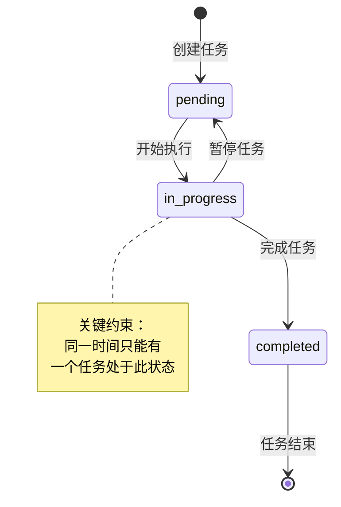

# Todo Plan State Write Tool 模块深度解析

## 一、模块存在的意义：为什么需要这个工具？

想象一个研究员接到一个复杂的调研任务："比较 WeKnora 与 LangChain、LlamaIndex 这三个 RAG 框架的异同"。如果没有任何任务追踪机制，研究员可能会：
- 在搜索过程中迷失方向，忘记已经查过什么
- 同时开展多个搜索，导致上下文混乱
- 无法向用户清晰展示进度
- 遗漏关键的对比维度

`todo_plan_state_write_tool` 模块正是为了解决这个问题而存在。它实现了一个**结构化的任务清单管理工具**（`TodoWriteTool`），专门用于追踪和管理多步骤的检索与研究任务。

**核心设计洞察**：这个模块的关键创新在于**检索与合成的职责分离**。注意工具描述中反复强调的约束：
- ✅ **应该追踪**：检索任务（"搜索知识库中的 X"、"检索关于 Y 的信息"）
- ❌ **不应追踪**：总结任务（"总结发现"、"生成最终答案"）

这种分离不是偶然的——它反映了对 Agent 工作流的深刻理解：检索是**发散性**的（需要系统性追踪），而合成是**收敛性**的（由 thinking tool 处理）。如果将两者混在一起，会导致任务边界模糊、进度难以追踪。

**为什么不用更简单的方案？** 一个 naive 的实现可能只是让 Agent 在对话中口头说明计划。但这样做有几个问题：
1. 无法结构化追踪状态（pending/in_progress/completed）
2. 前端无法渲染可视化的进度条
3. 无法在长对话中保持任务清单的持久性
4. 无法进行程序化的进度验证

因此，这个模块选择了一个**强结构化**的方案：明确的输入 schema、状态机约束、以及双通道输出（人类可读 + 机器可读）。

---

## 二、架构概览：模块在系统中的位置

```mermaid
flowchart TB
    subgraph Agent Runtime
        AE[AgentEngine]
        TT[ToolRegistry]
    end
    
    subgraph todo_plan_state_write_tool
        TWT[TodoWriteTool]
        TWI[TodoWriteInput]
        PS[PlanStep]
        GPO[generatePlanOutput]
    end
    
    subgraph Shared Abstractions
        BT[BaseTool]
        TR[ToolResult]
    end
    
    subgraph Frontend
        UI[Plan Display Component]
    end
    
    AE --> TT
    TT --> TWT
    TWT --> BT
    TWT --> TWI
    TWI --> PS
    TWT --> GPO
    TWT --> TR
    TR --> UI
    
    style TWT fill:#e1f5fe
    style TWI fill:#fff3e0
    style PS fill:#fff3e0
```



**架构角色定位**：
- **上游调用者**：`AgentEngine` 通过 `ToolRegistry` 解析并调用此工具
- **下游依赖**：继承自 `BaseTool` 抽象，返回 `ToolResult` 标准结构
- **数据消费者**：前端 UI 组件消费 `ToolResult.Data` 中的结构化数据进行可视化渲染

**数据流追踪**（以一次典型调用为例）：
1. Agent 决定创建任务清单 → 生成 `TodoWriteInput` JSON
2. `AgentEngine` 调用 `TodoWriteTool.Execute()` → 传入 `json.RawMessage`
3. 工具解析输入 → 验证 `Task` 和 `Steps` 字段
4. 调用 `generatePlanOutput()` → 生成人类可读的格式化文本
5. 构建 `ToolResult` → 包含 `Output`（文本）和 `Data`（结构化数据）
6. 返回给 Agent → 同时发送给前端进行 UI 渲染

---

## 三、核心组件深度解析

### 3.1 TodoWriteTool：工具的执行引擎

**设计意图**：
`TodoWriteTool` 是整个模块的执行核心，它的设计遵循了**命令模式**（Command Pattern）——将"创建/更新任务清单"这个操作封装为一个可执行的对象。

**关键方法**：

```go
func (t *TodoWriteTool) Execute(ctx context.Context, args json.RawMessage) (*types.ToolResult, error)
```

**内部机制分析**：

1. **输入解析阶段**：
   ```go
   var input TodoWriteInput
   if err := json.Unmarshal(args, &input); err != nil {
       return &types.ToolResult{Success: false, Error: ...}, err
   }
   ```
   这里使用 `json.RawMessage` 而非直接解析为 struct，是为了**延迟解析**——工具可以先验证 JSON 格式，再根据业务逻辑进行更细粒度的校验。

2. **默认值处理**：
   ```go
   if input.Task == "" {
       input.Task = "未提供任务描述"
   }
   ```
   这是一个**防御性编程**的体现：即使输入不完整，工具也要返回一个可用的结果，而不是直接崩溃。

3. **双通道输出生成**：
   ```go
   output := generatePlanOutput(input.Task, planSteps)  // 人类可读
   stepsJSON, _ := json.Marshal(planSteps)              // 机器可读
   
   return &types.ToolResult{
       Success: true,
       Output:  output,
       Data: map[string]interface{}{
           "task":         input.Task,
           "steps":        planSteps,
           "steps_json":   string(stepsJSON),
           "total_steps":  len(planSteps),
           "plan_created": true,
           "display_type": "plan",
       },
   }
   ```
   
   这个设计非常关键——`Output` 字段用于对话上下文中展示给用户，而 `Data` 字段供前端程序化渲染。这种**双通道输出**模式在工具设计中很常见，但在这里尤为重要，因为任务清单需要同时满足：
   - 对话连贯性（用户能在对话流中看到计划）
   - 可视化需求（前端可以渲染进度条、状态图标）

**侧效应**：
此工具本身**不修改任何持久化状态**——它只是一个"声明式"工具，任务清单的实际持久化由 Agent 的会话状态管理负责。这是一个重要的设计边界：工具只负责计算和格式化，不负责存储。

---

### 3.2 TodoWriteInput：输入契约

```go
type TodoWriteInput struct {
    Task  string     `json:"task" jsonschema:"The complex task or question you need to create a plan for"`
    Steps []PlanStep `json:"steps" jsonschema:"Array of research plan steps with status tracking"`
}
```

**设计 reasoning**：
- `Task` 字段是**顶层目标**，用于在 UI 中显示任务清单的标题
- `Steps` 是**可执行的子任务列表**，每个步骤都有独立的状态追踪

**参数约束**（来自工具描述中的隐式契约）：
| 参数 | 约束 | 违反后果 |
|------|------|----------|
| `Task` | 应为描述性文本，不能为空 | 工具会填充默认值"未提供任务描述" |
| `Steps` | 建议 3-7 个步骤 | 过少无法体现规划价值，过多增加认知负担 |
| `Steps[].Status` | 只能是 `pending`/`in_progress`/`completed` | 状态统计会出错 |

---

### 3.3 PlanStep：任务步骤的状态机

```go
type PlanStep struct {
    ID          string `json:"id" jsonschema:"Unique identifier for this step"`
    Description string `json:"description" jsonschema:"Clear description of what to investigate"`
    Status      string `json:"status" jsonschema:"Current status: pending, in_progress, completed"`
}
```

**状态机设计**：



**设计 tradeoff**：为什么没有 `failed` 或 `blocked` 状态？

这是一个有意为之的简化。工具描述中说明：
> "If you encounter errors, blockers, or cannot finish, keep the task as in_progress. When blocked, create a new task describing what needs to be resolved"

这意味着**阻塞不是状态，而是新任务的触发条件**。这种设计的好处：
1. 避免状态爆炸（不需要处理 failed→retry 的复杂逻辑）
2. 强制 Agent 主动解决问题（通过创建新任务）
3. 保持进度统计的简洁性（只有三种状态）

但代价是：如果 Agent 不遵守这个约定，可能会留下永远处于 `in_progress` 的"僵尸任务"。

---

### 3.4 generatePlanOutput：格式化引擎

**职责**：将结构化的任务数据转换为人类可读的文本输出。

**关键设计决策**：

1. **空步骤处理**：
   ```go
   if len(steps) == 0 {
       output += "注意：未提供具体步骤。建议创建 3-7 个检索任务以系统化研究。\n\n"
       output += "建议的检索流程（专注于检索任务，不包含总结）：\n"
       // ... 列出推荐工具
   }
   ```
   这不是简单的错误处理，而是**引导式设计**——当用户（或 Agent）没有提供步骤时，工具会主动教育用户如何使用它。

2. **状态统计**：
   ```go
   output += "\n=== 任务进度 ===\n"
   output += fmt.Sprintf("总计：%d 个任务\n", totalCount)
   output += fmt.Sprintf("✅ 已完成：%d 个\n", completedCount)
   // ...
   ```
   这种实时统计让 Agent 能够"看到"自己的进度，是一种**自我监控机制**。

3. **条件性提醒**：
   ```go
   if remainingCount > 0 {
       output += "**还有 %d 个任务未完成！**\n\n"
       output += "**必须完成所有任务后才能总结或得出结论。**\n\n"
   } else {
       output += "✅ **所有任务已完成！**\n\n"
       output += "现在可以：\n"
       output += "- 综合所有任务的发现\n"
   }
   ```
   这是整个模块最核心的**行为约束机制**——通过输出文本中的明确指令，约束 Agent 的行为（完成所有任务前不要总结）。

**为什么不用模板引擎？** 对于一个相对固定的输出格式，直接使用 `fmt.Sprintf` 更简单、性能更好，且便于在字符串中嵌入条件逻辑。但如果未来输出格式需要频繁变化或支持多语言，引入模板引擎会是更好的选择。

---

## 四、依赖关系分析

### 4.1 此模块调用的组件

| 依赖组件 | 调用原因 | 耦合程度 |
|---------|---------|---------|
| `BaseTool` | 继承工具的基础结构和元数据 | 强耦合（继承关系） |
| `types.ToolResult` | 返回标准工具执行结果 | 强耦合（类型依赖） |
| `utils.GenerateSchema` | 生成 JSON Schema 用于工具注册 | 中等耦合（工具函数） |
| `encoding/json` | JSON 解析和序列化 | 弱耦合（标准库） |

**关键依赖契约**：
- `BaseTool` 必须包含 `name`、`description`、`schema` 字段
- `ToolResult` 的 `Data` 字段必须是 `map[string]interface{}` 类型
- `GenerateSchema[T]()` 需要泛型类型有正确的 jsonschema tag

### 4.2 调用此模块的组件

根据模块树，此模块属于 `agent_reasoning_and_planning_state_tools` 子模块，被以下组件调用：

```
agent_core_orchestration_and_tooling_foundation
  └── tool_definition_and_registry
      └── ToolRegistry  ← 注册并解析 TodoWriteTool
          └── AgentEngine  ← 执行工具调用
```

**调用期望**：
- `AgentEngine` 期望所有工具都实现 `Execute(ctx, args) (*ToolResult, error)` 接口
- `ToolRegistry` 期望工具在注册时提供完整的元数据（name、description、schema）

**数据契约**：
```
AgentEngine → TodoWriteTool: json.RawMessage (序列化的 TodoWriteInput)
TodoWriteTool → AgentEngine: *types.ToolResult (包含 Output 和 Data)
```

如果上游组件改变了 `ToolResult` 的结构（例如移除 `Data` 字段），此模块的前端渲染功能会失效，但核心功能仍可工作。

---

## 五、设计决策与权衡

### 5.1 检索与合成的职责分离

**选择**：此工具只追踪检索任务，不追踪总结任务。

**替代方案**：
- 方案 A：追踪所有任务（包括总结）
- 方案 B：完全不追踪，让 Agent 自由决定

**为什么选择当前方案**：
| 维度 | 当前方案 | 方案 A | 方案 B |
|------|---------|-------|-------|
| 任务边界清晰度 | ✅ 高 | ❌ 模糊 | ❌ 无边界 |
| 进度可追踪性 | ✅ 高 | ⚠️ 中等 | ❌ 低 |
| Agent 自由度 | ⚠️ 中等 | ⚠️ 中等 | ✅ 高 |
| 实现复杂度 | ⚠️ 中等 | ✅ 低 | ✅ 低 |

**权衡**：这种分离增加了 Agent 的认知负担（需要理解两个工具的分工），但换来了更好的任务管理和进度追踪能力。对于复杂的研究任务，这个 tradeoff 是值得的。

### 5.2 单任务进行中约束

**选择**：同一时间只能有一个任务处于 `in_progress` 状态。

**为什么**：
1. **认知对齐**：人类一次也只能专注一个任务，这个约束让 Agent 的行为更符合人类直觉
2. **调试友好**：当出现问题时，可以精确定位到当前正在执行的任务
3. **防止并行混乱**：避免 Agent 同时开展多个检索导致上下文污染

**代价**：
- 无法利用真正的并行检索（如果底层支持）
- 对于独立的任务，顺序执行可能效率更低

### 5.3 双通道输出设计

**选择**：同时生成 `Output`（文本）和 `Data`（结构化数据）。

**为什么**：
- `Output` 用于对话历史，保证用户在不支持富 UI 的环境中也能看到计划
- `Data` 用于前端渲染，支持进度条、状态图标等可视化元素

**替代方案**：
- 只输出文本：前端需要解析文本来提取结构化数据（脆弱且易出错）
- 只输出结构化数据：纯文本环境（如 CLI）无法显示计划

**权衡**：增加了代码复杂度（需要维护两套输出的一致性），但获得了更好的兼容性和用户体验。

### 5.4 无持久化设计

**选择**：工具本身不持久化任务清单，由会话状态管理负责。

**为什么**：
- **关注点分离**：工具只负责计算，存储由专门的组件负责
- **灵活性**：不同的会话实现可以使用不同的存储后端（内存、Redis、数据库）
- **可测试性**：工具可以独立测试，不需要 mock 存储层

**风险**：
- 如果会话状态管理失效，任务清单会丢失
- 工具无法保证任务清单的原子性更新

---

## 六、使用指南与示例

### 6.1 基本使用模式

```go
// 1. 创建工具实例
tool := NewTodoWriteTool()

// 2. 准备输入
input := TodoWriteInput{
    Task: "比较 WeKnora 与 LangChain、LlamaIndex",
    Steps: []PlanStep{
        {ID: "step1", Description: "搜索知识库中的 WeKnora 架构信息", Status: "pending"},
        {ID: "step2", Description: "使用 web_search 检索 LangChain 文档", Status: "pending"},
        {ID: "step3", Description: "使用 web_search 检索 LlamaIndex 文档", Status: "pending"},
        {ID: "step4", Description: "对比三个框架的核心特性", Status: "pending"},
    },
}

// 3. 序列化输入
args, _ := json.Marshal(input)

// 4. 执行工具
ctx := context.Background()
result, err := tool.Execute(ctx, args)

// 5. 处理结果
if result.Success {
    fmt.Println(result.Output)  // 人类可读输出
    fmt.Println(result.Data)    // 结构化数据
}
```

### 6.2 典型输出示例

```
计划已创建

**任务**: 比较 WeKnora 与 LangChain、LlamaIndex

**计划步骤**:

  1. ⏳ [pending] 搜索知识库中的 WeKnora 架构信息
  2. ⏳ [pending] 使用 web_search 检索 LangChain 文档
  3. ⏳ [pending] 使用 web_search 检索 LlamaIndex 文档
  4. ⏳ [pending] 对比三个框架的核心特性

=== 任务进度 ===
总计：4 个任务
✅ 已完成：0 个
🔄 进行中：0 个
⏳ 待处理：4 个

=== ⚠️ 重要提醒 ===
**还有 4 个任务未完成！**

**必须完成所有任务后才能总结或得出结论。**

下一步操作：
- 开始处理 4 个待处理任务
- 按顺序完成每个任务，不要跳过
- 完成每个任务后，更新 todo_write 标记为 completed
- 只有在所有任务完成后，才能生成最终总结
```

### 6.3 状态更新模式

```go
// 更新任务状态（将 step1 标记为 in_progress）
input.Steps[0].Status = "in_progress"
args, _ := json.Marshal(input)
tool.Execute(ctx, args)

// 完成 step1 后
input.Steps[0].Status = "completed"
input.Steps[1].Status = "in_progress"  // 开始下一个任务
args, _ := json.Marshal(input)
tool.Execute(ctx, args)
```

### 6.4 前端数据结构消费

```typescript
// 前端接收 ToolResult 后
const planData = toolResult.data;

// 渲染进度条
const progress = (planData.steps.filter(s => s.status === 'completed').length / planData.total_steps) * 100;

// 渲染任务列表
planData.steps.forEach(step => {
    const emoji = {pending: '⏳', in_progress: '🔄', completed: '✅'}[step.status];
    renderTask(`${emoji} ${step.description}`);
});
```

---

## 七、边界情况与陷阱

### 7.1 状态管理陷阱

**问题**：Agent 可能忘记更新任务状态，导致进度统计不准确。

**示例**：
```
错误模式：
1. 将 step1 标记为 in_progress
2. 执行 step1 的检索
3. 直接开始 step2（忘记将 step1 标记为 completed）

后果：step1 永远处于 in_progress 状态，进度统计错误
```

**缓解措施**：
- 在工具输出中明确提醒"完成每个任务后，更新 todo_write 标记为 completed"
- 前端可以高亮显示长时间处于 `in_progress` 的任务

### 7.2 空步骤处理

**问题**：如果 `Steps` 数组为空，工具会生成建议性的检索流程。

**陷阱**：Agent 可能依赖这个默认行为，而不是主动规划。

**最佳实践**：
```go
// ❌ 不推荐：依赖默认步骤
input := TodoWriteInput{Task: "研究 X", Steps: []PlanStep{}}

// ✅ 推荐：明确指定步骤
input := TodoWriteInput{
    Task: "研究 X",
    Steps: []PlanStep{
        {ID: "step1", Description: "使用 grep_chunks 搜索关键词", Status: "pending"},
        // ...
    },
}
```

### 7.3 向后兼容性陷阱

**问题**：`getStringArrayField` 函数处理了 legacy 字符串格式：
```go
// Handle legacy string format for backward compatibility
if val, ok := m[key].(string); ok && val != "" {
    return []string{val}
}
```

**含义**：早期版本可能使用字符串而非数组存储某些字段。

**风险**：如果新代码依赖数组行为，但输入是旧格式，可能导致意外行为。

**缓解措施**：
- 在 API 文档中明确标注字段类型
- 在输入验证阶段进行类型检查

### 7.4 任务数量边界

**建议范围**：3-7 个步骤

**过少的风险**：无法体现规划价值，不如直接执行
**过多的风险**：认知负担过重，难以追踪

**动态调整策略**：
```go
// 如果发现任务过多，可以拆分
if len(input.Steps) > 7 {
    // 创建子计划
    subPlan := TodoWriteInput{
        Task: input.Task + " (第一部分)",
        Steps: input.Steps[:5],
    }
}
```

### 7.5 并发更新冲突

**问题**：如果 Agent 并发调用此工具更新任务清单，可能导致状态覆盖。

**示例**：
```
T1: 读取任务清单 (step1=pending)
T2: 读取任务清单 (step1=pending)
T1: 更新 step1=in_progress
T2: 更新 step1=completed  // 覆盖了 T1 的更新！
```

**缓解措施**：
- 由 `AgentEngine` 串行化工具调用
- 在会话状态层实现乐观锁

---

## 八、扩展点与修改指南

### 8.1 添加新状态

如果需要添加 `blocked` 状态：

```go
// 1. 修改 PlanStep 的状态约束文档
type PlanStep struct {
    Status string `json:"status" jsonschema:"Current status: pending, in_progress, completed, blocked"`
}

// 2. 更新状态统计逻辑
switch step.Status {
case "pending":
    pendingCount++
case "in_progress":
    inProgressCount++
case "completed":
    completedCount++
case "blocked":
    blockedCount++  // 新增
}

// 3. 更新状态图标映射
statusEmoji := map[string]string{
    "pending":     "⏳",
    "in_progress": "🔄",
    "completed":   "✅",
    "blocked":     "🚫",  // 新增
}

// 4. 更新条件性提醒
if blockedCount > 0 {
    output += fmt.Sprintf("**有 %d 个任务被阻塞！**\n", blockedCount)
    output += "建议：创建新任务解决阻塞问题\n"
}
```

### 8.2 添加任务依赖关系

如果需要支持任务间的依赖（step2 依赖 step1 完成）：

```go
type PlanStep struct {
    ID          string   `json:"id"`
    Description string   `json:"description"`
    Status      string   `json:"status"`
    DependsOn   []string `json:"depends_on,omitempty"`  // 新增字段
}

// 在 Execute 中添加依赖验证
func (t *TodoWriteTool) Execute(ctx context.Context, args json.RawMessage) (*types.ToolResult, error) {
    // ... 解析输入
    
    // 验证依赖
    for _, step := range input.Steps {
        for _, depID := range step.DependsOn {
            depStep := findStepByID(input.Steps, depID)
            if depStep == nil {
                return &types.ToolResult{
                    Success: false,
                    Error:   fmt.Sprintf("依赖的任务 %s 不存在", depID),
                }, nil
            }
            if depStep.Status != "completed" {
                return &types.ToolResult{
                    Success: false,
                    Error:   fmt.Sprintf("依赖的任务 %s 尚未完成", depID),
                }, nil
            }
        }
    }
    
    // ... 继续执行
}
```

### 8.3 添加任务优先级

```go
type PlanStep struct {
    ID          string `json:"id"`
    Description string `json:"description"`
    Status      string `json:"status"`
    Priority    int    `json:"priority,omitempty"`  // 1-5，5 为最高
}

// 在 generatePlanOutput 中按优先级排序
sort.Slice(steps, func(i, j int) bool {
    return steps[i].Priority > steps[j].Priority
})
```

---

## 九、相关模块参考

- **[agent_engine_orchestration](agent_runtime_and_tools.md)**：了解 `AgentEngine` 如何调用此工具
- **[tool_definition_and_registry](agent_runtime_and_tools.md)**：了解工具注册机制
- **[sequential_reasoning_tool_contracts_and_execution](agent_runtime_and_tools.md)**：了解 thinking tool 的设计（与 todo_write 配合使用）
- **[tool_execution_abstractions](agent_runtime_and_tools.md)**：了解 `BaseTool` 和 `ToolExecutor` 的抽象设计
- **[session_lifecycle_management_http](http_handlers_and_routing.md)**：了解会话状态如何持久化任务清单

---

## 十、总结

`todo_plan_state_write_tool` 模块是一个精心设计的**任务追踪工具**，它通过以下设计决策实现了复杂检索任务的有效管理：

1. **职责分离**：检索任务（此工具）与合成任务（thinking tool）明确分工
2. **状态机约束**：三种状态（pending/in_progress/completed）+ 单任务进行中约束
3. **双通道输出**：同时满足人类可读性和机器可处理性
4. **引导式设计**：通过输出文本中的明确指令约束 Agent 行为
5. **无状态设计**：工具本身不持久化，由会话层负责存储

对于新加入的开发者，理解这个模块的关键是认识到它不仅仅是一个"任务列表"——它是一个**行为约束机制**，通过结构化的输入输出和明确的指令，引导 Agent 以系统化的方式完成复杂的研究任务。
