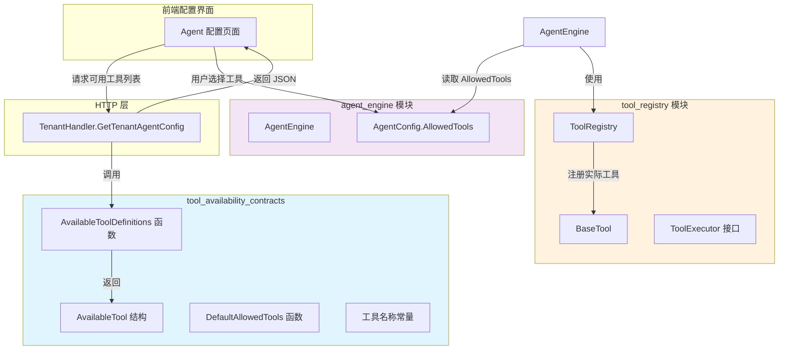

# tool_availability_contracts 模块深度解析

## 概述：为什么需要这个模块？

想象一下你正在设计一个智能体（Agent）系统，这个系统拥有十几种不同的工具能力：关键词搜索、语义搜索、数据库查询、网页抓取、代码执行……这些工具在**运行时**由 `ToolRegistry` 管理和执行，但还有一个关键问题：**用户如何在配置界面知道有哪些工具可用？如何选择启用哪些工具？**

这就是 `tool_availability_contracts` 模块存在的意义。它扮演着一个**工具目录**或**能力菜单**的角色——不关心工具如何执行，只关心向外界宣告："系统里有这些工具，它们叫这个名字，用来做这件事"。

这个模块的核心洞察是：**工具的执行逻辑**和**工具的元数据暴露**是两个不同的关注点，应该分离。执行逻辑可能很复杂（涉及沙箱、API 调用、权限校验），但暴露给 UI 的只需要三件事：名称（name）、标签（label）、描述（description）。这种分离让前端可以独立于后端执行逻辑来构建配置界面。

## 架构定位与数据流

### 模块在系统中的位置



### 数据流追踪

**配置时数据流**（用户设置 Agent 可用工具）：
1. 前端调用 `/tenants/kv/agent-config` 接口
2. `TenantHandler.GetTenantAgentConfig` 调用 `agenttools.AvailableToolDefinitions()`
3. 返回工具元数据列表（name, label, description）
4. 前端渲染为复选框或下拉列表供用户选择
5. 用户选择的工具名称列表保存到 `CustomAgentConfig.AllowedTools`

**运行时数据流**（Agent 执行时使用工具）：
1. `AgentEngine` 从 `AgentConfig.AllowedTools` 读取允许的工具名称列表
2. `ToolRegistry` 根据名称查找已注册的工具实现
3. LLM 发起工具调用请求时，只在允许的工具范围内选择
4. `ToolExecutor` 执行具体工具逻辑

**关键观察**：`AvailableTool` 只用于配置时暴露元数据，运行时 `AgentEngine` 直接通过工具名称字符串与 `ToolRegistry` 交互，两者通过**工具名称常量**保持一致。

## 核心组件深度解析

### AvailableTool 结构

```go
type AvailableTool struct {
    Name        string `json:"name"`
    Label       string `json:"label"`
    Description string `json:"description"`
}
```

**设计意图**：这是一个纯粹的**数据传输对象（DTO）**，不包含任何行为。三个字段各有用途：

- **Name**：工具的机器可读标识符，必须与 `ToolRegistry` 中注册的工具名称完全一致。这是连接配置时和运行时的桥梁。
- **Label**：人类可读的简短标签，用于 UI 显示（如"思考"、"制定计划"、"关键词搜索"）。支持中文，直接面向最终用户。
- **Description**：工具功能的详细描述，帮助用户理解何时应该启用这个工具。

**为什么不用 `FunctionDefinition`？** 你可能会问，系统里已经有 `types.FunctionDefinition` 了，为什么还要另定义一个 `AvailableTool`？关键在于**受众不同**：
- `FunctionDefinition` 包含 `Parameters`（JSON Schema），是给 LLM 看的，用于函数调用
- `AvailableTool` 是给**人类用户**看的，用于配置界面，不需要参数 schema

### 工具名称常量

```go
const (
    ToolThinking            = "thinking"
    ToolTodoWrite           = "todo_write"
    ToolGrepChunks          = "grep_chunks"
    ToolKnowledgeSearch     = "knowledge_search"
    ToolListKnowledgeChunks = "list_knowledge_chunks"
    ToolQueryKnowledgeGraph = "query_knowledge_graph"
    ToolGetDocumentInfo     = "get_document_info"
    ToolDatabaseQuery       = "database_query"
    ToolDataAnalysis        = "data_analysis"
    ToolDataSchema          = "data_schema"
    ToolWebSearch           = "web_search"
    ToolWebFetch            = "web_fetch"
    ToolExecuteSkillScript  = "execute_skill_script"
    ToolReadSkill           = "read_skill"
)
```

**设计模式**：这是典型的**常量集中定义**模式。所有工具名称在这里统一定义，避免魔法字符串散落在代码各处。这样做的好处是：

1. **重构安全**：如果要修改某个工具的名称，只需改一处
2. **编译期检查**：拼写错误会在编译时发现，而不是运行时
3. **跨模块一致性**：`tool_availability_contracts`、`tool_registry`、`agent_engine` 都引用同一套常量

**使用示例**：
```go
// 在 AgentConfig 中配置允许的工具
config.AllowedTools = []string{
    tools.ToolThinking,
    tools.ToolKnowledgeSearch,
    tools.ToolGrepChunks,
}
```

### AvailableToolDefinitions 函数

```go
func AvailableToolDefinitions() []AvailableTool {
    return []AvailableTool{
        {Name: ToolThinking, Label: "思考", Description: "动态和反思性的问题解决思考工具"},
        {Name: ToolTodoWrite, Label: "制定计划", Description: "创建结构化的研究计划"},
        // ... 其他工具
    }
}
```

**关键注释解读**：函数上方的注释写着 *"Keep this in sync with registered tools in this package"* —— 这是一个**手动同步点**，也是本模块最重要的**隐性契约**。

**为什么需要手动同步？** 理想情况下，系统应该自动从 `ToolRegistry` 中读取已注册的工具并生成元数据。但这里选择了手动维护，原因是：

1. **工具注册是动态的**：MCP 工具、技能工具在运行时才注册，无法在编译时确定
2. **UI 暴露需要筛选**：不是所有注册的工具都应该暴露给用户（内部调试工具、实验性工具可能需要隐藏）
3. **标签和描述需要人工编写**：自动生成的描述往往不够友好

**同步失败的后果**：如果这里列出的工具名称与 `ToolRegistry` 中实际注册的不一致，会导致：
- 用户在 UI 中选择了某个工具，但运行时找不到实现 → 工具调用失败
- 新工具已注册但没在这里声明 → 用户无法在配置界面看到和启用

### DefaultAllowedTools 函数

```go
func DefaultAllowedTools() []string {
    return []string{
        ToolThinking,
        ToolTodoWrite,
        ToolKnowledgeSearch,
        ToolGrepChunks,
        ToolListKnowledgeChunks,
        ToolQueryKnowledgeGraph,
        ToolGetDocumentInfo,
        ToolDatabaseQuery,
        ToolDataAnalysis,
        ToolDataSchema,
    }
}
```

**设计意图**：提供一个**开箱即用的默认工具集**。注意这个列表**不包含**：
- `ToolWebSearch` / `ToolWebFetch`：需要外部 API 配置
- `ToolExecuteSkillScript` / `ToolReadSkill`：需要技能系统启用

这体现了一个设计原则：**默认配置应该是最小可用集**，特殊功能需要显式启用。

**使用场景**：
1. 新租户创建时的默认 Agent 配置
2. 用户重置配置时的回退值
3. 测试环境快速搭建

## 依赖关系分析

### 本模块依赖什么？

**零外部依赖** —— 这是本模块最显著的特点。`definitions.go` 只使用标准库，不依赖任何业务模块。

**设计考量**：这种"零依赖"是刻意设计的：
- **稳定性**：工具元数据是系统的基础设施，不应该因为业务逻辑变化而频繁修改
- **可测试性**：可以独立测试，不需要 mock 复杂的运行时环境
- **循环依赖避免**：如果依赖 `tool_registry`，而 `tool_registry` 又依赖具体工具实现，容易形成循环依赖

### 谁依赖本模块？

| 调用方 | 依赖内容 | 使用场景 |
|--------|----------|----------|
| `internal/handler/tenant.go` | `AvailableToolDefinitions()`, `DefaultAllowedTools()` | `/tenants/kv/agent-config` 接口返回可用工具列表 |
| `internal/agent/engine.go` | 工具名称常量（间接） | 验证 `AgentConfig.AllowedTools` 中的工具名称是否合法 |
| `internal/types/custom_agent.go` | 工具名称常量（间接） | `CustomAgentConfig.AllowedTools` 字段存储用户选择的工具名称 |

**数据契约**：
- **输入**：无（函数无参数）
- **输出**：`[]AvailableTool` 或 `[]string`
- **隐性契约**：`AvailableTool.Name` 必须与 `ToolRegistry` 中注册的工具名称一致

## 设计决策与权衡

### 决策 1：元数据与执行逻辑分离

**选择**：`AvailableTool`（元数据）与 `BaseTool`/`ToolExecutor`（执行逻辑）分开定义

**替代方案**：从 `ToolRegistry` 动态读取所有已注册工具，自动生成元数据

**权衡分析**：
| 方案 | 优点 | 缺点 |
|------|------|------|
| 当前方案（分离） | 简单、可控、UI 友好 | 需要手动同步 |
| 动态生成 | 自动同步、单一事实源 | 元数据质量不可控、可能暴露内部工具 |

**为什么选择分离**：在这个场景中，**可控性**比**自动化**更重要。工具元数据是用户界面的一部分，需要精心编写标签和描述，自动生成的文本往往不够友好。而且，系统可能需要隐藏某些内部工具，动态生成无法实现这一点。

### 决策 2：工具名称使用字符串常量

**选择**：工具名称定义为 `string` 常量，而非 `iota` 枚举或独立类型

**替代方案**：
```go
type ToolType int
const (
    ToolThinking ToolType = iota
    ToolTodoWrite
)
```

**权衡分析**：
- **字符串常量**：可直接用于 JSON 序列化、数据库存储、LLM 函数调用，无需转换
- **iota 枚举**：类型安全，但序列化时需要额外的编解码逻辑

**为什么选择字符串**：工具名称需要在多个边界之间传递（HTTP API、数据库、LLM Prompt），字符串是最通用的格式。类型安全的收益在这里不如便利性重要。

### 决策 3：不包含参数 Schema

**选择**：`AvailableTool` 只有 name/label/description，没有 parameters

**替代方案**：包含完整的 JSON Schema，像 `FunctionDefinition` 一样

**权衡分析**：
- **当前方案**：轻量、UI 友好，配置界面只需显示工具名称和描述
- **包含 Schema**：可以在配置界面做更细粒度的参数预设，但复杂度大增

**为什么选择轻量**：工具参数是**运行时**由 LLM 动态生成的，配置阶段只需要决定"是否启用这个工具"，不需要预设参数。保持简单。

## 使用指南

### 基本使用：获取可用工具列表

```go
import "github.com/Tencent/WeKnora/internal/agent/tools"

// 获取所有可用工具的元数据
availableTools := tools.AvailableToolDefinitions()
for _, tool := range availableTools {
    fmt.Printf("工具：%s (%s) - %s\n", tool.Name, tool.Label, tool.Description)
}

// 获取默认允许的工具列表
defaultTools := tools.DefaultAllowedTools()
```

### 配置 Agent 允许的工具

```go
import (
    "github.com/Tencent/WeKnora/internal/agent/tools"
    "github.com/Tencent/WeKnora/internal/types"
)

// 创建自定义 Agent 配置
config := types.CustomAgentConfig{
    AgentMode: "smart-reasoning",
    AllowedTools: []string{
        tools.ToolThinking,
        tools.ToolTodoWrite,
        tools.ToolKnowledgeSearch,
        tools.ToolGrepChunks,
    },
    MaxIterations: 10,
    ReflectionEnabled: true,
}
```

### 添加新工具时的同步步骤

当你实现了一个新工具并注册到 `ToolRegistry` 后，**必须**同步更新本模块：

```go
// 步骤 1：在 definitions.go 添加工具名称常量
const ToolMyNewTool = "my_new_tool"

// 步骤 2：在 AvailableToolDefinitions() 中添加元数据
func AvailableToolDefinitions() []AvailableTool {
    return []AvailableTool{
        // ... 现有工具
        {Name: ToolMyNewTool, Label: "我的新工具", Description: "描述这个工具的功能"},
    }
}

// 步骤 3（可选）：如果新工具应该包含在默认集中，更新 DefaultAllowedTools()
func DefaultAllowedTools() []string {
    return []string{
        // ... 现有工具
        ToolMyNewTool,
    }
}
```

## 边界情况与注意事项

### 1. 工具名称不一致风险

**问题**：`AvailableTool.Name` 与 `ToolRegistry` 中注册的工具名称不一致

**症状**：用户在 UI 中选择了工具，但运行时提示"工具未找到"

**检测方法**：编写集成测试，验证所有 `AvailableToolDefinitions()` 返回的工具名称都能在 `ToolRegistry` 中找到对应实现

**缓解措施**：在工具注册时添加校验逻辑，确保注册名称与常量一致

### 2. 技能工具的条件可用性

**问题**：`ToolExecuteSkillScript` 和 `ToolReadSkill` 只有在技能系统启用时才可用

**当前处理**：在 `AvailableToolDefinitions()` 的注释中标注 *"only available when skills are enabled"*

**注意事项**：前端在展示这些工具时，应该根据技能系统的启用状态决定是否显示或禁用

### 3. MCP 工具的动态性

**问题**：MCP（Model Context Protocol）工具在运行时动态注册，不在 `AvailableToolDefinitions()` 中硬编码

**当前处理**：MCP 工具通过 `MCPSelectionMode` 配置，不在此模块管理

**注意事项**：如果需要将 MCP 工具纳入统一管理，需要扩展本模块支持动态工具发现

### 4. 工具名称的向后兼容性

**问题**：修改工具名称会导致已有 Agent 配置失效

**原则**：工具名称一旦发布，**不应修改**。如需更名，应：
1. 保留旧名称常量，标记为 `Deprecated`
2. 添加新名称常量
3. 在 `ToolRegistry` 中同时注册两个名称指向同一实现
4. 在文档中引导用户使用新名称

## 与其他模块的关系

- **[tool_registration_and_resolution](./tool_registration_and_resolution.md)**：本模块定义工具元数据，`tool_registration_and_resolution` 管理工具执行实例。两者通过工具名称常量关联。
- **[agent_engine_orchestration](./agent_engine_orchestration.md)**：`AgentEngine` 从 `AgentConfig.AllowedTools` 读取允许的工具名称列表，在运行时限制 LLM 可调用的工具范围。
- **[tool_definition_and_registry](./agent_runtime_and_tools-agent_core_orchestration_and_tooling_foundation-tool_definition_and_registry.md)**：本模块是主模块的一部分，提供工具可用性契约。
- **[skill_execution_tool](./skill_execution_tool.md)**，**[skill_reading_tool](./skill_reading_tool.md)**：技能相关工具（`ToolReadSkill`、`ToolExecuteSkillScript`）的可用性依赖于技能系统的启用状态。

## 总结

`tool_availability_contracts` 是一个小而关键的模块，它解决了**工具能力暴露**这个看似简单但实际重要的问题。通过分离元数据与执行逻辑、使用常量保证一致性、提供默认配置降低使用门槛，这个模块在复杂系统中扮演了"工具目录"的角色。

理解这个模块的关键是认识到：**配置时的工具选择**和**运行时的工具执行**是两个不同的阶段，需要不同的抽象。这个模块专注于前者，让后者可以独立演化。
