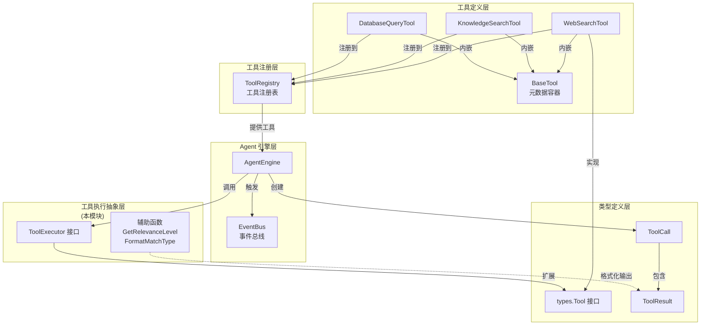

# tool_execution_abstractions 模块深度解析

## 一、模块存在的意义：为什么需要这套抽象？

想象你正在构建一个智能助手系统，这个助手可以调用各种工具来完成用户的请求——搜索知识库、查询数据库、抓取网页、执行代码等等。每个工具都有自己的输入格式、执行逻辑和输出结构。如果没有统一的抽象层，你会面临这样的困境：

```
❌ 没有抽象的混乱场景：
- WebSearchTool 用 map[string]string 接收参数，KnowledgeSearchTool 用 struct
- DatabaseQueryTool 直接返回 SQL 结果集，WebFetchTool 返回 HTML 字符串
- AgentEngine 需要为每个工具写专门的调用逻辑，代码重复且难以扩展
- 新增一个工具需要修改多处调用代码，违反开闭原则
```

**`tool_execution_abstractions` 模块的核心价值**在于提供了一套**统一的工具执行契约**，让 Agent 引擎可以用完全一致的方式调用任何工具，而不需要关心工具的具体实现细节。这套抽象解决了三个关键问题：

1. **接口标准化**：所有工具都遵循 `types.Tool` 接口（Name/Description/Parameters/Execute），Agent 引擎只需面向接口编程
2. **上下文传递**：`ToolExecutor` 接口扩展了 `GetContext()` 方法，允许工具在执行时访问会话级状态（如用户信息、知识库配置等）
3. **输出格式化**：提供 `GetRelevanceLevel()` 和 `FormatMatchType()` 等辅助函数，确保工具输出对人类用户和下游系统都友好可读

这套设计的**核心洞察**是：工具的本质是"带元数据的可执行函数"。元数据（名称、描述、参数 schema）用于让 LLM 理解何时调用该工具，执行逻辑用于完成实际任务，而统一的输出格式用于让 Agent 理解执行结果。

---

## 二、心智模型：如何理解这套抽象？

### 2.1 核心类比：工具即"插件化技能"

把整个 Agent 系统想象成一个**智能手机操作系统**：

| 概念 | 手机系统类比 | 本模块对应物 |
|------|-------------|-------------|
| Tool 接口 | App 的安装规范（AndroidManifest/iOS Info.plist） | `types.Tool` 定义了工具必须实现的方法 |
| BaseTool | App 基类/模板 | 提供通用的元数据存储和访问方法 |
| ToolExecutor | 带系统权限的 App | 除了基本功能，还能访问系统上下文（如位置、联系人） |
| ToolRegistry | 应用商店 | 管理所有已安装工具的注册和查找 |
| AgentEngine | 操作系统内核 | 调度和执行各种工具 |

**关键理解**：`BaseTool` 不是用来继承的基类，而是一个**组合式的数据容器**。Go 语言不鼓励继承，因此具体工具（如 `WebSearchTool`、`KnowledgeSearchTool`）通常会**内嵌** `BaseTool` 来复用元数据管理逻辑，而不是通过继承获得行为。

### 2.2 接口分层设计

```
┌─────────────────────────────────────────────────────────────┐
│                    ToolExecutor (扩展接口)                    │
│  ┌─────────────────────────────────────────────────────┐    │
│  │              types.Tool (核心接口)                    │    │
│  │  ┌───────────────────────────────────────────────┐  │    │
│  │  │  Name() string                                │  │    │
│  │  │  Description() string                         │  │    │
│  │  │  Parameters() json.RawMessage                 │  │    │
│  │  │  Execute(ctx, args) (*ToolResult, error)      │  │    │
│  │  └───────────────────────────────────────────────┘  │    │
│  │                                                     │    │
│  │  + GetContext() map[string]interface{}              │    │
│  └─────────────────────────────────────────────────────┘    │
└─────────────────────────────────────────────────────────────┘
```

**设计意图**：
- **`types.Tool`** 是**最小可行接口**，定义了工具作为"可调用函数"的基本契约。任何实现这个接口的类型都可以被 Agent 引擎调用。
- **`ToolExecutor`** 是**执行时扩展接口**，在 `types.Tool` 基础上增加了 `GetContext()` 方法。这个设计采用了**接口隔离原则**——不是所有工具都需要访问上下文，只有那些需要会话状态的工具才需要实现 `ToolExecutor`。

### 2.3 BaseTool 的组合模式

```go
// BaseTool 是一个数据容器，不是行为基类
type BaseTool struct {
    name        string
    description string
    schema      json.RawMessage
}

// 具体工具通过内嵌复用元数据管理
type WebSearchTool struct {
    BaseTool           // ← 组合而非继承
    searchProvider   WebSearchProvider
    httpClient       *http.Client
}
```

**为什么用组合而不是继承？**
- Go 语言哲学：组合优于继承
- 灵活性：工具可以内嵌 `BaseTool` 的同时自由组合其他依赖（如 HTTP 客户端、数据库连接等）
- 测试友好：可以独立测试 `BaseTool` 的元数据逻辑，不需要实例化完整工具

---

## 三、数据流：工具从注册到执行的完整路径

### 3.1 架构全景图



### 3.2 工具执行的生命周期

#### 阶段 1：工具注册（启动时）

```
┌──────────────┐     ┌──────────────┐     ┌──────────────┐
│  具体工具     │     │ ToolRegistry │     │ AgentEngine  │
│  实例化      │     │              │     │              │
└──────┬───────┘     └──────┬───────┘     └──────┬───────┘
       │                    │                    │
       │ WebSearchTool{}    │                    │
       │───────────────────>│                    │
       │                    │                    │
       │                    │ tools[web_search]  │
       │                    │ = tool             │
       │                    │                    │
       │                    │ 所有工具注册完成后   │
       │                    │───────────────────>│
       │                    │                    │
       │                    │                    │ 工具就绪，等待调用
```

**代码示例**：
```go
// 在 AgentEngine 初始化时
toolRegistry := tools.NewToolRegistry()
toolRegistry.Register(tools.NewWebSearchTool(webSearchService))
toolRegistry.Register(tools.NewKnowledgeSearchTool(knowledgeService))
// ... 注册其他工具

agentEngine := NewAgentEngine(config, toolRegistry, chatModel, eventBus)
```

#### 阶段 2：工具调用（运行时）

```
┌──────────────┐     ┌──────────────┐     ┌──────────────┐     ┌──────────────┐
│ AgentEngine  │     │ ToolRegistry │     │ ToolExecutor │     │ EventBus     │
│              │     │              │     │ (具体工具)    │     │              │
└──────┬───────┘     └──────┬───────┘     └──────┬───────┘     └──────┬───────┘
       │                    │                    │                    │
       │ GetTool("web_search")                  │                    │
       │───────────────────>│                    │                    │
       │                    │                    │                    │
       │                    │ return tool        │                    │
       │<───────────────────│                    │                    │
       │                    │                    │                    │
       │ Execute(args)      │                    │                    │
       │────────────────────────────────────────>│                    │
       │                    │                    │                    │
       │                    │                    │ GetContext()       │
       │                    │                    │ (获取会话状态)      │
       │                    │                    │                    │
       │                    │                    │ 执行搜索逻辑        │
       │                    │                    │                    │
       │                    │                    │ *ToolResult        │
       │<────────────────────────────────────────│                    │
       │                    │                    │                    │
       │ 发布 AgentToolCallData 事件              │                    │
       │────────────────────────────────────────────────────────────>│
       │                    │                    │                    │
       │ 发布 AgentToolResultData 事件            │                    │
       │────────────────────────────────────────────────────────────>│
       │                    │                    │                    │
```

**关键数据流**：
1. **LLM 决定调用工具** → AgentEngine 从 `ToolCall` 中解析工具名称和参数
2. **查找工具** → 通过 `ToolRegistry.GetTool(name)` 获取工具实例
3. **执行工具** → 调用 `tool.Execute(ctx, args)`，如果工具实现了 `ToolExecutor` 则先调用 `GetContext()`
4. **捕获结果** → 返回 `*ToolResult`，包含 `Success`、`Output`、`Data`、`Error`
5. **发布事件** → 通过 `EventBus` 发布 `AgentToolCallData` 和 `AgentToolResultData` 事件，供前端和日志系统消费

#### 阶段 3：结果处理

```go
// ToolResult 的标准结构
type ToolResult struct {
    Success bool                   `json:"success"`         // 执行是否成功
    Output  string                 `json:"output"`          // 人类可读的输出（用于展示给用户）
    Data    map[string]interface{} `json:"data,omitempty"`  // 结构化数据（用于程序化处理）
    Error   string                 `json:"error,omitempty"` // 错误信息
}

// 辅助函数格式化输出
relevance := GetRelevanceLevel(0.85)  // → "高相关"
matchType := FormatMatchType(types.MatchTypeEmbedding)  // → "向量匹配"
```

**设计考量**：
- `Output` 字段用于直接展示给用户或传递给 LLM 作为上下文
- `Data` 字段用于前端渲染特殊 UI（如搜索结果列表、表格数据等）
- 辅助函数确保不同工具的输出风格一致，提升用户体验

---

## 四、组件深度解析

### 4.1 BaseTool 结构体

**职责**：提供工具元数据的存储和访问，减少具体工具的样板代码。

```go
type BaseTool struct {
    name        string              // 工具唯一标识（如 "web_search"）
    description string              // 工具描述（LLM 理解工具用途的关键）
    schema      json.RawMessage     // JSON Schema 定义参数格式
}
```

**设计细节**：

| 字段 | 类型选择原因 | 使用场景 |
|------|-------------|---------|
| `name` | `string` | 工具的唯一标识，必须与 LLM 收到的工具名称一致 |
| `description` | `string` | **关键设计点**：这个描述会被发送给 LLM，影响 LLM 是否选择调用该工具。描述需要清晰说明工具的用途、适用场景和限制 |
| `schema` | `json.RawMessage` | 延迟解析的 JSON Schema，避免每次调用都重新序列化。Schema 定义了 LLM 应该传递什么参数 |

**为什么用 `json.RawMessage` 而不是 `map[string]interface{}`？**
- **性能优化**：Schema 在工具生命周期内不变，`RawMessage` 避免重复序列化
- **保真度**：保持原始 JSON 格式，包括字段顺序和格式（某些 JSON Schema 验证器对顺序敏感）
- **惰性解析**：只有在需要验证或修改时才解析，减少不必要的内存分配

**使用示例**：
```go
// 定义工具参数 Schema
schema := json.RawMessage(`{
    "type": "object",
    "properties": {
        "query": {"type": "string", "description": "搜索关键词"},
        "limit": {"type": "integer", "description": "返回结果数量", "default": 10}
    },
    "required": ["query"]
}`)

// 创建工具
tool := NewBaseTool("web_search", "搜索互联网获取最新信息", schema)

// 具体工具内嵌 BaseTool
type WebSearchTool struct {
    BaseTool
    provider WebSearchProvider
}

func NewWebSearchTool(provider WebSearchProvider) *WebSearchTool {
    return &WebSearchTool{
        BaseTool: NewBaseTool("web_search", "...", schema),
        provider: provider,
    }
}
```

### 4.2 ToolExecutor 接口

**职责**：扩展 `types.Tool` 接口，为需要访问会话上下文的工具提供标准方法。

```go
type ToolExecutor interface {
    types.Tool  // 嵌入基础工具接口
    
    // GetContext 返回工具执行所需的上下文数据
    GetContext() map[string]interface{}
}
```

**为什么需要 `GetContext()`？**

考虑以下场景：
- `KnowledgeSearchTool` 需要知道当前会话关联的知识库 ID
- `DatabaseQueryTool` 需要知道用户的数据库访问权限
- `WebSearchTool` 需要知道用户的搜索偏好设置

**没有 `GetContext()` 的设计**：
```go
// ❌ 糟糕的设计：每次 Execute 都传递上下文
Execute(ctx context.Context, args json.RawMessage, sessionContext map[string]interface{}) (*ToolResult, error)

// 问题：
// 1. 违反 types.Tool 接口契约
// 2. 不是所有工具都需要上下文，强制传递浪费资源
// 3. 上下文结构不透明，工具需要断言类型
```

**有 `GetContext()` 的设计**：
```go
// ✓ 优雅的设计：工具自己管理上下文
type KnowledgeSearchTool struct {
    BaseTool
    context map[string]interface{}  // 在创建时注入
}

func (t *KnowledgeSearchTool) GetContext() map[string]interface{} {
    return t.context
}

func (t *KnowledgeSearchTool) Execute(ctx context.Context, args json.RawMessage) (*ToolResult, error) {
    // 从 GetContext() 获取知识库 ID
    kbID := t.context["knowledge_base_id"].(string)
    // ... 执行搜索
}
```

**设计权衡**：
- **优点**：接口清晰，工具可以按需实现；上下文在工具生命周期内可复用
- **缺点**：`map[string]interface{}` 是弱类型，需要工具自己负责类型断言；上下文变更需要重新创建工具实例

**改进建议**（如果未来需要）：
```go
// 可能的演进方向：强类型上下文
type ToolContext interface {
    GetSessionID() string
    GetUserID() string
    GetKnowledgeBaseIDs() []string
    // ...
}
```

### 4.3 辅助函数：GetRelevanceLevel 和 FormatMatchType

**职责**：将机器友好的数值和枚举转换为人类友好的描述。

#### GetRelevanceLevel

```go
func GetRelevanceLevel(score float64) string {
    switch {
    case score >= 0.8:
        return "高相关"
    case score >= 0.6:
        return "中相关"
    case score >= 0.4:
        return "低相关"
    default:
        return "弱相关"
    }
}
```

**设计意图**：
- **阈值选择**：0.8/0.6/0.4 的阈值是基于经验的选择，平衡了精确率和召回率
- **中文输出**：直接返回中文而非英文，因为最终用户是中文用户（如果需要国际化，应该通过配置或参数化）
- **边界处理**：使用 `>=` 确保所有可能的分数值都有对应输出（包括负数和大于 1 的值）

**使用场景**：
```go
// 在 KnowledgeSearchTool 的 Execute 中
for _, result := range searchResults {
    relevance := GetRelevanceLevel(result.Score)
    output += fmt.Sprintf("- %s (相关度：%s)\n", result.Title, relevance)
}
```

#### FormatMatchType

```go
func FormatMatchType(mt types.MatchType) string {
    switch mt {
    case types.MatchTypeEmbedding:
        return "向量匹配"
    case types.MatchTypeKeywords:
        return "关键词匹配"
    // ... 其他类型
    default:
        return fmt.Sprintf("未知类型 (%d)", mt)
    }
}
```

**设计意图**：
- **枚举映射**：将内部枚举值转换为可读字符串，用于日志、调试和用户展示
- **防御性编程**：`default` 分支处理未知枚举值，避免返回空字符串导致困惑
- **包含原始值**：`未知类型 (%d)` 格式保留了原始枚举值，便于排查问题

**为什么这些函数放在本模块而不是 `types` 包？**
- **职责分离**：`types` 包定义数据结构，本模块定义**执行逻辑**和**展示逻辑**
- **避免循环依赖**：如果 `types` 包依赖本模块的格式化函数，可能导致循环导入
- **可替换性**：如果需要修改格式化逻辑（如支持多语言），只需修改本模块，不影响类型定义

---

## 五、设计决策与权衡

### 5.1 接口 vs 抽象结构体

**决策**：使用 `types.Tool` 接口 + `BaseTool` 结构体的组合模式，而非纯抽象基类。

**权衡分析**：

| 方案 | 优点 | 缺点 | 本模块选择 |
|------|------|------|-----------|
| 纯接口（无 BaseTool） | 最灵活，工具可自由实现 | 每个工具都要重复实现 Name/Description/Parameters | ❌ |
| 抽象基类（继承） | 代码复用高 | Go 不支持继承；过度耦合 | ❌ |
| 接口 + 组合（BaseTool） | 代码复用 + 灵活性 + Go 友好 | 需要显式内嵌 BaseTool | ✓ |

**为什么这个选择适合本系统**：
- 工具种类繁多（搜索、查询、执行、规划等），需要灵活性
- 元数据管理逻辑简单，组合足够复用
- 符合 Go 社区最佳实践，新贡献者容易理解

### 5.2 上下文传递方式

**决策**：通过 `GetContext() map[string]interface{}` 传递上下文，而非通过 `Execute` 参数。

**权衡分析**：

```go
// 方案 A：通过 Execute 参数传递（被拒绝）
Execute(ctx context.Context, args json.RawMessage, context map[string]interface{}) (*ToolResult, error)
// 问题：破坏 types.Tool 接口，所有工具都要修改签名

// 方案 B：通过 ToolExecutor 接口获取（被采用）
GetContext() map[string]interface{}
Execute(ctx context.Context, args json.RawMessage) (*ToolResult, error)
// 优点：接口隔离，只有需要的工具才实现 GetContext

// 方案 C：在工具构造函数中注入上下文（部分工具使用）
NewKnowledgeSearchTool(kbID string) *KnowledgeSearchTool
// 优点：类型安全；缺点：上下文变更需要重新创建工具
```

**当前设计的局限性**：
- `map[string]interface{}` 是弱类型，编译期无法检查
- 工具需要知道上下文中有哪些键，依赖隐式契约
- 上下文变更时，工具可能行为异常（无编译错误）

**未来改进方向**：
```go
// 可能的演进：强类型上下文接口
type SessionContext interface {
    SessionID() string
    KnowledgeBaseIDs() []string
    UserID() string
}

type ToolWithContext interface {
    types.Tool
    SetContext(ctx SessionContext)
}
```

### 5.3 同步执行 vs 异步执行

**决策**：`Execute` 方法是同步的，返回 `*ToolResult` 而非 channel 或 Future。

**为什么选择同步**：
- **简化 Agent 引擎逻辑**：AgentEngine 可以顺序执行工具，不需要处理并发同步
- **错误处理简单**：直接返回 `error`，不需要处理 channel 关闭、超时等复杂情况
- **大多数工具执行时间短**：搜索、查询等操作通常在毫秒到秒级，同步阻塞可接受

**局限性**：
- 长时间运行的工具（如代码执行、大文件处理）会阻塞 Agent 引擎
- 无法并行执行多个独立工具

**变通方案**：
```go
// 工具内部可以使用 goroutine 处理长时间任务
func (t *CodeExecutionTool) Execute(ctx context.Context, args json.RawMessage) (*ToolResult, error) {
    resultCh := make(chan *ToolResult, 1)
    go func() {
        // 在沙箱中执行代码
        result := t.runInSandbox(code)
        resultCh <- result
    }()
    
    select {
    case result := <-resultCh:
        return result, nil
    case <-ctx.Done():
        return nil, ctx.Err()
    case <-time.After(30 * time.Second):
        return nil, errors.New("执行超时")
    }
}
```

### 5.4 输出格式：Output vs Data 字段

**决策**：`ToolResult` 同时包含 `Output`（字符串）和 `Data`（结构化数据）。

**设计意图**：
- **`Output`**：用于直接展示给用户或传递给 LLM。设计为字符串是因为 LLM 和人类都消费文本。
- **`Data`**：用于前端程序化渲染。例如搜索结果可以用列表 UI 展示，表格数据可以用表格 UI 展示。

**使用示例**：
```go
// KnowledgeSearchTool 的返回
return &ToolResult{
    Success: true,
    Output: "找到 3 个相关结果：\n1. 文档 A (高相关)\n2. 文档 B (中相关)\n3. 文档 C (低相关)",
    Data: map[string]interface{}{
        "results": []SearchResult{
            {Title: "文档 A", Score: 0.85, ChunkID: "123"},
            {Title: "文档 B", Score: 0.65, ChunkID: "456"},
            {Title: "文档 C", Score: 0.45, ChunkID: "789"},
        },
    },
}
```

**前端如何使用**：
```javascript
// 如果有 Data.results，用专用 UI 渲染
if (toolResult.data?.results) {
    return <SearchResultsList results={toolResult.data.results} />;
}
// 否则直接显示 Output 文本
return <TextOutput text={toolResult.output} />;
```

**权衡**：
- **优点**：兼顾人类阅读和程序处理；前端可以灵活选择渲染方式
- **缺点**：需要维护两份数据，可能不一致；增加工具实现复杂度

---

## 六、使用指南与最佳实践

### 6.1 实现一个新工具

**步骤 1：定义工具参数 Schema**
```go
var weatherToolSchema = json.RawMessage(`{
    "type": "object",
    "properties": {
        "city": {"type": "string", "description": "城市名称"},
        "date": {"type": "string", "description": "日期，格式 YYYY-MM-DD"}
    },
    "required": ["city"]
}`)
```

**步骤 2：创建工具结构体，内嵌 BaseTool**
```go
type WeatherTool struct {
    BaseTool
    apiClient *WeatherAPIClient
}

func NewWeatherTool(apiClient *WeatherAPIClient) *WeatherTool {
    return &WeatherTool{
        BaseTool: NewBaseTool(
            "weather_query",
            "查询指定城市的天气预报",
            weatherToolSchema,
        ),
        apiClient: apiClient,
    }
}
```

**步骤 3：实现 Execute 方法**
```go
func (t *WeatherTool) Execute(ctx context.Context, args json.RawMessage) (*ToolResult, error) {
    // 解析参数
    var input struct {
        City string `json:"city"`
        Date string `json:"date,omitempty"`
    }
    if err := json.Unmarshal(args, &input); err != nil {
        return &ToolResult{
            Success: false,
            Error:   fmt.Sprintf("参数解析失败：%v", err),
        }, nil
    }
    
    // 调用外部 API
    weather, err := t.apiClient.GetWeather(ctx, input.City, input.Date)
    if err != nil {
        return &ToolResult{
            Success: false,
            Error:   fmt.Sprintf("天气查询失败：%v", err),
        }, nil
    }
    
    // 构造输出
    output := fmt.Sprintf(
        "%s 今天天气：%s，温度：%d-%d°C，湿度：%d%%",
        weather.City, weather.Condition, weather.TempMin, weather.TempMax, weather.Humidity,
    )
    
    return &ToolResult{
        Success: true,
        Output:  output,
        Data: map[string]interface{}{
            "city":      weather.City,
            "condition": weather.Condition,
            "temp_min":  weather.TempMin,
            "temp_max":  weather.TempMax,
            "humidity":  weather.Humidity,
        },
    }, nil
}
```

**步骤 4：注册到 ToolRegistry**
```go
toolRegistry.Register(NewWeatherTool(weatherAPIClient))
```

### 6.2 需要上下文的工具

如果工具需要访问会话状态（如知识库 ID、用户 ID），实现 `ToolExecutor` 接口：

```go
type PersonalizedSearchTool struct {
    BaseTool
    context map[string]interface{}
    searchService SearchService
}

func (t *PersonalizedSearchTool) GetContext() map[string]interface{} {
    return t.context
}

func (t *PersonalizedSearchTool) Execute(ctx context.Context, args json.RawMessage) (*ToolResult, error) {
    // 从上下文获取用户偏好
    userID := t.context["user_id"].(string)
    preferences := t.context["search_preferences"].(SearchPreferences)
    
    // ... 使用用户偏好执行搜索
}
```

### 6.3 使用辅助函数

```go
// 在搜索结果格式化中使用
for _, result := range results {
    relevance := GetRelevanceLevel(result.Score)
    matchType := FormatMatchType(result.MatchType)
    
    output += fmt.Sprintf(
        "- %s\n  相关度：%s | 匹配类型：%s\n",
        result.Title, relevance, matchType,
    )
}
```

---

## 七、边界情况与注意事项

### 7.1 参数验证责任

**重要**：`Execute` 方法**不会自动验证**参数是否符合 Schema。工具实现者需要自己解析和验证参数。

```go
// ❌ 错误做法：假设参数一定合法
var input struct {
    Query string `json:"query"`
}
json.Unmarshal(args, &input)  // 如果 args 不是合法 JSON 会失败
result := t.search(input.Query)  // input.Query 可能是空字符串

// ✓ 正确做法：显式验证
var input struct {
    Query string `json:"query"`
}
if err := json.Unmarshal(args, &input); err != nil {
    return &ToolResult{Success: false, Error: "参数格式错误"}, nil
}
if input.Query == "" {
    return &ToolResult{Success: false, Error: "查询词不能为空"}, nil
}
```

**为什么这样设计**：
- LLM 生成的参数可能不符合 Schema（尤其是复杂嵌套结构）
- 网络传输可能导致数据损坏
- 明确的错误信息比 panic 更友好

### 7.2 错误处理模式

**工具执行错误应该返回 `ToolResult{Success: false, Error: "..."}` 还是直接返回 `error`？**

**约定**：
- **业务逻辑错误**（如搜索无结果、参数无效）→ 返回 `ToolResult{Success: false, Error: "..."}`，`error` 为 `nil`
- **系统错误**（如数据库连接失败、panic 恢复）→ 返回 `nil, error`

**原因**：
- 业务错误是"预期内的失败"，Agent 可以决定重试或告知用户
- 系统错误是"预期外的故障"，Agent 应该停止执行并记录日志

```go
// 业务错误
if len(results) == 0 {
    return &ToolResult{
        Success: false,
        Error:   "未找到相关结果",
    }, nil
}

// 系统错误
db, err := sql.Open("postgres", dsn)
if err != nil {
    return nil, fmt.Errorf("数据库连接失败：%w", err)
}
```

### 7.3 上下文并发安全

如果工具在多个 goroutine 中共享，`GetContext()` 返回的 `map[string]interface{}` 可能引发竞态条件。

**安全做法**：
```go
type SafeTool struct {
    BaseTool
    mu      sync.RWMutex
    context map[string]interface{}
}

func (t *SafeTool) GetContext() map[string]interface{} {
    t.mu.RLock()
    defer t.mu.RUnlock()
    
    // 返回副本而非原始引用
    copy := make(map[string]interface{}, len(t.context))
    for k, v := range t.context {
        copy[k] = v
    }
    return copy
}
```

### 7.4 Schema 变更的影响

**警告**：修改工具的参数 Schema 可能导致：
1. **LLM 调用失败**：LLM 可能缓存了旧的工具描述
2. **历史会话不兼容**：旧会话中的工具调用可能无法重放

**最佳实践**：
- Schema 变更时，同时更新 `description` 字段，提示 LLM 参数变化
- 保持向后兼容：新增可选参数，而非修改必需参数
- 重大变更时，创建新工具（如 `web_search_v2`），逐步迁移

---

## 八、相关模块参考

- **[tool_definition_and_registry](tool_definition_and_registry.md)**：`ToolRegistry` 和 `AvailableTool` 的实现，管理工具的注册和查找
- **[agent_engine_orchestration](agent_engine_orchestration.md)**：`AgentEngine` 如何调用工具并处理结果
- **[agent_system_prompt_context_contracts](agent_system_prompt_context_contracts.md)**：工具描述如何被注入到系统提示中，影响 LLM 的工具选择行为
- **[message_trace_and_tool_events_api](message_trace_and_tool_events_api.md)**：工具调用事件如何被记录和追踪

---

## 九、总结

`tool_execution_abstractions` 模块虽然代码量不大，但承载了整个 Agent 工具系统的**核心契约**。它的设计哲学可以概括为：

1. **接口驱动**：通过 `types.Tool` 接口统一所有工具的调用方式
2. **组合复用**：通过 `BaseTool` 结构体减少样板代码，同时保持灵活性
3. **上下文隔离**：通过 `ToolExecutor` 接口为需要状态的工具提供扩展点
4. **输出友好**：通过辅助函数确保工具输出对人类和机器都清晰可读

理解这套抽象的关键是认识到：**工具是 Agent 与外部世界交互的边界**。好的抽象让边界清晰、扩展容易、调试简单。当你需要实现新工具时，遵循本模块的约定，你的工具就能无缝集成到整个 Agent 系统中。
