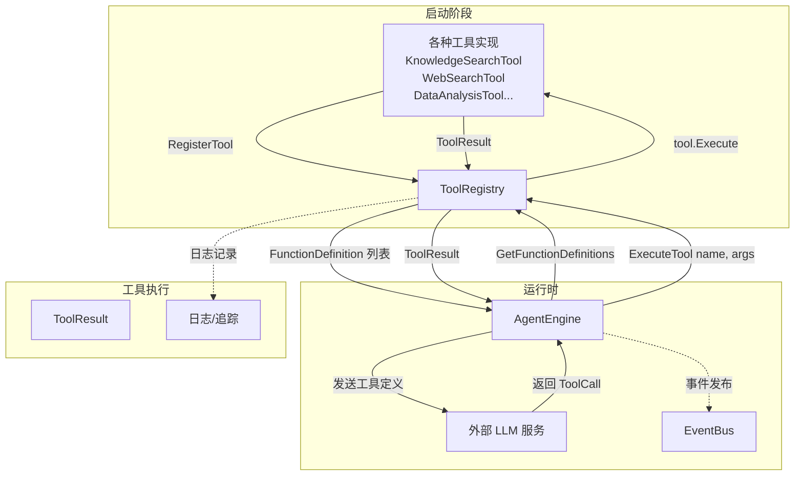

# Tool Registration and Resolution

## 概述：为什么需要这个模块

想象一个智能代理系统就像一个"数字管家"——当用户问"帮我查一下上周的销售数据并生成图表"时，代理需要理解这个请求，然后调用合适的工具：先查询数据库，再调用数据分析工具。但这里有个关键问题：**LLM 只知道工具的"名字"和"用法说明"，它不知道如何真正执行这些工具**。

`tool_registration_and_resolution` 模块解决的就是这个"名字到实现"的映射问题。它维护一个工具注册表，让代理引擎能够：
1. 向 LLM 提供可用工具列表（函数定义）
2. 当 LLM 返回工具调用请求时，根据工具名找到对应的实现并执行

这个设计看似简单，但有一个关键的安全考量：**如果允许工具名称被随意覆盖，恶意代码可能通过注册同名工具来"劫持"工具执行**。因此，本模块采用了"先注册者优先"（first-wins）的策略，确保工具一旦注册就不能被后续的同名注册所替换。这是对该模块 [GHSA-67q9-58vj-32qx](https://github.com/advisories/GHSA-67q9-58vj-32qx) 安全公告的直接响应。

## 架构与数据流



### 核心组件角色

| 组件 | 职责 | 类比 |
|------|------|------|
| `ToolRegistry` | 工具的中央注册表和執行入口 | 电话总机——知道每个分机号对应谁，负责转接 |
| `types.Tool` | 所有工具必须实现的接口 | 电器插头标准——确保所有工具都能"插入"注册表 |
| `AgentEngine` | 注册表的主要使用者 | 总机操作员——决定何时拨打哪个分机 |
| `ToolResult` | 工具执行的统一返回格式 | 工单回执——无论什么工具，都返回相同格式的结果 |

### 数据流详解

**启动阶段**：
1. 系统初始化时，各种工具（`KnowledgeSearchTool`、`WebSearchTool`、`DataAnalysisTool` 等）被创建
2. 每个工具调用 `registry.RegisterTool(tool)` 将自己注册到注册表
3. 注册表以工具名为键，工具实例为值，存储在内部 `map[string]types.Tool` 中

**请求处理阶段**：
1. `AgentEngine` 调用 `registry.GetFunctionDefinitions()` 获取所有工具的元数据
2. 这些函数定义被发送给 LLM，让 LLM 知道可以调用哪些工具
3. LLM 返回 `ToolCall`，包含工具名和参数

**执行阶段**：
1. `AgentEngine` 调用 `registry.ExecuteTool(ctx, name, args)`
2. 注册表根据名字查找工具，调用 `tool.Execute(ctx, args)`
3. 执行过程中记录日志（开始、完成、错误）
4. 返回 `ToolResult` 给 `AgentEngine`，后者将结果发布到 `EventBus`

## 核心组件深度解析

### ToolRegistry

**设计意图**：提供一个安全、可观测的工具执行入口点。

**内部机制**：
```go
type ToolRegistry struct {
    tools map[string]types.Tool  // 工具名 -> 工具实例的映射
}
```

注册表内部使用一个简单的 `map`，这带来了 O(1) 的查找性能，但也意味着：
- 工具名称必须唯一
- 没有内置的工具分组或分类机制
- 遍历顺序不确定（Go map 的特性）

**关键方法分析**：

#### `RegisterTool(tool types.Tool)` —— 安全优先的注册策略

```go
func (r *ToolRegistry) RegisterTool(tool types.Tool) {
    name := tool.Name()
    if _, exists := r.tools[name]; exists {
        return  // 已存在则忽略新注册
    }
    r.tools[name] = tool
}
```

这个看似简单的方法隐藏了重要的安全决策：

| 设计选择 | 替代方案 | 为什么选择当前方案 |
|----------|----------|-------------------|
| 先注册者优先 | 后注册者覆盖 | 防止恶意工具通过晚注册来劫持合法工具 |
| 静默忽略重复 | 抛出错误 | 启动时工具注册顺序可能不确定，静默忽略更容错 |
| 无版本管理 | 支持工具版本 | 简化设计，工具名本身就是契约 |

**实际影响**：如果你发现某个工具的行为和预期不符，检查是否有其他地方注册了同名工具，且注册顺序更早。

#### `ExecuteTool(ctx, name, args)` —— 带可观测性的执行入口

这个方法不仅仅是转发调用，它还承担了**可观测性网关**的角色：

```go
func (r *ToolRegistry) ExecuteTool(ctx context.Context, name string, args json.RawMessage) (*types.ToolResult, error) {
    // 1. 记录执行开始
    common.PipelineInfo(ctx, "AgentTool", "execute_start", ...)
    
    // 2. 查找工具
    tool, err := r.GetTool(name)
    if err != nil {
        // 3a. 工具不存在时返回"失败"的 ToolResult
        return &types.ToolResult{Success: false, Error: err.Error()}, err
    }
    
    // 4. 执行工具
    result, execErr := tool.Execute(ctx, args)
    
    // 5. 根据结果类型记录不同级别的日志
    if execErr != nil {
        common.PipelineError(ctx, "AgentTool", "execute_done", ...)
    } else if result != nil && !result.Success {
        common.PipelineWarn(ctx, "AgentTool", "execute_done", ...)
    } else {
        common.PipelineInfo(ctx, "AgentTool", "execute_done", ...)
    }
    
    return result, execErr
}
```

**设计洞察**：
- 即使工具查找失败，也返回一个 `ToolResult`（`Success: false`），这保证了调用方可以统一处理结果，而不需要区分"工具不存在"和"工具执行失败"
- 日志分为三个级别：`Error`（panic/异常）、`Warn`（业务逻辑失败，如搜索无结果）、`Info`（成功），这有助于后续的问题排查

#### `Cleanup(ctx)` —— 特例化的资源清理

```go
func (r *ToolRegistry) Cleanup(ctx context.Context) {
    if tool, exists := r.tools[ToolDataAnalysis]; exists {
        if dataAnalysisTool, ok := tool.(*DataAnalysisTool); ok {
            dataAnalysisTool.Cleanup(ctx)
        }
    }
}
```

这是一个**实用主义胜过纯粹性**的设计：
- 只有 `DataAnalysisTool` 需要清理（它会创建临时 SQL 表）
- 没有定义通用的 `Cleanup()` 接口，因为其他工具不需要
- 使用类型断言而非接口，避免了为单一用例增加接口复杂度

**权衡**：这种硬编码的方式耦合了注册表和具体工具类型，但考虑到清理需求的特殊性，这是一个合理的妥协。

### types.Tool 接口

所有工具必须实现的四项契约：

```go
type Tool interface {
    Name() string                              // 唯一标识符
    Description() string                       // 给 LLM 看的说明
    Parameters() json.RawMessage               // JSON Schema 格式的参数定义
    Execute(ctx context.Context, args json.RawMessage) (*ToolResult, error)
}
```

**为什么是这四个方法？**

| 方法 | 服务对象 | 设计原因 |
|------|----------|----------|
| `Name()` | 注册表、LLM | 工具调用的"函数名"，必须唯一 |
| `Description()` | LLM | 帮助 LLM 理解何时使用该工具 |
| `Parameters()` | LLM | JSON Schema 让 LLM 知道如何构造参数 |
| `Execute()` | 注册表 | 实际执行逻辑 |

**关键洞察**：前三个方法本质上是"元数据"，用于在启动时构建给 LLM 的工具列表；`Execute()` 是运行时方法。这种分离让注册表可以在不加载工具完整实现的情况下（理论上）获取元数据，尽管当前实现中工具都是 eagerly loaded。

### ToolResult

```go
type ToolResult struct {
    Success bool                   `json:"success"`
    Output  string                 `json:"output"`          // 给人看的
    Data    map[string]interface{} `json:"data,omitempty"`  // 给程序用的
    Error   string                 `json:"error,omitempty"`
}
```

**双通道输出设计**：
- `Output`：自然语言描述，用于展示给用户或放入 LLM 上下文
- `Data`：结构化数据，用于后续工具调用或程序化处理

这种设计源于一个观察：**工具的结果既需要被人理解，也需要被其他工具消费**。例如，`KnowledgeSearchTool` 的 `Output` 可能是"找到 5 篇相关文档"，而 `Data` 则包含具体的文档 ID 列表供 `GetDocumentInfoTool` 使用。

## 依赖关系分析

### 本模块调用的组件

| 依赖 | 用途 | 耦合程度 |
|------|------|----------|
| `types.Tool` | 工具接口契约 | 紧耦合——注册表的核心抽象 |
| `types.ToolResult` | 执行结果格式 | 紧耦合——所有工具必须返回此格式 |
| `types.FunctionDefinition` | LLM 工具定义格式 | 中耦合——用于构建给 LLM 的元数据 |
| `common.PipelineInfo/Error/Warn` | 日志记录 | 松耦合——可替换为其他日志系统 |
| `DataAnalysisTool` | 特殊清理逻辑 | 紧耦合——硬编码的类型检查 |

### 调用本模块的组件

| 调用方 | 使用方式 | 期望行为 |
|--------|----------|----------|
| `AgentEngine` | 获取函数定义、执行工具 | 工具名必须存在，执行必须有结果 |
| 各工具实现 | 注册自己 | 注册后能被正确调用 |

### 数据契约

**注册表 → AgentEngine**：
```go
[]types.FunctionDefinition  // 启动时提供工具元数据
*types.ToolResult           // 执行时返回结果
```

**AgentEngine → 注册表**：
```go
string                      // 工具名
json.RawMessage             // 序列化的参数
```

**隐式契约**：
1. 工具名在注册后不可变
2. `Execute()` 方法必须是线程安全的（多个会话可能并发调用）
3. 工具执行不应有副作用影响其他工具

## 设计决策与权衡

### 1. 先注册者优先 vs 后注册者覆盖

**选择**：先注册者优先

**原因**：安全。如果允许后注册的工具覆盖已有工具，攻击者可以：
1. 等待合法工具注册
2. 注册同名恶意工具
3. 劫持后续所有对该工具的调用

**代价**：
- 测试时难以 mock 工具（需要先 unregister 或重启）
- 工具加载顺序变得重要

### 2. 集中式执行 vs 分布式执行

**选择**：集中式执行（所有工具通过注册表调用）

**原因**：
- 统一的日志和监控点
- 便于实现限流、熔断等横切关注点
- 简化 `AgentEngine` 的实现（不需要知道每个工具的具体类型）

**代价**：
- 注册表成为性能瓶颈（虽然当前 map 查找足够快）
- 所有工具必须实现统一的接口

### 3. 特例化清理 vs 通用清理接口

**选择**：特例化清理（硬编码 `DataAnalysisTool`）

**原因**：
- 只有这一个工具需要清理
- 定义通用接口会增加所有工具的复杂度
- 类型断言虽然不优雅，但清晰表达了"这是特例"

**代价**：
- 如果未来有其他工具需要清理，需要修改注册表
- 违反了开闭原则

### 4. 静默忽略重复注册 vs 抛出错误

**选择**：静默忽略

**原因**：
- 工具注册顺序可能因初始化顺序不确定
- 重复注册通常是配置问题，而非运行时错误
- 启动失败比运行时失败更难调试

**代价**：
- 配置错误可能被掩盖
- 开发者可能不知道自己的工具没有被注册

## 使用指南

### 注册工具

```go
// 在应用启动时
registry := tools.NewToolRegistry()

// 创建工具实例
knowledgeSearchTool := &KnowledgeSearchTool{
    knowledgeBaseService: kbService,
    knowledgeService:     knowledgeService,
    // ...
}

// 注册工具
registry.RegisterTool(knowledgeSearchTool)

// 将注册表传递给 AgentEngine
engine := &AgentEngine{
    toolRegistry: registry,
    // ...
}
```

### 获取工具定义（供 LLM 使用）

```go
// AgentEngine 在构建系统提示时调用
definitions := registry.GetFunctionDefinitions()
// 输出示例：
// [
//   {
//     "name": "knowledge_search",
//     "description": "搜索知识库中的相关内容",
//     "parameters": {"type": "object", "properties": {...}}
//   },
//   ...
// ]
```

### 执行工具

```go
// AgentEngine 收到 LLM 的 ToolCall 后调用
result, err := registry.ExecuteTool(ctx, "knowledge_search", args)
if err != nil {
    // 工具不存在或执行异常
    log.Error(err)
}
if !result.Success {
    // 工具执行但业务逻辑失败
    log.Warn(result.Error)
}
// 使用 result.Output 或 result.Data
```

### 清理资源

```go
// 在会话结束或应用关闭时
registry.Cleanup(ctx)
// 目前只清理 DataAnalysisTool 创建的临时表
```

## 边界情况与注意事项

### 1. 工具名冲突

**现象**：注册了一个工具，但执行时发现是另一个实现。

**原因**：先注册的工具覆盖了后注册的同名工具（实际上是后者被忽略）。

**排查**：
```go
// 检查已注册的工具列表
names := registry.ListTools()
for _, name := range names {
    tool, _ := registry.GetTool(name)
    fmt.Printf("%s: %T\n", name, tool)  // 查看实际类型
}
```

### 2. 并发执行安全

**要求**：工具实例可能被多个会话并发调用。

**建议**：
- 工具内部状态应该是会话隔离的（如 `sessionID` 字段）
- 避免在工具中存储可变的全局状态
- 使用 `context.Context` 传递会话相关信息

### 3. 错误处理的双重性

`ExecuteTool` 返回两个错误指示器：
```go
result, err := registry.ExecuteTool(...)
// err != nil: 工具不存在或执行 panic
// result.Success == false: 工具执行了但业务逻辑失败
```

**最佳实践**：
```go
result, err := registry.ExecuteTool(ctx, name, args)
if err != nil {
    // 工具不存在，应该返回给用户友好提示
    return fmt.Errorf("工具 %s 不可用", name)
}
if !result.Success {
    // 工具执行失败，将错误信息返回给 LLM 让它重试或告知用户
    return fmt.Errorf("工具执行失败：%s", result.Error)
}
// 成功，处理 result.Output 或 result.Data
```

### 4. 参数序列化

工具参数是 `json.RawMessage` 类型，这意味着：
- 调用方负责序列化参数
- 工具内部负责反序列化
- 没有统一的参数验证（每个工具自己验证）

**风险**：如果参数格式错误，工具可能在反序列化时 panic。

**建议**：在工具的 `Execute()` 方法中使用 `json.Unmarshal` 的返回值进行错误处理，而不是直接假设参数格式正确。

### 5. 清理的局限性

当前 `Cleanup()` 只处理 `DataAnalysisTool`。如果未来添加了其他需要清理的工具（如临时文件、外部连接），需要：
1. 修改 `Cleanup()` 方法添加新的类型检查
2. 或者重新设计为通用的 `Cleanup()` 接口

## 扩展指南

### 添加新工具

1. 实现 `types.Tool` 接口：
```go
type MyNewTool struct {
    tools.BaseTool  // 可选：继承 BaseTool 获得默认实现
    // 依赖的服务
    someService interfaces.SomeService
}

func (t *MyNewTool) Name() string {
    return "my_new_tool"
}

func (t *MyNewTool) Description() string {
    return "描述这个工具做什么，给 LLM 看的"
}

func (t *MyNewTool) Parameters() json.RawMessage {
    return json.RawMessage(`{
        "type": "object",
        "properties": {
            "param1": {"type": "string", "description": "..."}
        },
        "required": ["param1"]
    }`)
}

func (t *MyNewTool) Execute(ctx context.Context, args json.RawMessage) (*types.ToolResult, error) {
    // 1. 反序列化参数
    var input MyInput
    if err := json.Unmarshal(args, &input); err != nil {
        return &types.ToolResult{Success: false, Error: err.Error()}, nil
    }
    
    // 2. 执行逻辑
    // ...
    
    // 3. 返回结果
    return &types.ToolResult{
        Success: true,
        Output: "人类可读的结果",
        Data: map[string]interface{}{"key": "value"},
    }, nil
}
```

2. 在应用启动时注册：
```go
registry.RegisterTool(&MyNewTool{someService: svc})
```

### 修改工具行为

由于采用先注册者优先策略，修改工具行为需要：
1. 找到工具注册的位置
2. 确保你的修改版本先于其他版本注册
3. 或者修改原有工具的实现（如果可能）

## 相关模块

- [agent_engine_orchestration](./agent_engine_orchestration.md) — `AgentEngine` 如何使用注册表
- [tool_availability_contracts](./tool_availability_contracts.md) — 工具元数据定义和可用性契约
- [tool_definition_and_registry](./agent_runtime_and_tools-agent_core_orchestration_and_tooling_foundation-tool_definition_and_registry.md) — 主模块文档
- [tool_execution_abstractions](./tool_execution_abstractions.md) — `BaseTool` 和 `ToolExecutor` 的详细设计
- [chunk_grep_and_result_aggregation](./chunk_grep_and_result_aggregation.md), [semantic_knowledge_search](./semantic_knowledge_search.md) — 知识库相关工具的实现
- [web_search_tooling](./web_search_tooling.md), [mcp_tool_integration](./mcp_tool_integration.md) — 网络搜索和 MCP 工具的实现
- [sequential_reasoning_tool_contracts_and_execution](./sequential_reasoning_tool_contracts_and_execution.md), [todo_plan_state_write_tool](./todo_plan_state_write_tool.md) — 规划和推理工具的实现
