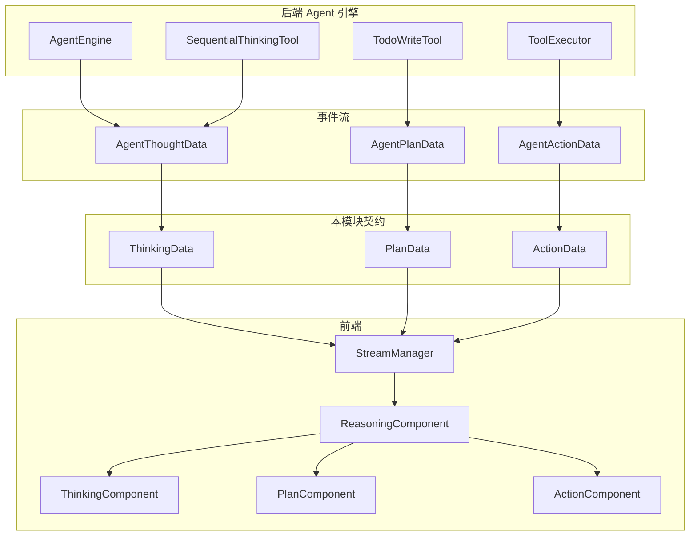

# tool_result_contracts_for_agent_reasoning_flow 模块深度解析

## 一、模块存在的意义：为什么需要这套契约？

想象你正在观察一个 AI 代理思考的过程 —— 它不是直接给出答案，而是先**思考**问题本质，然后**规划**解决步骤，最后**执行**具体动作。这个模块的核心使命就是：**将代理的内在推理过程结构化地传递给前端，让 UI 能够以人类可理解的方式呈现出来**。

### 问题空间

在 Agent 系统中，后端推理引擎会产生三类关键状态信息：

1. **思考状态（Thinking）**：代理对问题的分析、推理链、上下文理解
2. **规划状态（Plan）**：代理制定的任务分解、步骤序列、工具选择
3. **执行状态（Action）**：工具调用的参数、执行结果、成功/失败状态

如果直接用自由格式的文本传递这些信息，前端将面临三个困境：
- **无法区分状态类型**：不知道当前收到的是思考内容还是执行结果
- **无法结构化渲染**：无法为规划步骤提供进度条、为执行结果提供错误高亮
- **无法追踪状态变迁**：无法判断一个计划步骤从 `pending` 变成了 `completed`

### 设计洞察

本模块采用**判别联合类型（Discriminated Union）**模式，通过 `display_type` 字段作为"类型标签"，让前端能够：
- 在编译期进行类型收窄（Type Narrowing）
- 在运行期动态选择渲染组件
- 在状态机中追踪推理流程的进展

这套契约不是简单的数据搬运工，而是**代理推理过程的可视化协议** —— 它定义了后端如何"表达"思考，前端如何"理解"并呈现这种表达。

---

## 二、架构全景：数据如何流动



### 数据流追踪

#### 路径 1：思考事件流
```
AgentEngine 产生推理 → AgentThoughtData 事件 → ThinkingData 契约 → 前端流式渲染
```

当代理使用 `SequentialThinkingTool` 进行逐步推理时，后端将思考内容封装为 `ThinkingData`，通过 SSE 流推送到前端。前端根据 `display_type: 'thinking'` 选择渲染为折叠的思考区块。

#### 路径 2：规划事件流
```
TodoWriteTool 创建计划 → AgentPlanData 事件 → PlanData 契约 → 前端进度追踪
```

当代理调用 `TodoWriteTool` 更新任务列表时，每个 `PlanStep` 包含 `status` 字段（`pending` | `in_progress` | `completed` | `skipped`），前端可据此渲染步骤进度条。

#### 路径 3：执行事件流
```
ToolExecutor 执行工具 → AgentActionData 事件 → ActionData 契约 → 前端结果展示
```

工具执行完成后，`ActionData` 携带 `success`、`output`、`error` 等字段，前端根据 `display_type` 进一步选择具体的结果渲染组件（如搜索结果、知识库列表等）。

---

## 三、核心组件深度解析

### 3.1 ThinkingData：思考过程的载体

```typescript
export interface ThinkingData {
    display_type: 'thinking';
    thought: string;
}
```

**设计意图**

这个接口看似简单，却承载了代理推理透明化的核心需求。`thought` 字段不是最终答案，而是代理的"内心独白"——它可能包含：
- 对用户意图的重新表述
- 对可用工具的评估
- 对检索结果的初步分析
- 对下一步行动的推理

**使用场景**

当代理调用 `SequentialThinkingTool` 时，每次思考迭代都会产生一个 `ThinkingData` 对象。前端通常将其渲染为可折叠的灰色文本块，让用户可以选择性查看推理过程。

**注意事项**

- `thought` 是纯文本，可能包含换行和 Markdown 格式，前端需支持基础渲染
- 单次对话可能产生多个 `ThinkingData` 事件，应按时间顺序追加显示
- 思考内容可能包含敏感信息（如内部工具评估），生产环境需过滤

### 3.2 PlanData：任务规划的蓝图

```typescript
export interface PlanStep {
    id: string;
    description: string;
    tools_to_use?: string[];
    status: 'pending' | 'in_progress' | 'completed' | 'skipped';
}

export interface PlanData {
    display_type: 'plan';
    task: string;
    steps: PlanStep[];
    total_steps: number;
}
```

**设计意图**

`PlanData` 是代理与用户之间的"任务合同"。它明确告知用户：
- **要做什么**（`task`）
- **分几步做**（`steps`）
- **每步用什么工具**（`tools_to_use`）
- **当前进展如何**（`status`）

这种透明化设计解决了 AI 系统的"黑箱焦虑"——用户不再被动等待结果，而是能实时看到代理的执行计划。

**状态机语义**

`PlanStep.status` 是一个典型的状态机：

```
pending → in_progress → completed
                      → skipped (条件不满足时)
```

前端应监听状态变化，动态更新 UI：
- `pending`：灰色待办项
- `in_progress`：带加载动画的当前项
- `completed`：绿色勾选项
- `skipped`：灰色划掉项

**与后端的契约**

`PlanData` 由后端的 `TodoWriteTool` 产生。当代理调用该工具时，后端将工具输入转换为 `PlanData` 并通过事件流推送。这意味着：
- `steps` 数组的顺序代表执行顺序
- `tools_to_use` 是提示性信息，前端可用于显示工具图标
- `total_steps` 用于计算整体进度百分比

### 3.3 ActionData：工具执行的报告

```typescript
export interface ActionData {
    description: string;
    success: boolean;
    tool_name?: string;
    arguments?: any;
    output?: string;
    error?: string;
    details?: boolean;
    display_type?: DisplayType;
    tool_data?: Record<string, any>;
}
```

**设计意图**

`ActionData` 是三类契约中最复杂的一个，因为它需要适配**任意工具**的执行结果。设计采用了"核心字段 + 扩展字段"的模式：

| 字段 | 作用 | 必填性 |
|------|------|--------|
| `description` | 人类可读的动作描述 | 必填 |
| `success` | 执行成功/失败标志 | 必填 |
| `tool_name` | 工具标识 | 可选（调试用） |
| `arguments` | 工具调用参数 | 可选（审计用） |
| `output` | 简化的文本输出 | 可选 |
| `error` | 错误信息 | 失败时必填 |
| `display_type` | 嵌套结果的渲染类型 | 可选 |
| `tool_data` | 结构化结果数据 | 可选 |

**嵌套渲染模式**

`ActionData` 的精妙之处在于 `display_type` 和 `tool_data` 的组合：

```typescript
// 示例：搜索工具执行结果
{
    description: "搜索知识库",
    success: true,
    tool_name: "knowledge_search",
    display_type: "search_results",  // 告诉前端用搜索结果组件渲染
    tool_data: {                     // 嵌套 SearchResultsData 的结构
        results: [...],
        count: 10,
        query: "..."
    }
}
```

这种设计实现了**渲染委托**：`ActionData` 本身不定义具体结果结构，而是通过 `display_type` 引用其他结果契约（如 `SearchResultsData`、`DocumentInfoData` 等），通过 `tool_data` 传递实际数据。

**设计权衡**

这里存在一个明显的权衡：

| 方案 | 优点 | 缺点 |
|------|------|------|
| 严格类型（为每个工具定义独立 Action 类型） | 类型安全、IDE 提示好 | 每新增工具需修改契约 |
| 灵活类型（当前方案） | 扩展性强、解耦工具与前端 | `tool_data` 为 `any`，失去类型检查 |

当前选择灵活类型，原因是：
1. 工具生态是动态扩展的（用户可自定义工具）
2. 前端渲染逻辑已按 `display_type` 分发，类型检查在嵌套层完成
3. `arguments` 和 `tool_data` 主要用于展示，不参与业务逻辑

**使用陷阱**

⚠️ **陷阱 1**：`arguments` 和 `tool_data` 是 `any` 类型，前端访问嵌套属性时需做防御性编程：
```typescript
// 错误写法
const count = action.tool_data.count;

// 正确写法
const count = (action.tool_data as SearchResultsData)?.count ?? 0;
```

⚠️ **陷阱 2**：`display_type` 与 `tool_data` 必须匹配。如果 `display_type: 'search_results'` 但 `tool_data` 包含的是 `DatabaseQueryData` 结构，渲染组件会崩溃。

⚠️ **陷阱 3**：`success: false` 时，`error` 字段应包含人类可读的错误信息，而非原始异常堆栈。

---

## 四、依赖关系分析

### 4.1 本模块依赖的外部组件

| 依赖 | 来源 | 用途 |
|------|------|------|
| `PlanStep` | 同文件内定义 | `PlanData` 的步骤子结构 |
| `DisplayType` | 同文件内定义 | `ActionData` 的渲染类型标签 |

这两个依赖都在 `frontend/src/types/tool-results.ts` 中定义，形成**自包含的类型系统**。`DisplayType` 是一个联合类型，枚举了所有可能的结果渲染模式：

```typescript
export type DisplayType =
    | 'search_results'
    | 'chunk_detail'
    | 'related_chunks'
    | 'knowledge_base_list'
    | 'document_info'
    | 'graph_query_results'
    | 'thinking'
    | 'plan'
    | 'database_query'
    | 'web_search_results'
    | 'web_fetch_results'
    | 'grep_results';
```

注意 `'thinking'` 和 `'plan'` 也在其中，这意味着 `ActionData` 理论上可以嵌套引用思考和规划数据（尽管实际使用中较少见）。

### 4.2 调用本模块的组件

根据模块树，本模块属于 `frontend_contracts_and_state` 体系，被以下组件消费：

1. **前端流式渲染组件**：接收 SSE 事件后，根据 `display_type` 选择渲染组件
2. **状态管理 Store**：将推理状态存入 Vuex/Pinia，供其他组件查询
3. **对话历史回放**：从存储中加载历史消息，重建推理过程

### 4.3 与后端事件的映射关系

本模块的契约与后端事件存在直接映射：

| 前端契约 | 后端事件 | 产生工具 |
|----------|----------|----------|
| `ThinkingData` | `AgentThoughtData` | `SequentialThinkingTool` |
| `PlanData` | `AgentPlanData` | `TodoWriteTool` |
| `ActionData` | `AgentActionData` / `AgentToolResultData` | `ToolExecutor` |

这种映射关系在 [agent_runtime_and_tools](agent_runtime_and_tools.md) 模块中有详细定义。

---

## 五、设计决策与权衡

### 5.1 为什么使用 `display_type` 而非多态类？

**选择**：使用字面量联合类型 + 判别字段

**替代方案**：定义 `ThinkingResult`、`PlanResult`、`ActionResult` 三个类，通过继承实现多态

**权衡分析**：

| 维度 | 判别联合 | 多态类 |
|------|----------|--------|
| 类型推断 | TypeScript 自动收窄 | 需要类型守卫 |
| 序列化 | 天然支持 JSON | 需自定义序列化 |
| 扩展性 | 添加新类型需修改联合 | 可新增子类 |
| 运行时开销 | 零开销 | 类实例化开销 |

选择判别联合的原因：
1. **TypeScript 友好**：`switch(data.display_type)` 自动获得类型收窄
2. **序列化透明**：直接 `JSON.stringify` 即可，无需处理类方法
3. **前端渲染模式匹配**：与 React/Vue 的条件渲染天然契合

### 5.2 为什么 `PlanStep.status` 是联合类型而非枚举？

**选择**：`'pending' | 'in_progress' | 'completed' | 'skipped'`

**替代方案**：定义 `enum StepStatus { Pending, InProgress, ... }`

**权衡分析**：

字符串联合类型的优势：
- **自文档化**：直接阅读代码即可理解状态含义
- **调试友好**：日志中显示 `"completed"` 而非 `2`
- **后端兼容**：Go/Python 后端可直接输出字符串，无需枚举映射

代价是失去了枚举的自动补全和重构支持，但在 TypeScript 中，联合类型的补全已经足够好。

### 5.3 为什么 `ActionData.tool_data` 是 `Record<string, any>`？

这是本模块中**最危险的設計**，但也是**最必要的设计**。

**问题**：工具生态是开放的，后端可能随时新增工具类型，前端无法预知所有工具的结果结构。

**解决方案**：将类型检查责任下放到渲染层。`ActionData` 只负责传递数据，具体渲染组件（如 `SearchResultsRenderer`）负责验证 `tool_data` 是否符合预期结构。

**风险缓解**：
1. 在渲染组件入口处做类型守卫
2. 使用可选链和空值合并运算符访问嵌套属性
3. 在开发环境添加结构验证警告

---

## 六、使用指南与示例

### 6.1 渲染推理状态的标准模式

```typescript
function renderReasoning(data: ToolResultData) {
    switch (data.display_type) {
        case 'thinking':
            return <ThinkingBlock thought={data.thought} />;
        
        case 'plan':
            return <PlanTracker 
                task={data.task} 
                steps={data.steps} 
                progress={data.steps.filter(s => s.status === 'completed').length / data.total_steps}
            />;
        
        case 'search_results':
        case 'chunk_detail':
        // ... 其他结果类型
            return <ActionRenderer action={data} />;
    }
}
```

### 6.2 处理 ActionData 的嵌套渲染

```typescript
function renderAction(action: ActionData) {
    // 基础信息始终显示
    return (
        <ActionCard success={action.success} description={action.description}>
            {/* 根据 display_type 渲染详细结果 */}
            {action.display_type && action.tool_data && (
                <ResultRenderer 
                    type={action.display_type} 
                    data={action.tool_data} 
                />
            )}
            
            {/* 错误信息高亮 */}
            {!action.success && action.error && (
                <ErrorBanner message={action.error} />
            )}
        </ActionCard>
    );
}
```

### 6.3 状态追踪示例

```typescript
// 在 Store 中追踪计划进度
interface PlanState {
    currentPlan: PlanData | null;
    stepStatuses: Record<string, PlanStep['status']>;
}

function updateStepStatus(planId: string, stepId: string, status: PlanStep['status']) {
    const plan = state.currentPlan;
    if (!plan) return;
    
    const step = plan.steps.find(s => s.id === stepId);
    if (step) {
        step.status = status;
        // 触发 UI 更新
    }
}
```

---

## 七、边界情况与陷阱

### 7.1 空状态处理

- `PlanData.steps` 可能为空数组（代理创建了空计划）
- `ActionData.tool_data` 可能为 `undefined`（工具无结构化输出）
- `ThinkingData.thought` 理论上不应为空，但需防御性处理

### 7.2 状态不一致

当后端快速推送多个 `PlanData` 事件时，前端可能出现状态覆盖问题：
```
事件 1: steps=[A(pending), B(pending)]
事件 2: steps=[A(completed), B(in_progress)]
事件 3: steps=[A(completed), B(completed)]
```

如果事件 2 因网络延迟晚于事件 3 到达，UI 会错误地显示 B 为 `in_progress`。

**解决方案**：为 `PlanData` 添加版本号或时间戳，前端只接受更新的事件。

### 7.3 类型漂移

由于 `tool_data` 是 `any`，后端可能意外传递不符合 `display_type` 的数据结构。例如：
```json
{
    "display_type": "search_results",
    "tool_data": { "columns": [...], "rows": [...] }  // 实际是 DatabaseQueryData
}
```

**解决方案**：在开发环境添加运行时验证：
```typescript
function validateToolData(type: DisplayType, data: any): boolean {
    if (type === 'search_results' && !Array.isArray(data?.results)) {
        console.warn('Invalid search_results data structure');
        return false;
    }
    // ... 其他验证
    return true;
}
```

### 7.4 国际化考虑

`PlanStep.description` 和 `ActionData.description` 是后端生成的自然语言文本，可能包含：
- 英文（开发环境）
- 中文（生产环境）
- 混合语言（工具名称保留英文）

前端不应假设文本语言，避免硬编码的字符串匹配。

---

## 八、相关模块参考

- [tool_result_contracts_for_content_and_retrieval](tool_result_contracts_for_content_and_retrieval.md)：定义搜索结果、知识库列表等内容检索相关的结果契约
- [tool_result_contracts_for_web_and_data_queries](tool_result_contracts_for_web_and_data_queries.md)：定义网络搜索、数据库查询等外部数据源的结果契约
- [agent_runtime_and_tools](agent_runtime_and_tools.md)：后端工具定义和事件产生逻辑
- [session_streaming_and_llm_calls_api](session_streaming_and_llm_calls_api.md)：SSE 流式传输的 API 契约

---

## 九、总结

`tool_result_contracts_for_agent_reasoning_flow` 模块是 Agent 系统**可解释性**的技术基石。它通过三个核心接口：

| 接口 | 回答的问题 | 渲染模式 |
|------|------------|----------|
| `ThinkingData` | 代理在想什么？ | 折叠文本块 |
| `PlanData` | 代理打算怎么做？ | 进度追踪器 |
| `ActionData` | 代理做了什么？结果如何？ | 卡片 + 嵌套结果 |

实现了一套轻量但完整的推理过程可视化协议。设计上的核心权衡是**用运行时的类型灵活性换取扩展性**，这使得系统能够支持动态工具生态，但也要求前端开发者在消费 `tool_data` 时保持警惕。

理解这个模块的关键是认识到：它不是被动的数据容器，而是**代理与用户之间的沟通协议** —— 它定义了 AI 如何向人类解释自己的思考过程。
