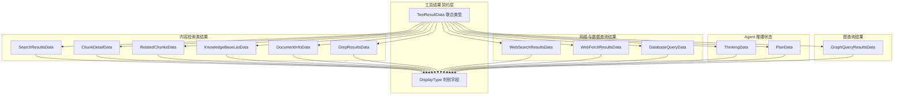

# tool_result_contracts_for_content_and_retrieval 模块深度解析

## 模块概述：前端如何理解 Agent 的"思考成果"

想象一下，你正在观察一位研究助理工作：他会在白板上写下不同的内容——有时是搜索结果的列表，有时是某份文档的详细内容，有时是一个待办计划，有时是从数据库查出的表格。作为观察者，你需要一眼就能分辨出白板上每种内容的**类型**，才能用正确的方式去阅读它。

`tool_result_contracts_for_content_and_retrieval` 模块扮演的就是这个"观察者"的角色。它定义了前端如何**识别**和**渲染** Agent 执行各种工具后产生的结果数据。当 Agent 调用 `KnowledgeSearchTool` 搜索知识库、调用 `GetDocumentInfoTool` 获取文档元信息、或调用 `WebSearchTool` 进行网络搜索时，后端返回的原始数据需要被转换成前端能够理解和展示的结构化格式——这就是本模块存在的意义。

这个模块的核心洞察是：**不同类型的工具结果需要不同的 UI 呈现方式**。搜索结果需要展示相关性评分和匹配类型，文档信息需要展示文件元数据，数据库查询需要以表格形式呈现，而 Agent 的思考过程则需要以时间线方式展示。模块通过 TypeScript 接口和判别联合类型（discriminated union），为每种结果类型建立了清晰的契约，使得前端组件可以类型安全地处理这些异构数据。

## 架构设计：以 display_type 为核心的判别联合模式



### 架构角色解析

这个模块在整体架构中扮演着**前端数据契约层**的角色。它位于 Agent 运行时（[`agent_runtime_and_tools`](agent_runtime_and_tools.md)）和前端 UI 组件之间，负责将后端的工具执行结果转换为前端可渲染的数据结构。

**数据流向**：
1. Agent 引擎执行工具（如 `KnowledgeSearchTool`）
2. 工具返回原始结果（定义在 [`internal.agent.tools.*`](agent_runtime_and_tools.md) 中）
3. 后端将结果序列化为 JSON 并通过 SSE 流推送
4. 前端接收数据后，使用本模块的类型进行类型守卫和解析
5. UI 组件根据 `display_type` 字段选择对应的渲染组件

**核心设计模式**：模块采用了**判别联合类型**（Discriminated Union）模式。所有工具结果类型共享一个 `display_type` 字段，这个字段既是类型标识符，也是前端路由到正确渲染组件的键。这种设计类似于网络协议中的"内容类型"头——接收方先读取类型标识，再决定如何解析后续数据。

### 为什么选择判别联合而非继承？

你可能会问：为什么不用面向对象的多态，而是用 TypeScript 的联合类型？答案在于**数据驱动渲染**的需求。前端组件需要根据数据类型动态选择渲染策略，而判别联合提供了编译期类型检查和运行时类型守卫的双重保障。当你在代码中写 `if (result.display_type === 'search_results')` 时，TypeScript 会自动将 `result` 的类型收窄为 `SearchResultsData`，这种类型安全是继承体系难以提供的。

## 核心组件深度解析

### DisplayType：结果类型的"内容类型头"

```typescript
export type DisplayType =
    | 'search_results'
    | 'chunk_detail'
    | 'related_chunks'
    | 'knowledge_base_list'
    | 'document_info'
    | 'graph_query_results'
    | 'thinking'
    | 'plan'
    | 'database_query'
    | 'web_search_results'
    | 'web_fetch_results'
    | 'grep_results';
```

`DisplayType` 是整个模块的**类型注册表**。它枚举了所有可能的工具结果展示类型，每个字面量值对应一种 UI 渲染策略。这个类型的设计遵循了**封闭枚举**原则——所有可能的值都在这里明确列出，新增类型需要修改此处，这保证了类型系统的完整性。

**设计意图**：`DisplayType` 的存在使得前端可以编写类型守卫函数，根据 `display_type` 的值安全地访问特定类型的属性。例如，只有当 `display_type === 'chunk_detail'` 时，访问 `chunk_id` 字段才是类型安全的。

**扩展代价**：每添加一个新的 `DisplayType` 值，都需要：
1. 在本模块添加对应的数据接口
2. 将新接口加入 `ToolResultData` 联合类型
3. 更新所有使用类型守卫的组件

这种"摩擦"是有意为之——它防止了随意添加新类型导致的类型系统腐化。

### ToolResultData：所有结果类型的联合

```typescript
export type ToolResultData =
    | SearchResultsData
    | ChunkDetailData
    | RelatedChunksData
    | KnowledgeBaseListData
    | DocumentInfoData
    | GraphQueryResultsData
    | ThinkingData
    | PlanData
    | DatabaseQueryData
    | WebSearchResultsData
    | WebFetchResultsData
    | GrepResultsData;
```

`ToolResultData` 是模块的**出口类型**。任何需要处理工具结果的函数都应该接受这个类型作为参数，然后通过 `display_type` 进行类型收窄。这种设计强制调用者显式处理所有可能的结果类型，避免了"意外支持"某些类型而忽略其他类型的情况。

**使用模式**：
```typescript
function renderToolResult(result: ToolResultData) {
    switch (result.display_type) {
        case 'search_results':
            return <SearchResultsView results={result.results} />;
        case 'chunk_detail':
            return <ChunkDetailView content={result.content} />;
        // ... 其他 case
        default:
            // TypeScript 会在这里检查是否有遗漏的类型
            const _exhaustive: never = result;
            return null;
    }
}
```

### SearchResultsData：知识搜索结果的契约

```typescript
export interface SearchResultsData {
    display_type: 'search_results';
    results?: SearchResultItem[];
    count?: number;
    kb_counts?: Record<string, number>;
    query?: string;
    knowledge_base_id?: string;
}
```

这个接口定义了知识搜索工具（[`KnowledgeSearchTool`](agent_runtime_and_tools.md)）返回结果的前端视图模型。注意几个关键设计点：

**可选字段的语义**：`results`、`count` 等字段都是可选的（使用 `?` 标记），这反映了搜索操作的**渐进式渲染**需求。在流式响应场景下，前端可能先收到 `query` 和 `knowledge_base_id` 用于显示"正在搜索..."状态，后续才收到实际的 `results`。这种设计允许前端在数据不完整时也能进行有意义的渲染。

**kb_counts 的聚合信息**：`kb_counts` 字段记录了每个知识库的命中数量（`Record<string, number>`），这是一个**预聚合**的统计信息。后端在返回结果时已经按知识库分组计数，前端可以直接用这个数据绘制"按知识库分布"的图表，无需在客户端再次聚合。这种设计将计算密集型操作放在后端，符合"后端聚合、前端展示"的原则。

**SearchResultItem 的相关性模型**：
```typescript
export interface SearchResultItem {
    result_index: number;
    chunk_id: string;
    content: string;
    score: number;
    relevance_level: RelevanceLevel;
    knowledge_id: string;
    knowledge_title: string;
    match_type: string;
}
```

`RelevanceLevel` 类型（`'高相关' | '中相关' | '低相关' | '弱相关'`）是一个**离散化的相关性评分**。原始的 `score` 字段是连续的浮点数（如 0.873），但用户难以理解这个数值的含义。`relevance_level` 将连续分数映射到离散的语义等级，便于前端用颜色、图标等视觉元素直观展示。这种"连续值→离散等级"的转换是信息可视化中的常见模式。

### ChunkDetailData 与 RelatedChunksData：块内容的两种视图

```typescript
export interface ChunkDetailData {
    display_type: 'chunk_detail';
    chunk_id: string;
    content: string;
    chunk_index: number;
    knowledge_id: string;
    content_length?: number;
}

export interface RelatedChunksData {
    display_type: 'related_chunks';
    chunk_id: string;
    relation_type: string;
    count: number;
    chunks: ChunkItem[];
}
```

这两个接口代表了**块内容**的两种不同呈现方式：

- `ChunkDetailData` 用于展示**单个块的完整内容**，通常在用户点击搜索结果中的某一条目时触发
- `RelatedChunksData` 用于展示**与某个块相关的其他块**，支持知识导航和上下文探索

**设计对比**：`ChunkDetailData` 直接包含 `content` 字段，而 `RelatedChunksData` 包含的是 `ChunkItem[]` 数组。`ChunkItem` 只包含块的元信息（`chunk_id`、`chunk_index`、`knowledge_id`）和**截断的内容**。这种差异反映了不同的使用场景：详情视图需要完整内容，而列表视图只需要摘要信息以减少数据传输量。

**ChunkItem 的轻量设计**：
```typescript
export interface ChunkItem {
    index: number;
    chunk_id: string;
    chunk_index: number;
    content: string;
    knowledge_id: string;
}
```

注意 `ChunkItem` 没有 `relevance_level` 或 `score` 字段——这是因为在"相关块"场景中，所有块都已经通过某种关系（如"同文档相邻块"或"语义相似块"）被筛选出来，它们的相关性是**隐含的**（由 `relation_type` 定义），不需要额外的评分。

### DocumentInfoData：文档元信息的聚合视图

```typescript
export interface DocumentInfoData {
    display_type: 'document_info';
    documents?: DocumentInfoDocument[];
    total_docs: number;
    requested: number;
    errors?: string[];
    title?: string;
}
```

这个接口对应 [`GetDocumentInfoTool`](agent_runtime_and_tools.md) 的执行结果。设计上有几个值得注意的点：

**批量操作的支持**：`documents` 是数组类型，说明这个工具支持**批量查询**多个文档的信息。`total_docs` 和 `requested` 字段的区分反映了请求可能部分失败的场景——`requested` 是请求的文档数量，`total_docs` 是实际成功返回的文档数量。

**错误收集的粒度**：`errors` 字段是一个字符串数组，而不是结构化的错误对象。这种设计选择了**简单性**——每个错误字符串可以包含文档 ID 和错误原因，前端直接展示即可。如果需要更复杂的错误处理（如按错误类型分类），这个设计可能需要演进。

**DocumentInfoDocument 的元信息丰富度**：
```typescript
export interface DocumentInfoDocument {
    knowledge_id: string;
    title: string;
    description?: string;
    type?: string;
    source?: string;
    file_name?: string;
    file_type?: string;
    file_size?: number;
    parse_status?: string;
    chunk_count?: number;
    metadata?: Record<string, any>;
    type_icon?: string;
}
```

这个接口几乎包含了文档的所有可能元信息。`metadata?: Record<string, any>` 是一个**扩展点**——当某些文档类型有特殊的元信息时，可以通过这个字段传递，而无需修改接口定义。但这种灵活性也有代价：`any` 类型绕过了类型检查，使用时需要谨慎。

### KnowledgeBaseListData：知识库枚举的轻量视图

```typescript
export interface KnowledgeBaseListData {
    display_type: 'knowledge_base_list';
    knowledge_bases: KnowledgeBaseItem[];
    count: number;
}

export interface KnowledgeBaseItem {
    index: number;
    id: string;
    name: string;
    description: string;
}
```

这个接口用于展示用户可访问的知识库列表。`KnowledgeBaseItem` 的设计非常**克制**——只包含最基础的标识信息（`id`、`name`、`description`），没有包含知识库的配置、统计信息或其他元数据。这种设计遵循了**最小可用信息**原则：列表视图只需要这些信息，更多详情可以在用户点击后通过其他接口获取。

**index 字段的用途**：`index` 字段用于前端渲染列表时的排序和索引显示。虽然 JavaScript 数组本身有索引，但显式的 `index` 字段在虚拟滚动、分页等场景下更有用——它不依赖于数组在内存中的位置。

### GrepResultsData：模式匹配结果的聚合视图

```typescript
export interface GrepResultsData {
    display_type: 'grep_results';
    patterns: string[];
    knowledge_results: GrepKnowledgeResult[];
    result_count: number;
    total_matches: number;
    knowledge_base_ids?: string[];
    max_results: number;
}
```

这个接口对应 [`GrepChunksTool`](agent_runtime_and_tools.md) 的执行结果，用于展示在知识库中搜索特定模式（如关键词、正则表达式）的命中情况。

**GrepKnowledgeResult 的聚合设计**：
```typescript
export interface GrepKnowledgeResult {
    knowledge_id: string;
    knowledge_base_id: string;
    knowledge_title: string;
    chunk_hit_count: number;
    pattern_counts: Record<string, number>;
    total_pattern_hits: number;
    distinct_patterns: number;
}
```

这个接口的设计体现了**多维度聚合**的思想：
- `chunk_hit_count`：命中的块数量
- `pattern_counts`：每个模式的命中次数（`Record<string, number>`）
- `total_pattern_hits`：所有模式的总命中次数
- `distinct_patterns`：命中的不同模式数量

这种设计允许前端从多个角度展示搜索结果——可以按知识库分组，也可以按模式分组，还可以展示整体的命中统计。后端在返回结果时已经完成了这些聚合计算，前端只需要负责展示。

### ThinkingData 与 PlanData：Agent 推理状态的可视化

```typescript
export interface ThinkingData {
    display_type: 'thinking';
    thought: string;
}

export interface PlanData {
    display_type: 'plan';
    task: string;
    steps: PlanStep[];
    total_steps: number;
}

export interface PlanStep {
    id: string;
    description: string;
    tools_to_use?: string[];
    status: 'pending' | 'in_progress' | 'completed' | 'skipped';
}
```

这两个接口用于展示 Agent 的**内部推理状态**，对应 [`SequentialThinkingTool`](agent_runtime_and_tools.md) 和 [`TodoWriteTool`](agent_runtime_and_tools.md) 的执行结果。

**ThinkingData 的简单性**：`ThinkingData` 只包含一个 `thought` 字符串，这是因为思考过程本质上是自由文本。前端通常会将这些思考以时间线或对话气泡的形式展示，让用户了解 Agent 的推理过程。

**PlanStep 的状态机设计**：`PlanStep` 的 `status` 字段是一个有限状态机（`pending` → `in_progress` → `completed` 或 `skipped`）。这种设计使得前端可以用不同的视觉样式（如颜色、图标）展示每个步骤的执行状态，用户可以直观地看到 Agent 的计划执行进度。

**tools_to_use 的数组设计**：注意 `tools_to_use` 是 `string[]` 而不是 `string`，这反映了一个步骤可能使用**多个工具**的场景。注释中特别提到"Changed from string to array"，说明这是一个经过迭代的设计决策。

### DatabaseQueryData、WebSearchResultsData、WebFetchResultsData：外部数据源的适配层

```typescript
export interface DatabaseQueryData {
    display_type: 'database_query';
    columns: string[];
    rows: Array<Record<string, any>>;
    row_count: number;
    query: string;
}

export interface WebSearchResultsData {
    display_type: 'web_search_results';
    query: string;
    results: WebSearchResultItem[];
    count: number;
}

export interface WebFetchResultsData {
    display_type: 'web_fetch_results';
    results: WebFetchResultItem[];
    count?: number;
}
```

这三个接口分别对应数据库查询、网络搜索和网页抓取工具的结果。它们的设计反映了不同数据源的特点：

**DatabaseQueryData 的表格模型**：`columns` 和 `rows` 的设计是典型的**关系型数据表示**。`rows` 使用 `Record<string, any>` 使得每一行可以用列名访问（`row['column_name']`），这比数组索引更直观。`query` 字段记录了执行的 SQL，便于调试和审计。

**WebSearchResultItem 的搜索引擎模型**：
```typescript
export interface WebSearchResultItem {
    result_index: number;
    title: string;
    url: string;
    snippet?: string;
    content?: string;
    source?: string;
    published_at?: string;
}
```

这个接口模仿了搜索引擎的结果格式——`title`、`url`、`snippet` 是搜索引擎结果页的标准三要素。`content` 字段是可选的，因为某些搜索引擎 API 只返回摘要（snippet），不返回完整内容。

**WebFetchResultItem 的抓取结果模型**：
```typescript
export interface WebFetchResultItem {
    url: string;
    prompt?: string;
    summary?: string;
    raw_content?: string;
    content_length?: number;
    method?: string;
    error?: string;
}
```

这个接口支持**多种内容呈现方式**：`summary` 是 AI 生成的摘要，`raw_content` 是原始抓取内容，`prompt` 是用于生成摘要的提示词。这种设计允许前端根据用户需求选择展示摘要还是原文。`error` 字段的存在说明网页抓取可能失败，前端需要处理错误状态。

## 依赖关系与数据流

### 上游依赖：Agent 工具执行结果

本模块的数据来源是 [`agent_runtime_and_tools`](agent_runtime_and_tools.md) 模块中定义的各种工具。以下是主要的映射关系：

| 前端接口 | 后端工具 | 工具所在模块 |
|---------|---------|-------------|
| `SearchResultsData` | `KnowledgeSearchTool` | [`knowledge_access_and_corpus_navigation_tools`](agent_runtime_and_tools.md) |
| `ChunkDetailData` | `ListKnowledgeChunksTool` | [`knowledge_access_and_corpus_navigation_tools`](agent_runtime_and_tools.md) |
| `DocumentInfoData` | `GetDocumentInfoTool` | [`knowledge_access_and_corpus_navigation_tools`](agent_runtime_and_tools.md) |
| `GrepResultsData` | `GrepChunksTool` | [`knowledge_access_and_corpus_navigation_tools`](agent_runtime_and_tools.md) |
| `WebSearchResultsData` | `WebSearchTool` | [`web_and_mcp_connectivity_tools`](agent_runtime_and_tools.md) |
| `WebFetchResultsData` | `WebFetchTool` | [`web_and_mcp_connectivity_tools`](agent_runtime_and_tools.md) |
| `DatabaseQueryData` | `DatabaseQueryTool` | [`data_and_database_introspection_tools`](agent_runtime_and_tools.md) |
| `ThinkingData` | `SequentialThinkingTool` | [`agent_reasoning_and_planning_state_tools`](agent_runtime_and_tools.md) |
| `PlanData` | `TodoWriteTool` | [`agent_reasoning_and_planning_state_tools`](agent_runtime_and_tools.md) |

**数据转换流程**：
1. 后端工具执行完成后，返回 Go 语言定义的结构体（如 `internal.agent.tools.knowledge_search.searchResultWithMeta`）
2. HTTP/SSE 处理器将 Go 结构体序列化为 JSON
3. 前端接收 JSON 后，使用本模块的 TypeScript 接口进行类型注解
4. UI 组件根据 `display_type` 选择渲染策略

**关键契约**：后端返回的 JSON 字段名必须与前端接口定义的字段名**完全一致**。这是通过约定而非工具保证的，因此修改后端字段名时需要同步更新前端接口。

### 下游消费者：前端 UI 组件

本模块的类型主要被以下前端组件使用：

1. **消息渲染组件**：将 Agent 的工具结果渲染为可视化的消息气泡
2. **搜索结果展示组件**：展示 `SearchResultsData`，支持按相关性排序和过滤
3. **文档详情组件**：展示 `DocumentInfoData` 和 `ChunkDetailData`
4. **计划执行进度组件**：展示 `PlanData` 的步骤状态
5. **思考过程可视化组件**：展示 `ThinkingData` 的时间线

**类型守卫模式**：前端组件通常使用以下模式处理工具结果：

```typescript
function ToolResultRenderer({ result }: { result: ToolResultData }) {
    if (result.display_type === 'search_results') {
        return <SearchResults results={result.results} />;
    }
    if (result.display_type === 'chunk_detail') {
        return <ChunkDetail chunk={result} />;
    }
    // ... 其他类型
}
```

TypeScript 的类型收窄机制确保在每个分支中，`result` 的类型是正确的，访问特定字段时不会触发类型错误。

## 设计决策与权衡

### 决策 1：使用判别联合而非多态类

**选择**：使用 TypeScript 的判别联合类型（`display_type` 字段 + 联合类型）而非面向对象的继承体系。

**原因**：
1. **类型收窄优势**：TypeScript 可以根据 `display_type` 的值自动收窄类型，提供编译期检查
2. **序列化友好**：纯数据接口更容易序列化为 JSON，无需处理类的原型链
3. **前端渲染模式匹配**：`switch` 语句或条件链天然适合处理判别联合

**代价**：
1. 无法在类型内部定义方法，所有逻辑必须在外部函数中实现
2. 新增类型需要修改联合类型定义，可能触发多处代码变更

**替代方案**：使用类继承体系，每个结果类型是一个类，有共同的基类。但这种方案在序列化/反序列化时需要额外的转换逻辑，且 TypeScript 的类型收窄效果不如判别联合。

### 决策 2：可选字段 vs 必填字段

**选择**：大量使用可选字段（`?`），如 `results?: SearchResultItem[]`、`count?: number`。

**原因**：
1. **流式响应支持**：在 SSE 流式传输场景下，数据可能分批到达，早期批次可能缺少某些字段
2. **渐进式渲染**：前端可以在数据不完整时显示加载状态或部分信息
3. **向后兼容**：新增字段时可以设为可选，避免破坏现有代码

**代价**：
1. 调用者必须处理字段可能为 `undefined` 的情况，增加了代码复杂度
2. 可能掩盖后端数据不一致的问题（字段意外缺失时不会立即报错）

**缓解措施**：关键业务逻辑中应使用断言或默认值确保字段存在，如 `result.results ?? []`。

### 决策 3：RelevanceLevel 的离散化设计

**选择**：将连续的相似度分数（`score: number`）映射到离散的等级（`RelevanceLevel`）。

**原因**：
1. **用户认知友好**：用户更容易理解"高相关"而不是"0.873"
2. **视觉映射简单**：离散等级可以直接映射到颜色（红/橙/黄/灰）或图标
3. **跨模型一致性**：不同嵌入模型产生的分数范围可能不同，离散等级提供了统一的语义

**代价**：
1. 丢失了分数的精细信息，两个"高相关"的结果可能有不同的实际分数
2. 等级阈值的选择是主观的，可能需要根据场景调整

**实现位置**：这个映射通常在后端完成（在 [`application_services_and_orchestration`](application_services_and_orchestration.md) 的检索服务中），前端只负责展示。

### 决策 4：metadata 字段的 any 类型

**选择**：在 `DocumentInfoDocument` 等接口中使用 `metadata?: Record<string, any>`。

**原因**：
1. **扩展性**：不同文档类型可能有不同的元信息，无法预先定义所有字段
2. **避免接口爆炸**：如果不使用 `any`，可能需要为每种文档类型定义单独的接口

**代价**：
1. 失去类型安全，访问 `metadata` 中的字段时没有编译期检查
2. 前端需要知道特定文档类型的元信息结构才能正确使用

**缓解措施**：在访问 `metadata` 中的字段前进行运行时检查，或使用类型断言明确类型。

### 决策 5：display_type 的中文值

**选择**：`RelevanceLevel` 使用中文值（`'高相关' | '中相关' | '低相关' | '弱相关'`），而 `DisplayType` 使用英文值。

**原因**：
1. **RelevanceLevel 直接面向用户**：这些值会直接展示给用户，使用中文更友好
2. **DisplayType 是内部标识符**：这些值用于代码逻辑，使用英文符合编程惯例

**潜在问题**：如果应用需要支持多语言，`RelevanceLevel` 的中文值需要改为英文，然后在展示时翻译。这是一个已知的**国际化限制**。

## 使用指南与示例

### 基本使用模式：类型守卫与渲染

```typescript
import { ToolResultData, SearchResultsData } from '@/types/tool-results';

function isSearchResults(result: ToolResultData): result is SearchResultsData {
    return result.display_type === 'search_results';
}

function renderResult(result: ToolResultData) {
    if (isSearchResults(result)) {
        // TypeScript 知道 result 是 SearchResultsData
        return (
            <div>
                <p>找到 {result.count} 条结果</p>
                {result.results?.map(item => (
                    <SearchResultItem key={item.chunk_id} item={item} />
                ))}
            </div>
        );
    }
    
    // 使用 switch 处理所有类型
    switch (result.display_type) {
        case 'chunk_detail':
            return <ChunkDetail chunk={result} />;
        case 'plan':
            return <PlanView plan={result} />;
        // ... 其他 case
        default:
            // TypeScript 会检查是否有遗漏的类型
            const _exhaustive: never = result;
            return null;
    }
}
```

### 处理流式响应

```typescript
async function handleStreamResponse(stream: ReadableStream) {
    let currentResult: ToolResultData | null = null;
    
    for await (const chunk of stream) {
        const data = JSON.parse(chunk);
        
        if (!currentResult) {
            // 第一批数据，初始化结果对象
            currentResult = data as ToolResultData;
            renderPartialResult(currentResult);
        } else {
            // 后续数据，合并到现有结果
            currentResult = mergeResults(currentResult, data);
            updateRender(currentResult);
        }
    }
}

function mergeResults(existing: ToolResultData, incoming: any): ToolResultData {
    if (existing.display_type === 'search_results') {
        return {
            ...existing,
            results: [...(existing.results ?? []), ...(incoming.results ?? [])],
            count: incoming.count ?? existing.count,
        };
    }
    // ... 处理其他类型
    return existing;
}
```

### 配置示例：自定义相关性阈值

虽然 `RelevanceLevel` 的映射逻辑在后端，但前端可以通过配置影响展示行为：

```typescript
// 前端配置
const RELEVANCE_THRESHOLD = {
    high: 0.8,    // score >= 0.8 显示为"高相关"
    medium: 0.6,  // score >= 0.6 显示为"中相关"
    low: 0.4,     // score >= 0.4 显示为"低相关"
    // score < 0.4 显示为"弱相关"
};

function getRelevanceLevel(score: number): RelevanceLevel {
    if (score >= RELEVANCE_THRESHOLD.high) return '高相关';
    if (score >= RELEVANCE_THRESHOLD.medium) return '中相关';
    if (score >= RELEVANCE_THRESHOLD.low) return '低相关';
    return '弱相关';
}
```

注意：这个函数仅在前端需要**重新计算**相关性等级时使用（如后端未提供 `relevance_level` 字段）。正常情况下应直接使用后端返回的 `relevance_level`。

## 边界情况与注意事项

### 1. 空结果的处理

所有包含数组的接口（如 `SearchResultsData.results`）都是可选的。前端必须处理以下情况：
- `results` 为 `undefined`：数据尚未到达，显示加载状态
- `results` 为 `[]`：搜索完成但无结果，显示"未找到相关内容"
- `results` 有数据：正常渲染

**错误模式**：直接访问 `result.results.length` 会在 `results` 为 `undefined` 时抛出异常。

**正确模式**：使用可选链和默认值 `result.results?.length ?? 0`。

### 2. 类型收窄的完整性检查

在使用 `switch` 语句处理 `ToolResultData` 时，应添加**穷尽性检查**：

```typescript
switch (result.display_type) {
    case 'search_results':
        // ...
        break;
    // ... 其他 case
    default:
        const _exhaustive: never = result; // 如果有新类型未处理，这里会报错
        console.error('Unhandled display_type:', _exhaustive);
}
```

这种模式确保当新增 `DisplayType` 时，TypeScript 会强制你更新所有相关的 `switch` 语句。

### 3. metadata 字段的类型安全

访问 `DocumentInfoDocument.metadata` 中的字段时，应进行运行时检查：

```typescript
function getFileSize(doc: DocumentInfoDocument): number | undefined {
    if (doc.metadata && typeof doc.metadata.file_size === 'number') {
        return doc.metadata.file_size;
    }
    return doc.file_size; // 回退到顶层字段
}
```

### 4. 流式响应的部分数据

在 SSE 流式传输场景下，单个工具结果可能分多批到达。前端需要：
1. 维护一个**累积状态**，合并多批数据
2. 在数据完整前显示**部分渲染**（如"已找到 X 条结果，继续搜索中..."）
3. 处理**乱序到达**的可能性（虽然协议通常保证顺序）

### 5. 错误处理的粒度

`DocumentInfoData.errors` 和 `WebFetchResultItem.error` 等字段使用字符串数组或字符串存储错误信息。这种设计的局限是：
- 无法结构化地解析错误类型
- 难以实现错误分类和过滤

如果未来需要更复杂的错误处理，可能需要将这些字段改为结构化类型：

```typescript
interface ErrorInfo {
    code: string;
    message: string;
    context?: Record<string, any>;
}
```

### 6. 国际化限制

`RelevanceLevel` 使用中文值，如果应用需要支持多语言，需要：
1. 将 `RelevanceLevel` 改为英文值（`'high' | 'medium' | 'low' | 'weak'`）
2. 在前端添加翻译映射
3. 确保后端也同步更新

这是一个**破坏性变更**，需要前后端协同升级。

### 7. 性能考虑：大数据集的渲染

`SearchResultsData` 可能包含大量结果（如数百条）。前端应：
1. 使用**虚拟滚动**只渲染可见区域的项目
2. 实现**分页加载**，避免一次性渲染所有结果
3. 对 `content` 字段进行**截断预览**，完整内容在用户展开时加载

## 相关模块参考

- **[agent_runtime_and_tools](agent_runtime_and_tools.md)**：定义了后端工具的执行逻辑和原始结果结构
- **[application_services_and_orchestration](application_services_and_orchestration.md)**：包含检索服务、重排序服务等，负责生成 `relevance_level` 等聚合信息
- **[sdk_client_library](sdk_client_library.md)**：定义了客户端与后端通信的 API 契约，包括 `ToolResult` 和 `ToolCall` 类型
- **[tool_result_contracts_for_web_and_data_queries](tool_result_contracts_for_web_and_data_queries.md)**：定义了网络搜索、网页抓取、数据库查询等工具的结果类型（与本模块并列）
- **[tool_result_contracts_for_agent_reasoning_flow](tool_result_contracts_for_agent_reasoning_flow.md)**：定义了 Agent 推理状态（思考、计划、行动）的结果类型（与本模块并列）

## 总结

`tool_result_contracts_for_content_and_retrieval` 模块是前端理解 Agent 工具执行结果的**类型字典**。它通过判别联合类型和精心设计的接口，为每种工具结果建立了清晰的契约，使得前端可以类型安全地渲染异构数据。

模块的核心设计哲学是**显式优于隐式**——所有可能的结果类型都在 `DisplayType` 中明确列出，所有字段的可空性都用 `?` 明确标注。这种设计增加了代码的"摩擦"，但换来了类型安全和可维护性。

对于新贡献者，理解这个模块的关键是把握两个概念：
1. **`display_type` 是类型路由的键**——它决定了数据如何被渲染
2. **可选字段支持流式响应**——它们不是设计疏忽，而是为了支持渐进式数据到达

当需要添加新的工具结果类型时，遵循以下步骤：
1. 在 `DisplayType` 中添加新值
2. 定义新的数据接口，包含 `display_type: '新值'`
3. 将新接口加入 `ToolResultData` 联合类型
4. 更新所有使用类型守卫的组件

这种"摩擦"是有意为之——它确保每个新类型都被充分考虑和正确处理。
