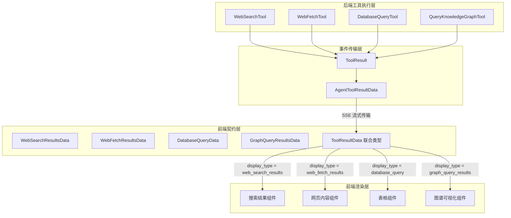

# tool_result_contracts_for_web_and_data_queries 模块深度解析

## 概述：为什么需要这个模块

想象一下，你正在构建一个 AI 助手的前端界面。这个助手可以执行多种工具：搜索互联网、抓取网页内容、查询数据库、遍历知识图谱。每种工具返回的数据结构完全不同——搜索结果是一组带相关性的 URL 列表，数据库查询是行列结构的表格，图谱查询是节点和边的网络。

**核心问题**：前端如何以类型安全的方式处理这些异构的工具结果，并根据结果类型渲染不同的 UI 组件？

**朴素方案的缺陷**：如果直接用 `any` 类型接收所有工具结果，前端将失去类型检查保护，任何字段访问都可能引发运行时错误。更糟糕的是，当后端数据结构变化时，TypeScript 编译器无法发出警告。

**本模块的设计洞察**：使用**可辨识联合（Discriminated Union）**模式。每个工具结果类型都有一个 `display_type` 字段作为"类型标签"，前端可以根据这个标签精确推断出剩余字段的类型。这就像机场的行李分拣系统——每个行李牌上的目的地代码决定了它应该进入哪条传送带。

本模块定义了四种外部数据查询工具的结果契约：
- **WebSearchResultsData**：互联网搜索结果
- **WebFetchResultsData**：网页内容抓取结果
- **DatabaseQueryData**：结构化数据库查询结果
- **GraphQueryResultsData**：知识图谱查询结果

这些契约是后端工具执行结果与前端 UI 渲染之间的**类型安全桥梁**。

---

## 架构与数据流



### 数据流追踪

**端到端路径**（以 Web 搜索为例）：

1. **工具执行**：`WebSearchTool` 调用 `WebSearchService` 执行搜索，将原始结果转换为 `map[string]interface{}` 放入 `ToolResult.Data`
2. **事件封装**：`ToolResult` 被包装进 `AgentToolResultData`，添加 `tool_call_id`、`duration_ms` 等元数据
3. **流式传输**：通过 SSE（Server-Sent Events）将事件推送到前端
4. **类型契约**：前端接收 JSON 数据，用 `WebSearchResultsData` 接口进行类型断言
5. **UI 渲染**：根据 `display_type === 'web_search_results'` 选择对应的渲染组件

**关键观察**：后端的 `Data map[string]interface{}` 是**弱类型**的，而前端的 TypeScript 接口是**强类型**的。这种不对称性是有意为之——后端需要灵活性来组装不同结构的数据，前端需要类型安全来保证渲染正确性。

---

## 核心组件深度解析

### 1. WebSearchResultsData：互联网搜索结果契约

```typescript
export interface WebSearchResultsData {
    display_type: 'web_search_results';
    query: string;
    results: WebSearchResultItem[];
    count: number;
}
```

**设计意图**：这个接口回答了两个问题——"用户搜索了什么"（`query`）和"找到了什么"（`results`）。`count` 字段看似冗余（可以通过 `results.length` 获得），但它的存在有两个理由：
1. **性能优化**：前端可以在不遍历数组的情况下显示"找到 X 条结果"
2. **语义明确**：`count` 代表"总结果数"，而 `results.length` 代表"本次返回的结果数"，两者在分页场景下可能不同

**内部结构**：`WebSearchResultItem` 包含搜索结果的核心元数据：
- `result_index`：结果在列表中的位置，用于渲染序号
- `title` / `url` / `snippet`：标准搜索引擎三要素
- `source`：信息来源（如 "bing"、"google"），用于显示来源图标
- `published_at`：发布时间，对新闻类搜索尤为重要

**使用场景**：当 Agent 需要获取实时信息（如"今天北京的天气"、"最新的 AI 新闻"）时，会调用 Web 搜索工具，返回结果以此契约传输。

### 2. WebFetchResultsData：网页内容抓取契约

```typescript
export interface WebFetchResultsData {
    display_type: 'web_fetch_results';
    results: WebFetchResultItem[];
    count?: number;
}
```

**与 WebSearchResultsData 的区别**：搜索返回的是"关于网页的元数据"，抓取返回的是"网页的实际内容"。这决定了字段设计的差异：

| 字段 | WebSearch | WebFetch | 原因 |
|------|-----------|----------|------|
| `query` | ✓ | ✗ | 搜索需要记录查询词，抓取只需要 URL |
| `snippet` | ✓ | ✗ | 搜索显示摘要，抓取显示完整内容 |
| `raw_content` | ✗ | ✓ | 抓取需要保留原始 HTML 或提取的文本 |
| `prompt` | ✗ | ✓ | 抓取可以带指令（如"只提取价格信息"） |

**`prompt` 字段的深意**：这个字段支持"定向抓取"。例如，Agent 可以指示抓取工具"从这个 URL 提取所有产品评论"，而不是获取整个页面。这类似于给爬虫一个 XPath 或 CSS 选择器，但用自然语言表达。

**`error` 字段的设计**：网页抓取是失败率较高的操作（网络超时、反爬机制、页面结构变化）。每个 `WebFetchResultItem` 都有独立的 `error` 字段，支持**部分成功**场景——请求 5 个 URL，3 个成功，2 个失败，前端可以分别展示。

### 3. DatabaseQueryData：结构化查询结果契约

```typescript
export interface DatabaseQueryData {
    display_type: 'database_query';
    columns: string[];
    rows: Array<Record<string, any>>;
    row_count: number;
    query: string;
}
```

**核心抽象**：这是典型的**关系型数据模型**——列定义 + 行数据。选择这种结构而非二维数组 `any[][]` 的原因：
1. **自描述性**：`columns` 数组让每行数据的键名明确，前端可以直接渲染表头
2. **类型安全**：`Record<string, any>` 允许每列有不同的数据类型（数字、字符串、日期）
3. **可访问性**：`row['column_name']` 比 `row[0]` 更易读且不易出错

**`query` 字段的双重作用**：
- **调试**：当结果异常时，开发者可以查看实际执行的 SQL
- **透明度**：向用户展示 Agent 执行了什么查询，建立信任

**安全考量**：注意这个接口只传输**查询结果**，不传输数据库结构信息。这是有意为之——数据库 schema 可能包含敏感信息（如表名暗示业务逻辑）。实际的表结构查询由独立的 `DataSchemaTool` 处理。

### 4. GraphQueryResultsData：知识图谱查询契约

```typescript
export interface GraphQueryResultsData {
    display_type: 'graph_query_results';
    results: SearchResultItem[];
    count: number;
    graph_config: GraphConfig;
}
```

**最复杂的契约**：图谱查询结果需要同时表达"检索到的内容"和"内容的结构关系"。

**`graph_config` 的设计意图**：这个字段告诉前端"如何可视化图谱"。`nodes` 和 `relations` 数组定义了图谱中出现的实体类型和关系类型。例如：
```typescript
graph_config: {
    nodes: ['人物', '公司', '产品'],
    relations: ['任职于', '创立', '生产']
}
```

前端可以用这些信息：
- 为不同类型的节点选择不同颜色/图标
- 在图例中显示所有关系类型
- 过滤特定类型的节点或边

**复用 `SearchResultItem`**：注意 `results` 字段复用了搜索结果的类型。这是因为图谱查询的底层实现通常也是基于向量检索或关键词匹配，返回的仍然是带相关性分数的"块"（chunk）。图谱的特殊性在于这些块之间存在显式的关系边。

---

## 依赖关系分析

### 上游依赖：本模块调用什么

本模块是**纯类型定义**，不依赖任何运行时模块。但它隐式依赖以下后端组件的数据结构：

| 前端接口 | 对应后端工具 | 数据转换位置 |
|----------|-------------|-------------|
| `WebSearchResultsData` | `internal.agent.tools.web_search.WebSearchTool` | 工具执行后组装 `ToolResult.Data` |
| `WebFetchResultsData` | `internal.agent.tools.web_fetch.WebFetchTool` | 工具执行后组装 `ToolResult.Data` |
| `DatabaseQueryData` | `internal.agent.tools.database_query.DatabaseQueryTool` | 工具执行后组装 `ToolResult.Data` |
| `GraphQueryResultsData` | `internal.agent.tools.query_knowledge_graph.QueryKnowledgeGraphTool` | 工具执行后组装 `ToolResult.Data` |

**关键契约**：后端工具必须确保 `ToolResult.Data` 中的 `display_type` 字段与前端接口匹配。这是一个**隐式合同**——TypeScript 编译器无法验证后端是否正确设置了这个字段，只能通过集成测试保证。

### 下游依赖：什么调用本模块

本模块被前端以下组件消费：

1. **工具结果渲染组件**：根据 `display_type` 选择对应的 UI 组件
2. **类型守卫函数**：用于在运行时缩小 `ToolResultData` 联合类型的范围
3. **状态管理 Store**：存储工具结果供其他组件访问

**典型使用模式**：
```typescript
// 类型守卫函数
function isWebSearchResults(data: ToolResultData): data is WebSearchResultsData {
    return data.display_type === 'web_search_results';
}

// 使用场景
function renderToolResult(result: ToolResultData) {
    if (isWebSearchResults(result)) {
        // TypeScript 在这里知道 result 是 WebSearchResultsData
        return <WebSearchResults results={result.results} />;
    }
    // ... 其他类型
}
```

---

## 设计决策与权衡

### 1. 显式 `display_type` vs 运行时类型推断

**选择**：使用显式的 `display_type` 字段作为类型标识。

**替代方案**：可以使用 TypeScript 的 `in` 操作符检查特定字段存在性来推断类型（如 `if ('query' in data)` 推断为 `WebSearchResultsData`）。

**权衡分析**：
| 方案 | 优点 | 缺点 |
|------|------|------|
| 显式 `display_type` | 语义清晰、易于调试、后端可控制 | 需要额外字段、可能忘记设置 |
| 字段存在性推断 | 无需额外字段、类型安全 | 字段冲突时歧义、难以调试 |

**为什么选择显式**：在这个场景中，`display_type` 不仅用于类型推断，还直接对应 UI 组件的选择。将"显示类型"作为一等公民暴露出来，使代码意图更明确。

### 2. 联合类型 vs 继承层次

**选择**：使用联合类型 `ToolResultData = A | B | C | D`。

**替代方案**：使用基类 `ToolResultDataBase` + 子类继承。

**权衡分析**：
- **联合类型**更符合 TypeScript 的函数式风格，支持模式匹配和类型守卫
- **继承层次**更适合需要共享状态和行为的场景

**为什么选择联合类型**：工具结果之间几乎没有共享状态（除了 `display_type`），但需要频繁的类型分支处理。联合类型配合类型守卫是更轻量的方案。

### 3. 必填字段 vs 可选字段

**观察**：接口中混合使用必填和可选字段。例如 `WebFetchResultsData.count` 是可选的，而 `WebSearchResultsData.count` 是必填的。

**设计理由**：
- **必填**：渲染组件**必须**依赖的字段（如 `WebSearchResultsData.query` 用于显示搜索词）
- **可选**：有合理默认值或某些场景下不存在的字段（如 `WebFetchResultsData.count` 可以通过 `results.length` 推导）

**潜在陷阱**：可选字段的不一致使用可能导致前端代码需要额外的空值检查。建议在新接口中遵循"能必填则必填"原则。

### 4. 扁平结构 vs 嵌套结构

**选择**：接口设计偏向扁平。例如 `DatabaseQueryData` 直接使用 `columns` + `rows`，而非嵌套的 `schema` + `data` 对象。

**权衡**：
- **扁平**：访问路径短（`data.rows`），但字段命名空间可能冲突
- **嵌套**：语义分组清晰（`data.schema.columns`），但访问冗长

**为什么选择扁平**：工具结果通常在渲染时一次性访问所有字段，扁平结构减少了解包开销。

---

## 使用指南与示例

### 基本使用模式

```typescript
import { ToolResultData, WebSearchResultsData } from '@/types/tool-results';

// 1. 类型守卫
function isWebSearch(data: ToolResultData): data is WebSearchResultsData {
    return data.display_type === 'web_search_results';
}

// 2. 条件渲染
function ToolResultRenderer({ data }: { data: ToolResultData }) {
    switch (data.display_type) {
        case 'web_search_results':
            return <WebSearchView results={data.results} query={data.query} />;
        case 'database_query':
            return <TableView columns={data.columns} rows={data.rows} />;
        case 'graph_query_results':
            return <GraphView results={data.results} config={data.graph_config} />;
        default:
            return <UnknownTypeWarning type={data.display_type} />;
    }
}
```

### 后端数据组装示例（Go）

```go
// WebSearchTool 执行后组装结果
func (t *WebSearchTool) Execute(input WebSearchInput) (*ToolResult, error) {
    results, err := t.webSearchService.Search(input.Query, input.MaxResults)
    if err != nil {
        return &ToolResult{Success: false, Error: err.Error()}, nil
    }
    
    // 转换为前端契约格式
    data := map[string]interface{}{
        "display_type": "web_search_results",
        "query":        input.Query,
        "count":        len(results),
        "results": results, // 每个元素符合 WebSearchResultItem 结构
    }
    
    return &ToolResult{
        Success: true,
        Output:  fmt.Sprintf("找到 %d 条搜索结果", len(results)),
        Data:    data,
    }, nil
}
```

### 扩展新工具结果类型

当需要添加新的工具结果类型时：

1. **定义新接口**（确保 `display_type` 唯一）：
```typescript
export interface WeatherQueryData {
    display_type: 'weather_query';  // 新增唯一标识
    location: string;
    temperature: number;
    conditions: string;
}
```

2. **更新联合类型**：
```typescript
export type ToolResultData =
    | SearchResultsData
    | WeatherQueryData  // 新增
    | ...;
```

3. **添加类型守卫**（可选但推荐）：
```typescript
export function isWeatherQuery(data: ToolResultData): data is WeatherQueryData {
    return data.display_type === 'weather_query';
}
```

4. **更新渲染组件**：
```typescript
case 'weather_query':
    return <WeatherView location={data.location} temp={data.temperature} />;
```

---

## 边界情况与陷阱

### 1. `display_type` 不匹配

**问题**：后端返回的 `display_type` 值在前端联合类型中不存在。

**表现**：TypeScript 类型收窄失败，所有分支都不匹配，进入 `default` 分支。

**防御措施**：
- 在 `default` 分支记录警告日志，包含未知的 `display_type` 值
- 考虑添加"未知类型"的通用渲染器，至少显示原始 JSON

### 2. 部分字段缺失

**问题**：后端由于某些原因未返回预期字段（如网络截断、序列化错误）。

**表现**：前端访问 `undefined` 导致运行时错误。

**防御措施**：
```typescript
// 使用可选链和默认值
const count = data.count ?? data.results?.length ?? 0;
```

### 3. 大数据量性能问题

**问题**：`WebFetchResultsData` 的 `raw_content` 可能包含整个 HTML 页面，传输和渲染成本高。

**建议**：
- 后端应默认只返回提取后的文本，`raw_content` 仅在调试模式下返回
- 前端对大文本内容进行截断显示，提供"展开"交互

### 4. 时间敏感数据

**问题**：`WebSearchResultItem.published_at` 是字符串，时区处理不明确。

**建议**：
- 后端统一使用 ISO 8601 格式（如 `2024-01-15T10:30:00Z`）
- 前端使用 `Date` 对象解析并本地化显示

### 5. 安全考虑

**数据库查询结果**：`DatabaseQueryData.rows` 的类型是 `Array<Record<string, any>>`，可能包含敏感数据。

**风险**：如果后端未正确过滤，可能泄露数据库中的敏感字段。

**缓解**：
- 后端工具应实施行级和列级权限控制
- 避免在查询结果中返回密码哈希、PII 等敏感信息

---

## 相关模块参考

- **[tool_result_contracts_for_content_and_retrieval](tool_result_contracts_for_content_and_retrieval.md)**：定义知识库检索相关的结果契约（`SearchResultsData`、`ChunkDetailData` 等）
- **[tool_result_contracts_for_agent_reasoning_flow](tool_result_contracts_for_agent_reasoning_flow.md)**：定义 Agent 推理过程的结果契约（`ThinkingData`、`PlanData`、`ActionData`）
- **[agent_runtime_and_tools](agent_runtime_and_tools.md)**：后端工具实现，包括 `WebSearchTool`、`WebFetchTool` 等
- **[core_domain_types_and_interfaces](core_domain_types_and_interfaces.md)**：核心领域类型定义，包括 `ToolResult` 基础结构

---

## 总结

`tool_result_contracts_for_web_and_data_queries` 模块是前后端协作的**类型安全边界**。它通过可辨识联合模式，将后端灵活的数据组装与前端严格的类型检查结合起来。理解这个模块的关键在于把握三个核心概念：

1. **`display_type` 是类型标签**：它既是运行时分支的依据，也是 TypeScript 类型推断的线索
2. **契约是双向的**：后端承诺按契约格式返回数据，前端承诺按契约结构渲染 UI
3. **灵活性在边界**：后端 `map[string]interface{}` 提供组装灵活性，前端 TypeScript 接口提供消费安全性

当你在扩展新工具或修改现有结果结构时，始终问自己：这个变更是否破坏了前后端之间的隐式合同？如果是，需要同步更新哪些部分？
