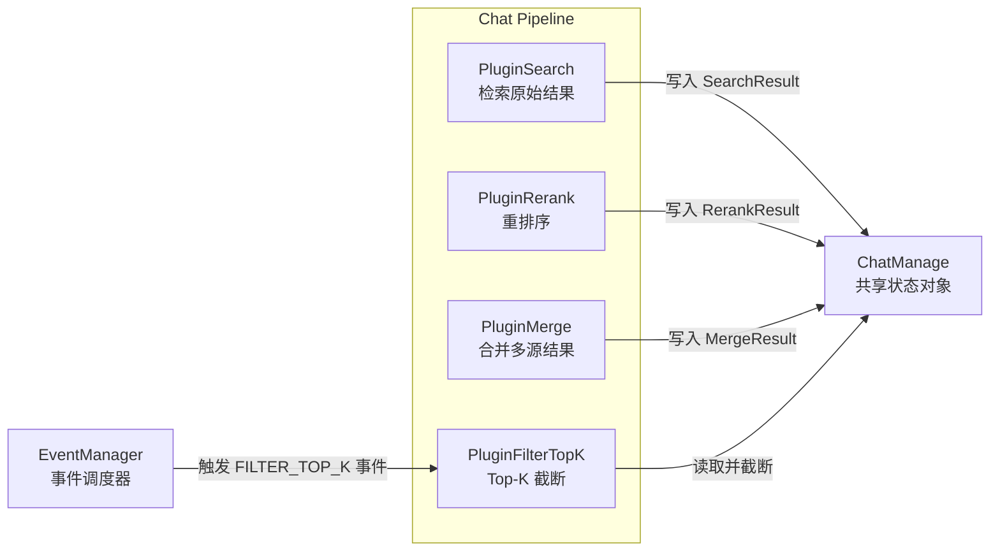
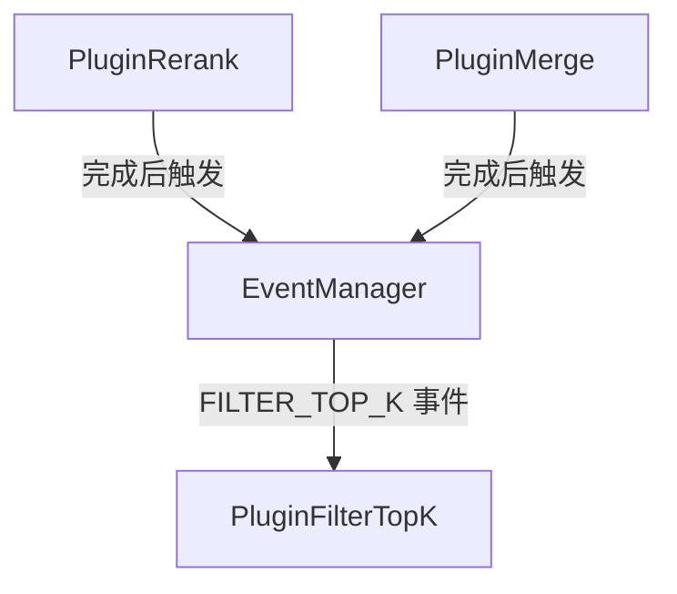

# Top-K Result Selection Plugin

## 概述

想象你在图书馆找书：检索系统从百万藏书中找出 500 本相关书籍，排序算法根据相关性重新排列它们，但最后你只需要带走最相关的 10 本。`PluginFilterTopK` 就是这个"最后一步"——它不决定哪些书更好，只负责在管道末端截断结果集，确保下游 LLM 接收的上下文窗口不会爆炸。

这个模块的核心洞察是：**Top-K 过滤应该发生在结果丰富化（rerank/merge）之后，而不是之前**。如果在检索后立即截断，可能会丢失经过重排序后本应进入前 K 的优质结果。因此，这个插件被设计为管道中的"守门人"，在 `PluginRerank` 和 `PluginMerge` 之后执行，根据 `RerankTopK` 配置对最终结果集进行裁剪。

## 架构与数据流



### 组件角色

| 组件 | 职责 | 类比 |
|------|------|------|
| `PluginFilterTopK` | 响应 `FILTER_TOP_K` 事件，对结果集进行截断 | 机场安检的最后一道闸门 —— 只允许指定数量的乘客登机 |
| `EventManager` | 管理插件注册和事件分发 | 管道中的交通信号灯系统 |
| `ChatManage` | 携带检索结果的状态容器 | 流水线上的传送带，承载不同阶段的工件 |

### 数据流动路径

1. **检索阶段**：`PluginSearch` 执行向量/关键词检索，将原始结果写入 `ChatManage.SearchResult`
2. **重排序阶段**：`PluginRerank` 使用 Rerank 模型对结果重新打分，输出到 `ChatManage.RerankResult`
3. **合并阶段**：`PluginMerge` 可能将多源结果合并到 `ChatManage.MergeResult`
4. **过滤阶段**（本模块）：`PluginFilterTopK` 按优先级检查 `MergeResult → RerankResult → SearchResult`，对第一个非空的结果集执行截断

## 核心组件深度解析

### PluginFilterTopK

#### 设计意图

这是一个**无状态、幂等**的过滤器插件。它的设计遵循"最少惊讶原则"：
- 不修改配置参数（`RerankTopK` 只读）
- 不改变结果顺序（假设上游已正确排序）
- 不执行复杂计算（仅切片操作）

#### 内部机制

```go
// 核心过滤逻辑
filterTopK := func(searchResult []*types.SearchResult, topK int) []*types.SearchResult {
    if topK > 0 && len(searchResult) > topK {
        searchResult = searchResult[:topK]  // 原地切片，不分配新内存
    }
    return searchResult
}
```

这个闭包的关键设计决策：
- **`topK > 0` 检查**：允许通过设置 `RerankTopK = 0` 或负数来**禁用过滤**，这在调试或实验场景中很有用
- **`len(searchResult) > topK` 检查**：避免对已经少于 K 个的结果进行无操作切片
- **切片而非复制**：`searchResult[:topK]` 返回原数组的视图，避免不必要的内存分配。代价是调用者需要注意不要意外修改底层数组

#### 优先级链

```go
if len(chatManage.MergeResult) > 0 {
    chatManage.MergeResult = filterTopK(chatManage.MergeResult, chatManage.RerankTopK)
} else if len(chatManage.RerankResult) > 0 {
    chatManage.RerankResult = filterTopK(chatManage.RerankResult, chatManage.RerankTopK)
} else if len(chatManage.SearchResult) > 0 {
    chatManage.SearchResult = filterTopK(chatManage.SearchResult, chatManage.RerankTopK)
}
```

这个优先级链反映了管道的**数据丰富化程度**：
1. `MergeResult`（最高优先级）：经过合并的最终结果，可能整合了多个知识源
2. `RerankResult`：经过重排序的结果，相关性分数更可靠
3. `SearchResult`（最低优先级）：原始检索结果，仅作为兜底

这种设计允许管道在不同配置下灵活运行：如果禁用 Rerank，插件会自动降级到过滤 `SearchResult`。

#### 参数与返回值

| 参数 | 类型 | 说明 |
|------|------|------|
| `ctx` | `context.Context` | 请求上下文，用于日志追踪和超时控制 |
| `eventType` | `types.EventType` | 触发事件类型（固定为 `FILTER_TOP_K`） |
| `chatManage` | `*types.ChatManage` | **输入输出参数**，携带并修改检索结果 |
| `next` | `func() *PluginError` | 管道链中的下一个插件调用 |

**返回值**：`*PluginError` —— 返回 `next()` 的结果，表示继续执行管道链；如果出错则返回错误

#### 副作用

- **修改 `ChatManage`**：直接修改传入的状态对象，这是 Go 管道模式的常见做法，避免深拷贝开销
- **日志输出**：通过 `pipelineInfo` 和 `pipelineWarn` 记录输入输出统计，用于调试和监控

### 事件激活机制

```go
func (p *PluginFilterTopK) ActivationEvents() []types.EventType {
    return []types.EventType{types.FILTER_TOP_K}
}
```

这个设计实现了**关注点分离**：插件不需要知道何时被调用，只需声明自己关心哪些事件。`EventManager` 负责在正确的时机触发 `FILTER_TOP_K` 事件（通常在 `PluginMerge` 之后）。

## 依赖分析

### 上游依赖（谁调用它）



- **`EventManager`**：直接调用者，通过 `OnEvent` 方法触发插件
- **`PluginRerank` / `PluginMerge`**：间接依赖，它们的完成会触发 `FILTER_TOP_K` 事件

### 下游依赖（它调用谁）

- **`next()` 函数**：管道链中的下一个插件，通常是 `PluginIntoChatMessage` 或 `PluginChatCompletion`
- **日志函数**：`pipelineInfo`、`pipelineWarn`（内部工具函数）

### 数据契约

#### 输入契约（从 ChatManage 读取）

| 字段 | 类型 | 约束 |
|------|------|------|
| `RerankTopK` | `int` | 必须 ≥ 0；0 或负数表示不过滤 |
| `MergeResult` / `RerankResult` / `SearchResult` | `[]*SearchResult` | 至少一个非空（否则记录警告） |

#### 输出契约（对 ChatManage 修改）

- 被选中的结果集长度 ≤ `RerankTopK`（如果 `RerankTopK > 0`）
- 结果顺序保持不变（假设上游已正确排序）
- 其他字段不受影响

#### 违反契约的后果

- 如果 `RerankTopK < 0`：当前实现会跳过过滤（因为 `topK > 0` 检查），但这可能是配置错误
- 如果所有结果集都为空：记录警告但继续执行，不会中断管道

## 设计决策与权衡

### 1. 为什么在 Rerank/Merge 之后过滤，而不是之前？

**选择**：后置过滤

**权衡分析**：
- **前置过滤的优点**：减少 Rerank 的计算量（Rerank 是 LLM 调用，成本高）
- **前置过滤的缺点**：可能丢失优质结果。例如：检索返回 100 条，前置过滤取前 20 条，但 Rerank 后发现第 21-50 条中有 5 条比前 20 条更相关

**当前设计的理由**：
1. **质量优先**：确保 Rerank 能看到足够多的候选结果
2. **配置灵活性**：可以通过调整 `EmbeddingTopK`（检索阶段）和 `RerankTopK`（过滤阶段）独立控制两阶段的数量
3. **可观察性**：日志中可以对比过滤前后的数量，评估 Rerank 的效果

**改进空间**：对于高并发场景，可以考虑**自适应前置过滤**——如果 `EmbeddingTopK` 远大于 `RerankTopK`，可以在检索后先做一个粗过滤（如基于向量分数），减少 Rerank 的输入量。

### 2. 为什么使用优先级链而不是统一的结果字段？

**选择**：检查 `MergeResult → RerankResult → SearchResult`

**权衡分析**：
- **统一字段的优点**：简化逻辑，不需要判断哪个字段有数据
- **优先级链的优点**：保留管道的阶段性状态，便于调试和中间结果复用

**当前设计的理由**：
1. **调试友好**：可以查看每个阶段的结果数量，定位问题
2. **向后兼容**：旧代码可能直接访问 `SearchResult`，统一字段会破坏兼容性
3. **灵活配置**：某些场景可能只需要 Rerank 而不需要 Merge

**潜在问题**：如果未来添加新的结果类型（如 `HybridResult`），需要修改优先级链，违反开闭原则。更好的设计可能是引入一个 `GetFinalResults()` 方法封装优先级逻辑。

### 3. 为什么直接修改 ChatManage 而不是返回新对象？

**选择**：原地修改

**权衡分析**：
- **返回新对象的优点**：函数式风格，无副作用，易于测试和推理
- **原地修改的优点**：避免深拷贝，减少内存分配和 GC 压力

**当前设计的理由**：
1. **性能敏感**：检索结果可能包含大量 `SearchResult` 对象，深拷贝成本高
2. **管道模式惯例**：整个 Chat Pipeline 都采用原地修改模式，保持一致性
3. **生命周期管理**：`ChatManage` 的生命周期与请求绑定，请求结束后即释放，不需要保留历史状态

**风险**：调用者需要注意不要在过滤后访问被截断的部分（虽然当前代码没有这种需求）。

### 4. 为什么使用闭包 `filterTopK` 而不是独立函数？

**选择**：局部闭包

**理由**：
1. **作用域隔离**：`filterTopK` 只在这个方法中使用，不需要暴露为包级函数
2. **捕获上下文**：可以访问 `ctx` 参数用于日志（虽然当前实现没有使用）
3. **代码内聚**：过滤逻辑与使用场景紧密耦合，放在一起更易读

## 使用指南

### 基本配置

`PluginFilterTopK` 的行为由 `ChatManage.RerankTopK` 控制：

```go
// 示例：创建 ChatManage 并配置 Top-K
chatManage := &types.ChatManage{
    SessionID:    "session-123",
    RerankTopK:   10,  // 最终保留 10 条结果
    // ... 其他配置
}

// 注册插件
eventManager := NewEventManager()
filterPlugin := NewPluginFilterTopK(eventManager)

// 触发事件（通常由管道自动完成）
err := eventManager.Dispatch(ctx, types.FILTER_TOP_K, chatManage)
```

### 典型场景

#### 场景 1：标准 RAG 流程

```go
ChatManage{
    EmbeddingTopK: 50,   // 检索 50 条
    RerankTopK:    10,   // 过滤到 10 条
    // 流程：Search(50) → Rerank(50) → FilterTopK(10) → LLM
}
```

#### 场景 2：禁用 Rerank 的快速模式

```go
ChatManage{
    EmbeddingTopK: 20,   // 检索 20 条
    RerankModelID: "",   // 空表示禁用 Rerank
    RerankTopK:    10,   // 直接过滤检索结果
    // 流程：Search(20) → FilterTopK(10) → LLM
}
```

#### 场景 3：调试模式（保留所有结果）

```go
ChatManage{
    EmbeddingTopK: 100,
    RerankTopK:    0,    // 0 表示不过滤
    // 流程：Search(100) → Rerank(100) → FilterTopK(跳过) → LLM
    // 注意：可能导致 LLM 上下文溢出！
}
```

### 扩展点

#### 添加自定义过滤逻辑

如果需要基于分数阈值或其他条件过滤，可以创建新的插件：

```go
type PluginFilterByScore struct{}

func (p *PluginFilterByScore) OnEvent(ctx context.Context, 
    eventType types.EventType, chatManage *types.ChatManage, 
    next func() *PluginError,
) *PluginError {
    // 自定义过滤逻辑
    var filtered []*types.SearchResult
    for _, result := range chatManage.RerankResult {
        if result.Score >= chatManage.RerankThreshold {
            filtered = append(filtered, result)
        }
    }
    chatManage.RerankResult = filtered
    return next()
}
```

## 边界情况与陷阱

### 1. RerankTopK = 0 的语义

**行为**：跳过过滤，保留所有结果

**风险**：如果 `EmbeddingTopK` 设置很大（如 100），可能导致 LLM 上下文溢出

**建议**：在生产环境中，应该对 `RerankTopK` 设置合理的上限（如 20-50），并在配置验证阶段进行检查

### 2. 结果集为空的静默处理

```go
if len(chatManage.MergeResult) > 0 {
    // ...
} else if len(chatManage.RerankResult) > 0 {
    // ...
} else if len(chatManage.SearchResult) > 0 {
    // ...
} else {
    pipelineWarn(ctx, "FilterTopK", "skip", map[string]interface{}{
        "reason": "no_results",
    })
}
```

**行为**：记录警告但继续执行，不中断管道

**影响**：下游插件（如 `PluginChatCompletion`）会收到空结果集，可能触发 Fallback 策略

**调试技巧**：检查日志中的 `FilterTopK skip` 警告，追溯上游哪个阶段产生了空结果

### 3. 切片共享底层数组

```go
searchResult = searchResult[:topK]  // 返回原数组的视图
```

**风险**：如果调用者后续修改 `searchResult` 的前 K 个元素，会影响原数组

**当前影响**：低，因为管道是单向的，过滤后不会再修改结果集

**防御措施**：如果需要保留完整结果集用于其他用途，应该在过滤前深拷贝：
```go
// 如果需要保留原结果
original := make([]*types.SearchResult, len(searchResult))
copy(original, searchResult)
searchResult = searchResult[:topK]
```

### 4. 优先级链的隐式假设

**假设**：`MergeResult` 如果存在，一定是"最终"结果

**风险**：如果未来管道逻辑变化，`MergeResult` 可能在 `RerankResult` 之前生成，优先级链会产生错误结果

**缓解**：在 `PluginMerge` 的文档中明确说明它应该在 `PluginRerank` 之后执行，并通过 `EventManager` 的事件顺序保证

## 监控与调试

### 关键日志指标

| 日志字段 | 含义 | 正常范围 |
|----------|------|----------|
| `merge_cnt` / `rerank_cnt` / `search_cnt` (input) | 过滤前各结果集数量 | 至少一个 > 0 |
| `before` / `after` | 过滤前后数量对比 | `after` ≤ `before` 且 `after` ≤ `RerankTopK` |
| `skip: no_results` | 所有结果集为空 | 应罕见出现 |

### 常见问题排查

**问题**：过滤后结果数量仍大于 `RerankTopK`

**可能原因**：
1. `RerankTopK` 配置为 0 或负数
2. 结果集长度本身就小于 `RerankTopK`（正常情况）

**排查步骤**：
```bash
# 检查日志中的 input 和 output 对比
grep "FilterTopK" request-logs.json | jq '.input, .output'
```

**问题**：过滤后结果为空，但上游显示有结果

**可能原因**：优先级链判断错误，检查哪个结果集实际有数据

**排查步骤**：
```bash
# 检查三个结果集的数量
grep "FilterTopK.*input" request-logs.json | jq '.merge_cnt, .rerank_cnt, .search_cnt'
```

## 相关模块

- [PluginRerank](rerank_plugin.md) — 重排序插件，在 FilterTopK 之前执行
- [PluginMerge](merge_plugin.md) — 结果合并插件，可能与 FilterTopK 交替执行
- [PluginSearch](search_plugin.md) — 检索插件，产生原始 SearchResult
- [EventManager](chat_pipeline.md) — 事件管理器，调度插件执行顺序
- [ChatManage](chat_manage.md) — 状态容器，携带检索结果和配置
