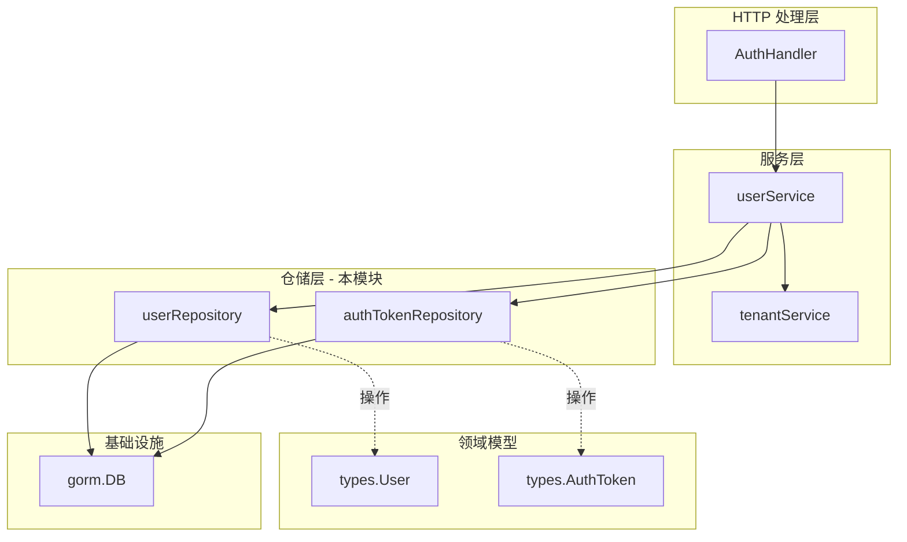

# user_identity_and_auth_repositories 模块深度解析

## 概述：为什么需要这个模块

想象一下，你正在设计一个多租户 SaaS 系统的身份认证层。最直观的做法是什么？在需要验证用户时直接写 SQL 查询，在需要生成 token 时直接操作数据库表。这种做法在系统规模较小时可行，但当系统需要支持多种认证方式、token 轮换策略、审计日志、缓存层时，代码会迅速变得难以维护。

`user_identity_and_auth_repositories` 模块正是为了解决这个问题而存在。它实现了**仓储模式（Repository Pattern）**，将用户和认证 token 的数据访问逻辑封装在统一的接口背后。这个模块的核心设计洞察是：**身份认证的数据访问逻辑应该与业务逻辑解耦** —— 服务层不应该关心用户数据是存储在 PostgreSQL、MySQL 还是其他存储系统中，也不应该关心 token 的查询是用原生 SQL 还是 ORM 实现的。

这个模块只负责两件事：
1. **用户记录的持久化** —— 用户的增删改查、搜索、列表
2. **认证 token 的生命周期管理** —— token 的创建、验证、撤销、过期清理

所有与认证相关的业务逻辑（如密码验证、JWT 生成、token 刷新策略）都位于上层的 [`userService`](../application_services_and_orchestration.md) 中，本模块只专注于"如何存储和检索数据"这一单一职责。

---

## 架构与数据流



### 组件角色说明

| 组件 | 角色 | 职责 |
|------|------|------|
| `userRepository` | 用户数据仓储 | 封装所有用户记录的 CRUD 操作，提供按 ID、邮箱、用户名查询的能力 |
| `authTokenRepository` | 认证 token 仓储 | 管理 token 的完整生命周期，包括创建、查询、撤销、过期清理 |
| `userService`（上层依赖） | 身份认证服务 | 实现注册、登录、token 生成与验证等业务逻辑，依赖本模块的两个仓储 |
| `AuthHandler`（调用方） | HTTP 处理器 | 接收认证相关的 HTTP 请求，委托给 `userService` 处理 |

### 数据流追踪：以登录流程为例

1. **请求入口**：`AuthHandler.Login()` 接收 `LoginRequest`（包含 email 和 password）
2. **服务层处理**：`userService.Login()` 被调用
3. **用户查询**：`userService` 调用 `userRepository.GetUserByEmail()` 获取用户记录
4. **密码验证**：`userService` 验证密码（业务逻辑，不在本模块）
5. **Token 生成**：`userService` 生成 JWT token（业务逻辑，不在本模块）
6. **Token 持久化**：`userService` 调用 `authTokenRepository.CreateToken()` 存储 token
7. **返回响应**：`LoginResponse` 返回给客户端

可以看到，本模块在数据流中处于**持久化层**，它不决定"何时创建 token"或"如何验证密码"，只负责"如何存储和检索这些数据"。

---

## 组件深度解析

### userRepository：用户数据的统一访问入口

#### 设计意图

`userRepository` 的核心设计目标是**提供一致的用户数据访问语义**。在多租户系统中，用户可能通过 ID、邮箱或用户名被引用，不同场景下需要不同的查询方式。这个结构将所有这些查询统一在一个接口背后，使得上层服务不需要关心底层数据库的查询细节。

#### 内部机制

```go
type userRepository struct {
    db *gorm.DB
}
```

结构非常简单，只持有一个 `*gorm.DB` 实例。这种设计的优点是：
- **依赖最小化**：除了 GORM 没有其他外部依赖
- **易于测试**：可以通过 mock `*gorm.DB` 或使用内存数据库进行测试
- **事务支持**：GORM 的 `WithContext()` 方法天然支持事务传播

#### 关键方法分析

**1. `GetUserByID` / `GetUserByEmail` / `GetUserByUsername`**

这三个方法遵循相同的模式：
```go
func (r *userRepository) GetUserByEmail(ctx context.Context, email string) (*types.User, error) {
    var user types.User
    if err := r.db.WithContext(ctx).Where("email = ?", email).First(&user).Error; err != nil {
        if errors.Is(err, gorm.ErrRecordNotFound) {
            return nil, ErrUserNotFound
        }
        return nil, err
    }
    return &user, nil
}
```

**设计要点**：
- 使用 `First()` 而非 `Find()`，因为查询条件应该是唯一的
- 将 `gorm.ErrRecordNotFound` 转换为领域特定的 `ErrUserNotFound` 错误，这样上层服务不需要导入 GORM 的错误类型
- 返回指针而非值，避免不必要的大结构体拷贝

**2. `SearchUsers`**

```go
func (r *userRepository) SearchUsers(ctx context.Context, query string, limit int) ([]*types.User, error) {
    var users []*types.User
    searchPattern := "%" + query + "%"

    dbQuery := r.db.WithContext(ctx).
        Where("username ILIKE ? OR email ILIKE ?", searchPattern, searchPattern).
        Where("is_active = ?", true).
        Order("username ASC")

    if limit > 0 {
        dbQuery = dbQuery.Limit(limit)
    } else {
        dbQuery = dbQuery.Limit(20) // default limit
    }
    // ...
}
```

**设计要点**：
- 使用 `ILIKE` 进行大小写不敏感的模糊搜索（PostgreSQL 语法）
- 默认只搜索 `is_active = true` 的用户，避免返回已禁用的账户
- 设置默认 limit 为 20，防止意外的大结果集拖慢系统

**潜在问题**：`ILIKE` 是 PostgreSQL 特有的语法，如果系统需要支持 MySQL，这里需要抽象或条件编译。

**3. `CreateUser` 与 `UpdateUser`**

```go
func (r *userRepository) CreateUser(ctx context.Context, user *types.User) error {
    return r.db.WithContext(ctx).Create(user).Error
}

func (r *userRepository) UpdateUser(ctx context.Context, user *types.User) error {
    return r.db.WithContext(ctx).Save(user).Error
}
```

注意 `Create` 和 `Save` 的区别：
- `Create` 只执行 INSERT，如果主键已存在会报错
- `Save` 会根据主键是否存在决定执行 INSERT 还是 UPDATE

这种设计使得上层服务可以明确控制是创建还是更新，避免意外的数据覆盖。

#### 错误处理策略

模块定义了三个领域特定的错误：
```go
var (
    ErrUserNotFound      = errors.New("user not found")
    ErrUserAlreadyExists = errors.New("user already exists")
    ErrTokenNotFound     = errors.New("token not found")
)
```

**设计意图**：将数据库层的错误（如 `gorm.ErrRecordNotFound`、唯一约束冲突）转换为业务语义清晰的错误。这样上层服务可以这样处理：
```go
user, err := r.userRepo.GetUserByEmail(ctx, email)
if errors.Is(err, repository.ErrUserNotFound) {
    // 返回"用户不存在"的 HTTP 404 响应
}
```

而不是：
```go
if errors.Is(err, gorm.ErrRecordNotFound) {
    // 耦合到 GORM 的实现细节
}
```

---

### authTokenRepository：认证 token 的生命周期管家

#### 设计意图

认证 token 是系统安全的核心。与用户记录不同，token 具有以下特点：
- **数量多**：每个用户可能有多个有效 token（多设备登录）
- **生命周期短**：access token 通常几小时过期，refresh token 几天到几周
- **需要主动清理**：过期 token 如果不删除，表会无限增长

`authTokenRepository` 的设计考虑了这些特点，提供了专门的清理和批量操作方法。

#### 核心方法分析

**1. `GetTokenByValue`**

```go
func (r *authTokenRepository) GetTokenByValue(ctx context.Context, tokenValue string) (*types.AuthToken, error) {
    var token types.AuthToken
    if err := r.db.WithContext(ctx).Where("token = ?", tokenValue).First(&token).Error; err != nil {
        if errors.Is(err, gorm.ErrRecordNotFound) {
            return nil, ErrTokenNotFound
        }
        return nil, err
    }
    return &token, nil
}
```

这是 token 验证的核心方法。当收到一个请求时，`userService.ValidateToken()` 会调用此方法获取 token 记录，然后检查：
- `ExpiresAt` 是否已过时
- `IsRevoked` 是否为 true

**设计注意**：`token` 字段存储的是完整的 JWT 或其他格式的 token 字符串。这意味着：
- **优点**：验证 token 时不需要解密或签名验证，直接查库即可
- **缺点**：token 字段是 `text` 类型，查询性能可能不如整数主键

**2. `RevokeTokensByUserID`**

```go
func (r *authTokenRepository) RevokeTokensByUserID(ctx context.Context, userID string) error {
    return r.db.WithContext(ctx).Model(&types.AuthToken{}).Where("user_id = ?", userID).Update("is_revoked", true).Error
}
```

这个方法用于**强制用户下线**场景（如用户修改密码后，需要使所有已有 token 失效）。

**设计选择**：使用软删除（标记 `is_revoked = true`）而非硬删除。这样做的好处是：
- 保留审计日志，可以追溯哪些 token 在何时被撤销
- 避免外键约束问题（如果有其他表引用 token）

**3. `DeleteExpiredTokens`**

```go
func (r *authTokenRepository) DeleteExpiredTokens(ctx context.Context) error {
    return r.db.WithContext(ctx).Where("expires_at < NOW()").Delete(&types.AuthToken{}).Error
}
```

这个方法应该由定时任务定期调用，清理过期 token。

**设计注意**：使用数据库的 `NOW()` 函数而非 Go 的 `time.Now()`，这样可以：
- 避免应用服务器和数据库服务器时钟不同步的问题
- 利用数据库的索引优化（如果 `expires_at` 有索引）

#### AuthToken 模型结构

```go
type AuthToken struct {
    ID        string    `gorm:"type:varchar(36);primaryKey"`
    UserID    string    `gorm:"type:varchar(36);index;not null"`
    Token     string    `gorm:"type:text;not null"`
    TokenType string    `gorm:"type:varchar(50);not null"`
    ExpiresAt time.Time `json:"expires_at"`
    IsRevoked bool      `gorm:"default:false"`
    CreatedAt time.Time
    UpdatedAt time.Time
    User      *User     `gorm:"foreignKey:UserID"`
}
```

**关键字段说明**：
- `TokenType`：区分 `access_token` 和 `refresh_token`，两者过期时间和用途不同
- `IsRevoked`：软删除标记，支持主动撤销 token 而不删除记录
- `User` 关联：GORM 的外键关联，支持 `Preload` 加载用户信息

---

## 依赖关系分析

### 本模块的依赖（向下依赖）

| 依赖 | 类型 | 用途 |
|------|------|------|
| `gorm.io/gorm` | 外部库 | ORM 框架，执行所有数据库操作 |
| `context` | Go 标准库 | 传递请求上下文，支持超时和取消 |
| `errors` | Go 标准库 | 错误处理和判断 |
| `internal/types` | 内部包 | 领域模型定义（`User`、`AuthToken`） |
| `internal/types/interfaces` | 内部包 | 仓储接口定义 |

### 依赖本模块的组件（向上依赖）

| 组件 | 模块 | 依赖方式 |
|------|------|----------|
| `userService` | [`application_services_and_orchestration`](../application_services_and_orchestration.md) | 直接依赖 `interfaces.UserRepository` 和 `interfaces.AuthTokenRepository` |
| `AuthHandler` | [`http_handlers_and_routing`](../http_handlers_and_routing.md) | 通过 `userService` 间接依赖 |
| `organizationService` | [`application_services_and_orchestration`](../application_services_and_orchestration.md) | 可能需要查询用户信息以处理组织成员关系 |

### 数据契约

**输入契约**（服务层调用仓储层时传入的参数）：
- `*types.User`：完整的用户记录，包含所有字段
- `*types.AuthToken`：完整的 token 记录
- 查询参数：`id`、`email`、`username`、`tokenValue`、`userID` 等

**输出契约**（仓储层返回给服务层的数据）：
- `*types.User` / `[]*types.User`：用户记录（指针或指针数组）
- `*types.AuthToken` / `[]*types.AuthToken`：token 记录
- `error`：领域特定的错误（`ErrUserNotFound`、`ErrTokenNotFound` 等）

**隐式契约**：
1. 所有方法都接受 `context.Context`，必须尊重上下文的取消信号
2. 查询方法在记录不存在时返回 `ErrUserNotFound` 或 `ErrTokenNotFound`，而非 `nil`
3. `CreateUser` 在用户已存在时可能返回唯一约束错误（由 GORM 抛出）

---

## 设计决策与权衡

### 1. 为什么使用 GORM 而非原生 SQL？

**选择**：使用 GORM ORM 框架

**权衡分析**：
| 维度 | GORM | 原生 SQL |
|------|------|----------|
| 开发效率 | 高（链式调用，自动映射） | 低（手动编写和映射） |
| 查询性能 | 中等（有 overhead） | 高（完全控制） |
| 可移植性 | 高（支持多种数据库） | 低（SQL 方言差异） |
| 学习曲线 | 低（Go 开发者熟悉） | 中（需要 SQL 知识） |

**为什么选择 GORM**：
- 本模块的查询模式相对简单（主要是主键/唯一键查询），GORM 的性能开销可以接受
- 自动处理 `CreatedAt`、`UpdatedAt` 等审计字段
- 支持事务和预加载，简化上层服务代码

**代价**：
- `SearchUsers` 中使用了 `ILIKE`（PostgreSQL 特有），如果需要支持 MySQL 需要修改
- 复杂查询（如多表 JOIN）时 GORM 的语法可能不如原生 SQL 直观

### 2. 为什么将 UserRepository 和 AuthTokenRepository 分开？

**选择**：两个独立的仓储结构，而非合并为一个 `AuthRepository`

**权衡分析**：

**分开的优点**：
- **单一职责**：每个结构只负责一种实体的持久化
- **独立演化**：可以独立修改用户或 token 的存储逻辑，不影响对方
- **测试隔离**：可以单独测试用户或 token 的仓储逻辑

**分开的缺点**：
- 需要两个独立的数据库连接（虽然实际上共享同一个 `*gorm.DB` 实例）
- 某些跨实体的操作（如删除用户时同时删除 token）需要在服务层协调

**为什么选择分开**：
- 用户和 token 的生命周期不同：用户记录长期存在，token 频繁创建和销毁
- 符合领域驱动设计（DDD）的聚合根概念：`User` 和 `AuthToken` 是两个独立的聚合根

### 3. 为什么使用软删除（IsRevoked）而非硬删除？

**选择**：token 撤销时设置 `is_revoked = true`，而非直接删除记录

**权衡分析**：
| 维度 | 软删除 | 硬删除 |
|------|--------|--------|
| 审计能力 | 保留完整历史 | 无法追溯 |
| 存储成本 | 较高（记录累积） | 较低 |
| 查询复杂度 | 需要过滤 `is_revoked` | 简单 |
| 外键约束 | 安全（记录存在） | 可能违反约束 |

**为什么选择软删除**：
- 安全审计需求：需要知道哪些 token 在何时被撤销（如安全事件调查）
- 避免外键问题：如果有其他表引用 token ID，硬删除会导致约束冲突

**注意事项**：
- 查询有效 token 时必须加上 `WHERE is_revoked = false` 条件
- 需要定期运行 `DeleteExpiredTokens` 清理过期记录，否则表会无限增长

### 4. 为什么返回指针而非值？

**选择**：所有查询方法返回 `*types.User` 而非 `types.User`

**原因**：
1. **避免拷贝**：`User` 和 `AuthToken` 结构体包含多个字段，指针传递更高效
2. **表示可选性**：返回 `nil` 可以明确表示"记录不存在"，而值类型需要额外的布尔返回值
3. **支持修改**：上层服务可以直接修改返回的结构体，然后调用 `UpdateUser` 保存

---

## 使用指南与示例

### 基本使用模式

```go
// 初始化仓储（通常在应用启动时）
userRepo := repository.NewUserRepository(db)
tokenRepo := repository.NewAuthTokenRepository(db)

// 创建用户
user := &types.User{
    ID:       uuid.New().String(),
    Username: "alice",
    Email:    "alice@example.com",
    // ... 其他字段
}
err := userRepo.CreateUser(ctx, user)
if err != nil {
    // 处理错误（可能是唯一约束冲突）
}

// 查询用户
user, err := userRepo.GetUserByEmail(ctx, "alice@example.com")
if errors.Is(err, repository.ErrUserNotFound) {
    // 用户不存在
}

// 创建 token
token := &types.AuthToken{
    ID:        uuid.New().String(),
    UserID:    user.ID,
    Token:     jwtString,
    TokenType: "access_token",
    ExpiresAt: time.Now().Add(2 * time.Hour),
}
err = tokenRepo.CreateToken(ctx, token)

// 验证 token
storedToken, err := tokenRepo.GetTokenByValue(ctx, jwtString)
if errors.Is(err, repository.ErrTokenNotFound) {
    // token 无效
}
if storedToken.IsRevoked || storedToken.ExpiresAt.Before(time.Now()) {
    // token 已撤销或过期
}

// 撤销用户的所有 token（如修改密码后）
err = tokenRepo.RevokeTokensByUserID(ctx, user.ID)

// 定期清理过期 token（定时任务）
err = tokenRepo.DeleteExpiredTokens(ctx)
```

### 与 userService 的协作

本模块通常不直接被 HTTP handler 调用，而是通过 `userService`：

```go
// AuthHandler 中
func (h *AuthHandler) Login(c *gin.Context) {
    var req types.LoginRequest
    if err := c.ShouldBindJSON(&req); err != nil {
        c.JSON(400, gin.H{"error": err.Error()})
        return
    }
    
    // 委托给 userService（userService 内部调用本模块的仓储）
    resp, err := h.userService.Login(c.Request.Context(), &req)
    if err != nil {
        c.JSON(401, gin.H{"error": "invalid credentials"})
        return
    }
    
    c.JSON(200, resp)
}
```

---

## 边界情况与注意事项

### 1. 并发与事务

**问题**：如果两个请求同时尝试注册同一个邮箱的用户，可能导致唯一约束冲突。

**解决方案**：在 `userService.Register()` 中使用数据库事务：
```go
return h.db.Transaction(func(tx *gorm.DB) error {
    userRepo := repository.NewUserRepository(tx)
    // 创建用户和初始 token
    // 如果唯一约束冲突，整个事务回滚
})
```

### 2. 时区一致性

**问题**：`DeleteExpiredTokens` 使用数据库的 `NOW()` 函数，如果应用服务器和数据库服务器时区不同，可能导致 token 提前或延迟过期。

**建议**：
- 确保数据库服务器使用 UTC 时区
- 应用服务器也使用 UTC，只在展示层转换为本地时区

### 3. 索引优化

**当前状态**：`AuthToken.UserID` 有索引，但 `AuthToken.Token` 和 `AuthToken.ExpiresAt` 没有显式索引。

**建议**：
- 为 `token` 字段添加索引（用于 `GetTokenByValue` 查询）
- 为 `expires_at` 字段添加索引（用于 `DeleteExpiredTokens` 查询）

```go
type AuthToken struct {
    Token     string    `gorm:"type:text;not null;index"`
    ExpiresAt time.Time `gorm:"index"`
    // ...
}
```

### 4. 密码存储

**注意**：本模块的 `userRepository` 只负责存储 `types.User` 记录，**不负责密码加密**。密码加密应该在 `userService` 中完成（使用 bcrypt 等算法），然后存储哈希值。

### 5. 搜索性能

**问题**：`SearchUsers` 使用 `ILIKE '%query%'`，这种前缀通配符查询无法使用索引，大数据量时性能较差。

**解决方案**：
- 小数据量（< 10000 用户）：当前实现足够
- 大数据量：考虑使用全文搜索（PostgreSQL 的 `tsvector`/`tsquery`）或外部搜索引擎（Elasticsearch）

---

## 扩展点

### 1. 添加新的用户查询方法

如果需要按其他字段查询用户（如按 `tenant_id`），可以在 `userRepository` 中添加方法：

```go
func (r *userRepository) GetUsersByTenantID(ctx context.Context, tenantID uint64) ([]*types.User, error) {
    var users []*types.User
    err := r.db.WithContext(ctx).Where("tenant_id = ?", tenantID).Find(&users).Error
    return users, err
}
```

同时需要在 `interfaces.UserRepository` 接口中添加对应的方法签名。

### 2. 支持软删除用户

当前 `DeleteUser` 是硬删除。如果需要软删除：

```go
// 在 types.User 中添加 DeletedAt 字段
type User struct {
    // ...
    DeletedAt gorm.DeletedAt `gorm:"index"`
}

// 修改 DeleteUser 方法
func (r *userRepository) DeleteUser(ctx context.Context, id string) error {
    return r.db.WithContext(ctx).Delete(&types.User{}, id).Error
    // GORM 会自动设置为软删除
}
```

### 3. 添加缓存层

如果用户查询频繁，可以在仓储层之上添加缓存：

```go
type cachedUserRepository struct {
    repo  interfaces.UserRepository
    cache *redis.Client
}

func (r *cachedUserRepository) GetUserByID(ctx context.Context, id string) (*types.User, error) {
    // 先查缓存
    cached, err := r.cache.Get(ctx, "user:"+id).Result()
    if err == nil {
        var user types.User
        json.Unmarshal([]byte(cached), &user)
        return &user, nil
    }
    
    // 缓存未命中，查数据库
    user, err := r.repo.GetUserByID(ctx, id)
    if err != nil {
        return nil, err
    }
    
    // 写入缓存
    data, _ := json.Marshal(user)
    r.cache.Set(ctx, "user:"+id, data, 5*time.Minute)
    
    return user, nil
}
```

---

## 相关模块参考

- [`userService`](../application_services_and_orchestration.md) — 使用本模块实现身份认证业务逻辑
- [`organization_repositories`](../data_access_repositories.md) — 组织成员关系仓储，与用户仓储协作
- [`tenant_repositories`](../data_access_repositories.md) — 租户管理仓储，用户属于特定租户
- [`http_handlers_and_routing`](../http_handlers_and_routing.md) — `AuthHandler` 调用 `userService` 处理认证请求

---

## 总结

`user_identity_and_auth_repositories` 模块是整个系统身份认证体系的**数据持久化基石**。它通过仓储模式将数据访问逻辑与业务逻辑解耦，使得：

1. **上层服务**（`userService`）可以专注于认证业务逻辑（密码验证、token 生成策略），而不关心数据如何存储
2. **底层存储**可以独立演化（如从 MySQL 迁移到 PostgreSQL），只要保持接口不变，上层服务无需修改
3. **测试隔离**可以独立测试仓储层（使用测试数据库）和服务层（使用 mock 仓储）

理解这个模块的关键是认识到它的**被动性**：它不决定"何时"或"为什么"创建用户或 token，只负责"如何"存储和检索这些数据。这种设计上的克制正是它能够在复杂系统中保持简洁和可维护的原因。
