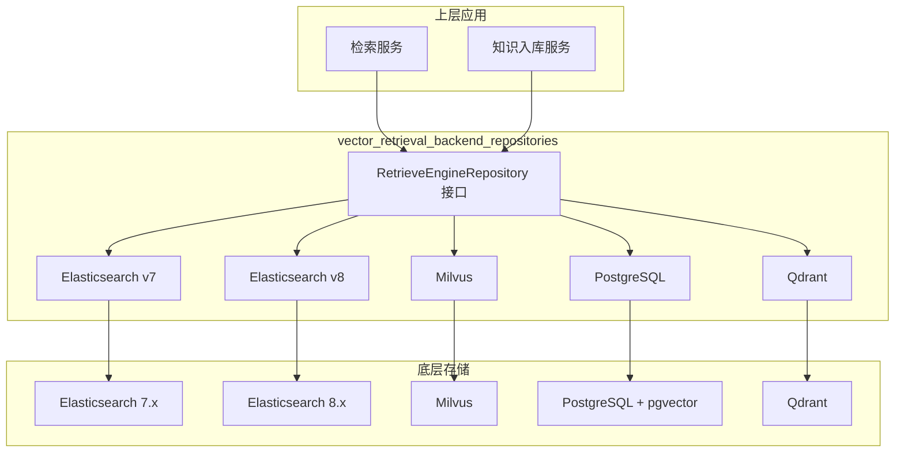
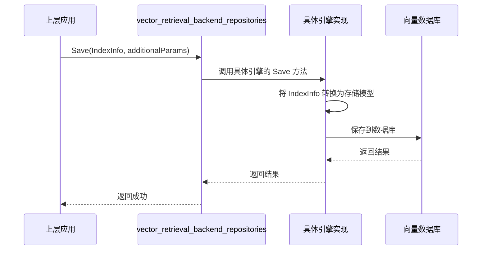
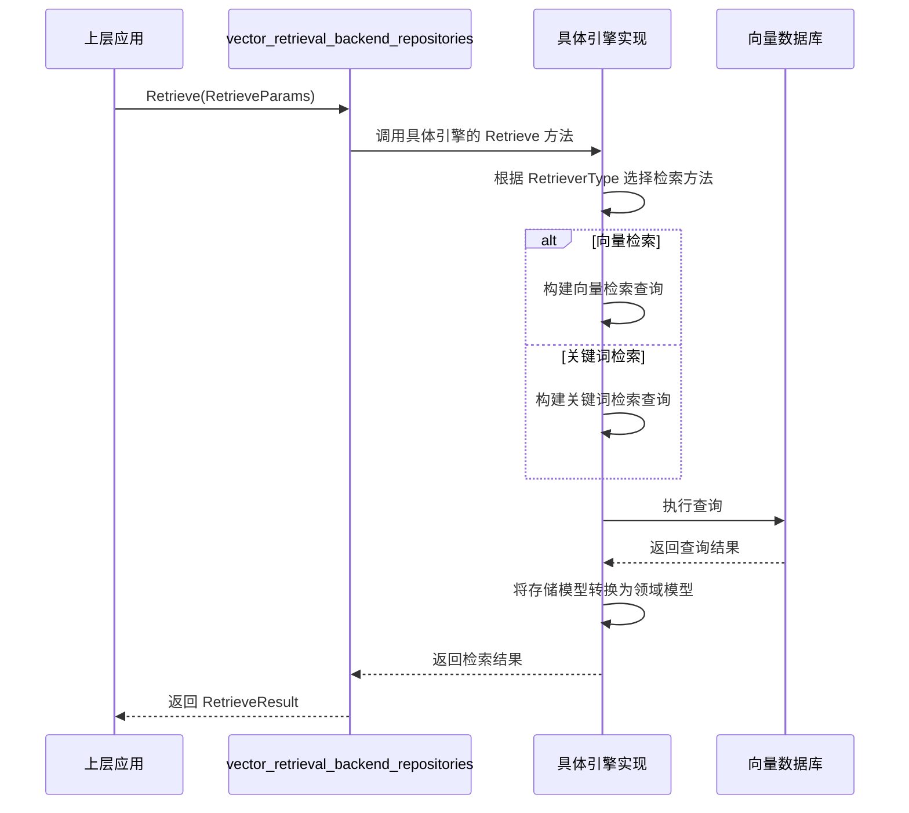

# vector_retrieval_backend_repositories 模块技术深度解析

## 1. 模块概述

`vector_retrieval_backend_repositories` 是系统的向量检索后端抽象层，它为上层应用提供了统一的向量检索能力，同时支持多种主流向量数据库（Elasticsearch、Milvus、PostgreSQL、Qdrant）作为底层存储引擎。

### 为什么需要这个模块？

想象一下，你的应用需要支持向量检索功能，但不同的客户环境可能已经部署了不同的向量数据库。有的用户用 Elasticsearch，有的用 Milvus，还有的希望用 PostgreSQL 配合 pgvector 扩展。如果没有这个模块，你需要为每种数据库写一套不同的代码，这会导致代码重复、维护成本高，而且上层应用需要关心底层数据库的细节。

这个模块就像是一个"向量检索的通用适配器，它定义了一套统一的接口，让上层应用可以用同样的方式调用不同的向量检索能力，而底层可以灵活地切换或混合使用不同的向量数据库。

## 2. 核心架构

### 架构说明：

1. **统一接口层**：`RetrieveEngineRepository` 接口定义了所有向量检索引擎必须实现的方法，包括保存、删除、检索、批量操作等。

2. **多引擎实现层**：针对不同的向量数据库提供了具体的实现，包括：
   - Elasticsearch v7 和 v8 两个版本的支持
   - Milvus 向量数据库
   - PostgreSQL 配合 pgvector 扩展
   - Qdrant 向量数据库

3. **数据模型转换层**：每个实现都包含了各自的数据模型，用于在领域模型和数据库特定模型之间进行转换。

## 3. 核心设计思想

### 3.1 统一的领域模型

这个模块的核心设计思想是**领域模型与存储模型分离**。系统定义了统一的领域模型（如 `IndexInfo`、`IndexWithScore`），而每个存储引擎都有自己的存储模型（如 `VectorEmbedding`、`MilvusVectorEmbedding`、`pgVector`）。通过转换器在两者之间进行转换。

这种设计的好处是：
- 上层应用只需要处理领域模型，不需要关心底层存储细节
- 可以灵活地添加新的存储引擎，而不需要修改上层应用代码
- 每个存储引擎可以根据自己的特性优化存储模型

### 3.2 策略模式的应用

模块采用了策略模式，通过 `RetrieveEngineType` 来标识不同的检索引擎类型，通过 `RetrieverType` 来标识不同的检索类型（向量检索、关键词检索）。这种设计让系统可以在运行时动态选择合适的检索引擎和检索方式。

### 3.3 批量操作优化

所有的存储引擎实现都提供了批量操作接口，这是为了优化性能。想象一下，如果每次只保存一个向量，那会有大量的网络往返开销。通过批量操作，可以大大减少这种开销，提高系统的吞吐量。

## 4. 关键组件详解

### 4.1 统一接口定义

模块的核心是 `RetrieveEngineRepository` 接口，它定义了以下关键方法：

- `Save`：保存单个索引
- `BatchSave`：批量保存索引
- `DeleteByChunkIDList`：通过 chunk ID 列表删除索引
- `DeleteBySourceIDList`：通过 source ID 列表删除索引
- `DeleteByKnowledgeIDList`：通过 knowledge ID 列表删除索引
- `Retrieve`：执行检索操作
- `VectorRetrieve`：执行向量检索
- `KeywordsRetrieve`：执行关键词检索
- `CopyIndices`：复制索引数据
- `BatchUpdateChunkEnabledStatus`：批量更新 chunk 的启用状态
- `BatchUpdateChunkTagID`：批量更新 chunk 的标签 ID
- `EstimateStorageSize`：估算存储空间大小
- `EngineType`：返回检索引擎类型
- `Support`：返回支持的检索类型

### 4.2 Elasticsearch 实现

Elasticsearch 实现支持 v7 和 v8 两个版本，它们的核心功能类似，但使用了不同的客户端库。

#### 核心特性：
- 支持向量检索和关键词检索
- 使用 script_score 查询实现余弦相似度计算
- 支持批量操作
- 支持索引复制
- 支持 chunk 启用状态和标签 ID 的批量更新

#### 数据模型：
- `VectorEmbedding`：Elasticsearch 文档结构
- `VectorEmbeddingWithScore`：带相似度分数的向量嵌入

#### 关键设计决策：
- 使用 `cosineSimilarity` 脚本计算向量相似度
- 支持 `knowledge_base_id` 和 `knowledge_id` 使用 AND 逻辑组合过滤
- 历史数据没有 `is_enabled` 字段的会被包含在结果中

### 4.3 PostgreSQL 实现

PostgreSQL 实现使用 pgvector 扩展来支持向量检索，同时使用 ParadeDB 扩展来支持关键词检索。

#### 核心特性：
- 支持向量检索和关键词检索
- 使用 HNSW 索引优化向量检索性能
- 使用半精度浮点数（half-precision float）存储向量，节省存储空间
- 支持批量操作
- 支持索引复制
- 支持 chunk 启用状态和标签 ID 的批量更新

#### 数据模型：
- `pgVector`：PostgreSQL 数据库表模型
- `pgVectorWithScore`：带相似度分数的向量嵌入

#### 关键设计决策：
- 使用半精度浮点数存储向量，节省 50% 的存储空间
- 向量检索查询使用子查询优化，先利用 HNSW 索引获取候选结果，再过滤阈值
- 扩展 TopK 参数，获取更多候选结果再过滤，提高召回率

### 4.4 Milvus 实现

Milvus 实现提供了对 Milvus 向量数据库的支持。

#### 核心特性：
- 支持向量检索
- 通用的过滤条件转换（`universalFilterCondition` 到 Milvus 表达式的转换）
- 支持批量操作
- 支持按维度创建集合

#### 数据模型：
- `MilvusVectorEmbedding`：Milvus 文档结构
- `MilvusVectorEmbeddingWithScore`：带相似度分数的向量嵌入

#### 关键设计决策：
- 使用通用过滤条件设计，支持多种比较操作符（eq, ne, gt, gte, lt, lte, in, not in, like, not like, between, and, or）
- 过滤条件参数名转换，将 '.' 替换为 '_'，因为 Milvus 模板参数不支持 '.' 字符

### 4.5 Qdrant 实现

Qdrant 实现提供了对 Qdrant 向量数据库的支持。

#### 核心特性：
- 支持向量检索
- 支持批量操作
- 支持按维度创建集合

#### 数据模型：
- `QdrantVectorEmbedding`：Qdrant 文档结构
- `QdrantVectorEmbeddingWithScore`：带相似度分数的向量嵌入

## 5. 数据流动

### 5.1 向量存储流程

### 5.2 向量检索流程

## 6. 设计权衡

### 6.1 统一接口 vs 引擎特有功能

**选择**：统一接口为主，引擎特有功能通过额外参数或扩展方法实现

**原因**：
- 统一接口让上层应用代码更简洁，更容易维护
- 引擎特有功能可以通过 `additionalParams` 参数传递
- 对于某些引擎特有的高级功能，可以通过扩展方法实现，不会影响统一接口

### 6.2 批量操作 vs 单条操作

**选择**：同时提供批量操作和单条操作接口

**原因**：
- 批量操作可以显著提高性能，减少网络往返开销
- 单条操作接口使用更简单，适合小规模数据
- 批量操作是性能优化的关键

### 6.3 领域模型 vs 存储模型分离

**选择**：领域模型与存储模型分离，通过转换器转换

**原因**：
- 领域模型稳定，不受存储模型变化影响
- 每个存储引擎可以根据自己的特性优化存储模型
- 更容易添加新的存储引擎

### 6.4 PostgreSQL 半精度浮点数 vs 全精度浮点数

**选择**：PostgreSQL 实现使用半精度浮点数存储向量

**原因**：
- 半精度浮点数可以节省 50% 的存储空间
- 对于大多数向量检索场景，半精度浮点数的精度已经足够
- 全精度浮点数会增加存储空间和索引开销

## 7. 使用指南

### 7.1 如何选择向量数据库

| 向量数据库 | 适用场景 | 优势 | 劣势 |
|------------|----------|------|------|
| Elasticsearch | 已有 Elasticsearch 集群，需要同时支持向量检索和关键词检索 | 成熟稳定，生态丰富 | 向量检索性能相对较弱 |
| PostgreSQL + pgvector | 已有 PostgreSQL 数据库，小规模向量数据 | 集成方便，维护成本低 | 大规模向量数据性能较差 |
| Milvus | 大规模向量数据，高性能要求 | 专为向量检索优化，性能优秀 | 需要额外部署和维护 |
| Qdrant | 大规模向量数据，高性能要求 | 性能优秀，易于部署 | 生态相对较小 |

### 7.2 常见问题

**Q**: 如何添加新的向量数据库支持？

**A**: 实现 `RetrieveEngineRepository` 接口，提供对应的存储模型和转换器，然后在引擎注册表中注册新的引擎类型。

**Q**: 如何在不同的向量数据库之间迁移数据？

**A**: 可以使用 `CopyIndices` 方法，或者通过上层应用读取数据再保存到新的引擎中。

**Q**: 如何优化向量检索性能？

**A**: 
1. 使用批量操作减少网络往返
2. 合理设置 TopK 参数
3. 对于 PostgreSQL，确保 HNSW 索引已经创建
4. 对于 Elasticsearch，合理设置索引分片和副本

## 8. 子模块文档

- [Elasticsearch 向量检索仓库](data_access_repositories-vector_retrieval_backend_repositories-elasticsearch_vector_retrieval_repository.md)
- [Milvus 向量检索仓库](data_access_repositories-vector_retrieval_backend_repositories-milvus_vector_retrieval_repository.md)
- [PostgreSQL 向量检索仓库](data_access_repositories-vector_retrieval_backend_repositories-postgres_vector_retrieval_repository.md)
- [Qdrant 向量检索仓库](data_access_repositories-vector_retrieval_backend_repositories-qdrant_vector_retrieval_repository.md)
