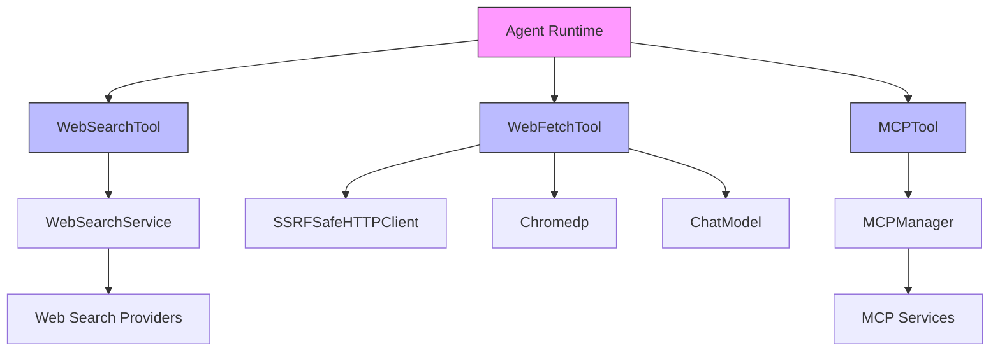

# Web 和 MCP 连接工具模块

## 概览

`web_and_mcp_connectivity_tools` 模块是代理运行时的"眼睛和手脚"，它让智能代理能够：
- **探索外部世界**：通过网络搜索获取实时信息
- **深入细节**：抓取并分析网页内容
- **连接外部服务**：通过 MCP（Model Context Protocol）与自定义工具和服务集成

想象一下，如果代理只能访问内部知识库，那么它就像一个被困在图书馆里的学者。这个模块给了代理一张"互联网通行证"和一套"外部服务连接器"，让它能够：
- 在需要最新新闻时搜索网络
- 深入研究搜索结果中的具体网页
- 调用用户配置的自定义外部工具

## 架构概览



### 核心组件职责

1. **WebSearchTool**：网络搜索的入口点
   - 强制执行"知识库优先"规则
   - 协调搜索服务和 RAG 压缩
   - 管理会话级临时知识库状态

2. **WebFetchTool**：网页内容抓取与分析
   - 双重抓取策略（Chromedp + HTTP）
   - SSRF 防护和 DNS 锁定
   - HTML 到 Markdown 转换
   - LLM 辅助内容摘要

3. **MCPTool**：外部服务工具桥接
   - 动态工具注册与命名空间隔离
   - 安全的工具执行环境
   - 内容类型处理（文本、图像、资源）

## 设计决策

### 1. "知识库优先"原则（WebSearchTool）

**决策**：在允许网络搜索之前，强制要求先完成知识库检索（grep_chunks 和 knowledge_search）。

**权衡分析**：
- ✅ **优势**：降低 API 成本、减少延迟、保持数据隐私
- ❌ **劣势**：增加了代理决策流程的复杂性
- **为什么选择这个方案**：大多数查询可以通过内部知识库回答，网络搜索应作为最后的手段

### 2. 双重抓取策略（WebFetchTool）

**决策**：优先使用 Chromedp（无头浏览器）抓取，失败时回退到简单 HTTP 请求。

**权衡分析**：
- ✅ **优势**：Chromedp 可以处理 JavaScript 渲染的内容，HTTP 请求更快更轻量
- ❌ **劣势**：增加了代码复杂度，Chromedp 资源消耗较大
- **为什么选择这个方案**：现代网页大量使用 JavaScript 渲染，需要平衡能力和效率

### 3. DNS 锁定与 SSRF 防护（WebFetchTool）

**决策**：在验证阶段解析并锁定 IP，然后在抓取阶段使用该 IP。

**权衡分析**：
- ✅ **优势**：防止 DNS 重绑定攻击，确保验证和抓取使用相同的 IP
- ❌ **劣势**：增加了 DNS 解析的复杂度，可能在某些动态 DNS 环境下失败
- **为什么选择这个方案**：安全性优先，SSRF 是严重的安全漏洞

### 4. MCP 工具命名空间隔离（MCPTool）

**决策**：使用 `mcp_{service_id}_{tool_name}` 格式作为工具名称，而不是简单的 `{service_name}_{tool_name}`。

**权衡分析**：
- ✅ **优势**：防止恶意服务器注册与合法工具同名的工具
- ❌ **劣势**：工具名称变得更长更复杂
- **为什么选择这个方案**：安全性优先，GHSA-67q9-58vj-32qx 漏洞证明了这种风险的真实性

### 5. 不可信内容标记（MCPTool）

**决策**：在所有 MCP 工具输出前添加前缀，明确标记为不可信数据。

**权衡分析**：
- ✅ **优势**：减少间接提示注入风险
- ❌ **劣势**：增加了输出长度，可能影响 LLM 理解
- **为什么选择这个方案**：安全性优先，外部服务输出不应被视为指令

## 子模块

本模块包含以下子模块：

- [MCP 工具集成](agent_runtime_and_tools-web_and_mcp_connectivity_tools-mcp_tool_integration.md)：处理与外部 MCP 服务的连接和工具执行
- [网络搜索工具](agent_runtime_and_tools-web_and_mcp_connectivity_tools-web_search_tooling.md)：实现网络搜索功能和 RAG 压缩
- [网页抓取请求与验证合约](agent_runtime_and_tools-web_and_mcp_connectivity_tools-web_fetch_request_and_validation_contracts.md)：定义网页抓取的输入参数和验证逻辑
- [网页抓取执行与结果模型](agent_runtime_and_tools-web_and_mcp_connectivity_tools-web_fetch_execution_and_result_models.md)：实现网页内容抓取、转换和分析

## 跨模块依赖

### 依赖其他模块

- [agent_core_orchestration_and_tooling_foundation](agent_runtime_and_tools-agent_core_orchestration_and_tooling_foundation.md)：提供工具定义和注册的基础架构
- [retrieval_and_web_search_services](application_services_and_orchestration-retrieval_and_web_search_services.md)：提供网络搜索服务实现
- [mcp_connectivity_and_protocol_models](platform_infrastructure_and_runtime-mcp_connectivity_and_protocol_models.md)：提供 MCP 连接管理
- [platform_utilities_lifecycle_observability_and_security](platform_infrastructure_and_runtime-platform_utilities_lifecycle_observability_and_security.md)：提供 SSRF 防护和 HTTP 安全配置

### 被其他模块依赖

- [agent_core_orchestration_and_tooling_foundation](agent_runtime_and_tools-agent_core_orchestration_and_tooling_foundation.md)：在工具注册表中注册这些工具
- [agent_reasoning_and_planning_state_tools](agent_runtime_and_tools-agent_reasoning_and_planning_state_tools.md)：可能与这些工具协调使用

## 使用指南

### 配置 WebSearchTool

```go
tool := NewWebSearchTool(
    webSearchService,      // 网络搜索服务实现
    knowledgeBaseService,  // 知识库服务
    knowledgeService,      // 知识服务
    webSearchStateService, // 网络搜索状态服务
    sessionID,             // 会话 ID
    maxResults,            // 最大结果数
)
```

### 配置 WebFetchTool

```go
tool := NewWebFetchTool(
    chatModel,  // 用于内容摘要的聊天模型
)
```

### 注册 MCP 工具

```go
err := RegisterMCPTools(
    ctx,
    registry,      // 工具注册表
    services,      // MCP 服务列表
    mcpManager,    // MCP 管理器
)
```

## 注意事项

### 常见陷阱

1. **绕过"知识库优先"规则**：不要试图在代码中绕过这个检查，这是设计上的强制要求。
2. **忽视 SSRF 防护**：在修改 WebFetchTool 时，确保保留 DNS 锁定和 IP 验证逻辑。
3. **MCP 工具命名**：不要修改 MCP 工具的命名格式，这是安全的关键。

### 调试技巧

1. **网络搜索失败**：检查租户是否配置了网络搜索提供商。
2. **网页抓取失败**：查看日志了解是 Chromedp 还是 HTTP 请求失败，尝试单独测试两者。
3. **MCP 工具不工作**：检查服务是否启用，连接是否正常建立。

### 扩展点

1. **自定义网络搜索提供商**：实现 `interfaces.WebSearchService` 接口。
2. **自定义网页抓取策略**：修改 `fetchHTMLContent` 方法添加新的抓取方法。
3. **MCP 内容类型处理**：扩展 `extractContentText` 函数支持新的内容类型。
