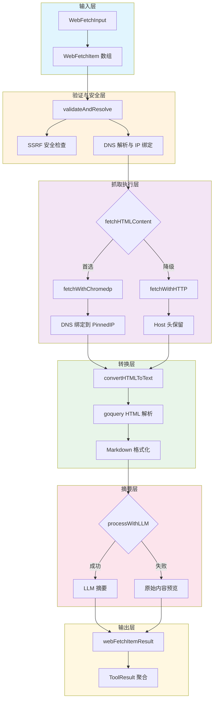

# Web Fetch Execution and Result Models 模块深度解析

## 模块概述：为什么需要这个模块？

想象一下，你的智能助手刚刚通过 `web_search` 工具找到了一组相关的网页链接，但搜索引擎返回的只是几百字的摘要片段。当用户问"这篇技术文档里关于 API 认证的具体步骤是什么？"时，摘要里可能只提到"文档包含认证说明"，却没有具体内容。

**这就是 `web_fetch_execution_and_result_models` 模块存在的意义**：它是一个**深度内容获取器**，负责从 `web_search` 发现的 URL 中抓取完整页面内容，并将其转换为 LLM 可理解的格式。

这个模块的核心挑战不在于"抓取网页"本身（那是 `net/http` 几行代码的事），而在于：

1. **安全性**：如何防止 Agent 被诱导访问内网资源（SSRF 攻击）？
2. **兼容性**：如何处理 JavaScript 渲染的页面、反爬虫机制、GitHub 特殊 URL 格式？
3. **可靠性**：当一种抓取方式失败时，如何优雅降级？
4. **可用性**：如何将杂乱的 HTML 转换为 LLM 友好的 Markdown 格式？

模块的设计洞察是：**网页抓取不是单纯的 I/O 操作，而是一个需要多层防护、多策略回退、多阶段转换的安全敏感流程**。

---

## 架构与数据流



### 数据流详解

整个模块的数据流可以理解为**五层管道**：

**第一层：输入解析**
- `WebFetchInput` 携带 `[]WebFetchItem` 数组进入 `Execute` 方法
- 每个 `WebFetchItem` 包含 `URL` 和 `Prompt` 两个字段
- 模块支持并发处理多个抓取任务（每个 item 一个 goroutine）

**第二层：安全验证**
- `validateAndResolve` 是安全网关，执行三项检查：
  1. URL 格式验证（必须是 http/https）
  2. SSRF 安全检查（调用 `utils.IsSSRFSafeURL`）
  3. DNS 解析并绑定到单一公网 IP（防止 DNS 重绑定攻击）
- 返回的 `validatedParams` 包含 `PinnedIP`，后续所有网络请求都使用这个 IP

**第三层：双路径抓取**
- `fetchHTMLContent` 实现**策略模式**：先尝试 `chromedp`（无头浏览器），失败后降级到 `http.Client`
- `chromedp` 路径：通过 `host-resolver-rules` 强制 Chrome 使用 `PinnedIP`，防止浏览器重新解析 DNS
- `http` 路径：直接连接 `PinnedIP`，但保留原始 `Host` 头以支持虚拟主机

**第四层：HTML→Markdown 转换**
- `convertHTMLToText` 使用 `goquery` 解析 HTML
- 移除 `<script>`, `<style>`, `<nav>`, `<footer>`, `<header>` 等噪声元素
- `processNode` 递归遍历 DOM 树，将 HTML 标签映射为 Markdown 语法

**第五层：LLM 摘要与结果聚合**
- `processWithLLM` 调用配置的 `chatModel` 对内容进行摘要
- 每个任务的 `webFetchItemResult` 包含 `output`（文本）、`data`（结构化数据）、`err`（错误）
- 所有结果聚合为 `ToolResult`，包含成功标志、聚合输出、结构化数据

---

## 核心组件深度解析

### WebFetchTool：抓取引擎的主体

**设计意图**

`WebFetchTool` 不是一个简单的工具函数，而是一个**有状态的抓取引擎**。它封装了：
- `*http.Client`：预配置的 SSRF 安全 HTTP 客户端
- `chat.Chat`：用于内容摘要的 LLM 模型

这种设计体现了**依赖注入**模式：在 `NewWebFetchTool` 构造函数中注入外部依赖，使工具可测试、可配置。

**关键方法分析**

#### `Execute(ctx, args)`: 并发编排器

```go
func (t *WebFetchTool) Execute(ctx context.Context, args json.RawMessage) (*types.ToolResult, error)
```

这个方法的核心职责是**并发编排**，而非实际抓取。它：

1. 解析 `WebFetchInput`，验证 `items` 非空
2. 为每个 `WebFetchItem` 启动一个 goroutine
3. 使用 `sync.WaitGroup` 等待所有任务完成
4. 聚合所有 `webFetchItemResult` 为统一的 `ToolResult`

**设计权衡**：为什么选择并发而非串行？

- **优点**：多个 URL 抓取互不阻塞，总耗时 ≈ max(单个任务耗时)，而非 sum(单个任务耗时)
- **风险**：可能同时发起大量请求，对目标服务器造成压力
- **缓解**：`webFetchTimeout = 60s` 限制单个任务超时，间接控制并发资源占用

**隐式契约**：调用者需确保传入的 URL 数量合理（建议 ≤ 10），否则可能触发速率限制。

#### `validateAndResolve(p webFetchParams)`: 安全网关

```go
func (t *WebFetchTool) validateAndResolve(p webFetchParams) (*validatedParams, error)
```

这是模块的**安全核心**。它执行的关键操作：

1. **基础验证**：URL 非空、Prompt 非空、协议为 http/https
2. **SSRF 检查**：调用 `utils.IsSSRFSafeURL(p.URL)`，拒绝内网 IP、回环地址等
3. **DNS 解析与绑定**：
   ```go
   ips, err := net.DefaultResolver.LookupIP(context.Background(), "ip", hostname)
   var pinnedIP net.IP
   for _, ip := range ips {
       if utils.IsPublicIP(ip) {
           pinnedIP = ip
           break
       }
   }
   ```

**为什么需要 DNS 绑定（DNS Pinning）？**

这是一个关键的安全设计。考虑以下攻击场景：

```
攻击者控制 evil.com
1. 验证时：evil.com → 203.0.113.1（公网 IP，通过检查）
2. 抓取时：evil.com → 192.168.1.1（内网 IP，DNS 重绑定攻击）
```

通过在验证时解析并绑定 `PinnedIP`，后续所有请求都直接连接该 IP，绕过 DNS 重新解析。`chromedp` 通过 `host-resolver-rules` 标志实现，HTTP 请求通过修改 `u.Host` 实现。

**设计权衡**：这种设计牺牲了一定的灵活性（无法利用 CDN 动态调度），但换取了确定性安全。

#### `fetchHTMLContent(ctx, vp)`: 双策略抓取

```go
func (t *WebFetchTool) fetchHTMLContent(ctx context.Context, vp *validatedParams) (string, string, error)
```

这个方法实现了**策略模式 + 降级模式**：

```go
html, err := t.fetchWithChromedp(ctx, vp)
if err == nil && strings.TrimSpace(html) != "" {
    return html, "chromedp", nil
}
// 降级到 HTTP
html, httpErr := t.fetchWithHTTP(ctx, vp)
```

**为什么需要两种抓取方式？**

| 场景 | Chromedp | HTTP |
|------|----------|------|
| JavaScript 渲染页面 | ✅ 执行 JS 后获取 DOM | ❌ 只能获取初始 HTML |
| 反爬虫检测 | ✅ 真实浏览器指纹 | ⚠️ 可能被识别为爬虫 |
| 资源消耗 | ❌ 高（启动浏览器进程） | ✅ 低 |
| 速度 | ❌ 慢（秒级） | ✅ 快（毫秒级） |
| 稳定性 | ⚠️ 依赖 Chrome 环境 | ✅ 纯 Go 实现 |

**设计洞察**：优先使用 `chromedp` 保证内容完整性，失败后降级到 `http` 保证可用性。这是一种**乐观策略**：假设大多数页面需要 JS 渲染，但如果不需要，降级路径也能工作。

#### `convertHTMLToText(html)`: HTML→Markdown 转换器

```go
func (t *WebFetchTool) convertHTMLToText(html string) string
```

这个方法的核心是一个**递归下降解析器**（通过 `goquery` 实现）。`processNode` 方法处理各种 HTML 标签：

```go
switch nodeName {
case "h1", "h2", "h3":
    // 转换为 # 标题
case "a":
    // 转换为 [text](href)
case "img":
    // 转换为 
case "ul", "ol":
    // 转换为 - 或 1. 列表
case "code":
    // 转换为 `code` 或 ```code```
case "table":
    // 转换为 Markdown 表格
// ...
}
```

**设计权衡**：为什么不用现成的 HTML→Markdown 库？

可能的原因：
1. **可控性**：自定义实现可以精确控制哪些标签保留、哪些移除
2. **噪声过滤**：主动移除 `<script>`, `<style>`, `<nav>`, `<footer>`, `<header>` 等对 LLM 无用的内容
3. **依赖最小化**：避免引入额外的第三方库

**潜在问题**：自定义解析器可能遗漏某些 HTML 结构（如 `<figure>`, `<figcaption>`, `<details>` 等），导致信息丢失。

#### `processWithLLM(ctx, params, content)`: 智能摘要

```go
func (t *WebFetchTool) processWithLLM(ctx context.Context, params webFetchParams, content string) (string, error)
```

这个方法调用配置的 `chatModel` 对抓取的内容进行摘要：

```go
systemMessage := "你是一名擅长阅读网页内容的智能助手，请根据提供的网页文本回答用户需求，严禁编造未在文本中出现的信息。"
userTemplate := `用户请求:
%s

网页内容:
%s`
```

**设计意图**：

1. **减少 token 消耗**：原始网页内容可能很长，摘要后只需传递关键信息
2. **提高回答质量**：LLM 直接阅读原始内容，比 Agent 二次处理更准确
3. **防止幻觉**：System Prompt 强调"严禁编造"，约束 LLM 行为

**设计权衡**：

- **优点**：摘要更精准，减少后续处理的 token 开销
- **风险**：如果 `chatModel` 不可用或失败，会降级到返回原始内容（见 `buildOutputText`）
- **成本**：每次抓取都额外调用一次 LLM，增加延迟和成本

**隐式契约**：调用者需确保传入的 `chatModel` 已正确初始化，否则 `processWithLLM` 会返回错误。

---

### WebFetchItem：任务单元

```go
type WebFetchItem struct {
    URL    string `json:"url" jsonschema:"待抓取的网页 URL，需来自 web_search 结果"`
    Prompt string `json:"prompt" jsonschema:"分析该网页内容时使用的提示词"`
}
```

**设计意图**

`WebFetchItem` 是一个**值对象**（Value Object），不可变、无行为，仅承载数据。它的设计体现了**显式契约**原则：

- `URL` 字段的 `jsonschema` 注释明确指出"需来自 web_search 结果"，这是一个**前置条件**
- `Prompt` 字段告诉 LLM 如何分析内容，实现**关注点分离**：抓取逻辑不关心分析逻辑

**使用模式**

```go
input := WebFetchInput{
    Items: []WebFetchItem{
        {URL: "https://example.com/doc", Prompt: "提取 API 认证步骤"},
        {URL: "https://example.com/guide", Prompt: "总结配置方法"},
    },
}
```

**隐式约束**：
- URL 必须是绝对路径（相对路径会在 `validateAndResolve` 中被拒绝）
- Prompt 不应为空（验证会检查）
- URL 数量建议 ≤ 10（避免并发资源耗尽）

---

### webFetchItemResult：内部结果封装

```go
type webFetchItemResult struct {
    output string
    data   map[string]interface{}
    err    error
}
```

**设计意图**

这是一个**内部私有类型**（小写开头），不暴露给外部调用者。它的作用是：

1. **并发安全**：每个 goroutine 写入自己的 `webFetchItemResult`，避免竞争条件
2. **结果隔离**：单个任务失败不影响其他任务
3. **灵活聚合**：`Execute` 方法可以根据需要组合 `output`、`data`、`err`

**数据流**

```
goroutine 1 → webFetchItemResult{output: "...", data: {...}, err: nil}
goroutine 2 → webFetchItemResult{output: "...", data: {...}, err: error}
...
Execute 方法聚合 → ToolResult{Success: false, Output: "聚合文本", Data: {"results": [...]}, Error: "第一个错误"}
```

**设计权衡**：为什么不用 `chan` 传递结果？

- **chan 方案**：需要管理 channel 生命周期，代码更复杂
- **当前方案**：预分配 `results` 数组，goroutine 直接写入对应索引，简单高效

---

## 依赖关系分析

### 模块调用什么（Callees）

| 依赖 | 用途 | 耦合度 |
|------|------|--------|
| `utils.SSRFSafeHTTPClient` | 创建防 SSRF 的 HTTP 客户端 | 高（安全核心） |
| `utils.IsSSRFSafeURL` | URL 安全检查 | 高（安全核心） |
| `utils.IsPublicIP` | 判断 IP 是否为公网地址 | 高（安全核心） |
| `chromedp` | 无头浏览器抓取 | 中（可降级） |
| `goquery` | HTML 解析 | 中（可替换） |
| `chat.Chat` | LLM 摘要 | 低（可选功能） |

**关键依赖：SSRF 安全工具**

模块严重依赖 `utils` 包中的 SSRF 防护函数。如果这些函数被修改或移除，模块的安全性将受到直接影响。这是一种**紧耦合**，但出于安全考虑是合理的——安全逻辑应该集中管理，而非分散在各个工具中。

**可降级依赖：chromedp 和 chatModel**

- `chromedp` 失败后会降级到 `http.Client`，属于**软依赖**
- `chatModel` 为 `nil` 时，`processWithLLM` 返回错误，但抓取仍成功，属于**可选依赖**

### 什么调用模块（Callers）

根据模块树，`web_fetch_execution_and_result_models` 属于 `agent_runtime_and_tools → web_and_mcp_connectivity_tools` 子模块。调用者包括：

1. **Agent 引擎**（`internal.agent.engine.AgentEngine`）：在工具调用阶段执行 `WebFetchTool.Execute`
2. **工具注册表**（`internal.agent.tools.registry.ToolRegistry`）：注册和解析 `web_fetch` 工具

**数据契约**

调用者期望的输入：
```json
{
  "items": [
    {"url": "https://...", "prompt": "..."}
  ]
}
```

调用者期望的输出（`types.ToolResult`）：
```go
type ToolResult struct {
    Success bool
    Output  string  // 人类可读的文本
    Data    map[string]interface{}  // 机器可读的结构化数据
    Error   string
}
```

**隐式契约**：
- `Output` 字段应包含格式化后的结果，供 Agent 显示给用户
- `Data` 字段的 `display_type` 应为 `"web_fetch_results"`，供前端识别渲染方式
- `Success` 为 `false` 时，`Error` 字段应包含错误信息

---

## 设计决策与权衡

### 1. 安全 vs 可用性：SSRF 防护的代价

**决策**：强制 DNS 绑定 + SSRF 检查

**权衡**：
- ✅ 防止 Agent 被诱导访问内网资源
- ❌ 无法访问某些动态 DNS 服务（如某些 CDN）
- ❌ 增加 DNS 解析开销（验证时解析一次，抓取时不再解析）

**为什么这样设计**：在安全敏感场景（Agent 可执行任意工具调用），**防御性设计**优先于便利性。一次 SSRF 漏洞可能导致整个系统被渗透。

### 2. 性能 vs 可靠性：双路径抓取

**决策**：优先 `chromedp`，降级到 `http`

**权衡**：
- ✅ 支持 JavaScript 渲染页面
- ✅ 失败时有降级路径
- ❌ 正常路径资源消耗高（启动 Chrome 进程）
- ❌ 延迟增加（chromedp 通常比 http 慢 10 倍以上）

**为什么这样设计**：Agent 场景下，**内容完整性**比速度更重要。抓取失败导致无法回答用户问题，比慢几秒更糟糕。

### 3. 灵活性 vs 控制力：自定义 HTML→Markdown

**决策**：使用 `goquery` 手动实现转换，而非第三方库

**权衡**：
- ✅ 精确控制哪些标签保留/移除
- ✅ 可针对 LLM 优化输出格式
- ❌ 代码量大，维护成本高
- ❌ 可能遗漏某些 HTML 结构

**为什么这样设计**：LLM 对输入格式敏感，通用库可能保留过多噪声（如导航栏、广告），影响回答质量。

### 4. 并发 vs 简单性：goroutine -per-task

**决策**：每个 `WebFetchItem` 一个 goroutine

**权衡**：
- ✅ 总耗时最小化
- ✅ 代码简洁（`sync.WaitGroup` 模式）
- ❌ 无并发数限制，可能触发目标服务器速率限制
- ❌ 错误处理复杂（需聚合多个错误）

**为什么这样设计**：Agent 场景下，用户期望快速响应。且通常 `items` 数量较少（≤ 5），并发风险可控。

**改进建议**：可引入信号量限制最大并发数，如：
```go
sem := make(chan struct{}, 3)  // 最多 3 个并发
for idx := range input.Items {
    sem <- struct{}{}
    go func() {
        defer func() { <-sem }()
        // ... 抓取逻辑
    }()
}
```

---

## 使用指南与示例

### 基本使用

```go
// 1. 创建工具实例（需注入 chatModel）
chatModel := lkeap.NewLKEAPChat(...)
tool := NewWebFetchTool(chatModel)

// 2. 构造输入
input := WebFetchInput{
    Items: []WebFetchItem{
        {
            URL:    "https://example.com/documentation",
            Prompt: "提取 API 认证的具体步骤",
        },
    },
}

// 3. 执行
args, _ := json.Marshal(input)
result, err := tool.Execute(ctx, args)

// 4. 处理结果
if result.Success {
    fmt.Println(result.Output)  // 人类可读
    fmt.Printf("结构化数据：%+v\n", result.Data)  // 机器可读
}
```

### 配置选项

| 配置项 | 默认值 | 说明 |
|--------|--------|------|
| `webFetchTimeout` | 60s | 单个抓取任务超时 |
| `webFetchMaxChars` | 100000 | HTTP 抓取时最大字符数 |
| `Temperature` (LLM) | 0.3 | 摘要生成的随机性 |
| `MaxTokens` (LLM) | 1024 | 摘要最大 token 数 |

### 与 web_search 的协作模式

```
1. Agent 调用 web_search → 返回搜索结果（含 URL 和摘要）
2. Agent 判断摘要不足 → 调用 web_fetch 抓取完整内容
3. web_fetch 返回详细内容和摘要 → Agent 综合回答用户问题
```

**最佳实践**：
- 仅抓取 `web_search` 返回的 URL（不要随意抓取未知来源）
- 为每个 URL 提供具体的 `Prompt`（如"提取代码示例"而非"总结内容"）
- 检查 `result.Data["count"]` 确认成功抓取的数量

---

## 边界情况与陷阱

### 1. GitHub URL 特殊处理

```go
func (t *WebFetchTool) normalizeGitHubURL(source string) string {
    if strings.Contains(source, "github.com") && strings.Contains(source, "/blob/") {
        source = strings.Replace(source, "github.com", "raw.githubusercontent.com", 1)
        source = strings.Replace(source, "/blob/", "/", 1)
    }
    return source
}
```

**陷阱**：如果直接请求 `github.com/.../blob/...`，返回的是 HTML 页面而非原始文件内容。模块自动转换为 `raw.githubusercontent.com/...` 格式。

**注意**：这个转换在 `validateAndResolve` 之前执行，所以 SSRF 检查针对的是转换后的 URL。

### 2. DNS 重绑定攻击防护

**攻击场景**：
```
1. 攻击者控制 evil.com
2. 验证时：evil.com → 203.0.113.1（公网 IP）
3. 抓取时：evil.com → 192.168.1.1（内网 IP）
```

**防护机制**：
- 验证时解析 DNS 并绑定 `PinnedIP`
- `chromedp` 使用 `host-resolver-rules` 强制 Chrome 使用 `PinnedIP`
- HTTP 请求直接连接 `PinnedIP`，绕过 DNS

**限制**：如果目标网站使用 CDN 且 IP 频繁变化，可能因 IP 不匹配导致 TLS 握手失败。

### 3. LLM 摘要失败降级

```go
summary, summaryErr := t.processWithLLM(ctx, params, textContent)
if summaryErr != nil {
    logger.Warnf(ctx, "[Tool][WebFetch] LLM 处理失败 url=%s err=%v", displayURL, summaryErr)
}
// 无论 LLM 是否成功，都会返回原始内容
output := t.buildOutputText(params, textContent, summary, summaryErr)
```

**行为**：LLM 失败不会导致整个任务失败，而是降级到返回原始内容。

**陷阱**：调用者需检查 `result.Data["summary"]` 是否存在，而非假设一定有摘要。

### 4. 并发错误聚合

```go
var firstErr error
for idx, res := range results {
    if res.err != nil {
        success = false
        if firstErr == nil {
            firstErr = res.err  // 只保留第一个错误
        }
    }
}
```

**陷阱**：只返回第一个错误，后续错误被丢弃。调用者应检查 `result.Output` 中的详细错误信息，而非仅依赖 `result.Error`。

### 5. HTML→Markdown 转换限制

**不支持的 HTML 结构**：
- `<figure>` / `<figcaption>`：会被当作普通文本处理
- `<details>` / `<summary>`：折叠内容会丢失
- `<svg>`：会被移除（不在处理列表中）
- Web Components：自定义标签会被递归处理，但可能丢失语义

**建议**：对于复杂页面，检查 `result.Data["content_length"]`，如果过长可能表示转换效果不佳。

---

## 运维与调试

### 日志关键点

模块在以下位置输出日志：

| 日志级别 | 位置 | 内容 |
|----------|------|------|
| `Info` | `Execute` 开始 | `[Tool][WebFetch] Execute started` |
| `Info` | `Execute` 结束 | `Completed with success=%v, items=%d` |
| `Info` | `executeFetch` 开始 | `Fetching URL: %s` |
| `Error` | 抓取失败 | `获取页面失败 url=%s err=%v` |
| `Warn` | LLM 失败 | `LLM 处理失败 url=%s err=%v` |
| `Debug` | Chromedp 开始/结束 | `Chromedp 抓取开始/成功 url=%s` |

### 性能调优建议

1. **调整超时**：如果目标网站响应慢，可增加 `webFetchTimeout`
2. **限制并发**：在 Agent 引擎层限制同时执行的 `web_fetch` 任务数
3. **缓存**：对相同 URL 的重复请求，可在上层实现缓存（模块本身无缓存）

### 常见问题排查

| 问题 | 可能原因 | 排查方法 |
|------|----------|----------|
| 所有请求失败 | SSRF 检查过严 | 检查 `utils.IsSSRFSafeURL` 逻辑 |
| Chromedp 失败但 HTTP 成功 | 缺少 Chrome 依赖 | 检查服务器是否安装 Chrome |
| 内容为空 | HTML 解析失败 | 检查 `convertHTMLToText` 的 `basicTextExtraction` 降级路径 |
| LLM 摘要缺失 | `chatModel` 未配置 | 检查 `NewWebFetchTool` 是否传入有效 `chatModel` |

---

## 相关模块参考

- [Web Search Tooling](agent_runtime_and_tools.md)：`web_fetch` 的前置工具，提供 URL 来源
- [Tool Execution Abstractions](agent_runtime_and_tools.md)：`BaseTool` 和 `ToolExecutor` 接口定义
- [SSRF Protection](platform_infrastructure_and_runtime.md)：`utils.SSRFSafeHTTPClient` 实现细节
- [Chat Model Interfaces](model_providers_and_ai_backends.md)：`chat.Chat` 接口定义

---

## 总结

`web_fetch_execution_and_result_models` 模块是一个**安全优先、可靠性驱动**的网页抓取引擎。它的核心设计原则是：

1. **安全不可妥协**：SSRF 防护和 DNS 绑定是硬性要求，不可绕过
2. **降级优于失败**：chromedp 失败→HTTP，LLM 失败→原始内容
3. **并发提升体验**：多 URL 并发抓取，减少用户等待时间
4. **格式优化 LLM**：HTML→Markdown 转换针对 LLM 理解优化

理解这个模块的关键是认识到：**它不是简单的 HTTP 客户端，而是一个在开放网络环境中安全执行 Agent 指令的可信执行环境**。
