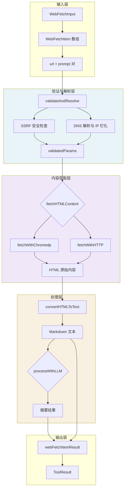

# Web Fetch Request and Validation Contracts 模块深度解析

## 模块概述：为什么需要这个模块？

想象一下，你的智能助手在回答用户问题时，需要从互联网获取实时信息。它先通过 `web_search` 找到了一批相关 URL，但这些搜索结果只返回了简短的摘要片段——就像搜索引擎结果页面上的那几行文字。当用户的问题需要深入理解网页完整内容时，这些片段远远不够。

**`web_fetch_request_and_validation_contracts` 模块的核心使命**就是安全、可靠地获取这些网页的完整内容。但这里有一个关键矛盾：

> **开放性 vs 安全性**：Agent 需要能够访问任意公开 URL，但绝不能成为攻击者探测内网资源的跳板。

这就是 SSRF（Server-Side Request Forgery，服务器端请求伪造）攻击的经典场景。如果攻击者能让 Agent 访问 `http://169.254.169.254/`（云服务商的元数据端点）或内网管理界面，后果不堪设想。

本模块的设计洞察在于：**URL 验证不能只做一次表面检查，而必须在整个请求链路中保持"身份绑定"**。传统的 SSRF 防护往往在验证时解析一次 DNS，但实际请求时又重新解析——攻击者可以利用 DNS 重绑定（DNS Rebinding）攻击绕过防护。本模块采用 **DNS Pinning（DNS 钉扎）** 策略，在验证阶段就解析出目标 IP，并在后续所有请求中强制使用该 IP，彻底堵死这一攻击向量。

---

## 架构与数据流



### 数据流详解

整个模块的数据处理遵循一个清晰的 **四阶段流水线**：

**第一阶段：输入解析**  
Agent 引擎调用 `Execute` 方法时，传入的 `json.RawMessage` 被反序列化为 `WebFetchInput`。这个结构体包含一个 `WebFetchItem` 数组，每个 item 代表一个独立的抓取任务（URL + 分析提示词）。模块支持批量处理，多个 URL 的抓取通过 goroutine 并发执行。

**第二阶段：安全验证与 DNS 钉扎**  
这是模块最核心的安全层。`validateAndResolve` 方法执行三个关键检查：
1. 基础格式验证（URL 必须以 `http://` 或 `https://` 开头，prompt 不能为空）
2. SSRF 安全检查（调用 `utils.IsSSRFSafeURL` 排除内网 IP、回环地址等）
3. **DNS 解析与 IP 钉扎**（解析域名得到所有 IP，选择第一个公网 IP 并固化到 `validatedParams`）

注意这里的精妙设计：`validatedParams` 不仅包含原始 URL，还包含解析出的 `Host`、`Port` 和 `PinnedIP`。这个结构体是后续所有请求的"安全凭证"。

**第三阶段：内容获取（双通道策略）**  
`fetchHTMLContent` 采用 **降级策略**：优先使用 `chromedp`（无头浏览器）抓取，因为它能执行 JavaScript、等待动态内容加载；如果失败则回退到直接 HTTP 请求。两个通道都使用 `validatedParams.PinnedIP` 进行连接，确保不会发生 DNS 重绑定。

**第四阶段：内容处理与摘要**  
获取到 HTML 后，`convertHTMLToText` 使用 `goquery` 将其转换为 Markdown 格式（移除 script/style 标签，转换标题/列表/表格等）。如果配置了 `chatModel`，还会调用 LLM 生成摘要；否则直接返回原始文本。

---

## 核心组件深度解析

### WebFetchInput：批量任务的入口契约

```go
type WebFetchInput struct {
    Items []WebFetchItem `json:"items" jsonschema:"批量抓取任务，每项包含 url 与 prompt"`
}

type WebFetchItem struct {
    URL    string `json:"url" jsonschema:"待抓取的网页 URL，需来自 web_search 结果"`
    Prompt string `json:"prompt" jsonschema:"分析该网页内容时使用的提示词"`
}
```

**设计意图**：这个结构体定义了 Agent 与工具之间的**请求契约**。注意几个关键设计点：

1. **批量而非单个**：`Items` 是数组而非单个 item，这允许 Agent 一次性提交多个 URL 的抓取任务。并发执行可以显著降低总延迟——想象一下需要对比 5 篇技术文章的场景。

2. **URL 来源约束**：jsonschema 注释明确指出 URL 应"来自 web_search 结果"。这是一个**隐式契约**：Agent 不应该随意抓取用户输入的任意 URL，而应该先通过 `web_search` 发现可信来源。虽然代码层面没有强制验证这一点，但这是预期的使用模式。

3. **Prompt 的必要性**：每个 item 必须携带 `Prompt`，这反映了模块的设计哲学——**抓取不是为了存储，而是为了分析**。Prompt 会被传递给 LLM 用于生成针对性摘要。

### webFetchParams：内部传输对象

```go
type webFetchParams struct {
    URL    string
    Prompt string
}
```

这是一个简单的内部 DTO（Data Transfer Object），用于在 `Execute` 方法的 goroutine 闭包中传递参数。它使用小写字母开头，表明这是**包级私有类型**，不对外暴露。

**为什么需要这个中间层？** 乍看之下它和 `WebFetchItem` 字段完全相同，似乎多余。但它承担了两个职责：

1. **解耦外部输入与内部处理**：`WebFetchInput` 是公开的结构体（首字母大写），可能被其他包引用；而 `webFetchParams` 是内部实现细节，可以自由修改而不影响外部契约。

2. **支持 URL 规范化**：在传递给 `validateAndResolve` 之前，URL 会经过 `normalizeGitHubURL` 处理（将 `github.com/.../blob/` 转换为 `raw.githubusercontent.com/...`）。这个转换后的 URL 存储在 `webFetchParams` 中，而原始 URL 保留用于错误报告。

### validatedParams：安全凭证的载体

```go
type validatedParams struct {
    URL      string
    Prompt   string
    Host     string
    Port     string
    PinnedIP net.IP
}
```

这是整个模块**最关键的数据结构**。它不仅仅包含验证后的参数，更重要的是携带了 SSRF 防护所需的"安全凭证"。

**字段语义解析**：

| 字段 | 用途 | 安全意义 |
|------|------|----------|
| `URL` | 规范化后的完整 URL | 用于显示和日志 |
| `Prompt` | 分析提示词 | 业务逻辑需要 |
| `Host` | 原始域名（如 `example.com`） | 用于 TLS SNI 和 Host 头 |
| `Port` | 端口号（80 或 443） | 构建连接地址 |
| `PinnedIP` | 验证时解析的公网 IP | **DNS 钉扎的核心** |

**DNS 钉扎的工作原理**：

传统的 SSRF 防护流程是：
```
验证时：解析 example.com → 检查 IP 是否安全 ✓
请求时：解析 example.com → 得到（可能被篡改的）IP → 连接 ❌
```

本模块的流程是：
```
验证时：解析 example.com → 检查 IP → 钉扎到 93.184.216.34 ✓
请求时：直接连接 93.184.216.34，Host 头设为 example.com ✓
```

关键在于 `fetchWithTimeout` 方法中的实现：
```go
hostPort := net.JoinHostPort(vp.PinnedIP.String(), vp.Port)
u.Host = hostPort  // 连接到 IP
req.Host = net.JoinHostPort(vp.Host, vp.Port)  // 但 Host 头保持域名
```

这样既保证了连接到安全的 IP，又保证了虚拟主机（Virtual Host）能正确路由请求。

---

## 依赖关系分析

### 上游调用者

本模块被 [`WebFetchTool`](web_fetch_execution_and_result_models.md) 的 `Execute` 方法直接调用。从依赖树来看，`WebFetchTool` 属于 `web_and_mcp_connectivity_tools` 子模块，它由 Agent 引擎在工具调用阶段触发。

典型的调用链路：
```
AgentEngine → ToolRegistry → WebFetchTool.Execute → validateAndResolve → fetchHTMLContent
```

### 下游依赖

本模块依赖以下外部组件：

| 依赖 | 用途 | 耦合程度 |
|------|------|----------|
| `utils.IsSSRFSafeURL` | SSRF 安全检查 | **强耦合**：安全策略的核心 |
| `utils.IsPublicIP` | 判断 IP 是否为公网地址 | **强耦合**：DNS 钉扎的前提 |
| `utils.NewSSRFSafeHTTPClient` | 创建防 SSRF 的 HTTP 客户端 | **强耦合**：HTTP 通道的安全保障 |
| `utils.DefaultSSRFSafeHTTPClientConfig` | 配置 SSRF 安全客户端 | 中耦合：可替换配置源 |
| `github.com/PuerkitoBio/goquery` | HTML 解析与 Markdown 转换 | 中耦合：可替换解析器 |
| `github.com/chromedp/chromedp` | 无头浏览器抓取 | 弱耦合：有 HTTP 降级方案 |
| `chat.Chat` | LLM 摘要生成 | 弱耦合：可选功能，失败不影响核心流程 |

**关键耦合点分析**：

最紧密的耦合是与 `utils` 包中的 SSRF 安全函数。这些函数定义了什么是"安全的 URL"和"公网 IP"，本模块完全信任这些判断。如果 `IsSSRFSafeURL` 的逻辑有漏洞（例如未检查某些内网段），本模块的防护也会失效。这是一种**信任边界传递**——本模块的安全强度取决于最弱的依赖环节。

### 数据契约

**输入契约**（来自 Agent 引擎）：
```json
{
  "items": [
    {
      "url": "https://example.com/article",
      "prompt": "总结这篇文章的核心观点"
    }
  ]
}
```

**输出契约**（返回给 Agent 引擎）：
```go
type ToolResult struct {
    Success bool
    Output  string  // 人类可读的文本报告
    Data    map[string]interface{}  // 结构化数据（含 results 数组）
    Error   string
}
```

`Data` 字段中的 `results` 数组包含每个 URL 的抓取结果，包括 `url`、`prompt`、`raw_content`、`summary`（如果有）、`content_length` 和 `method`（chromedp 或 http）。

---

## 设计决策与权衡

### 1. Chromedp 优先 vs HTTP 优先

**选择**：优先使用 chromedp，失败后降级到 HTTP。

**权衡分析**：

| 方案 | 优点 | 缺点 |
|------|------|------|
| Chromedp 优先 | 能处理 JavaScript 渲染的页面，内容更完整 | 资源消耗大，启动慢，依赖 Chrome 二进制 |
| HTTP 优先 | 轻量快速，无外部依赖 | 无法获取动态内容，可能遗漏关键信息 |

**为什么选择当前方案**：Agent 场景下，**内容完整性优先于性能**。用户期望 Agent 能理解现代 Web 应用（很多使用 React/Vue 等前端框架），如果只抓取静态 HTML，可能会得到空白页面或骨架内容。降级策略保证了在 chromedp 不可用（如资源限制、环境不支持）时仍能工作。

**潜在问题**：在高并发场景下，同时启动多个 chromedp 实例可能导致内存爆炸。代码中没有并发数限制，这是一个**运营风险点**。

### 2. DNS 钉扎 vs 连接时验证

**选择**：在验证阶段解析并钉扎 IP，后续请求直接使用 IP。

**替代方案**：每次 HTTP 请求前都重新解析 DNS 并验证 IP。

**为什么选择钉扎**：
- **性能**：避免重复 DNS 查询
- **一致性**：确保验证时的 IP 就是连接时的 IP
- **安全性**：彻底消除 DNS 重绑定窗口

**代价**：
- **DNS TTL 失效**：如果网站在钉扎后切换了 IP（如 CDN 故障转移），请求会失败
- **IPv6 缺失**：代码只选择第一个公网 IP，可能忽略 IPv6 地址

这是一个**安全优先于可用性**的选择。在 Agent 场景中，抓取失败可以重试或换 URL，但 SSRF 漏洞是零容忍的。

### 3. 批量并发 vs 顺序执行

**选择**：使用 goroutine 并发处理所有 items。

**权衡**：
- 并发提升吞吐量，但可能触发目标网站的速率限制
- 没有重试机制，单个 URL 失败不影响其他 URL，但也不会自动重试

**改进空间**：可以引入信号量限制并发数，或添加指数退避重试逻辑。

### 4. LLM 摘要可选 vs 必需

**选择**：LLM 摘要失败不影响整体流程，降级为返回原始内容。

**代码体现**：
```go
summary, summaryErr = t.processWithLLM(ctx, params, textContent)
if summaryErr != nil {
    logger.Warnf(ctx, "[Tool][WebFetch] LLM 处理失败...")
    // 不返回错误，继续执行
}
```

**设计哲学**：**核心功能（抓取）与增强功能（摘要）分离**。即使 LLM 不可用或超时，用户仍然能获得原始网页内容。这符合"优雅降级"原则。

---

## 使用指南与示例

### 基本使用模式

```go
// 1. 创建工具实例（需要传入 chat model 用于摘要）
chatModel := /* 初始化的 chat model */
tool := NewWebFetchTool(chatModel)

// 2. 构造输入
input := WebFetchInput{
    Items: []WebFetchItem{
        {
            URL:    "https://example.com/article",
            Prompt: "提取文章的主要论点和支撑证据",
        },
        {
            URL:    "https://another.com/report",
            Prompt: "总结报告中的关键数据",
        },
    },
}

// 3. 序列化并执行
args, _ := json.Marshal(input)
result, err := tool.Execute(ctx, args)

// 4. 处理结果
if result.Success {
    fmt.Println(result.Output)  // 人类可读的报告
    // 访问结构化数据
    results := result.Data["results"].([]map[string]interface{})
    for _, r := range results {
        fmt.Printf("URL: %s, Summary: %s\n", r["url"], r["summary"])
    }
}
```

### GitHub URL 自动规范化

模块会自动将 GitHub blob URL 转换为 raw URL：

```
输入：https://github.com/user/repo/blob/main/file.md
实际抓取：https://raw.githubusercontent.com/user/repo/main/file.md
```

这是通过 `normalizeGitHubURL` 方法实现的。注意这个转换是**静默的**——日志和错误报告中显示的是原始 URL，但实际抓取的是 raw URL。

### 配置超时与字符限制

```go
const (
    webFetchTimeout  = 60 * time.Second  // 单个 URL 的抓取超时
    webFetchMaxChars = 100000            // 最大读取字符数（HTTP 通道）
)
```

这些是包级常量，目前不支持运行时配置。如果需要调整，必须修改源码并重新编译。

---

## 边界情况与陷阱

### 1. SSRF 检查的盲区

虽然模块有完善的 SSRF 防护，但依赖 `utils.IsSSRFSafeURL` 的实现。需要确认该函数检查了以下所有情况：
- 私有 IP 段（10.0.0.0/8, 172.16.0.0/12, 192.168.0.0/16）
- 回环地址（127.0.0.0/8）
- 链路本地地址（169.254.0.0/16）
- 云元数据端点（169.254.169.254 等）
- IPv6 等效地址（::1, fc00::/7 等）

**建议**：审查 `utils.IsSSRFSafeURL` 的实现，确保没有遗漏。

### 2. DNS 解析失败的处理

如果 DNS 查询失败（网络问题或域名不存在），`validateAndResolve` 会直接返回错误：
```go
if err != nil || len(ips) == 0 {
    return nil, fmt.Errorf("DNS lookup failed for %s: %w", hostname, err)
}
```

这意味着**临时性 DNS 故障会导致整个任务失败**，没有重试机制。对于生产环境，建议添加 DNS 重试逻辑。

### 3. 没有公网 IP 的情况

代码要求至少有一个公网 IP：
```go
if pinnedIP == nil {
    return nil, fmt.Errorf("no public IP available for host %s", hostname)
}
```

这会导致某些合法场景失败：
- 纯内网服务（如公司内网文档站）
- 仅 IPv6 的网站

如果业务需要支持这些场景，需要调整安全策略。

### 4. Chromedp 资源泄漏风险

`fetchWithChromedp` 使用 `defer cancel()` 清理上下文，但如果 chromedp 进程异常退出，可能残留 Chrome 实例。在高负载服务器上，这可能导致：
- 内存泄漏
- 端口耗尽
- 进程数爆炸

**建议**：添加 chromedp 实例数监控，或考虑使用 chromedp 的远程调试模式（复用已有 Chrome 实例）。

### 5. Markdown 转换的质量问题

`convertHTMLToText` 使用规则引擎转换 HTML 到 Markdown，但：
- 复杂布局（如多栏、浮动元素）会丢失结构信息
- 某些网站使用非标准标签，可能无法正确解析
- 表格转换可能错位（特别是合并单元格）

对于关键任务，建议人工抽查转换质量。

### 6. 字符限制的硬编码

HTTP 通道使用 `io.LimitReader` 限制读取 `webFetchMaxChars * 2` 字节（约 200KB）。如果网页超过这个限制：
- 内容被截断
- 没有警告提示用户
- LLM 摘要可能基于不完整内容

**改进建议**：在结果中添加 `truncated` 标志，或在输出中提示内容被截断。

---

## 相关模块参考

- [Web Fetch Execution and Result Models](web_fetch_execution_and_result_models.md) — `WebFetchTool` 的执行逻辑和结果结构
- [Web Search Tooling](web_search_tooling.md) — `web_search` 工具，通常作为 `web_fetch` 的前置步骤
- [MCP Tool Integration](mcp_tool_integration.md) — 外部工具集成机制
- [SSRF Protection and HTTP Security Config](ssrf_protection_and_http_security_config.md) — `utils.SSRFSafeHTTPClient` 的实现细节
- [Agent Runtime and Tool Calling Contracts](agent_runtime_and_tool_call_contracts.md) — Agent 工具调用的通用契约

---

## 总结

`web_fetch_request_and_validation_contracts` 模块体现了**安全优先、优雅降级、批量高效**的设计原则。它的核心价值不在于抓取网页（这是简单任务），而在于**以可证明安全的方式**完成抓取。

DNS 钉扎策略是模块最精妙的设计——它用少量复杂性（维护 `validatedParams` 结构、在 HTTP 请求中手动设置 Host 头）换取了强大的安全保障。对于构建面向公网的 Agent 系统，这种深度防御思维至关重要。

同时，模块也留下了改进空间：并发控制、重试机制、监控指标等。在将其用于生产环境前，建议根据实际负载情况进行压力测试和安全审计。
