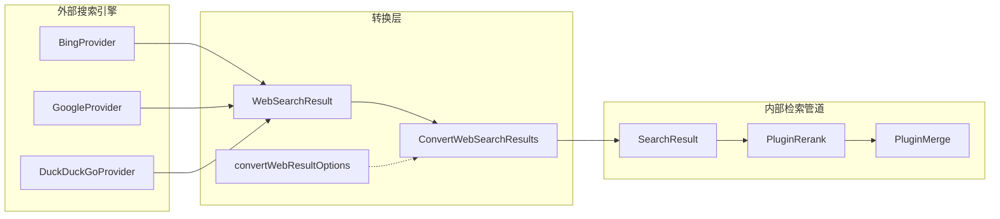

# web_result_conversion_options 模块深度解析

## 概述：为什么需要这个模块

想象一下，你的系统需要从多个外部搜索引擎（Bing、Google、DuckDuckGo）获取结果，但系统内部只认一种统一的"搜索结果"格式。每个搜索引擎返回的数据结构都不一样——有的叫 `title`，有的叫 `heading`；有的把发布时间放在顶层，有的嵌套在元数据里。如果让每个调用点都自己处理这些差异，代码会迅速变成一堆重复的 `if-else` 转换逻辑。

`web_result_conversion_options` 模块就是为了解决这个**适配器问题**而存在的。它提供了一个标准化的转换管道，将外部搜索引擎返回的 `WebSearchResult` 对象批量转换为系统内部统一的 `SearchResult` 格式。这个模块的核心设计洞察是：**转换逻辑应该集中管理，但转换行为应该可配置**——这就是为什么它采用了函数式选项（Functional Options）模式，而不是硬编码所有行为。

从架构角色来看，这个模块是一个**格式转换器（Transformer）**，位于外部数据源和内部检索管道之间。它不决定"搜索什么"，也不决定"如何使用结果"，它只负责确保数据以正确的形状流入下游系统。

## 架构与数据流



**数据流 walkthrough**：

1. **输入源**：`WebSearchService` 调用某个 `WebSearchProvider`（如 `BingProvider`、`GoogleProvider`）执行搜索，获得 `[]*types.WebSearchResult`
2. **转换入口**：调用 `ConvertWebSearchResults()`，可选择传入 `WithSeqFunc()` 等配置选项
3. **逐条转换**：对每条 `WebSearchResult`，模块提取 `Title`、`Snippet`、`Content` 等字段，组装成内部 `SearchResult` 结构
4. **元数据注入**：将原始 URL、来源、发布时间等信息打包进 `Metadata` 映射，确保下游可以追溯原始数据
5. **输出交付**：返回 `[]*types.SearchResult`，送入 [`PluginRerank`](application_services_and_orchestration.md#retrieval_result_refinement_and_merge) 或 [`PluginMerge`](application_services_and_orchestration.md#retrieval_result_refinement_and_merge) 进行后续处理

这个模块的调用链通常是：
```
WebSearchHandler → WebSearchService → Provider (Bing/Google) → ConvertWebSearchResults → PluginSearch/PluginSearchParallel
```

## 组件深度解析

### `ConvertWebResultOption`（函数式选项类型）

```go
type ConvertWebResultOption func(*convertWebResultOptions)
```

**设计意图**：这是典型的**函数式选项模式**（Functional Options Pattern）。为什么不直接用一个大结构体传参？因为这样可以让配置项保持"可选且可扩展"——调用方只关心需要覆盖的默认行为，不需要为每个字段都传值。

**工作原理**：每个选项函数接收一个指向内部配置结构体的指针，修改其中的字段。这种模式的优势在于：
- **向后兼容**：新增配置项时，不需要修改现有调用代码
- **链式调用**：可以传入多个选项，`ConvertWebSearchResults(results, WithSeqFunc(f1), WithSeqFunc(f2))`
- **封装性**：`convertWebResultOptions` 是小写的，外部无法直接构造，必须通过导出的选项函数

**当前唯一的选项函数**：

```go
func WithSeqFunc(f func(idx int) int) ConvertWebResultOption
```

这个选项允许调用方自定义结果的序列号（`Seq`）分配逻辑。默认情况下，所有结果的 `Seq` 都是 `1`（见下文设计权衡分析），但某些场景可能需要根据原始排名分配递增序号。

### `ConvertWebSearchResults()`（核心转换函数）

**函数签名**：
```go
func ConvertWebSearchResults(
    webResults []*types.WebSearchResult,
    opts ...ConvertWebResultOption,
) []*types.SearchResult
```

**内部 mechanics**：

1. **空值防护**：遍历时会跳过 `nil` 的 `webResult`，避免 panic
2. **ID 生成策略**：优先使用 `webResult.URL` 作为 `chunkID`；如果 URL 为空，则生成 `web_search_{index}` 作为降级 ID
3. **内容拼接逻辑**：使用 `appendContent` 闭包将 `Title`、`Snippet`、`Content` 按顺序拼接，中间用 `\n\n` 分隔。这个设计确保内容字段尽可能完整，同时避免空字符串污染
4. **字符计数**：`EndAt` 字段使用 `utf8.RuneCountInString(content)` 而非 `len(content)`，这是为了正确处理多字节字符（如中文）
5. **元数据注入**：将原始字段（URL、Source、Title、Snippet）以及可选的 `PublishedAt` 打包进 `Metadata` 映射，确保下游可以访问原始数据而不需要反向解析

**返回值**：`[]*types.SearchResult` 切片，长度最多等于输入长度（跳过 nil 后可能更短）

**副作用**：无。这是一个纯函数，不修改输入，不访问全局状态，不执行 I/O。

### `convertWebResultOptions`（内部配置结构体）

```go
type convertWebResultOptions struct {
    seqFunc func(idx int) int
}
```

**为什么是小写**：这是 Go 的封装约定。外部代码不能直接构造或修改这个结构体，必须通过 `WithSeqFunc()` 等导出函数。这防止了调用方传入非法的 `seqFunc`（如 nil 函数），也保留了未来新增字段时不破坏 API 兼容性的能力。

**默认行为**：在 `ConvertWebSearchResults()` 内部，`seqFunc` 的默认值是 `func(int) int { return 1 }`。这意味着所有转换后的结果 `Seq` 字段都是 `1`。这个设计选择看似奇怪，但有其原因（见下文设计权衡）。

## 依赖关系分析

### 这个模块调用什么（Callees）

| 依赖项 | 来源模块 | 调用原因 |
|--------|----------|----------|
| `types.WebSearchResult` | [core_domain_types_and_interfaces](core_domain_types_and_interfaces.md) | 输入数据类型，来自外部搜索引擎的原始响应 |
| `types.SearchResult` | [core_domain_types_and_interfaces](core_domain_types_and_interfaces.md) | 输出数据类型，内部检索管道的统一格式 |
| `types.MatchTypeWebSearch` | [core_domain_types_and_interfaces](core_domain_types_and_interfaces.md) | 标记结果来源类型为"网页搜索"，用于下游过滤和统计 |
| `types.ChunkTypeWebSearch` | [core_domain_types_and_interfaces](core_domain_types_and_interfaces.md) | 设置 `ChunkType` 字段，区分网页搜索 chunk 和其他类型（如知识库 chunk） |
| `utf8.RuneCountInString` | Go 标准库 | 正确计算多字节字符串的字符数，避免中文等语言的位置计算错误 |

### 什么调用这个模块（Callers）

根据模块树，这个模块位于 `application_services_and_orchestration > retrieval_and_web_search_services > search_result_conversion_and_normalization_utilities`。典型的调用路径是：

```
internal.handler.web_search.WebSearchHandler
    → internal.application.service.web_search.WebSearchService
        → internal.application.service.web_search.bing.BingProvider (或其他 Provider)
            → searchutil.ConvertWebSearchResults  ← 本模块
                → internal.application.service.chat_pipline.search.PluginSearch
```

**数据契约**：
- **输入契约**：`[]*types.WebSearchResult`，其中每个元素可能为 `nil`（模块会跳过）
- **输出契约**：`[]*types.SearchResult`，保证：
  - `ID` 非空（URL 或生成的降级 ID）
  - `Content` 至少包含 `Title`
  - `MatchType` 固定为 `types.MatchTypeWebSearch`
  - `Metadata` 包含 `url`、`source`、`title`、`snippet` 四个键
  - `Score` 固定为 `0.6`（硬编码，见下文设计权衡）

## 设计决策与权衡

### 1. 为什么 `Score` 硬编码为 `0.6`？

**现状**：所有网页搜索结果的 `Score` 字段都是 `0.6`，不区分原始搜索引擎返回的相关性分数。

**权衡分析**：
- **选择**：放弃原始分数，使用统一分数
- **原因**：不同搜索引擎的分数体系不可比。Bing 的 `0.8` 和 Google 的 `0.8` 含义可能完全不同。如果直接使用原始分数，后续的 [`PluginRerank`](application_services_and_orchestration.md#retrieval_result_refinement_and_merge) 会基于不公平的基准进行重排序。
- **代价**：丢失了搜索引擎内部的相对排序信息。但这个信息可以通过 `Seq` 字段或原始列表顺序部分保留。
- **替代方案**：可以对分数进行归一化（如 min-max scaling），但这需要知道所有结果的分数分布，无法在流式处理中实现。

**如果未来需要改进**：可以新增一个 `WithScoreFunc()` 选项，允许调用方传入自定义分数计算逻辑。

### 2. 为什么默认 `Seq` 全是 `1`？

**现状**：`seqFunc` 的默认实现是 `func(int) int { return 1 }`，所有结果的 `Seq` 都是 `1`。

**设计意图**：`Seq` 字段在这个上下文中不是"排名"，而是"批次标识"。网页搜索结果通常作为一整批注入检索管道，与知识库检索结果并列。将 `Seq` 设为 `1` 表示"这是第一批结果"，而不是"这是第 1 名"。

**何时需要自定义**：如果调用方希望保留原始搜索引擎的排名顺序，可以传入：
```go
ConvertWebSearchResults(results, WithSeqFunc(func(idx int) int { return idx + 1 }))
```

### 3. 为什么使用函数式选项而不是配置结构体？

**选择**：`func(*options)` 模式 vs `type Config struct { ... }`

**原因**：
- **可扩展性**：未来新增配置项（如 `WithMetadataFilter()`、`WithContentTruncate()`）时，不需要修改现有调用代码
- **可读性**：`ConvertWebSearchResults(results, WithSeqFunc(f))` 比 `ConvertWebSearchResults(results, Config{SeqFunc: f})` 更清晰
- **封装性**：可以控制哪些配置项对外暴露，内部可以有小写字段不对外公开

**代价**：对于需要同时设置多个选项的场景，链式调用略显冗长。但当前只有一个选项，这个代价可以忽略。

### 4. 为什么 `Metadata` 是 `map[string]string` 而不是结构化类型？

**现状**：元数据字段（URL、Source、PublishedAt 等）被扁平化为字符串映射。

**权衡**：
- **优势**：灵活，下游可以按需读取，不需要预定义所有可能的字段
- **劣势**：类型安全丢失，`published_at` 需要手动解析为 `time.Time`
- **原因**：不同类型的搜索结果（网页、知识库、FAQ）有不同的元数据需求。使用映射可以避免为每种类型定义独立的结构体。

**风险**：键名是魔法字符串（如 `"published_at"`），拼写错误会在运行时才暴露。建议在调用方使用常量定义这些键名。

## 使用指南与示例

### 基础用法

```go
// 从搜索引擎获取原始结果
webResults := []*types.WebSearchResult{
    {
        Title:   "Go 语言官方文档",
        URL:     "https://go.dev/doc/",
        Snippet: "The Go programming language",
        Content: "",
        Source:  "bing",
    },
}

// 转换为内部格式
searchResults := searchutil.ConvertWebSearchResults(webResults)

// 访问转换后的字段
for _, result := range searchResults {
    fmt.Printf("ID: %s, Title: %s, Score: %f\n", 
        result.ID, result.KnowledgeTitle, result.Score)
    
    // 访问元数据
    url := result.Metadata["url"]
    publishedAt := result.Metadata["published_at"] // 可能为空
}
```

### 自定义序列号分配

```go
// 保留原始搜索引擎的排名顺序
searchResults := searchutil.ConvertWebSearchResults(
    webResults,
    searchutil.WithSeqFunc(func(idx int) int {
        return idx + 1 // 从 1 开始的递增序号
    }),
)
```

### 与检索管道集成

```go
// 在 PluginSearch 或 PluginSearchParallel 中的典型用法
func (p *PluginSearch) Execute(ctx *PluginContext) error {
    // 1. 调用 WebSearchService
    webResults, err := p.webSearchService.Search(ctx.Query, ctx.WebSearchConfig)
    if err != nil {
        return err
    }
    
    // 2. 转换为 SearchResult
    searchResults := searchutil.ConvertWebSearchResults(webResults)
    
    // 3. 注入到上下文，供后续 PluginRerank 使用
    ctx.RetrievalResults = append(ctx.RetrievalResults, searchResults...)
    
    return nil
}
```

## 边界情况与陷阱

### 1. `nil` 结果处理

**行为**：遍历时会跳过 `nil` 的 `webResult`，不会 panic。

**陷阱**：如果输入切片全是 `nil`，返回空切片而非 `nil`。这在某些 JSON 序列化场景下会导致 `[]` 而非 `null`。

```go
// 边界测试
results := ConvertWebSearchResults([]*types.WebSearchResult{nil, nil})
fmt.Println(len(results)) // 输出: 0
fmt.Println(results == nil) // 输出: false
```

### 2. URL 为空时的降级 ID

**行为**：如果 `webResult.URL` 为空，生成 `web_search_{index}` 作为 ID。

**陷阱**：这个 ID 不是全局唯一的。如果多次调用转换函数，可能生成重复的 ID。下游如果依赖 ID 去重，可能会意外丢弃结果。

**建议**：在调用方确保 URL 不为空，或在转换前添加前缀：
```go
for _, r := range webResults {
    if r.URL == "" {
        r.URL = fmt.Sprintf("web_search_%s_%d", sessionId, /* some unique id */)
    }
}
```

### 3. 时间字段的可选性

**行为**：`PublishedAt` 是 `*time.Time` 指针，可能为 `nil`。只有非 `nil` 时才会写入 `Metadata["published_at"]`。

**陷阱**：下游代码如果直接访问 `result.Metadata["published_at"]`，会得到空字符串而非 `nil`。需要显式检查：
```go
if publishedAtStr, ok := result.Metadata["published_at"]; ok && publishedAtStr != "" {
    publishedAt, _ := time.Parse(time.RFC3339, publishedAtStr)
    // 使用 publishedAt
}
```

### 4. 内容拼接的顺序

**行为**：`Title` → `Snippet` → `Content`，用 `\n\n` 分隔。

**陷阱**：如果 `Snippet` 或 `Content` 包含 HTML 标签或其他格式标记，直接拼接可能导致下游渲染问题。模块不做任何清理或转义。

**建议**：如果下游需要纯文本，应在转换前或转换后进行清理。

### 5. `Score` 硬编码的局限性

**行为**：所有结果的 `Score` 都是 `0.6`。

**陷阱**：如果下游 [`PluginRerank`](application_services_and_orchestration.md#retrieval_result_refinement_and_merge) 依赖 `Score` 进行排序，网页搜索结果会被视为同等相关。这可能不是期望的行为。

**缓解**：`PluginRerank` 通常会调用外部重排序服务（如 Jina Reranker、Aliyun Reranker），这些服务会基于 `Content` 重新计算分数，覆盖原始的 `0.6`。

## 与其他模块的关联

- **[application_services_and_orchestration](application_services_and_orchestration.md)**：本模块被 `WebSearchService` 调用，转换结果送入 `PluginSearch` 和 `PluginSearchParallel`
- **[core_domain_types_and_interfaces](core_domain_types_and_interfaces.md)**：依赖 `types.WebSearchResult` 和 `types.SearchResult` 类型定义
- **[model_providers_and_ai_backends](model_providers_and_ai_backends.md)**：`PluginRerank` 可能调用 reranker 模型对转换后的结果进行重排序

## 总结

`web_result_conversion_options` 是一个小而精的适配器模块，它解决了多源异构数据到统一内部格式的转换问题。它的核心设计哲学是：**默认行为应该安全且可预测，但关键行为应该可配置**。通过函数式选项模式，它在保持 API 简洁的同时，为未来的扩展留下了空间。

对于新贡献者，最需要记住的是：这个模块不负责"智能"决策（如分数计算、内容过滤），它只做机械的格式转换。任何业务逻辑都应该放在调用方或下游插件中。
