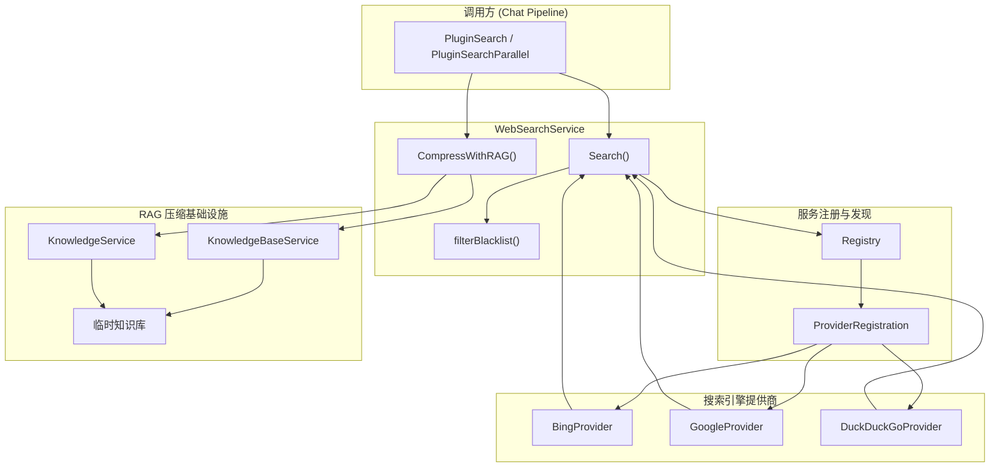

# Web Search Orchestration Service

## 模块概述

想象一下，你的 AI 助手需要回答一个关于"2024 年最新技术趋势"的问题。它的内部知识库可能只更新到 2023 年，这时候就需要"向外看"——访问实时互联网获取最新信息。`web_search_orchestration_service` 模块正是承担这个"向外看"职责的核心组件。

这个模块的本质是一个**搜索引擎聚合器与结果优化器**。它解决的问题看似简单：调用外部搜索引擎 API 获取结果。但深入后会发现几个关键挑战：

1. **多提供商适配**：不同的搜索引擎（Bing、Google、DuckDuckGo）有不同的 API 协议、认证方式和响应格式，如何让上层调用者无感知地切换？
2. **结果质量优化**：原始搜索结果往往冗余、噪声多，如何在不丢失关键信息的前提下压缩结果？
3. **与 RAG  pipeline 的无缝集成**：搜索结果需要能被向量检索系统理解，如何桥接"网页搜索结果"和"知识库检索结果"这两种不同形态的数据？

模块的设计洞察在于：**将搜索引擎视为可插拔的"数据源"，将结果压缩视为一种"临时知识入库 + 向量检索"的 RAG 过程**。这种设计让 web search 不再是孤立的 HTTP 调用，而是整个知识检索体系中的有机组成部分。

## 架构与数据流



### 架构角色解析

**WebSearchService** 是整个模块的**编排中枢**，它承担三个核心职责：

1. **提供商路由**：根据配置中的 `Provider` 字段，从注册表中解析出对应的搜索引擎实现
2. **结果后处理**：执行黑名单过滤、超时控制、结果压缩等横切关注点
3. **RAG 压缩协调**：当启用 RAG 压缩时，协调临时知识库的创建、数据入库、向量检索和结果重组

**Registry + ProviderRegistration** 构成**插件式扩展点**。每个搜索引擎提供商在系统启动时向注册表注册自己的工厂函数，`WebSearchService` 通过依赖注入获取所有可用提供商。这种设计使得添加新搜索引擎（比如百度、搜狗）只需实现 `WebSearchProvider` 接口并注册，无需修改核心逻辑。

**临时知识库 (TempKB)** 是模块最巧妙的设计。它不是持久化存储，而是一个** ephemeral 的向量索引缓存**。当需要对搜索结果进行 RAG 压缩时，系统会：
1. 创建一个标记为 `IsTemporary=true` 的知识库
2. 将搜索结果作为 passages 批量入库
3. 对用户问题进行向量检索
4. 检索完成后，该知识库对 UI 不可见（通过 repo 过滤隐藏）

这种设计避免了为 web search 单独实现一套向量检索逻辑，复用了现有的知识库检索基础设施。

## 核心组件深度解析

### WebSearchService

**设计意图**：作为 web search 功能的统一入口，屏蔽底层多提供商的复杂性，提供一致的行为契约。

**核心方法**：

#### `Search(ctx, config, query)`

这是模块的**主检索入口**，被 `PluginSearch` 直接调用。方法内部执行一个清晰的流水线：

```
配置校验 → 提供商解析 → 超时包装 → 执行搜索 → 黑名单过滤 → 返回结果
```

关键设计细节：

1. **超时控制**：使用 `context.WithTimeout` 包装上下文，默认 10 秒超时。这是一个防御性设计——外部 API 调用必须设置超时，否则单个慢请求可能拖垮整个会话。

2. **提供商解析**：通过 `s.providers[config.Provider]` 进行 map 查找。这里假设 `config.Provider` 是注册表中已存在的 key，如果不存在会返回明确的错误信息。这种"快速失败"策略比静默降级更利于问题排查。

3. **黑名单过滤**：调用 `filterBlacklist()` 方法，支持两种规则格式：
   - **通配符模式**：`*://*.example.com/*`，会被转换为正则表达式 `^.*://.*\.example\.com/.*$`
   - **正则模式**：`/example\.(net|org)/`，直接作为正则匹配

   这种双模式设计兼顾了易用性（通配符更直观）和灵活性（正则更强大）。

#### `CompressWithRAG(ctx, sessionID, tempKBID, questions, webSearchResults, cfg, ...)`

这是模块的**核心创新点**——将 web 搜索结果通过 RAG 技术进行智能压缩。理解这个方法需要把握几个关键问题：

**为什么需要压缩？** 原始搜索结果可能包含 10-20 条结果，每条都有标题、摘要、内容。直接全部喂给 LLM 会：
- 消耗大量 token，增加成本
- 引入噪声，降低回答质量
- 可能超过上下文窗口限制

**为什么用 RAG 压缩而不是简单摘要？** 简单摘要是"有损压缩"——LLM 决定什么重要，可能丢失关键细节。RAG 压缩是"按需检索"——根据用户问题动态选择最相关的片段，保留原始信息的完整性。

**方法执行流程**：

```go
// 1. 复用或创建临时知识库
if tempKBID 有效 {
    尝试复用现有 KB
} else {
    创建新的临时 KB（IsTemporary=true）
}

// 2. 将搜索结果入库（按 URL 去重）
for each result {
    if URL 未见过 {
        构造 passage: [sourceUrl] + Title + Snippet + Content
        调用 CreateKnowledgeFromPassageSync 入库
        标记 URL 为已见
    }
}

// 3. 对每个问题进行向量检索
for each question {
    执行 HybridSearch(tempKBID, params)
    收集所有检索结果
}

// 4. 轮询选择 + 按 URL 聚合
selected = selectReferencesRoundRobin(rawResults, allRefs, limit)
compressed = consolidateReferencesByURL(rawResults, selected)

// 5. 返回压缩结果 + 临时 KB ID + 去重状态
return compressed, tempKBID, seenURLs, knowledgeIDs
```

**关键设计决策**：

1. **临时 KB 复用**：方法接受 `tempKBID` 参数，允许跨多次调用复用同一个临时知识库。这在多轮对话场景中很有价值——用户可能基于同一批搜索结果追问多个问题，无需重复入库。

2. **URL 去重**：使用 `seenURLs` map 跟踪已入库的 URL。这避免了同一 URL 在多次调用中被重复入库，节省存储和嵌入计算成本。

3. **轮询选择策略**：`selectReferencesRoundRobin` 方法确保检索结果在不同源 URL 之间公平分布。想象你有 5 个搜索结果源，每个源可能有多个相关片段。如果简单取 top-K，可能全部来自同一个源。轮询策略保证每个源都有机会被选中，提高结果多样性。

4. **内容标记约定**：入库时在 passage 开头添加 `[sourceUrl]: <url>` 标记。这是一个隐式契约——后续的 `extractSourceURLFromContent` 和 `stripMarker` 函数都依赖这个格式来重建 URL 与内容的关联。

#### `selectReferencesRoundRobin(raw, refs, limit)`

**算法逻辑**：

```
1. 将检索结果按 URL 分组：urlToRefs[url] = [ref1, ref2, ...]
2. 保持原始结果的 URL 顺序：order = [url1, url2, url3, ...]
3. 轮询遍历：
   round 1: 取 url1 的第 1 个，url2 的第 1 个，url3 的第 1 个
   round 2: 取 url1 的第 2 个，url2 的第 2 个，url3 的第 2 个
   ...
   直到达到 limit 或所有结果耗尽
```

**为什么不用简单 top-K？** 假设用户搜索"React vs Vue"，可能得到：
- 5 条来自 stackoverflow.com 的结果
- 3 条来自 medium.com 的结果
- 2 条来自官方文档的结果

如果直接取 top-5，可能全部来自 stackoverflow。轮询策略确保每个源都有代表，提供更平衡的视角。

#### `consolidateReferencesByURL(raw, selected)`

**目的**：将检索选中的片段重新合并回原始搜索结果结构中。

**合并策略**：
- 对于没有被选中的结果：保持原样
- 对于有选中片段的结果：将片段内容用 `\n---\n` 分隔符拼接，替换原始 `Content` 字段

这种设计保持了 `WebSearchResult` 的结构不变，上层调用者无需感知压缩过程。

### Registry 与 ProviderRegistration

**Registry** 是提供商的**服务注册表**，采用 `map[string]*ProviderRegistration` 存储。使用 `sync.RWMutex` 保证并发安全——读多写少的场景下，读锁不阻塞，写锁独占。

**ProviderRegistration** 包含：
- `Info`: 提供商元数据（名称、描述、支持的功能）
- `Factory`: 工厂函数，用于创建提供商实例

这种**工厂模式**的设计意图是延迟初始化。系统启动时只注册工厂函数，实际创建提供商实例发生在 `NewWebSearchService` 调用 `registry.CreateAllProviders()` 时。这样做的好处：
1. 避免循环依赖
2. 支持条件化创建（比如只有配置了 API Key 才创建对应提供商）
3. 便于测试（可以注入 mock 工厂）

### 搜索引擎提供商实现

三个提供商（Bing、Google、DuckDuckGo）都实现 `WebSearchProvider` 接口：

```go
type WebSearchProvider interface {
    Name() string
    Search(ctx, query, maxResults, includeDate) ([]*WebSearchResult, error)
}
```

**接口设计考量**：

1. **统一返回类型**：所有提供商返回 `[]*WebSearchResult`，屏蔽底层 API 差异。这意味着 `WebSearchResult` 必须是"最小公分母"——只包含所有提供商都支持的字段。

2. **上下文传递**：`ctx` 参数贯穿整个调用链，支持超时取消和链路追踪。

3. **参数简化**：`maxResults` 和 `includeDate` 是通用参数，提供商内部负责将其转换为各自 API 的具体参数。

**各提供商特点**：

| 提供商 | 认证方式 | 特点 |
|--------|----------|------|
| Bing | API Key | 企业级服务，稳定性高，有配额限制 |
| Google | API Key + Engine ID | 需要配置 Custom Search Engine，灵活性高 |
| DuckDuckGo | 无（HTML 解析） | 免费，但依赖 HTML 结构，稳定性较低 |

## 依赖关系分析

### 上游调用方

**PluginSearch** 和 **PluginSearchParallel** 是主要调用方，位于 `chat_pipline` 模块中。它们的使用模式：

```go
// PluginSearch 中的典型调用
results, err := p.webSearchService.Search(ctx, config, query)

// 如果需要 RAG 压缩
compressed, kbID, seenURLs, knowledgeIDs, err := p.webSearchService.CompressWithRAG(
    ctx, sessionID, tempKBID, questions, results, config,
    p.knowledgeBaseService, p.knowledgeService, seenURLs, knowledgeIDs,
)
```

**契约期望**：
1. `Search` 方法必须在超时内返回，不能阻塞
2. `CompressWithRAG` 返回的 `tempKBID` 需要被保存，以便后续调用复用
3. `seenURLs` 和 `knowledgeIDs` 是状态累积参数，调用方需要维护它们的生命周期

### 下游依赖

| 依赖模块 | 依赖内容 | 耦合程度 |
|----------|----------|----------|
| `knowledge_base_api` | `KnowledgeBaseService.CreateKnowledgeBase`, `HybridSearch` | 紧耦合（RAG 压缩必需） |
| `knowledge_and_chunk_api` | `KnowledgeService.CreateKnowledgeFromPassageSync` | 紧耦合（RAG 压缩必需） |
| `web_search_provider_implementations` | Bing/Google/DuckDuckGo 具体实现 | 松耦合（通过接口隔离） |
| `searchutil` | `ConvertWebSearchResults` 工具函数 | 松耦合（纯工具函数） |

**关键耦合点**：RAG 压缩功能强依赖于知识库服务。如果 `KnowledgeBaseService` 或 `KnowledgeService` 的接口发生变化，`CompressWithRAG` 方法需要同步调整。这种耦合是设计上的权衡——复用现有基础设施 vs 增加模块间依赖。

### 数据契约

**WebSearchConfig** 是核心配置结构，关键字段：

```go
type WebSearchConfig struct {
    Provider          string   // 必填：提供商 ID
    MaxResults        int      // 必填：最大结果数
    CompressionMethod string   // 可选：none/summary/extract/rag
    Blacklist         []string // 可选：过滤规则
    
    // RAG 压缩专用字段
    EmbeddingModelID   string // 必填（当 CompressionMethod=rag）
    DocumentFragments  int    // 可选：检索片段数，默认 3
}
```

**隐式契约**：
- 当 `CompressionMethod="rag"` 时，`EmbeddingModelID` 必须提供，否则返回错误
- `Provider` 必须是注册表中存在的 key，否则返回错误
- `Blacklist` 规则支持两种格式，调用方需要确保格式正确

## 设计决策与权衡

### 1. 临时知识库 vs 独立向量索引

**选择**：复用现有知识库基础设施，创建标记为 `IsTemporary=true` 的知识库。

**权衡**：
- ✅ **优点**：无需实现新的向量存储逻辑，复用 HybridSearch、嵌入生成等现有能力
- ✅ **优点**：临时 KB 可以通过 `IsTemporary` 标记在 UI 层过滤，对用户不可见
- ❌ **缺点**：临时 KB 仍然占用数据库记录，需要额外的清理机制（目前依赖手动或定时清理）
- ❌ **缺点**：耦合了 web search 和 knowledge base 两个模块的生命周期

**替代方案**：实现独立的内存向量索引（如使用 FAISS 或 hnswlib）。这会增加实现复杂度，但能完全解耦。当前选择反映了一个设计哲学：**优先复用，避免重复造轮子**。

### 2. 轮询选择 vs 简单 Top-K

**选择**：使用 `selectReferencesRoundRobin` 实现跨 URL 的公平分布。

**权衡**：
- ✅ **优点**：提高结果多样性，避免单一来源主导
- ✅ **优点**：在信息源质量不确定时，分散风险
- ❌ **缺点**：实现复杂度高于简单 `refs[:limit]`
- ❌ **缺点**：可能选中相关性较低的结果（为了公平性牺牲部分精度）

**适用场景**：当用户问题需要多角度信息时（如对比分析、综合评估），轮询策略更有价值。当问题非常具体、单一来源即可回答时，Top-K 可能更高效。当前设计选择通用性优先。

### 3. 同步入库 vs 异步入库

**选择**：`CreateKnowledgeFromPassageSync` 使用同步调用。

**权衡**：
- ✅ **优点**：实现简单，错误处理直接
- ✅ **优点**：调用方可以明确知道入库完成后再进行检索
- ❌ **缺点**：大量结果入库时可能阻塞请求（每条结果都需要嵌入计算）
- ❌ **缺点**：无法利用批量嵌入的优化机会

**改进空间**：未来可以考虑批量嵌入 + 异步入库，但需要处理"入库未完成时检索"的边界情况。

### 4. 黑名单过滤位置

**选择**：在 `WebSearchService.Search` 方法内部过滤，而不是在提供商层过滤。

**权衡**：
- ✅ **优点**：统一过滤逻辑，所有提供商共享同一套规则
- ✅ **优点**：过滤发生在 API 调用之后，可以基于完整 URL 判断（有些提供商返回的 URL 需要重定向后才能确定）
- ❌ **缺点**：已经为被过滤的结果支付了 API 调用成本
- ❌ **缺点**：无法减少 API 配额消耗

**替代方案**：在提供商层实现过滤（如 Bing 的 `site:` 排除语法）。但这需要每个提供商单独实现，且不是所有提供商都支持。当前选择是工程实用主义——先获取结果，再本地过滤。

## 使用指南

### 基本搜索

```go
// 1. 创建服务（通常在应用启动时）
registry := web_search.NewRegistry()
registry.Register("bing", web_search.ProviderInfo{...}, bingFactory)
registry.Register("google", web_search.ProviderInfo{...}, googleFactory)

service, err := NewWebSearchService(cfg, registry)

// 2. 执行搜索
config := &types.WebSearchConfig{
    Provider:    "bing",
    MaxResults:  10,
    IncludeDate: true,
    Blacklist:   []string{"*://*.spam.com/*"},
}

results, err := service.Search(ctx, config, "Golang 最佳实践")

// 3. 处理结果
for _, r := range results {
    fmt.Printf("标题：%s, URL: %s\n", r.Title, r.URL)
}
```

### RAG 压缩搜索

```go
// 1. 执行初始搜索
results, _ := service.Search(ctx, config, query)

// 2. 准备 RAG 压缩
var tempKBID string
var seenURLs = map[string]bool{}
var knowledgeIDs []string

questions := []string{
    "Golang 的并发模型是什么？",
    "Golang 适合哪些应用场景？",
}

ragConfig := &types.WebSearchConfig{
    Provider:         "bing",
    MaxResults:       20,  // 先获取较多结果
    CompressionMethod: "rag",
    EmbeddingModelID: "text-embedding-3-small",
    DocumentFragments: 3,  // 每个问题检索 3 个片段
}

// 3. 执行压缩
compressed, tempKBID, seenURLs, knowledgeIDs, err := service.CompressWithRAG(
    ctx, sessionID, tempKBID, questions, results, ragConfig,
    kbService, knowledgeService, seenURLs, knowledgeIDs,
)

// 4. 在后续对话中复用临时 KB
// 用户追问时，可以传入相同的 tempKBID 和 seenURLs
followupQuestions := []string{"Goroutine 和线程的区别？"}
compressed2, tempKBID, seenURLs, knowledgeIDs, _ = service.CompressWithRAG(
    ctx, sessionID, tempKBID, followupQuestions, results, ragConfig,
    kbService, knowledgeService, seenURLs, knowledgeIDs,
)
```

### 配置选项

| 配置项 | 类型 | 默认值 | 说明 |
|--------|------|--------|------|
| `Provider` | string | 必填 | 搜索引擎 ID（bing/google/duckduckgo） |
| `MaxResults` | int | 10 | 最大返回结果数 |
| `IncludeDate` | bool | false | 是否包含发布日期 |
| `CompressionMethod` | string | "none" | 压缩方法（none/rag） |
| `Blacklist` | []string | nil | URL 过滤规则 |
| `EmbeddingModelID` | string | 空 | RAG 压缩用嵌入模型（必填） |
| `DocumentFragments` | int | 3 | 每个问题检索的片段数 |
| `Timeout` | int | 10 | 搜索超时（秒），在 Config.WebSearch 中配置 |

## 边界情况与注意事项

### 1. 临时知识库泄漏

**问题**：`CompressWithRAG` 创建的临时知识库不会自动删除。如果会话异常终止或调用方未清理，会积累大量 `IsTemporary=true` 的知识库记录。

**缓解措施**：
- 调用方应在会话结束时主动清理临时 KB
- 建议实现定时任务，清理超过一定时间（如 24 小时）的临时 KB
- 监控临时 KB 数量，设置告警阈值

### 2. URL 去重状态管理

**问题**：`seenURLs` 是调用方维护的状态，如果状态丢失或不同步，可能导致重复入库或漏入库。

**建议**：
- 将 `seenURLs` 与会话 ID 绑定，确保状态一致性
- 考虑将状态持久化到 Redis 或数据库，避免内存丢失
- 在 `CompressWithRAG` 中增加幂等性保证（即使重复调用也不会重复入库）

### 3. 嵌入模型依赖

**问题**：RAG 压缩强依赖嵌入模型。如果嵌入服务不可用或配额耗尽，压缩会失败。

**当前行为**：返回错误，调用方需要处理降级（如回退到非压缩模式）。

**改进建议**：
- 在 `CompressWithRAG` 中增加降级逻辑：嵌入失败时返回原始结果
- 监控嵌入服务的可用性和延迟
- 考虑缓存嵌入结果，减少重复计算

### 4. 黑名单规则性能

**问题**：每条结果都要遍历所有黑名单规则进行匹配。如果规则很多（如 100+），可能影响性能。

**当前实现**：线性遍历 + 正则匹配，时间复杂度 O(N*M)，N=结果数，M=规则数。

**优化建议**：
- 对规则进行预编译，避免每次调用都 `regexp.MatchString`
- 使用前缀树或 Bloom Filter 加速域名匹配
- 限制黑名单规则数量（如最多 50 条）

### 5. 轮询选择的边界情况

**问题**：当某个 URL 的检索结果远多于其他 URL 时，轮询可能导致该 URL 的结果被过度采样。

**示例**：
- URL1: 10 个相关片段
- URL2: 2 个相关片段
- URL3: 1 个相关片段
- limit = 6

轮询结果：URL1(3), URL2(2), URL3(1) — URL1 被过度代表。

**当前行为**：接受这种不平衡，认为多样性优先于严格的相关性排序。

**替代方案**：按相关性分数加权采样，但实现复杂度更高。

## 相关模块参考

- [Chat Pipeline Plugins](chat_pipeline_plugins_and_flow.md) — `PluginSearch` 和 `PluginSearchParallel` 如何调用本模块
- [Knowledge Base API](knowledge_base_api.md) — 临时知识库的创建和检索接口
- [Knowledge and Chunk API](knowledge_and_chunk_api.md) — Passage 入库和嵌入生成
- [Model Providers](model_providers_and_ai_backends.md) — 嵌入模型和重排模型的提供商实现
- [Search Utility](search_result_conversion_and_normalization_utilities.md) — 搜索结果转换和标准化工具

## 扩展指南

### 添加新的搜索引擎提供商

1. 实现 `WebSearchProvider` 接口：

```go
type BaiduProvider struct {
    client *http.Client
    apiKey string
}

func (p *BaiduProvider) Name() string { return "baidu" }

func (p *BaiduProvider) Search(ctx context.Context, query string, maxResults int, includeDate bool) ([]*types.WebSearchResult, error) {
    // 调用百度 API，解析响应，转换为 WebSearchResult
}
```

2. 在注册表中注册：

```go
registry.Register("baidu", types.WebSearchProviderInfo{
    Name:        "百度",
    Description: "百度搜索",
}, func(cfg *config.Config) (interfaces.WebSearchProvider, error) {
    return &BaiduProvider{
        client: &http.Client{},
        apiKey: cfg.WebSearch.BaiduAPIKey,
    }, nil
})
```

3. 更新配置和文档，告知用户可以使用 `provider: "baidu"`

### 添加新的压缩方法

当前支持 `none` 和 `rag`。如果要添加 `summary`（LLM 摘要）：

1. 在 `Search` 方法中处理 `CompressionMethod="summary"` 分支
2. 调用 LLM 对结果进行摘要
3. 注意：LLM 摘要需要额外的 token 成本和延迟，需要权衡

## 总结

`web_search_orchestration_service` 模块的设计体现了几个核心原则：

1. **接口隔离**：通过 `WebSearchProvider` 接口屏蔽多提供商差异
2. **基础设施复用**：RAG 压缩复用知识库检索能力，避免重复实现
3. **状态外置**：`seenURLs` 和 `tempKBID` 由调用方维护，服务本身无状态
4. **防御性编程**：超时控制、错误处理、空值检查贯穿始终

理解这个模块的关键在于把握它的**双重角色**：既是搜索引擎的聚合器，也是 RAG pipeline 的入口。这种定位决定了它的设计——既要简单到能让上层无感知地调用，又要灵活到能支持复杂的压缩和优化策略。
