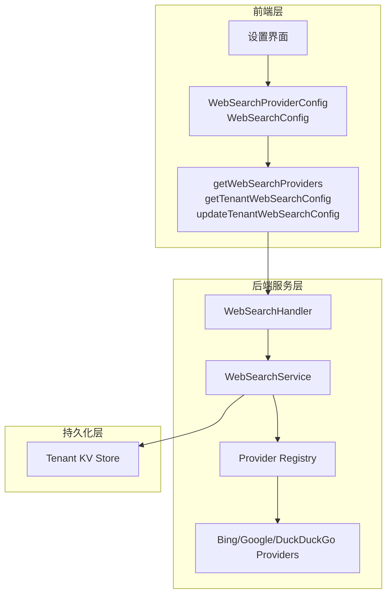

# Web Search Provider Configuration Contracts

## 概述

想象一下，你的系统需要支持多个搜索引擎（Bing、Google、DuckDuckGo），每个引擎有不同的 API 协议、认证方式和功能特性。`web_search_provider_configuration_contracts` 模块就是这个多引擎架构的"控制面板"——它定义了两套核心契约：一套描述**搜索引擎提供商本身的能力特征**（`WebSearchProviderConfig`），另一套描述**租户如何配置使用这些引擎**（`WebSearchConfig`）。这个模块存在的根本原因是：搜索引擎是典型的可插拔外部依赖，系统需要在运行时动态发现可用提供商、验证配置合法性、并持久化租户的个性化选择。如果采用硬编码方案，每次新增搜索引擎都需要修改前端代码和后端逻辑，而通过这套契约，系统实现了"注册即可用"的扩展模式。

---

## 架构与数据流



**数据流叙事**：

1. **提供商发现流程**：前端调用 `getWebSearchProviders()` → 后端 `WebSearchHandler` 委托 `WebSearchService` → 服务从 `Registry` 读取所有已注册的提供商元数据 → 转换为 `WebSearchProviderConfig` 数组返回。这是一个**只读发现**操作，不涉及租户配置。

2. **配置读取流程**：前端调用 `getTenantWebSearchConfig()` → 后端从 `TenantKV`（租户键值存储）读取当前租户的 `WebSearchConfig` → 返回包含 `provider` 字段（指向某个提供商 ID）和其他参数的配置对象。

3. **配置更新流程**：前端提交 `WebSearchConfig` → 后端验证 `provider` 字段是否在注册表中存在 → 验证 `api_key` 是否满足该提供商的 `requires_api_key` 要求 → 持久化到 `TenantKV`。

**架构角色定位**：这个模块是典型的**网关契约层**——它不实现任何业务逻辑，而是定义前后端通信的数据格式。它的设计遵循"瘦契约、厚服务"原则：契约只负责描述数据结构，复杂的验证和编排逻辑下沉到后端的 [`web_search_orchestration_registry_and_state`](#) 模块。

---

## 组件深度解析

### WebSearchProviderConfig

**设计意图**：这个接口回答"系统支持哪些搜索引擎，每个引擎有什么特征"。它是一个**能力描述符**，而非配置本身。

```typescript
export interface WebSearchProviderConfig {
  id: string                    // 提供商的唯一标识符，如 "bing", "google"
  name: string                  // 人类可读名称，用于 UI 展示
  free: boolean                 // 是否免费使用，影响 UI 提示和租户决策
  requires_api_key: boolean     // 是否需要 API 密钥，决定配置表单是否显示密钥输入框
  description?: string          // 可选描述，解释提供商的特点或限制
  api_url?: string              // 可选 API 地址，用于自定义端点场景
}
```

**内部机制**：这个接口的每个字段都对应后端 `ProviderRegistration` 的元数据。`id` 字段是关键——它作为外键被 `WebSearchConfig.provider` 引用，形成"提供商注册表 → 租户配置"的关联关系。`free` 和 `requires_api_key` 是典型的**UI 驱动字段**，它们的存在让前端可以动态渲染不同的配置界面（例如对需要 API 密钥的提供商显示警告提示）。

**设计权衡**：为什么 `api_url` 是可选的？因为大多数提供商使用固定的官方端点，硬编码在后端更安全；但对于自托管或企业代理场景，允许自定义端点提供了灵活性。这种"默认固定、可选覆盖"的模式在 SaaS 系统中很常见。

### WebSearchConfig

**设计意图**：这个接口描述租户如何**使用**搜索引擎，包含运行时所需的所有参数。它是一个**执行配置**，而非能力描述。

```typescript
export interface WebSearchConfig {
  provider: string                    // 必填，引用 WebSearchProviderConfig.id
  api_key?: string                    // 条件必填，取决于 provider.requires_api_key
  max_results: number                 // 单次搜索返回的最大结果数
  include_date: boolean               // 是否在查询中附加日期信息
  compression_method: string          // 搜索结果压缩策略（影响 token 消耗）
  blacklist: string[]                 // 域名黑名单，过滤不可信来源
  embedding_model_id?: string         // 可选，用于语义重排序的嵌入模型
  embedding_dimension?: number        // 可选，嵌入向量维度
  rerank_model_id?: string            // 可选，重排序模型 ID
  document_fragments?: number         // 可选，文档片段数量
}
```

**参数语义分析**：

- `provider` 是**外键约束**——后端会验证这个值是否在注册表中存在。如果租户选择了一个不存在的提供商，配置会被拒绝。
- `api_key` 是**条件必填**——如果选中的提供商 `requires_api_key=true`，则这个字段必须提供。这是一个跨契约的验证逻辑。
- `max_results` 和 `blacklist` 是**成本控制参数**——限制结果数量减少 API 调用开销，黑名单避免低质量来源。
- `compression_method`、`embedding_model_id`、`rerank_model_id` 是**高级优化参数**——它们连接了搜索服务与 [`embedding_interfaces_batching_and_backends`](#) 和 [`reranking_interfaces_and_backends`](#) 模块，形成"原始搜索 → 嵌入 → 重排序"的增强流水线。

**设计权衡**：为什么嵌入和重排序参数是可选的？因为基础搜索功能不依赖这些增强步骤。系统采用"渐进增强"策略：租户可以先启用基础搜索，后续再配置语义增强。这种设计降低了初始配置门槛，但增加了运行时逻辑的复杂性（服务层需要判断是否执行重排序）。

### API 函数

**getWebSearchProviders()**

```typescript
export function getWebSearchProviders() {
  return get('/api/v1/web-search/providers')
}
```

这是一个**无状态发现接口**。它不依赖租户上下文，返回所有可用提供商的元数据。典型调用时机是租户进入设置页面时，用于填充下拉选择框。

**getTenantWebSearchConfig()**

```typescript
export function getTenantWebSearchConfig() {
  return get('/api/v1/tenants/kv/web-search-config')
}
```

这是一个**租户上下文接口**。路径中的 `/tenants/kv/` 表明配置存储在租户键值存储中，而非传统的关系型数据库。这种设计支持动态 schema——新增配置字段不需要数据库迁移。

**updateTenantWebSearchConfig(config)**

```typescript
export function updateTenantWebSearchConfig(config: WebSearchConfig) {
  return put('/api/v1/tenants/kv/web-search-config', config)
}
```

这是一个**全量更新接口**（PUT 而非 PATCH）。这意味着每次更新都需要提交完整配置，而非仅提交变更字段。这种设计的优点是简化了后端验证逻辑（不需要合并新旧配置），缺点是增加了网络传输开销。

---

## 依赖关系分析

### 上游依赖（谁调用这个模块）

这个模块被前端的设置界面和会话初始化逻辑调用：

1. **设置界面**：读取提供商列表和当前配置，渲染表单；提交更新后的配置。
2. **会话 QA 流程**：在发起搜索前，需要读取 `WebSearchConfig` 以确定使用哪个提供商和参数。这通过 [`session_qa_and_search_request_contracts`](#) 模块间接调用。

### 下游依赖（这个模块调用谁）

这个模块通过 HTTP 客户端（`@/utils/request`）调用后端 API：

1. **WebSearchHandler**：处理 `/api/v1/web-search/providers` 和 `/api/v1/tenants/kv/web-search-config` 路由。
2. **WebSearchService**： orchestrates 提供商注册表查询和租户配置持久化。
3. **Tenant KV Store**：存储租户配置，支持动态 schema。

### 数据契约

| 方向 | 数据类型 | 来源模块 | 用途 |
|------|----------|----------|------|
| 输入 | `WebSearchConfig` | 本模块 | 租户提交配置 |
| 输出 | `WebSearchProviderConfig[]` | 本模块 | 提供商列表 |
| 输出 | `WebSearchConfig` | 本模块 | 当前配置 |
| 内部引用 | `ProviderRegistration` | `web_search_provider_registry` | 后端验证 |
| 内部引用 | `Tenant KV` | `tenant_management_repository` | 配置存储 |

---

## 设计决策与权衡

### 1. 分离"能力描述"与"执行配置"

**选择**：使用两个独立接口（`WebSearchProviderConfig` vs `WebSearchConfig`）而非合并为一个。

**原因**：这是典型的**类型安全分离**。提供商元数据是系统级的、相对静态的；租户配置是租户级的、频繁变更的。如果合并，会导致：
- 前端难以区分哪些字段是只读的（提供商特征）vs 可编辑的（租户选择）
- 后端验证逻辑复杂化（需要判断字段来源）
- API 响应膨胀（每次获取配置都附带冗余的提供商元数据）

**代价**：前端需要两次 API 调用（获取提供商列表 + 获取当前配置），增加了初始加载延迟。但这个代价通过缓存可以缓解。

### 2. 使用 KV 存储而非关系型表

**选择**：配置存储在 `/tenants/kv/web-search-config` 路径下。

**原因**：搜索配置是典型的**半结构化数据**——不同租户可能需要不同的字段（例如某些租户启用重排序，某些不启用）。KV 存储支持动态 schema，新增字段不需要数据库迁移。这与 [`tenant_core_models_and_retrieval_config`](#) 模块中的 `RetrieverEngines` 设计一致。

**代价**：失去了关系型数据库的强 schema 验证和查询能力。后端需要在应用层进行验证。

### 3. 全量更新（PUT）而非增量更新（PATCH）

**选择**：`updateTenantWebSearchConfig` 使用 PUT 方法。

**原因**：简化并发控制。如果使用 PATCH，需要处理字段合并逻辑（例如租户 A 更新了 `api_key`，同时租户 B 更新了 `max_results`，如何避免覆盖？）。PUT 强制客户端先读取最新配置，修改后提交完整对象，天然避免了部分覆盖问题。

**代价**：增加了网络传输量，且在高并发场景下可能导致"最后写入获胜"的数据丢失。生产环境通常需要配合乐观锁（ETag）使用。

### 4. 可选的增强参数

**选择**：`embedding_model_id`、`rerank_model_id` 等字段是可选的。

**原因**：支持**渐进式启用**。租户可以先配置基础搜索，验证功能正常后再启用语义增强。这降低了初始配置复杂度。

**代价**：后端服务需要处理条件逻辑（"如果配置了重排序模型，则执行重排序；否则跳过"），增加了代码分支。这与 [`retrieval_result_refinement_and_merge`](#) 模块中的插件化设计相呼应。

---

## 使用示例

### 场景 1：初始化设置页面

```typescript
// 组件挂载时加载数据
const { data: providers } = await getWebSearchProviders()
const { data: currentConfig } = await getTenantWebSearchConfig()

// 渲染提供商选择下拉框
const providerOptions = providers.map(p => ({
  value: p.id,
  label: p.name,
  disabled: !p.free && !hasBillingInfo // 付费提供商需要账单信息
}))

// 根据选中提供商动态显示 API 密钥输入框
const selectedProvider = providers.find(p => p.id === currentConfig.provider)
if (selectedProvider?.requires_api_key) {
  showApiKeyInput = true
}
```

### 场景 2：提交配置更新

```typescript
const newConfig: WebSearchConfig = {
  provider: 'bing',
  api_key: 'sk-...',  // 仅当 provider.requires_api_key=true 时需要
  max_results: 10,
  include_date: true,
  compression_method: 'summary',
  blacklist: ['spam.com', 'low-quality.org'],
  embedding_model_id: 'text-embedding-3-small',
  rerank_model_id: 'rerank-v2'
}

try {
  await updateTenantWebSearchConfig(newConfig)
  showToast('配置已保存')
} catch (error) {
  // 常见错误：provider 不存在、api_key 格式无效
  handleConfigError(error)
}
```

### 场景 3：会话中动态读取配置

```typescript
// 在 QA 流程中，从上下文获取搜索配置
const searchConfig = await getTenantWebSearchConfig()
const searchResults = await webSearchService.search(query, {
  provider: searchConfig.provider,
  maxResults: searchConfig.max_results,
  blacklist: searchConfig.blacklist
})

// 如果配置了重排序，执行增强
if (searchConfig.rerank_model_id) {
  const reranked = await rerankService.rerank(searchResults, {
    modelId: searchConfig.rerank_model_id
  })
  return reranked
}
```

---

## 边界情况与陷阱

### 1. 提供商 ID 引用失效

**问题**：租户配置了 `provider: "legacy-engine"`，但后端移除了该提供商。

**表现**：`getTenantWebSearchConfig()` 返回有效配置，但实际搜索时失败。

**缓解**：后端应在 `getWebSearchProviders()` 中过滤掉已禁用的提供商，并在 `updateTenantWebSearchConfig()` 时验证 `provider` 字段。前端应在 UI 中提示"当前配置的提供商已不可用"。

### 2. API 密钥条件验证

**问题**：租户切换到需要 API 密钥的提供商，但未提供密钥。

**表现**：后端返回 400 错误，提示"api_key is required for this provider"。

**缓解**：前端应在提交前进行客户端验证：
```typescript
if (selectedProvider.requires_api_key && !config.api_key) {
  showError('此提供商需要 API 密钥')
  return
}
```

### 3. 并发配置更新

**问题**：两个管理员同时更新配置，后提交的覆盖先提交的。

**表现**：配置意外回滚到旧值。

**缓解**：使用乐观锁。后端应在响应中返回 `etag`，客户端在更新时通过 `If-Match` 头传递：
```typescript
const { data, headers } = await getTenantWebSearchConfig()
const etag = headers.etag
await updateTenantWebSearchConfig(newConfig, { headers: { 'If-Match': etag } })
```

### 4. 敏感信息泄露

**问题**：`getTenantWebSearchConfig()` 返回的 `api_key` 可能被前端日志记录。

**表现**：API 密钥出现在浏览器控制台或日志服务中。

**缓解**：后端应在读取配置时脱敏 `api_key` 字段（例如返回 `"***"`），仅在写入时接受完整密钥。或者使用单独的"验证密钥"端点，不在配置接口中传输。

### 5. 嵌入/重排序模型不存在

**问题**：`embedding_model_id` 指向一个已被删除的模型。

**表现**：搜索流程在重排序阶段失败。

**缓解**：后端应在保存配置时验证模型 ID 是否存在（调用 [`model_catalog_repository`](#)）。前端应在模型选择下拉框中只显示可用模型。

---

## 相关模块参考

- **[web_search_orchestration_registry_and_state](#)**：后端服务层，实现提供商注册表和配置管理逻辑
- **[web_search_provider_implementations](#)**：具体提供商实现（Bing、Google、DuckDuckGo）
- **[tenant_core_models_and_retrieval_config](#)**：租户级检索引擎配置，与 WebSearchConfig 并列
- **[embedding_interfaces_batching_and_backends](#)**：嵌入模型接口，被 `embedding_model_id` 引用
- **[reranking_interfaces_and_backends](#)**：重排序接口，被 `rerank_model_id` 引用
- **[session_qa_and_search_request_contracts](#)**：会话 QA 请求契约，使用 WebSearchConfig 执行搜索
