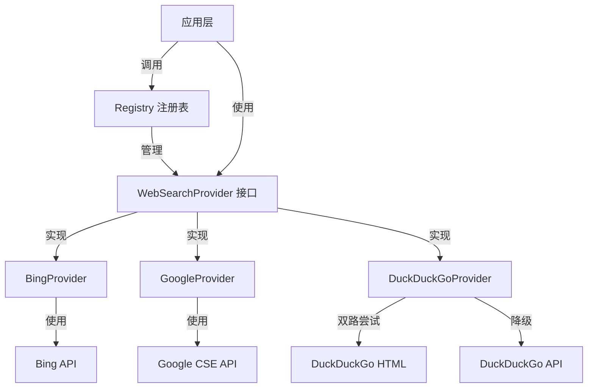

# web_search_provider_implementations 模块技术文档

## 1. 模块概述

`web_search_provider_implementations` 模块是 WeKnora 系统中的搜索服务基础设施，它提供了一个统一的接口来访问多个网络搜索引擎（Bing、Google、DuckDuckGo）。

### 为什么需要这个模块？

在构建智能问答系统时，网络搜索是获取实时信息的关键能力。但是，不同的搜索引擎有不同的 API 接口、认证方式和响应格式。这个模块的设计初衷是：

- **统一抽象**：将不同搜索引擎的差异封装在一致的接口后面
- **灵活切换**：允许系统根据可用性、成本、质量等因素选择或组合多个搜索引擎
- **易于扩展**：添加新的搜索引擎只需要实现一个简单的接口，而不需要修改调用方代码

### 核心价值

想象一下，这个模块就像是一个"搜索引擎超市"。应用程序不需要知道具体是哪个搜索引擎在工作，只需要告诉超市"我要搜索这个关键词"，超市就会从可用的供应商那里获取结果并统一包装好交付。

## 2. 架构设计

### 2.1 核心组件关系图



### 2.2 设计模式与原则

这个模块采用了几个关键的设计模式：

1. **策略模式**：每个搜索引擎都是一个独立的策略，实现相同的接口，可以互换使用
2. **工厂模式**：通过 `ProviderFactory` 和 `Registry` 来创建和管理提供商实例
3. **降级模式**：DuckDuckGoProvider 实现了优雅降级，优先使用 HTML 抓取，失败时回退到 API

### 2.3 数据流动

当应用程序需要进行网络搜索时，数据流向如下：

1. **配置阶段**：
   - 系统启动时，各个搜索引擎提供商的信息和工厂函数注册到 [Registry](web_search_orchestration_registry_and_state.md)
   - Registry 保存了提供商的元数据（是否免费、是否需要 API Key 等）

2. **搜索阶段**：
   - 应用程序从 Registry 获取可用的提供商
   - 调用 `Search()` 方法，传入查询词、最大结果数等参数
   - 提供商内部处理：构建请求 → 调用外部 API → 解析响应 → 转换为统一格式
   - 返回标准化的 `WebSearchResult` 列表

## 3. 子模块概览

本模块包含三个主要的子模块，每个子模块负责一个特定搜索引擎的实现：

- [Bing 提供商实现与响应契约](application_services_and_orchestration-retrieval_and_web_search_services-web_search_provider_implementations-bing_provider_implementation_and_response_contract.md)：详细介绍 BingProvider 的实现细节和响应结构
- [DuckDuckGo 提供商实现](application_services_and_orchestration-retrieval_and_web_search_services-web_search_provider_implementations-duckduckgo_provider_implementation.md)：深入解析 DuckDuckGoProvider 的双路搜索策略
- [Google 提供商实现](application_services_and_orchestration-retrieval_and_web_search_services-web_search_provider_implementations-google_provider_implementation.md)：讲解 GoogleProvider 的配置和使用方式

## 4. 核心组件详解

### 4.1 BingProvider

**设计意图**：提供对 Microsoft Bing 搜索 API 的封装，这是一个企业级的付费搜索服务。

**关键特性**：
- 使用环境变量 `BING_SEARCH_API_KEY` 进行认证
- 默认 10 秒超时，避免长时间阻塞
- 完整映射 Bing API 的响应结构
- 包含最后抓取时间信息

**实现细节**：
```go
// 核心流程：构建参数 → 发送请求 → 解析响应 → 转换结果
func (p *BingProvider) Search(ctx context.Context, query string, maxResults int, includeDate bool) ([]*types.WebSearchResult, error) {
    // 1. 参数验证
    // 2. 构建 HTTP 请求
    // 3. 执行请求并处理响应
    // 4. 将 Bing 特定的响应转换为通用格式
}
```

**设计权衡**：
- ✅ 选择官方 REST API 而非 SDK：减少依赖，更轻量
- ⚠️ 硬编码默认 User-Agent：为了确保 API 兼容性，但可能需要更新
- ✅ 包含完整的响应结构：虽然只使用了部分字段，但为未来扩展预留了空间

### 4.2 GoogleProvider

**设计意图**：提供对 Google Custom Search Engine (CSE) API 的封装。

**关键特性**：
- 使用 URL 格式的配置 `GOOGLE_SEARCH_API_URL`，包含 engine_id 和 api_key
- 集成官方 Google API 客户端库
- 支持设置搜索语言（默认为中文）

**独特的配置方式**：
GoogleProvider 的配置方式与其他提供商不同，它将所有配置编码在一个 URL 中：
```
https://www.googleapis.com/customsearch/v1?engine_id=YOUR_ENGINE_ID&api_key=YOUR_API_KEY
```

这种设计的优点是可以在一个配置项中包含所有必要信息，但缺点是解析逻辑稍微复杂一些。

### 4.3 DuckDuckGoProvider

**设计意图**：提供一个免费、无 API Key 要求的搜索选项，优先考虑可用性。

**这是最复杂的提供商**，因为它采用了双路策略：

1. **首选路径**：HTML 抓取 (`searchHTML`)
   - 访问 `https://html.duckduckgo.com/html/`
   - 使用 `goquery` 解析 HTML 响应
   - 优点：结果更丰富、更接近真实搜索体验
   - 缺点：依赖 HTML 结构，可能会因网站更新而失效

2. **降级路径**：Instant Answer API (`searchAPI`)
   - 访问 `https://api.duckduckgo.com/`
   - 优点：官方 API，更稳定
   - 缺点：结果通常较少，主要是即时答案

**设计亮点**：
- 实现了优雅降级：HTML 失败时自动尝试 API
- URL 清理逻辑：处理 DuckDuckGo 的重定向链接
- 标题提取：从文本中智能提取标题
- 详细的日志记录：包含 curl 命令，便于调试

**设计权衡**：
- ✅ HTML + API 双路：提高了可用性，但增加了复杂度
- ✅ 使用真实 User-Agent：减少被阻止的风险，但可能违反某些服务条款
- ⚠️ 30 秒超时：比 Bing 更长，因为 HTML 抓取可能更慢

## 5. 设计决策与权衡

### 5.1 接口设计：最小化但足够

`WebSearchProvider` 接口设计非常简洁：
```go
type WebSearchProvider interface {
    Name() string
    Search(ctx context.Context, query string, maxResults int, includeDate bool) ([]*types.WebSearchResult, error)
}
```

**为什么这样设计？**
- ✅ 简洁：只有两个方法，易于实现
- ✅ 通用：参数足够表达大多数搜索需求
- ⚠️ `includeDate` 参数在当前实现中未被充分使用：这是一个预留的扩展点

### 5.2 错误处理策略

各提供商的错误处理策略略有不同：

- **BingProvider**：快速失败，任何错误都直接返回
- **GoogleProvider**：同样快速失败
- **DuckDuckGoProvider**：尝试两种方法，只有都失败才返回错误

**设计意图**：
- 对于付费服务（Bing、Google），快速失败可以让调用方立即知道配置问题
- 对于免费服务（DuckDuckGo），优先保证可用性，即使结果质量稍差

### 5.3 配置管理：环境变量 vs 其他方式

所有提供商都使用环境变量进行配置：
- Bing：`BING_SEARCH_API_KEY`
- Google：`GOOGLE_SEARCH_API_URL`
- DuckDuckGo：无配置

**为什么选择环境变量？**
- ✅ 符合 12-Factor App 原则
- ✅ 易于在不同环境（开发、测试、生产）中切换
- ✅ 避免将密钥提交到代码仓库
- ⚠️ 没有配置验证：错误的配置会在运行时才发现

## 6. 与其他模块的关系

### 6.1 上游依赖

这个模块依赖于：
- `internal/types`：提供核心数据类型定义
- `internal/types/interfaces`：定义 `WebSearchProvider` 接口
- `internal/utils`：提供安全工具函数（如日志脱敏）

### 6.2 下游依赖

这个模块被以下模块使用：
- [web_search_orchestration_registry_and_state](web_search_orchestration_registry_and_state.md)：负责提供商的注册和管理
- [web_search_endpoint_handler](evaluation_and_web_search_handlers.md)：处理 HTTP 请求并调用搜索服务

## 7. 使用指南与注意事项

### 7.1 配置要求

- **Bing**：需要设置 `BING_SEARCH_API_KEY` 环境变量
- **Google**：需要设置 `GOOGLE_SEARCH_API_URL` 环境变量，格式为 `https://www.googleapis.com/customsearch/v1?engine_id=YOUR_ENGINE_ID&api_key=YOUR_API_KEY`
- **DuckDuckGo**：无需配置

### 7.2 常见问题与解决方案

1. **DuckDuckGo 返回结果很少或没有结果**
   - 原因：可能是 HTML 结构发生了变化，导致抓取失败
   - 解决：检查 `searchHTML` 方法中的选择器是否需要更新

2. **Google 搜索配置错误**
   - 原因：`GOOGLE_SEARCH_API_URL` 格式不正确
   - 解决：确保 URL 包含 `engine_id` 和 `api_key` 参数

3. **Bing 搜索超时**
   - 原因：网络问题或 Bing API 响应慢
   - 解决：可以考虑增加超时时间，但当前是硬编码的

### 7.3 扩展新的搜索引擎

如果需要添加新的搜索引擎提供商，只需要：

1. 创建一个新的结构体，实现 `WebSearchProvider` 接口
2. 提供 `NewXxxProvider` 工厂函数
3. 提供 `XxxProviderInfo` 函数，返回提供商元数据
4. 在注册中心中注册这个提供商

## 8. 总结

`web_search_provider_implementations` 模块是一个优秀的策略模式和工厂模式的实践案例。它通过统一的接口封装了不同搜索引擎的差异，同时保持了各自的特性和优势。

这个模块的设计体现了几个重要的软件工程原则：
- **开闭原则**：对扩展开放，对修改关闭
- **依赖倒置**：依赖抽象接口，而不是具体实现
- **高内聚低耦合**：每个提供商独立实现，互不影响

对于新加入团队的开发者，理解这个模块的关键是：不要被具体的搜索引擎实现细节所迷惑，而是要关注它如何通过统一的抽象来解决多样化的问题。
