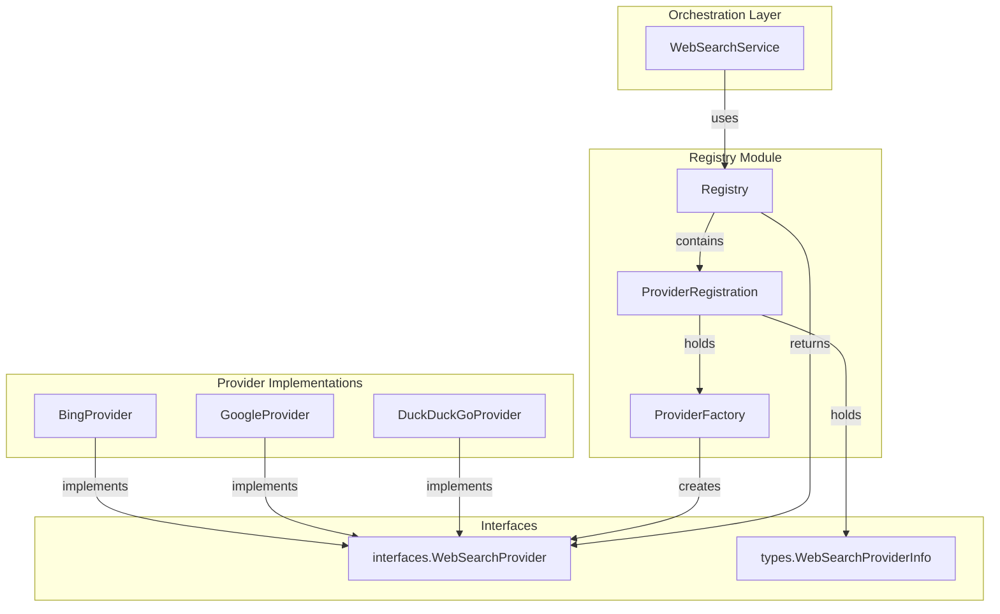

# Web Search Provider Registry 模块深度解析

## 一、模块存在的意义：为什么需要这个注册表？

想象一下，你的系统需要支持多个网络搜索后端 —— Bing、Google、DuckDuckGo，未来可能还要接入更多。每个提供商有自己的 API 密钥、速率限制、响应格式和初始化逻辑。如果让调用方直接 `new BingProvider()`，会发生什么？

1. **调用方需要知道所有提供商的存在** —— 每新增一个提供商，所有使用搜索的地方都要改代码
2. **初始化逻辑分散** —— 每个地方都要处理 API 密钥缺失、配置验证等错误
3. **无法动态发现能力** —— 系统启动时无法枚举"当前可用哪些搜索后端"
4. **测试困难** —— 想替换成 mock 提供商？改代码吧

`web_search_provider_registry` 模块的核心设计洞察是：**将"提供商的注册"与"提供商的使用"解耦**。它不是一个简单的工厂，而是一个**运行时可扩展的提供商目录**，采用**注册表模式（Registry Pattern）**配合**工厂函数**，让系统能够在启动时动态发现并初始化所有可用的搜索后端。

这个模块的关键在于：它不关心具体是哪个提供商，只关心"有一个 ID、一些元数据、一个能创建实例的工厂函数"。这种抽象让新增搜索后端变成**注册代码的添加**，而不是**调用代码的修改**。

---

## 二、架构与数据流

### 架构概览



### 核心组件角色

| 组件 | 角色 | 类比 |
|------|------|------|
| `Registry` | 提供商注册表，线程安全的内存存储 | 像机场的航班信息屏 —— 显示所有可用航班，但不负责飞行 |
| `ProviderRegistration` | 单个提供商的元数据 + 工厂函数 | 航班卡片 —— 包含航班号和登机口，但不包含飞机本身 |
| `ProviderFactory` | 延迟创建提供商实例的函数 | 登机口 —— 调用时才"生成"实际的飞机（提供商实例） |
| `WebSearchProvider` | 搜索提供商接口（定义在 [`core_domain_types_and_interfaces`](core_domain_types_and_interfaces.md)） | 飞机接口 —— 所有航班必须能起飞、降落、载客 |

### 数据流：从注册到使用

**注册阶段（系统启动时）**：
```
BingProvider 初始化代码
    ↓
调用 registry.Register(info, factory)
    ↓
Registry.providers["bing"] = &ProviderRegistration{Info, Factory}
    ↓
注册完成，提供商元数据存入内存
```

**使用阶段（运行时搜索请求）**：
```
WebSearchService 需要搜索
    ↓
调用 registry.CreateProvider("bing")
    ↓
Registry 查找 "bing" 的 ProviderRegistration
    ↓
调用 Factory() → 返回新的 BingProvider 实例
    ↓
WebSearchService 执行搜索
```

**关键设计点**：工厂函数是**每次调用都创建新实例**，而不是返回单例。这意味着：
- 每个搜索请求可以有独立的提供商实例（避免状态污染）
- 但同时也意味着每次都要重新初始化（API 客户端、HTTP 配置等）

---

## 三、组件深度解析

### 3.1 `ProviderFactory` —— 工厂函数类型

```go
type ProviderFactory func() (interfaces.WebSearchProvider, error)
```

**设计意图**：这是一个**延迟初始化**的抽象。工厂函数不立即创建提供商，而是等到真正需要时才实例化。这样做的好处：

1. **错误隔离**：如果某个提供商的 API 密钥缺失，初始化失败只影响该提供商，不会阻塞整个系统启动
2. **按需创建**：系统启动时只需注册，不必立即初始化所有提供商
3. **测试友好**：测试时可以注入返回 mock 的工厂函数

**返回值约定**：
- 成功：返回实现了 `interfaces.WebSearchProvider` 的具体实例
- 失败：返回 `nil, error`，调用方应跳过该提供商（见 `CreateAllProviders` 的实现）

**潜在陷阱**：工厂函数**每次调用都应返回新实例**。如果工厂内部缓存了实例，可能导致并发安全问题或状态污染。

---

### 3.2 `ProviderRegistration` —— 提供商注册信息

```go
type ProviderRegistration struct {
    Info    types.WebSearchProviderInfo
    Factory ProviderFactory
}
```

**字段解析**：

| 字段 | 类型 | 用途 |
|------|------|------|
| `Info` | `types.WebSearchProviderInfo` | 提供商的元数据（ID、名称、描述、能力标识等） |
| `Factory` | `ProviderFactory` | 创建实例的工厂函数 |

**设计权衡**：为什么把 `Info` 和 `Factory` 绑在一起？

- **优点**：查询元数据时无需实例化提供商（`GetAllProviderInfos` 只返回 `Info`，不调用 `Factory`）
- **缺点**：如果 `Info` 需要动态计算（如检查 API 密钥是否有效），这里无法体现

**使用场景**：
- `GetAllProviderInfos()`：前端需要展示"可用搜索后端列表"时，只读取 `Info`
- `CreateProvider()`：实际执行搜索时，调用 `Factory` 创建实例

---

### 3.3 `Registry` —— 注册表核心

```go
type Registry struct {
    providers map[string]*ProviderRegistration
    mu        sync.RWMutex
}
```

**内部结构**：
- `providers`：以提供商 ID 为键的映射表，存储注册信息
- `mu`：读写锁，保证并发安全

**为什么用 `sync.RWMutex` 而不是 `sync.Mutex`？**

这是一个典型的**读多写少**场景：
- **写操作**（`Register`）：系统启动时注册一次，之后几乎不变
- **读操作**（`GetRegistration`、`CreateProvider`、`GetAllProviderInfos`）：每次搜索请求都要读取

使用 `RWMutex` 可以让多个读操作并发执行，只在注册时加写锁。这是**性能优化**，但也是**复杂性来源**——开发者必须清楚哪些操作需要读锁、哪些需要写锁。

---

### 3.4 核心方法详解

#### `NewRegistry()`

```go
func NewRegistry() *Registry {
    return &Registry{
        providers: make(map[string]*ProviderRegistration),
    }
}
```

**设计点**：返回指针而非值。原因：
1. `Registry` 内部有 `sync.RWMutex`，值拷贝会导致锁状态不一致
2. 注册表应该是**单例**（每个进程一个），指针语义更清晰

---

#### `Register()`

```go
func (r *Registry) Register(info types.WebSearchProviderInfo, factory ProviderFactory) {
    r.mu.Lock()
    defer r.mu.Unlock()
    r.providers[info.ID] = &ProviderRegistration{
        Info:    info,
        Factory: factory,
    }
}
```

**关键行为**：
- **覆盖语义**：如果同一 ID 已注册，新注册会覆盖旧的（没有警告）
- **无验证**：不检查 `info.ID` 是否为空、`factory` 是否为 `nil`

**隐式契约**：
1. 调用方应确保 `info.ID` 唯一（通常用常量定义，如 `"bing"`, `"google"`）
2. 注册应在系统启动时完成，运行时不应频繁调用

**如果违反契约**：
- ID 冲突 → 静默覆盖，旧提供商丢失
- `factory` 为 `nil` → `CreateProvider` 时 panic

---

#### `GetRegistration()`

```go
func (r *Registry) GetRegistration(id string) (*ProviderRegistration, bool) {
    r.mu.RLock()
    defer r.mu.RUnlock()
    reg, ok := r.providers[id]
    return reg, ok
}
```

**返回模式**：Go 惯用的 `(value, ok)` 模式，避免返回 `nil` 指针导致调用方 panic。

**使用场景**：高级用法，当调用方需要直接访问 `ProviderRegistration` 的字段时（如只读取 `Info` 而不创建实例）。

---

#### `GetAllProviderInfos()`

```go
func (r *Registry) GetAllProviderInfos() []types.WebSearchProviderInfo {
    r.mu.RLock()
    defer r.mu.RUnlock()
    infos := make([]types.WebSearchProviderInfo, 0, len(r.providers))
    for _, reg := range r.providers {
        infos = append(infos, reg.Info)
    }
    return infos
}
```

**设计意图**：提供**只读视图**，让调用方无需接触 `ProviderRegistration` 内部结构。

**性能注意**：每次调用都创建新切片并复制所有 `Info`。如果提供商数量多且调用频繁，可能成为瓶颈（但通常提供商数量 < 10，可忽略）。

---

#### `CreateProvider()`

```go
func (r *Registry) CreateProvider(id string) (interfaces.WebSearchProvider, error) {
    r.mu.RLock()
    reg, ok := r.providers[id]
    r.mu.RUnlock()
    if !ok {
        return nil, fmt.Errorf("web search provider %s not registered", id)
    }
    return reg.Factory()
}
```

**锁策略分析**：
```go
r.mu.RLock()
reg, ok := r.providers[id]
r.mu.RUnlock()  // ← 关键：在调用 Factory 前释放锁
```

为什么不在持有锁的情况下调用 `Factory()`？

1. **避免死锁**：如果 `Factory` 内部间接调用了 `Registry` 的方法，会死锁
2. **减少锁竞争**：`Factory` 可能执行耗时操作（如 HTTP 请求验证 API 密钥），不应阻塞其他读操作

**错误处理**：
- 提供商未注册 → 返回明确错误
- `Factory()` 失败 → 直接透传错误（调用方决定如何处理）

---

#### `CreateAllProviders()`

```go
func (r *Registry) CreateAllProviders() (map[string]interfaces.WebSearchProvider, error) {
    r.mu.RLock()
    defer r.mu.RUnlock()

    providers := make(map[string]interfaces.WebSearchProvider)
    for id, reg := range r.providers {
        provider, err := reg.Factory()
        if err != err {
            // Skip providers that fail to initialize (e.g., missing API keys)
            continue
        }
        providers[id] = provider
    }
    return providers, nil
}
```

**设计决策**：**部分失败容忍**。如果某个提供商初始化失败（如 API 密钥缺失），跳过它而不是让整个操作失败。

**为什么返回 `nil` error？**
- 注释说明：跳过失败提供商是**预期行为**，不是错误
- 调用方通过返回的 map 大小判断有多少提供商成功初始化

**使用场景**：[`WebSearchService`](retrieval_and_web_search_services.md) 启动时初始化所有可用提供商，构建内部路由表。

**潜在问题**：
- 如果所有提供商都失败，返回空 map 但不报错，调用方可能误以为"没有注册任何提供商"
- 建议：添加日志记录跳过的提供商及原因

---

## 四、依赖关系分析

### 4.1 模块依赖（它调用谁）

| 依赖 | 类型 | 用途 |
|------|------|------|
| `internal/types.WebSearchProviderInfo` | 数据模型 | 提供商元数据结构 |
| `internal/types/interfaces.WebSearchProvider` | 接口 | 提供商能力契约 |
| `internal/types/interfaces.WebSearchService` | 接口 | 被 [`WebSearchService`](retrieval_and_web_search_services.md) 使用 |

**耦合分析**：
- 对 `WebSearchProviderInfo`：**紧耦合**，字段变更会直接影响 `ProviderRegistration`
- 对 `WebSearchProvider`：**松耦合**，只依赖接口，具体实现可自由替换
- 对 `WebSearchService`：**单向依赖**，`Registry` 不知道谁在用他

### 4.2 被谁调用（谁依赖它）

根据模块树，主要调用方：

```
application_services_and_orchestration
  └── retrieval_and_web_search_services
      ├── web_search_orchestration_service (WebSearchService)
      └── web_search_provider_registry (当前模块)
```

**调用链**：
```
HTTP Handler (WebSearchHandler)
    ↓
WebSearchService
    ↓
Registry.CreateProvider() / CreateAllProviders()
    ↓
具体提供商实现 (BingProvider, GoogleProvider, etc.)
```

**数据契约**：
- **输入**：提供商 ID（字符串）
- **输出**：`interfaces.WebSearchProvider` 实例或错误

---

## 五、设计决策与权衡

### 5.1 为什么用注册表模式而不是依赖注入？

**选择注册表的原因**：
1. **动态发现**：系统启动时可以枚举所有已注册的提供商（用于配置 UI、健康检查等）
2. **延迟初始化**：注册时不创建实例，真正使用时才初始化
3. **简单性**：Go 没有内置 DI 容器，手写注册表比引入第三方库更轻量

**代价**：
- **全局状态**：`Registry` 通常是单例，测试时需要重置
- **隐式依赖**：调用方需要知道提供商 ID，无法通过类型系统保证

**替代方案对比**：
| 方案 | 优点 | 缺点 |
|------|------|------|
| 注册表（当前） | 简单、可枚举、延迟初始化 | 全局状态、ID 字符串耦合 |
| 依赖注入 | 显式依赖、易测试 | 需要框架、启动时初始化 |
| 直接实例化 | 最简单 | 无法扩展、调用方耦合具体类型 |

---

### 5.2 为什么工厂函数返回新实例而不是单例？

**当前设计**：每次 `Factory()` 调用都创建新 `BingProvider` 实例。

**优点**：
- **无状态污染**：每个请求的提供商实例独立，避免并发修改内部状态
- **灵活配置**：可以为不同请求创建不同配置的实例（如不同 API 密钥）

**缺点**：
- **初始化开销**：每次都要重新创建 HTTP 客户端、解析配置等
- **资源泄漏风险**：如果调用方忘记释放资源（如关闭连接），可能泄漏

**优化建议**：如果性能成为瓶颈，可以在 `Factory` 内部实现**连接池**或**缓存**，但要注意并发安全。

---

### 5.3 为什么 `CreateAllProviders()` 忽略错误？

**设计意图**：**优雅降级**。系统不应因为某个提供商配置错误而完全无法启动。

**场景**：
- 开发环境：只配置了 Bing，Google API 密钥缺失 → 系统仍能工作
- 生产环境：某个提供商服务不可用 → 自动切换到其他提供商

**风险**：
- **静默失败**：运维人员可能不知道某个提供商未初始化
- **调试困难**：问题出现时难以定位是哪个提供商失败

**改进建议**：
```go
// 添加日志记录
if err != nil {
    log.Printf("Skipping provider %s: %v", id, err)
    continue
}
```

---

### 5.4 线程安全策略

**锁粒度**：
- `Register`：写锁，保护 map 写入
- `GetRegistration`、`GetAllProviderInfos`、`CreateProvider`：读锁，允许并发读取

**为什么 `CreateProvider` 在调用 Factory 前释放锁？**
```go
r.mu.RLock()
reg, ok := r.providers[id]
r.mu.RUnlock()  // ← 释放锁
if !ok { ... }
return reg.Factory()  // ← 无锁状态下调用
```

**原因**：
1. **避免死锁**：`Factory` 可能间接调用 `Registry` 方法
2. **减少竞争**：`Factory` 可能耗时（如网络请求），不应阻塞其他读操作

**风险**：如果在释放锁后、调用 `Factory` 前，另一个 goroutine 调用了 `Register` 覆盖了这个 ID，会发生什么？

**答案**：没问题。`reg` 变量已经持有旧的 `ProviderRegistration` 指针，调用的是旧工厂函数。这是**预期行为**——注册表不保证"创建时提供商仍存在"。

---

## 六、使用指南与示例

### 6.1 注册提供商

```go
// 系统启动时（如 main.go 或 init 函数）
registry := web_search.NewRegistry()

// 注册 Bing 提供商
registry.Register(
    types.WebSearchProviderInfo{
        ID:          "bing",
        Name:        "Bing Search",
        Description: "Microsoft Bing web search",
        // ... 其他元数据
    },
    func() (interfaces.WebSearchProvider, error) {
        // 从配置读取 API 密钥
        apiKey := config.WebSearch.BingAPIKey
        if apiKey == "" {
            return nil, fmt.Errorf("Bing API key not configured")
        }
        return bing.NewBingProvider(apiKey), nil
    },
)

// 注册 Google 提供商
registry.Register(
    types.WebSearchProviderInfo{ID: "google", ...},
    func() (interfaces.WebSearchProvider, error) {
        return google.NewGoogleProvider(config.WebSearch.GoogleAPIKey), nil
    },
)
```

**最佳实践**：
- 提供商 ID 用常量定义，避免硬编码字符串
- 工厂函数内处理配置验证，返回明确错误
- 注册代码集中在一个地方（如 `initRegistry()` 函数）

---

### 6.2 使用提供商

```go
// WebSearchService 内部
type WebSearchService struct {
    registry *web_search.Registry
}

func (s *WebSearchService) Search(ctx context.Context, providerID, query string) (*types.WebSearchResult, error) {
    // 创建提供商实例
    provider, err := s.registry.CreateProvider(providerID)
    if err != nil {
        return nil, err
    }
    
    // 执行搜索
    return provider.Search(ctx, query)
}
```

**注意**：每次调用 `CreateProvider` 都返回新实例，如果搜索操作是无状态的，可以考虑在 `WebSearchService` 内部缓存实例。

---

### 6.3 初始化所有提供商

```go
// WebSearchService 启动时
func (s *WebSearchService) Initialize() error {
    providers, _ := s.registry.CreateAllProviders()
    
    if len(providers) == 0 {
        log.Warn("No web search providers initialized")
        // 可以选择返回错误或继续（取决于业务需求）
    }
    
    s.providers = providers
    return nil
}
```

---

## 七、边界情况与陷阱

### 7.1 提供商 ID 冲突

**问题**：如果两个模块注册了相同 ID 的提供商，后注册的会覆盖先注册的，**无警告**。

**场景**：
```go
// 模块 A
registry.Register(types.WebSearchProviderInfo{ID: "bing"}, factoryA)

// 模块 B（后加载）
registry.Register(types.WebSearchProviderInfo{ID: "bing"}, factoryB)
// ← 模块 A 的注册被静默覆盖
```

**防护建议**：
- 提供商 ID 使用命名空间前缀，如 `"vendor.bing"`, `"vendor.google"`
- 在 `Register` 中添加检查，如果 ID 已存在则 panic 或记录错误日志

---

### 7.2 工厂函数返回 nil

**问题**：如果 `Factory` 返回 `nil, nil`（无实例无错误），`CreateProvider` 会返回 `nil`，调用方可能 panic。

**场景**：
```go
registry.Register(info, func() (interfaces.WebSearchProvider, error) {
    if config.APIKey == "" {
        return nil, nil  // ← 错误：应该返回 error
    }
    return NewProvider(), nil
})
```

**防护建议**：工厂函数**必须**在失败时返回非空 error。

---

### 7.3 并发注册

**问题**：虽然 `Register` 有锁保护，但**运行时注册**可能导致竞态条件。

**场景**：
```go
// Goroutine A
provider, _ := registry.CreateProvider("bing")

// Goroutine B（同时）
registry.Register(newInfo, newFactory)  // 覆盖 "bing"

// Goroutine A 拿到的可能是旧工厂，也可能是新工厂（取决于调度）
```

**防护建议**：
- **系统启动后禁止注册**：添加 `registry.Seal()` 方法，启动后调用，之后 `Register` panic
- **文档约定**：明确说明注册应在单线程启动阶段完成

---

### 7.4 内存泄漏风险

**问题**：`Registry` 持有所有 `ProviderRegistration`，如果提供商数量多且生命周期长，可能占用大量内存。

**场景**：动态加载插件，每个插件注册一个提供商，但插件卸载后注册未清理。

**防护建议**：
- 添加 `Unregister(id string)` 方法
- 定期清理未使用的提供商（如添加最后使用时间追踪）

---

### 7.5 错误处理不一致

**问题**：`CreateProvider` 返回错误，但 `CreateAllProviders` 忽略错误。调用方可能混淆两种行为。

**建议**：
- 统一错误处理策略（都返回错误或都忽略）
- 或在文档中明确说明差异原因

---

## 八、扩展点与修改指南

### 8.1 如何添加新搜索提供商？

1. **实现接口**：创建新类型实现 `interfaces.WebSearchProvider`
2. **编写工厂函数**：处理配置读取、验证、实例创建
3. **注册**：在系统启动代码中调用 `registry.Register()`

```go
// 1. 实现接口
type DuckDuckGoProvider struct {
    // ...
}

func (p *DuckDuckGoProvider) Search(ctx context.Context, query string) (*types.WebSearchResult, error) {
    // ...
}

// 2. 工厂函数
func NewDuckDuckGoProvider() (interfaces.WebSearchProvider, error) {
    // 验证配置
    return &DuckDuckGoProvider{}, nil
}

// 3. 注册
registry.Register(
    types.WebSearchProviderInfo{ID: "duckduckgo", Name: "DuckDuckGo"},
    NewDuckDuckGoProvider,
)
```

---

### 8.2 如何添加提供商健康检查？

当前注册表不支持健康检查。扩展方案：

```go
// 方案 1：在 ProviderRegistration 中添加健康检查函数
type ProviderRegistration struct {
    Info          types.WebSearchProviderInfo
    Factory       ProviderFactory
    HealthCheck   func() error  // ← 新增
}

// 方案 2：在 WebSearchProvider 接口中添加 HealthCheck 方法
type WebSearchProvider interface {
    Search(ctx context.Context, query string) (*types.WebSearchResult, error)
    HealthCheck(ctx context.Context) error  // ← 新增
}
```

**推荐方案 2**：健康检查是提供商能力的一部分，应在接口中定义。

---

### 8.3 如何支持提供商优先级/权重？

当前设计不支持优先级。扩展方案：

```go
type ProviderRegistration struct {
    Info      types.WebSearchProviderInfo
    Factory   ProviderFactory
    Priority  int  // ← 新增，数值越大优先级越高
}

func (r *Registry) GetProviderByPriority() []interfaces.WebSearchProvider {
    // 按优先级排序返回
}
```

---

## 九、相关模块参考

- [`WebSearchService`](retrieval_and_web_search_services.md) — 使用注册表编排搜索请求
- [`BingProvider` / `GoogleProvider` / `DuckDuckGoProvider`](retrieval_and_web_search_services.md) — 具体提供商实现
- [`WebSearchProvider` 接口](core_domain_types_and_interfaces.md) — 提供商能力契约
- [`WebSearchProviderInfo` 数据模型](core_domain_types_and_interfaces.md) — 提供商元数据结构

---

## 十、总结

`web_search_provider_registry` 是一个**小而美**的注册表模块，核心设计原则：

1. **解耦**：注册与使用分离，新增提供商无需修改调用方代码
2. **延迟初始化**：工厂函数模式，启动时注册，使用时创建
3. **线程安全**：`RWMutex` 保护并发访问，读多写少场景优化
4. **优雅降级**：`CreateAllProviders` 容忍部分失败，系统不因单个提供商错误而崩溃

**适用场景**：需要动态管理多个可插拔后端（搜索、存储、消息队列等）的系统。

**不适用场景**：需要严格依赖注入、编译时类型检查、或提供商之间有复杂依赖关系的系统。
